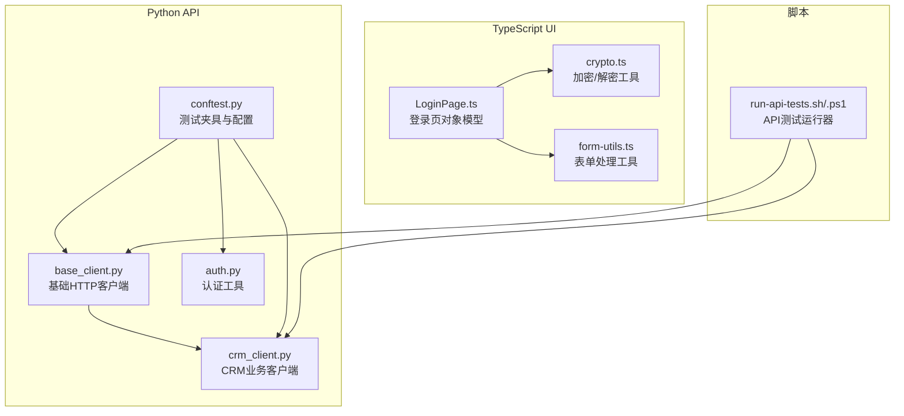
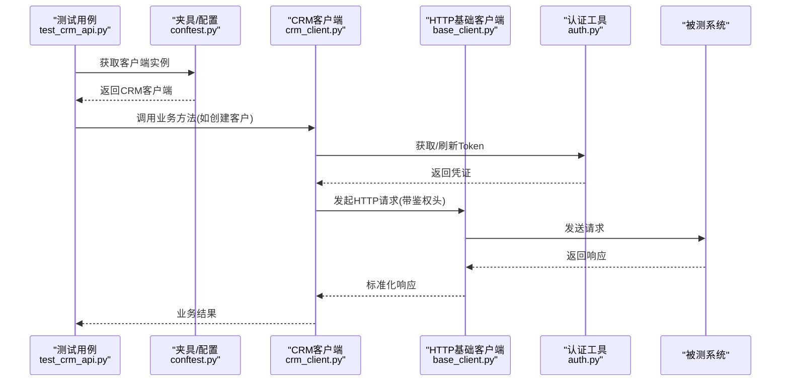
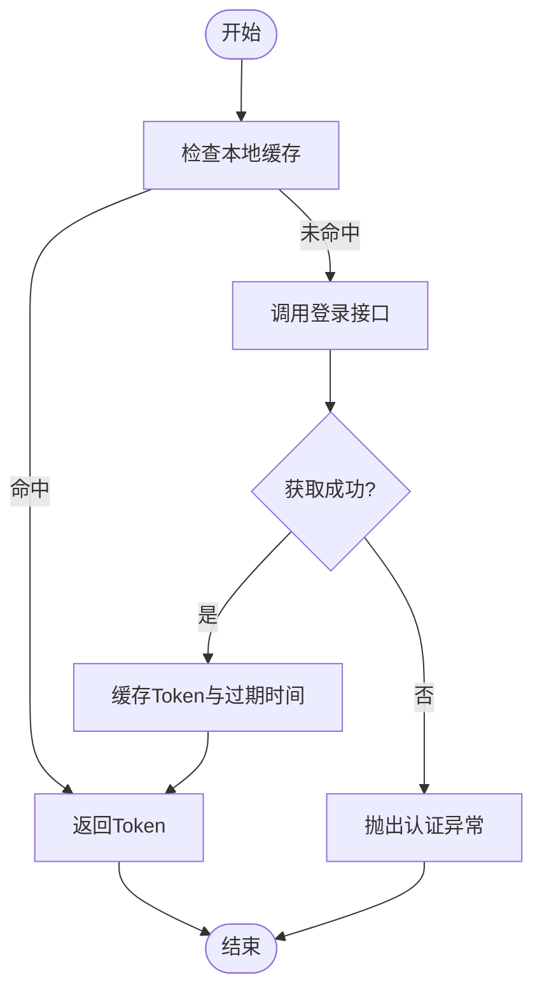
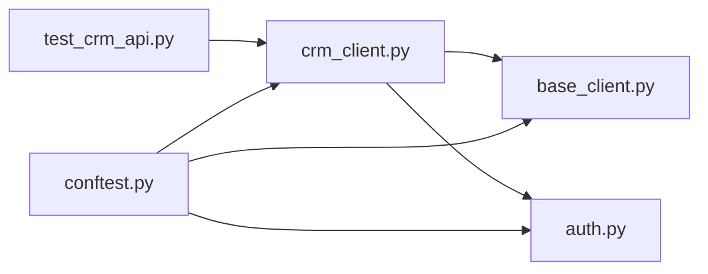

# API参考

<cite>
**本文引用的文件**   
- [tests/api/clients/base_client.py](file://tests/api/clients/base_client.py)
- [tests/api/clients/crm_client.py](file://tests/api/clients/crm_client.py)
- [tests/api/conftest.py](file://tests/api/conftest.py)
- [tests/api/testsuites/crm/test_crm_api.py](file://tests/api/testsuites/crm/test_crm_api.py)
- [tests/utils/auth.py](file://tests/utils/auth.py)
- [tests/ui/utils/crypto.ts](file://tests/ui/utils/crypto.ts)
- [tests/ui/utils/form-utils.ts](file://tests/ui/utils/form-utils.ts)
- [tests/ui/pages/LoginPage.ts](file://tests/ui/pages/LoginPage.ts)
- [scripts/run-api-tests.sh](file://scripts/run-api-tests.sh)
- [scripts/run-api-tests.ps1](file://scripts/run-api-tests.ps1)
</cite>

## 目录
1. [简介](#简介)
2. [项目结构](#项目结构)
3. [核心组件](#核心组件)
4. [架构总览](#架构总览)
5. [详细组件分析](#详细组件分析)
6. [依赖关系分析](#依赖关系分析)
7. [性能与稳定性建议](#性能与稳定性建议)
8. [故障排查指南](#故障排查指南)
9. [结论](#结论)
10. [附录](#附录)

## 简介
本API参考文档面向AutoTest Hub框架的测试客户端与工具函数，覆盖Python与TypeScript两类接口。重点包括：
- 测试客户端的HTTP请求封装、认证机制与业务方法调用
- 工具函数的数据转换、加密解密与表单处理API
- 参数说明、返回值定义与错误码参考
- 使用模式与示例路径（以源码引用代替代码片段）
- 版本兼容性与迁移指南
- API测试与调试工具推荐

## 项目结构
本项目将API自动化与UI自动化分离组织：
- Python侧：基于pytest的API测试套件，提供基础HTTP客户端与CRM领域客户端
- TypeScript侧：Playwright UI自动化，提供加密、表单等通用工具
- 脚本层：跨平台运行器用于执行API/UI/性能/安全等测试流程

图表来源
- [tests/api/clients/base_client.py](file://tests/api/clients/base_client.py)
- [tests/api/clients/crm_client.py](file://tests/api/clients/crm_client.py)
- [tests/api/conftest.py](file://tests/api/conftest.py)
- [tests/utils/auth.py](file://tests/utils/auth.py)
- [tests/ui/pages/LoginPage.ts](file://tests/ui/pages/LoginPage.ts)
- [tests/ui/utils/crypto.ts](file://tests/ui/utils/crypto.ts)
- [tests/ui/utils/form-utils.ts](file://tests/ui/utils/form-utils.ts)
- [scripts/run-api-tests.sh](file://scripts/run-api-tests.sh)
- [scripts/run-api-tests.ps1](file://scripts/run-api-tests.ps1)

章节来源
- [tests/api/clients/base_client.py](file://tests/api/clients/base_client.py)
- [tests/api/clients/crm_client.py](file://tests/api/clients/crm_client.py)
- [tests/api/conftest.py](file://tests/api/conftest.py)
- [tests/utils/auth.py](file://tests/utils/auth.py)
- [tests/ui/utils/crypto.ts](file://tests/ui/utils/crypto.ts)
- [tests/ui/utils/form-utils.ts](file://tests/ui/utils/form-utils.ts)
- [tests/ui/pages/LoginPage.ts](file://tests/ui/pages/LoginPage.ts)
- [scripts/run-api-tests.sh](file://scripts/run-api-tests.sh)
- [scripts/run-api-tests.ps1](file://scripts/run-api-tests.ps1)

## 核心组件
本节概述关键公共接口与扩展点，便于快速定位与集成。

- Python HTTP基础客户端
  - 职责：统一封装HTTP请求、重试、超时、鉴权头注入、响应标准化
  - 典型能力：GET/POST/PUT/DELETE、会话保持、错误映射、日志记录
  - 扩展点：自定义拦截器、异常类型、重试策略、代理设置
  - 参考实现路径：[tests/api/clients/base_client.py](file://tests/api/clients/base_client.py)

- CRM业务客户端
  - 职责：在基础客户端之上封装CRM域方法（如客户、商机、报价等）
  - 典型能力：CRUD操作、批量导入导出、状态机流转、幂等控制
  - 扩展点：新增实体方法、校验规则、结果转换器
  - 参考实现路径：[tests/api/clients/crm_client.py](file://tests/api/clients/crm_client.py)

- 认证工具
  - 职责：生成Token、刷新令牌、签名计算、凭据管理
  - 典型能力：登录获取凭证、自动续期、多租户支持
  - 参考实现路径：[tests/utils/auth.py](file://tests/utils/auth.py)

- TypeScript加密/解密工具
  - 职责：对称/非对称加解密、哈希摘要、密钥管理
  - 典型能力：AES/RSA、Base64编解码、盐值处理
  - 参考实现路径：[tests/ui/utils/crypto.ts](file://tests/ui/utils/crypto.ts)

- TypeScript表单处理工具
  - 职责：表单序列化、字段校验、动态控件交互
  - 典型能力：JSON序列化、文件上传、下拉选择、富文本输入
  - 参考实现路径：[tests/ui/utils/form-utils.ts](file://tests/ui/utils/form-utils.ts)

- 登录页面对象模型
  - 职责：封装登录页交互流程，驱动认证与后续操作
  - 典型能力：输入账号密码、点击登录、等待跳转、断言成功
  - 参考实现路径：[tests/ui/pages/LoginPage.ts](file://tests/ui/pages/LoginPage.ts)

- 测试夹具与配置
  - 职责：集中管理环境配置、共享客户端实例、测试数据准备
  - 典型能力：pytest fixtures、全局初始化、清理
  - 参考实现路径：[tests/api/conftest.py](file://tests/api/conftest.py)

章节来源
- [tests/api/clients/base_client.py](file://tests/api/clients/base_client.py)
- [tests/api/clients/crm_client.py](file://tests/api/clients/crm_client.py)
- [tests/utils/auth.py](file://tests/utils/auth.py)
- [tests/ui/utils/crypto.ts](file://tests/ui/utils/crypto.ts)
- [tests/ui/utils/form-utils.ts](file://tests/ui/utils/form-utils.ts)
- [tests/ui/pages/LoginPage.ts](file://tests/ui/pages/LoginPage.ts)
- [tests/api/conftest.py](file://tests/api/conftest.py)

## 架构总览
下图展示API测试的整体调用链：从测试用例到业务客户端，再到基础HTTP客户端与外部系统；同时体现认证与工具模块的协作。

图表来源
- [tests/api/testsuites/crm/test_crm_api.py](file://tests/api/testsuites/crm/test_crm_api.py)
- [tests/api/conftest.py](file://tests/api/conftest.py)
- [tests/api/clients/crm_client.py](file://tests/api/clients/crm_client.py)
- [tests/api/clients/base_client.py](file://tests/api/clients/base_client.py)
- [tests/utils/auth.py](file://tests/utils/auth.py)

## 详细组件分析

### Python HTTP基础客户端（base_client）
- 设计要点
  - 统一入口：提供get/post/put/delete等方法，内部复用连接池与重试逻辑
  - 鉴权注入：通过中间件或请求钩子自动附加Authorization头
  - 错误映射：将网络异常、超时、HTTP状态码转换为统一异常类型
  - 可观测性：结构化日志、耗时统计、请求ID透传
- 扩展点
  - 自定义重试策略（指数退避、固定间隔）
  - 自定义拦截器（请求/响应修改、审计）
  - 代理与TLS配置
- 使用模式
  - 在夹具中初始化并注入到测试类
  - 业务客户端继承或直接组合基础客户端
- 参考实现路径
  - [tests/api/clients/base_client.py](file://tests/api/clients/base_client.py)

章节来源
- [tests/api/clients/base_client.py](file://tests/api/clients/base_client.py)

### CRM业务客户端（crm_client）
- 设计要点
  - 领域建模：围绕CRM实体（客户、联系人、商机、报价等）提供方法
  - 参数校验：入参格式、必填项、枚举值校验
  - 结果转换：将HTTP响应转为领域对象，便于断言
- 常见方法族
  - 客户管理：创建、更新、删除、查询、分页列表
  - 商机管理：阶段推进、概率调整、关闭/赢单
  - 报价管理：生成、审批、归档
- 参考实现路径
  - [tests/api/clients/crm_client.py](file://tests/api/clients/crm_client.py)

章节来源
- [tests/api/clients/crm_client.py](file://tests/api/clients/crm_client.py)

### 认证工具（auth）
- 设计要点
  - 凭证生命周期：登录获取、缓存、过期前刷新
  - 多租户：按租户隔离凭据
  - 安全：敏感信息不落盘，内存持有
- 典型流程

图表来源
- [tests/utils/auth.py](file://tests/utils/auth.py)

章节来源
- [tests/utils/auth.py](file://tests/utils/auth.py)

### TypeScript加密/解密工具（crypto）
- 功能范围
  - 对称加密/解密（如AES）
  - 非对称加密/解密（如RSA）
  - 哈希摘要（SHA-256等）
  - Base64编解码
- 使用场景
  - 敏感字段传输前加密
  - 签名验证
  - 本地缓存数据保护
- 参考实现路径
  - [tests/ui/utils/crypto.ts](file://tests/ui/utils/crypto.ts)

章节来源
- [tests/ui/utils/crypto.ts](file://tests/ui/utils/crypto.ts)

### TypeScript表单处理工具（form-utils）
- 功能范围
  - 表单序列化（含文件、多选、日期等）
  - 字段校验（前端规则与后端规则对齐）
  - 动态控件交互（级联选择、条件显示）
- 使用场景
  - 批量录入、复杂表单提交
  - 与UI自动化结合进行端到端验证
- 参考实现路径
  - [tests/ui/utils/form-utils.ts](file://tests/ui/utils/form-utils.ts)

章节来源
- [tests/ui/utils/form-utils.ts](file://tests/ui/utils/form-utils.ts)

### 登录页面对象模型（LoginPage）
- 职责
  - 封装登录页交互：输入、点击、等待、断言
  - 与认证工具联动，完成登录后状态保持
- 参考实现路径
  - [tests/ui/pages/LoginPage.ts](file://tests/ui/pages/LoginPage.ts)

章节来源
- [tests/ui/pages/LoginPage.ts](file://tests/ui/pages/LoginPage.ts)

### 测试夹具与配置（conftest）
- 职责
  - 提供pytest fixtures，集中初始化CRM客户端、HTTP客户端、认证上下文
  - 管理测试数据准备与清理
- 参考实现路径
  - [tests/api/conftest.py](file://tests/api/conftest.py)

章节来源
- [tests/api/conftest.py](file://tests/api/conftest.py)

### 测试用例示例（CRM API）
- 说明
  - 演示如何调用CRM客户端方法进行端到端验证
  - 包含正常路径、异常路径与边界条件
- 参考实现路径
  - [tests/api/testsuites/crm/test_crm_api.py](file://tests/api/testsuites/crm/test_crm_api.py)

章节来源
- [tests/api/testsuites/crm/test_crm_api.py](file://tests/api/testsuites/crm/test_crm_api.py)

## 依赖关系分析
- 模块耦合
  - crm_client依赖base_client与auth
  - conftest聚合并注入上述模块
  - test_crm_api仅依赖crm_client，保持低耦合
- 外部依赖
  - HTTP库（如requests/httpx）、加密库（如cryptography/pycryptodome）、浏览器自动化（Playwright）
- 潜在循环依赖
  - 避免crm_client反向依赖测试用例
  - 将通用能力下沉至utils与clients层

图表来源
- [tests/api/testsuites/crm/test_crm_api.py](file://tests/api/testsuites/crm/test_crm_api.py)
- [tests/api/clients/crm_client.py](file://tests/api/clients/crm_client.py)
- [tests/api/clients/base_client.py](file://tests/api/clients/base_client.py)
- [tests/utils/auth.py](file://tests/utils/auth.py)
- [tests/api/conftest.py](file://tests/api/conftest.py)

章节来源
- [tests/api/testsuites/crm/test_crm_api.py](file://tests/api/testsuites/crm/test_crm_api.py)
- [tests/api/clients/crm_client.py](file://tests/api/clients/crm_client.py)
- [tests/api/clients/base_client.py](file://tests/api/clients/base_client.py)
- [tests/utils/auth.py](file://tests/utils/auth.py)
- [tests/api/conftest.py](file://tests/api/conftest.py)

## 性能与稳定性建议
- HTTP客户端
  - 启用连接复用与合理超时；对慢接口采用指数退避重试
  - 限制并发度，避免压测时打满目标系统
- 认证
  - 缓存Token并在过期前主动刷新，减少登录开销
- 数据准备
  - 预置最小必要数据，避免全量重建
- 日志与指标
  - 记录关键路径耗时与失败率，便于定位瓶颈

## 故障排查指南
- 常见问题
  - 认证失败：检查凭据有效期、签名算法、时区差异
  - 网络异常：确认代理、证书、DNS解析
  - 表单提交失败：核对字段名、类型、必填项
- 定位手段
  - 开启HTTP客户端详细日志
  - 使用抓包工具（如Charles/Fiddler/Wireshark）
  - 在夹具中输出请求/响应摘要
- 参考实现路径
  - [tests/api/clients/base_client.py](file://tests/api/clients/base_client.py)
  - [tests/utils/auth.py](file://tests/utils/auth.py)
  - [tests/ui/utils/form-utils.ts](file://tests/ui/utils/form-utils.ts)

章节来源
- [tests/api/clients/base_client.py](file://tests/api/clients/base_client.py)
- [tests/utils/auth.py](file://tests/utils/auth.py)
- [tests/ui/utils/form-utils.ts](file://tests/ui/utils/form-utils.ts)

## 结论
本参考文档梳理了AutoTest Hub框架在Python与TypeScript侧的关键API与扩展点，提供了调用序列、依赖关系与排障建议。建议在团队内统一遵循现有客户端与工具规范，逐步沉淀领域方法与最佳实践，以提升自动化质量与可维护性。

## 附录

### 运行与调试
- 运行API测试
  - Linux/macOS：[scripts/run-api-tests.sh](file://scripts/run-api-tests.sh)
  - Windows PowerShell：[scripts/run-api-tests.ps1](file://scripts/run-api-tests.ps1)
- 调试建议
  - 使用pytest的-v/-s/--tb=short等选项提升可读性
  - 针对单个用例聚焦调试，减少干扰

章节来源
- [scripts/run-api-tests.sh](file://scripts/run-api-tests.sh)
- [scripts/run-api-tests.ps1](file://scripts/run-api-tests.ps1)