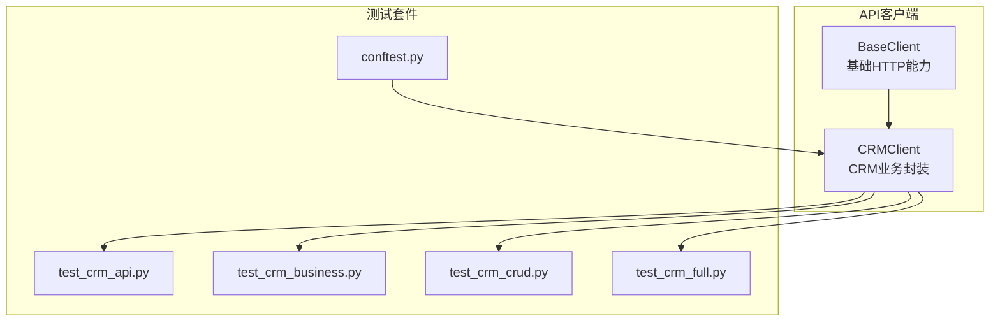
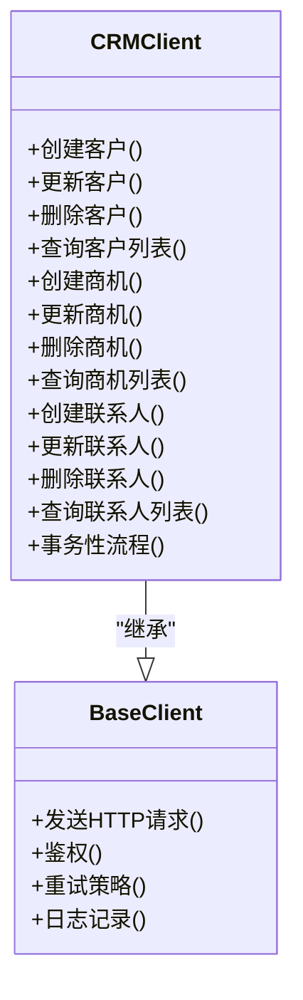
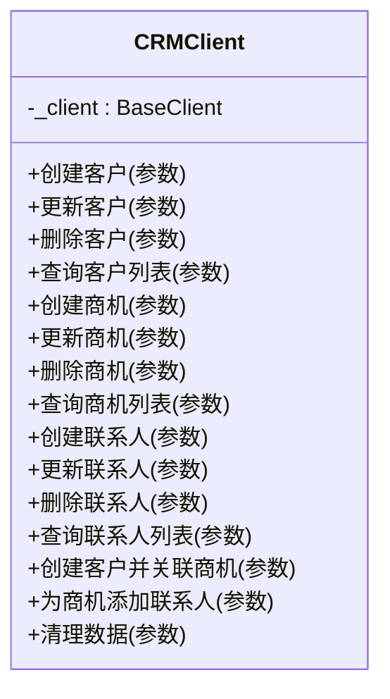
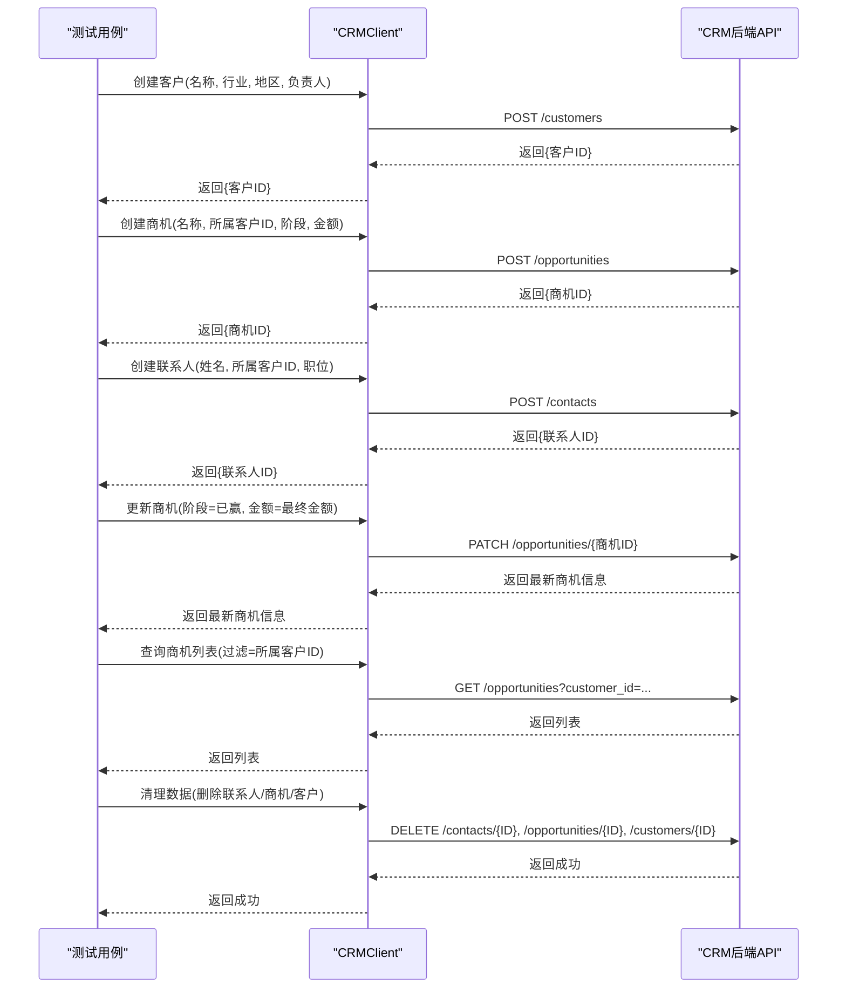
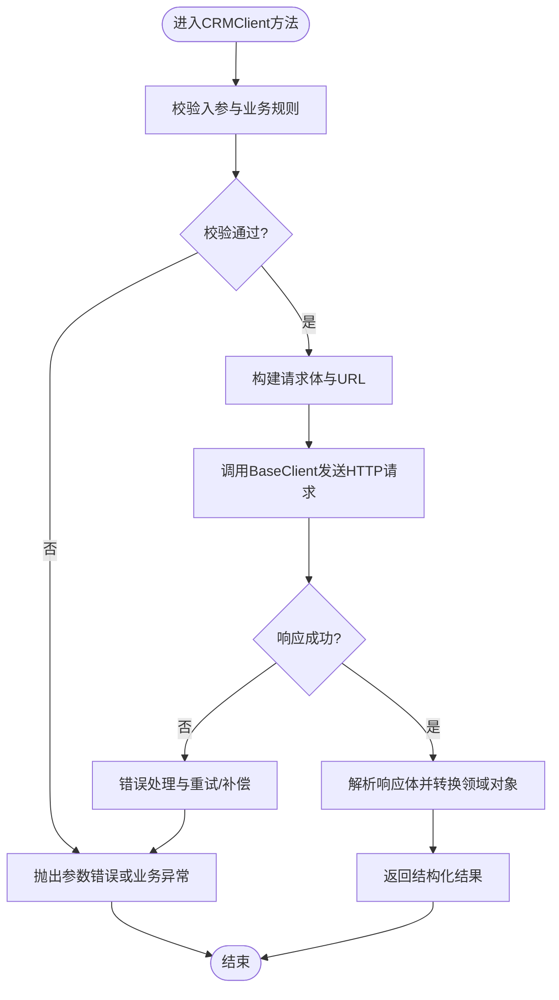
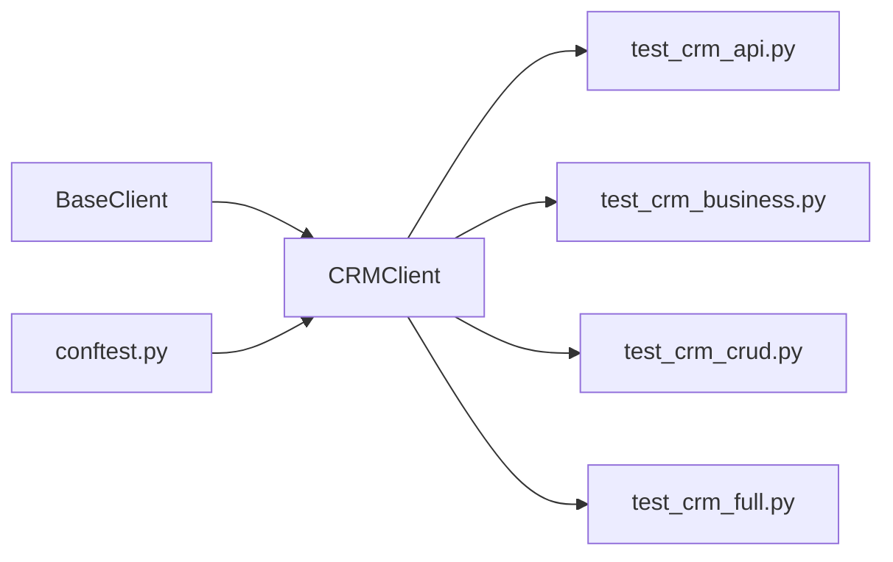

# CRM业务客户端API

<cite>
**本文引用的文件**   
- [base_client.py](file://tests/api/clients/base_client.py)
- [crm_client.py](file://tests/api/clients/crm_client.py)
- [test_crm_api.py](file://tests/api/testsuites/crm/test_crm_api.py)
- [test_crm_business.py](file://tests/api/testsuites/crm/test_crm_business.py)
- [test_crm_crud.py](file://tests/api/testsuites/crm/test_crm_crud.py)
- [test_crm_full.py](file://tests/api/testsuites/crm/test_crm_full.py)
- [conftest.py](file://tests/api/conftest.py)
</cite>

## 目录
1. [简介](#简介)
2. [项目结构](#项目结构)
3. [核心组件](#核心组件)
4. [架构总览](#架构总览)
5. [详细组件分析](#详细组件分析)
6. [依赖关系分析](#依赖关系分析)
7. [性能考虑](#性能考虑)
8. [故障排查指南](#故障排查指南)
9. [结论](#结论)
10. [附录](#附录)

## 简介
本文件为CRM业务客户端（CRMClient）的API参考文档，聚焦于客户管理、商机管理、联系人管理等业务CRUD接口。文档覆盖：
- 与BaseClient的继承关系与扩展点
- 各业务方法的参数定义、请求体格式、响应数据结构
- 业务逻辑封装与数据处理流程
- 复杂业务流程测试示例
- 错误处理与事务管理的最佳实践

## 项目结构
与CRMClient相关的代码主要位于tests/api/clients目录下，并通过testsuites/crm中的用例进行验证与使用。

图表来源
- [base_client.py](file://tests/api/clients/base_client.py)
- [crm_client.py](file://tests/api/clients/crm_client.py)
- [test_crm_api.py](file://tests/api/testsuites/crm/test_crm_api.py)
- [test_crm_business.py](file://tests/api/testsuites/crm/test_crm_business.py)
- [test_crm_crud.py](file://tests/api/testsuites/crm/test_crm_crud.py)
- [test_crm_full.py](file://tests/api/testsuites/crm/test_crm_full.py)
- [conftest.py](file://tests/api/conftest.py)

章节来源
- [base_client.py](file://tests/api/clients/base_client.py)
- [crm_client.py](file://tests/api/clients/crm_client.py)
- [test_crm_api.py](file://tests/api/testsuites/crm/test_crm_api.py)
- [test_crm_business.py](file://tests/api/testsuites/crm/test_crm_business.py)
- [test_crm_crud.py](file://tests/api/testsuites/crm/test_crm_crud.py)
- [test_crm_full.py](file://tests/api/testsuites/crm/test_crm_full.py)
- [conftest.py](file://tests/api/conftest.py)

## 核心组件
- BaseClient：提供统一的HTTP请求能力、鉴权、重试、日志等通用能力，作为所有业务客户端的基础。
- CRMClient：在BaseClient之上封装CRM领域方法，包括客户、商机、联系人等资源的增删改查与批量操作，以及跨资源的事务性流程封装。

章节来源
- [base_client.py](file://tests/api/clients/base_client.py)
- [crm_client.py](file://tests/api/clients/crm_client.py)

## 架构总览
CRMClient通过继承BaseClient复用网络层能力，并在上层实现CRM领域的业务编排。测试套件通过pytest夹具注入CRMClient实例，驱动端到端或单元级验证。

图表来源
- [base_client.py](file://tests/api/clients/base_client.py)
- [crm_client.py](file://tests/api/clients/crm_client.py)

## 详细组件分析

### CRMClient类设计
CRMClient围绕CRM三大实体（客户、商机、联系人）提供一致的CRUD接口，并支持按条件筛选、分页、排序等常见查询能力。同时提供组合型方法以简化典型业务流程。

图表来源
- [crm_client.py](file://tests/api/clients/crm_client.py)

章节来源
- [crm_client.py](file://tests/api/clients/crm_client.py)

### 基类继承与扩展点
- 继承关系：CRMClient继承BaseClient，复用统一请求、鉴权、重试、日志等能力。
- 扩展点：
  - 自定义请求头与签名：可在CRMClient中覆写或包装BaseClient的请求构造过程。
  - 业务重试与幂等：对特定接口增加幂等键或重试策略。
  - 数据校验与转换：在CRMClient中对入参进行领域校验与标准化。
  - 事务边界：在CRMClient中组织多步操作的原子性与回滚策略。

章节来源
- [base_client.py](file://tests/api/clients/base_client.py)
- [crm_client.py](file://tests/api/clients/crm_client.py)

### 业务方法API参考

说明：以下字段描述基于CRMClient的实现与测试用例的使用方式归纳。具体字段名与约束请以实际源码为准。

#### 客户管理
- 创建客户
  - 方法：创建客户
  - 输入参数
    - 名称：必填
    - 行业：可选
    - 地区：可选
    - 负责人：可选
    - 备注：可选
  - 请求体格式
    - JSON对象，包含上述字段
  - 响应数据结构
    - 状态码：成功返回2xx
    - 数据体：包含客户ID、创建时间等元信息
  - 异常与错误码
    - 参数缺失：返回4xx
    - 重复名称：返回冲突错误
    - 服务异常：返回5xx

- 更新客户
  - 方法：更新客户
  - 输入参数
    - 客户ID：必填
    - 可更新字段：名称、行业、地区、负责人、备注等
  - 请求体格式
    - JSON对象，仅包含需要更新的字段
  - 响应数据结构
    - 状态码：成功返回2xx
    - 数据体：返回最新客户信息

- 删除客户
  - 方法：删除客户
  - 输入参数
    - 客户ID：必填
  - 响应数据结构
    - 状态码：成功返回2xx或204
    - 数据体：无或确认信息

- 查询客户列表
  - 方法：查询客户列表
  - 输入参数
    - 分页：页码、每页条数
    - 过滤：名称、行业、地区、负责人等
    - 排序：字段、方向
  - 响应数据结构
    - 状态码：成功返回2xx
    - 数据体：列表、总数、分页信息

章节来源
- [crm_client.py](file://tests/api/clients/crm_client.py)
- [test_crm_crud.py](file://tests/api/testsuites/crm/test_crm_crud.py)

#### 商机管理
- 创建商机
  - 方法：创建商机
  - 输入参数
    - 名称：必填
    - 所属客户ID：必填
    - 阶段：可选
    - 预计金额：可选
    - 预计成交日期：可选
    - 负责人：可选
    - 备注：可选
  - 请求体格式
    - JSON对象，包含上述字段
  - 响应数据结构
    - 状态码：成功返回2xx
    - 数据体：包含商机ID、创建时间等元信息

- 更新商机
  - 方法：更新商机
  - 输入参数
    - 商机ID：必填
    - 可更新字段：阶段、金额、日期、负责人、备注等
  - 请求体格式
    - JSON对象，仅包含需要更新的字段
  - 响应数据结构
    - 状态码：成功返回2xx
    - 数据体：返回最新商机信息

- 删除商机
  - 方法：删除商机
  - 输入参数
    - 商机ID：必填
  - 响应数据结构
    - 状态码：成功返回2xx或204

- 查询商机列表
  - 方法：查询商机列表
  - 输入参数
    - 分页：页码、每页条数
    - 过滤：名称、所属客户ID、阶段、负责人等
    - 排序：字段、方向
  - 响应数据结构
    - 状态码：成功返回2xx
    - 数据体：列表、总数、分页信息

章节来源
- [crm_client.py](file://tests/api/clients/crm_client.py)
- [test_crm_crud.py](file://tests/api/testsuites/crm/test_crm_crud.py)

#### 联系人管理
- 创建联系人
  - 方法：创建联系人
  - 输入参数
    - 姓名：必填
    - 所属客户ID：必填
    - 职位：可选
    - 电话：可选
    - 邮箱：可选
    - 备注：可选
  - 请求体格式
    - JSON对象，包含上述字段
  - 响应数据结构
    - 状态码：成功返回2xx
    - 数据体：包含联系人ID、创建时间等元信息

- 更新联系人
  - 方法：更新联系人
  - 输入参数
    - 联系人ID：必填
    - 可更新字段：职位、电话、邮箱、备注等
  - 请求体格式
    - JSON对象，仅包含需要更新的字段
  - 响应数据结构
    - 状态码：成功返回2xx
    - 数据体：返回最新联系人信息

- 删除联系人
  - 方法：删除联系人
  - 输入参数
    - 联系人ID：必填
  - 响应数据结构
    - 状态码：成功返回2xx或204

- 查询联系人列表
  - 方法：查询联系人列表
  - 输入参数
    - 分页：页码、每页条数
    - 过滤：姓名、所属客户ID、职位等
    - 排序：字段、方向
  - 响应数据结构
    - 状态码：成功返回2xx
    - 数据体：列表、总数、分页信息

章节来源
- [crm_client.py](file://tests/api/clients/crm_client.py)
- [test_crm_crud.py](file://tests/api/testsuites/crm/test_crm_crud.py)

### 复杂业务流程示例
以下为典型CRM流程的调用序列，展示如何组合多个CRUD方法完成端到端业务闭环。

图表来源
- [test_crm_full.py](file://tests/api/testsuites/crm/test_crm_full.py)
- [test_crm_business.py](file://tests/api/testsuites/crm/test_crm_business.py)
- [test_crm_api.py](file://tests/api/testsuites/crm/test_crm_api.py)
- [crm_client.py](file://tests/api/clients/crm_client.py)

章节来源
- [test_crm_full.py](file://tests/api/testsuites/crm/test_crm_full.py)
- [test_crm_business.py](file://tests/api/testsuites/crm/test_crm_business.py)
- [test_crm_api.py](file://tests/api/testsuites/crm/test_crm_api.py)
- [crm_client.py](file://tests/api/clients/crm_client.py)

### 数据处理流程与业务逻辑封装
- 入参校验：CRMClient在调用前对必填字段、类型与范围进行校验，减少无效请求。
- 数据标准化：将外部输入转换为内部标准结构，确保一致性。
- 幂等与重试：对写入操作增加幂等键；对瞬时失败采用指数退避重试。
- 事务边界：对多步操作（如“创建客户并关联商机”）封装为单一方法，保证原子性或提供补偿步骤。
- 结果解析：统一解析响应体，提取关键数据并转换为领域对象。

图表来源
- [crm_client.py](file://tests/api/clients/crm_client.py)
- [base_client.py](file://tests/api/clients/base_client.py)

章节来源
- [crm_client.py](file://tests/api/clients/crm_client.py)
- [base_client.py](file://tests/api/clients/base_client.py)

### 错误处理与事务管理最佳实践
- 错误分类
  - 客户端错误（4xx）：参数校验失败、权限不足、资源不存在
  - 服务端错误（5xx）：超时、内部异常、依赖服务不可用
- 重试策略
  - 针对幂等读请求可快速重试
  - 针对幂等写请求需携带幂等键并限制最大重试次数
- 事务管理
  - 多步写操作封装为事务方法，失败时执行补偿或删除
  - 明确事务边界与回滚策略，避免部分成功导致的数据不一致
- 日志与追踪
  - 记录关键请求与响应摘要，便于定位问题
  - 为每个业务方法生成唯一追踪ID，贯穿上下游

章节来源
- [crm_client.py](file://tests/api/clients/crm_client.py)
- [base_client.py](file://tests/api/clients/base_client.py)

## 依赖关系分析
CRMClient依赖BaseClient提供的网络与通用能力，测试套件通过夹具注入CRMClient实例，形成清晰的解耦结构。

图表来源
- [base_client.py](file://tests/api/clients/base_client.py)
- [crm_client.py](file://tests/api/clients/crm_client.py)
- [test_crm_api.py](file://tests/api/testsuites/crm/test_crm_api.py)
- [test_crm_business.py](file://tests/api/testsuites/crm/test_crm_business.py)
- [test_crm_crud.py](file://tests/api/testsuites/crm/test_crm_crud.py)
- [test_crm_full.py](file://tests/api/testsuites/crm/test_crm_full.py)
- [conftest.py](file://tests/api/conftest.py)

章节来源
- [base_client.py](file://tests/api/clients/base_client.py)
- [crm_client.py](file://tests/api/clients/crm_client.py)
- [test_crm_api.py](file://tests/api/testsuites/crm/test_crm_api.py)
- [test_crm_business.py](file://tests/api/testsuites/crm/test_crm_business.py)
- [test_crm_crud.py](file://tests/api/testsuites/crm/test_crm_crud.py)
- [test_crm_full.py](file://tests/api/testsuites/crm/test_crm_full.py)
- [conftest.py](file://tests/api/conftest.py)

## 性能考虑
- 批量操作：优先使用批量创建/更新接口，减少往返次数。
- 分页与过滤：合理设置分页大小与过滤条件，避免全量拉取。
- 连接复用：复用HTTP连接与会话，降低握手开销。
- 并发控制：在高并发场景下对写操作加限流与去重。
- 缓存策略：对只读热点数据引入本地或分布式缓存。

[本节为通用指导，不直接分析具体文件]

## 故障排查指南
- 常见问题
  - 鉴权失败：检查Token有效期与权限范围
  - 参数校验失败：核对必填字段与数据类型
  - 资源不存在：确认ID是否正确且未被删除
  - 服务异常：查看服务端日志与依赖健康状态
- 定位手段
  - 开启调试日志，记录请求URL、方法与响应摘要
  - 使用唯一追踪ID串联上下游调用链
  - 复现最小化用例，隔离环境差异

章节来源
- [crm_client.py](file://tests/api/clients/crm_client.py)
- [base_client.py](file://tests/api/clients/base_client.py)

## 结论
CRMClient在BaseClient基础上提供了面向CRM领域的完整CRUD能力与业务流程封装，具备清晰的错误处理与事务管理能力。通过测试套件覆盖，能够保障接口的正确性与稳定性。建议在生产环境中结合幂等、重试与监控告警进一步提升可靠性。

[本节为总结性内容，不直接分析具体文件]

## 附录
- 使用建议
  - 在测试中通过夹具注入CRMClient实例，保持用例简洁
  - 对复杂流程使用CRMClient的组合方法，提高可读性与可维护性
  - 对敏感字段进行脱敏处理，避免泄露
- 扩展指引
  - 新增业务实体时，遵循CRMClient现有模式，补充CRUD与组合方法
  - 在BaseClient中增强通用能力（如签名、压缩），CRMClient自动受益

[本节为补充信息，不直接分析具体文件]