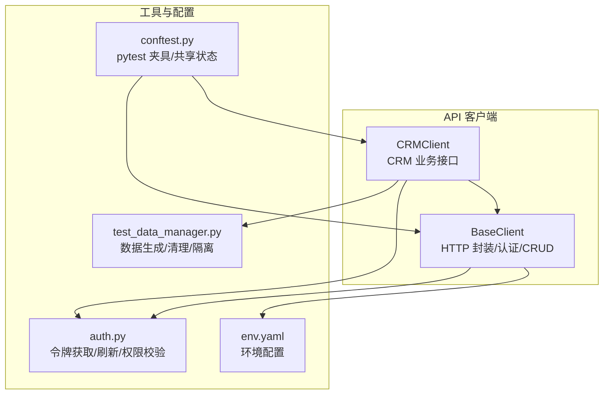
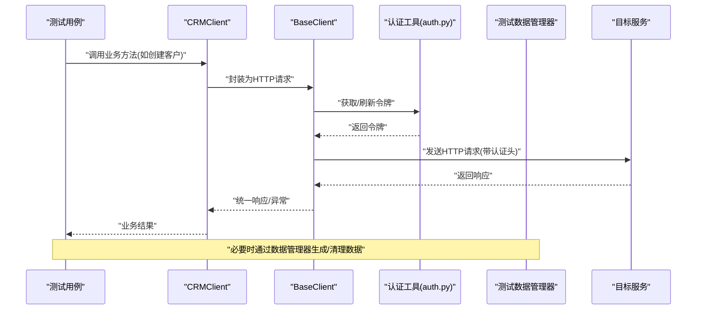
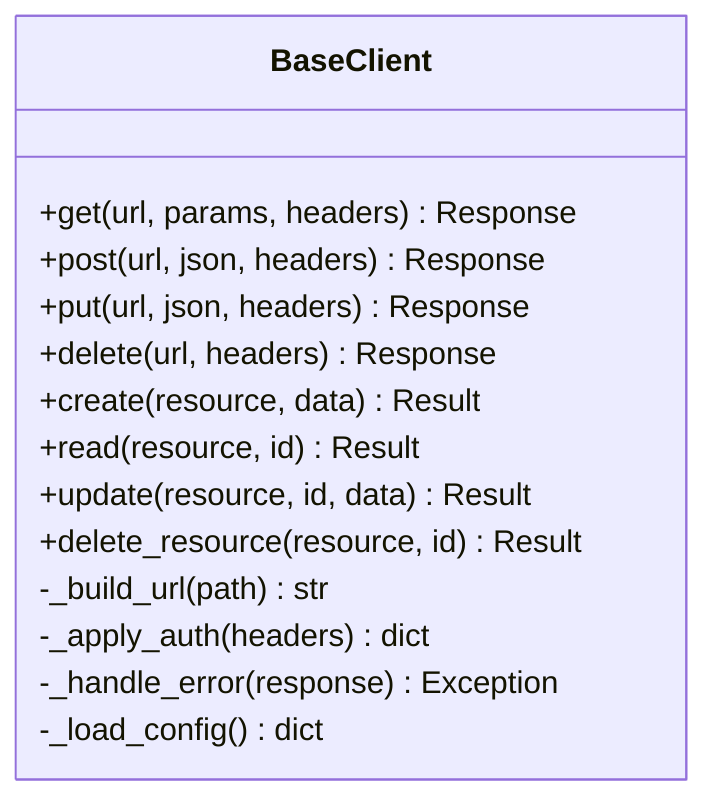
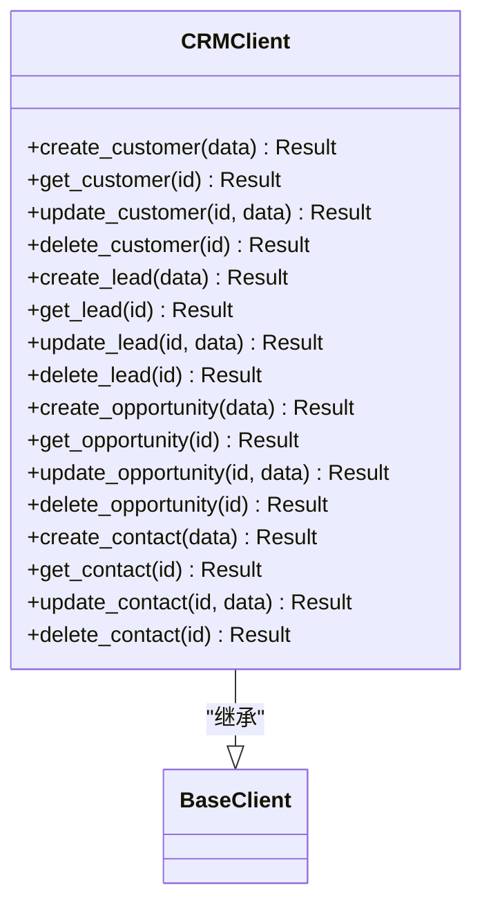
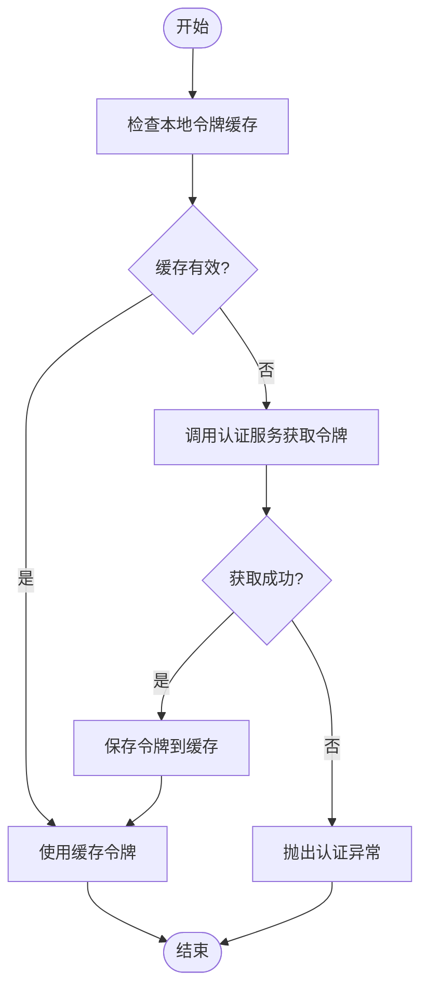
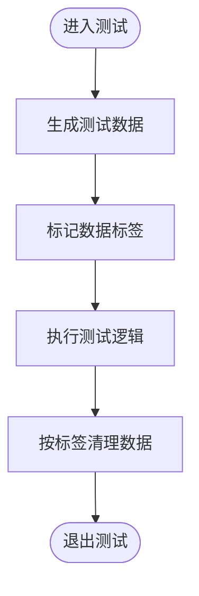
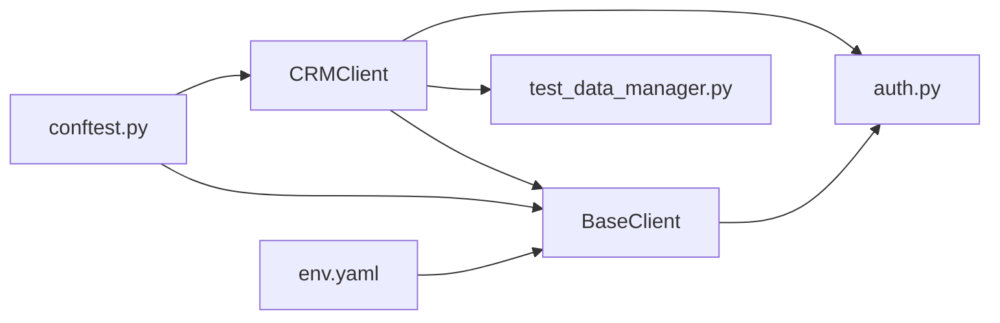

# Python API

<cite>
**本文引用的文件**   
- [base_client.py](file://tests/api/clients/base_client.py)
- [crm_client.py](file://tests/api/clients/crm_client.py)
- [auth.py](file://tests/utils/auth.py)
- [test_data_manager.py](file://tests/utils/test_data_manager.py)
- [conftest.py](file://tests/api/conftest.py)
- [env.yaml](file://tests/config/env.yaml)
</cite>

## 目录
1. [简介](#简介)
2. [项目结构](#项目结构)
3. [核心组件](#核心组件)
4. [架构总览](#架构总览)
5. [详细组件分析](#详细组件分析)
6. [依赖关系分析](#依赖关系分析)
7. [性能考虑](#性能考虑)
8. [故障排查指南](#故障排查指南)
9. [结论](#结论)
10. [附录：使用示例与最佳实践](#附录使用示例与最佳实践)

## 简介
本参考文档面向 AutoTest Hub 框架的 Python API，聚焦于测试客户端与认证、数据管理相关能力。文档深入记录 BaseClient 与 CRMClient 的接口设计，包括 HTTP 请求封装方法、认证机制与业务 CRUD 操作；解释测试客户端构造参数、配置选项与错误处理机制；文档化认证工具函数的使用方法（令牌获取、刷新、权限验证）；提供测试数据管理器的 API 规范（数据生成、清理、隔离）；并给出完整的代码示例路径、继承关系与扩展点说明，以及最佳实践与性能优化建议。

## 项目结构
与 Python API 相关的核心文件位于 tests 目录下：
- 客户端实现：tests/api/clients/base_client.py、tests/api/clients/crm_client.py
- 认证工具：tests/utils/auth.py
- 测试数据管理器：tests/utils/test_data_manager.py
- 测试夹具与配置：tests/api/conftest.py、tests/config/env.yaml

图表来源
- [base_client.py](file://tests/api/clients/base_client.py)
- [crm_client.py](file://tests/api/clients/crm_client.py)
- [auth.py](file://tests/utils/auth.py)
- [test_data_manager.py](file://tests/utils/test_data_manager.py)
- [conftest.py](file://tests/api/conftest.py)
- [env.yaml](file://tests/config/env.yaml)

章节来源
- [base_client.py](file://tests/api/clients/base_client.py)
- [crm_client.py](file://tests/api/clients/crm_client.py)
- [auth.py](file://tests/utils/auth.py)
- [test_data_manager.py](file://tests/utils/test_data_manager.py)
- [conftest.py](file://tests/api/conftest.py)
- [env.yaml](file://tests/config/env.yaml)

## 核心组件
- BaseClient：提供统一的 HTTP 请求封装、认证上下文管理、通用 CRUD 方法与错误处理策略，是上层业务客户端的基础。
- CRMClient：基于 BaseClient 扩展，封装 CRM 领域特定的业务接口（如客户、线索、商机等），并提供更高层的业务方法。
- 认证工具（auth.py）：提供令牌获取、刷新与权限验证等辅助函数，供客户端在发起请求前注入认证信息。
- 测试数据管理器（test_data_manager.py）：提供测试数据的生成、清理与隔离能力，确保用例间的数据独立性与可重复性。
- 夹具与配置（conftest.py、env.yaml）：集中管理测试环境配置、会话级或模块级共享对象（如客户端实例、认证令牌缓存）。

章节来源
- [base_client.py](file://tests/api/clients/base_client.py)
- [crm_client.py](file://tests/api/clients/crm_client.py)
- [auth.py](file://tests/utils/auth.py)
- [test_data_manager.py](file://tests/utils/test_data_manager.py)
- [conftest.py](file://tests/api/conftest.py)
- [env.yaml](file://tests/config/env.yaml)

## 架构总览
下图展示了测试客户端与认证、数据管理之间的交互关系，以及配置加载与错误处理的总体流程。

图表来源
- [crm_client.py](file://tests/api/clients/crm_client.py)
- [base_client.py](file://tests/api/clients/base_client.py)
- [auth.py](file://tests/utils/auth.py)
- [test_data_manager.py](file://tests/utils/test_data_manager.py)

## 详细组件分析

### BaseClient 类
职责与能力
- HTTP 请求封装：提供通用的 GET/POST/PUT/DELETE 等方法，统一处理 URL 拼接、查询参数、请求体、超时与重试策略。
- 认证上下文：维护访问令牌、刷新令牌及过期时间，支持自动刷新与失败重试。
- 通用 CRUD：提供 create/read/update/delete 等基础方法，便于子类复用。
- 错误处理：对网络异常、超时、HTTP 状态码进行统一捕获与转换，抛出领域友好的异常类型。
- 配置加载：从 env.yaml 读取基础地址、超时、重试次数等配置项。

关键构造参数与配置选项
- 构造参数通常包含：基础 URL、超时设置、重试次数、日志开关、认证凭据等。
- 配置来源：env.yaml 中的全局配置键值，如 base_url、timeout、max_retries 等。

错误处理机制
- 将底层异常转换为自定义异常类型，便于上层区分网络错误、认证失败、业务错误等。
- 支持幂等请求的重试与非幂等请求的有限重试策略。

扩展点
- 子类可通过重写认证钩子、请求拦截器、响应解析器来定制行为。
- 可注入自定义日志器、指标收集器以增强可观测性。

图表来源
- [base_client.py](file://tests/api/clients/base_client.py)

章节来源
- [base_client.py](file://tests/api/clients/base_client.py)
- [env.yaml](file://tests/config/env.yaml)

### CRMClient 类
职责与能力
- 继承自 BaseClient，专注于 CRM 领域的业务接口封装。
- 提供高层业务方法，例如：创建/查询/更新/删除客户、线索、商机、联系人等。
- 内部复用 BaseClient 的认证与错误处理逻辑，简化用例编写。

典型业务方法
- 客户管理：create_customer、get_customer、update_customer、delete_customer
- 线索管理：create_lead、get_lead、update_lead、delete_lead
- 商机管理：create_opportunity、get_opportunity、update_opportunity、delete_opportunity
- 联系人管理：create_contact、get_contact、update_contact、delete_contact

图表来源
- [crm_client.py](file://tests/api/clients/crm_client.py)
- [base_client.py](file://tests/api/clients/base_client.py)

章节来源
- [crm_client.py](file://tests/api/clients/crm_client.py)
- [base_client.py](file://tests/api/clients/base_client.py)

### 认证工具函数（auth.py）
功能概述
- 令牌获取：根据用户名/密码或其他凭据获取访问令牌与刷新令牌。
- 令牌刷新：当访问令牌过期时，使用刷新令牌换取新的访问令牌。
- 权限验证：检查当前令牌是否具备所需角色或权限范围。

典型函数
- get_token(username, password) -> token_info
- refresh_token(refresh_token) -> new_token_info
- verify_permissions(token, required_roles_or_scopes) -> bool

图表来源
- [auth.py](file://tests/utils/auth.py)

章节来源
- [auth.py](file://tests/utils/auth.py)

### 测试数据管理器（test_data_manager.py）
功能概述
- 数据生成：根据模板或工厂方法生成结构化测试数据（如客户、线索、联系人等）。
- 数据清理：在测试前后执行清理，避免数据污染。
- 数据隔离：为每个测试用例提供独立的数据空间，保证并发与顺序无关的可重复性。

典型方法
- generate_customer(count=1) -> list
- generate_lead(count=1) -> list
- generate_contact(count=1) -> list
- cleanup_by_tag(tag) -> void
- isolate_scope(scope_id) -> void

图表来源
- [test_data_manager.py](file://tests/utils/test_data_manager.py)

章节来源
- [test_data_manager.py](file://tests/utils/test_data_manager.py)

### 夹具与配置（conftest.py、env.yaml）
- conftest.py：定义 pytest 夹具，提供共享的客户端实例、认证令牌缓存、数据管理器实例等，减少重复初始化开销。
- env.yaml：集中管理环境配置，如基础 URL、超时、重试次数、默认角色与权限等。

章节来源
- [conftest.py](file://tests/api/conftest.py)
- [env.yaml](file://tests/config/env.yaml)

## 依赖关系分析
- CRMClient 依赖 BaseClient 提供的 HTTP 封装与错误处理。
- BaseClient 依赖 auth.py 完成认证信息的注入与刷新。
- CRMClient 与 test_data_manager.py 协作，用于准备与清理测试数据。
- conftest.py 作为夹具入口，装配上述组件并在测试生命周期内复用。

图表来源
- [crm_client.py](file://tests/api/clients/crm_client.py)
- [base_client.py](file://tests/api/clients/base_client.py)
- [auth.py](file://tests/utils/auth.py)
- [test_data_manager.py](file://tests/utils/test_data_manager.py)
- [conftest.py](file://tests/api/conftest.py)
- [env.yaml](file://tests/config/env.yaml)

章节来源
- [crm_client.py](file://tests/api/clients/crm_client.py)
- [base_client.py](file://tests/api/clients/base_client.py)
- [auth.py](file://tests/utils/auth.py)
- [test_data_manager.py](file://tests/utils/test_data_manager.py)
- [conftest.py](file://tests/api/conftest.py)
- [env.yaml](file://tests/config/env.yaml)

## 性能考虑
- 连接复用：在 BaseClient 中启用连接池与持久连接，减少握手开销。
- 超时与重试：合理设置超时与重试次数，避免长时间阻塞与雪崩效应。
- 批量操作：对于大量数据的创建/更新，优先使用批量接口以减少往返次数。
- 令牌缓存：在认证工具中缓存令牌，避免频繁刷新导致的额外请求。
- 数据隔离与清理：使用标签化的数据清理策略，降低清理成本与副作用。

[本节为通用指导，不直接分析具体文件]

## 故障排查指南
常见问题与定位步骤
- 认证失败：检查 env.yaml 中的凭据与基础 URL；确认 auth.py 的令牌获取与刷新逻辑；查看 BaseClient 的错误转换是否抛出了明确的认证异常。
- 网络异常：检查超时与重试配置；确认目标服务可达性与证书配置；观察 BaseClient 的网络层异常类型。
- 数据不一致：确认测试数据管理器是否正确标记与清理数据；检查夹具是否在测试前后正确执行清理。
- 权限不足：使用 auth.py 的权限验证函数检查当前令牌的角色与范围；确认服务端权限策略是否与预期一致。

章节来源
- [base_client.py](file://tests/api/clients/base_client.py)
- [auth.py](file://tests/utils/auth.py)
- [test_data_manager.py](file://tests/utils/test_data_manager.py)
- [conftest.py](file://tests/api/conftest.py)
- [env.yaml](file://tests/config/env.yaml)

## 结论
BaseClient 与 CRMClient 构成了 AutoTest Hub 框架的 Python API 核心：前者提供稳定的 HTTP 封装、认证与错误处理，后者聚焦 CRM 业务语义，提升用例可读性与可维护性。配合 auth.py 与 test_data_manager.py，可实现端到端的自动化测试闭环。通过合理的配置、错误处理与性能优化，能够显著提升测试稳定性与执行效率。

[本节为总结性内容，不直接分析具体文件]

## 附录：使用示例与最佳实践

- 构造 BaseClient 与 CRMClient
  - 从 env.yaml 加载基础 URL、超时与重试配置。
  - 在 conftest.py 中创建共享实例，避免重复初始化。
  - 参考路径：[base_client.py](file://tests/api/clients/base_client.py)、[crm_client.py](file://tests/api/clients/crm_client.py)、[conftest.py](file://tests/api/conftest.py)、[env.yaml](file://tests/config/env.yaml)

- 认证流程
  - 使用 auth.py 获取令牌并缓存；在 BaseClient 中自动注入认证头；过期时自动刷新。
  - 参考路径：[auth.py](file://tests/utils/auth.py)、[base_client.py](file://tests/api/clients/base_client.py)

- 业务 CRUD 调用
  - 通过 CRMClient 的高层方法完成客户、线索、商机、联系人的增删改查。
  - 参考路径：[crm_client.py](file://tests/api/clients/crm_client.py)

- 测试数据管理
  - 使用 test_data_manager.py 生成数据并打标签；在测试后按标签清理，确保隔离。
  - 参考路径：[test_data_manager.py](file://tests/utils/test_data_manager.py)

- 最佳实践
  - 将配置集中在 env.yaml，并通过夹具注入到客户端。
  - 对幂等请求启用重试，非幂等请求谨慎重试。
  - 使用标签化数据隔离，避免跨用例干扰。
  - 统一异常类型与日志输出，便于问题定位。

[本节为使用指引，不直接分析具体文件]