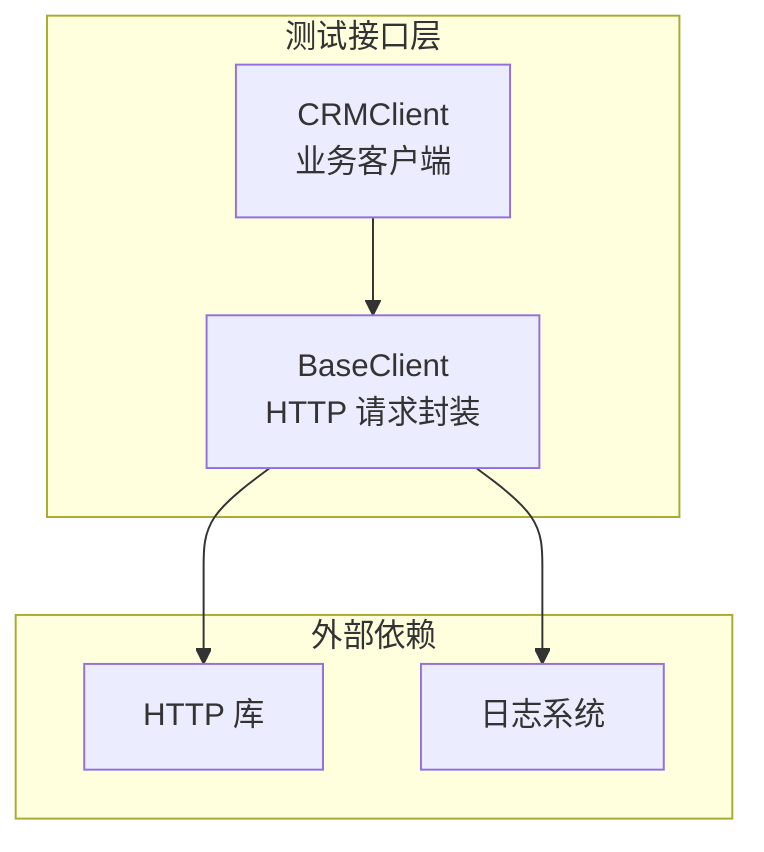
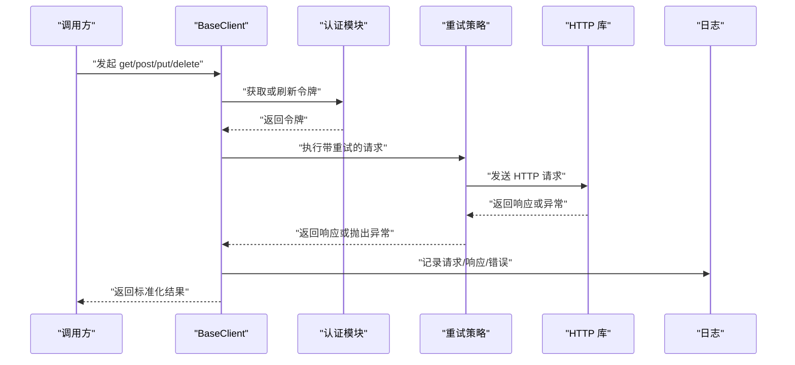
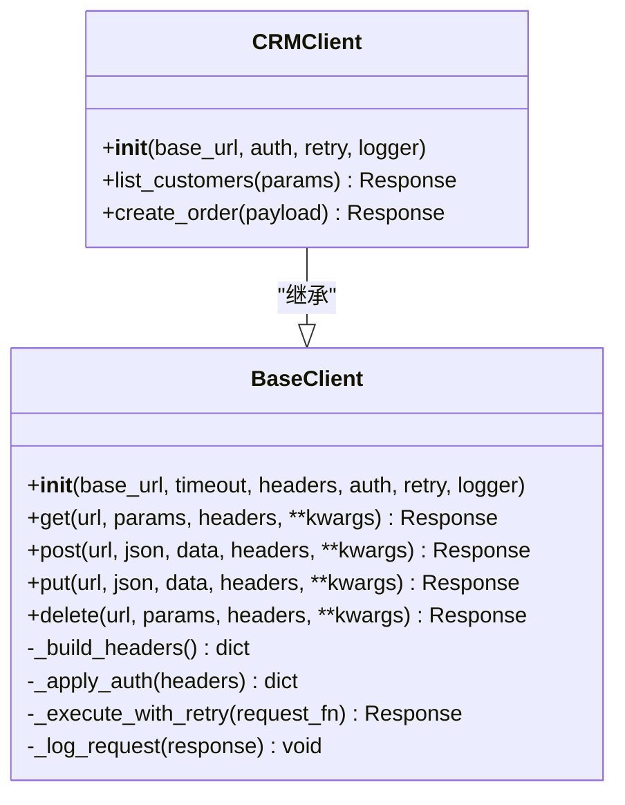

# 基础客户端API

<cite>
**本文引用的文件**   
- [tests/api/clients/base_client.py](file://tests/api/clients/base_client.py)
- [tests/api/clients/crm_client.py](file://tests/api/clients/crm_client.py)
</cite>

## 目录
1. [简介](#简介)
2. [项目结构](#项目结构)
3. [核心组件](#核心组件)
4. [架构总览](#架构总览)
5. [详细组件分析](#详细组件分析)
6. [依赖分析](#依赖分析)
7. [性能考虑](#性能考虑)
8. [故障排查指南](#故障排查指南)
9. [结论](#结论)
10. [附录](#附录)

## 简介
本文件为 BaseClient 类的 API 参考文档，聚焦于 HTTP 请求封装方法（get、post、put、delete）、构造参数配置（base_url、timeout、headers 等）、认证令牌管理、请求重试机制与日志记录。同时提供继承 BaseClient 创建自定义客户端的完整示例路径说明、异常处理策略、调试技巧以及性能优化建议与最佳实践。

## 项目结构
BaseClient 位于 tests/api/clients 目录下，crm_client.py 展示了如何继承 BaseClient 构建领域客户端。

图表来源
- [tests/api/clients/base_client.py](file://tests/api/clients/base_client.py)
- [tests/api/clients/crm_client.py](file://tests/api/clients/crm_client.py)

章节来源
- [tests/api/clients/base_client.py](file://tests/api/clients/base_client.py)
- [tests/api/clients/crm_client.py](file://tests/api/clients/crm_client.py)

## 核心组件
- BaseClient：提供统一的 HTTP 请求封装、认证令牌注入、重试与日志能力。
- CRMClient：基于 BaseClient 的业务客户端示例，演示如何复用通用能力并扩展业务方法。

章节来源
- [tests/api/clients/base_client.py](file://tests/api/clients/base_client.py)
- [tests/api/clients/crm_client.py](file://tests/api/clients/crm_client.py)

## 架构总览
下图展示 BaseClient 在调用链中的位置以及与外部依赖的关系。

图表来源
- [tests/api/clients/base_client.py](file://tests/api/clients/base_client.py)

## 详细组件分析

### BaseClient 类
- 职责
  - 统一封装 HTTP 请求（get、post、put、delete）。
  - 管理认证令牌（获取、刷新、注入到请求头）。
  - 实现请求重试（可配置次数与退避策略）。
  - 记录请求与响应日志（含耗时、状态码、关键信息）。
  - 提供一致的返回值格式与异常类型。

- 构造函数参数
  - base_url：服务基地址，用于拼接相对路径。
  - timeout：请求超时时间（秒），支持连接与读取超时。
  - headers：默认请求头，如 Content-Type、Accept 等。
  - auth：认证配置（例如 token 获取方式、刷新策略）。
  - retry：重试配置（最大重试次数、退避策略、是否对特定状态码重试）。
  - logger：日志器实例或配置开关。

- 核心方法
  - get(url, params=None, headers=None, **kwargs)
    - 参数规范
      - url：相对于 base_url 的路径。
      - params：查询参数字典。
      - headers：覆盖或追加到默认请求头。
      - kwargs：透传给底层 HTTP 库（如 proxies、verify 等）。
    - 返回值
      - 成功：包含状态码、响应体、响应头的结构化对象。
      - 失败：抛出统一异常（见“异常处理”）。
  - post(url, json=None, data=None, headers=None, **kwargs)
    - 参数规范
      - json：JSON 请求体。
      - data：表单或原始数据。
      - headers、kwargs：同上。
    - 返回值
      - 同 get。
  - put(url, json=None, data=None, headers=None, **kwargs)
    - 参数规范与返回值
      - 同 post。
  - delete(url, params=None, headers=None, **kwargs)
    - 参数规范与返回值
      - 同 get。

- 认证令牌管理
  - 令牌来源
    - 从配置或环境变量加载初始令牌。
    - 支持自动刷新（过期前或收到 401 时触发）。
  - 注入位置
    - 通过 Authorization 或其他约定头部注入。
  - 刷新策略
    - 基于时间戳或服务端返回的刷新令牌进行刷新。
    - 刷新失败时抛出认证相关异常。

- 请求重试机制
  - 可配置项
    - max_retries：最大重试次数。
    - backoff：退避策略（固定间隔或指数退避）。
    - retry_on_status：对哪些状态码触发重试（如 5xx）。
  - 行为
    - 网络异常或指定状态码时按策略重试。
    - 超过重试上限后抛出统一异常。

- 日志记录
  - 记录内容
    - 请求方法、URL、请求头（脱敏）、请求体摘要。
    - 响应状态码、耗时、响应体摘要。
    - 异常堆栈与上下文。
  - 控制开关
    - 可通过 logger 配置开启/关闭或调整级别。

- 返回值格式
  - 统一响应对象包含
    - status_code：HTTP 状态码。
    - body：解析后的响应体（JSON 或文本）。
    - headers：响应头。
    - elapsed：请求耗时（秒）。
    - request_id：可选的请求追踪标识。

- 异常处理
  - 统一异常类型
    - 网络异常：连接超时、DNS 解析失败等。
    - 认证异常：令牌无效或刷新失败。
    - 业务异常：非 2xx 状态码且未触发重试。
  - 异常携带信息
    - 错误码、消息、请求上下文（URL、方法、部分头/体）。

章节来源
- [tests/api/clients/base_client.py](file://tests/api/clients/base_client.py)

### CRMClient 示例（继承 BaseClient）
- 用途
  - 演示如何继承 BaseClient 并封装 CRM 域内常用接口。
- 典型用法
  - 初始化 CRMClient 时传入 base_url、auth、retry 等配置。
  - 调用封装好的业务方法（如获取客户列表、创建订单等）。
- 扩展点
  - 可在子类中覆写请求拦截器（如签名、审计字段注入）。
  - 可定义领域特定的异常映射与重试策略。

章节来源
- [tests/api/clients/crm_client.py](file://tests/api/clients/crm_client.py)

## 依赖分析
BaseClient 对外暴露稳定的 HTTP 封装接口，CRMClient 依赖 BaseClient 完成具体业务调用。

图表来源
- [tests/api/clients/base_client.py](file://tests/api/clients/base_client.py)
- [tests/api/clients/crm_client.py](file://tests/api/clients/crm_client.py)

章节来源
- [tests/api/clients/base_client.py](file://tests/api/clients/base_client.py)
- [tests/api/clients/crm_client.py](file://tests/api/clients/crm_client.py)

## 性能考虑
- 连接复用
  - 使用连接池减少握手开销；合理设置连接数与空闲回收。
- 超时配置
  - 根据服务 SLA 设置合理的连接与读取超时，避免长尾阻塞。
- 重试策略
  - 仅对幂等方法（GET/DELETE）或明确可重试的状态码启用重试。
  - 采用指数退避与抖动，避免雪崩。
- 日志粒度
  - 生产环境降低日志级别，避免频繁打印大响应体。
- 序列化与反序列化
  - 尽量使用 JSON 并避免不必要的字符串转换。
- 并发与限流
  - 在高并发场景下结合线程/进程池与令牌桶限流。

[本节为通用指导，不直接分析具体文件]

## 故障排查指南
- 常见问题
  - 401 未授权：检查令牌是否过期、刷新逻辑是否正确、请求头是否被覆盖。
  - 5xx 错误：确认是否为瞬时故障，检查重试策略与服务端健康状态。
  - 超时：检查网络延迟、服务端负载与超时阈值设置。
- 定位步骤
  - 开启调试日志，查看请求 URL、方法、头部与响应摘要。
  - 核对认证流程与令牌生命周期。
  - 验证重试次数与退避策略是否符合预期。
- 辅助手段
  - 使用请求 ID 关联上下游日志。
  - 对关键路径增加埋点与指标采集。

章节来源
- [tests/api/clients/base_client.py](file://tests/api/clients/base_client.py)

## 结论
BaseClient 提供了稳定、可扩展的 HTTP 客户端抽象，涵盖认证、重试、日志与统一异常处理。通过继承 BaseClient，可以快速构建领域客户端（如 CRMClient），在保证一致性的同时提升开发效率与可维护性。

[本节为总结性内容，不直接分析具体文件]

## 附录

### 代码示例：继承 BaseClient 创建自定义客户端
- 步骤
  - 新建子类继承 BaseClient。
  - 在 __init__ 中传入 base_url、auth、retry、logger 等配置。
  - 封装业务方法，调用父类的 get/post/put/delete。
  - 在需要时覆写请求拦截或异常映射。
- 示例路径
  - [tests/api/clients/crm_client.py](file://tests/api/clients/crm_client.py)

章节来源
- [tests/api/clients/crm_client.py](file://tests/api/clients/crm_client.py)

### 最佳实践清单
- 将敏感信息（令牌、密钥）放入环境变量或安全配置中心。
- 为不同环境（开发/测试/生产）分离配置。
- 对幂等方法谨慎启用重试，避免重复副作用。
- 使用结构化日志与请求 ID 便于追踪。
- 定期评估超时与重试参数，结合压测结果调优。

[本节为通用指导，不直接分析具体文件]