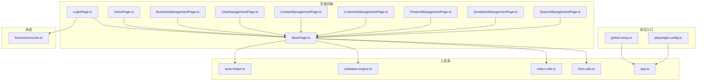
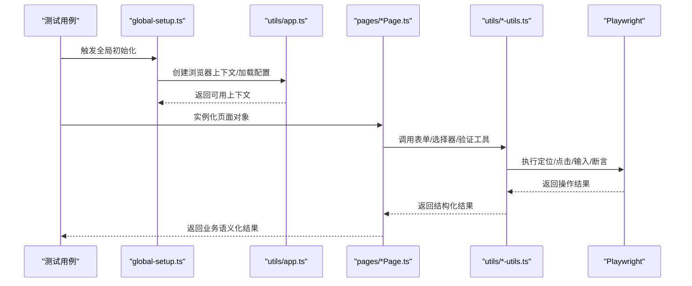
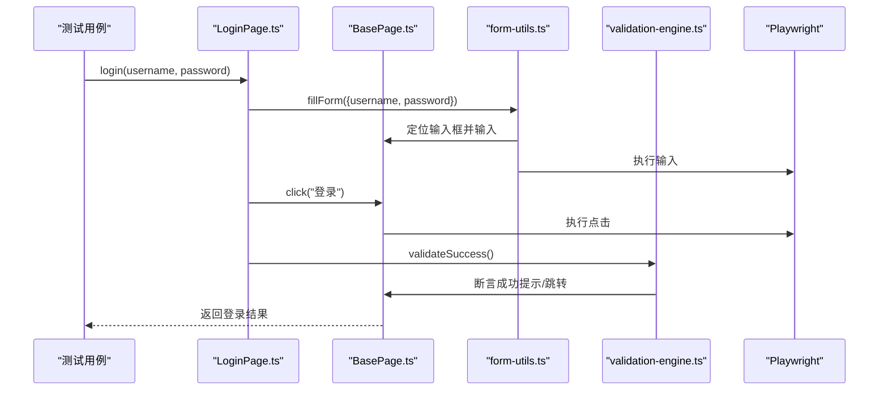
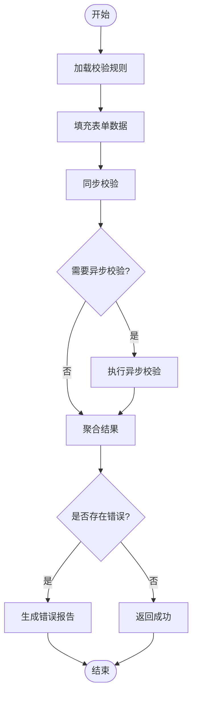
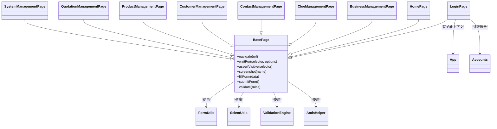

# TypeScript API

<cite>
**本文引用的文件**   
- [tests/ui/pages/BasePage.ts](file://tests/ui/pages/BasePage.ts)
- [tests/ui/pages/LoginPage.ts](file://tests/ui/pages/LoginPage.ts)
- [tests/ui/pages/HomePage.ts](file://tests/ui/pages/HomePage.ts)
- [tests/ui/pages/BusinessManagementPage.ts](file://tests/ui/pages/BusinessManagementPage.ts)
- [tests/ui/pages/ClueManagementPage.ts](file://tests/ui/pages/ClueManagementPage.ts)
- [tests/ui/pages/ContactManagementPage.ts](file://tests/ui/pages/ContactManagementPage.ts)
- [tests/ui/pages/CustomerManagementPage.ts](file://tests/ui/pages/CustomerManagementPage.ts)
- [tests/ui/pages/ProductManagementPage.ts](file://tests/ui/pages/ProductManagementPage.ts)
- [tests/ui/pages/QuotationManagementPage.ts](file://tests/ui/pages/QuotationManagementPage.ts)
- [tests/ui/pages/SystemManagementPage.ts](file://tests/ui/pages/SystemManagementPage.ts)
- [tests/ui/utils/app.ts](file://tests/ui/utils/app.ts)
- [tests/ui/utils/form-utils.ts](file://tests/ui/utils/form-utils.ts)
- [tests/ui/utils/select-utils.ts](file://tests/ui/utils/select-utils.ts)
- [tests/ui/utils/validation-engine.ts](file://tests/ui/utils/validation-engine.ts)
- [tests/ui/utils/amis-helper.ts](file://tests/ui/utils/amis-helper.ts)
- [tests/ui/global-setup.ts](file://tests/ui/global-setup.ts)
- [tests/ui/playwright.config.ts](file://tests/ui/playwright.config.ts)
- [tests/ui/fixtures/accounts.ts](file://tests/ui/fixtures/accounts.ts)
</cite>

## 目录
1. [简介](#简介)
2. [项目结构](#项目结构)
3. [核心组件](#核心组件)
4. [架构总览](#架构总览)
5. [详细组件分析](#详细组件分析)
6. [依赖关系分析](#依赖关系分析)
7. [性能与稳定性建议](#性能与稳定性建议)
8. [故障排查指南](#故障排查指南)
9. [结论](#结论)
10. [附录：API参考与类型契约](#附录api参考与类型契约)

## 简介
本文件为 AutoTest Hub 框架的 TypeScript UI 自动化测试 API 参考文档，聚焦于以下能力：
- 应用初始化配置与浏览器上下文管理
- 页面导航与元素操作封装
- 表单操作、选择器处理与验证引擎
- Playwright 集成方式与最佳实践
- 类型定义、接口约束与类型安全实践
- 错误处理模式与调试技巧

目标读者包括编写 UI 自动化用例的工程师与维护者。文档以“渐进式复杂度”组织，从高层架构到具体 API 契约，并辅以图示帮助理解。

## 项目结构
UI 自动化相关代码主要位于 tests/ui 目录，采用“页面对象 + 工具库”的分层组织方式：
- pages：按业务域划分页面对象（登录、首页、CRM 各模块等）
- utils：通用工具函数与领域辅助（表单、选择器、验证、Amis 辅助、应用启动）
- fixtures：测试数据与夹具（如账号信息）
- global-setup：全局前置与浏览器环境准备
- playwright.config.ts：Playwright 运行配置

图表来源
- [tests/ui/global-setup.ts](file://tests/ui/global-setup.ts)
- [tests/ui/playwright.config.ts](file://tests/ui/playwright.config.ts)
- [tests/ui/pages/BasePage.ts](file://tests/ui/pages/BasePage.ts)
- [tests/ui/pages/LoginPage.ts](file://tests/ui/pages/LoginPage.ts)
- [tests/ui/pages/HomePage.ts](file://tests/ui/pages/HomePage.ts)
- [tests/ui/pages/BusinessManagementPage.ts](file://tests/ui/pages/BusinessManagementPage.ts)
- [tests/ui/pages/ClueManagementPage.ts](file://tests/ui/pages/ClueManagementPage.ts)
- [tests/ui/pages/ContactManagementPage.ts](file://tests/ui/pages/ContactManagementPage.ts)
- [tests/ui/pages/CustomerManagementPage.ts](file://tests/ui/pages/CustomerManagementPage.ts)
- [tests/ui/pages/ProductManagementPage.ts](file://tests/ui/pages/ProductManagementPage.ts)
- [tests/ui/pages/QuotationManagementPage.ts](file://tests/ui/pages/QuotationManagementPage.ts)
- [tests/ui/pages/SystemManagementPage.ts](file://tests/ui/pages/SystemManagementPage.ts)
- [tests/ui/utils/app.ts](file://tests/ui/utils/app.ts)
- [tests/ui/utils/form-utils.ts](file://tests/ui/utils/form-utils.ts)
- [tests/ui/utils/select-utils.ts](file://tests/ui/utils/select-utils.ts)
- [tests/ui/utils/validation-engine.ts](file://tests/ui/utils/validation-engine.ts)
- [tests/ui/utils/amis-helper.ts](file://tests/ui/utils/amis-helper.ts)
- [tests/ui/fixtures/accounts.ts](file://tests/ui/fixtures/accounts.ts)

章节来源
- [tests/ui/global-setup.ts](file://tests/ui/global-setup.ts)
- [tests/ui/playwright.config.ts](file://tests/ui/playwright.config.ts)
- [tests/ui/pages/BasePage.ts](file://tests/ui/pages/BasePage.ts)
- [tests/ui/utils/app.ts](file://tests/ui/utils/app.ts)

## 核心组件
- BasePage：所有页面对象的基类，提供统一的定位器、等待、断言、截图、日志等基础能力，以及表单、选择器、验证等工具的便捷调用。
- LoginPage/HomePage 与各业务 Page：继承 BasePage，封装具体页面的导航与交互方法，面向用例暴露高可读性的业务动作。
- app.ts：负责应用初始化、浏览器上下文创建、登录态注入、全局配置读取等。
- form-utils.ts / select-utils.ts：表单填充、提交、校验；下拉选择、级联选择等复杂控件操作。
- validation-engine.ts：统一验证引擎，支持字段规则、异步校验、批量校验与结果聚合。
- amis-helper.ts：针对 Amis 渲染表单/表格/弹窗的专用辅助，简化复杂 UI 结构的定位与交互。
- fixtures/accounts.ts：集中管理测试账号与凭据，便于在登录流程中复用。

章节来源
- [tests/ui/pages/BasePage.ts](file://tests/ui/pages/BasePage.ts)
- [tests/ui/pages/LoginPage.ts](file://tests/ui/pages/LoginPage.ts)
- [tests/ui/pages/HomePage.ts](file://tests/ui/pages/HomePage.ts)
- [tests/ui/utils/app.ts](file://tests/ui/utils/app.ts)
- [tests/ui/utils/form-utils.ts](file://tests/ui/utils/form-utils.ts)
- [tests/ui/utils/select-utils.ts](file://tests/ui/utils/select-utils.ts)
- [tests/ui/utils/validation-engine.ts](file://tests/ui/utils/validation-engine.ts)
- [tests/ui/utils/amis-helper.ts](file://tests/ui/utils/amis-helper.ts)
- [tests/ui/fixtures/accounts.ts](file://tests/ui/fixtures/accounts.ts)

## 架构总览
下图展示了从测试执行到页面操作的典型调用链：global-setup 初始化环境与上下文，page 对象通过工具库完成表单、选择器与验证，最终由 Playwright 驱动浏览器完成交互。

图表来源
- [tests/ui/global-setup.ts](file://tests/ui/global-setup.ts)
- [tests/ui/utils/app.ts](file://tests/ui/utils/app.ts)
- [tests/ui/pages/BasePage.ts](file://tests/ui/pages/BasePage.ts)
- [tests/ui/utils/form-utils.ts](file://tests/ui/utils/form-utils.ts)
- [tests/ui/utils/select-utils.ts](file://tests/ui/utils/select-utils.ts)
- [tests/ui/utils/validation-engine.ts](file://tests/ui/utils/validation-engine.ts)

## 详细组件分析

### 应用初始化与上下文管理（app.ts）
职责
- 读取运行配置（如 baseURL、超时、重试、截图/视频策略等）
- 创建或复用浏览器上下文
- 注入登录态（Cookie/Storage State）
- 提供统一的上下文获取入口，供页面对象使用

关键约定
- 初始化失败应抛出明确异常，包含原因与上下文信息
- 对超时、网络异常进行包装，便于上层捕获与重试
- 提供幂等的上下文获取方法，避免重复创建

最佳实践
- 将敏感配置置于环境变量或外部配置中心
- 在 CI 环境下启用无头模式与并行度控制
- 对长耗时操作设置合理的超时与重试策略

章节来源
- [tests/ui/utils/app.ts](file://tests/ui/utils/app.ts)
- [tests/ui/global-setup.ts](file://tests/ui/global-setup.ts)
- [tests/ui/playwright.config.ts](file://tests/ui/playwright.config.ts)

### 页面对象基类（BasePage.ts）
职责
- 统一封装定位器、等待策略、断言、截图、日志
- 提供表单、选择器、验证等工具的统一入口
- 规范页面间跳转与状态切换的通用行为

设计要点
- 定位器优先使用稳定属性（data-testid、role、text），避免脆弱 CSS/XPath
- 显式等待优于固定 sleep，结合可重试机制提升稳定性
- 断言失败时附带上下文截图与诊断信息

章节来源
- [tests/ui/pages/BasePage.ts](file://tests/ui/pages/BasePage.ts)

### 登录页（LoginPage.ts）
职责
- 封装用户名/密码输入、登录按钮点击、错误提示断言
- 支持多账号登录与登录态持久化

交互流程

图表来源
- [tests/ui/pages/LoginPage.ts](file://tests/ui/pages/LoginPage.ts)
- [tests/ui/pages/BasePage.ts](file://tests/ui/pages/BasePage.ts)
- [tests/ui/utils/form-utils.ts](file://tests/ui/utils/form-utils.ts)
- [tests/ui/utils/validation-engine.ts](file://tests/ui/utils/validation-engine.ts)

章节来源
- [tests/ui/pages/LoginPage.ts](file://tests/ui/pages/LoginPage.ts)
- [tests/ui/fixtures/accounts.ts](file://tests/ui/fixtures/accounts.ts)

### 首页与各业务页（HomePage.ts 与各业务 ManagementPage）
职责
- 封装菜单导航、列表查询、新增/编辑/删除等业务流程
- 将复杂 UI 操作抽象为业务语义方法，降低用例耦合

示例（概念性）
- 进入“商机管理”，筛选条件填写并提交，断言列表项存在
- 打开“产品管理”，新建产品并保存，断言成功提示与跳转

章节来源
- [tests/ui/pages/HomePage.ts](file://tests/ui/pages/HomePage.ts)
- [tests/ui/pages/BusinessManagementPage.ts](file://tests/ui/pages/BusinessManagementPage.ts)
- [tests/ui/pages/ClueManagementPage.ts](file://tests/ui/pages/ClueManagementPage.ts)
- [tests/ui/pages/ContactManagementPage.ts](file://tests/ui/pages/ContactManagementPage.ts)
- [tests/ui/pages/CustomerManagementPage.ts](file://tests/ui/pages/CustomerManagementPage.ts)
- [tests/ui/pages/ProductManagementPage.ts](file://tests/ui/pages/ProductManagementPage.ts)
- [tests/ui/pages/QuotationManagementPage.ts](file://tests/ui/pages/QuotationManagementPage.ts)
- [tests/ui/pages/SystemManagementPage.ts](file://tests/ui/pages/SystemManagementPage.ts)

### 表单工具（form-utils.ts）
能力
- 填充单行/多行文本、数字、日期、开关、复选、单选等
- 批量填充与提交，支持必填校验与错误提示断言
- 支持动态表单（根据选项显示/隐藏字段）

参数与返回
- 入参：表单数据对象、可选的定位策略与超时
- 返回：操作结果（成功/失败）、错误消息集合（如有）

错误处理
- 对不可见/禁用元素抛出自定义错误，附带定位信息与截图
- 对异步提交失败进行重试与回滚提示

章节来源
- [tests/ui/utils/form-utils.ts](file://tests/ui/utils/form-utils.ts)

### 选择器工具（select-utils.ts）
能力
- 下拉选择、多选、搜索选择、级联选择
- 支持按文本、值、索引匹配，支持模糊匹配与去重

参数与返回
- 入参：选择器描述、目标值、匹配策略
- 返回：选择结果与选中项信息

注意事项
- 对于虚拟滚动列表，需先滚动至可视区域再选择
- 对动态渲染的选择器增加等待与重试

章节来源
- [tests/ui/utils/select-utils.ts](file://tests/ui/utils/select-utils.ts)

### 验证引擎（validation-engine.ts）
能力
- 字段级规则校验（非空、长度、格式、范围）
- 异步校验（如唯一性检查）
- 批量校验与结果聚合，输出结构化错误报告

流程图

图表来源
- [tests/ui/utils/validation-engine.ts](file://tests/ui/utils/validation-engine.ts)

章节来源
- [tests/ui/utils/validation-engine.ts](file://tests/ui/utils/validation-engine.ts)

### Amis 辅助（amis-helper.ts）
能力
- 针对 Amis 渲染的表单、表格、弹窗、富文本等组件提供高阶封装
- 自动识别 Amis 节点结构，简化定位与交互

适用场景
- 快速上手基于 Amis 的前端原型系统
- 减少因前端结构调整导致的用例维护成本

章节来源
- [tests/ui/utils/amis-helper.ts](file://tests/ui/utils/amis-helper.ts)

## 依赖关系分析
- 页面对象均依赖 BasePage 提供的通用能力
- 表单/选择器/验证工具被页面对象组合使用
- app.ts 作为应用初始化入口，被 global-setup 与页面对象间接使用
- fixtures/accounts.ts 为登录流程提供测试数据

图表来源
- [tests/ui/pages/BasePage.ts](file://tests/ui/pages/BasePage.ts)
- [tests/ui/pages/LoginPage.ts](file://tests/ui/pages/LoginPage.ts)
- [tests/ui/pages/HomePage.ts](file://tests/ui/pages/HomePage.ts)
- [tests/ui/pages/BusinessManagementPage.ts](file://tests/ui/pages/BusinessManagementPage.ts)
- [tests/ui/pages/ClueManagementPage.ts](file://tests/ui/pages/ClueManagementPage.ts)
- [tests/ui/pages/ContactManagementPage.ts](file://tests/ui/pages/ContactManagementPage.ts)
- [tests/ui/pages/CustomerManagementPage.ts](file://tests/ui/pages/CustomerManagementPage.ts)
- [tests/ui/pages/ProductManagementPage.ts](file://tests/ui/pages/ProductManagementPage.ts)
- [tests/ui/pages/QuotationManagementPage.ts](file://tests/ui/pages/QuotationManagementPage.ts)
- [tests/ui/pages/SystemManagementPage.ts](file://tests/ui/pages/SystemManagementPage.ts)
- [tests/ui/utils/form-utils.ts](file://tests/ui/utils/form-utils.ts)
- [tests/ui/utils/select-utils.ts](file://tests/ui/utils/select-utils.ts)
- [tests/ui/utils/validation-engine.ts](file://tests/ui/utils/validation-engine.ts)
- [tests/ui/utils/amis-helper.ts](file://tests/ui/utils/amis-helper.ts)
- [tests/ui/utils/app.ts](file://tests/ui/utils/app.ts)
- [tests/ui/fixtures/accounts.ts](file://tests/ui/fixtures/accounts.ts)

章节来源
- [tests/ui/pages/BasePage.ts](file://tests/ui/pages/BasePage.ts)
- [tests/ui/utils/app.ts](file://tests/ui/utils/app.ts)
- [tests/ui/fixtures/accounts.ts](file://tests/ui/fixtures/accounts.ts)

## 性能与稳定性建议
- 合理设置超时与重试：对网络请求、页面渲染、弹窗出现等不稳定点使用显式等待与重试
- 并行执行：在 CI 上开启并行，但注意资源隔离（独立上下文、独立 Cookie/Storage）
- 截图与视频：仅在失败时采集，避免 I/O 瓶颈
- 选择器优化：优先使用 data-testid、role、text 等稳定定位策略，减少 CSS/XPath 脆弱性
- 数据准备：使用 fixtures 集中管理测试数据，避免硬编码与随机数导致的不稳定

[本节为通用指导，不直接分析具体文件]

## 故障排查指南
常见问题与对策
- 定位不到元素
  - 检查是否处于 iframe/Shadow DOM 内
  - 确认元素可见性与可交互性（是否被覆盖、是否禁用）
  - 增加等待时间或使用更稳定的定位策略
- 表单提交失败
  - 查看后端响应与前端错误提示
  - 使用验证引擎输出结构化错误报告
  - 必要时截取页面与网络请求
- 登录态失效
  - 检查 Cookie/Storage State 是否正确注入
  - 确认全局初始化是否成功且未过期
- 选择器不稳定
  - 改用 role/text/data-testid
  - 对动态列表先滚动至可视区域再操作

章节来源
- [tests/ui/utils/validation-engine.ts](file://tests/ui/utils/validation-engine.ts)
- [tests/ui/utils/form-utils.ts](file://tests/ui/utils/form-utils.ts)
- [tests/ui/utils/select-utils.ts](file://tests/ui/utils/select-utils.ts)
- [tests/ui/utils/app.ts](file://tests/ui/utils/app.ts)

## 结论
AutoTest Hub 的 TypeScript UI 自动化框架通过“页面对象 + 工具库”的分层设计，提供了稳定、可维护、类型安全的自动化能力。借助表单、选择器与验证引擎的封装，测试用例可以专注于业务语义表达，同时获得良好的错误诊断与调试体验。建议在团队内推广稳定定位策略、显式等待与结构化错误报告的最佳实践，持续提升自动化质量与效率。

[本节为总结性内容，不直接分析具体文件]

## 附录：API参考与类型契约

### 应用初始化（app.ts）
- 初始化配置
  - 作用：读取运行配置、创建浏览器上下文、注入登录态
  - 典型用法：在 global-setup 或测试前钩子中调用
- 上下文获取
  - 作用：提供幂等的上下文访问，避免重复创建
  - 异常：初始化失败抛出明确异常，包含原因与上下文信息

章节来源
- [tests/ui/utils/app.ts](file://tests/ui/utils/app.ts)
- [tests/ui/global-setup.ts](file://tests/ui/global-setup.ts)
- [tests/ui/playwright.config.ts](file://tests/ui/playwright.config.ts)

### 页面对象基类（BasePage.ts）
- navigate(url): 导航到指定 URL
- waitFor(selector, options): 等待元素满足条件
- assertVisible(selector): 断言元素可见
- screenshot(name): 截取当前页面
- fillForm(data): 填充表单数据
- submitForm(): 提交表单
- validate(rules): 执行验证规则并返回结果

章节来源
- [tests/ui/pages/BasePage.ts](file://tests/ui/pages/BasePage.ts)

### 登录页（LoginPage.ts）
- login(username, password): 执行登录流程并返回结果
- logout(): 退出登录并清理登录态
- getErrorMessage(): 获取最近一次错误的提示信息

章节来源
- [tests/ui/pages/LoginPage.ts](file://tests/ui/pages/LoginPage.ts)
- [tests/ui/fixtures/accounts.ts](file://tests/ui/fixtures/accounts.ts)

### 表单工具（form-utils.ts）
- fillField(selector, value, options?): 填充单个字段
- fillForm(data, options?): 批量填充表单
- submitForm(options?): 提交表单并等待结果
- validateFields(rules, data?): 执行字段级校验

章节来源
- [tests/ui/utils/form-utils.ts](file://tests/ui/utils/form-utils.ts)

### 选择器工具（select-utils.ts）
- selectByText(selector, text, options?): 按文本选择
- selectByValue(selector, value, options?): 按值选择
- multiSelect(selector, values, options?): 多选
- cascadeSelect(selector, path, options?): 级联选择

章节来源
- [tests/ui/utils/select-utils.ts](file://tests/ui/utils/select-utils.ts)

### 验证引擎（validation-engine.ts）
- addRule(field, rule): 添加字段规则
- validate(data): 执行校验并返回结果
- aggregateErrors(results): 聚合多个校验结果
- report(): 生成结构化错误报告

章节来源
- [tests/ui/utils/validation-engine.ts](file://tests/ui/utils/validation-engine.ts)

### Amis 辅助（amis-helper.ts)
- fillAmisForm(schema, data): 根据 Amis schema 填充表单
- operateAmisTable(tableSelector, action, params): 操作 Amis 表格
- openAmisDialog(dialogSelector): 打开 Amis 弹窗并返回操作句柄

章节来源
- [tests/ui/utils/amis-helper.ts](file://tests/ui/utils/amis-helper.ts)

### 夹具（fixtures/accounts.ts）
- accounts: 测试账号集合
- defaultAccount: 默认账号
- createTempAccount(): 生成临时账号（用于隔离测试）

章节来源
- [tests/ui/fixtures/accounts.ts](file://tests/ui/fixtures/accounts.ts)