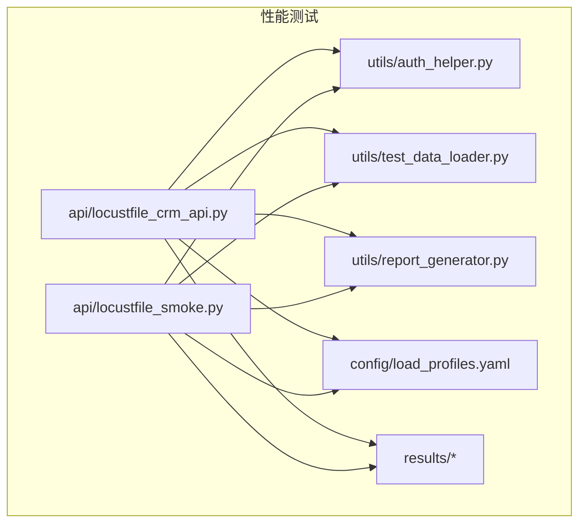
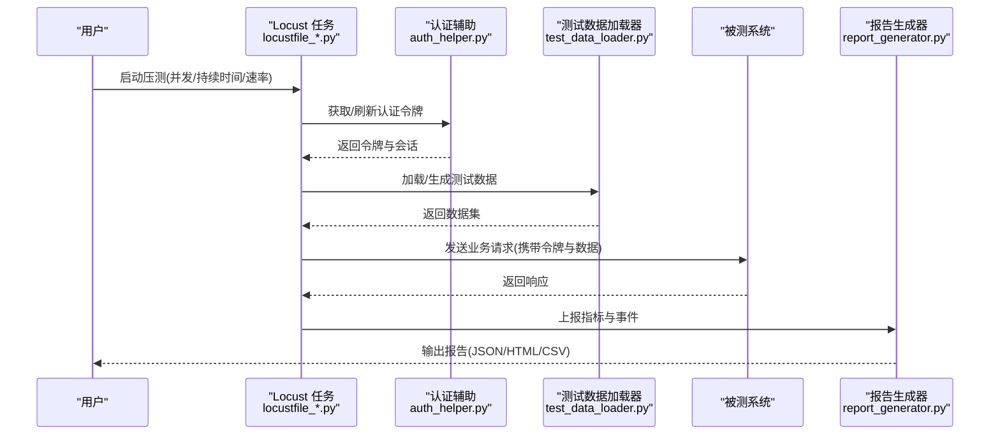
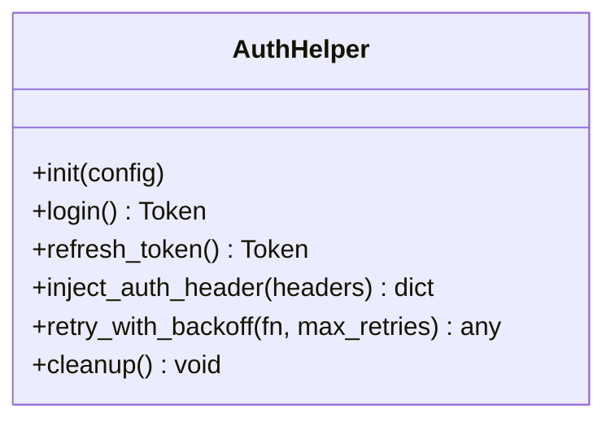
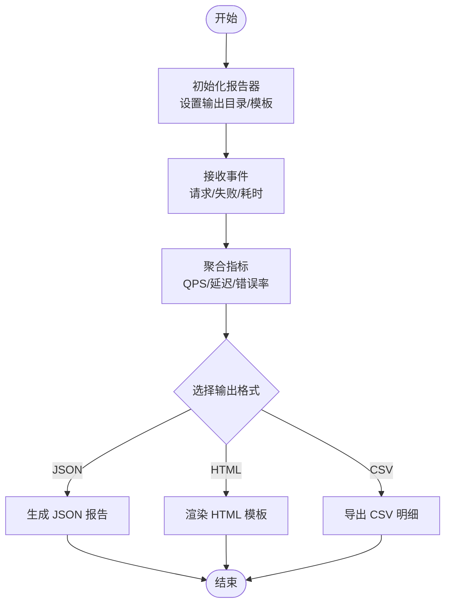
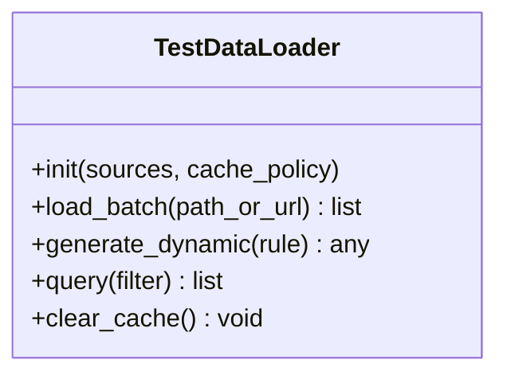
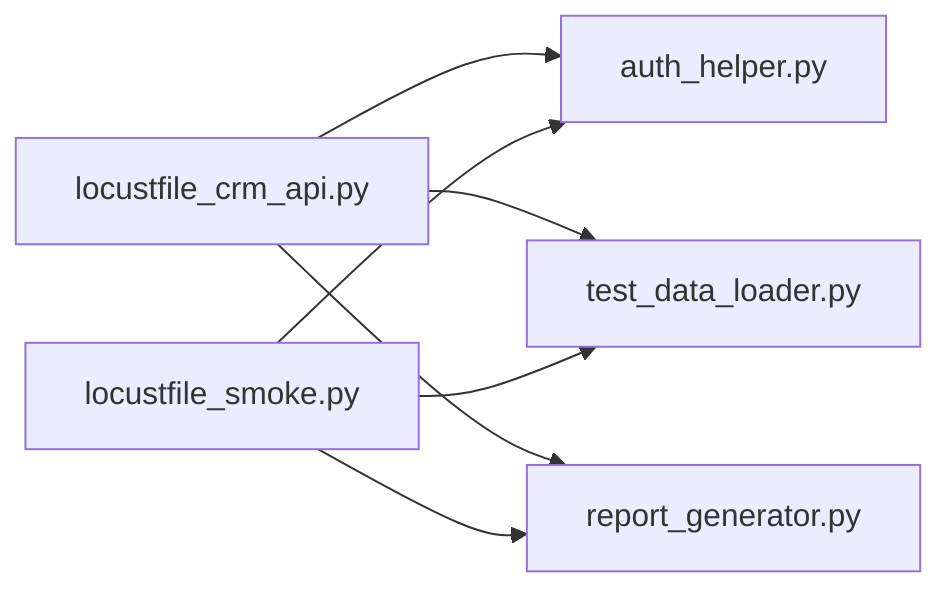

# 性能测试API

<cite>
**本文引用的文件**   
- [tests/performance/locust/utils/auth_helper.py](file://tests/performance/locust/utils/auth_helper.py)
- [tests/performance/locust/utils/report_generator.py](file://tests/performance/locust/utils/report_generator.py)
- [tests/performance/locust/utils/test_data_loader.py](file://tests/performance/locust/utils/test_data_loader.py)
- [tests/performance/locust/api/locustfile_crm_api.py](file://tests/performance/locust/api/locustfile_crm_api.py)
- [tests/performance/locust/api/locustfile_smoke.py](file://tests/performance/locust/api/locustfile_smoke.py)
- [tests/performance/locust/config/load_profiles.yaml](file://tests/performance/locust/config/load_profiles.yaml)
- [scripts/run-perf-tests.sh](file://scripts/run-perf-tests.sh)
- [scripts/run-perf-tests.ps1](file://scripts/run-perf-tests.ps1)
</cite>

## 目录
1. [简介](#简介)
2. [项目结构](#项目结构)
3. [核心组件](#核心组件)
4. [架构总览](#架构总览)
5. [详细组件分析](#详细组件分析)
6. [依赖关系分析](#依赖关系分析)
7. [性能考量](#性能考量)
8. [故障排查指南](#故障排查指南)
9. [结论](#结论)
10. [附录](#附录)

## 简介
本参考文档面向使用 AutoTest Hub 框架进行 Locust 性能测试的工程师，聚焦以下目标：
- 工具函数接口：认证辅助、报告生成与测试数据加载器的 API 规范与用法说明
- 负载测试配置：用户行为模拟、并发模型与指标收集策略
- 报告输出格式与自定义模板：如何扩展报告内容并统一输出
- 测试数据准备：批量数据与动态数据生成的最佳实践
- 完整脚本示例：高效编写负载测试用例的步骤与要点
- 监控与分析：性能监控与结果分析的最佳实践

## 项目结构
性能测试相关代码位于 tests/performance/locust 目录下，按职责分层组织：
- api：Locust 任务脚本（HTTP 场景）
- utils：通用工具（认证、报告、数据加载）
- config：负载配置文件（如用户画像与并发参数）
- results：运行产物（报告、统计等）

图表来源
- [tests/performance/locust/api/locustfile_crm_api.py](file://tests/performance/locust/api/locustfile_crm_api.py)
- [tests/performance/locust/api/locustfile_smoke.py](file://tests/performance/locust/api/locustfile_smoke.py)
- [tests/performance/locust/utils/auth_helper.py](file://tests/performance/locust/utils/auth_helper.py)
- [tests/performance/locust/utils/report_generator.py](file://tests/performance/locust/utils/report_generator.py)
- [tests/performance/locust/utils/test_data_loader.py](file://tests/performance/locust/utils/test_data_loader.py)
- [tests/performance/locust/config/load_profiles.yaml](file://tests/performance/locust/config/load_profiles.yaml)

章节来源
- [tests/performance/locust/api/locustfile_crm_api.py](file://tests/performance/locust/api/locustfile_crm_api.py)
- [tests/performance/locust/api/locustfile_smoke.py](file://tests/performance/locust/api/locustfile_smoke.py)
- [tests/performance/locust/utils/auth_helper.py](file://tests/performance/locust/utils/auth_helper.py)
- [tests/performance/locust/utils/report_generator.py](file://tests/performance/locust/utils/report_generator.py)
- [tests/performance/locust/utils/test_data_loader.py](file://tests/performance/locust/utils/test_data_loader.py)
- [tests/performance/locust/config/load_profiles.yaml](file://tests/performance/locust/config/load_profiles.yaml)

## 核心组件
本节概述三大工具模块的职责与对外能力。

- 认证辅助 auth_helper
  - 负责登录获取令牌、刷新令牌、缓存会话、异常重试与鉴权头注入
  - 提供统一的认证上下文，供各任务复用
- 报告生成器 report_generator
  - 聚合 Locust 运行结果，生成结构化报告（JSON/HTML/CSV）
  - 支持自定义模板与字段扩展
- 测试数据加载器 test_data_loader
  - 从 YAML/CSV/内存工厂加载测试数据
  - 支持批量预取与动态生成（随机化、序列号、时间戳等）

章节来源
- [tests/performance/locust/utils/auth_helper.py](file://tests/performance/locust/utils/auth_helper.py)
- [tests/performance/locust/utils/report_generator.py](file://tests/performance/locust/utils/report_generator.py)
- [tests/performance/locust/utils/test_data_loader.py](file://tests/performance/locust/utils/test_data_loader.py)

## 架构总览
下图展示一次典型性能测试的执行路径：任务脚本调用工具层完成认证、数据准备与请求发送；报告生成器汇总指标并输出。

图表来源
- [tests/performance/locust/api/locustfile_crm_api.py](file://tests/performance/locust/api/locustfile_crm_api.py)
- [tests/performance/locust/api/locustfile_smoke.py](file://tests/performance/locust/api/locustfile_smoke.py)
- [tests/performance/locust/utils/auth_helper.py](file://tests/performance/locust/utils/auth_helper.py)
- [tests/performance/locust/utils/report_generator.py](file://tests/performance/locust/utils/report_generator.py)
- [tests/performance/locust/utils/test_data_loader.py](file://tests/performance/locust/utils/test_data_loader.py)

## 详细组件分析

### 认证辅助（auth_helper）
- 主要职责
  - 登录获取访问令牌与刷新令牌
  - 自动刷新过期令牌
  - 在请求前注入鉴权头
  - 失败重试与退避策略
- 关键方法（概念性描述）
  - 初始化：读取凭据与端点配置
  - 登录：提交用户名/密码或密钥，返回令牌对象
  - 刷新：基于刷新令牌更新访问令牌
  - 注入：为后续请求设置 Authorization 头
  - 清理：释放会话资源
- 错误处理
  - 网络异常、超时、401/403 等状态码分类处理
  - 指数退避与最大重试次数控制
- 集成方式
  - 在 Locust Task 中通过上下文或类属性持有认证实例
  - 将令牌注入到 HTTP 客户端默认头

图表来源
- [tests/performance/locust/utils/auth_helper.py](file://tests/performance/locust/utils/auth_helper.py)

章节来源
- [tests/performance/locust/utils/auth_helper.py](file://tests/performance/locust/utils/auth_helper.py)

### 报告生成器（report_generator）
- 主要职责
  - 聚合 Locust 运行期指标（QPS、延迟分布、错误率、成功率）
  - 输出多格式报告：JSON、HTML、CSV
  - 支持自定义模板与字段扩展
- 关键方法（概念性描述）
  - 初始化：指定输出目录与模板路径
  - 记录事件：接收任务上报的请求/失败/耗时等事件
  - 生成报告：渲染模板并落盘
  - 导出摘要：生成关键指标摘要
- 输出格式
  - JSON：结构化指标与元数据
  - HTML：可视化报表（趋势图、Top N 慢接口）
  - CSV：便于二次分析与导入 BI
- 自定义模板
  - 通过模板变量注入运行参数、环境信息与指标集合
  - 支持条件渲染与分组统计

图表来源
- [tests/performance/locust/utils/report_generator.py](file://tests/performance/locust/utils/report_generator.py)

章节来源
- [tests/performance/locust/utils/report_generator.py](file://tests/performance/locust/utils/report_generator.py)

### 测试数据加载器（test_data_loader）
- 主要职责
  - 从 YAML/CSV/内存工厂加载数据
  - 支持批量预取与按需动态生成
  - 提供数据校验与去重能力
- 关键方法（概念性描述）
  - 初始化：配置数据源与缓存策略
  - 批量加载：一次性读取大批量数据至内存/磁盘缓存
  - 动态生成：根据规则生成随机/序列/时间戳数据
  - 查询与过滤：按键值、范围、标签检索
  - 清理：释放缓存与临时文件
- 数据源类型
  - YAML：结构化配置与静态数据
  - CSV：大规模行数据
  - 工厂：运行时生成（含种子控制）
- 性能建议
  - 大文件采用分块读取与惰性加载
  - 热点数据加入内存缓存
  - 避免重复 I/O，尽量批量化

图表来源
- [tests/performance/locust/utils/test_data_loader.py](file://tests/performance/locust/utils/test_data_loader.py)

章节来源
- [tests/performance/locust/utils/test_data_loader.py](file://tests/performance/locust/utils/test_data_loader.py)

### 负载配置文件（load_profiles.yaml）
- 用途
  - 定义不同负载画像（低/中/高），包括并发数、爬坡时长、持续时间、RPS 目标等
- 关键字段（概念性描述）
  - users：虚拟用户总数
  - spawn_rate：每秒新增用户数
  - run_time：总运行时长
  - target_rps：目标 QPS
  - ramp_up_duration：爬坡阶段时长
- 使用方式
  - 在启动脚本或命令行传入 profile 名称，由任务脚本解析并应用

章节来源
- [tests/performance/locust/config/load_profiles.yaml](file://tests/performance/locust/config/load_profiles.yaml)

### 任务脚本示例（CRM API 与 Smoke）
- locustfile_crm_api.py
  - 演示 CRM 领域接口的负载场景编排
  - 结合认证辅助与数据加载器构造请求
  - 上报自定义指标与断言结果
- locustfile_smoke.py
  - 轻量冒烟场景，快速验证链路可用性
  - 最小化数据依赖，适合频繁回归

章节来源
- [tests/performance/locust/api/locustfile_crm_api.py](file://tests/performance/locust/api/locustfile_crm_api.py)
- [tests/performance/locust/api/locustfile_smoke.py](file://tests/performance/locust/api/locustfile_smoke.py)

## 依赖关系分析
- 组件耦合
  - 任务脚本依赖认证辅助与数据加载器
  - 报告生成器独立于业务逻辑，仅消费事件
- 外部依赖
  - Locust 运行时与事件总线
  - 文件系统（报告与数据缓存）
  - 可选：外部存储（对象存储/数据库）用于持久化报告

图表来源
- [tests/performance/locust/api/locustfile_crm_api.py](file://tests/performance/locust/api/locustfile_crm_api.py)
- [tests/performance/locust/api/locustfile_smoke.py](file://tests/performance/locust/api/locustfile_smoke.py)
- [tests/performance/locust/utils/auth_helper.py](file://tests/performance/locust/utils/auth_helper.py)
- [tests/performance/locust/utils/report_generator.py](file://tests/performance/locust/utils/report_generator.py)
- [tests/performance/locust/utils/test_data_loader.py](file://tests/performance/locust/utils/test_data_loader.py)

## 性能考量
- 并发模型
  - 合理设置 users/spawn_rate/run_time，避免瞬时峰值导致目标系统抖动
- 数据准备
  - 预热数据缓存，减少 I/O 抖动
  - 对热点数据进行局部去重与复用
- 指标采集
  - 控制上报频率，避免过多事件影响主流程
  - 使用采样与聚合降低开销
- 网络与连接
  - 复用连接池，合理设置超时与重试
- 报告写入
  - 异步落盘或缓冲合并，避免阻塞请求路径

[本节为通用指导，不直接分析具体文件]

## 故障排查指南
- 认证失败
  - 检查凭据与端点配置
  - 查看令牌刷新日志与重试次数
- 数据加载异常
  - 校验数据源路径与编码
  - 确认缓存目录权限与空间
- 报告未生成
  - 检查输出目录权限
  - 确认模板路径与变量完整性
- 指标缺失
  - 核对事件上报是否被拦截或过滤
  - 检查报告生成器初始化参数

章节来源
- [tests/performance/locust/utils/auth_helper.py](file://tests/performance/locust/utils/auth_helper.py)
- [tests/performance/locust/utils/report_generator.py](file://tests/performance/locust/utils/report_generator.py)
- [tests/performance/locust/utils/test_data_loader.py](file://tests/performance/locust/utils/test_data_loader.py)

## 结论
通过认证辅助、报告生成器与测试数据加载器的协同，AutoTest Hub 的性能测试体系实现了“可配置、可扩展、可观测”的目标。建议在团队内统一负载画像与报告模板，沉淀常用数据工厂与断言库，持续提升压测效率与结果可信度。

[本节为总结性内容，不直接分析具体文件]

## 附录

### 运行命令参考
- Linux/macOS
  - 执行脚本：scripts/run-perf-tests.sh
- Windows PowerShell
  - 执行脚本：scripts/run-perf-tests.ps1

章节来源
- [scripts/run-perf-tests.sh](file://scripts/run-perf-tests.sh)
- [scripts/run-perf-tests.ps1](file://scripts/run-perf-tests.ps1)