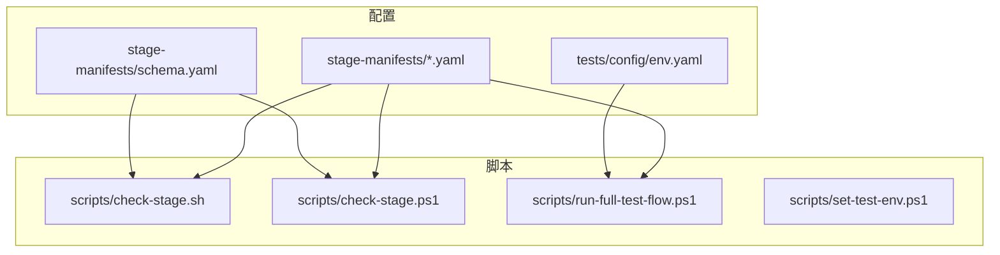
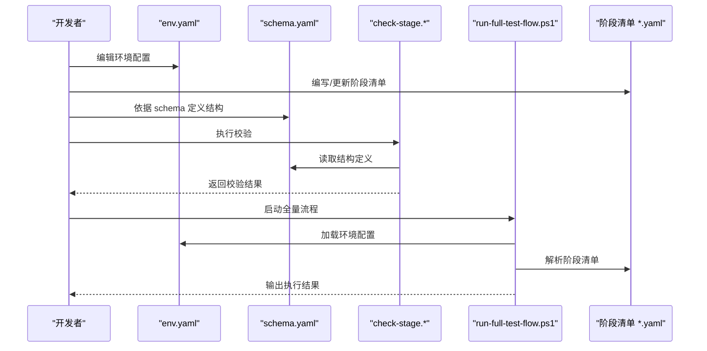
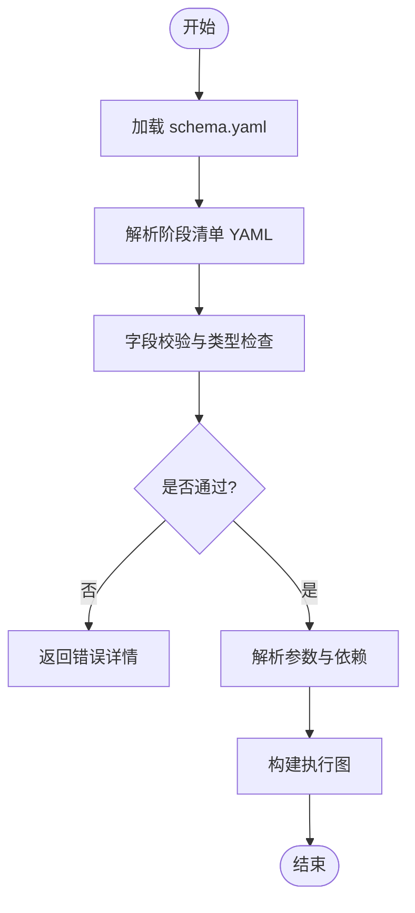
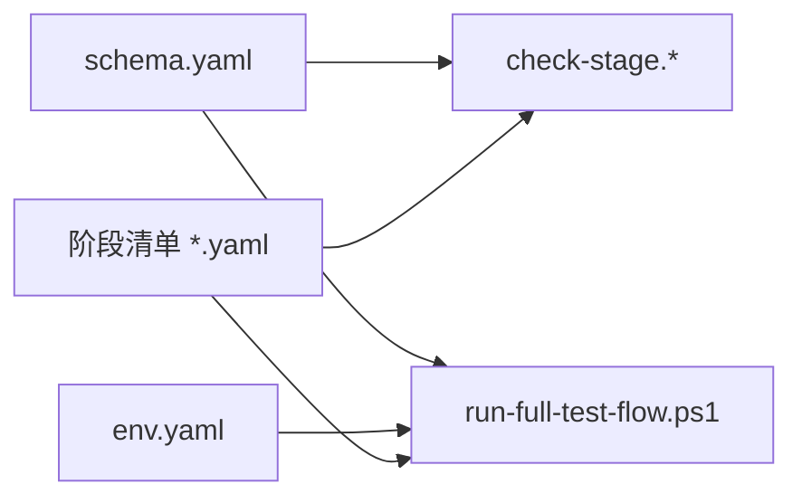

# 配置管理API

<cite>
**本文引用的文件**   
- [stage-manifests/schema.yaml](file://stage-manifests/schema.yaml)
- [stage-manifests/01-req-analysis.yaml](file://stage-manifests/01-req-analysis.yaml)
- [stage-manifests/02-test-design.yaml](file://stage-manifests/02-test-design.yaml)
- [stage-manifests/03-case-generation.yaml](file://stage-manifests/03-case-generation.yaml)
- [stage-manifests/04-case-review.yaml](file://stage-manifests/04-case-review.yaml)
- [stage-manifests/05-api-automation.yaml](file://stage-manifests/05-api-automation.yaml)
- [stage-manifests/06-ui-automation.yaml](file://stage-manifests/06-ui-automation.yaml)
- [stage-manifests/07-performance.yaml](file://stage-manifests/07-performance.yaml)
- [stage-manifests/08-security.yaml](file://stage-manifests/08-security.yaml)
- [stage-manifests/09-system-test-report.yaml](file://stage-manifests/09-system-test-report.yaml)
- [stage-manifests/10-knowledge-base.yaml](file://stage-manifests/10-knowledge-base.yaml)
- [tests/config/env.yaml](file://tests/config/env.yaml)
- [scripts/check-stage.sh](file://scripts/check-stage.sh)
- [scripts/check-stage.ps1](file://scripts/check-stage.ps1)
- [scripts/run-full-test-flow.ps1](file://scripts/run-full-test-flow.ps1)
- [scripts/set-test-env.ps1](file://scripts/set-test-env.ps1)
</cite>

## 目录
1. [简介](#简介)
2. [项目结构](#项目结构)
3. [核心组件](#核心组件)
4. [架构总览](#架构总览)
5. [详细组件分析](#详细组件分析)
6. [依赖关系分析](#依赖关系分析)
7. [性能考虑](#性能考虑)
8. [故障排查指南](#故障排查指南)
9. [结论](#结论)
10. [附录](#附录)

## 简介
本文件为 AutoTest Hub 框架的配置管理 API 提供全面参考，聚焦于：
- 环境配置的 YAML 结构定义（数据库连接、API 端点、测试参数）
- 阶段清单（Stage Manifest）的配置模式与测试流程定义
- 配置文件验证规则与默认值策略
- 多环境切换方法与配置优先级
- 完整示例与最佳实践
- 热重载机制说明与注意事项

## 项目结构
本项目采用“阶段清单 + 环境配置”的双层配置模型：
- 阶段清单位于 stage-manifests 目录，描述测试流水线各阶段的执行顺序、输入输出、参数与环境。
- 环境配置位于 tests/config/env.yaml，用于承载不同运行环境的差异化设置（如数据库、API 地址、超时等）。
- 脚本位于 scripts 目录，负责校验、加载与驱动阶段清单的执行。

图表来源
- [stage-manifests/schema.yaml](file://stage-manifests/schema.yaml)
- [tests/config/env.yaml](file://tests/config/env.yaml)
- [scripts/check-stage.sh](file://scripts/check-stage.sh)
- [scripts/check-stage.ps1](file://scripts/check-stage.ps1)
- [scripts/run-full-test-flow.ps1](file://scripts/run-full-test-flow.ps1)

章节来源
- [stage-manifests/schema.yaml](file://stage-manifests/schema.yaml)
- [tests/config/env.yaml](file://tests/config/env.yaml)
- [scripts/check-stage.sh](file://scripts/check-stage.sh)
- [scripts/check-stage.ps1](file://scripts/check-stage.ps1)
- [scripts/run-full-test-flow.ps1](file://scripts/run-full-test-flow.ps1)

## 核心组件
- 阶段清单（Stage Manifest）
  - 描述单个测试阶段的元数据、执行命令、输入输出、依赖关系与参数注入方式。
  - 通过 schema.yaml 进行结构约束与校验。
- 环境配置（env.yaml）
  - 集中管理数据库连接、API 端点、测试参数等运行时变量。
  - 支持按环境覆盖与合并。
- 校验与运行脚本
  - check-stage.*：对阶段清单进行结构与语义校验。
  - run-full-test-flow.ps1：编排并执行阶段清单。
  - set-test-env.ps1：设置或切换环境变量。

章节来源
- [stage-manifests/schema.yaml](file://stage-manifests/schema.yaml)
- [tests/config/env.yaml](file://tests/config/env.yaml)
- [scripts/check-stage.sh](file://scripts/check-stage.sh)
- [scripts/check-stage.ps1](file://scripts/check-stage.ps1)
- [scripts/run-full-test-flow.ps1](file://scripts/run-full-test-flow.ps1)
- [scripts/set-test-env.ps1](file://scripts/set-test-env.ps1)

## 架构总览
下图展示了配置加载、校验与执行的端到端流程。

图表来源
- [tests/config/env.yaml](file://tests/config/env.yaml)
- [stage-manifests/schema.yaml](file://stage-manifests/schema.yaml)
- [scripts/check-stage.sh](file://scripts/check-stage.sh)
- [scripts/check-stage.ps1](file://scripts/check-stage.ps1)
- [scripts/run-full-test-flow.ps1](file://scripts/run-full-test-flow.ps1)

## 详细组件分析

### 阶段清单（Stage Manifest）配置模式
- 目标
  - 以声明式 YAML 描述测试阶段，包括阶段标识、执行命令、输入输出、依赖与参数注入。
- 关键要点
  - 使用 schema.yaml 定义的字段进行约束，确保一致性。
  - 通过参数占位符引用 env.yaml 中的键值，实现环境解耦。
  - 可定义阶段间的依赖关系，形成有向无环图（DAG）式的执行流。
- 典型字段类别（概念性说明）
  - 元信息：名称、版本、描述
  - 执行：命令、工作目录、超时
  - 输入输出：数据集、报告路径、产物
  - 依赖：前置阶段、条件分支
  - 参数：来自 env.yaml 的注入键

图表来源
- [stage-manifests/schema.yaml](file://stage-manifests/schema.yaml)
- [stage-manifests/01-req-analysis.yaml](file://stage-manifests/01-req-analysis.yaml)
- [stage-manifests/02-test-design.yaml](file://stage-manifests/02-test-design.yaml)
- [stage-manifests/03-case-generation.yaml](file://stage-manifests/03-case-generation.yaml)
- [stage-manifests/04-case-review.yaml](file://stage-manifests/04-case-review.yaml)
- [stage-manifests/05-api-automation.yaml](file://stage-manifests/05-api-automation.yaml)
- [stage-manifests/06-ui-automation.yaml](file://stage-manifests/06-ui-automation.yaml)
- [stage-manifests/07-performance.yaml](file://stage-manifests/07-performance.yaml)
- [stage-manifests/08-security.yaml](file://stage-manifests/08-security.yaml)
- [stage-manifests/09-system-test-report.yaml](file://stage-manifests/09-system-test-report.yaml)
- [stage-manifests/10-knowledge-base.yaml](file://stage-manifests/10-knowledge-base.yaml)

章节来源
- [stage-manifests/schema.yaml](file://stage-manifests/schema.yaml)
- [stage-manifests/01-req-analysis.yaml](file://stage-manifests/01-req-analysis.yaml)
- [stage-manifests/02-test-design.yaml](file://stage-manifests/02-test-design.yaml)
- [stage-manifests/03-case-generation.yaml](file://stage-manifests/03-case-generation.yaml)
- [stage-manifests/04-case-review.yaml](file://stage-manifests/04-case-review.yaml)
- [stage-manifests/05-api-automation.yaml](file://stage-manifests/05-api-automation.yaml)
- [stage-manifests/06-ui-automation.yaml](file://stage-manifests/06-ui-automation.yaml)
- [stage-manifests/07-performance.yaml](file://stage-manifests/07-performance.yaml)
- [stage-manifests/08-security.yaml](file://stage-manifests/08-security.yaml)
- [stage-manifests/09-system-test-report.yaml](file://stage-manifests/09-system-test-report.yaml)
- [stage-manifests/10-knowledge-base.yaml](file://stage-manifests/10-knowledge-base.yaml)

### 环境配置（env.yaml）结构定义
- 作用
  - 集中管理数据库连接、API 端点、测试参数等运行时变量，供阶段清单在运行时注入。
- 建议结构（概念性说明）
  - 数据库：主机、端口、库名、用户名、密码、SSL/连接池等
  - API：基础地址、鉴权头、重试策略、超时
  - 测试：并发度、超时、日志级别、产物路径
- 安全提示
  - 敏感信息建议使用外部密钥管理服务或 CI/CD 加密变量，避免直接写入仓库。

章节来源
- [tests/config/env.yaml](file://tests/config/env.yaml)

### 配置文件验证规则与默认值
- 验证入口
  - 通过 check-stage.* 脚本调用 schema.yaml 进行结构与类型校验。
- 常见规则（概念性说明）
  - 必填字段、枚举值、数值范围、正则匹配、嵌套对象约束
- 默认值策略
  - 未显式提供的可选字段可采用合理默认值；缺失必填字段将导致校验失败。

章节来源
- [stage-manifests/schema.yaml](file://stage-manifests/schema.yaml)
- [scripts/check-stage.sh](file://scripts/check-stage.sh)
- [scripts/check-stage.ps1](file://scripts/check-stage.ps1)

### 多环境配置切换与优先级
- 切换方法
  - 通过 set-test-env.ps1 设置当前环境标识，或在运行前指定环境配置文件路径。
- 优先级（概念性说明）
  - 进程环境变量 > 命令行传入 > 环境配置文件 > 全局默认值
- 建议
  - 为每个环境维护独立的环境配置文件，并通过统一入口切换。

章节来源
- [scripts/set-test-env.ps1](file://scripts/set-test-env.ps1)
- [scripts/run-full-test-flow.ps1](file://scripts/run-full-test-flow.ps1)

### 阶段清单示例与差异演示
- 示例清单
  - 需求分析、测试设计、用例生成、用例评审、接口自动化、UI 自动化、性能、安全、系统测试报告、知识库等阶段清单均遵循同一 schema。
- 差异点
  - 不同阶段包含不同的输入输出、命令与参数；可通过 env.yaml 注入环境相关差异。

章节来源
- [stage-manifests/01-req-analysis.yaml](file://stage-manifests/01-req-analysis.yaml)
- [stage-manifests/02-test-design.yaml](file://stage-manifests/02-test-design.yaml)
- [stage-manifests/03-case-generation.yaml](file://stage-manifests/03-case-generation.yaml)
- [stage-manifests/04-case-review.yaml](file://stage-manifests/04-case-review.yaml)
- [stage-manifests/05-api-automation.yaml](file://stage-manifests/05-api-automation.yaml)
- [stage-manifests/06-ui-automation.yaml](file://stage-manifests/06-ui-automation.yaml)
- [stage-manifests/07-performance.yaml](file://stage-manifests/07-performance.yaml)
- [stage-manifests/08-security.yaml](file://stage-manifests/08-security.yaml)
- [stage-manifests/09-system-test-report.yaml](file://stage-manifests/09-system-test-report.yaml)
- [stage-manifests/10-knowledge-base.yaml](file://stage-manifests/10-knowledge-base.yaml)

### 配置的热重载机制与最佳实践
- 热重载
  - 若运行器在单次进程中持续监听配置变更，可实现热重载；否则每次执行会重新加载配置。
- 最佳实践
  - 将配置变更纳入版本控制；敏感信息走外部密钥管理；变更前后执行校验脚本；记录变更审计日志。

[本节为通用指导，不直接分析具体文件]

## 依赖关系分析
- 阶段清单依赖 schema.yaml 的结构定义
- 运行脚本依赖 env.yaml 与阶段清单
- 校验脚本依赖 schema.yaml 与阶段清单

图表来源
- [stage-manifests/schema.yaml](file://stage-manifests/schema.yaml)
- [tests/config/env.yaml](file://tests/config/env.yaml)
- [scripts/check-stage.sh](file://scripts/check-stage.sh)
- [scripts/check-stage.ps1](file://scripts/check-stage.ps1)
- [scripts/run-full-test-flow.ps1](file://scripts/run-full-test-flow.ps1)

章节来源
- [stage-manifests/schema.yaml](file://stage-manifests/schema.yaml)
- [tests/config/env.yaml](file://tests/config/env.yaml)
- [scripts/check-stage.sh](file://scripts/check-stage.sh)
- [scripts/check-stage.ps1](file://scripts/check-stage.ps1)
- [scripts/run-full-test-flow.ps1](file://scripts/run-full-test-flow.ps1)

## 性能考虑
- 减少不必要的配置重读：在长生命周期进程中缓存已校验的配置。
- 批量校验：对多个阶段清单一次性校验，降低 I/O 开销。
- 并行执行：在 DAG 允许的情况下并行执行无依赖的阶段。

[本节为通用指导，不直接分析具体文件]

## 故障排查指南
- 常见问题
  - 校验失败：检查必填字段、类型与取值范围是否符合 schema.yaml。
  - 参数未注入：确认 env.yaml 中键名与阶段清单占位符一致。
  - 环境切换无效：检查 set-test-env.ps1 的设置与运行器的读取逻辑。
- 定位步骤
  - 先运行校验脚本获取详细错误信息
  - 核对 env.yaml 与阶段清单的参数映射
  - 查看运行日志中的加载顺序与最终生效值

章节来源
- [scripts/check-stage.sh](file://scripts/check-stage.sh)
- [scripts/check-stage.ps1](file://scripts/check-stage.ps1)
- [scripts/run-full-test-flow.ps1](file://scripts/run-full-test-flow.ps1)
- [scripts/set-test-env.ps1](file://scripts/set-test-env.ps1)

## 结论
AutoTest Hub 通过“阶段清单 + 环境配置”的组合实现了高内聚、低耦合的可配置化测试流水线。借助 schema.yaml 的强约束与校验脚本，可有效保障配置质量；通过 env.yaml 与环境切换脚本，实现多环境灵活管理。遵循本文的最佳实践，可进一步提升稳定性与可维护性。

## 附录
- 术语
  - 阶段清单：描述单个测试阶段的声明式 YAML 文件
  - 环境配置：集中存放运行时变量的 YAML 文件
  - 校验脚本：基于 schema 对阶段清单进行结构与类型校验的工具
- 快速上手
  - 编写阶段清单时严格遵循 schema.yaml
  - 在 env.yaml 中维护环境差异
  - 使用校验脚本与运行脚本完成闭环

[本节为补充说明，不直接分析具体文件]