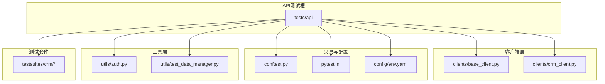
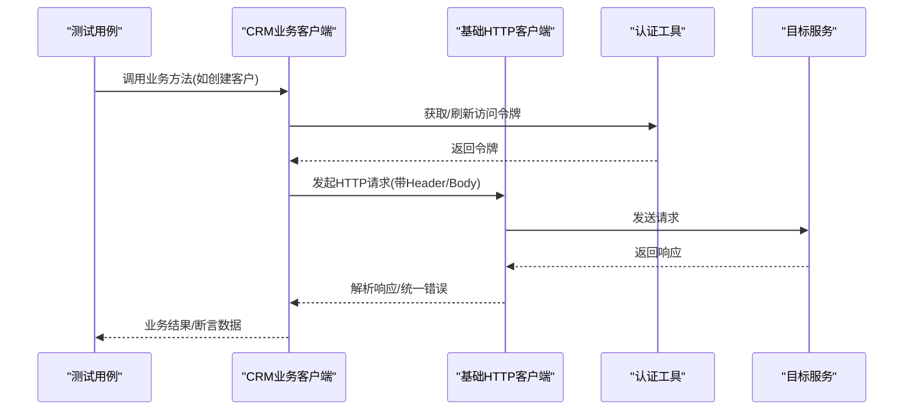
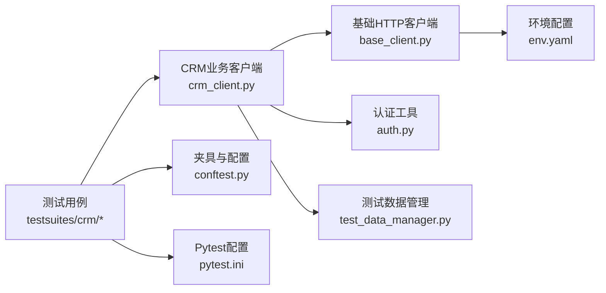

# API测试框架

<cite>
**本文档引用的文件**
- [tests/api/clients/base_client.py](file://tests/api/clients/base_client.py)
- [tests/api/clients/crm_client.py](file://tests/api/clients/crm_client.py)
- [tests/api/conftest.py](file://tests/api/conftest.py)
- [tests/api/pytest.ini](file://tests/api/pytest.ini)
- [tests/config/env.yaml](file://tests/config/env.yaml)
- [tests/utils/auth.py](file://tests/utils/auth.py)
- [tests/utils/test_data_manager.py](file://tests/utils/test_data_manager.py)
- [tests/api/testsuites/crm/test_crm_api.py](file://tests/api/testsuites/crm/test_crm_api.py)
- [tests/api/testsuites/crm/test_crm_business.py](file://tests/api/testsuites/crm/test_crm_business.py)
- [tests/api/testsuites/crm/test_crm_crud.py](file://tests/api/testsuites/crm/test_crm_crud.py)
- [tests/api/testsuites/crm/test_crm_full.py](file://tests/api/testsuites/crm/test_crm_full.py)
- [tests/api/testsuites/crm/test_cross_interface_consistency.py](file://tests/api/testsuites/crm/test_cross_interface_consistency.py)
- [tests/api/testsuites/crm/test_data_consistency.py](file://tests/api/testsuites/crm/test_data_consistency.py)
- [tests/api/testsuites/crm/test_month_on_month_consistency.py](file://tests/api/testsuites/crm/test_month_on_month_consistency.py)
- [tests/api/testsuites/crm/test_target_consistency.py](file://tests/api/testsuites/crm/test_target_consistency.py)
</cite>

## 目录
1. [简介](#简介)
2. [项目结构](#项目结构)
3. [核心组件](#核心组件)
4. [架构总览](#架构总览)
5. [详细组件分析](#详细组件分析)
6. [依赖关系分析](#依赖关系分析)
7. [性能考虑](#性能考虑)
8. [故障排查指南](#故障排查指南)
9. [结论](#结论)
10. [附录](#附录)

## 简介
本技术文档面向AutoTest Hub的API测试框架，围绕基于Pytest的API自动化测试体系展开，重点阐述以下方面：
- 基础HTTP客户端封装与CRM业务客户端实现
- 测试夹具（Fixture）管理与配置管理
- 认证机制、请求构造、响应验证与断言策略
- 测试用例组织与命名规范
- CRUD操作测试、业务流程测试与数据一致性测试的实现模式
- 错误处理、日志记录与调试技巧
- 测试数据管理与隔离机制
- 并行执行与结果报告生成

该框架以Pytest为核心，结合分层客户端设计、集中式配置与环境变量管理、统一的断言与异常处理策略，提供稳定、可维护、可扩展的API测试能力。

## 项目结构
API测试相关代码主要位于tests/api目录下，按职责划分为客户端、夹具、配置、工具与测试套件等模块；CRM业务测试集中在tests/api/testsuites/crm中，便于按领域组织用例。

图表来源
- [tests/api/clients/base_client.py](file://tests/api/clients/base_client.py)
- [tests/api/clients/crm_client.py](file://tests/api/clients/crm_client.py)
- [tests/api/conftest.py](file://tests/api/conftest.py)
- [tests/api/pytest.ini](file://tests/api/pytest.ini)
- [tests/config/env.yaml](file://tests/config/env.yaml)
- [tests/utils/auth.py](file://tests/utils/auth.py)
- [tests/utils/test_data_manager.py](file://tests/utils/test_data_manager.py)
- [tests/api/testsuites/crm/test_crm_api.py](file://tests/api/testsuites/crm/test_crm_api.py)
- [tests/api/testsuites/crm/test_crm_business.py](file://tests/api/testsuites/crm/test_crm_business.py)
- [tests/api/testsuites/crm/test_crm_crud.py](file://tests/api/testsuites/crm/test_crm_crud.py)
- [tests/api/testsuites/crm/test_crm_full.py](file://tests/api/testsuites/crm/test_crm_full.py)
- [tests/api/testsuites/crm/test_cross_interface_consistency.py](file://tests/api/testsuites/crm/test_cross_interface_consistency.py)
- [tests/api/testsuites/crm/test_data_consistency.py](file://tests/api/testsuites/crm/test_data_consistency.py)
- [tests/api/testsuites/crm/test_month_on_month_consistency.py](file://tests/api/testsuites/crm/test_month_on_month_consistency.py)
- [tests/api/testsuites/crm/test_target_consistency.py](file://tests/api/testsuites/crm/test_target_consistency.py)

章节来源
- [tests/api/clients/base_client.py](file://tests/api/clients/base_client.py)
- [tests/api/clients/crm_client.py](file://tests/api/clients/crm_client.py)
- [tests/api/conftest.py](file://tests/api/conftest.py)
- [tests/api/pytest.ini](file://tests/api/pytest.ini)
- [tests/config/env.yaml](file://tests/config/env.yaml)
- [tests/utils/auth.py](file://tests/utils/auth.py)
- [tests/utils/test_data_manager.py](file://tests/utils/test_data_manager.py)
- [tests/api/testsuites/crm/test_crm_api.py](file://tests/api/testsuites/crm/test_crm_api.py)
- [tests/api/testsuites/crm/test_crm_business.py](file://tests/api/testsuites/crm/test_crm_business.py)
- [tests/api/testsuites/crm/test_crm_crud.py](file://tests/api/testsuites/crm/test_crm_crud.py)
- [tests/api/testsuites/crm/test_crm_full.py](file://tests/api/testsuites/crm/test_crm_full.py)
- [tests/api/testsuites/crm/test_cross_interface_consistency.py](file://tests/api/testsuites/crm/test_cross_interface_consistency.py)
- [tests/api/testsuites/crm/test_data_consistency.py](file://tests/api/testsuites/crm/test_data_consistency.py)
- [tests/api/testsuites/crm/test_month_on_month_consistency.py](file://tests/api/testsuites/crm/test_month_on_month_consistency.py)
- [tests/api/testsuites/crm/test_target_consistency.py](file://tests/api/testsuites/crm/test_target_consistency.py)

## 核心组件
- 基础HTTP客户端（base_client.py）
  - 职责：统一封装HTTP请求方法、超时、重试、鉴权头注入、请求/响应日志、通用错误处理与断言辅助。
  - 关键点：会话复用、连接池、标准化错误包装、可插拔拦截器（如签名、审计）。
- CRM业务客户端（crm_client.py）
  - 职责：在基础客户端之上抽象CRM域内常用接口（如客户、商机、联系人、产品、报价等），提供语义化方法。
  - 关键点：路径拼接、参数校验、业务级错误码映射、批量操作封装。
- 夹具与配置（conftest.py, pytest.ini, env.yaml）
  - 职责：提供全局夹具（如登录态、环境配置、测试数据工厂）、定义Pytest运行参数、加载环境变量与配置。
  - 关键点：fixture作用域控制、按需初始化与清理、多环境切换。
- 工具层（auth.py, test_data_manager.py）
  - 职责：认证流程封装（获取Token、刷新、权限校验）、测试数据创建/清理/隔离。
  - 关键点：幂等性、事务回滚或软删除、数据版本化。

章节来源
- [tests/api/clients/base_client.py](file://tests/api/clients/base_client.py)
- [tests/api/clients/crm_client.py](file://tests/api/clients/crm_client.py)
- [tests/api/conftest.py](file://tests/api/conftest.py)
- [tests/api/pytest.ini](file://tests/api/pytest.ini)
- [tests/config/env.yaml](file://tests/config/env.yaml)
- [tests/utils/auth.py](file://tests/utils/auth.py)
- [tests/utils/test_data_manager.py](file://tests/utils/test_data_manager.py)

## 架构总览
整体采用“测试用例 → 业务客户端 → 基础HTTP客户端 → 目标服务”的分层调用链，配合夹具与工具层完成认证、数据准备与断言。

图表来源
- [tests/api/clients/crm_client.py](file://tests/api/clients/crm_client.py)
- [tests/api/clients/base_client.py](file://tests/api/clients/base_client.py)
- [tests/utils/auth.py](file://tests/utils/auth.py)

## 详细组件分析

### 基础HTTP客户端（base_client.py）
- 设计要点
  - 统一封装GET/POST/PUT/DELETE等方法，支持超时、重试、退避策略。
  - 自动注入鉴权头、追踪ID、审计字段。
  - 标准化响应体解析与错误分类（网络错误、服务端错误、业务错误）。
  - 提供断言辅助（状态码、关键字段、时间戳范围等）。
- 关键流程
  - 构建请求 → 发送请求 → 捕获异常 → 解析响应 → 返回结构化结果。
- 优化建议
  - 连接池与会话复用
  - 失败重试与熔断
  - 请求/响应脱敏与采样日志

章节来源
- [tests/api/clients/base_client.py](file://tests/api/clients/base_client.py)

### CRM业务客户端（crm_client.py）
- 设计要点
  - 将REST资源映射为领域方法（如create_customer、update_contact等）。
  - 参数校验与默认值填充。
  - 业务错误码到异常类型的映射。
  - 批量操作的原子性与幂等性保障。
- 典型调用序列
  - 获取Token → 组装请求体 → 调用基础客户端 → 解析并断言 → 返回业务对象。

章节来源
- [tests/api/clients/crm_client.py](file://tests/api/clients/crm_client.py)

### 夹具与配置（conftest.py, pytest.ini, env.yaml）
- conftest.py
  - 提供全局fixture：环境配置、登录态、测试数据工厂、数据库连接等。
  - 通过scope控制生命周期，确保用例间隔离与资源复用。
- pytest.ini
  - 定义测试发现规则、标记、插件、并行选项、输出格式等。
- env.yaml
  - 集中管理多环境配置（URL、超时、重试次数、开关等），由夹具加载。

章节来源
- [tests/api/conftest.py](file://tests/api/conftest.py)
- [tests/api/pytest.ini](file://tests/api/pytest.ini)
- [tests/config/env.yaml](file://tests/config/env.yaml)

### 认证工具（auth.py）
- 职责
  - 封装登录、Token获取、刷新、权限检查。
  - 支持多种认证方式（如用户名密码、OAuth2、JWT）。
- 使用模式
  - 在夹具中预置token，或在用例中按需获取并缓存。

章节来源
- [tests/utils/auth.py](file://tests/utils/auth.py)

### 测试数据管理（test_data_manager.py）
- 职责
  - 提供数据工厂、数据模板、数据清理与隔离。
  - 支持事务回滚、软删除、数据快照。
- 使用模式
  - 用例开始前创建数据，结束后清理；或使用独立租户/命名空间隔离。

章节来源
- [tests/utils/test_data_manager.py](file://tests/utils/test_data_manager.py)

### 测试用例组织与命名规范
- 目录组织
  - tests/api/testsuites/crm下按功能域划分，每个文件聚焦一类场景（CRUD、流程、一致性等）。
- 命名规范
  - 文件名：test_<模块>_<场景>.py
  - 函数名：test_<动作>_<条件>_<期望>
  - 示例：test_create_customer_valid_payload_returns_201
- 用例类型
  - CRUD：增删改查单资源
  - 业务流程：跨多个接口的端到端流程
  - 一致性：跨接口/跨表的数据一致性校验

章节来源
- [tests/api/testsuites/crm/test_crm_crud.py](file://tests/api/testsuites/crm/test_crm_crud.py)
- [tests/api/testsuites/crm/test_crm_business.py](file://tests/api/testsuites/crm/test_crm_business.py)
- [tests/api/testsuites/crm/test_crm_api.py](file://tests/api/testsuites/crm/test_crm_api.py)
- [tests/api/testsuites/crm/test_crm_full.py](file://tests/api/testsuites/crm/test_crm_full.py)
- [tests/api/testsuites/crm/test_cross_interface_consistency.py](file://tests/api/testsuites/crm/test_cross_interface_consistency.py)
- [tests/api/testsuites/crm/test_data_consistency.py](file://tests/api/testsuites/crm/test_data_consistency.py)
- [tests/api/testsuites/crm/test_month_on_month_consistency.py](file://tests/api/testsuites/crm/test_month_on_month_consistency.py)
- [tests/api/testsuites/crm/test_target_consistency.py](file://tests/api/testsuites/crm/test_target_consistency.py)

### 认证机制与请求构造
- 认证流程
  - 通过auth工具获取Token，注入到基础客户端的请求头中。
  - 支持Token过期自动刷新。
- 请求构造
  - 统一路径前缀、查询参数、请求体模板化。
  - 支持签名、加密、脱敏等扩展点。

章节来源
- [tests/utils/auth.py](file://tests/utils/auth.py)
- [tests/api/clients/base_client.py](file://tests/api/clients/base_client.py)
- [tests/api/clients/crm_client.py](file://tests/api/clients/crm_client.py)

### 响应验证与断言策略
- 断言层次
  - 传输层：状态码、响应头、耗时阈值
  - 协议层：JSON Schema校验、必填字段、枚举值
  - 业务层：业务码、关联数据一致性、时序约束
- 策略
  - 优先断言关键业务字段，避免过度耦合UI或无关字段
  - 对时间敏感字段使用相对时间断言

章节来源
- [tests/api/clients/base_client.py](file://tests/api/clients/base_client.py)
- [tests/api/clients/crm_client.py](file://tests/api/clients/crm_client.py)

### 错误处理、日志记录与调试技巧
- 错误处理
  - 区分网络错误、服务端错误、业务错误，抛出明确异常类型
  - 重试策略与降级策略
- 日志记录
  - 请求/响应脱敏打印，采样大负载
  - 结构化日志（包含trace_id、用户、资源）
- 调试技巧
  - 启用详细日志、回放请求、断点定位
  - 使用fixture隔离问题环境

章节来源
- [tests/api/clients/base_client.py](file://tests/api/clients/base_client.py)
- [tests/api/conftest.py](file://tests/api/conftest.py)

### 测试数据管理与隔离机制
- 数据工厂
  - 提供模板化数据生成，支持随机化与边界值
- 隔离机制
  - 事务回滚、独立命名空间、租户隔离
- 清理策略
  - 用例后自动清理，失败时保留现场以便排查

章节来源
- [tests/utils/test_data_manager.py](file://tests/utils/test_data_manager.py)
- [tests/api/conftest.py](file://tests/api/conftest.py)

### 并行执行与结果报告生成
- 并行执行
  - 通过pytest-xdist实现用例级并行，注意数据隔离与共享资源保护
- 结果报告
  - 生成HTML/JSON报告，收集截图、日志、指标
  - 集成CI流水线，失败告警

章节来源
- [tests/api/pytest.ini](file://tests/api/pytest.ini)
- [tests/api/conftest.py](file://tests/api/conftest.py)

## 依赖关系分析

图表来源
- [tests/api/testsuites/crm/test_crm_api.py](file://tests/api/testsuites/crm/test_crm_api.py)
- [tests/api/testsuites/crm/test_crm_business.py](file://tests/api/testsuites/crm/test_crm_business.py)
- [tests/api/testsuites/crm/test_crm_crud.py](file://tests/api/testsuites/crm/test_crm_crud.py)
- [tests/api/testsuites/crm/test_crm_full.py](file://tests/api/testsuites/crm/test_crm_full.py)
- [tests/api/testsuites/crm/test_cross_interface_consistency.py](file://tests/api/testsuites/crm/test_cross_interface_consistency.py)
- [tests/api/testsuites/crm/test_data_consistency.py](file://tests/api/testsuites/crm/test_data_consistency.py)
- [tests/api/testsuites/crm/test_month_on_month_consistency.py](file://tests/api/testsuites/crm/test_month_on_month_consistency.py)
- [tests/api/testsuites/crm/test_target_consistency.py](file://tests/api/testsuites/crm/test_target_consistency.py)
- [tests/api/clients/crm_client.py](file://tests/api/clients/crm_client.py)
- [tests/api/clients/base_client.py](file://tests/api/clients/base_client.py)
- [tests/utils/auth.py](file://tests/utils/auth.py)
- [tests/utils/test_data_manager.py](file://tests/utils/test_data_manager.py)
- [tests/config/env.yaml](file://tests/config/env.yaml)
- [tests/api/conftest.py](file://tests/api/conftest.py)
- [tests/api/pytest.ini](file://tests/api/pytest.ini)

章节来源
- [tests/api/clients/base_client.py](file://tests/api/clients/base_client.py)
- [tests/api/clients/crm_client.py](file://tests/api/clients/crm_client.py)
- [tests/api/conftest.py](file://tests/api/conftest.py)
- [tests/api/pytest.ini](file://tests/api/pytest.ini)
- [tests/config/env.yaml](file://tests/config/env.yaml)
- [tests/utils/auth.py](file://tests/utils/auth.py)
- [tests/utils/test_data_manager.py](file://tests/utils/test_data_manager.py)
- [tests/api/testsuites/crm/test_crm_api.py](file://tests/api/testsuites/crm/test_crm_api.py)
- [tests/api/testsuites/crm/test_crm_business.py](file://tests/api/testsuites/crm/test_crm_business.py)
- [tests/api/testsuites/crm/test_crm_crud.py](file://tests/api/testsuites/crm/test_crm_crud.py)
- [tests/api/testsuites/crm/test_crm_full.py](file://tests/api/testsuites/crm/test_crm_full.py)
- [tests/api/testsuites/crm/test_cross_interface_consistency.py](file://tests/api/testsuites/crm/test_cross_interface_consistency.py)
- [tests/api/testsuites/crm/test_data_consistency.py](file://tests/api/testsuites/crm/test_data_consistency.py)
- [tests/api/testsuites/crm/test_month_on_month_consistency.py](file://tests/api/testsuites/crm/test_month_on_month_consistency.py)
- [tests/api/testsuites/crm/test_target_consistency.py](file://tests/api/testsuites/crm/test_target_consistency.py)

## 性能考虑
- 客户端层面
  - 连接池、超时与重试策略调优
  - 请求压缩与分页拉取
- 测试执行层面
  - 合理设置并行度，避免共享资源竞争
  - 减少I/O与外部依赖，必要时Mock
- 数据层面
  - 数据量控制与索引优化
  - 批量操作替代循环单条

[本节为通用指导，不直接分析具体文件]

## 故障排查指南
- 常见问题
  - 认证失败：检查Token获取与刷新逻辑、有效期与权限
  - 超时/重试：调整超时阈值与重试策略，观察服务端限流
  - 数据不一致：确认事务边界与清理策略，核对数据快照
- 定位手段
  - 开启详细日志与结构化trace_id
  - 使用夹具隔离问题环境，逐步缩小范围
  - 回放请求与对比响应差异

章节来源
- [tests/api/clients/base_client.py](file://tests/api/clients/base_client.py)
- [tests/utils/auth.py](file://tests/utils/auth.py)
- [tests/utils/test_data_manager.py](file://tests/utils/test_data_manager.py)
- [tests/api/conftest.py](file://tests/api/conftest.py)

## 结论
本API测试框架通过分层客户端设计、集中式配置与夹具管理、统一的认证与断言策略，实现了高内聚、低耦合、易扩展的API自动化测试体系。借助完善的错误处理、日志记录与数据隔离机制，能够在复杂业务场景下保证测试的稳定性与可维护性。建议在持续集成中引入并行执行与质量门禁，进一步提升交付效率与质量。

[本节为总结性内容，不直接分析具体文件]

## 附录
- 快速上手
  - 安装依赖、配置环境、运行单测与全量套件
- 最佳实践
  - 用例命名、断言策略、数据隔离、日志规范
- 参考文件
  - 客户端、夹具、工具与用例文件清单见“本文档引用的文件”

[本节为补充信息，不直接分析具体文件]