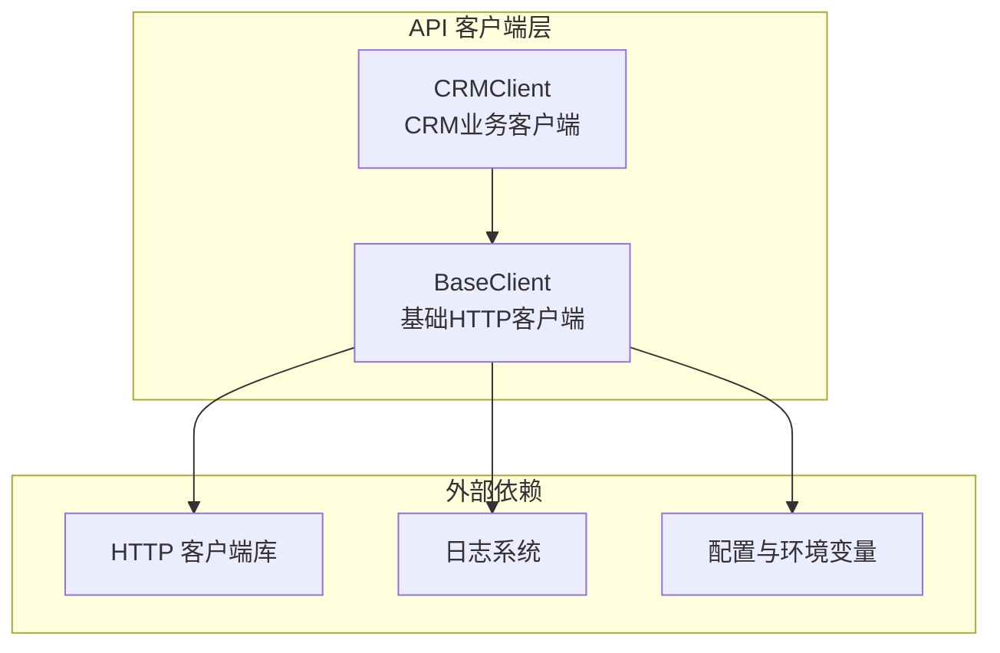
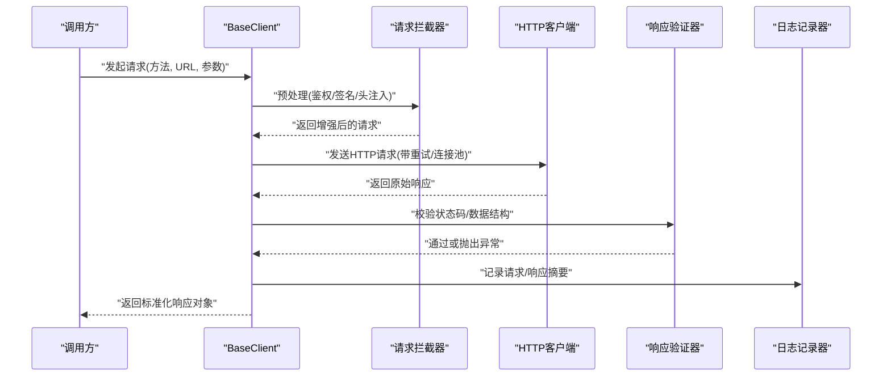
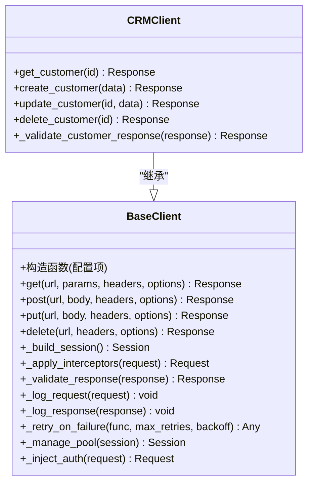
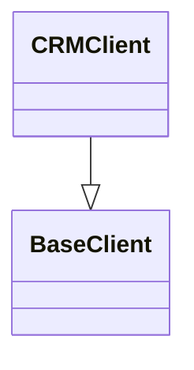
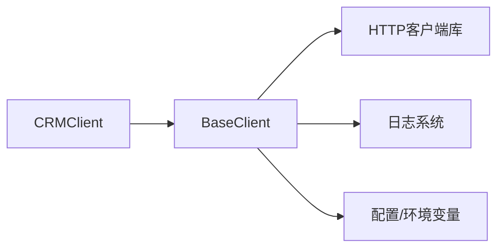

# BaseClient基础客户端

<cite>
**本文引用的文件**   
- [tests/api/clients/base_client.py](file://tests/api/clients/base_client.py)
- [tests/api/clients/crm_client.py](file://tests/api/clients/crm_client.py)
</cite>

## 目录
1. [简介](#简介)
2. [项目结构](#项目结构)
3. [核心组件](#核心组件)
4. [架构总览](#架构总览)
5. [详细组件分析](#详细组件分析)
6. [依赖关系分析](#依赖关系分析)
7. [性能考虑](#性能考虑)
8. [故障排查指南](#故障排查指南)
9. [结论](#结论)
10. [附录](#附录)

## 简介
本技术文档围绕 AutoTest Hub 中的 BaseClient 基础客户端进行系统化说明，重点覆盖以下方面：
- 设计模式与职责边界
- HTTP 请求封装、响应处理、错误重试机制与连接池管理
- 认证令牌管理、请求拦截器、响应验证器与日志记录机制
- 公共方法、参数配置与返回值格式
- 如何继承 BaseClient 创建自定义客户端（超时、代理、SSL、并发优化）
- 性能调优技巧与常见问题排查

## 项目结构
BaseClient 位于 API 自动化测试的客户端层，作为所有业务客户端的基类。CRM 客户端示例展示了如何继承并扩展其能力。

图示来源
- [tests/api/clients/base_client.py](file://tests/api/clients/base_client.py)
- [tests/api/clients/crm_client.py](file://tests/api/clients/crm_client.py)

章节来源
- [tests/api/clients/base_client.py](file://tests/api/clients/base_client.py)
- [tests/api/clients/crm_client.py](file://tests/api/clients/crm_client.py)

## 核心组件
- BaseClient：提供统一的 HTTP 请求封装、通用响应处理、重试策略、连接池与上下文管理、认证令牌注入、请求拦截器与响应验证器钩子、结构化日志等能力。
- CRMClient：基于 BaseClient 的业务客户端示例，演示如何复用通用能力并实现领域特定的接口方法与数据校验。

章节来源
- [tests/api/clients/base_client.py](file://tests/api/clients/base_client.py)
- [tests/api/clients/crm_client.py](file://tests/api/clients/crm_client.py)

## 架构总览
下图展示 BaseClient 在请求生命周期中的关键阶段与扩展点。

图示来源
- [tests/api/clients/base_client.py](file://tests/api/clients/base_client.py)

## 详细组件分析

### BaseClient 类设计与职责
- 职责边界
  - 统一封装底层 HTTP 客户端，屏蔽差异
  - 提供可插拔的请求拦截器与响应验证器
  - 集中管理认证令牌、超时、代理、SSL、重试与连接池
  - 输出结构化日志与标准化响应对象
- 设计模式
  - 模板方法：定义请求主流程，将“拦截”“验证”“日志”等步骤抽象为可重写钩子
  - 策略模式：重试策略、验证策略、认证策略可通过配置或子类替换
  - 工厂/构建器：通过构造参数或配置对象初始化连接池、超时、代理、SSL 等
  - 观察者/钩子：拦截器与验证器以回调形式接入生命周期

章节来源
- [tests/api/clients/base_client.py](file://tests/api/clients/base_client.py)

#### 类图（代码级）

图示来源
- [tests/api/clients/base_client.py](file://tests/api/clients/base_client.py)
- [tests/api/clients/crm_client.py](file://tests/api/clients/crm_client.py)

### 认证令牌管理
- 令牌来源
  - 优先从会话/上下文获取已缓存令牌
  - 若缺失则触发登录流程获取新令牌并缓存
- 注入位置
  - 在请求拦截器中统一注入到头部或查询参数
- 刷新策略
  - 支持过期前主动刷新或失败后被动刷新
- 安全建议
  - 避免在日志中输出敏感字段
  - 使用内存或加密存储，限制作用域

章节来源
- [tests/api/clients/base_client.py](file://tests/api/clients/base_client.py)

### 请求拦截器
- 功能范围
  - 自动添加鉴权头、追踪ID、时间戳、签名
  - 动态拼接基础路径、版本控制
  - 请求体序列化/反序列化处理
- 扩展方式
  - 通过重写拦截钩子或注册多个拦截器链
  - 支持条件拦截（按域名、路径、方法过滤）

章节来源
- [tests/api/clients/base_client.py](file://tests/api/clients/base_client.py)

### 响应验证器
- 校验维度
  - HTTP 状态码区间
  - 业务状态码与消息
  - JSON Schema 或关键字段存在性
- 行为
  - 通过时返回标准化响应对象
  - 失败时抛出包含上下文的异常，便于断言与定位

章节来源
- [tests/api/clients/base_client.py](file://tests/api/clients/base_client.py)

### 日志记录机制
- 记录内容
  - 请求：方法、URL、关键头、去敏后的请求体
  - 响应：状态码、耗时、去敏后的响应体摘要
- 级别与采样
  - 默认 INFO，调试时可开启 DEBUG
  - 大响应体采样记录，避免日志膨胀
- 关联追踪
  - 注入 TraceId，贯穿拦截器、网络层与日志

章节来源
- [tests/api/clients/base_client.py](file://tests/api/clients/base_client.py)

### HTTP 请求封装与响应处理
- 统一入口
  - get/post/put/delete 等方法对外暴露
- 标准化响应
  - 返回包含状态码、数据、元信息（耗时、TraceId）的对象
- 错误映射
  - 将网络异常、超时、服务端错误映射为统一异常类型

章节来源
- [tests/api/clients/base_client.py](file://tests/api/clients/base_client.py)

### 错误重试机制
- 适用场景
  - 瞬时网络抖动、限流、幂等读操作
- 策略
  - 最大重试次数、退避算法（指数退避）、重试判定条件（仅特定状态码/异常）
- 幂等性
  - 对非幂等操作需显式关闭重试或谨慎配置

章节来源
- [tests/api/clients/base_client.py](file://tests/api/clients/base_client.py)

### 连接池管理
- 目标
  - 复用 TCP 连接，降低握手开销，提升吞吐
- 关键参数
  - 最大连接数、每主机最大连接数、连接空闲回收、Keep-Alive 时长
- 生命周期
  - 随客户端实例创建/销毁，支持按需重建

章节来源
- [tests/api/clients/base_client.py](file://tests/api/clients/base_client.py)

### 公共方法与配置（概览）
- 公共方法
  - get/post/put/delete：统一 HTTP 方法封装
  - _build_session/_manage_pool：会话与连接池管理
  - _apply_interceptors/_validate_response：拦截与验证钩子
  - _retry_on_failure：重试执行器
  - _inject_auth：认证注入
  - _log_request/_log_response：日志记录
- 典型配置项
  - base_url、timeout、max_retries、backoff_factor、pool_maxsize、proxy、ssl_verify、headers、interceptors、validators
- 返回值格式
  - 标准化响应对象，包含状态码、数据、元信息；异常时抛出统一异常

章节来源
- [tests/api/clients/base_client.py](file://tests/api/clients/base_client.py)

### 继承与扩展：CRMClient 示例
- 继承方式
  - 直接继承 BaseClient，复用通用能力
- 领域方法
  - 提供 get_customer/create_customer/update_customer/delete_customer 等业务方法
- 定制验证
  - 重写响应验证钩子，针对 CRM 数据结构进行校验
- 使用建议
  - 保持 BaseClient 的通用逻辑不变，仅在 CRMClient 中补充业务细节

章节来源
- [tests/api/clients/crm_client.py](file://tests/api/clients/crm_client.py)

#### 继承关系图

图示来源
- [tests/api/clients/base_client.py](file://tests/api/clients/base_client.py)
- [tests/api/clients/crm_client.py](file://tests/api/clients/crm_client.py)

## 依赖关系分析
- 内部依赖
  - CRMClient 依赖 BaseClient 提供的通用能力
- 外部依赖
  - HTTP 客户端库（用于实际网络请求）
  - 日志系统（结构化输出）
  - 配置与环境变量（运行时参数）

图示来源
- [tests/api/clients/base_client.py](file://tests/api/clients/base_client.py)
- [tests/api/clients/crm_client.py](file://tests/api/clients/crm_client.py)

章节来源
- [tests/api/clients/base_client.py](file://tests/api/clients/base_client.py)
- [tests/api/clients/crm_client.py](file://tests/api/clients/crm_client.py)

## 性能考虑
- 连接池
  - 根据并发规模调整最大连接数与每主机连接数
  - 合理设置 Keep-Alive 与空闲回收时间
- 超时
  - 区分连接超时与读取超时，避免长尾阻塞
- 重试
  - 仅对幂等读操作启用重试，结合指数退避与抖动
- 序列化
  - 避免重复序列化，复用请求头与公共参数
- 日志
  - 生产环境降低日志级别，采样大响应体
- 并发
  - 使用线程/协程并发时共享同一 BaseClient 实例以复用连接池

[本节为通用指导，不直接分析具体文件]

## 故障排查指南
- 常见现象
  - 连接超时/拒绝：检查代理、DNS、防火墙、连接池上限
  - 认证失败：确认令牌是否过期、注入位置是否正确、签名是否一致
  - 响应校验失败：核对业务状态码与字段结构
  - 重试风暴：确认是否误对非幂等操作启用重试
- 定位手段
  - 开启 DEBUG 日志，关注 TraceId 与耗时
  - 打印去敏后的请求/响应摘要
  - 隔离网络问题（直连 vs 代理）
- 修复建议
  - 调整超时与重试参数
  - 修正拦截器顺序与条件
  - 完善响应验证规则

章节来源
- [tests/api/clients/base_client.py](file://tests/api/clients/base_client.py)

## 结论
BaseClient 通过模板方法与策略模式，将 HTTP 请求的生命周期标准化，并提供可插拔的拦截器与验证器，使业务客户端能够专注于领域逻辑。配合合理的连接池、重试与日志策略，可在保证稳定性的同时获得良好性能。CRMClient 示例展示了如何在 BaseClient 之上快速构建领域客户端的最佳实践。

[本节为总结性内容，不直接分析具体文件]

## 附录
- 最佳实践清单
  - 始终使用 BaseClient 的公共方法发起请求
  - 在拦截器中集中处理鉴权与追踪
  - 在验证器中严格校验响应结构
  - 生产环境关闭冗余日志，保留关键指标
  - 对非幂等操作禁用重试或谨慎评估风险
- 参考路径
  - BaseClient 实现：[tests/api/clients/base_client.py](file://tests/api/clients/base_client.py)
  - CRMClient 示例：[tests/api/clients/crm_client.py](file://tests/api/clients/crm_client.py)