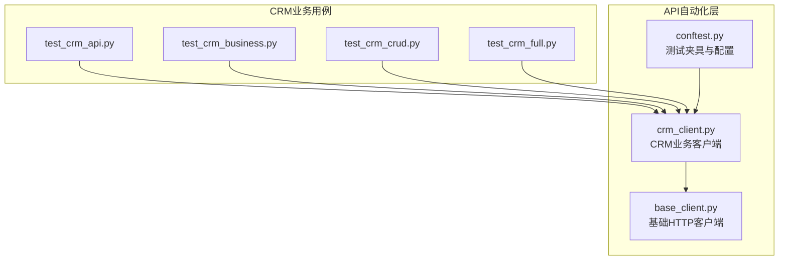
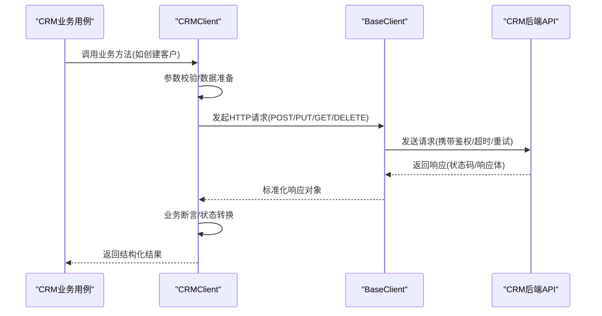
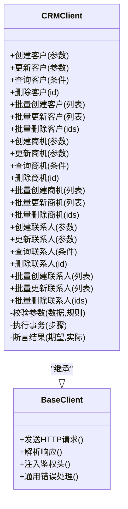
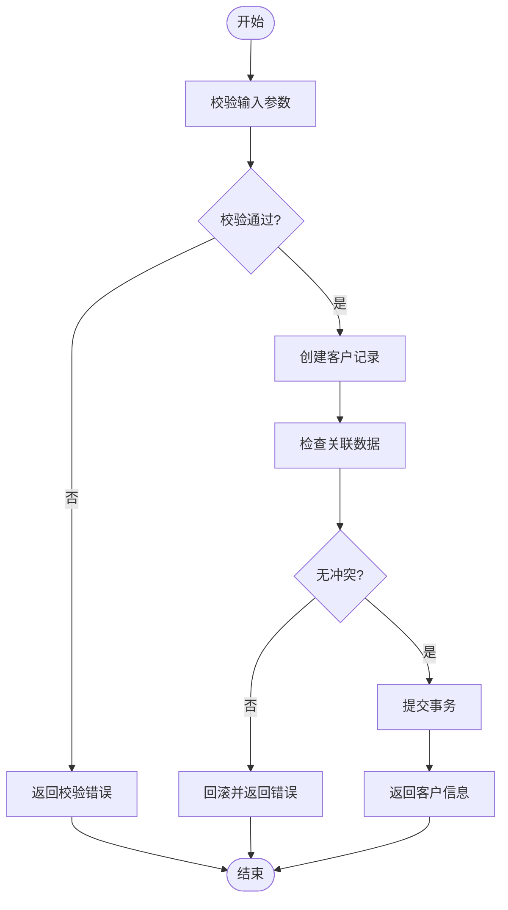
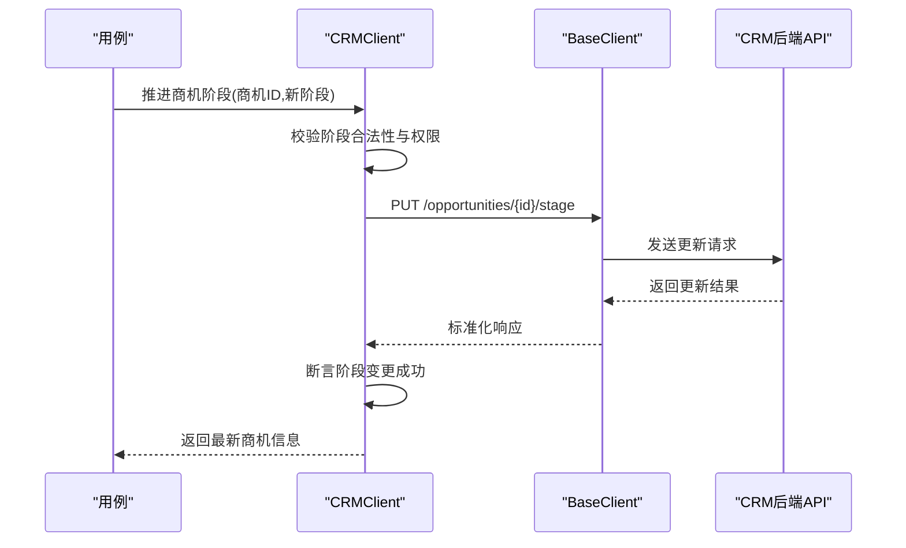
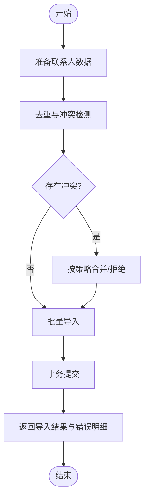
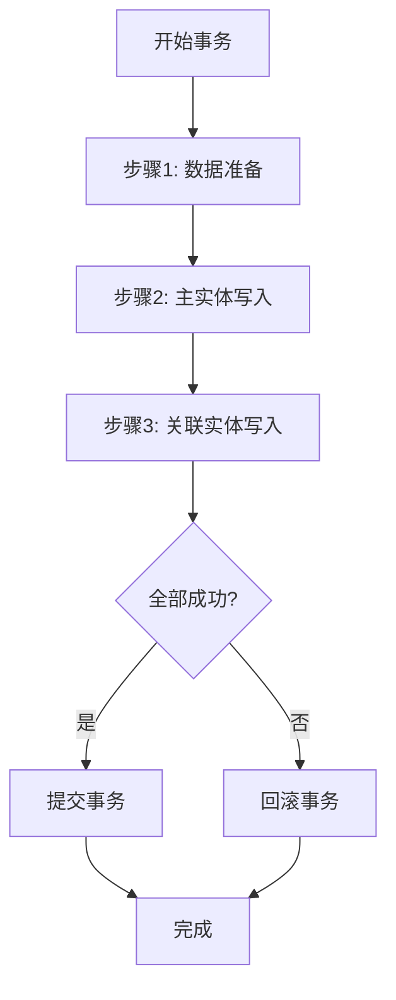
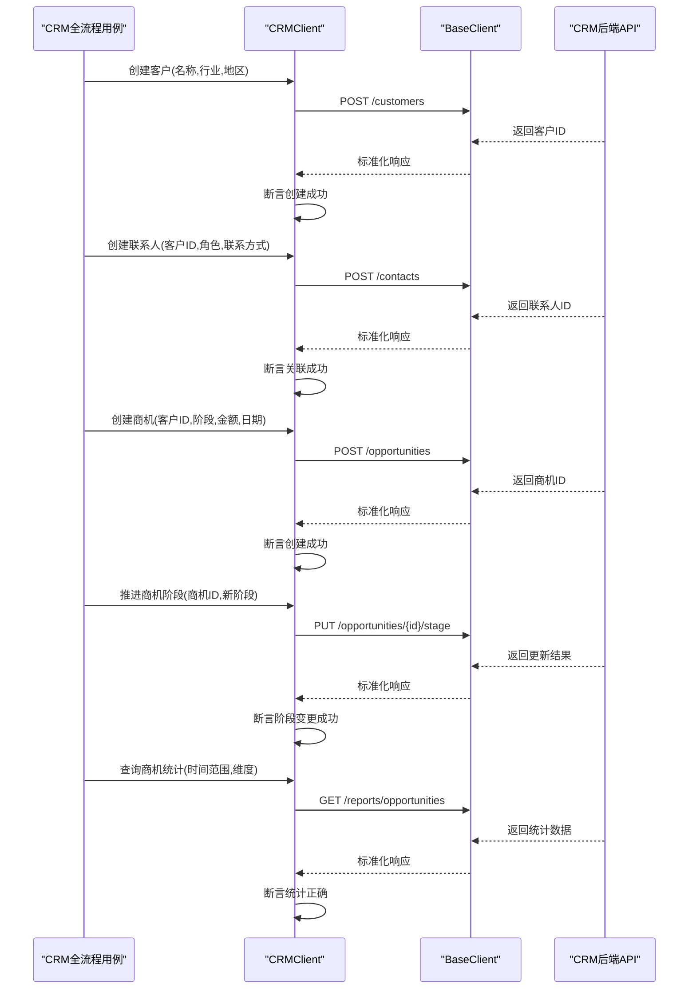
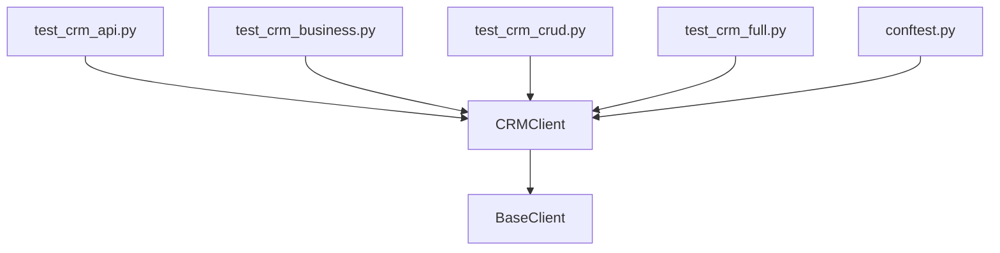

# CRMClient业务客户端

<cite>
**本文引用的文件**   
- [base_client.py](file://tests/api/clients/base_client.py)
- [crm_client.py](file://tests/api/clients/crm_client.py)
- [test_crm_api.py](file://tests/api/testsuites/crm/test_crm_api.py)
- [test_crm_business.py](file://tests/api/testsuites/crm/test_crm_business.py)
- [test_crm_crud.py](file://tests/api/testsuites/crm/test_crm_crud.py)
- [test_crm_full.py](file://tests/api/testsuites/crm/test_crm_full.py)
- [conftest.py](file://tests/api/conftest.py)
</cite>

## 目录
1. [简介](#简介)
2. [项目结构](#项目结构)
3. [核心组件](#核心组件)
4. [架构总览](#架构总览)
5. [详细组件分析](#详细组件分析)
6. [依赖关系分析](#依赖关系分析)
7. [性能考虑](#性能考虑)
8. [故障排查指南](#故障排查指南)
9. [结论](#结论)
10. [附录](#附录)

## 简介
本技术文档面向AutoTest Hub中的CRMClient业务客户端，系统性阐述其如何继承BaseClient并封装CRM系统的业务接口，覆盖客户管理、商机跟踪、联系人管理等核心业务操作。文档重点说明：
- CRUD操作的实现模式与批量处理方法
- 事务管理机制（测试场景下的数据一致性保障）
- 业务数据验证规则
- 所有业务方法的调用方式、参数规范与返回数据结构
- 复杂业务流程的测试示例（数据准备、状态转换、结果验证）
- 业务异常处理策略与性能优化建议

## 项目结构
CRM相关的客户端与用例位于API自动化测试目录下，关键路径如下：
- 客户端实现：tests/api/clients/base_client.py、tests/api/clients/crm_client.py
- CRM业务用例：tests/api/testsuites/crm/test_crm_*.py
- 公共夹具与配置：tests/api/conftest.py

图表来源
- [base_client.py](file://tests/api/clients/base_client.py)
- [crm_client.py](file://tests/api/clients/crm_client.py)
- [conftest.py](file://tests/api/conftest.py)
- [test_crm_api.py](file://tests/api/testsuites/crm/test_crm_api.py)
- [test_crm_business.py](file://tests/api/testsuites/crm/test_crm_business.py)
- [test_crm_crud.py](file://tests/api/testsuites/crm/test_crm_crud.py)
- [test_crm_full.py](file://tests/api/testsuites/crm/test_crm_full.py)

章节来源
- [base_client.py](file://tests/api/clients/base_client.py)
- [crm_client.py](file://tests/api/clients/crm_client.py)
- [conftest.py](file://tests/api/conftest.py)
- [test_crm_api.py](file://tests/api/testsuites/crm/test_crm_api.py)
- [test_crm_business.py](file://tests/api/testsuites/crm/test_crm_business.py)
- [test_crm_crud.py](file://tests/api/testsuites/crm/test_crm_crud.py)
- [test_crm_full.py](file://tests/api/testsuites/crm/test_crm_full.py)

## 核心组件
- BaseClient：提供统一的HTTP请求能力、鉴权信息注入、响应解析与通用错误处理等基础设施。
- CRMClient：在BaseClient之上封装CRM领域方法，包括客户、商机、联系人等实体的CRUD与批量操作，以及业务校验与事务性编排。

职责划分
- BaseClient关注“如何访问系统”（网络、鉴权、序列化、重试、超时等）。
- CRMClient关注“访问什么业务”（实体模型、字段校验、流程编排、断言辅助）。

章节来源
- [base_client.py](file://tests/api/clients/base_client.py)
- [crm_client.py](file://tests/api/clients/crm_client.py)

## 架构总览
CRMClient通过继承BaseClient获得HTTP能力，并在CRM业务用例中被直接调用，形成“用例→CRMClient→BaseClient→被测系统”的调用链。

图表来源
- [crm_client.py](file://tests/api/clients/crm_client.py)
- [base_client.py](file://tests/api/clients/base_client.py)
- [test_crm_business.py](file://tests/api/testsuites/crm/test_crm_business.py)

## 详细组件分析

### CRMClient类设计
CRMClient基于BaseClient扩展出CRM领域的业务能力，典型职责包括：
- 实体CRUD：客户、商机、联系人等实体的增删改查
- 批量处理：批量创建、更新、删除与导入导出
- 事务编排：在测试场景下保证数据一致性与回滚清理
- 业务校验：字段必填、枚举值、关联关系、状态机约束
- 结果封装：统一返回结构，便于用例断言

图表来源
- [crm_client.py](file://tests/api/clients/crm_client.py)
- [base_client.py](file://tests/api/clients/base_client.py)

章节来源
- [crm_client.py](file://tests/api/clients/crm_client.py)
- [base_client.py](file://tests/api/clients/base_client.py)

### 客户管理模块
- 创建客户：支持必填字段校验（名称、行业、地区等），返回客户ID与基础信息。
- 更新客户：按ID定位记录，支持部分字段更新；对关键字段变更进行审计日志标记。
- 查询客户：支持多条件过滤、分页、排序；返回结构化列表与总数。
- 删除客户：软删除或硬删除策略由配置决定；删除前检查关联数据。
- 批量操作：批量创建/更新/删除，内部采用事务包装，失败时回滚并汇总错误明细。

图表来源
- [crm_client.py](file://tests/api/clients/crm_client.py)

章节来源
- [crm_client.py](file://tests/api/clients/crm_client.py)

### 商机跟踪模块
- 创建商机：绑定客户与负责人，设置阶段、金额、预计成交日期等。
- 更新商机：支持阶段推进、金额调整、概率更新；触发状态机校验。
- 查询商机：按客户、阶段、时间范围、负责人等多维度筛选。
- 删除商机：限制已关闭或归档商机的删除；保留历史审计。
- 批量操作：批量导入商机清单，自动匹配客户与负责人，生成差异报告。

图表来源
- [crm_client.py](file://tests/api/clients/crm_client.py)
- [base_client.py](file://tests/api/clients/base_client.py)
- [test_crm_business.py](file://tests/api/testsuites/crm/test_crm_business.py)

章节来源
- [crm_client.py](file://tests/api/clients/crm_client.py)
- [test_crm_business.py](file://tests/api/testsuites/crm/test_crm_business.py)

### 联系人管理模块
- 创建联系人：绑定客户与角色，支持多渠道联系方式。
- 更新联系人：更新联系信息与偏好；校验邮箱/手机号格式。
- 查询联系人：按客户、角色、标签等条件检索。
- 删除联系人：检查是否为主联系人或存在未结任务。
- 批量操作：批量导入联系人，去重与冲突合并策略可配置。

图表来源
- [crm_client.py](file://tests/api/clients/crm_client.py)

章节来源
- [crm_client.py](file://tests/api/clients/crm_client.py)

### 事务管理机制
- 事务边界：CRMClient在批量操作与跨实体编排中开启事务，确保原子性。
- 回滚策略：任一子步骤失败即触发回滚，并收集错误明细供用例断言。
- 清理机制：测试结束后统一清理临时数据，避免污染后续用例。

图表来源
- [crm_client.py](file://tests/api/clients/crm_client.py)

章节来源
- [crm_client.py](file://tests/api/clients/crm_client.py)

### 业务数据验证规则
- 必填字段：客户名称、商机阶段、联系人角色等为必填。
- 格式校验：邮箱、手机号、URL等遵循正则规则。
- 枚举值：行业、地区、阶段、角色等限定为预定义集合。
- 关联约束：商机必须绑定有效客户；联系人必须属于某客户。
- 状态机：商机阶段仅允许合法流转，禁止逆向跳转。

章节来源
- [crm_client.py](file://tests/api/clients/crm_client.py)

### 使用示例与复杂业务流程
以下示例展示如何在用例中使用CRMClient完成端到端业务流程，包括数据准备、状态转换与结果验证。

- 端到端客户生命周期
  - 创建客户 → 添加联系人 → 创建商机 → 推进商机阶段 → 关闭商机 → 查询统计
- 批量导入与一致性校验
  - 批量导入客户与联系人 → 校验去重与冲突合并 → 断言最终数据一致性
- 跨接口一致性
  - 在多个CRM模块间进行读写操作，验证数据在不同视图与报表中的一致性

图表来源
- [crm_client.py](file://tests/api/clients/crm_client.py)
- [base_client.py](file://tests/api/clients/base_client.py)
- [test_crm_full.py](file://tests/api/testsuites/crm/test_crm_full.py)

章节来源
- [test_crm_full.py](file://tests/api/testsuites/crm/test_crm_full.py)
- [test_crm_business.py](file://tests/api/testsuites/crm/test_crm_business.py)
- [test_crm_crud.py](file://tests/api/testsuites/crm/test_crm_crud.py)
- [test_crm_api.py](file://tests/api/testsuites/crm/test_crm_api.py)

## 依赖关系分析
CRMClient依赖BaseClient提供的HTTP能力，并被CRM业务用例直接调用。

图表来源
- [crm_client.py](file://tests/api/clients/crm_client.py)
- [base_client.py](file://tests/api/clients/base_client.py)
- [test_crm_api.py](file://tests/api/testsuites/crm/test_crm_api.py)
- [test_crm_business.py](file://tests/api/testsuites/crm/test_crm_business.py)
- [test_crm_crud.py](file://tests/api/testsuites/crm/test_crm_crud.py)
- [test_crm_full.py](file://tests/api/testsuites/crm/test_crm_full.py)
- [conftest.py](file://tests/api/conftest.py)

章节来源
- [crm_client.py](file://tests/api/clients/crm_client.py)
- [base_client.py](file://tests/api/clients/base_client.py)
- [test_crm_api.py](file://tests/api/testsuites/crm/test_crm_api.py)
- [test_crm_business.py](file://tests/api/testsuites/crm/test_crm_business.py)
- [test_crm_crud.py](file://tests/api/testsuites/crm/test_crm_crud.py)
- [test_crm_full.py](file://tests/api/testsuites/crm/test_crm_full.py)
- [conftest.py](file://tests/api/conftest.py)

## 性能考虑
- 批量操作优化：优先使用批量接口减少往返次数；内部采用事务与批处理提交。
- 连接复用：BaseClient应启用HTTP连接池与Keep-Alive，降低握手开销。
- 超时与重试：合理设置超时与重试策略，避免长尾请求阻塞。
- 分页与过滤：查询时使用分页与精确过滤，减少无效数据传输。
- 缓存与幂等：对只读查询引入缓存；对写操作保证幂等，避免重复提交。

[本节为通用性能建议，不直接分析具体文件]

## 故障排查指南
- 参数校验失败：检查必填字段、格式与枚举值；查看CRMClient的参数校验逻辑。
- 关联数据冲突：确认外键有效性；在批量操作中查看冲突合并策略与错误明细。
- 状态机非法流转：核对当前阶段与目标阶段的合法性；参考商机阶段流转规则。
- 事务回滚：定位回滚点，检查各子步骤的错误堆栈与中间状态。
- 网络与鉴权：确认BaseClient的鉴权头、超时与重试配置是否正确。

章节来源
- [crm_client.py](file://tests/api/clients/crm_client.py)
- [base_client.py](file://tests/api/clients/base_client.py)

## 结论
CRMClient在BaseClient基础上实现了CRM领域的完整业务能力，涵盖客户、商机、联系人等实体的CRUD与批量操作，并通过事务与校验保障数据一致性与正确性。配合完善的业务用例，可实现从单接口到端到端流程的全面测试。建议在大规模数据场景下进一步优化批量与查询性能，并完善错误诊断与监控能力。

[本节为总结性内容，不直接分析具体文件]

## 附录
- 术语表
  - 客户：CRM系统中的企业或个人主体
  - 商机：潜在销售机会，包含阶段、金额、日期等信息
  - 联系人：与客户关联的具体人员及其联系方式
  - 事务：一组操作的原子执行单元，失败则整体回滚
- 参考用例
  - 接口级用例：test_crm_api.py
  - 业务流用例：test_crm_business.py
  - CRUD用例：test_crm_crud.py
  - 全流程用例：test_crm_full.py

章节来源
- [test_crm_api.py](file://tests/api/testsuites/crm/test_crm_api.py)
- [test_crm_business.py](file://tests/api/testsuites/crm/test_crm_business.py)
- [test_crm_crud.py](file://tests/api/testsuites/crm/test_crm_crud.py)
- [test_crm_full.py](file://tests/api/testsuites/crm/test_crm_full.py)