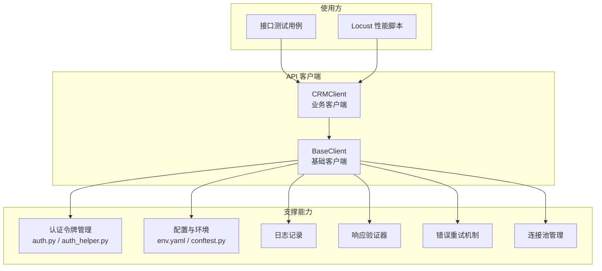
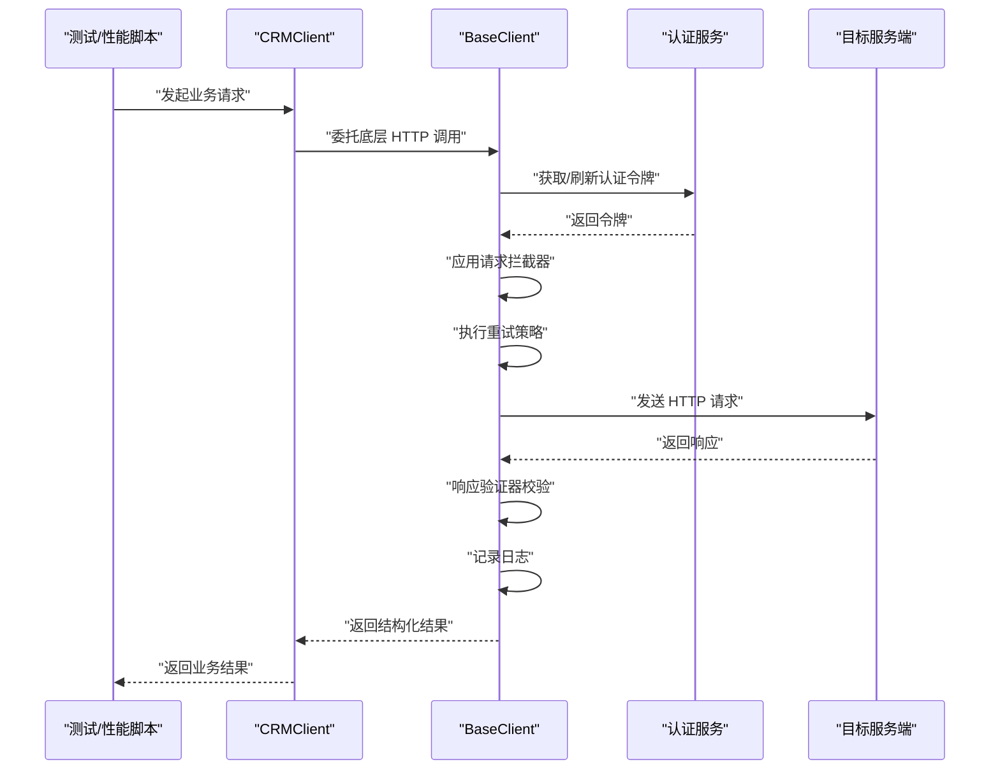
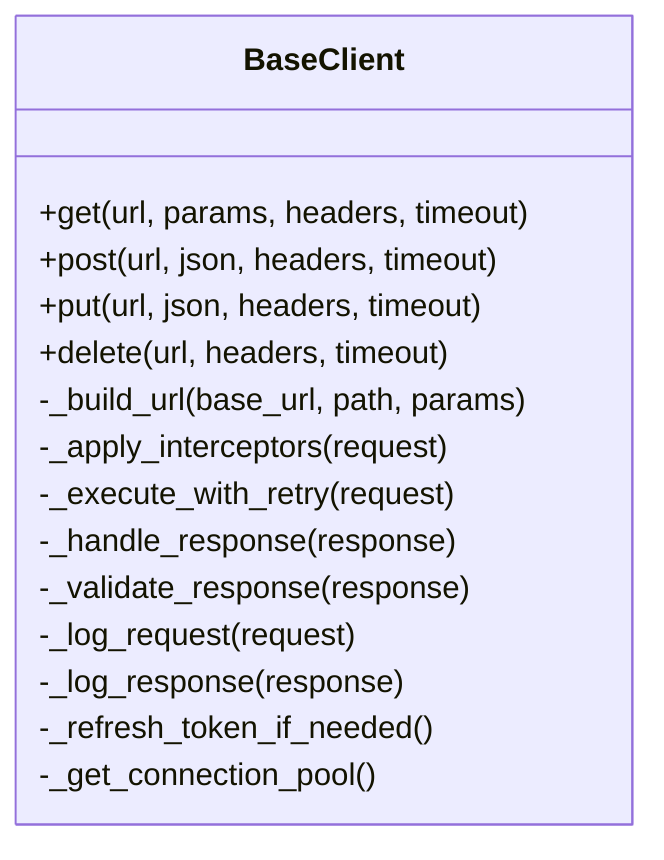
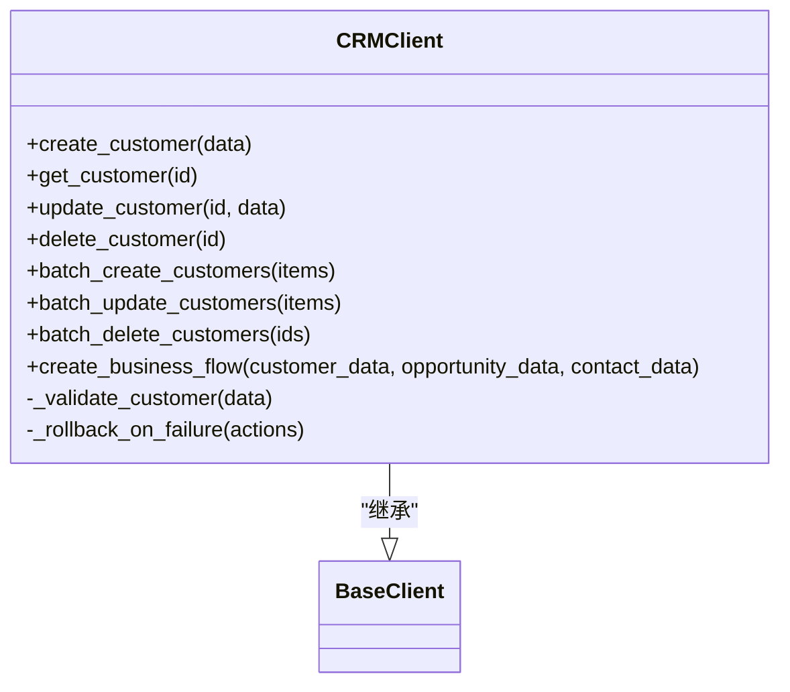
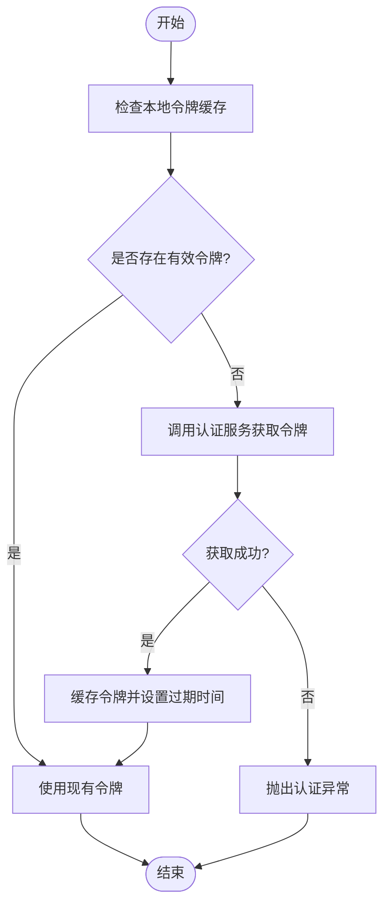
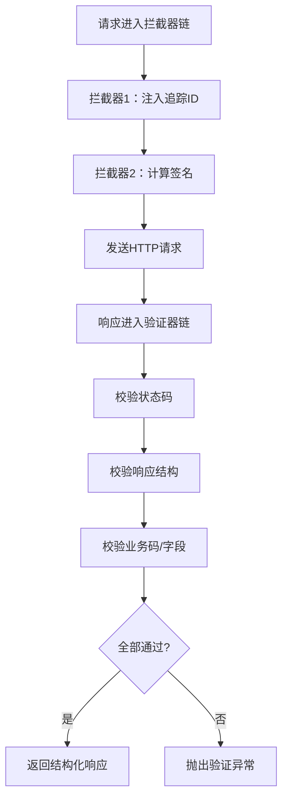
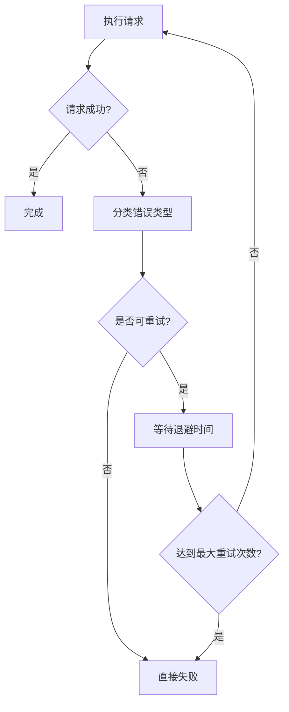
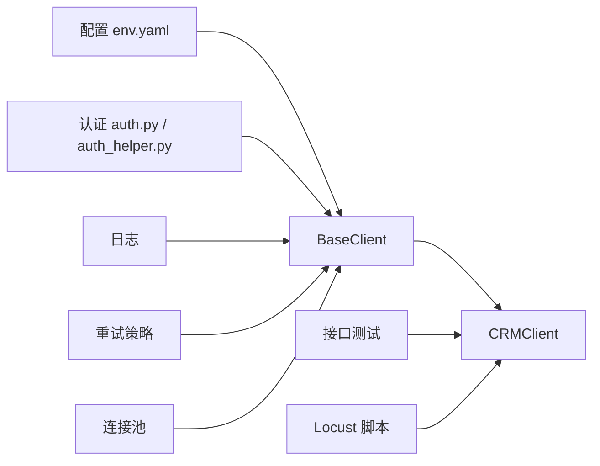

# HTTP客户端架构

<cite>
**本文引用的文件**   
- [tests/api/clients/base_client.py](file://tests/api/clients/base_client.py)
- [tests/api/clients/crm_client.py](file://tests/api/clients/crm_client.py)
- [tests/api/conftest.py](file://tests/api/conftest.py)
- [tests/config/env.yaml](file://tests/config/env.yaml)
- [tests/utils/auth.py](file://tests/utils/auth.py)
- [tests/performance/locust/utils/auth_helper.py](file://tests/performance/locust/utils/auth_helper.py)
- [tests/performance/locust/api/locustfile_crm_api.py](file://tests/performance/locust/api/locustfile_crm_api.py)
</cite>

## 目录
1. [简介](#简介)
2. [项目结构](#项目结构)
3. [核心组件](#核心组件)
4. [架构总览](#架构总览)
5. [详细组件分析](#详细组件分析)
6. [依赖关系分析](#依赖关系分析)
7. [性能考虑](#性能考虑)
8. [故障排查指南](#故障排查指南)
9. [结论](#结论)
10. [附录](#附录)

## 简介
本技术文档聚焦于 AutoTest Hub 的 HTTP 客户端架构，围绕基础客户端 BaseClient 与业务客户端 CRMClient 的设计模式、实现细节与扩展方式展开。文档涵盖以下主题：
- BaseClient 的 HTTP 请求封装、响应处理、错误重试机制与连接池管理
- CRMClient 的继承关系与业务方法封装（CRUD、批量处理、事务管理）
- 认证令牌管理、请求拦截器、响应验证器与日志记录机制
- 如何扩展新的业务客户端与自定义 HTTP 行为
- 性能优化技巧与故障排查指南

## 项目结构
HTTP 客户端相关代码主要位于 tests/api/clients 目录，配合测试配置与环境变量、认证工具以及性能测试中的辅助模块共同构成完整的 HTTP 调用体系。

图表来源
- [tests/api/clients/base_client.py](file://tests/api/clients/base_client.py)
- [tests/api/clients/crm_client.py](file://tests/api/clients/crm_client.py)
- [tests/utils/auth.py](file://tests/utils/auth.py)
- [tests/performance/locust/utils/auth_helper.py](file://tests/performance/locust/utils/auth_helper.py)
- [tests/config/env.yaml](file://tests/config/env.yaml)
- [tests/api/conftest.py](file://tests/api/conftest.py)

章节来源
- [tests/api/clients/base_client.py](file://tests/api/clients/base_client.py)
- [tests/api/clients/crm_client.py](file://tests/api/clients/crm_client.py)
- [tests/api/conftest.py](file://tests/api/conftest.py)
- [tests/config/env.yaml](file://tests/config/env.yaml)
- [tests/utils/auth.py](file://tests/utils/auth.py)
- [tests/performance/locust/utils/auth_helper.py](file://tests/performance/locust/utils/auth_helper.py)

## 核心组件
- BaseClient：提供统一的 HTTP 请求封装、通用响应处理、错误重试、连接池管理与可插拔的拦截器/验证器/日志等横切能力。
- CRMClient：基于 BaseClient 的业务客户端，封装 CRM 领域相关的 CRUD、批量操作与事务性流程。

章节来源
- [tests/api/clients/base_client.py](file://tests/api/clients/base_client.py)
- [tests/api/clients/crm_client.py](file://tests/api/clients/crm_client.py)

## 架构总览
下图展示了从测试或性能脚本到 BaseClient 与 CRMClient 的调用路径，以及认证、配置、重试、验证、日志与连接池等横切能力的协作关系。

图表来源
- [tests/api/clients/base_client.py](file://tests/api/clients/base_client.py)
- [tests/api/clients/crm_client.py](file://tests/api/clients/crm_client.py)
- [tests/utils/auth.py](file://tests/utils/auth.py)
- [tests/performance/locust/utils/auth_helper.py](file://tests/performance/locust/utils/auth_helper.py)

## 详细组件分析

### BaseClient 基础客户端
职责与特性
- HTTP 请求封装：统一构建 URL、Headers、Body、超时、重试参数等；支持 GET/POST/PUT/DELETE 等方法。
- 响应处理：标准化解析 JSON/文本响应，提取状态码、消息体、头部信息，并转换为内部数据结构。
- 错误重试机制：对网络抖动、限流、临时失败进行指数退避或固定间隔重试，支持最大次数与退避策略配置。
- 连接池管理：复用底层 HTTP 会话/连接，减少握手开销，提升吞吐；支持并发安全与资源释放。
- 横切能力：
  - 认证令牌管理：在请求前注入令牌，必要时自动刷新。
  - 请求拦截器：在发送前修改请求（如添加追踪 ID、签名）。
  - 响应验证器：校验状态码、字段存在性与类型、业务码等。
  - 日志记录：记录请求/响应摘要、耗时、错误堆栈，便于定位问题。

关键设计点
- 可插拔拦截器与验证器：通过注册/钩子机制扩展，避免侵入业务逻辑。
- 重试策略可配置：支持按错误类型区分是否重试、退避算法、最大重试次数。
- 连接池参数可调：最大连接数、空闲超时、连接复用策略等。
- 上下文传递：将租户、环境、追踪信息等贯穿请求生命周期。

图表来源
- [tests/api/clients/base_client.py](file://tests/api/clients/base_client.py)

章节来源
- [tests/api/clients/base_client.py](file://tests/api/clients/base_client.py)

### CRMClient 业务客户端
职责与特性
- 继承自 BaseClient，复用所有通用 HTTP 能力。
- 封装 CRM 领域 API：客户、商机、联系人、产品、报价等实体的 CRUD 操作。
- 批量处理：提供批量创建/更新/删除接口，内部聚合多次调用并汇总结果。
- 事务管理：在需要强一致性的场景下，组合多个步骤为“伪事务”，包含回滚补偿逻辑。
- 业务校验：在调用前进行参数校验，调用后对响应进行业务语义校验。

典型方法
- 创建/查询/更新/删除实体
- 批量导入/导出
- 复合业务流程编排（例如：先创建客户，再创建商机，最后绑定联系人）

图表来源
- [tests/api/clients/crm_client.py](file://tests/api/clients/crm_client.py)
- [tests/api/clients/base_client.py](file://tests/api/clients/base_client.py)

章节来源
- [tests/api/clients/crm_client.py](file://tests/api/clients/crm_client.py)

### 认证令牌管理
- 集中式令牌获取与缓存：在 BaseClient 中统一处理令牌获取、过期检测与刷新。
- 多环境适配：根据配置选择不同认证端点与策略。
- 性能测试专用辅助：Locust 场景中使用独立辅助模块简化登录与令牌复用。

图表来源
- [tests/utils/auth.py](file://tests/utils/auth.py)
- [tests/performance/locust/utils/auth_helper.py](file://tests/performance/locust/utils/auth_helper.py)
- [tests/api/clients/base_client.py](file://tests/api/clients/base_client.py)

章节来源
- [tests/utils/auth.py](file://tests/utils/auth.py)
- [tests/performance/locust/utils/auth_helper.py](file://tests/performance/locust/utils/auth_helper.py)
- [tests/api/clients/base_client.py](file://tests/api/clients/base_client.py)

### 请求拦截器与响应验证器
- 请求拦截器：在发送前注入公共头（如追踪 ID、租户标识）、签名、鉴权信息等。
- 响应验证器：校验 HTTP 状态码、JSON 结构、业务码、关键字段非空等，失败时快速失败并记录诊断信息。
- 可扩展性：以插件形式注册，支持按域名/路径/方法维度启用不同拦截器与验证规则。

图表来源
- [tests/api/clients/base_client.py](file://tests/api/clients/base_client.py)
- [tests/api/clients/crm_client.py](file://tests/api/clients/crm_client.py)

章节来源
- [tests/api/clients/base_client.py](file://tests/api/clients/base_client.py)
- [tests/api/clients/crm_client.py](file://tests/api/clients/crm_client.py)

### 日志记录机制
- 记录内容：请求 URL、方法、头部（脱敏）、Body（脱敏）、响应状态码、耗时、错误堆栈。
- 分级输出：DEBUG/INFO/WARN/ERROR 级别控制，便于生产与调试环境切换。
- 关联追踪：通过追踪 ID 串联一次完整请求链路，便于跨服务定位问题。

章节来源
- [tests/api/clients/base_client.py](file://tests/api/clients/base_client.py)

### 错误重试机制
- 触发条件：网络异常、超时、限流、特定 HTTP 状态码（如 429、5xx）。
- 策略：固定间隔、指数退避、抖动随机化，支持最大重试次数与退避上限。
- 幂等性：仅对幂等请求（GET/HEAD/PUT/DELETE）自动重试，写操作需显式声明。

图表来源
- [tests/api/clients/base_client.py](file://tests/api/clients/base_client.py)

章节来源
- [tests/api/clients/base_client.py](file://tests/api/clients/base_client.py)

### 连接池管理
- 复用底层 HTTP 会话/连接，减少 TCP/TLS 握手成本。
- 参数可调：最大连接数、空闲超时、连接复用策略、并发限制。
- 资源释放：在测试套件结束时统一关闭连接池，避免资源泄漏。

章节来源
- [tests/api/clients/base_client.py](file://tests/api/clients/base_client.py)

### 配置与环境
- 环境变量与配置文件：BaseURL、认证端点、重试策略、连接池参数、日志级别等。
- 测试夹具：conftest.py 中提供全局初始化与共享对象（如 BaseClient 实例）。

章节来源
- [tests/config/env.yaml](file://tests/config/env.yaml)
- [tests/api/conftest.py](file://tests/api/conftest.py)

## 依赖关系分析
- CRMClient 依赖 BaseClient 提供的通用 HTTP 能力。
- BaseClient 依赖认证模块、配置模块、日志模块、重试策略与连接池。
- 性能测试脚本通过 Locust 用户类调用 CRMClient，复用认证与客户端实例。

图表来源
- [tests/api/clients/base_client.py](file://tests/api/clients/base_client.py)
- [tests/api/clients/crm_client.py](file://tests/api/clients/crm_client.py)
- [tests/config/env.yaml](file://tests/config/env.yaml)
- [tests/utils/auth.py](file://tests/utils/auth.py)
- [tests/performance/locust/utils/auth_helper.py](file://tests/performance/locust/utils/auth_helper.py)
- [tests/performance/locust/api/locustfile_crm_api.py](file://tests/performance/locust/api/locustfile_crm_api.py)

章节来源
- [tests/api/clients/base_client.py](file://tests/api/clients/base_client.py)
- [tests/api/clients/crm_client.py](file://tests/api/clients/crm_client.py)
- [tests/config/env.yaml](file://tests/config/env.yaml)
- [tests/utils/auth.py](file://tests/utils/auth.py)
- [tests/performance/locust/utils/auth_helper.py](file://tests/performance/locust/utils/auth_helper.py)
- [tests/performance/locust/api/locustfile_crm_api.py](file://tests/performance/locust/api/locustfile_crm_api.py)

## 性能考虑
- 连接池调优：根据并发量调整最大连接数与空闲超时，避免过多连接导致资源耗尽。
- 重试策略：合理设置最大重试次数与退避上限，防止雪崩效应；对非幂等操作谨慎开启重试。
- 超时配置：为不同接口设置合理的超时阈值，避免长尾请求拖慢整体吞吐。
- 批量接口：优先使用批量 API 减少往返次数，降低网络开销。
- 令牌缓存：避免频繁刷新令牌，采用本地缓存与过期检测。
- 日志级别：在生产环境降低日志级别，减少 I/O 开销。

[本节为通用指导，不直接分析具体文件]

## 故障排查指南
常见问题与定位要点
- 认证失败：检查认证端点可达性、凭据正确性、令牌缓存与刷新逻辑。
- 超时/限流：查看重试策略与退避配置，确认服务端限流策略与配额。
- 响应校验失败：核对响应结构与业务码定义，检查验证器规则。
- 连接池耗尽：监控连接池指标，调整最大连接数与空闲超时。
- 日志缺失：确认日志级别与输出目标，检查追踪 ID 是否正确注入。

建议的诊断步骤
- 开启 DEBUG 日志，收集请求/响应摘要与耗时。
- 使用追踪 ID 串联一次完整请求链路，定位瓶颈与异常点。
- 针对特定接口单独压测，观察重试与连接池行为。
- 对比不同环境的配置差异，排除配置漂移导致的异常。

章节来源
- [tests/api/clients/base_client.py](file://tests/api/clients/base_client.py)
- [tests/utils/auth.py](file://tests/utils/auth.py)
- [tests/performance/locust/utils/auth_helper.py](file://tests/performance/locust/utils/auth_helper.py)

## 结论
BaseClient 提供了稳定、可扩展的 HTTP 基础设施，CRMClient 在其之上实现了 CRM 领域的业务能力。通过认证令牌管理、请求拦截器、响应验证器、重试机制与连接池管理等横切能力，系统具备良好的可维护性与性能表现。遵循本文档的扩展与优化建议，可以快速新增业务客户端并定制 HTTP 行为，同时保障稳定性与可观测性。

[本节为总结性内容，不直接分析具体文件]

## 附录

### 扩展新业务客户端的步骤
- 新建业务客户端类，继承 BaseClient。
- 在构造函数中注入必要的配置与依赖（如认证、日志、重试策略）。
- 封装领域方法：参数校验、调用 BaseClient、业务语义校验、异常转换。
- 如需批量或事务性流程，组合多个原子操作并实现回滚补偿。
- 编写单元测试与集成测试，覆盖正常路径与异常路径。

章节来源
- [tests/api/clients/crm_client.py](file://tests/api/clients/crm_client.py)
- [tests/api/clients/base_client.py](file://tests/api/clients/base_client.py)

### 自定义 HTTP 行为的示例思路
- 新增请求拦截器：在 BaseClient 的拦截器链中注册自定义逻辑（如签名、租户注入）。
- 新增响应验证器：在验证器链中增加业务规则校验。
- 自定义重试策略：针对不同错误类型配置不同的退避与最大重试次数。
- 调整连接池参数：根据实际负载与服务器能力优化连接复用与并发度。

章节来源
- [tests/api/clients/base_client.py](file://tests/api/clients/base_client.py)

### 性能测试中的客户端使用
- 在 Locust 用户类中复用 CRMClient 实例，避免重复初始化。
- 使用独立的认证辅助模块获取与缓存令牌，减少登录开销。
- 结合压测配置文件调整并发、持续时间与采样率。

章节来源
- [tests/performance/locust/api/locustfile_crm_api.py](file://tests/performance/locust/api/locustfile_crm_api.py)
- [tests/performance/locust/utils/auth_helper.py](file://tests/performance/locust/utils/auth_helper.py)