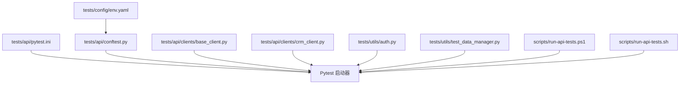
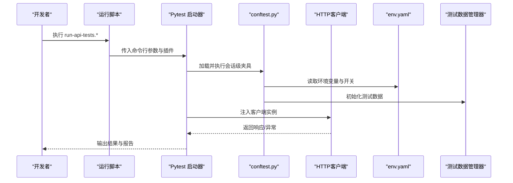
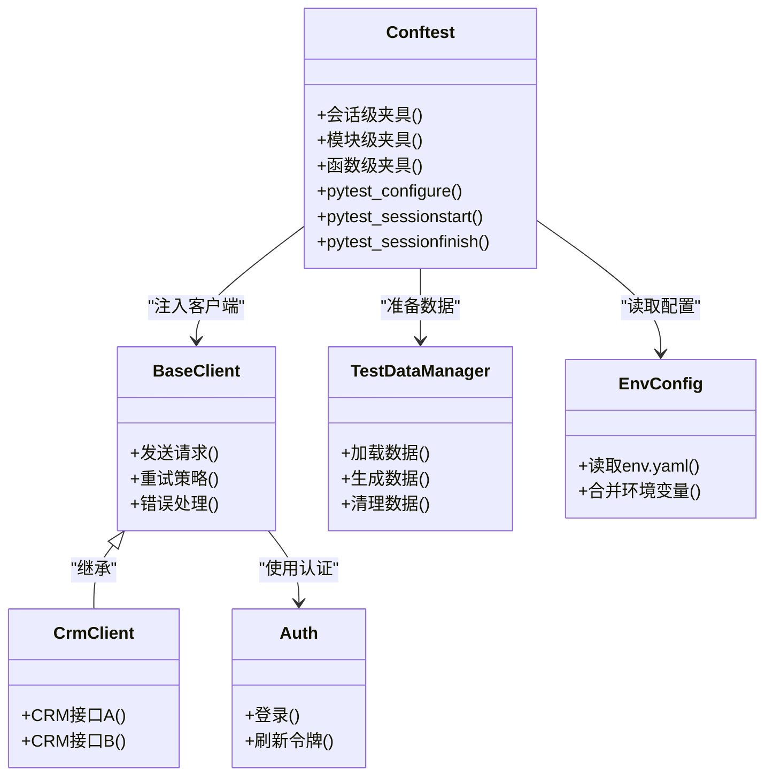

# Pytest框架配置

<cite>
**本文引用的文件**   
- [tests/api/pytest.ini](file://tests/api/pytest.ini)
- [tests/api/conftest.py](file://tests/api/conftest.py)
- [tests/config/env.yaml](file://tests/config/env.yaml)
- [tests/utils/auth.py](file://tests/utils/auth.py)
- [tests/utils/test_data_manager.py](file://tests/utils/test_data_manager.py)
- [tests/api/clients/base_client.py](file://tests/api/clients/base_client.py)
- [tests/api/clients/crm_client.py](file://tests/api/clients/crm_client.py)
- [scripts/run-api-tests.ps1](file://scripts/run-api-tests.ps1)
- [scripts/run-api-tests.sh](file://scripts/run-api-tests.sh)
</cite>

## 目录
1. [简介](#简介)
2. [项目结构](#项目结构)
3. [核心组件](#核心组件)
4. [架构总览](#架构总览)
5. [详细组件分析](#详细组件分析)
6. [依赖关系分析](#依赖关系分析)
7. [性能考虑](#性能考虑)
8. [故障排查指南](#故障排查指南)
9. [结论](#结论)
10. [附录](#附录)

## 简介
本文件面向AutoTest Hub的Pytest框架配置，聚焦以下目标：
- 解释pytest.ini中测试发现规则、插件配置、日志级别与并行执行等关键选项
- 说明conftest.py中的夹具定义与使用模式（全局、会话级、模块级）
- 文档化测试环境初始化、数据库连接管理与测试数据准备流程
- 提供优化测试执行性能与调试效率的最佳实践
- 给出错误处理策略与自定义断言方法实现建议

## 项目结构
本项目将API自动化测试集中在tests/api目录下，包含：
- pytest.ini：Pytest运行期配置
- conftest.py：测试夹具与环境初始化
- clients：HTTP客户端封装
- utils：通用工具（认证、测试数据管理）
- testsuites：按业务域组织的测试套件
- config：环境变量与外部配置

图表来源
- [tests/api/pytest.ini](file://tests/api/pytest.ini)
- [tests/api/conftest.py](file://tests/api/conftest.py)
- [tests/api/clients/base_client.py](file://tests/api/clients/base_client.py)
- [tests/api/clients/crm_client.py](file://tests/api/clients/crm_client.py)
- [tests/utils/auth.py](file://tests/utils/auth.py)
- [tests/utils/test_data_manager.py](file://tests/utils/test_data_manager.py)
- [tests/config/env.yaml](file://tests/config/env.yaml)
- [scripts/run-api-tests.ps1](file://scripts/run-api-tests.ps1)
- [scripts/run-api-tests.sh](file://scripts/run-api-tests.sh)

章节来源
- [tests/api/pytest.ini](file://tests/api/pytest.ini)
- [tests/api/conftest.py](file://tests/api/conftest.py)
- [tests/config/env.yaml](file://tests/config/env.yaml)
- [scripts/run-api-tests.ps1](file://scripts/run-api-tests.ps1)
- [scripts/run-api-tests.sh](file://scripts/run-api-tests.sh)

## 核心组件
- pytest.ini：集中管理测试发现、插件、日志、并行等运行时行为
- conftest.py：提供会话级/模块级/函数级夹具，统一环境初始化与资源清理
- clients：封装HTTP请求、鉴权、重试与错误处理
- utils.auth：统一认证流程与令牌管理
- utils.test_data_manager：测试数据加载、生成与清理
- env.yaml：外部化环境参数（如URL、凭据、开关）

章节来源
- [tests/api/pytest.ini](file://tests/api/pytest.ini)
- [tests/api/conftest.py](file://tests/api/conftest.py)
- [tests/utils/auth.py](file://tests/utils/auth.py)
- [tests/utils/test_data_manager.py](file://tests/utils/test_data_manager.py)
- [tests/config/env.yaml](file://tests/config/env.yaml)
- [tests/api/clients/base_client.py](file://tests/api/clients/base_client.py)
- [tests/api/clients/crm_client.py](file://tests/api/clients/crm_client.py)

## 架构总览
下图展示从脚本入口到Pytest运行、夹具加载、客户端调用与数据准备的端到端流程。

图表来源
- [scripts/run-api-tests.ps1](file://scripts/run-api-tests.ps1)
- [scripts/run-api-tests.sh](file://scripts/run-api-tests.sh)
- [tests/api/conftest.py](file://tests/api/conftest.py)
- [tests/config/env.yaml](file://tests/config/env.yaml)
- [tests/utils/test_data_manager.py](file://tests/utils/test_data_manager.py)
- [tests/api/clients/base_client.py](file://tests/api/clients/base_client.py)

## 详细组件分析

### pytest.ini 配置详解
pytest.ini用于控制Pytest的运行行为，常见维度包括：
- 测试发现规则
  - testpaths：指定测试根路径，避免扫描无关目录
  - python_files/python_classes/python_functions：匹配文件名、类名、函数名的命名约定
  - markers：声明自定义标记，便于分组与过滤
- 插件与钩子
  - addopts：默认命令行参数，如启用缓存、覆盖率、并行、日志等
  - console_output_style：控制台输出风格
  - log_cli/log_file：日志采集方式与级别
- 并行执行
  - 通过addopts引入并行插件（如-xdist），设置工作进程数
- 其他
  - filterwarnings：过滤或升级警告
  - junit_family：Junit XML兼容版本
  - cache_dir：缓存目录位置

最佳实践要点
- 将常用参数放入addopts，减少重复输入
- 明确testpaths，缩小扫描范围提升速度
- 为不同场景定义markers，配合-m进行选择性执行
- 合理设置log_cli_level，在CI中可关闭实时日志以提升吞吐

章节来源
- [tests/api/pytest.ini](file://tests/api/pytest.ini)

### conftest.py 夹具与环境初始化
conftest.py是Pytest自动发现的共享夹具与钩子容器，典型职责：
- 会话级夹具
  - 负责一次性初始化：读取env.yaml、建立数据库连接、创建共享客户端实例、准备全局测试数据
- 模块级夹具
  - 针对某个模块的共享资源（如特定租户、数据集）
- 函数级夹具
  - 每个用例前/后执行的数据准备与清理
- 钩子
  - pytest_configure：注册自定义标记、加载插件
  - pytest_sessionstart/sessionfinish：会话生命周期事件
  - pytest_runtest_setup/teardown：用例前后逻辑

推荐组织方式
- 将“环境初始化”和“资源清理”分离，确保失败时也能正确释放
- 对耗时操作（DB连接、登录）采用会话级缓存
- 使用fixture参数化驱动不同环境（dev/staging/prod）

章节来源
- [tests/api/conftest.py](file://tests/api/conftest.py)
- [tests/config/env.yaml](file://tests/config/env.yaml)

### 测试环境初始化与外部配置
- env.yaml集中存放URL、凭据、功能开关等，由conftest在会话开始时加载
- 支持多环境切换：通过命令行参数或环境变量覆盖默认值
- 敏感信息建议使用环境变量注入，避免硬编码

章节来源
- [tests/config/env.yaml](file://tests/config/env.yaml)
- [tests/api/conftest.py](file://tests/api/conftest.py)

### 数据库连接管理与事务回滚
- 在会话级夹具中建立连接池或单例连接
- 在每个用例开始前开启事务，结束后根据结果决定提交或回滚
- 对于需要跨用例共享的数据，使用专用“种子数据”并在会话级准备

章节来源
- [tests/api/conftest.py](file://tests/api/conftest.py)

### 测试数据准备流程
- 使用test_data_manager统一加载/生成/清理数据
- 支持CSV/JSON/YAML等多格式数据源
- 提供幂等写入接口，避免重复插入导致的不稳定

章节来源
- [tests/utils/test_data_manager.py](file://tests/utils/test_data_manager.py)
- [tests/api/conftest.py](file://tests/api/conftest.py)

### HTTP客户端封装与错误处理
- base_client提供基础能力：超时、重试、日志、错误分类
- crm_client继承base_client，封装CRM领域接口
- 统一异常类型与断言辅助，便于定位问题

章节来源
- [tests/api/clients/base_client.py](file://tests/api/clients/base_client.py)
- [tests/api/clients/crm_client.py](file://tests/api/clients/crm_client.py)

### 认证流程与令牌管理
- auth模块提供登录、刷新、令牌缓存
- 结合会话级夹具，避免每次请求都重新登录

章节来源
- [tests/utils/auth.py](file://tests/utils/auth.py)
- [tests/api/conftest.py](file://tests/api/conftest.py)

### 运行脚本与并行执行
- PowerShell与Shell脚本分别封装Windows与Linux/macOS的执行命令
- 通过命令行参数传递addopts、markers、workers等，灵活控制并行度与筛选范围

章节来源
- [scripts/run-api-tests.ps1](file://scripts/run-api-tests.ps1)
- [scripts/run-api-tests.sh](file://scripts/run-api-tests.sh)

## 依赖关系分析

图表来源
- [tests/api/conftest.py](file://tests/api/conftest.py)
- [tests/api/clients/base_client.py](file://tests/api/clients/base_client.py)
- [tests/api/clients/crm_client.py](file://tests/api/clients/crm_client.py)
- [tests/utils/auth.py](file://tests/utils/auth.py)
- [tests/utils/test_data_manager.py](file://tests/utils/test_data_manager.py)
- [tests/config/env.yaml](file://tests/config/env.yaml)

章节来源
- [tests/api/conftest.py](file://tests/api/conftest.py)
- [tests/api/clients/base_client.py](file://tests/api/clients/base_client.py)
- [tests/api/clients/crm_client.py](file://tests/api/clients/crm_client.py)
- [tests/utils/auth.py](file://tests/utils/auth.py)
- [tests/utils/test_data_manager.py](file://tests/utils/test_data_manager.py)
- [tests/config/env.yaml](file://tests/config/env.yaml)

## 性能考虑
- 并行执行
  - 使用并行插件与工作进程数，结合无状态用例设计，避免共享可变状态
- 测试发现优化
  - 限定testpaths与命名规则，减少扫描开销
- 缓存与复用
  - 会话级缓存连接与令牌；按需启用pytest缓存
- 日志与IO
  - 在CI中降低日志级别或关闭实时日志，减少I/O瓶颈
- 数据准备
  - 批量导入种子数据，减少逐条插入

[本节为通用指导，不直接分析具体文件]

## 故障排查指南
- 常见问题
  - 测试未被发现：检查testpaths与命名约定
  - 并发冲突：确认用例是否修改了共享状态
  - 认证失败：核对env.yaml与凭据注入
  - 数据库连接失败：检查连接串与权限
- 定位技巧
  - 增加日志级别与捕获输出
  - 使用markers隔离问题用例
  - 逐步禁用并行以判断是否为并发相关

章节来源
- [tests/api/pytest.ini](file://tests/api/pytest.ini)
- [tests/api/conftest.py](file://tests/api/conftest.py)
- [tests/config/env.yaml](file://tests/config/env.yaml)

## 结论
通过合理的pytest.ini配置与conftest夹具组织，结合统一的客户端、认证与数据管理，可以显著提升API自动化测试的可维护性、稳定性与执行效率。建议在团队内沉淀最佳实践，持续优化并行策略与数据准备流程。

[本节为总结性内容，不直接分析具体文件]

## 附录

### 配置示例清单（建议项）
- 测试发现
  - 指定testpaths为tests/api
  - 规范python_files为test_*.py或*_test.py
- 插件与日志
  - 在addopts中启用并行、缓存与覆盖率
  - 设置log_cli_level为INFO或DEBUG（本地调试）
- 并行执行
  - 设置workers数量，结合-no-capture避免阻塞
- 标记与过滤
  - 定义smoke/regression/perf等标记，配合-m选择执行集

章节来源
- [tests/api/pytest.ini](file://tests/api/pytest.ini)
- [scripts/run-api-tests.ps1](file://scripts/run-api-tests.ps1)
- [scripts/run-api-tests.sh](file://scripts/run-api-tests.sh)

### 自定义断言方法与错误处理策略（建议）
- 自定义断言
  - 封装HTTP断言：状态码、响应体字段、时间戳范围等
  - 封装数据一致性断言：比较期望与实际集合
- 错误处理
  - 统一异常类型映射，区分网络、认证、业务错误
  - 在teardown中保证资源清理，避免污染后续用例

章节来源
- [tests/api/clients/base_client.py](file://tests/api/clients/base_client.py)
- [tests/api/conftest.py](file://tests/api/conftest.py)