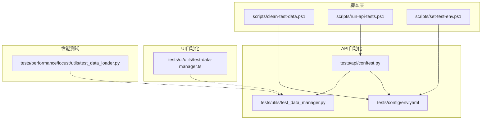
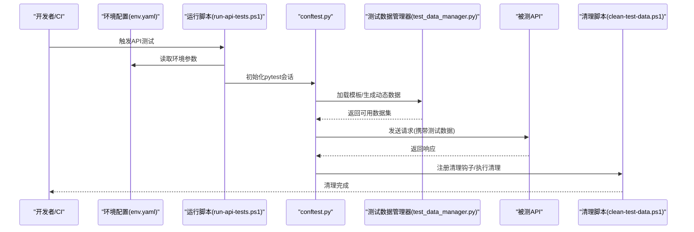
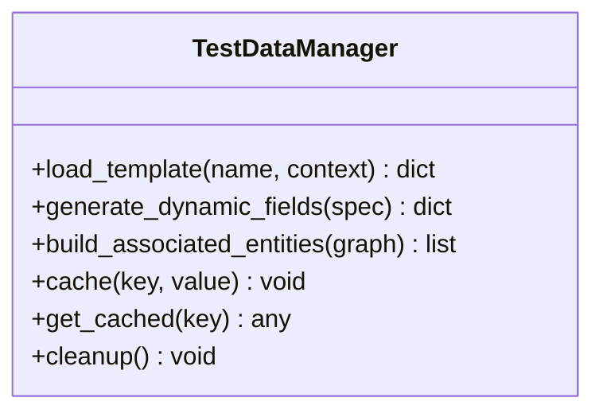
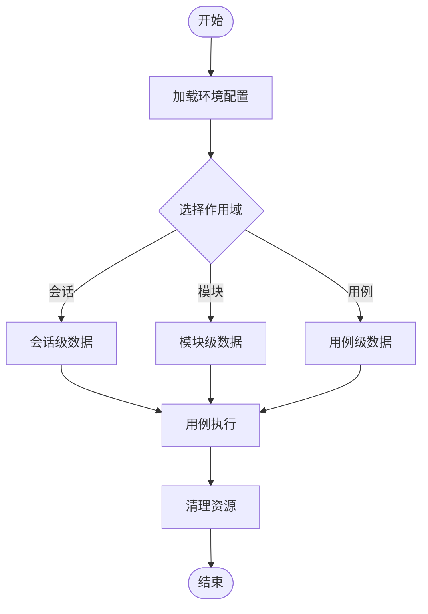
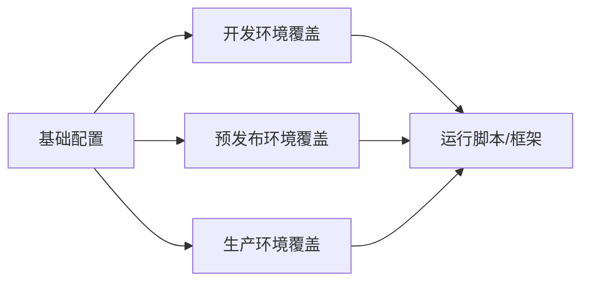
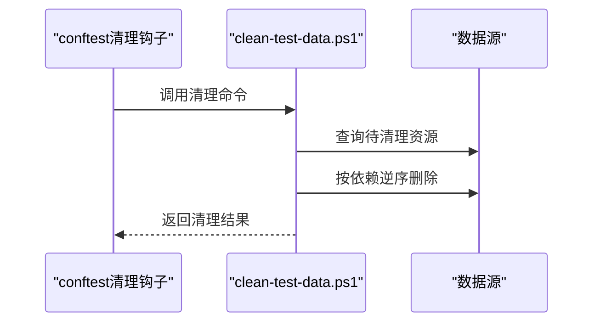
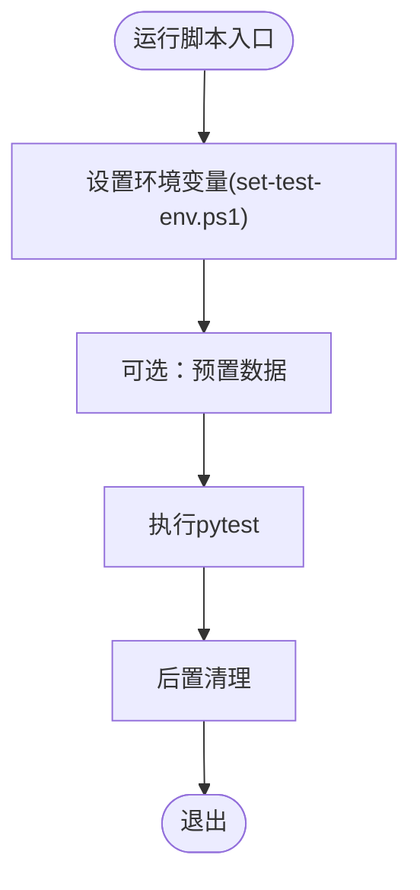
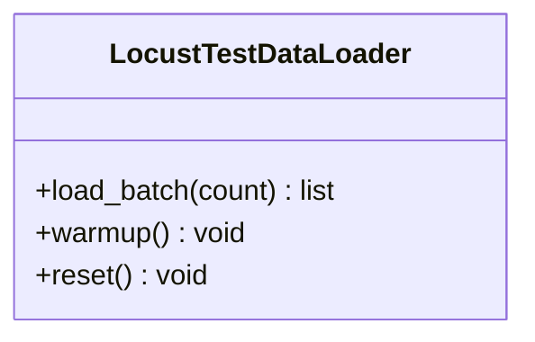
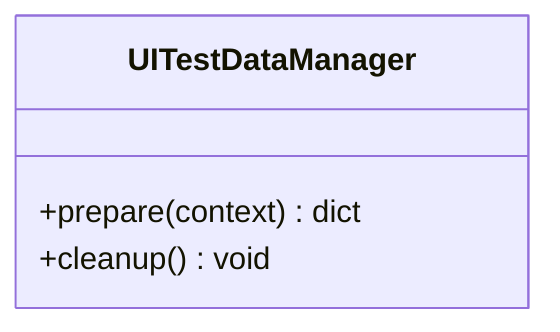
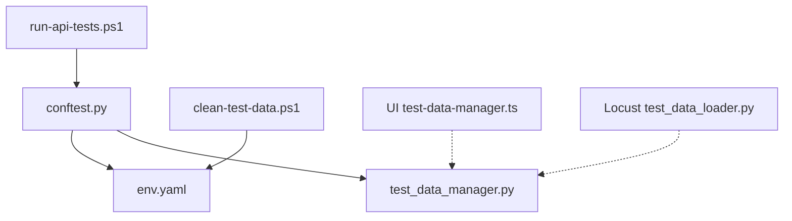

# 测试数据管理

<cite>
**本文引用的文件**   
- [tests/api/conftest.py](file://tests/api/conftest.py)
- [tests/utils/test_data_manager.py](file://tests/utils/test_data_manager.py)
- [tests/config/env.yaml](file://tests/config/env.yaml)
- [scripts/clean-test-data.ps1](file://scripts/clean-test-data.ps1)
- [scripts/run-api-tests.ps1](file://scripts/run-api-tests.ps1)
- [scripts/set-test-env.ps1](file://scripts/set-test-env.ps1)
- [tests/performance/locust/utils/test_data_loader.py](file://tests/performance/locust/utils/test_data_loader.py)
- [tests/ui/utils/test-data-manager.ts](file://tests/ui/utils/test-data-manager.ts)
</cite>

## 目录
1. [简介](#简介)
2. [项目结构](#项目结构)
3. [核心组件](#核心组件)
4. [架构总览](#架构总览)
5. [详细组件分析](#详细组件分析)
6. [依赖关系分析](#依赖关系分析)
7. [性能考虑](#性能考虑)
8. [故障排查指南](#故障排查指南)
9. [结论](#结论)
10. [附录](#附录)

## 简介
本文件面向AutoTest Hub的API测试数据管理策略，系统性阐述测试数据的生成策略、存储格式与生命周期管理；说明动态数据生成、数据模板系统与清理机制的实现原理；文档化多环境数据配置、数据版本控制与迁移策略；提供复杂测试场景与关联数据的创建示例；并给出数据隔离、并发安全与性能优化建议，以及与外部数据源的集成和同步方式。

## 项目结构
本项目在多个子系统中包含测试数据相关能力：
- API自动化（pytest）：通过conftest与工具模块组织测试数据加载、构造与清理
- UI自动化（Playwright）：提供前端侧的数据管理辅助
- 性能测试（Locust）：提供独立的数据加载器
- 脚本层：提供环境设置、数据清理与运行编排

图表来源
- [tests/api/conftest.py](file://tests/api/conftest.py)
- [tests/utils/test_data_manager.py](file://tests/utils/test_data_manager.py)
- [tests/config/env.yaml](file://tests/config/env.yaml)
- [scripts/clean-test-data.ps1](file://scripts/clean-test-data.ps1)
- [scripts/run-api-tests.ps1](file://scripts/run-api-tests.ps1)
- [scripts/set-test-env.ps1](file://scripts/set-test-env.ps1)
- [tests/ui/utils/test-data-manager.ts](file://tests/ui/utils/test-data-manager.ts)
- [tests/performance/locust/utils/test_data_loader.py](file://tests/performance/locust/utils/test_data_loader.py)

章节来源
- [tests/api/conftest.py](file://tests/api/conftest.py)
- [tests/utils/test_data_manager.py](file://tests/utils/test_data_manager.py)
- [tests/config/env.yaml](file://tests/config/env.yaml)
- [scripts/clean-test-data.ps1](file://scripts/clean-test-data.ps1)
- [scripts/run-api-tests.ps1](file://scripts/run-api-tests.ps1)
- [scripts/set-test-env.ps1](file://scripts/set-test-env.ps1)
- [tests/ui/utils/test-data-manager.ts](file://tests/ui/utils/test-data-manager.ts)
- [tests/performance/locust/utils/test_data_loader.py](file://tests/performance/locust/utils/test_data_loader.py)

## 核心组件
- 测试数据管理器（Python）：负责数据模板解析、动态字段填充、关联数据构建、缓存与清理钩子
- 测试数据管理器（TypeScript）：为UI用例提供数据准备与清理辅助
- 环境配置（YAML）：按环境区分基础数据、端点、凭据等
- 清理脚本（PowerShell）：统一执行数据清理任务
- 运行脚本（PowerShell）：在启动API测试前注入环境变量与数据准备步骤
- 性能数据加载器（Python）：为压测场景提供批量数据加载能力

章节来源
- [tests/utils/test_data_manager.py](file://tests/utils/test_data_manager.py)
- [tests/ui/utils/test-data-manager.ts](file://tests/ui/utils/test-data-manager.ts)
- [tests/config/env.yaml](file://tests/config/env.yaml)
- [scripts/clean-test-data.ps1](file://scripts/clean-test-data.ps1)
- [scripts/run-api-tests.ps1](file://scripts/run-api-tests.ps1)
- [tests/performance/locust/utils/test_data_loader.py](file://tests/performance/locust/utils/test_data_loader.py)

## 架构总览
下图展示API测试数据管理的端到端流程：从环境配置到数据生成、使用与清理。

图表来源
- [tests/config/env.yaml](file://tests/config/env.yaml)
- [scripts/run-api-tests.ps1](file://scripts/run-api-tests.ps1)
- [tests/api/conftest.py](file://tests/api/conftest.py)
- [tests/utils/test_data_manager.py](file://tests/utils/test_data_manager.py)
- [scripts/clean-test-data.ps1](file://scripts/clean-test-data.ps1)

## 详细组件分析

### 组件A：测试数据管理器（Python）
职责
- 模板系统：支持静态模板与变量占位符替换
- 动态数据生成：时间戳、随机标识、序列号等
- 关联数据构建：基于外键或业务规则组装复合对象
- 缓存与复用：避免重复生成，提升稳定性与性能
- 清理接口：暴露统一的销毁方法供fixture或脚本调用

关键实现要点
- 模板解析：将占位符映射到运行时上下文，支持嵌套结构与条件分支
- 动态字段：封装通用生成器（如唯一ID、日期范围），便于扩展
- 关联数据：以图模型表示实体关系，按拓扑顺序生成
- 清理策略：记录资源句柄，按反向依赖顺序释放

图表来源
- [tests/utils/test_data_manager.py](file://tests/utils/test_data_manager.py)

章节来源
- [tests/utils/test_data_manager.py](file://tests/utils/test_data_manager.py)

### 组件B：conftest集成与生命周期
职责
- 在会话/模块/用例级别装配测试数据
- 根据环境配置选择数据源与模板
- 注册清理钩子，确保用例失败也能回收资源

典型流程
- 会话级：加载全局环境与共享数据
- 模块级：按需预置领域数据
- 用例级：生成最小必要数据，减少副作用
- 清理：按依赖逆序删除，保证一致性

图表来源
- [tests/api/conftest.py](file://tests/api/conftest.py)
- [tests/config/env.yaml](file://tests/config/env.yaml)

章节来源
- [tests/api/conftest.py](file://tests/api/conftest.py)
- [tests/config/env.yaml](file://tests/config/env.yaml)

### 组件C：多环境数据配置（env.yaml）
职责
- 集中管理不同环境的端点、凭据、开关与默认数据
- 支持按环境切换数据源与行为
- 作为运行脚本与测试框架的共同事实来源

最佳实践
- 将敏感信息与环境变量结合，避免硬编码
- 使用分层覆盖：基础值+环境覆盖
- 对枚举型配置进行校验，防止误配

图表来源
- [tests/config/env.yaml](file://tests/config/env.yaml)
- [scripts/run-api-tests.ps1](file://scripts/run-api-tests.ps1)
- [scripts/set-test-env.ps1](file://scripts/set-test-env.ps1)

章节来源
- [tests/config/env.yaml](file://tests/config/env.yaml)
- [scripts/run-api-tests.ps1](file://scripts/run-api-tests.ps1)
- [scripts/set-test-env.ps1](file://scripts/set-test-env.ps1)

### 组件D：数据清理机制
职责
- 提供幂等的清理入口，支持按标签/命名空间/时间窗口筛选
- 与conftest钩子联动，确保异常路径也能清理
- 支持并行清理时的互斥与重试

图表来源
- [scripts/clean-test-data.ps1](file://scripts/clean-test-data.ps1)
- [tests/api/conftest.py](file://tests/api/conftest.py)

章节来源
- [scripts/clean-test-data.ps1](file://scripts/clean-test-data.ps1)
- [tests/api/conftest.py](file://tests/api/conftest.py)

### 组件E：运行脚本与数据准备
职责
- 在启动API测试前注入环境变量与数据准备步骤
- 聚合清理与运行流程，形成可复用的流水线

图表来源
- [scripts/run-api-tests.ps1](file://scripts/run-api-tests.ps1)
- [scripts/set-test-env.ps1](file://scripts/set-test-env.ps1)

章节来源
- [scripts/run-api-tests.ps1](file://scripts/run-api-tests.ps1)
- [scripts/set-test-env.ps1](file://scripts/set-test-env.ps1)

### 组件F：性能测试数据加载器（Locust）
职责
- 为压测场景提供批量数据加载与预热
- 与API数据管理器解耦，专注吞吐与延迟指标

图表来源
- [tests/performance/locust/utils/test_data_loader.py](file://tests/performance/locust/utils/test_data_loader.py)

章节来源
- [tests/performance/locust/utils/test_data_loader.py](file://tests/performance/locust/utils/test_data_loader.py)

### 组件G：UI侧数据管理（TypeScript）
职责
- 为UI用例提供数据准备与清理辅助
- 与API数据管理器保持一致的命名与约定，便于跨端协作

图表来源
- [tests/ui/utils/test-data-manager.ts](file://tests/ui/utils/test-data-manager.ts)

章节来源
- [tests/ui/utils/test-data-manager.ts](file://tests/ui/utils/test-data-manager.ts)

## 依赖关系分析
- conftest依赖环境配置与测试数据管理器
- 运行脚本驱动conftest与清理脚本
- UI与性能子系统与API数据管理器保持接口一致但实现解耦

图表来源
- [scripts/run-api-tests.ps1](file://scripts/run-api-tests.ps1)
- [tests/api/conftest.py](file://tests/api/conftest.py)
- [tests/utils/test_data_manager.py](file://tests/utils/test_data_manager.py)
- [tests/config/env.yaml](file://tests/config/env.yaml)
- [scripts/clean-test-data.ps1](file://scripts/clean-test-data.ps1)
- [tests/ui/utils/test-data-manager.ts](file://tests/ui/utils/test-data-manager.ts)
- [tests/performance/locust/utils/test_data_loader.py](file://tests/performance/locust/utils/test_data_loader.py)

章节来源
- [scripts/run-api-tests.ps1](file://scripts/run-api-tests.ps1)
- [tests/api/conftest.py](file://tests/api/conftest.py)
- [tests/utils/test_data_manager.py](file://tests/utils/test_data_manager.py)
- [tests/config/env.yaml](file://tests/config/env.yaml)
- [scripts/clean-test-data.ps1](file://scripts/clean-test-data.ps1)
- [tests/ui/utils/test-data-manager.ts](file://tests/ui/utils/test-data-manager.ts)
- [tests/performance/locust/utils/test_data_loader.py](file://tests/performance/locust/utils/test_data_loader.py)

## 性能考虑
- 数据缓存：对不可变或只读数据进行缓存，避免重复生成
- 批量操作：合并多次写入为批量提交，降低网络与事务开销
- 懒加载：仅在需要时生成关联数据，减少内存占用
- 并发安全：使用命名空间/租户隔离，避免跨用例干扰
- 清理优化：增量清理与索引过滤，缩短清理耗时

[本节为通用指导，不直接分析具体文件]

## 故障排查指南
常见问题与定位思路
- 数据未清理导致用例污染：检查清理钩子是否注册成功，确认清理脚本幂等性
- 环境配置错误：核对env.yaml与运行脚本的环境变量注入顺序
- 并发冲突：确认数据命名空间与隔离策略，必要时增加重试与退避
- 外部依赖不稳定：为外部数据源添加超时与熔断策略，记录失败上下文

章节来源
- [tests/api/conftest.py](file://tests/api/conftest.py)
- [scripts/clean-test-data.ps1](file://scripts/clean-test-data.ps1)
- [tests/config/env.yaml](file://tests/config/env.yaml)

## 结论
通过模板化与动态生成相结合的数据体系、清晰的作用域划分与清理机制、以及多环境配置与脚本编排，AutoTest Hub实现了稳定、可维护且可扩展的API测试数据管理。建议在后续迭代中持续完善数据版本控制与迁移策略，并引入更细粒度的数据隔离与监控指标，以提升大规模并发下的可靠性与可观测性。

## 附录

### 数据版本控制与迁移策略（建议）
- 版本化：为数据模板与种子数据引入版本号，变更遵循向后兼容原则
- 迁移：提供向上/向下迁移脚本，支持回滚
- 校验：在启动阶段执行数据契约校验，提前发现不一致

[本节为概念性内容，不直接分析具体文件]

### 与外部数据源的集成与同步（建议）
- 适配器模式：对外部数据源抽象统一接口，便于替换与模拟
- 同步策略：按需拉取与事件驱动更新，保障最终一致性
- 容错：重试、降级与快照恢复，提高鲁棒性

[本节为概念性内容，不直接分析具体文件]