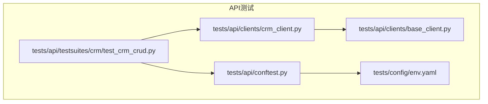
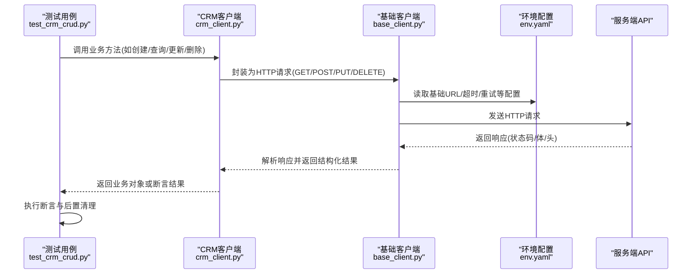
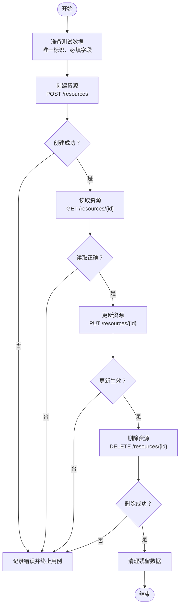
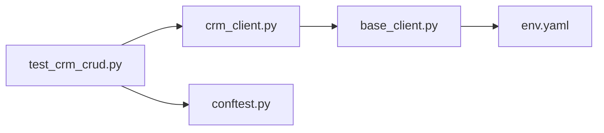

# CRUD操作测试模式

<cite>
**本文引用的文件**   
- [base_client.py](file://tests/api/clients/base_client.py)
- [crm_client.py](file://tests/api/clients/crm_client.py)
- [test_crm_crud.py](file://tests/api/testsuites/crm/test_crm_crud.py)
- [conftest.py](file://tests/api/conftest.py)
- [env.yaml](file://tests/config/env.yaml)
</cite>

## 目录
1. [简介](#简介)
2. [项目结构](#项目结构)
3. [核心组件](#核心组件)
4. [架构总览](#架构总览)
5. [详细组件分析](#详细组件分析)
6. [依赖关系分析](#依赖关系分析)
7. [性能考虑](#性能考虑)
8. [故障排查指南](#故障排查指南)
9. [结论](#结论)
10. [附录](#附录)

## 简介
本文件面向AutoTest Hub的API自动化测试，聚焦于CRUD（创建、读取、更新、删除）操作的标准化测试实现模式。文档围绕以下目标展开：
- 解释HTTP方法与CRUD的映射关系、请求参数构造与响应断言策略
- 说明测试数据准备、状态验证与错误处理的最佳实践
- 文档化BaseClient与CRMClient的使用方式与扩展机制
- 提供高质量CRUD测试用例编写示例（以路径引用代替代码片段），覆盖边界条件与异常场景
- 阐述测试隔离、数据清理与资源管理的实现方案

## 项目结构
与CRUD API测试相关的核心位置如下：
- tests/api/clients：封装HTTP客户端能力，包含通用基础客户端与业务领域客户端
- tests/api/testsuites/crm：CRM域下的接口测试套件，包含CRUD相关用例
- tests/api/conftest.py：pytest共享夹具与配置
- tests/config/env.yaml：环境配置（如基础URL、超时等）

图表来源
- [base_client.py](file://tests/api/clients/base_client.py)
- [crm_client.py](file://tests/api/clients/crm_client.py)
- [test_crm_crud.py](file://tests/api/testsuites/crm/test_crm_crud.py)
- [conftest.py](file://tests/api/conftest.py)
- [env.yaml](file://tests/config/env.yaml)

章节来源
- [base_client.py](file://tests/api/clients/base_client.py)
- [crm_client.py](file://tests/api/clients/crm_client.py)
- [test_crm_crud.py](file://tests/api/testsuites/crm/test_crm_crud.py)
- [conftest.py](file://tests/api/conftest.py)
- [env.yaml](file://tests/config/env.yaml)

## 核心组件
- BaseClient：提供通用的HTTP方法封装（GET/POST/PUT/DELETE）、统一请求头管理、认证信息注入、重试与超时控制、响应解析与断言辅助。作为所有业务客户端的基类，确保一致的调用契约与错误处理。
- CRMClient：在BaseClient之上封装CRM域的具体资源操作（例如客户、联系人、商机等），将业务语义映射到HTTP方法，并内置常用参数校验与响应断言模板。
- test_crm_crud.py：基于pytest组织CRUD测试用例，使用CRMClient进行端到端流程编排，涵盖正常路径、边界条件与异常场景。
- conftest.py：集中定义测试夹具，负责测试数据准备、环境初始化、鉴权令牌获取与后置清理，保障测试隔离与可重复性。
- env.yaml：集中管理环境相关配置，如基础URL、超时、重试次数等，便于多环境切换。

章节来源
- [base_client.py](file://tests/api/clients/base_client.py)
- [crm_client.py](file://tests/api/clients/crm_client.py)
- [test_crm_crud.py](file://tests/api/testsuites/crm/test_crm_crud.py)
- [conftest.py](file://tests/api/conftest.py)
- [env.yaml](file://tests/config/env.yaml)

## 架构总览
下图展示了从测试用例到HTTP请求再到服务端响应的整体流程，以及关键组件间的交互关系。

图表来源
- [test_crm_crud.py](file://tests/api/testsuites/crm/test_crm_crud.py)
- [crm_client.py](file://tests/api/clients/crm_client.py)
- [base_client.py](file://tests/api/clients/base_client.py)
- [env.yaml](file://tests/config/env.yaml)

## 详细组件分析

### BaseClient：通用HTTP能力与断言辅助
职责与特性
- HTTP方法封装：统一封装GET/POST/PUT/DELETE，屏蔽底层差异
- 请求构建：自动附加公共头（如Content-Type、Authorization）、序列化请求体、拼接查询参数
- 配置驱动：从环境配置加载基础URL、超时、重试策略
- 响应处理：统一解析JSON响应，提取状态码、消息、数据体
- 断言辅助：提供常见断言工具（状态码、字段存在性、类型检查、范围校验）
- 错误处理：对网络异常、超时、非预期状态码进行规范化包装，便于上层定位问题

最佳实践
- 将幂等性与重试策略限定在安全方法（如GET/HEAD）上
- 对敏感信息（如Token）进行最小暴露原则
- 为每个HTTP方法提供清晰的入参与出参契约，便于CRMClient复用

章节来源
- [base_client.py](file://tests/api/clients/base_client.py)

### CRMClient：CRM域业务客户端
职责与特性
- 资源建模：将CRM实体（如客户、联系人、商机）抽象为资源，并提供对应CRUD方法
- 参数校验：在调用前对必填字段、格式、取值范围进行前置校验，减少无效请求
- 响应断言：内置标准断言模板（如创建后返回ID、更新后字段生效、删除后不可再查）
- 事务式编排：支持组合多个步骤（先创建、再查询、再更新、最后删除）形成完整链路

扩展机制
- 新增资源：在CRMClient中增加对应方法，复用BaseClient的HTTP封装
- 自定义断言：在CRMClient内扩展断言函数，保持测试用例简洁
- 钩子与拦截：可在CRMClient中插入日志、指标采集或Mock替换点

章节来源
- [crm_client.py](file://tests/api/clients/crm_client.py)

### test_crm_crud.py：CRUD测试用例组织与断言策略
用例设计要点
- 正向路径：按“创建→读取→更新→删除”顺序编排，验证各阶段状态与数据一致性
- 边界条件：空值、超长字符串、特殊字符、重复键、越界数值等
- 异常场景：未授权、参数缺失、非法枚举、并发冲突、资源不存在
- 断言策略：
  - 状态码断言：2xx成功、4xx客户端错误、5xx服务端错误
  - 响应体断言：关键字段存在且类型正确、业务标识（如ID）有效
  - 资源状态断言：查询结果与期望一致、删除后再次查询应失败
- 数据隔离：每个用例独立准备数据，避免相互污染

章节来源
- [test_crm_crud.py](file://tests/api/testsuites/crm/test_crm_crud.py)

### conftest.py：测试夹具与环境初始化
职责与特性
- 环境加载：从env.yaml读取基础URL、超时、重试等配置
- 鉴权夹具：提供登录/令牌获取夹具，供用例按需使用
- 数据夹具：提供工厂方法生成测试数据，支持一次性或逐条清理
- 生命周期管理：通过fixture作用域控制资源创建与释放，保证测试隔离

最佳实践
- 使用session级fixture缓存全局资源（如Token），降低开销
- 使用function级fixture保证每条用例的数据独立性
- 在teardown中执行清理逻辑，确保资源回收

章节来源
- [conftest.py](file://tests/api/conftest.py)
- [env.yaml](file://tests/config/env.yaml)

### 流程图：CRUD标准化测试流程

图表来源
- [test_crm_crud.py](file://tests/api/testsuites/crm/test_crm_crud.py)
- [crm_client.py](file://tests/api/clients/crm_client.py)
- [base_client.py](file://tests/api/clients/base_client.py)

## 依赖关系分析
- 测试用例依赖CRMClient提供的业务方法
- CRMClient依赖BaseClient完成HTTP通信与响应解析
- 两者共同依赖环境配置（env.yaml）与pytest夹具（conftest.py）

图表来源
- [test_crm_crud.py](file://tests/api/testsuites/crm/test_crm_crud.py)
- [crm_client.py](file://tests/api/clients/crm_client.py)
- [base_client.py](file://tests/api/clients/base_client.py)
- [env.yaml](file://tests/config/env.yaml)
- [conftest.py](file://tests/api/conftest.py)

章节来源
- [test_crm_crud.py](file://tests/api/testsuites/crm/test_crm_crud.py)
- [crm_client.py](file://tests/api/clients/crm_client.py)
- [base_client.py](file://tests/api/clients/base_client.py)
- [env.yaml](file://tests/config/env.yaml)
- [conftest.py](file://tests/api/conftest.py)

## 性能考虑
- 批量创建与删除：在必要时使用批量接口以减少往返次数
- 连接复用：利用HTTP会话保持连接，降低握手开销
- 超时与重试：合理设置超时与重试上限，避免长时间阻塞
- 数据量控制：避免在单条用例中创建过多资源，影响稳定性与执行时间

[本节为通用指导，不直接分析具体文件]

## 故障排查指南
常见问题与定位建议
- 鉴权失败：检查conftest中的登录夹具是否成功获取Token；确认请求头是否正确注入
- 参数校验失败：核对CRMClient的参数校验规则与服务端约束是否一致
- 资源状态不一致：确认用例间数据隔离是否生效，清理逻辑是否执行
- 网络异常：查看BaseClient的错误包装与日志输出，定位超时或重试策略是否合适

章节来源
- [conftest.py](file://tests/api/conftest.py)
- [base_client.py](file://tests/api/clients/base_client.py)
- [crm_client.py](file://tests/api/clients/crm_client.py)

## 结论
通过BaseClient与CRMClient的分层封装，结合pytest夹具与环境配置，AutoTest Hub实现了稳定、可维护的CRUD测试模式。该模式强调：
- 明确的HTTP方法与CRUD映射
- 统一的请求构造与响应断言策略
- 完善的测试数据准备与清理机制
- 良好的错误处理与可观测性

遵循本文档的实践，可快速扩展新的业务资源测试，并保持用例质量与可维护性。

[本节为总结性内容，不直接分析具体文件]

## 附录
- 参考用例路径：
  - [test_crm_crud.py](file://tests/api/testsuites/crm/test_crm_crud.py)
- 客户端实现路径：
  - [base_client.py](file://tests/api/clients/base_client.py)
  - [crm_client.py](file://tests/api/clients/crm_client.py)
- 配置与夹具路径：
  - [conftest.py](file://tests/api/conftest.py)
  - [env.yaml](file://tests/config/env.yaml)

[本节为索引性内容，不直接分析具体文件]