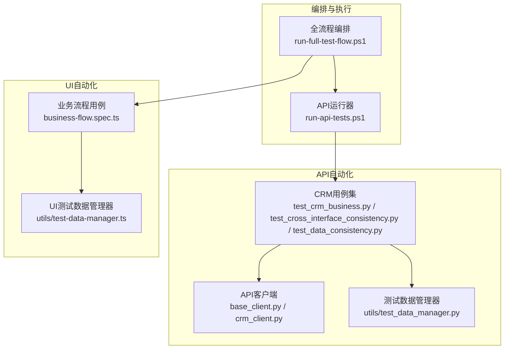
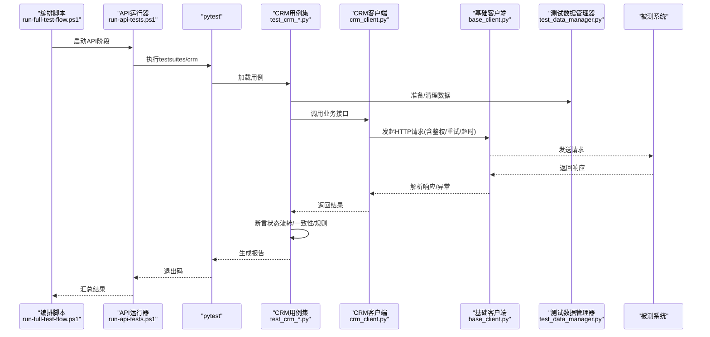
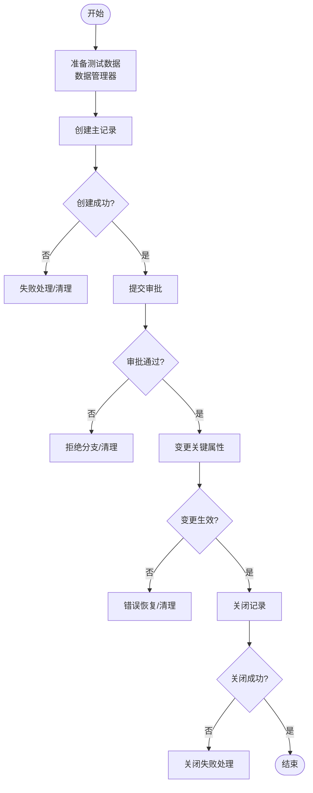
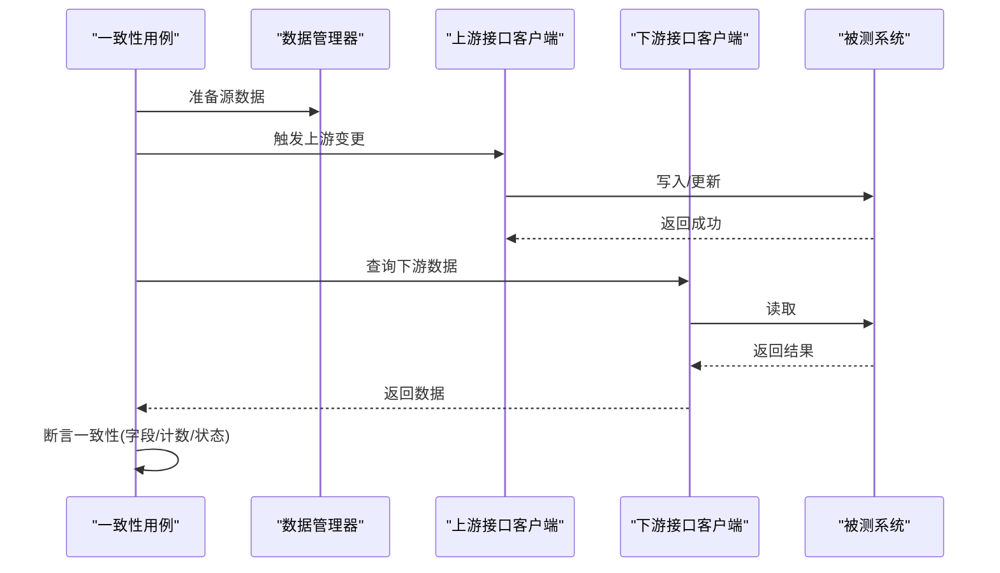
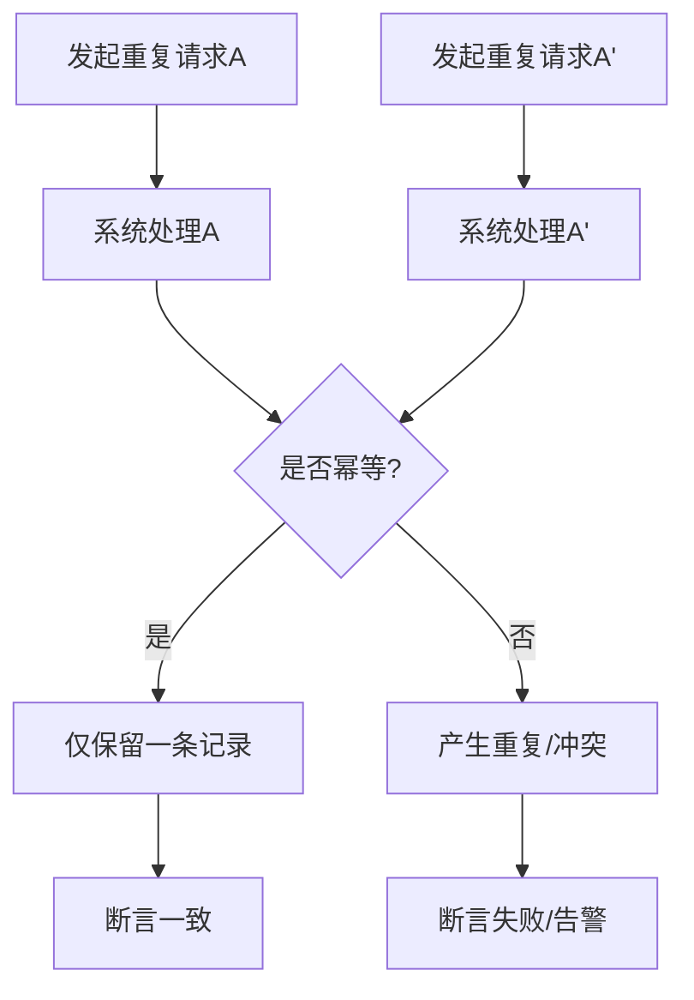
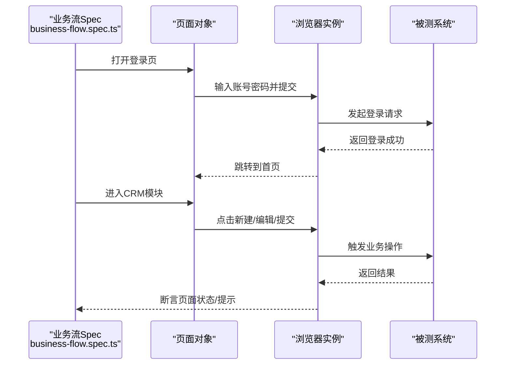
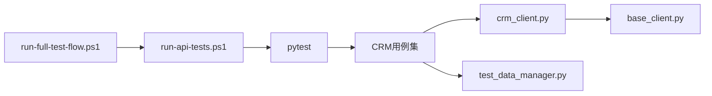

# 业务流程测试

<cite>
**本文引用的文件**   
- [tests/api/testsuites/crm/test_crm_business.py](file://tests/api/testsuites/crm/test_crm_business.py)
- [tests/api/testsuites/crm/test_cross_interface_consistency.py](file://tests/api/testsuites/crm/test_cross_interface一致性.py)
- [tests/api/testsuites/crm/test_data_consistency.py](file://tests/api/testsuites/crm/test_data_consistency.py)
- [tests/api/clients/base_client.py](file://tests/api/clients/base_client.py)
- [tests/api/clients/crm_client.py](file://tests/api/clients/crm_client.py)
- [tests/utils/test_data_manager.py](file://tests/utils/test_data_manager.py)
- [tests/ui/specs/crm/business-flow.spec.ts](file://tests/ui/specs/crm/business-flow.spec.ts)
- [tests/ui/utils/test-data-manager.ts](file://tests/ui/utils/test-data-manager.ts)
- [scripts/run-full-test-flow.ps1](file://scripts/run-full-test-flow.ps1)
- [scripts/run-api-tests.ps1](file://scripts/run-api-tests.ps1)
</cite>

## 目录
1. [简介](#简介)
2. [项目结构](#项目结构)
3. [核心组件](#核心组件)
4. [架构总览](#架构总览)
5. [详细组件分析](#详细组件分析)
6. [依赖关系分析](#依赖关系分析)
7. [性能与稳定性考量](#性能与稳定性考量)
8. [故障排查指南](#故障排查指南)
9. [结论](#结论)
10. [附录](#附录)

## 简介
本文件面向AutoTest Hub的业务流程测试，聚焦复杂业务场景的端到端测试设计模式。内容涵盖：
- 多步骤业务流程编排与状态流转验证
- 跨接口数据一致性检查
- 业务规则验证、事务处理与回滚机制的测试策略
- 测试数据管理器在业务流程测试中的应用（数据依赖管理与环境隔离）
- 模拟真实用户操作序列的业务流程示例
- 异步操作处理、超时重试与错误恢复的测试方法

## 项目结构
本项目将API与UI两条路径的流程测试分别组织，并通过脚本统一编排执行。关键目录与职责如下：
- API层
  - clients：HTTP客户端封装与CRM领域能力聚合
  - testsuites/crm：CRM领域业务流程与一致性用例集
  - utils：认证与通用工具
- UI层
  - specs/crm：基于Playwright的CRM业务流程端到端用例
  - utils：前端测试辅助与测试数据管理
- scripts：流程编排与运行脚本（PowerShell为主）

图表来源
- [tests/api/clients/base_client.py](file://tests/api/clients/base_client.py)
- [tests/api/clients/crm_client.py](file://tests/api/clients/crm_client.py)
- [tests/api/testsuites/crm/test_crm_business.py](file://tests/api/testsuites/crm/test_crm_business.py)
- [tests/api/testsuites/crm/test_cross_interface_consistency.py](file://tests/api/testsuites/crm/test_cross_interface一致性.py)
- [tests/api/testsuites/crm/test_data_consistency.py](file://tests/api/testsuites/crm/test_data_consistency.py)
- [tests/utils/test_data_manager.py](file://tests/utils/test_data_manager.py)
- [tests/ui/specs/crm/business-flow.spec.ts](file://tests/ui/specs/crm/business-flow.spec.ts)
- [tests/ui/utils/test-data-manager.ts](file://tests/ui/utils/test-data-manager.ts)
- [scripts/run-full-test-flow.ps1](file://scripts/run-full-test-flow.ps1)
- [scripts/run-api-tests.ps1](file://scripts/run-api-tests.ps1)

章节来源
- [scripts/run-full-test-flow.ps1](file://scripts/run-full-test-flow.ps1)
- [scripts/run-api-tests.ps1](file://scripts/run-api-tests.ps1)

## 核心组件
- API客户端封装
  - base_client：提供统一的请求构造、鉴权注入、重试与超时控制等基础能力
  - crm_client：在base_client之上封装CRM领域操作（如客户、商机、报价等），形成面向业务的调用面
- CRM业务流程用例集
  - test_crm_business：编排多步骤业务流程（创建→审批→变更→关闭），校验状态机流转与业务规则
  - test_cross_interface_consistency：跨接口数据一致性断言（如订单与库存、线索与联系人）
  - test_data_consistency：数据一致性与幂等性验证（重复提交、并发写入）
- 测试数据管理器
  - Python侧：负责测试数据的创建、清理、依赖注入与环境隔离
  - TypeScript侧：为UI用例提供相同语义的数据准备与回收
- 编排与执行脚本
  - run-full-test-flow.ps1：串联API与UI流程，按阶段输出报告
  - run-api-tests.ps1：驱动pytest执行API用例集

章节来源
- [tests/api/clients/base_client.py](file://tests/api/clients/base_client.py)
- [tests/api/clients/crm_client.py](file://tests/api/clients/crm_client.py)
- [tests/api/testsuites/crm/test_crm_business.py](file://tests/api/testsuites/crm/test_crm_business.py)
- [tests/api/testsuites/crm/test_cross_interface_consistency.py](file://tests/api/testsuites/crm/test_cross_interface一致性.py)
- [tests/api/testsuites/crm/test_data_consistency.py](file://tests/api/testsuites/crm/test_data_consistency.py)
- [tests/utils/test_data_manager.py](file://tests/utils/test_data_manager.py)
- [tests/ui/utils/test-data-manager.ts](file://tests/ui/utils/test-data-manager.ts)

## 架构总览
下图展示从编排脚本到具体测试执行的端到端链路，以及数据管理器在各环节的作用。

图表来源
- [scripts/run-full-test-flow.ps1](file://scripts/run-full-test-flow.ps1)
- [scripts/run-api-tests.ps1](file://scripts/run-api-tests.ps1)
- [tests/api/testsuites/crm/test_crm_business.py](file://tests/api/testsuites/crm/test_crm_business.py)
- [tests/api/clients/crm_client.py](file://tests/api/clients/crm_client.py)
- [tests/api/clients/base_client.py](file://tests/api/clients/base_client.py)
- [tests/utils/test_data_manager.py](file://tests/utils/test_data_manager.py)

## 详细组件分析

### CRM业务流程编排与状态流转验证
- 目标
  - 覆盖“创建→审批→变更→关闭”的主流程，并验证各节点状态机约束与业务规则
- 关键点
  - 前置数据准备：通过测试数据管理器创建最小可用数据集，避免外部依赖污染
  - 步骤编排：以函数式或类方法形式组合多个接口调用，保证顺序与上下文传递
  - 状态断言：对每个步骤后的实体状态进行断言，确保不可逆操作被正确阻止
  - 异常路径：覆盖非法状态迁移、权限不足、必填项缺失等分支
- 建议断言点
  - 字段级：关键字段非空、枚举值合法、数值范围合理
  - 关系级：关联对象存在且引用有效
  - 时序级：时间戳递增、审计日志完整
  - 幂等性：重复提交不产生副作用

图表来源
- [tests/api/testsuites/crm/test_crm_business.py](file://tests/api/testsuites/crm/test_crm_business.py)
- [tests/utils/test_data_manager.py](file://tests/utils/test_data_manager.py)

章节来源
- [tests/api/testsuites/crm/test_crm_business.py](file://tests/api/testsuites/crm/test_crm_business.py)

### 跨接口数据一致性检查
- 目标
  - 验证跨模块/跨服务的数据一致性，例如“线索→联系人→商机”的联动更新
- 关键点
  - 选择强一致或最终一致的断言策略（同步查询 vs 轮询+退避）
  - 使用唯一标识贯穿上下游，便于定位不一致源头
  - 针对并发写入场景，增加幂等与去重断言
- 典型断言
  - 外键完整性、计数一致性、金额合计一致性、状态传播一致性

图表来源
- [tests/api/testsuites/crm/test_cross_interface_consistency.py](file://tests/api/testsuites/crm/test_cross_interface一致性.py)
- [tests/utils/test_data_manager.py](file://tests/utils/test_data_manager.py)

章节来源
- [tests/api/testsuites/crm/test_cross_interface_consistency.py](file://tests/api/testsuites/crm/test_cross_interface一致性.py)

### 数据一致性与幂等性验证
- 目标
  - 验证重复提交、并发写入下的数据一致性与幂等性
- 关键点
  - 幂等键/唯一约束断言
  - 并发场景下使用锁或队列串行化，避免随机性干扰
  - 补偿与回滚：在失败路径中验证事务回滚或补偿逻辑

图表来源
- [tests/api/testsuites/crm/test_data_consistency.py](file://tests/api/testsuites/crm/test_data_consistency.py)

章节来源
- [tests/api/testsuites/crm/test_data_consistency.py](file://tests/api/testsuites/crm/test_data_consistency.py)

### 测试数据管理器（Python）
- 职责
  - 数据准备：批量创建最小数据集，支持参数化与模板化
  - 依赖注入：按用例需求按需装配关联数据
  - 环境隔离：为每条用例提供独立命名空间或前缀，避免相互影响
  - 清理回收：用例结束后自动清理，保障可重复执行
- 使用建议
  - 在setUp/fixture中初始化，在tearDown中释放
  - 对敏感数据脱敏，避免泄露
  - 提供“只读快照”用于一致性断言

章节来源
- [tests/utils/test_data_manager.py](file://tests/utils/test_data_manager.py)

### 测试数据管理器（TypeScript/UI）
- 职责
  - 为UI流程提供与API侧等价的数据准备与清理能力
  - 与页面交互配合，确保界面可见数据与后端一致
- 使用建议
  - 与登录态、租户/工作区隔离结合
  - 在spec级别前后钩子中完成数据生命周期管理

章节来源
- [tests/ui/utils/test-data-manager.ts](file://tests/ui/utils/test-data-manager.ts)

### UI端到端业务流程示例
- 目标
  - 模拟真实用户在CRM中的操作序列，覆盖关键路径与异常路径
- 关键点
  - 页面导航与元素等待策略
  - 表单输入与校验反馈
  - 弹窗/对话框交互与状态确认
  - 截图与录屏作为失败证据
- 建议断言点
  - 路由跳转、面包屑、列表分页、详情字段、操作按钮显隐

图表来源
- [tests/ui/specs/crm/business-flow.spec.ts](file://tests/ui/specs/crm/business-flow.spec.ts)

章节来源
- [tests/ui/specs/crm/business-flow.spec.ts](file://tests/ui/specs/crm/business-flow.spec.ts)

### 客户端封装与重试/超时/鉴权
- 基础客户端
  - 统一构建请求头（鉴权令牌）、设置全局超时、配置重试策略（指数退避、最大次数）
  - 标准化响应解析与异常分类（网络错误、业务错误、超时）
- CRM客户端
  - 在基础客户端之上封装领域方法，屏蔽底层细节，提升可读性与复用性
- 建议
  - 将重试与超时参数化，便于不同环境调优
  - 对幂等接口启用重试，非幂等接口谨慎使用

章节来源
- [tests/api/clients/base_client.py](file://tests/api/clients/base_client.py)
- [tests/api/clients/crm_client.py](file://tests/api/clients/crm_client.py)

## 依赖关系分析
- 耦合与内聚
  - 用例集与客户端高内聚，通过数据管理器解耦数据依赖
  - 编排脚本与具体实现松耦合，便于替换执行引擎
- 外部依赖
  - HTTP客户端库、浏览器自动化框架、测试运行器
- 潜在循环依赖
  - 应避免用例直接依赖其他用例；通过数据管理器共享数据

图表来源
- [scripts/run-full-test-flow.ps1](file://scripts/run-full-test-flow.ps1)
- [scripts/run-api-tests.ps1](file://scripts/run-api-tests.ps1)
- [tests/api/testsuites/crm/test_crm_business.py](file://tests/api/testsuites/crm/test_crm_business.py)
- [tests/api/clients/crm_client.py](file://tests/api/clients/crm_client.py)
- [tests/api/clients/base_client.py](file://tests/api/clients/base_client.py)
- [tests/utils/test_data_manager.py](file://tests/utils/test_data_manager.py)

章节来源
- [scripts/run-full-test-flow.ps1](file://scripts/run-full-test-flow.ps1)
- [scripts/run-api-tests.ps1](file://scripts/run-api-tests.ps1)

## 性能与稳定性考量
- 重试与退避
  - 对网络抖动与瞬时失败采用指数退避，限制最大重试次数
- 超时控制
  - 区分连接超时、读写超时与业务超时，避免长时间挂起
- 并发与资源
  - 数据管理器应支持并行用例的资源隔离，避免竞争条件
- 可观测性
  - 记录关键步骤耗时、失败堆栈与上下文快照，便于定位瓶颈

[本节为通用指导，无需特定文件来源]

## 故障排查指南
- 常见问题
  - 鉴权失败：检查令牌获取与注入流程
  - 数据未就绪：确认数据管理器是否在正确时机执行
  - 超时/重试风暴：调整超时阈值与重试策略
  - 状态不一致：核对最终一致性等待与轮询间隔
- 定位手段
  - 开启详细日志与请求追踪
  - 保存失败时的页面截图与网络请求快照
  - 使用最小复现数据集快速回归

章节来源
- [tests/api/clients/base_client.py](file://tests/api/clients/base_client.py)
- [tests/api/clients/crm_client.py](file://tests/api/clients/crm_client.py)
- [tests/utils/test_data_manager.py](file://tests/utils/test_data_manager.py)

## 结论
通过将业务流程拆解为可编排的步骤、以数据管理器保障环境隔离与数据依赖、并以客户端封装统一重试与超时策略，本项目实现了稳定、可维护且可扩展的端到端业务流程测试体系。建议在后续迭代中持续完善一致性断言、增强可观测性，并将最佳实践沉淀为团队规范。

[本节为总结性内容，无需特定文件来源]

## 附录
- 术语
  - 幂等：多次执行与单次执行效果一致
  - 最终一致性：系统在一段时间后达到一致状态
  - 状态机：描述对象在不同状态下允许的状态迁移集合
- 参考
  - 编排脚本与运行入口见对应PowerShell脚本文件
  - 用例与客户端实现见tests/api/testsuites与tests/api/clients目录

[本节为补充信息，无需特定文件来源]