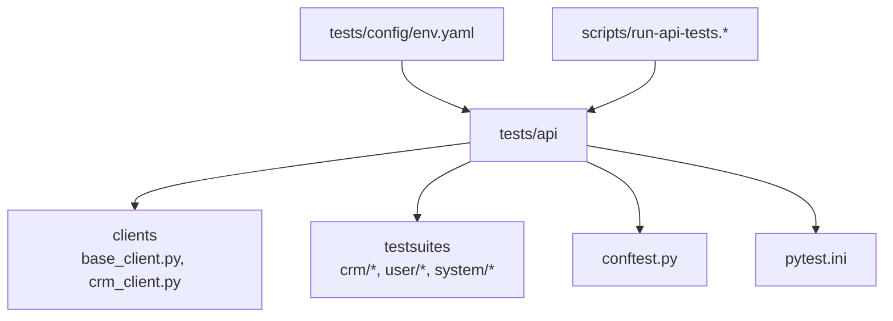
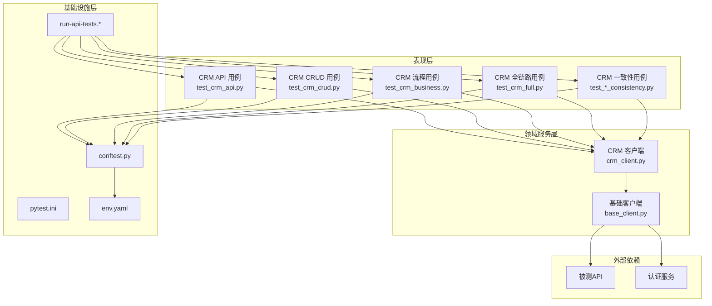
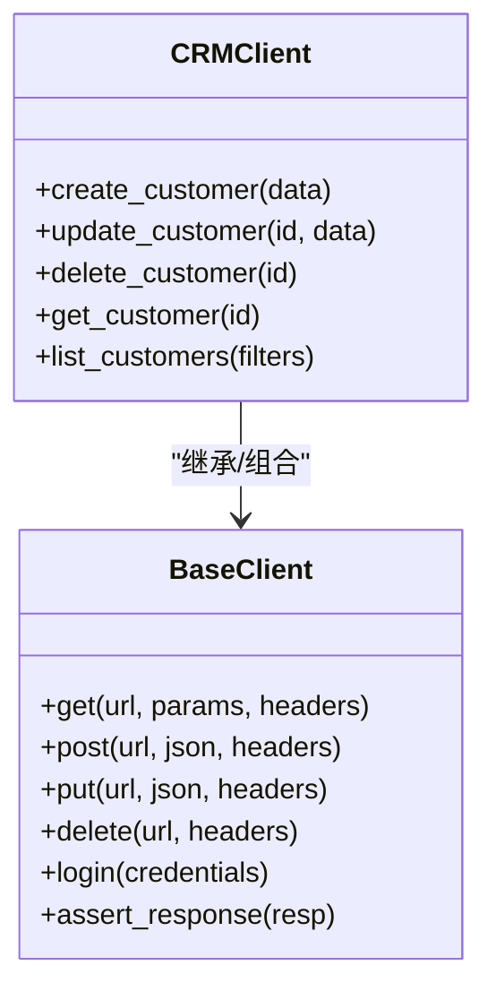
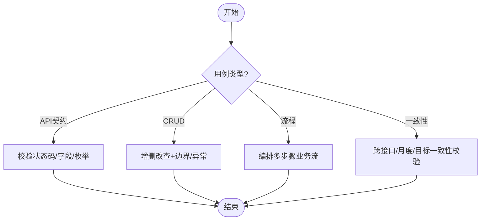
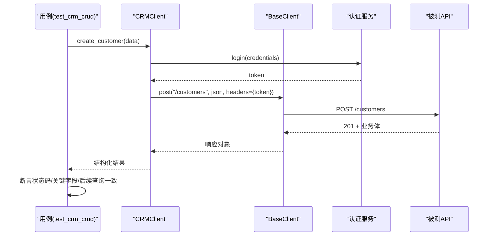
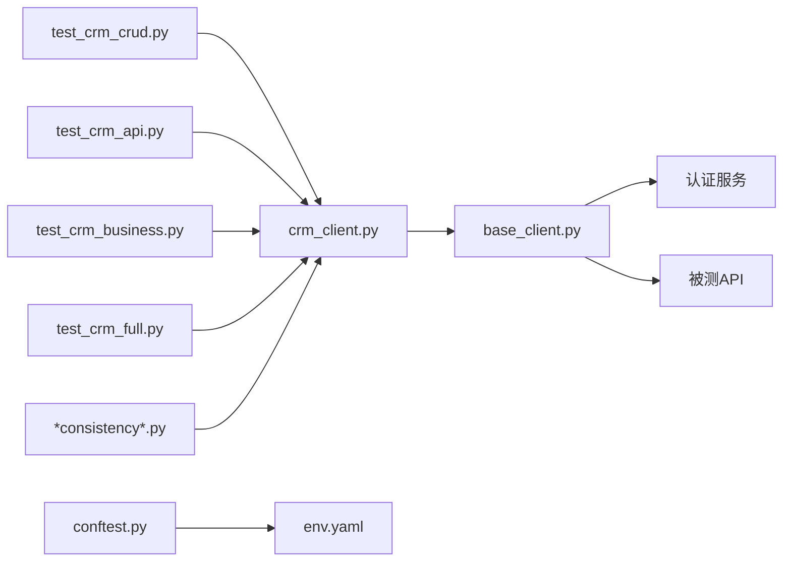

# 测试用例组织

<cite>
**本文引用的文件**   
- [tests/api/conftest.py](file://tests/api/conftest.py)
- [tests/api/pytest.ini](file://tests/api/pytest.ini)
- [tests/api/clients/base_client.py](file://tests/api/clients/base_client.py)
- [tests/api/clients/crm_client.py](file://tests/api/clients/crm_client.py)
- [tests/api/testsuites/crm/test_crm_api.py](file://tests/api/testsuites/crm/test_crm_api.py)
- [tests/api/testsuites/crm/test_crm_business.py](file://tests/api/testsuites/crm/test_crm_business.py)
- [tests/api/testsuites/crm/test_crm_crud.py](file://tests/api/testsuites/crm/test_crm_crud.py)
- [tests/api/testsuites/crm/test_crm_full.py](file://tests/api/testsuites/crm/test_crm_full.py)
- [tests/api/testsuites/crm/test_cross_interface_consistency.py](file://tests/api/testsuites/crm/test_cross_interface_consistency.py)
- [tests/api/testsuites/crm/test_data_consistency.py](file://tests/api/testsuites/crm/test_data_consistency.py)
- [tests/api/testsuites/crm/test_month_on_month_consistency.py](file://tests/api/testsuites/crm/test_month_on_month_consistency.py)
- [tests/api/testsuites/crm/test_target_consistency.py](file://tests/api/testsuites/crm/test_target_consistency.py)
- [scripts/run-api-tests.ps1](file://scripts/run-api-tests.ps1)
- [scripts/run-api-tests.sh](file://scripts/run-api-tests.sh)
- [scripts/generate-coverage-matrix.py](file://scripts/generate-coverage-matrix.py)
- [scripts/scan-test-coverage.py](file://scripts/scan-test-coverage.py)
- [scripts/set-test-env.ps1](file://scripts/set-test-env.ps1)
- [tests/config/env.yaml](file://tests/config/env.yaml)
</cite>

## 目录
1. [简介](#简介)
2. [项目结构](#项目结构)
3. [核心组件](#核心组件)
4. [架构总览](#架构总览)
5. [详细组件分析](#详细组件分析)
6. [依赖关系分析](#依赖关系分析)
7. [性能与可维护性考虑](#性能与可维护性考虑)
8. [故障排查指南](#故障排查指南)
9. [结论](#结论)
10. [附录](#附录)

## 简介
本文件面向AutoTest Hub项目的API自动化测试，聚焦“测试用例组织结构”的体系化说明。文档从分层设计、模块化组织、业务域划分与命名规范出发，系统阐述CRUD操作测试、业务流程测试与数据一致性测试的实现模式与最佳实践；同时覆盖用例分类策略、优先级标记、依赖管理、测试数据准备与环境隔离、结果验证策略，以及覆盖率统计与质量门禁集成方法。目标是帮助读者快速理解并高质量地编写与维护API测试套件。

## 项目结构
API测试位于 tests/api 目录下，采用“按业务域+按测试类型”的双维组织方式：
- 客户端封装层：tests/api/clients
- 测试套件层：tests/api/testsuites（按业务域如crm、user、system等子目录）
- 配置与运行：tests/api/pytest.ini、tests/config/env.yaml
- 运行脚本：scripts/run-api-tests.*

图示来源
- [tests/api/clients/base_client.py](file://tests/api/clients/base_client.py)
- [tests/api/clients/crm_client.py](file://tests/api/clients/crm_client.py)
- [tests/api/testsuites/crm/test_crm_api.py](file://tests/api/testsuites/crm/test_crm_api.py)
- [tests/api/testsuites/crm/test_crm_crud.py](file://tests/api/testsuites/crm/test_crm_crud.py)
- [tests/api/testsuites/crm/test_crm_business.py](file://tests/api/testsuites/crm/test_crm_business.py)
- [tests/api/testsuites/crm/test_crm_full.py](file://tests/api/testsuites/crm/test_crm_full.py)
- [tests/api/testsuites/crm/test_data_consistency.py](file://tests/api/testsuites/crm/test_data_consistency.py)
- [tests/api/testsuites/crm/test_cross_interface_consistency.py](file://tests/api/testsuites/crm/test_cross_interface_consistency.py)
- [tests/api/testsuites/crm/test_month_on_month_consistency.py](file://tests/api/testsuites/crm/test_month_on_month_consistency.py)
- [tests/api/testsuites/crm/test_target_consistency.py](file://tests/api/testsuites/crm/test_target_consistency.py)
- [tests/api/conftest.py](file://tests/api/conftest.py)
- [tests/api/pytest.ini](file://tests/api/pytest.ini)
- [tests/config/env.yaml](file://tests/config/env.yaml)
- [scripts/run-api-tests.ps1](file://scripts/run-api-tests.ps1)
- [scripts/run-api-tests.sh](file://scripts/run-api-tests.sh)

章节来源
- [tests/api/pytest.ini](file://tests/api/pytest.ini)
- [tests/config/env.yaml](file://tests/config/env.yaml)
- [scripts/run-api-tests.ps1](file://scripts/run-api-tests.ps1)
- [scripts/run-api-tests.sh](file://scripts/run-api-tests.sh)

## 核心组件
- 客户端封装层
  - base_client.py：提供HTTP请求通用能力（连接、重试、鉴权头注入、响应断言基类等），降低上层用例重复代码。
  - crm_client.py：基于基础客户端封装CRM领域接口调用，暴露领域语义化的方法（如创建客户、更新线索、查询商机等）。
- 测试套件层
  - CRM域套件：包含API冒烟、CRUD、业务流程、全链路、数据一致性、跨接口一致性、月度一致性、目标一致性等用例集。
  - 其他域套件：user、system、dashboard、erp等目录预留扩展位，便于按业务域横向扩展。
- 配置与夹具
  - conftest.py：集中定义fixture（如登录态、环境配置、数据清理钩子）、全局插件与参数化。
  - pytest.ini：测试发现规则、标记、并行选项、报告输出路径等。
  - env.yaml：多环境配置（URL、凭据、开关），配合set-test-env.ps1切换。
- 运行与覆盖率
  - run-api-tests.ps1/sh：统一入口，支持按标签筛选、并行执行、生成报告。
  - generate-coverage-matrix.py / scan-test-coverage.py：覆盖率扫描与矩阵生成，用于质量门禁。

章节来源
- [tests/api/clients/base_client.py](file://tests/api/clients/base_client.py)
- [tests/api/clients/crm_client.py](file://tests/api/clients/crm_client.py)
- [tests/api/conftest.py](file://tests/api/conftest.py)
- [tests/api/pytest.ini](file://tests/api/pytest.ini)
- [tests/config/env.yaml](file://tests/config/env.yaml)
- [scripts/run-api-tests.ps1](file://scripts/run-api-tests.ps1)
- [scripts/run-api-tests.sh](file://scripts/run-api-tests.sh)
- [scripts/generate-coverage-matrix.py](file://scripts/generate-coverage-matrix.py)
- [scripts/scan-test-coverage.py](file://scripts/scan-test-coverage.py)

## 架构总览
API测试整体分层如下：
- 表现层：各业务域测试套件（testsuites/*）
- 领域服务层：领域客户端（clients/*）
- 基础设施层：基础客户端、夹具、配置、运行脚本
- 外部依赖：被测API、认证服务、配置中心

图示来源
- [tests/api/testsuites/crm/test_crm_api.py](file://tests/api/testsuites/crm/test_crm_api.py)
- [tests/api/testsuites/crm/test_crm_crud.py](file://tests/api/testsuites/crm/test_crm_crud.py)
- [tests/api/testsuites/crm/test_crm_business.py](file://tests/api/testsuites/crm/test_crm_business.py)
- [tests/api/testsuites/crm/test_crm_full.py](file://tests/api/testsuites/crm/test_crm_full.py)
- [tests/api/testsuites/crm/test_data_consistency.py](file://tests/api/testsuites/crm/test_data_consistency.py)
- [tests/api/testsuites/crm/test_cross_interface_consistency.py](file://tests/api/testsuites/crm/test_cross_interface_consistency.py)
- [tests/api/testsuites/crm/test_month_on_month_consistency.py](file://tests/api/testsuites/crm/test_month_on_month_consistency.py)
- [tests/api/testsuites/crm/test_target_consistency.py](file://tests/api/testsuites/crm/test_target_consistency.py)
- [tests/api/clients/crm_client.py](file://tests/api/clients/crm_client.py)
- [tests/api/clients/base_client.py](file://tests/api/clients/base_client.py)
- [tests/api/conftest.py](file://tests/api/conftest.py)
- [tests/api/pytest.ini](file://tests/api/pytest.ini)
- [tests/config/env.yaml](file://tests/config/env.yaml)
- [scripts/run-api-tests.ps1](file://scripts/run-api-tests.ps1)
- [scripts/run-api-tests.sh](file://scripts/run-api-tests.sh)

## 详细组件分析

### 客户端封装层（BaseClient 与 CRMClient）
- BaseClient职责
  - 统一HTTP会话、超时与重试策略
  - 鉴权头注入（Token获取/刷新）
  - 响应码与业务码校验、错误信息标准化
  - 日志与调试信息输出
- CRMClient职责
  - 将HTTP调用封装为CRM领域方法（如创建/更新/删除/查询）
  - 参数校验与默认值填充
  - 返回结构化对象供用例断言

图示来源
- [tests/api/clients/base_client.py](file://tests/api/clients/base_client.py)
- [tests/api/clients/crm_client.py](file://tests/api/clients/crm_client.py)

章节来源
- [tests/api/clients/base_client.py](file://tests/api/clients/base_client.py)
- [tests/api/clients/crm_client.py](file://tests/api/clients/crm_client.py)

### CRM 测试套件分层与职责
- test_crm_api.py：API冒烟与契约校验（状态码、必填字段、枚举范围）
- test_crm_crud.py：CRUD全覆盖（正向、边界、异常分支）
- test_crm_business.py：端到端业务流程（如线索→商机→合同→回款）
- test_crm_full.py：全链路回归（组合多个流程）
- 一致性测试族
  - test_data_consistency.py：单表/主数据一致性
  - test_cross_interface_consistency.py：跨接口数据一致性
  - test_month_on_month_consistency.py：月度指标滚动一致性
  - test_target_consistency.py：目标与达成率一致性

图示来源
- [tests/api/testsuites/crm/test_crm_api.py](file://tests/api/testsuites/crm/test_crm_api.py)
- [tests/api/testsuites/crm/test_crm_crud.py](file://tests/api/testsuites/crm/test_crm_crud.py)
- [tests/api/testsuites/crm/test_crm_business.py](file://tests/api/testsuites/crm/test_crm_business.py)
- [tests/api/testsuites/crm/test_crm_full.py](file://tests/api/testsuites/crm/test_crm_full.py)
- [tests/api/testsuites/crm/test_data_consistency.py](file://tests/api/testsuites/crm/test_data_consistency.py)
- [tests/api/testsuites/crm/test_cross_interface_consistency.py](file://tests/api/testsuites/crm/test_cross_interface_consistency.py)
- [tests/api/testsuites/crm/test_month_on_month_consistency.py](file://tests/api/testsuites/crm/test_month_on_month_consistency.py)
- [tests/api/testsuites/crm/test_target_consistency.py](file://tests/api/testsuites/crm/test_target_consistency.py)

章节来源
- [tests/api/testsuites/crm/test_crm_api.py](file://tests/api/testsuites/crm/test_crm_api.py)
- [tests/api/testsuites/crm/test_crm_crud.py](file://tests/api/testsuites/crm/test_crm_crud.py)
- [tests/api/testsuites/crm/test_crm_business.py](file://tests/api/testsuites/crm/test_crm_business.py)
- [tests/api/testsuites/crm/test_crm_full.py](file://tests/api/testsuites/crm/test_crm_full.py)
- [tests/api/testsuites/crm/test_data_consistency.py](file://tests/api/testsuites/crm/test_data_consistency.py)
- [tests/api/testsuites/crm/test_cross_interface_consistency.py](file://tests/api/testsuites/crm/test_cross_interface_consistency.py)
- [tests/api/testsuites/crm/test_month_on_month_consistency.py](file://tests/api/testsuites/crm/test_month_on_month_consistency.py)
- [tests/api/testsuites/crm/test_target_consistency.py](file://tests/api/testsuites/crm/test_target_consistency.py)

### 关键流程时序（以CRM客户创建为例）

图示来源
- [tests/api/clients/crm_client.py](file://tests/api/clients/crm_client.py)
- [tests/api/clients/base_client.py](file://tests/api/clients/base_client.py)
- [tests/api/testsuites/crm/test_crm_crud.py](file://tests/api/testsuites/crm/test_crm_crud.py)

章节来源
- [tests/api/clients/crm_client.py](file://tests/api/clients/crm_client.py)
- [tests/api/clients/base_client.py](file://tests/api/clients/base_client.py)
- [tests/api/testsuites/crm/test_crm_crud.py](file://tests/api/testsuites/crm/test_crm_crud.py)

### 配置与夹具（conftest.py、pytest.ini、env.yaml）
- conftest.py
  - 提供登录态、环境配置、数据清理/恢复钩子
  - 集中注册插件与全局断言增强
- pytest.ini
  - 定义测试发现规则、标记（如@smoke/@regression/@consistency）
  - 控制并行度、报告输出路径
- env.yaml
  - 多环境URL、凭据、特性开关
  - 结合set-test-env.ps1进行运行时切换

章节来源
- [tests/api/conftest.py](file://tests/api/conftest.py)
- [tests/api/pytest.ini](file://tests/api/pytest.ini)
- [tests/config/env.yaml](file://tests/config/env.yaml)
- [scripts/set-test-env.ps1](file://scripts/set-test-env.ps1)

### 运行与覆盖率（run-api-tests.*、覆盖率脚本）
- run-api-tests.ps1/sh
  - 统一入口，支持按标签筛选、并行执行、失败重试、报告归档
- generate-coverage-matrix.py / scan-test-coverage.py
  - 扫描测试覆盖率、生成矩阵报表，用于质量门禁与趋势分析

章节来源
- [scripts/run-api-tests.ps1](file://scripts/run-api-tests.ps1)
- [scripts/run-api-tests.sh](file://scripts/run-api-tests.sh)
- [scripts/generate-coverage-matrix.py](file://scripts/generate-coverage-matrix.py)
- [scripts/scan-test-coverage.py](file://scripts/scan-test-coverage.py)

## 依赖关系分析
- 模块耦合
  - 用例层仅依赖领域客户端与夹具，避免直接调用HTTP细节
  - 领域客户端依赖基础客户端，形成稳定的上下层契约
- 外部依赖
  - 认证服务与被测API通过基础客户端访问
  - 配置文件由夹具加载，保证环境隔离
- 潜在循环
  - 当前结构无循环依赖；若新增领域客户端需遵循单向依赖原则

图示来源
- [tests/api/testsuites/crm/test_crm_crud.py](file://tests/api/testsuites/crm/test_crm_crud.py)
- [tests/api/testsuites/crm/test_crm_api.py](file://tests/api/testsuites/crm/test_crm_api.py)
- [tests/api/testsuites/crm/test_crm_business.py](file://tests/api/testsuites/crm/test_crm_business.py)
- [tests/api/testsuites/crm/test_crm_full.py](file://tests/api/testsuites/crm/test_crm_full.py)
- [tests/api/testsuites/crm/test_data_consistency.py](file://tests/api/testsuites/crm/test_data_consistency.py)
- [tests/api/testsuites/crm/test_cross_interface_consistency.py](file://tests/api/testsuites/crm/test_cross_interface_consistency.py)
- [tests/api/testsuites/crm/test_month_on_month_consistency.py](file://tests/api/testsuites/crm/test_month_on_month_consistency.py)
- [tests/api/testsuites/crm/test_target_consistency.py](file://tests/api/testsuites/crm/test_target_consistency.py)
- [tests/api/clients/crm_client.py](file://tests/api/clients/crm_client.py)
- [tests/api/clients/base_client.py](file://tests/api/clients/base_client.py)
- [tests/api/conftest.py](file://tests/api/conftest.py)
- [tests/config/env.yaml](file://tests/config/env.yaml)

章节来源
- [tests/api/clients/base_client.py](file://tests/api/clients/base_client.py)
- [tests/api/clients/crm_client.py](file://tests/api/clients/crm_client.py)
- [tests/api/conftest.py](file://tests/api/conftest.py)
- [tests/config/env.yaml](file://tests/config/env.yaml)

## 性能与可维护性考虑
- 并行与隔离
  - 使用pytest-xdist并行执行，结合事务/快照或独立租户ID避免数据污染
- 缓存与复用
  - 对只读查询结果做短期缓存；对昂贵资源（如大文件上传）按需跳过
- 断言优化
  - 优先断言关键字段与业务约束，减少过度断言导致的脆弱性
- 可读性与复用
  - 领域客户端方法名体现业务语义；用例以Given-When-Then风格组织
- 覆盖率与门禁
  - 通过覆盖率脚本生成矩阵，设置阈值纳入CI门禁

[本节为通用指导，不直接分析具体文件]

## 故障排查指南
- 常见问题定位
  - 登录态失效：检查conftest中登录夹具与token刷新逻辑
  - 环境不一致：核对env.yaml与set-test-env.ps1是否生效
  - 并发冲突：确认用例是否使用唯一标识（租户/用户/订单号）
  - 网络抖动：查看基础客户端重试与超时配置
- 建议手段
  - 启用详细日志与响应体快照
  - 使用pytest --lf重放失败用例
  - 针对一致性用例增加幂等与补偿步骤

章节来源
- [tests/api/conftest.py](file://tests/api/conftest.py)
- [tests/api/clients/base_client.py](file://tests/api/clients/base_client.py)
- [tests/config/env.yaml](file://tests/config/env.yaml)
- [scripts/set-test-env.ps1](file://scripts/set-test-env.ps1)

## 结论
通过“业务域+测试类型”的分层与模块化组织，AutoTest Hub的API测试实现了高内聚、低耦合的可维护结构。CRM域套件覆盖了API契约、CRUD、业务流程与多维度一致性校验，配合统一的客户端封装、夹具与配置管理，形成了稳定高效的测试体系。结合覆盖率统计与质量门禁，可有效保障交付质量与演进速度。

[本节为总结性内容，不直接分析具体文件]

## 附录

### 命名规范与目录约定
- 目录
  - tests/api/testsuites/{domain}/test_{domain}_{type}.py
  - tests/api/clients/{domain}_client.py
- 文件
  - 用例文件以test_开头，描述测试主题（api/crud/business/full/consistency）
  - 客户端文件以_domain_client.py结尾，体现领域边界
- 标记
  - @smoke/@regression/@consistency/@slow 等，便于筛选与分级执行

章节来源
- [tests/api/pytest.ini](file://tests/api/pytest.ini)
- [tests/api/testsuites/crm/test_crm_api.py](file://tests/api/testsuites/crm/test_crm_api.py)
- [tests/api/testsuites/crm/test_crm_crud.py](file://tests/api/testsuites/crm/test_crm_crud.py)
- [tests/api/testsuites/crm/test_crm_business.py](file://tests/api/testsuites/crm/test_crm_business.py)
- [tests/api/testsuites/crm/test_crm_full.py](file://tests/api/testsuites/crm/test_crm_full.py)
- [tests/api/testsuites/crm/test_data_consistency.py](file://tests/api/testsuites/crm/test_data_consistency.py)
- [tests/api/testsuites/crm/test_cross_interface_consistency.py](file://tests/api/testsuites/crm/test_cross_interface_consistency.py)
- [tests/api/testsuites/crm/test_month_on_month_consistency.py](file://tests/api/testsuites/crm/test_month_on_month_consistency.py)
- [tests/api/testsuites/crm/test_target_consistency.py](file://tests/api/testsuites/crm/test_target_consistency.py)

### 用例分类策略与优先级
- 分类
  - API契约、CRUD、业务流程、全链路、一致性（数据/跨接口/月度/目标）
- 优先级
  - P0：冒烟与核心流程（smoke/regression）
  - P1：常规功能与边界（CRUD）
  - P2：一致性校验与长尾场景
- 依赖管理
  - 通过夹具前置准备数据与登录态；必要时使用skipif条件执行

章节来源
- [tests/api/conftest.py](file://tests/api/conftest.py)
- [tests/api/pytest.ini](file://tests/api/pytest.ini)

### 测试数据准备与环境隔离
- 数据准备
  - 在夹具中构造最小必要数据集；使用唯一标识避免冲突
  - 对写操作后追加清理钩子，确保环境可重复
- 环境隔离
  - 通过env.yaml区分dev/staging/prod；结合set-test-env.ps1切换
  - 并发执行时分配独立租户/用户/命名空间

章节来源
- [tests/config/env.yaml](file://tests/config/env.yaml)
- [scripts/set-test-env.ps1](file://scripts/set-test-env.ps1)
- [tests/api/conftest.py](file://tests/api/conftest.py)

### 结果验证策略
- 响应级断言：状态码、业务码、关键字段、枚举范围
- 数据级断言：数据库/下游系统一致性、时间戳与金额精度
- 流程级断言：前后置状态转换正确、副作用已落库
- 一致性断言：跨接口/月度/目标维度聚合结果一致

章节来源
- [tests/api/clients/base_client.py](file://tests/api/clients/base_client.py)
- [tests/api/testsuites/crm/test_data_consistency.py](file://tests/api/testsuites/crm/test_data_consistency.py)
- [tests/api/testsuites/crm/test_cross_interface_consistency.py](file://tests/api/testsuites/crm/test_cross_interface_consistency.py)
- [tests/api/testsuites/crm/test_month_on_month_consistency.py](file://tests/api/testsuites/crm/test_month_on_month_consistency.py)
- [tests/api/testsuites/crm/test_target_consistency.py](file://tests/api/testsuites/crm/test_target_consistency.py)

### 覆盖率统计与质量门禁
- 覆盖率采集
  - 使用覆盖率脚本扫描测试执行产物，生成覆盖率矩阵
- 质量门禁
  - 设定最低覆盖率阈值与趋势要求，未达标则阻断合并
- 持续集成
  - 在CI流水线中集成run-api-tests.*与覆盖率脚本，产出报告与趋势图

章节来源
- [scripts/generate-coverage-matrix.py](file://scripts/generate-coverage-matrix.py)
- [scripts/scan-test-coverage.py](file://scripts/scan-test-coverage.py)
- [scripts/run-api-tests.ps1](file://scripts/run-api-tests.ps1)
- [scripts/run-api-tests.sh](file://scripts/run-api-tests.sh)