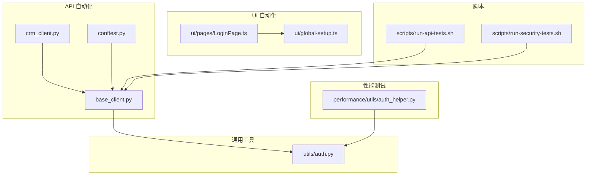
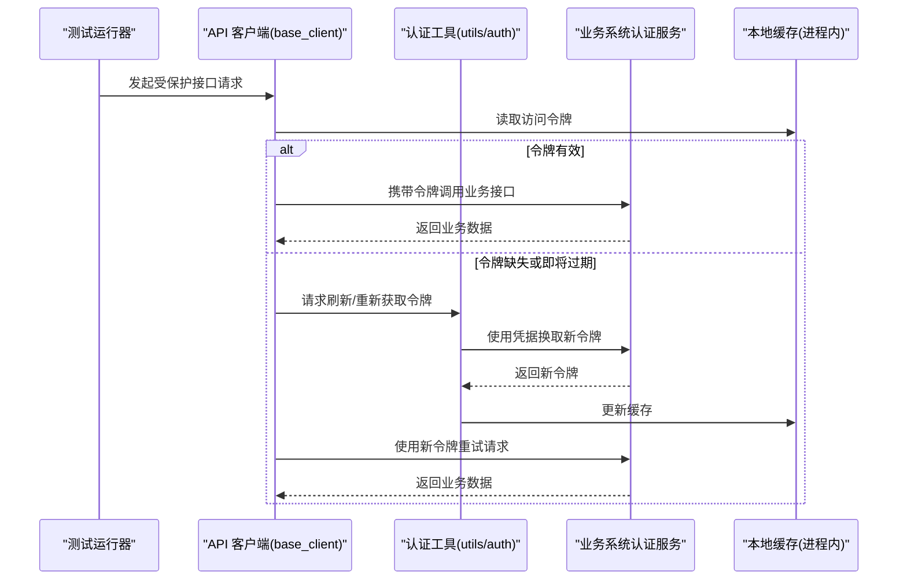
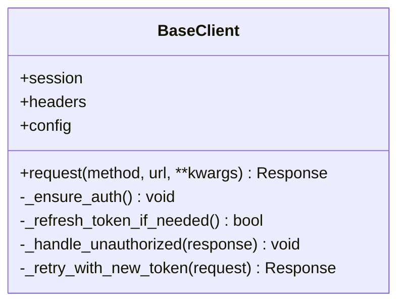
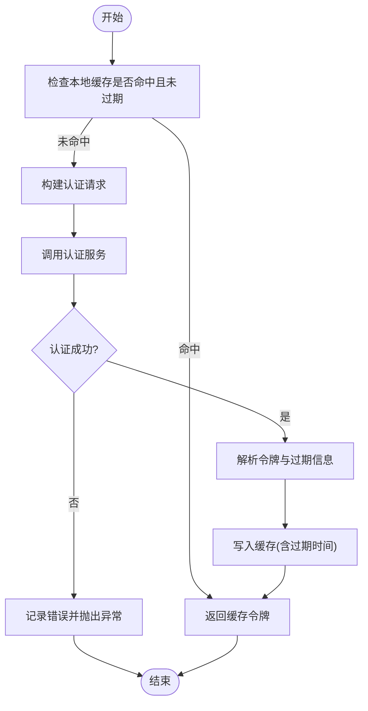
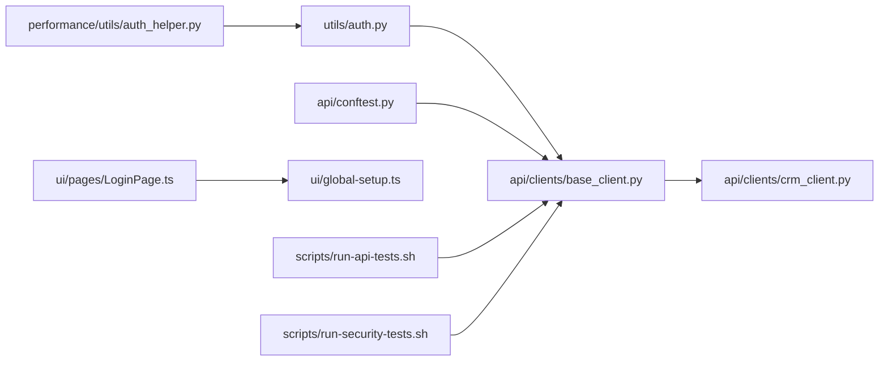

# 认证管理机制

<cite>
**本文引用的文件**   
- [tests/api/clients/base_client.py](file://tests/api/clients/base_client.py)
- [tests/api/clients/crm_client.py](file://tests/api/clients/crm_client.py)
- [tests/api/conftest.py](file://tests/api/conftest.py)
- [tests/utils/auth.py](file://tests/utils/auth.py)
- [tests/performance/utils/auth_helper.py](file://tests/performance/utils/auth_helper.py)
- [tests/ui/pages/LoginPage.ts](file://tests/ui/pages/LoginPage.ts)
- [tests/ui/global-setup.ts](file://tests/ui/global-setup.ts)
- [scripts/run-api-tests.sh](file://scripts/run-api-tests.sh)
- [scripts/run-security-tests.sh](file://scripts/run-security-tests.sh)
</cite>

## 目录
1. [简介](#简介)
2. [项目结构](#项目结构)
3. [核心组件](#核心组件)
4. [架构总览](#架构总览)
5. [详细组件分析](#详细组件分析)
6. [依赖关系分析](#依赖关系分析)
7. [性能考量](#性能考量)
8. [故障排查指南](#故障排查指南)
9. [结论](#结论)
10. [附录](#附录)

## 简介
本技术文档聚焦于 AutoTest Hub 的 API 认证管理机制，围绕 JWT 令牌的生成、刷新与缓存策略展开，说明多用户认证支持、权限验证与会话管理在测试框架中的实现模式。文档同时覆盖安全令牌生命周期管理、过期处理与自动刷新机制，提供在测试中模拟不同用户角色与权限场景的具体流程示例，并给出安全最佳实践、令牌泄露防护与调试技巧，以及与业务系统认证集成和异常处理的建议。

## 项目结构
认证相关能力分布在以下位置：
- API 客户端层：封装请求头注入、会话状态与基础认证逻辑
- 通用工具层：提供统一的认证辅助方法（如获取/刷新令牌）
- 性能测试工具：为压测场景提供轻量认证辅助
- UI 自动化：登录页面与全局初始化脚本用于端到端认证流程
- 脚本层：统一入口脚本负责环境准备与运行参数传递

图表来源
- [tests/api/clients/base_client.py](file://tests/api/clients/base_client.py)
- [tests/api/clients/crm_client.py](file://tests/api/clients/crm_client.py)
- [tests/api/conftest.py](file://tests/api/conftest.py)
- [tests/utils/auth.py](file://tests/utils/auth.py)
- [tests/performance/utils/auth_helper.py](file://tests/performance/utils/auth_helper.py)
- [tests/ui/pages/LoginPage.ts](file://tests/ui/pages/LoginPage.ts)
- [tests/ui/global-setup.ts](file://tests/ui/global-setup.ts)
- [scripts/run-api-tests.sh](file://scripts/run-api-tests.sh)
- [scripts/run-security-tests.sh](file://scripts/run-security-tests.sh)

章节来源
- [tests/api/clients/base_client.py](file://tests/api/clients/base_client.py)
- [tests/api/clients/crm_client.py](file://tests/api/clients/crm_client.py)
- [tests/api/conftest.py](file://tests/api/conftest.py)
- [tests/utils/auth.py](file://tests/utils/auth.py)
- [tests/performance/utils/auth_helper.py](file://tests/performance/utils/auth_helper.py)
- [tests/ui/pages/LoginPage.ts](file://tests/ui/pages/LoginPage.ts)
- [tests/ui/global-setup.ts](file://tests/ui/global-setup.ts)
- [scripts/run-api-tests.sh](file://scripts/run-api-tests.sh)
- [scripts/run-security-tests.sh](file://scripts/run-security-tests.sh)

## 核心组件
- 基础 API 客户端：集中管理 HTTP 会话、请求拦截、响应校验与错误分类；在请求前注入认证头，并在需要时触发令牌刷新或重试。
- 认证工具模块：封装获取/刷新令牌的通用流程，包括凭据组装、网络调用、结果解析与本地缓存写入。
- 性能测试认证助手：面向高并发场景的轻量认证辅助，减少重复登录开销。
- UI 登录页与全局初始化：通过浏览器上下文完成登录并持久化会话，便于后续页面操作。
- 统一运行脚本：设置环境变量、选择测试套件与并行度，确保认证所需配置一致。

章节来源
- [tests/api/clients/base_client.py](file://tests/api/clients/base_client.py)
- [tests/utils/auth.py](file://tests/utils/auth.py)
- [tests/performance/utils/auth_helper.py](file://tests/performance/utils/auth_helper.py)
- [tests/ui/pages/LoginPage.ts](file://tests/ui/pages/LoginPage.ts)
- [tests/ui/global-setup.ts](file://tests/ui/global-setup.ts)
- [scripts/run-api-tests.sh](file://scripts/run-api-tests.sh)

## 架构总览
下图展示了从测试执行到业务系统的认证交互路径，以及令牌在客户端侧的缓存与刷新流程。

图表来源
- [tests/api/clients/base_client.py](file://tests/api/clients/base_client.py)
- [tests/utils/auth.py](file://tests/utils/auth.py)

## 详细组件分析

### 基础 API 客户端（base_client）
职责与要点
- 会话与连接池：复用连接，降低握手成本。
- 请求拦截：在发送前注入认证头，必要时附加租户/组织标识。
- 响应处理：统一解析成功/失败，记录日志与指标。
- 错误分类：区分未认证、权限不足、服务端错误等，驱动重试或降级。
- 令牌刷新：当检测到未认证或令牌过期时，触发刷新并重试一次。
- 多用户支持：基于上下文切换当前用户凭据与令牌缓存键。

关键流程（类图）

图表来源
- [tests/api/clients/base_client.py](file://tests/api/clients/base_client.py)

章节来源
- [tests/api/clients/base_client.py](file://tests/api/clients/base_client.py)

### 认证工具（utils/auth）
职责与要点
- 统一凭据模型：用户名/密码、应用密钥、多租户标识等。
- 令牌获取：封装登录接口调用，解析返回结构，提取访问令牌与可选刷新令牌。
- 令牌刷新：使用刷新令牌换取新的访问令牌，处理刷新失败与回退策略。
- 缓存策略：按用户维度缓存令牌及过期时间，避免重复登录。
- 并发安全：在高并发下保证同一用户只进行一次令牌刷新。

关键流程（流程图）

图表来源
- [tests/utils/auth.py](file://tests/utils/auth.py)

章节来源
- [tests/utils/auth.py](file://tests/utils/auth.py)

### 性能测试认证助手（performance/utils/auth_helper）
职责与要点
- 轻量级认证：减少对象创建与额外依赖，适合高并发场景。
- 共享令牌：在进程内共享令牌，避免每个协程重复登录。
- 快速失败：对认证失败进行快速短路，提升整体吞吐稳定性。

章节来源
- [tests/performance/utils/auth_helper.py](file://tests/performance/utils/auth_helper.py)

### UI 自动化认证（LoginPage 与 global-setup）
职责与要点
- 登录页交互：输入凭据并提交，等待跳转或提示成功。
- 全局初始化：在浏览器上下文中完成登录并保存会话，供后续用例复用。
- 跨页面复用：通过持久化会话避免每次打开页面都重新登录。

章节来源
- [tests/ui/pages/LoginPage.ts](file://tests/ui/pages/LoginPage.ts)
- [tests/ui/global-setup.ts](file://tests/ui/global-setup.ts)

### 运行脚本（run-api-tests.sh / run-security-tests.sh）
职责与要点
- 环境变量注入：将认证所需的基地址、超时、重试次数等传入测试进程。
- 套件选择：按功能域或安全扫描维度选择测试集。
- 并行控制：限制并发数以避免认证服务过载。

章节来源
- [scripts/run-api-tests.sh](file://scripts/run-api-tests.sh)
- [scripts/run-security-tests.sh](file://scripts/run-security-tests.sh)

## 依赖关系分析
- base_client 依赖 auth 工具以获取/刷新令牌，并在未认证时触发刷新与重试。
- crm_client 继承或组合 base_client，复用认证能力并扩展 CRM 领域逻辑。
- conftest 在测试启动阶段初始化客户端实例与全局配置。
- 性能测试与 UI 自动化分别在不同运行时环境中复用认证能力。

图表来源
- [tests/api/clients/base_client.py](file://tests/api/clients/base_client.py)
- [tests/api/clients/crm_client.py](file://tests/api/clients/crm_client.py)
- [tests/api/conftest.py](file://tests/api/conftest.py)
- [tests/utils/auth.py](file://tests/utils/auth.py)
- [tests/performance/utils/auth_helper.py](file://tests/performance/utils/auth_helper.py)
- [tests/ui/pages/LoginPage.ts](file://tests/ui/pages/LoginPage.ts)
- [tests/ui/global-setup.ts](file://tests/ui/global-setup.ts)
- [scripts/run-api-tests.sh](file://scripts/run-api-tests.sh)
- [scripts/run-security-tests.sh](file://scripts/run-security-tests.sh)

章节来源
- [tests/api/clients/base_client.py](file://tests/api/clients/base_client.py)
- [tests/api/clients/crm_client.py](file://tests/api/clients/crm_client.py)
- [tests/api/conftest.py](file://tests/api/conftest.py)
- [tests/utils/auth.py](file://tests/utils/auth.py)
- [tests/performance/utils/auth_helper.py](file://tests/performance/utils/auth_helper.py)
- [tests/ui/pages/LoginPage.ts](file://tests/ui/pages/LoginPage.ts)
- [tests/ui/global-setup.ts](file://tests/ui/global-setup.ts)
- [scripts/run-api-tests.sh](file://scripts/run-api-tests.sh)
- [scripts/run-security-tests.sh](file://scripts/run-security-tests.sh)

## 性能考量
- 令牌缓存命中率：优先命中进程内缓存，减少认证往返。
- 刷新去重：同一用户并发刷新需加锁或原子操作，避免风暴。
- 连接复用：HTTP 连接池与 Keep-Alive 可降低握手开销。
- 幂等重试：仅对幂等接口进行有限次数的自动重试，避免放大负载。
- 限流与退避：对认证接口实施指数退避与最大重试上限。

[本节为通用指导，无需代码来源]

## 故障排查指南
常见问题与定位步骤
- 未认证/令牌过期：检查客户端是否在请求前注入认证头；确认缓存键是否按用户隔离；查看刷新触发条件与重试逻辑。
- 刷新失败：核对刷新凭据与服务器返回结构；增加认证链路日志；确认刷新令牌有效期与轮换策略。
- 权限不足：确认当前用户角色与资源权限映射；检查租户/组织标识是否正确注入。
- 并发问题：观察是否存在重复刷新或令牌竞争；评估是否需要引入分布式锁或外部缓存。
- UI 登录异常：检查全局初始化是否成功保存会话；确认页面元素加载与等待策略。

章节来源
- [tests/api/clients/base_client.py](file://tests/api/clients/base_client.py)
- [tests/utils/auth.py](file://tests/utils/auth.py)
- [tests/ui/global-setup.ts](file://tests/ui/global-setup.ts)

## 结论
AutoTest Hub 的认证管理机制以“客户端拦截 + 工具封装 + 进程内缓存”为核心，实现了稳定的令牌获取、刷新与复用。通过多用户隔离与幂等重试，系统在功能与安全测试场景中具备良好可扩展性与鲁棒性。结合 UI 自动化与性能测试的专用辅助，可覆盖端到端与高并发场景的认证需求。

[本节为总结性内容，无需代码来源]

## 附录

### 安全最佳实践
- 最小权限原则：为测试账号分配最小必要权限。
- 令牌存储：仅在内存或受控临时文件中缓存，避免落盘明文。
- 传输安全：强制 HTTPS，校验证书与主机名。
- 泄漏防护：禁止在日志中输出完整令牌；脱敏敏感字段。
- 刷新策略：短 TTL 访问令牌配合长 TTL 刷新令牌，定期轮换。
- 审计与告警：记录认证失败与异常行为，设置阈值告警。

[本节为通用指导，无需代码来源]

### 调试技巧
- 开启详细日志：记录请求头、响应码与错误堆栈（脱敏）。
- 断点与单测：针对认证工具与客户端拦截点进行单元测试。
- 抓包与回放：使用代理工具捕获认证流量，构造最小复现用例。
- 环境隔离：为不同角色与环境准备独立凭据与域名。

[本节为通用指导，无需代码来源]

### 认证流程示例（测试视角）
- 单用户正常流程：初始化客户端 -> 读取缓存令牌 -> 调用业务接口 -> 成功返回。
- 令牌过期自动刷新：收到未认证响应 -> 触发刷新 -> 更新缓存 -> 重试原请求 -> 成功返回。
- 多用户并发：按用户维度隔离缓存键 -> 并发刷新去重 -> 各自持有独立令牌。
- 权限场景：切换用户角色 -> 访问受限资源 -> 返回权限不足 -> 断言预期错误码。

[本节为概念性流程，无需代码来源]