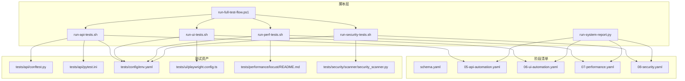
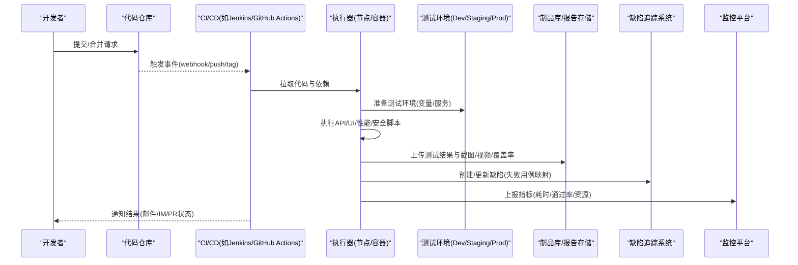
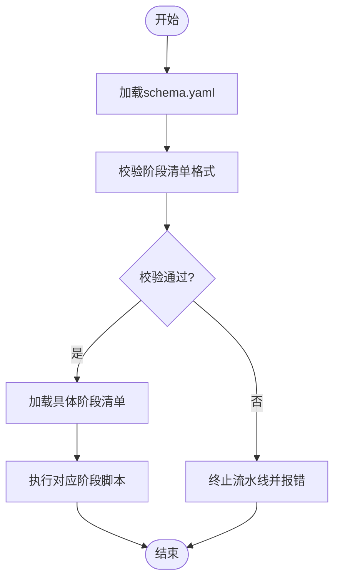
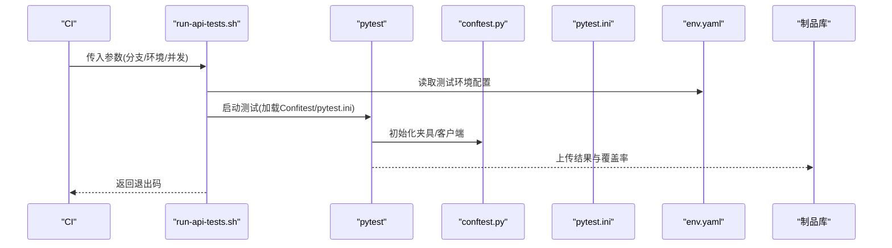
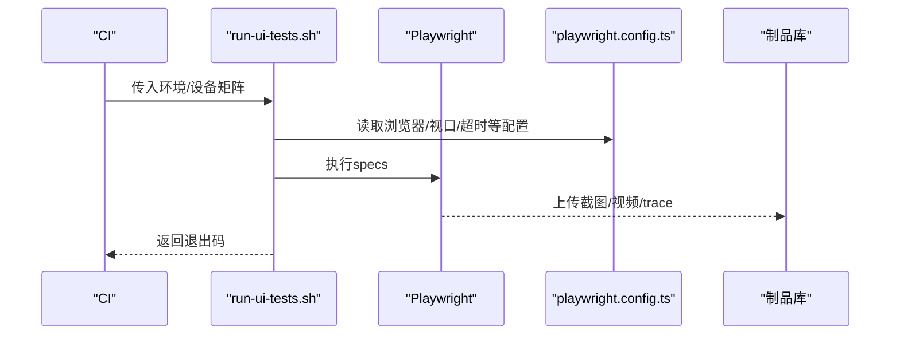
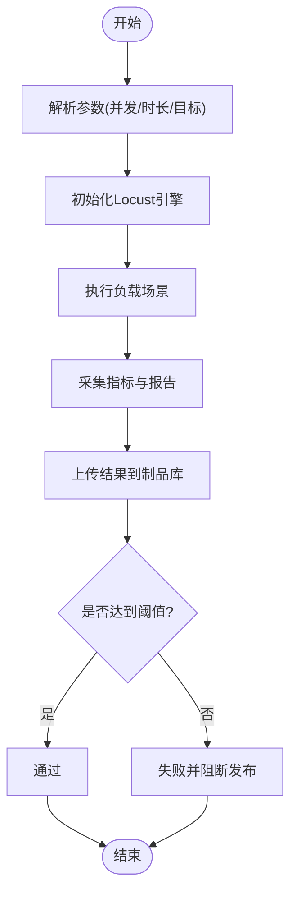
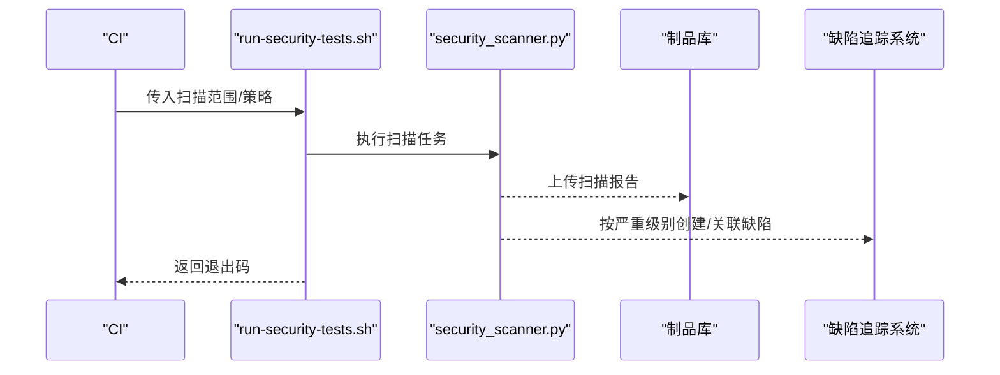
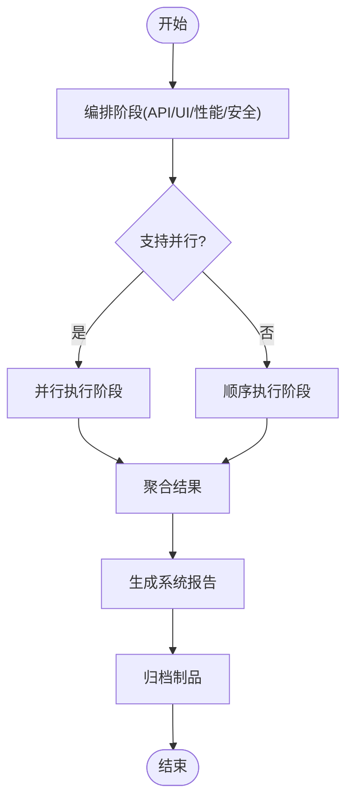
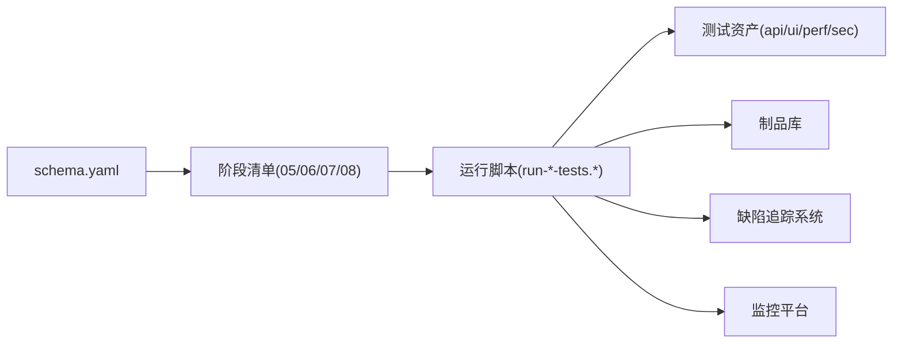

# CI/CD集成

<cite>
**本文引用的文件**   
- [scripts/run-api-tests.sh](file://scripts/run-api-tests.sh)
- [scripts/run-ui-tests.sh](file://scripts/run-ui-tests.sh)
- [scripts/run-perf-tests.sh](file://scripts/run-perf-tests.sh)
- [scripts/run-security-tests.sh](file://scripts/run-security-tests.sh)
- [scripts/run-full-test-flow.ps1](file://scripts/run-full-test-flow.ps1)
- [scripts/run-system-report.py](file://scripts/run-system-report.py)
- [stage-manifests/schema.yaml](file://stage-manifests/schema.yaml)
- [stage-manifests/05-api-automation.yaml](file://stage-manifests/05-api-automation.yaml)
- [stage-manifests/06-ui-automation.yaml](file://stage-manifests/06-ui-automation.yaml)
- [stage-manifests/07-performance.yaml](file://stage-manifests/07-performance.yaml)
- [stage-manifests/08-security.yaml](file://stage-manifests/08-security.yaml)
- [tests/api/conftest.py](file://tests/api/conftest.py)
- [tests/api/pytest.ini](file://tests/api/pytest.ini)
- [tests/config/env.yaml](file://tests/config/env.yaml)
- [tests/ui/playwright.config.ts](file://tests/ui/playwright.config.ts)
- [tests/performance/locust/README.md](file://tests/performance/locust/README.md)
- [tests/security/scanner/security_scanner.py](file://tests/security/scanner/security_scanner.py)
</cite>

## 目录
1. [简介](#简介)
2. [项目结构](#项目结构)
3. [核心组件](#核心组件)
4. [架构总览](#架构总览)
5. [详细组件分析](#详细组件分析)
6. [依赖分析](#依赖分析)
7. [性能考虑](#性能考虑)
8. [故障排查指南](#故障排查指南)
9. [结论](#结论)
10. [附录](#附录)

## 简介
本技术文档面向AutoTest Hub的CI/CD集成，目标是在Jenkins、GitHub Actions等主流平台中落地测试自动化流水线。文档覆盖以下主题：
- 流水线配置最佳实践：构建触发、并行执行、结果反馈与质量门禁
- 多环境部署策略与测试环境管理
- 容器化部署与Docker镜像构建指南
- 与缺陷追踪系统与监控平台的集成方案
- 故障排查、性能优化与成本控制经验

## 项目结构
仓库采用“脚本+阶段清单+测试用例”的分层组织方式：
- scripts：跨平台运行脚本（API/UI/性能/安全）与系统报告生成
- stage-manifests：以YAML描述各阶段任务（API、UI、性能、安全等），并提供schema校验
- tests：按类型划分测试资产（api、ui、performance、security），并包含各自配置与数据
- docs：测试设计、用例、计划与知识沉淀

图表来源
- [scripts/run-api-tests.sh](file://scripts/run-api-tests.sh)
- [scripts/run-ui-tests.sh](file://scripts/run-ui-tests.sh)
- [scripts/run-perf-tests.sh](file://scripts/run-perf-tests.sh)
- [scripts/run-security-tests.sh](file://scripts/run-security-tests.sh)
- [scripts/run-full-test-flow.ps1](file://scripts/run-full-test-flow.ps1)
- [scripts/run-system-report.py](file://scripts/run-system-report.py)
- [stage-manifests/schema.yaml](file://stage-manifests/schema.yaml)
- [stage-manifests/05-api-automation.yaml](file://stage-manifests/05-api-automation.yaml)
- [stage-manifests/06-ui-automation.yaml](file://stage-manifests/06-ui-automation.yaml)
- [stage-manifests/07-performance.yaml](file://stage-manifests/07-performance.yaml)
- [stage-manifests/08-security.yaml](file://stage-manifests/08-security.yaml)
- [tests/api/conftest.py](file://tests/api/conftest.py)
- [tests/api/pytest.ini](file://tests/api/pytest.ini)
- [tests/config/env.yaml](file://tests/config/env.yaml)
- [tests/ui/playwright.config.ts](file://tests/ui/playwright.config.ts)
- [tests/performance/locust/README.md](file://tests/performance/locust/README.md)
- [tests/security/scanner/security_scanner.py](file://tests/security/scanner/security_scanner.py)

章节来源
- [stage-manifests/schema.yaml](file://stage-manifests/schema.yaml)
- [stage-manifests/05-api-automation.yaml](file://stage-manifests/05-api-automation.yaml)
- [stage-manifests/06-ui-automation.yaml](file://stage-manifests/06-ui-automation.yaml)
- [stage-manifests/07-performance.yaml](file://stage-manifests/07-performance.yaml)
- [stage-manifests/08-security.yaml](file://stage-manifests/08-security.yaml)
- [scripts/run-api-tests.sh](file://scripts/run-api-tests.sh)
- [scripts/run-ui-tests.sh](file://scripts/run-ui-tests.sh)
- [scripts/run-perf-tests.sh](file://scripts/run-perf-tests.sh)
- [scripts/run-security-tests.sh](file://scripts/run-security-tests.sh)
- [scripts/run-full-test-flow.ps1](file://scripts/run-full-test-flow.ps1)
- [scripts/run-system-report.py](file://scripts/run-system-report.py)
- [tests/api/conftest.py](file://tests/api/conftest.py)
- [tests/api/pytest.ini](file://tests/api/pytest.ini)
- [tests/config/env.yaml](file://tests/config/env.yaml)
- [tests/ui/playwright.config.ts](file://tests/ui/playwright.config.ts)
- [tests/performance/locust/README.md](file://tests/performance/locust/README.md)
- [tests/security/scanner/security_scanner.py](file://tests/security/scanner/security_scanner.py)

## 核心组件
- 阶段清单（stage-manifests）
  - schema.yaml：定义阶段清单的结构约束，用于在CI中校验配置正确性
  - 05-api-automation.yaml、06-ui-automation.yaml、07-performance.yaml、08-security.yaml：分别描述API、UI、性能、安全阶段的参数、环境与产物
- 运行脚本（scripts）
  - run-api-tests.sh / run-ui-tests.sh / run-perf-tests.sh / run-security-tests.sh：封装各类测试的执行入口，统一参数与环境注入
  - run-full-test-flow.ps1：编排端到端流程，串联API/UI/性能/安全阶段
  - run-system-report.py：汇总各阶段产物，生成系统级报告
- 测试资产（tests）
  - API：conftest.py、pytest.ini、env.yaml
  - UI：playwright.config.ts
  - 性能：locust/README.md
  - 安全：scanner/security_scanner.py

章节来源
- [stage-manifests/schema.yaml](file://stage-manifests/schema.yaml)
- [stage-manifests/05-api-automation.yaml](file://stage-manifests/05-api-automation.yaml)
- [stage-manifests/06-ui-automation.yaml](file://stage-manifests/06-ui-automation.yaml)
- [stage-manifests/07-performance.yaml](file://stage-manifests/07-performance.yaml)
- [stage-manifests/08-security.yaml](file://stage-manifests/08-security.yaml)
- [scripts/run-api-tests.sh](file://scripts/run-api-tests.sh)
- [scripts/run-ui-tests.sh](file://scripts/run-ui-tests.sh)
- [scripts/run-perf-tests.sh](file://scripts/run-perf-tests.sh)
- [scripts/run-security-tests.sh](file://scripts/run-security-tests.sh)
- [scripts/run-full-test-flow.ps1](file://scripts/run-full-test-flow.ps1)
- [scripts/run-system-report.py](file://scripts/run-system-report.py)
- [tests/api/conftest.py](file://tests/api/conftest.py)
- [tests/api/pytest.ini](file://tests/api/pytest.ini)
- [tests/config/env.yaml](file://tests/config/env.yaml)
- [tests/ui/playwright.config.ts](file://tests/ui/playwright.config.ts)
- [tests/performance/locust/README.md](file://tests/performance/locust/README.md)
- [tests/security/scanner/security_scanner.py](file://tests/security/scanner/security_scanner.py)

## 架构总览
下图展示从代码变更到质量门禁与报告产物的端到端流程，以及多环境管理与容器化产物归档。

图表来源
- [scripts/run-api-tests.sh](file://scripts/run-api-tests.sh)
- [scripts/run-ui-tests.sh](file://scripts/run-ui-tests.sh)
- [scripts/run-perf-tests.sh](file://scripts/run-perf-tests.sh)
- [scripts/run-security-tests.sh](file://scripts/run-security-tests.sh)
- [scripts/run-system-report.py](file://scripts/run-system-report.py)
- [stage-manifests/05-api-automation.yaml](file://stage-manifests/05-api-automation.yaml)
- [stage-manifests/06-ui-automation.yaml](file://stage-manifests/06-ui-automation.yaml)
- [stage-manifests/07-performance.yaml](file://stage-manifests/07-performance.yaml)
- [stage-manifests/08-security.yaml](file://stage-manifests/08-security.yaml)

## 详细组件分析

### 阶段清单与校验
- schema.yaml提供阶段清单的结构约束，建议在CI中优先执行校验，避免错误配置进入流水线
- 各阶段yaml文件集中声明参数、环境变量、依赖与服务地址，便于在多环境中复用

图表来源
- [stage-manifests/schema.yaml](file://stage-manifests/schema.yaml)
- [stage-manifests/05-api-automation.yaml](file://stage-manifests/05-api-automation.yaml)
- [stage-manifests/06-ui-automation.yaml](file://stage-manifests/06-ui-automation.yaml)
- [stage-manifests/07-performance.yaml](file://stage-manifests/07-performance.yaml)
- [stage-manifests/08-security.yaml](file://stage-manifests/08-security.yaml)

章节来源
- [stage-manifests/schema.yaml](file://stage-manifests/schema.yaml)
- [stage-manifests/05-api-automation.yaml](file://stage-manifests/05-api-automation.yaml)
- [stage-manifests/06-ui-automation.yaml](file://stage-manifests/06-ui-automation.yaml)
- [stage-manifests/07-performance.yaml](file://stage-manifests/07-performance.yaml)
- [stage-manifests/08-security.yaml](file://stage-manifests/08-security.yaml)

### API自动化阶段
- 入口脚本：run-api-tests.sh
- 关键配置：tests/api/conftest.py、tests/api/pytest.ini、tests/config/env.yaml
- 典型流程：读取env.yaml中的API基础地址与认证信息，初始化客户端，执行用例集，产出JUnit/HTML/覆盖率等产物

图表来源
- [scripts/run-api-tests.sh](file://scripts/run-api-tests.sh)
- [tests/api/conftest.py](file://tests/api/conftest.py)
- [tests/api/pytest.ini](file://tests/api/pytest.ini)
- [tests/config/env.yaml](file://tests/config/env.yaml)

章节来源
- [scripts/run-api-tests.sh](file://scripts/run-api-tests.sh)
- [tests/api/conftest.py](file://tests/api/conftest.py)
- [tests/api/pytest.ini](file://tests/api/pytest.ini)
- [tests/config/env.yaml](file://tests/config/env.yaml)

### UI自动化阶段
- 入口脚本：run-ui-tests.sh
- 关键配置：tests/ui/playwright.config.ts
- 典型流程：根据环境选择浏览器与视口，执行spec用例，收集截图/视频/trace，上传至制品库

图表来源
- [scripts/run-ui-tests.sh](file://scripts/run-ui-tests.sh)
- [tests/ui/playwright.config.ts](file://tests/ui/playwright.config.ts)

章节来源
- [scripts/run-ui-tests.sh](file://scripts/run-ui-tests.sh)
- [tests/ui/playwright.config.ts](file://tests/ui/playwright.config.ts)

### 性能测试阶段
- 入口脚本：run-perf-tests.sh
- 参考说明：tests/performance/locust/README.md
- 典型流程：基于配置文件或命令行参数设定并发与持续时间，执行Locust场景，输出统计与报告

图表来源
- [scripts/run-perf-tests.sh](file://scripts/run-perf-tests.sh)
- [tests/performance/locust/README.md](file://tests/performance/locust/README.md)

章节来源
- [scripts/run-perf-tests.sh](file://scripts/run-perf-tests.sh)
- [tests/performance/locust/README.md](file://tests/performance/locust/README.md)

### 安全扫描阶段
- 入口脚本：run-security-tests.sh
- 扫描实现：tests/security/scanner/security_scanner.py
- 典型流程：根据清单或规则扫描依赖/代码/配置，输出漏洞列表与严重级别，必要时创建缺陷单

图表来源
- [scripts/run-security-tests.sh](file://scripts/run-security-tests.sh)
- [tests/security/scanner/security_scanner.py](file://tests/security/scanner/security_scanner.py)

章节来源
- [scripts/run-security-tests.sh](file://scripts/run-security-tests.sh)
- [tests/security/scanner/security_scanner.py](file://tests/security/scanner/security_scanner.py)

### 全链路编排与系统报告
- 编排脚本：scripts/run-full-test-flow.ps1
- 报告聚合：scripts/run-system-report.py
- 典型流程：顺序或并行调用API/UI/性能/安全脚本，汇总产物，生成系统级报告并归档

图表来源
- [scripts/run-full-test-flow.ps1](file://scripts/run-full-test-flow.ps1)
- [scripts/run-system-report.py](file://scripts/run-system-report.py)

章节来源
- [scripts/run-full-test-flow.ps1](file://scripts/run-full-test-flow.ps1)
- [scripts/run-system-report.py](file://scripts/run-system-report.py)

## 依赖分析
- 阶段清单与脚本耦合关系
  - 每个阶段yaml文件对应一个运行脚本，形成“配置即契约”的解耦模式
- 测试资产与脚本耦合关系
  - API阶段依赖conftest.py与pytest.ini；UI阶段依赖playwright.config.ts；性能与安全阶段分别依赖各自工具链
- 外部系统集成点
  - 制品库：上传测试结果、截图、视频、覆盖率、扫描报告
  - 缺陷追踪：将失败用例与漏洞映射为缺陷
  - 监控平台：上报流水线耗时、通过率、资源使用率等指标

图表来源
- [stage-manifests/schema.yaml](file://stage-manifests/schema.yaml)
- [stage-manifests/05-api-automation.yaml](file://stage-manifests/05-api-automation.yaml)
- [stage-manifests/06-ui-automation.yaml](file://stage-manifests/06-ui-automation.yaml)
- [stage-manifests/07-performance.yaml](file://stage-manifests/07-performance.yaml)
- [stage-manifests/08-security.yaml](file://stage-manifests/08-security.yaml)
- [scripts/run-api-tests.sh](file://scripts/run-api-tests.sh)
- [scripts/run-ui-tests.sh](file://scripts/run-ui-tests.sh)
- [scripts/run-perf-tests.sh](file://scripts/run-perf-tests.sh)
- [scripts/run-security-tests.sh](file://scripts/run-security-tests.sh)

章节来源
- [stage-manifests/schema.yaml](file://stage-manifests/schema.yaml)
- [stage-manifests/05-api-automation.yaml](file://stage-manifests/05-api-automation.yaml)
- [stage-manifests/06-ui-automation.yaml](file://stage-manifests/06-ui-automation.yaml)
- [stage-manifests/07-performance.yaml](file://stage-manifests/07-performance.yaml)
- [stage-manifests/08-security.yaml](file://stage-manifests/08-security.yaml)
- [scripts/run-api-tests.sh](file://scripts/run-api-tests.sh)
- [scripts/run-ui-tests.sh](file://scripts/run-ui-tests.sh)
- [scripts/run-perf-tests.sh](file://scripts/run-perf-tests.sh)
- [scripts/run-security-tests.sh](file://scripts/run-security-tests.sh)

## 性能考虑
- 并行与隔离
  - 将API、UI、性能、安全阶段并行执行，减少整体耗时；为UI阶段分配独立工作节点以避免资源争用
- 缓存与复用
  - 缓存Python/Node依赖与浏览器二进制，缩短冷启动时间
- 资源配额与限流
  - 对性能测试设置并发上限与超时，防止拖垮共享节点
- 产物压缩与清理
  - 仅保留必要产物，定期清理历史工件，降低存储成本

[本节为通用指导，不直接分析具体文件]

## 故障排查指南
- 常见失败定位
  - 网络与依赖：检查env.yaml中的服务地址与凭据是否正确
  - 浏览器环境：确认Playwright浏览器安装与版本匹配
  - 性能基线：对比历史报告，识别回归趋势
  - 安全漏洞：依据严重级别制定修复优先级
- 日志与产物
  - 查看各阶段脚本输出与制品库中的报告、截图、视频、trace
- 快速恢复
  - 回滚到上一个稳定分支或标签；临时放宽门禁阈值并记录风险

章节来源
- [tests/config/env.yaml](file://tests/config/env.yaml)
- [tests/ui/playwright.config.ts](file://tests/ui/playwright.config.ts)
- [tests/performance/locust/README.md](file://tests/performance/locust/README.md)
- [tests/security/scanner/security_scanner.py](file://tests/security/scanner/security_scanner.py)

## 结论
通过将阶段清单与运行脚本解耦，并结合制品库、缺陷追踪与监控平台，AutoTest Hub可在Jenkins与GitHub Actions等平台实现可重复、可观测、可治理的CI/CD流水线。建议持续完善质量门禁与多环境策略，逐步提升交付效率与质量稳定性。

[本节为总结性内容，不直接分析具体文件]

## 附录

### Jenkins流水线最佳实践
- 触发策略
  - 推送分支触发开发验证；打标签触发发布候选；定时触发回归
- 并行执行
  - 使用并行阶段执行API/UI/性能/安全；UI阶段单独分配节点
- 结果反馈
  - 将JUnit/HTML/覆盖率/扫描报告持久化；失败时发送通知
- 质量门禁
  - 基于通过率、性能阈值、安全漏洞严重级别设置阻断条件
- 多环境管理
  - 通过环境变量区分Dev/Staging/Prod；敏感信息使用凭据管理
- 容器化
  - 使用固定版本的Python/Node/浏览器镜像；将依赖预装进镜像
- 制品与归档
  - 统一命名规范；保留最近N次构建产物
- 与外部系统集成
  - 缺陷追踪：失败用例自动创建/关联缺陷
  - 监控平台：上报流水线耗时、通过率、资源使用率

[本节为通用指导，不直接分析具体文件]

### GitHub Actions流水线最佳实践
- 触发策略
  - push/merge_request/tag事件驱动；workflow_dispatch用于手动触发
- 并行执行
  - 使用jobs矩阵并行执行不同阶段；UI阶段使用专用runner
- 结果反馈
  - 使用actions/upload-artifact保存报告与媒体文件；失败时发送Webhook
- 质量门禁
  - 在步骤中设置fail-fast与条件判断，结合阈值进行阻断
- 多环境管理
  - 使用environments与secrets管理不同环境的凭据与URL
- 容器化
  - 使用docker/build-push-action构建镜像；缓存依赖层
- 制品与归档
  - 使用artifact与release功能归档产物
- 与外部系统集成
  - 通过HTTP请求或官方Action对接缺陷追踪与监控平台

[本节为通用指导，不直接分析具体文件]

### 多环境部署策略与测试环境管理
- 环境分层
  - Dev：快速迭代，最小门禁；Staging：接近生产，完整门禁；Prod：严格门禁与灰度
- 配置管理
  - 使用env.yaml与CI Secrets分离配置与凭据；按环境注入
- 服务编排
  - 使用容器编排启动被测服务与依赖（数据库、消息队列等）
- 数据准备
  - 使用种子数据与快照，保证可重复性
- 清理与回收
  - 每次构建后清理临时资源，避免污染后续执行

[本节为通用指导，不直接分析具体文件]

### 容器化部署与Docker镜像构建指南
- 基础镜像
  - 选择轻量且稳定的基础镜像（如Python/Node LTS）
- 依赖安装
  - 分阶段安装依赖，利用缓存层加速构建
- 浏览器与工具
  - 预装Playwright浏览器与CLI工具，避免运行时下载
- 构建与推送
  - 使用多阶段构建减小镜像体积；推送至私有镜像仓库
- 运行策略
  - 只读文件系统、非root用户、健康检查探针

[本节为通用指导，不直接分析具体文件]

### 与缺陷追踪系统和监控平台的集成方案
- 缺陷追踪
  - 将失败用例标题、链接、截图与日志作为附件创建缺陷；支持批量创建与去重
- 监控平台
  - 上报指标：构建耗时、通过率、失败分布、性能指标、资源消耗
  - 告警策略：阈值异常与趋势异常双通道告警
- 可视化看板
  - 聚合各阶段报告，提供趋势分析与根因定位入口

[本节为通用指导，不直接分析具体文件]