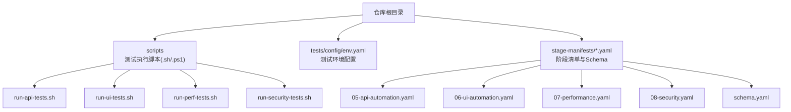
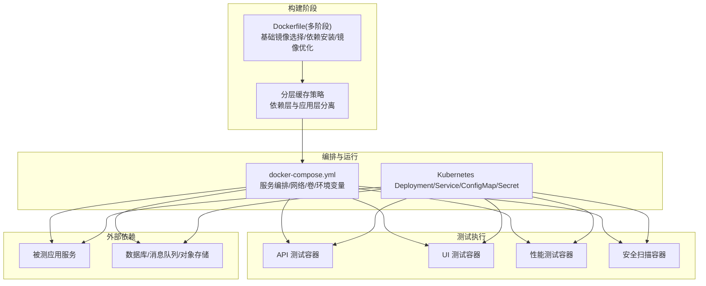
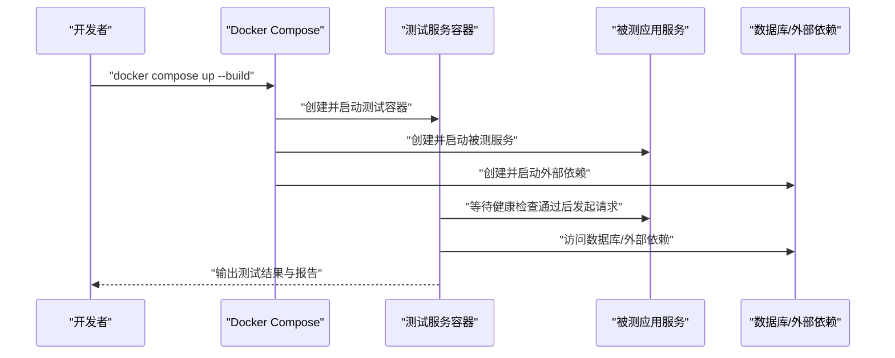
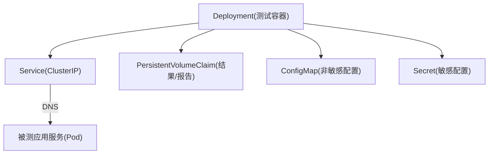
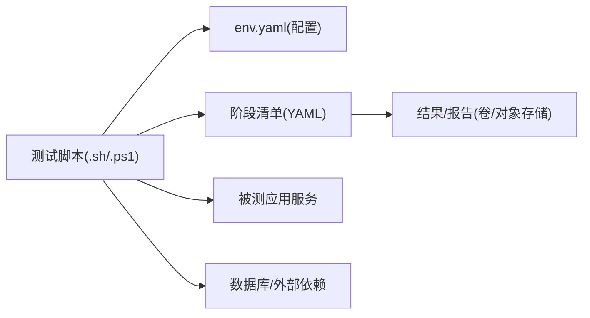

# 容器化部署

<cite>
**本文引用的文件**   
- [scripts/run-api-tests.sh](file://scripts/run-api-tests.sh)
- [scripts/run-ui-tests.sh](file://scripts/run-ui-tests.sh)
- [scripts/run-perf-tests.sh](file://scripts/run-perf-tests.sh)
- [scripts/run-security-tests.sh](file://scripts/run-security-tests.sh)
- [tests/config/env.yaml](file://tests/config/env.yaml)
- [stage-manifests/05-api-automation.yaml](file://stage-manifests/05-api-automation.yaml)
- [stage-manifests/06-ui-automation.yaml](file://stage-manifests/06-ui-automation.yaml)
- [stage-manifests/07-performance.yaml](file://stage-manifests/07-performance.yaml)
- [stage-manifests/08-security.yaml](file://stage-manifests/08-security.yaml)
- [stage-manifests/schema.yaml](file://stage-manifests/schema.yaml)
</cite>

## 目录
1. [简介](#简介)
2. [项目结构](#项目结构)
3. [核心组件](#核心组件)
4. [架构总览](#架构总览)
5. [详细组件分析](#详细组件分析)
6. [依赖分析](#依赖分析)
7. [性能考虑](#性能考虑)
8. [故障排查指南](#故障排查指南)
9. [结论](#结论)
10. [附录](#附录)

## 简介
本技术文档面向AutoTest Hub的容器化部署，目标是提供一套可复用的镜像构建策略、多阶段构建与分层缓存最佳实践、Docker Compose编排方案、Kubernetes部署与服务发现配置、容器网络与存储卷挂载、资源限制设置，以及与云平台的集成和成本优化建议。文档基于仓库中现有的测试脚本与阶段清单进行系统化梳理，帮助读者在本地与云端快速搭建一致的测试环境。

## 项目结构
从仓库结构看，本项目包含：
- 测试执行脚本：位于 scripts 目录，提供 API、UI、性能、安全等测试类型的运行入口（含 .sh 与 .ps1 版本）。
- 测试配置：tests/config/env.yaml 用于集中管理环境变量与测试参数。
- 阶段清单：stage-manifests 下按阶段组织 YAML 清单，涵盖 API/UI/性能/安全等自动化阶段的元数据与流程定义。

**图表来源**
- [scripts/run-api-tests.sh](file://scripts/run-api-tests.sh)
- [scripts/run-ui-tests.sh](file://scripts/run-ui-tests.sh)
- [scripts/run-perf-tests.sh](file://scripts/run-perf-tests.sh)
- [scripts/run-security-tests.sh](file://scripts/run-security-tests.sh)
- [tests/config/env.yaml](file://tests/config/env.yaml)
- [stage-manifests/05-api-automation.yaml](file://stage-manifests/05-api-automation.yaml)
- [stage-manifests/06-ui-automation.yaml](file://stage-manifests/06-ui-automation.yaml)
- [stage-manifests/07-performance.yaml](file://stage-manifests/07-performance.yaml)
- [stage-manifests/08-security.yaml](file://stage-manifests/08-security.yaml)
- [stage-manifests/schema.yaml](file://stage-manifests/schema.yaml)

**章节来源**
- [scripts/run-api-tests.sh](file://scripts/run-api-tests.sh)
- [scripts/run-ui-tests.sh](file://scripts/run-ui-tests.sh)
- [scripts/run-perf-tests.sh](file://scripts/run-perf-tests.sh)
- [scripts/run-security-tests.sh](file://scripts/run-security-tests.sh)
- [tests/config/env.yaml](file://tests/config/env.yaml)
- [stage-manifests/05-api-automation.yaml](file://stage-manifests/05-api-automation.yaml)
- [stage-manifests/06-ui-automation.yaml](file://stage-manifests/06-ui-automation.yaml)
- [stage-manifests/07-performance.yaml](file://stage-manifests/07-performance.yaml)
- [stage-manifests/08-security.yaml](file://stage-manifests/08-security.yaml)
- [stage-manifests/schema.yaml](file://stage-manifests/schema.yaml)

## 核心组件
- 测试执行脚本
  - API 测试：通过 shell 脚本统一入口，便于在容器中以命令方式触发。
  - UI 测试：提供跨平台脚本，支持在容器内启动浏览器并执行用例。
  - 性能与安全测试：分别提供专用脚本，便于按需组合到流水线或编排文件中。
- 环境配置
  - env.yaml 集中管理测试所需的环境变量与参数，利于在不同环境（开发/CI/生产）间切换。
- 阶段清单
  - stage-manifests 下的 YAML 描述各测试阶段的元数据与流程，配合 CI/CD 工具实现阶段化执行与结果收集。

**章节来源**
- [scripts/run-api-tests.sh](file://scripts/run-api-tests.sh)
- [scripts/run-ui-tests.sh](file://scripts/run-ui-tests.sh)
- [scripts/run-perf-tests.sh](file://scripts/run-perf-tests.sh)
- [scripts/run-security-tests.sh](file://scripts/run-security-tests.sh)
- [tests/config/env.yaml](file://tests/config/env.yaml)
- [stage-manifests/05-api-automation.yaml](file://stage-manifests/05-api-automation.yaml)
- [stage-manifests/06-ui-automation.yaml](file://stage-manifests/06-ui-automation.yaml)
- [stage-manifests/07-performance.yaml](file://stage-manifests/07-performance.yaml)
- [stage-manifests/08-security.yaml](file://stage-manifests/08-security.yaml)
- [stage-manifests/schema.yaml](file://stage-manifests/schema.yaml)

## 架构总览
下图展示容器化后的端到端流程：从镜像构建、Compose 编排到 Kubernetes 部署与服务发现。

[此图为概念性架构图，未直接映射具体源码文件，故不附“图表来源”]

## 详细组件分析

### 镜像构建策略与优化
- 基础镜像选择
  - 优先使用官方精简镜像（如 alpine/slim），减少攻击面与镜像体积。
  - 针对 Python/Node 等语言生态，选择带必要系统库的最小镜像，避免重复安装。
- 依赖管理与分层缓存
  - 将依赖安装步骤与应用代码复制步骤分离，利用 Docker 分层缓存加速构建。
  - 锁定依赖版本，确保构建可重现；必要时引入依赖缓存卷或远程缓存后端。
- 多阶段构建
  - 构建阶段：安装编译工具链与依赖，生成产物。
  - 运行阶段：仅拷贝运行时必需文件，进一步减小镜像体积。
- 镜像优化技巧
  - 合并 RUN 指令，减少层数。
  - 清理临时文件与包管理器缓存。
  - 使用 .dockerignore 排除无关文件。
  - 启用 BuildKit 特性（如并行构建、缓存导出）。

[本节为通用指导，不直接分析具体文件，故无“章节来源”]

### Docker Compose 编排（本地开发与测试）
- 服务定义
  - 为 API/UI/性能/安全测试分别定义服务，复用同一镜像但通过不同命令或参数区分。
- 网络配置
  - 使用默认桥接网络或自定义网络，确保测试容器与被测服务互通。
- 存储卷挂载
  - 挂载测试结果目录、报告输出目录与配置文件，便于本地查看与持久化。
- 环境变量注入
  - 通过 env_file 或 compose 中的 environment 字段注入 tests/config/env.yaml 中的关键参数。
- 健康检查与重试
  - 为被测服务添加健康检查，确保测试容器在依赖就绪后再启动。

[此图为概念性流程图，未直接映射具体源码文件，故不附“图表来源”]

**章节来源**
- [scripts/run-api-tests.sh](file://scripts/run-api-tests.sh)
- [scripts/run-ui-tests.sh](file://scripts/run-ui-tests.sh)
- [scripts/run-perf-tests.sh](file://scripts/run-perf-tests.sh)
- [scripts/run-security-tests.sh](file://scripts/run-security-tests.sh)
- [tests/config/env.yaml](file://tests/config/env.yaml)

### Kubernetes 部署与服务发现
- 部署清单
  - 使用 Deployment 管理测试容器的副本与滚动更新。
  - 使用 Service 暴露内部服务，供其他 Pod 通过 DNS 访问。
  - 使用 ConfigMap/Secret 注入配置与敏感信息。
- 服务发现
  - 通过 Service 名称作为 DNS 记录，在集群内实现稳定服务发现。
- 资源限制
  - 为每个容器设置 requests/limits，保障调度公平性与稳定性。
- 存储卷
  - 使用 PersistentVolumeClaim 挂载共享存储，持久化测试结果与报告。
- 网络策略
  - 结合 NetworkPolicy 控制 Pod 间通信，最小化权限。

[此图为概念性架构图，未直接映射具体源码文件，故不附“图表来源”]

**章节来源**
- [stage-manifests/05-api-automation.yaml](file://stage-manifests/05-api-automation.yaml)
- [stage-manifests/06-ui-automation.yaml](file://stage-manifests/06-ui-automation.yaml)
- [stage-manifests/07-performance.yaml](file://stage-manifests/07-performance.yaml)
- [stage-manifests/08-security.yaml](file://stage-manifests/08-security.yaml)
- [stage-manifests/schema.yaml](file://stage-manifests/schema.yaml)

### 容器网络配置
- 网络模式
  - 本地开发建议使用自定义桥接网络，隔离测试流量。
  - 生产环境结合 Ingress/Gateway 暴露对外接口（若需要）。
- 端口映射
  - 明确容器端口与宿主机端口映射关系，避免冲突。
- 域名解析
  - 在 Compose/K8s 中使用服务名作为主机名，简化配置。

[本节为通用指导，不直接分析具体文件，故无“章节来源”]

### 存储卷挂载
- 本地开发
  - 挂载工作目录与结果目录，便于增量构建与报告查看。
- 持续集成
  - 使用共享存储或对象存储保存测试结果与报告，便于归档与分析。
- 权限与安全
  - 合理设置卷权限，避免以 root 用户写入敏感路径。

[本节为通用指导，不直接分析具体文件，故无“章节来源”]

### 资源限制与弹性伸缩
- 资源配额
  - 设置 CPU/内存 requests/limits，防止单容器占用过多资源。
- 弹性伸缩
  - 根据负载指标（CPU/内存/自定义）自动扩缩容测试并发度。
- 优先级与抢占
  - 为关键任务设置更高优先级，保障重要测试按时执行。

[本节为通用指导，不直接分析具体文件，故无“章节来源”]

### 与云平台集成与成本优化
- 托管容器服务
  - 使用云厂商托管 Kubernetes 或 Serverless 容器服务，降低运维成本。
- 镜像仓库
  - 使用私有镜像仓库，开启镜像压缩与漏洞扫描。
- 成本优化
  - 使用 Spot/抢占式实例运行非关键测试任务。
  - 按需扩缩容，空闲时回收资源。
  - 定期清理无用镜像与日志。

[本节为通用指导，不直接分析具体文件，故无“章节来源”]

## 依赖分析
- 组件耦合
  - 测试脚本与配置解耦：通过 env.yaml 集中管理参数，脚本仅负责执行逻辑。
  - 阶段清单与执行脚本解耦：YAML 描述流程与元数据，脚本负责实际运行。
- 外部依赖
  - 被测应用服务与数据库/消息队列等外部依赖需通过服务发现与网络策略进行访问控制。
- 潜在循环依赖
  - 测试容器不应反向依赖被测服务的构建过程，保持单向调用关系。

[此图为概念性依赖图，未直接映射具体源码文件，故不附“图表来源”]

**章节来源**
- [scripts/run-api-tests.sh](file://scripts/run-api-tests.sh)
- [scripts/run-ui-tests.sh](file://scripts/run-ui-tests.sh)
- [scripts/run-perf-tests.sh](file://scripts/run-perf-tests.sh)
- [scripts/run-security-tests.sh](file://scripts/run-security-tests.sh)
- [tests/config/env.yaml](file://tests/config/env.yaml)
- [stage-manifests/05-api-automation.yaml](file://stage-manifests/05-api-automation.yaml)
- [stage-manifests/06-ui-automation.yaml](file://stage-manifests/06-ui-automation.yaml)
- [stage-manifests/07-performance.yaml](file://stage-manifests/07-performance.yaml)
- [stage-manifests/08-security.yaml](file://stage-manifests/08-security.yaml)
- [stage-manifests/schema.yaml](file://stage-manifests/schema.yaml)

## 性能考虑
- 构建性能
  - 启用 BuildKit 并行构建与缓存导出，缩短构建时间。
  - 使用多阶段构建与依赖层分离，最大化利用分层缓存。
- 运行性能
  - 合理设置容器资源限制，避免争用导致抖动。
  - 对 I/O 密集型任务使用高性能存储与合适的文件系统。
- 网络性能
  - 减少不必要的跨网段访问，尽量在同一集群/同可用区部署。

[本节为通用指导，不直接分析具体文件，故无“章节来源”]

## 故障排查指南
- 常见问题
  - 镜像拉取失败：检查镜像仓库地址、认证与网络连通性。
  - 容器启动失败：查看容器日志与退出码，定位依赖缺失或配置错误。
  - 服务发现异常：确认 Service/DNS 配置与网络策略是否允许访问。
  - 资源不足：检查 requests/limits 设置与节点容量。
- 诊断方法
  - 进入容器执行调试命令，查看环境变量与文件权限。
  - 使用 kubectl logs/events 获取容器与事件信息。
  - 对比 env.yaml 与实际注入的环境变量，确保一致性。

**章节来源**
- [tests/config/env.yaml](file://tests/config/env.yaml)
- [stage-manifests/schema.yaml](file://stage-manifests/schema.yaml)

## 结论
通过多阶段构建、分层缓存与合理的编排策略，AutoTest Hub 可在本地与云端实现一致、高效、可维护的容器化测试环境。结合 Kubernetes 的服务发现与资源管理，以及云平台的弹性与成本优化能力，能够显著提升测试效率与质量。

[本节为总结性内容，不直接分析具体文件，故无“章节来源”]

## 附录
- 参考清单
  - 测试执行脚本：scripts 目录下 .sh/.ps1 文件
  - 环境配置：tests/config/env.yaml
  - 阶段清单：stage-manifests 下各阶段 YAML 与 schema

[本节为补充说明，不直接分析具体文件，故无“章节来源”]