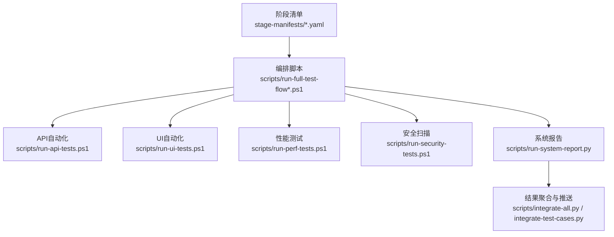
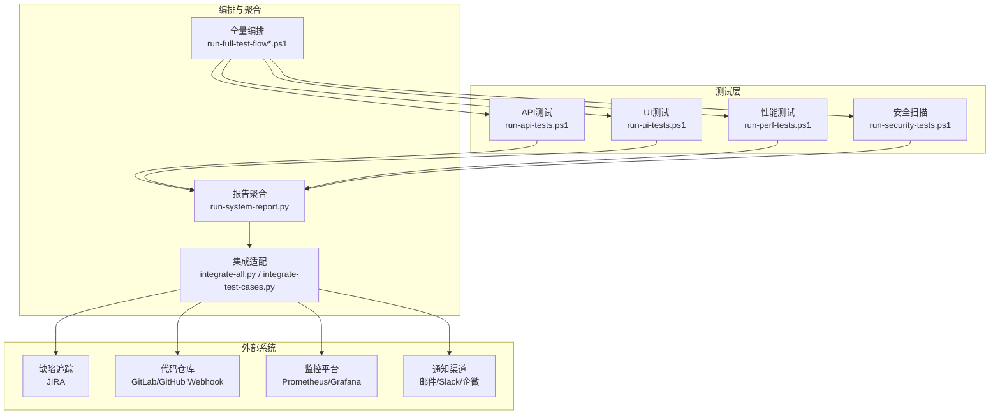
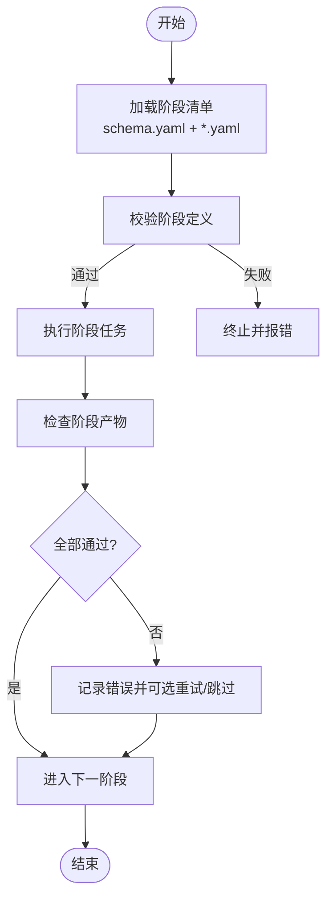
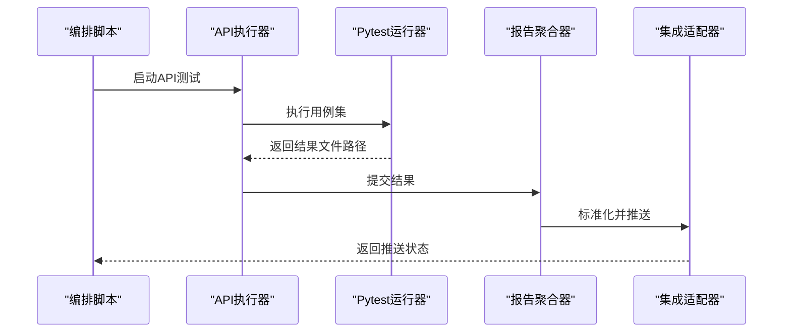
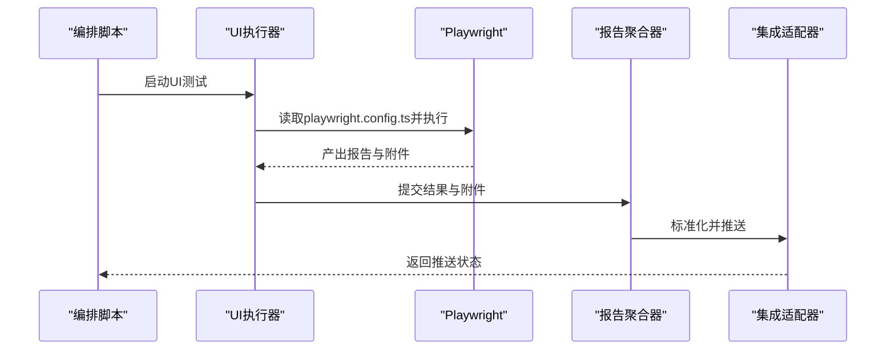
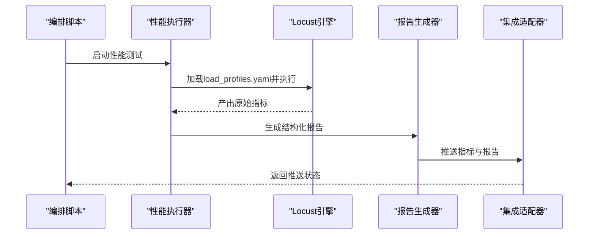
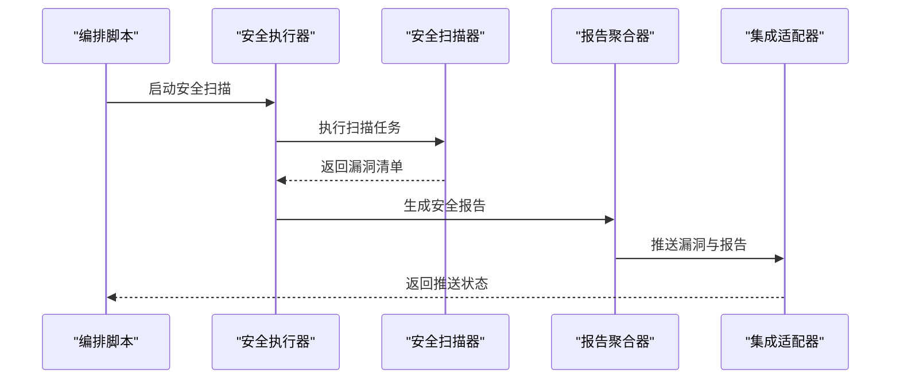
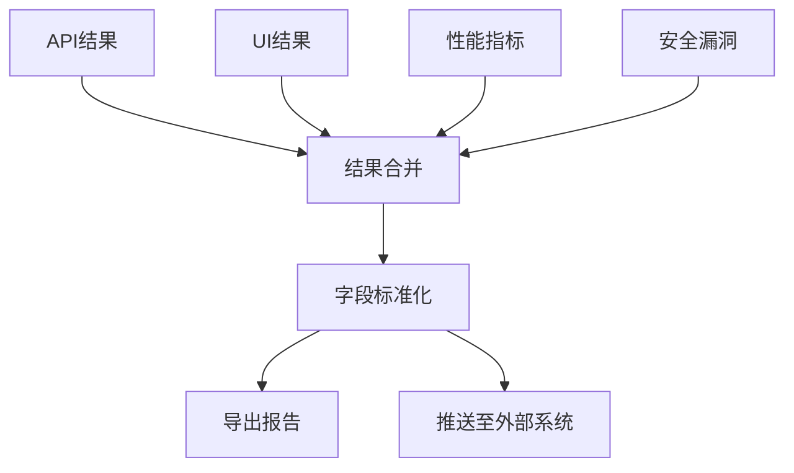
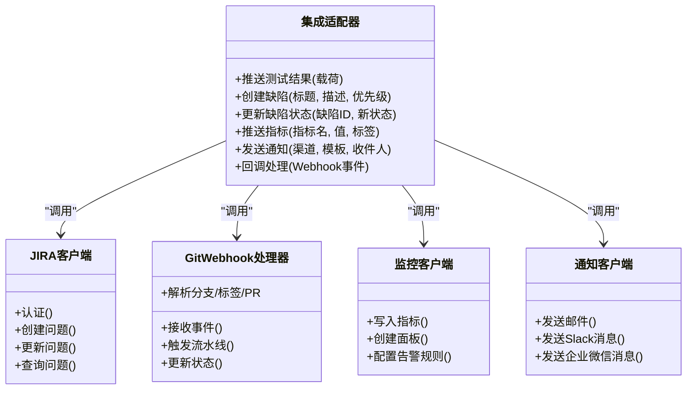
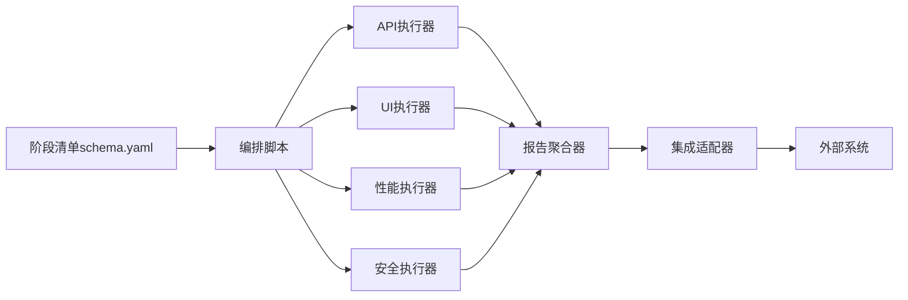

# 平台集成

<cite>
**本文引用的文件**   
- [提示词.md](file://提示词.md)
- [stage-manifests/05-api-automation.yaml](file://stage-manifests/05-api-automation.yaml)
- [stage-manifests/06-ui-automation.yaml](file://stage-manifests/06-ui-automation.yaml)
- [stage-manifests/07-performance.yaml](file://stage-manifests/07-performance.yaml)
- [stage-manifests/08-security.yaml](file://stage-manifests/08-security.yaml)
- [stage-manifests/09-system-test-report.yaml](file://stage-manifests/09-system-test-report.yaml)
- [stage-manifests/schema.yaml](file://stage-manifests/schema.yaml)
- [scripts/run-full-test-flow.ps1](file://scripts/run-full-test-flow.ps1)
- [scripts/run-full-test-flow-simple.ps1](file://scripts/run-full-test-flow-simple.ps1)
- [scripts/run-api-tests.ps1](file://scripts/run-api-tests.ps1)
- [scripts/run-perf-tests.ps1](file://scripts/run-perf-tests.ps1)
- [scripts/run-security-tests.ps1](file://scripts/run-security-tests.ps1)
- [scripts/run-ui-tests.ps1](file://scripts/run-ui-tests.ps1)
- [scripts/run-system-report.py](file://scripts/run-system-report.py)
- [scripts/integrate-all.py](file://scripts/integrate-all.py)
- [scripts/integrate-test-cases.py](file://scripts/integrate-test-cases.py)
- [scripts/integrate-test-plan.py](file://scripts/integrate-test-plan.py)
- [scripts/generate-detailed-cases.py](file://scripts/generate-detailed-cases.py)
- [scripts/generate-coverage-matrix.py](file://scripts/generate-coverage-matrix.py)
- [scripts/check-stage.sh](file://scripts/check-stage.sh)
- [scripts/check-stage.ps1](file://scripts/check-stage.ps1)
- [tests/api/conftest.py](file://tests/api/conftest.py)
- [tests/api/pytest.ini](file://tests/api/pytest.ini)
- [tests/config/env.yaml](file://tests/config/env.yaml)
- [tests/performance/locust/README.md](file://tests/performance/locust/README.md)
- [tests/performance/locust/config/load_profiles.yaml](file://tests/performance/locust/config/load_profiles.yaml)
- [tests/performance/locust/utils/report_generator.py](file://tests/performance/locust/utils/report_generator.py)
- [tests/ui/playwright.config.ts](file://tests/ui/playwright.config.ts)
- [tests/ui/global-setup.ts](file://tests/ui/global-setup.ts)
- [tests/security/scanner/security_scanner.py](file://tests/security/scanner/security_scanner.py)
</cite>

## 目录
1. [简介](#简介)
2. [项目结构](#项目结构)
3. [核心组件](#核心组件)
4. [架构总览](#架构总览)
5. [详细组件分析](#详细组件分析)
6. [依赖关系分析](#依赖关系分析)
7. [性能与稳定性考虑](#性能与稳定性考虑)
8. [故障排查指南](#故障排查指南)
9. [结论](#结论)
10. [附录](#附录)

## 简介
本技术文档面向AutoTest Hub的平台集成，聚焦于将测试框架与缺陷追踪系统（如JIRA）、监控平台（Prometheus、Grafana）和通知渠道（邮件、Slack、企业微信等）进行系统化对接。文档涵盖测试结果推送、告警配置与可视化展示的实现方案；代码仓库（GitLab/GitHub）Webhook集成与状态同步机制；API接口调用、数据格式转换与错误处理细节；以及第三方平台适配器的开发指南与扩展方法。目标是帮助读者快速完成端到端集成并稳定运行。

## 项目结构
本项目采用“阶段化编排 + 脚本驱动”的组织方式：
- stage-manifests：以YAML描述各测试阶段的执行策略与产物要求，便于流水线编排与校验。
- scripts：提供跨平台的一键式执行脚本与工具脚本，覆盖API/UI/性能/安全/报告生成等流程。
- tests：按类型划分测试资产，包含API、UI、性能、安全等用例与配置。
- docs：需求、用例、协议、知识等文档资料。

图表来源
- [stage-manifests/05-api-automation.yaml](file://stage-manifests/05-api-automation.yaml)
- [stage-manifests/06-ui-automation.yaml](file://stage-manifests/06-ui-automation.yaml)
- [stage-manifests/07-performance.yaml](file://stage-manifests/07-performance.yaml)
- [stage-manifests/08-security.yaml](file://stage-manifests/08-security.yaml)
- [stage-manifests/09-system-test-report.yaml](file://stage-manifests/09-system-test-report.yaml)
- [scripts/run-full-test-flow.ps1](file://scripts/run-full-test-flow.ps1)
- [scripts/run-full-test-flow-simple.ps1](file://scripts/run-full-test-flow-simple.ps1)
- [scripts/run-api-tests.ps1](file://scripts/run-api-tests.ps1)
- [scripts/run-ui-tests.ps1](file://scripts/run-ui-tests.ps1)
- [scripts/run-perf-tests.ps1](file://scripts/run-perf-tests.ps1)
- [scripts/run-security-tests.ps1](file://scripts/run-security-tests.ps1)
- [scripts/run-system-report.py](file://scripts/run-system-report.py)
- [scripts/integrate-all.py](file://scripts/integrate-all.py)
- [scripts/integrate-test-cases.py](file://scripts/integrate-test-cases.py)

章节来源
- [stage-manifests/schema.yaml](file://stage-manifests/schema.yaml)
- [scripts/run-full-test-flow.ps1](file://scripts/run-full-test-flow.ps1)
- [scripts/run-full-test-flow-simple.ps1](file://scripts/run-full-test-flow-simple.ps1)

## 核心组件
- 阶段编排器：通过YAML定义各阶段目标、输入输出与校验规则，供编排脚本解析执行。
- 测试执行器：分别封装API、UI、性能与安全测试的启动参数、环境准备与结果收集。
- 报告聚合器：汇总多源测试结果，统一转换为标准模型，支持导出与推送。
- 集成适配器：对外暴露统一的推送/查询接口，对接JIRA、CI/CD、监控与通知平台。
- 配置中心：集中管理环境变量、凭据与平台接入点，支持按环境隔离。

章节来源
- [stage-manifests/05-api-automation.yaml](file://stage-manifests/05-api-automation.yaml)
- [stage-manifests/06-ui-automation.yaml](file://stage-manifests/06-ui-automation.yaml)
- [stage-manifests/07-performance.yaml](file://stage-manifests/07-performance.yaml)
- [stage-manifests/08-security.yaml](file://stage-manifests/08-security.yaml)
- [stage-manifests/09-system-test-report.yaml](file://stage-manifests/09-system-test-report.yaml)
- [scripts/run-system-report.py](file://scripts/run-system-report.py)
- [scripts/integrate-all.py](file://scripts/integrate-all.py)
- [tests/config/env.yaml](file://tests/config/env.yaml)

## 架构总览
下图展示了从测试执行到结果上报、告警与可视化的整体链路。

图表来源
- [scripts/run-full-test-flow.ps1](file://scripts/run-full-test-flow.ps1)
- [scripts/run-full-test-flow-simple.ps1](file://scripts/run-full-test-flow-simple.ps1)
- [scripts/run-api-tests.ps1](file://scripts/run-api-tests.ps1)
- [scripts/run-ui-tests.ps1](file://scripts/run-ui-tests.ps1)
- [scripts/run-perf-tests.ps1](file://scripts/run-perf-tests.ps1)
- [scripts/run-security-tests.ps1](file://scripts/run-security-tests.ps1)
- [scripts/run-system-report.py](file://scripts/run-system-report.py)
- [scripts/integrate-all.py](file://scripts/integrate-all.py)
- [scripts/integrate-test-cases.py](file://scripts/integrate-test-cases.py)

## 详细组件分析

### 阶段编排与校验
- 阶段清单使用YAML声明每个阶段的名称、触发条件、输入产物、期望输出与校验规则。
- 编排脚本负责解析清单、顺序或并行执行阶段，并在失败时进行回滚或跳过策略控制。
- 校验脚本用于在阶段前后检查关键产物是否存在、格式是否合规。

图表来源
- [stage-manifests/schema.yaml](file://stage-manifests/schema.yaml)
- [scripts/check-stage.sh](file://scripts/check-stage.sh)
- [scripts/check-stage.ps1](file://scripts/check-stage.ps1)
- [scripts/run-full-test-flow.ps1](file://scripts/run-full-test-flow.ps1)
- [scripts/run-full-test-flow-simple.ps1](file://scripts/run-full-test-flow-simple.ps1)

章节来源
- [stage-manifests/schema.yaml](file://stage-manifests/schema.yaml)
- [scripts/check-stage.sh](file://scripts/check-stage.sh)
- [scripts/check-stage.ps1](file://scripts/check-stage.ps1)
- [scripts/run-full-test-flow.ps1](file://scripts/run-full-test-flow.ps1)
- [scripts/run-full-test-flow-simple.ps1](file://scripts/run-full-test-flow-simple.ps1)

### API自动化集成
- 入口脚本负责设置环境、安装依赖、执行用例并收集JUnit/XML或JSON结果。
- pytest配置与conftest提供夹具、钩子与全局初始化，确保会话与认证上下文一致。
- 建议将结果路径与环境变量注入到聚合器中，以便后续统一处理。

图表来源
- [scripts/run-api-tests.ps1](file://scripts/run-api-tests.ps1)
- [tests/api/conftest.py](file://tests/api/conftest.py)
- [tests/api/pytest.ini](file://tests/api/pytest.ini)
- [scripts/run-system-report.py](file://scripts/run-system-report.py)
- [scripts/integrate-all.py](file://scripts/integrate-all.py)

章节来源
- [scripts/run-api-tests.ps1](file://scripts/run-api-tests.ps1)
- [tests/api/conftest.py](file://tests/api/conftest.py)
- [tests/api/pytest.ini](file://tests/api/pytest.ini)

### UI自动化集成
- Playwright配置文件集中管理浏览器、超时、截图与视频录制等选项。
- 全局初始化脚本负责登录态、公共数据准备与清理。
- 执行脚本负责启动浏览器、运行spec并产出报告与附件。

图表来源
- [scripts/run-ui-tests.ps1](file://scripts/run-ui-tests.ps1)
- [tests/ui/playwright.config.ts](file://tests/ui/playwright.config.ts)
- [tests/ui/global-setup.ts](file://tests/ui/global-setup.ts)
- [scripts/run-system-report.py](file://scripts/run-system-report.py)
- [scripts/integrate-all.py](file://scripts/integrate-all.py)

章节来源
- [scripts/run-ui-tests.ps1](file://scripts/run-ui-tests.ps1)
- [tests/ui/playwright.config.ts](file://tests/ui/playwright.config.ts)
- [tests/ui/global-setup.ts](file://tests/ui/global-setup.ts)

### 性能测试集成（Locust）
- Locust入口脚本负责加载负载模型、并发配置与结果输出。
- 报告生成器将原始指标转换为结构化数据，便于聚合与可视化。
- 建议将关键指标（RPS、P95/P99延迟、错误率）暴露为可被监控采集的格式。

图表来源
- [scripts/run-perf-tests.ps1](file://scripts/run-perf-tests.ps1)
- [tests/performance/locust/config/load_profiles.yaml](file://tests/performance/locust/config/load_profiles.yaml)
- [tests/performance/locust/utils/report_generator.py](file://tests/performance/locust/utils/report_generator.py)
- [scripts/run-system-report.py](file://scripts/run-system-report.py)
- [scripts/integrate-all.py](file://scripts/integrate-all.py)

章节来源
- [scripts/run-perf-tests.ps1](file://scripts/run-perf-tests.ps1)
- [tests/performance/locust/config/load_profiles.yaml](file://tests/performance/locust/config/load_profiles.yaml)
- [tests/performance/locust/utils/report_generator.py](file://tests/performance/locust/utils/report_generator.py)

### 安全扫描集成
- 安全扫描脚本负责调用扫描器、解析漏洞列表并生成结构化报告。
- 建议将严重级别、CVSS评分与修复建议纳入推送载荷，便于缺陷追踪与看板展示。

图表来源
- [scripts/run-security-tests.ps1](file://scripts/run-security-tests.ps1)
- [tests/security/scanner/security_scanner.py](file://tests/security/scanner/security_scanner.py)
- [scripts/run-system-report.py](file://scripts/run-system-report.py)
- [scripts/integrate-all.py](file://scripts/integrate-all.py)

章节来源
- [scripts/run-security-tests.ps1](file://scripts/run-security-tests.ps1)
- [tests/security/scanner/security_scanner.py](file://tests/security/scanner/security_scanner.py)

### 报告聚合与标准化
- 报告聚合器负责合并多源结果，统一字段命名、时间戳与版本信息。
- 提供导出能力（JSON/HTML/PDF），并支持增量更新与差异对比。
- 与集成适配器协作，将标准化后的数据推送到外部系统。

图表来源
- [scripts/run-system-report.py](file://scripts/run-system-report.py)
- [scripts/integrate-all.py](file://scripts/integrate-all.py)
- [scripts/integrate-test-cases.py](file://scripts/integrate-test-cases.py)

章节来源
- [scripts/run-system-report.py](file://scripts/run-system-report.py)
- [scripts/integrate-all.py](file://scripts/integrate-all.py)
- [scripts/integrate-test-cases.py](file://scripts/integrate-test-cases.py)

### 集成适配器与外部系统对接
- 缺陷追踪（JIRA）：创建/更新缺陷、关联测试用例、同步状态与评论。
- 代码仓库（GitLab/GitHub）：通过Webhook触发流水线、更新PR状态、发布标签。
- 监控平台（Prometheus/Grafana）：推送时序指标、创建仪表盘面板与阈值告警。
- 通知渠道（邮件/Slack/企业微信）：发送摘要、失败详情与链接。

图表来源
- [scripts/integrate-all.py](file://scripts/integrate-all.py)
- [scripts/integrate-test-cases.py](file://scripts/integrate-test-cases.py)
- [scripts/run-system-report.py](file://scripts/run-system-report.py)

章节来源
- [scripts/integrate-all.py](file://scripts/integrate-all.py)
- [scripts/integrate-test-cases.py](file://scripts/integrate-test-cases.py)
- [scripts/run-system-report.py](file://scripts/run-system-report.py)

### 配置与环境管理
- 集中配置项包括：平台接入地址、鉴权凭据、超时与重试策略、日志级别、产物路径等。
- 支持按环境（dev/test/stage/prod）切换配置，避免硬编码敏感信息。
- 建议在编排脚本启动前校验必要配置，缺失则提前失败并给出明确提示。

章节来源
- [tests/config/env.yaml](file://tests/config/env.yaml)
- [scripts/run-full-test-flow.ps1](file://scripts/run-full-test-flow.ps1)
- [scripts/run-full-test-flow-simple.ps1](file://scripts/run-full-test-flow-simple.ps1)

## 依赖关系分析
- 编排脚本依赖阶段清单与校验脚本，确保阶段定义正确且产物完整。
- 各类执行器依赖各自的运行时（Pytest、Playwright、Locust、安全扫描器）。
- 报告聚合器依赖所有执行器的输出，并与集成适配器耦合进行推送。
- 集成适配器依赖外部系统的SDK或HTTP接口，需具备容错与重试机制。

图表来源
- [stage-manifests/schema.yaml](file://stage-manifests/schema.yaml)
- [scripts/run-full-test-flow.ps1](file://scripts/run-full-test-flow.ps1)
- [scripts/run-api-tests.ps1](file://scripts/run-api-tests.ps1)
- [scripts/run-ui-tests.ps1](file://scripts/run-ui-tests.ps1)
- [scripts/run-perf-tests.ps1](file://scripts/run-perf-tests.ps1)
- [scripts/run-security-tests.ps1](file://scripts/run-security-tests.ps1)
- [scripts/run-system-report.py](file://scripts/run-system-report.py)
- [scripts/integrate-all.py](file://scripts/integrate-all.py)

章节来源
- [stage-manifests/schema.yaml](file://stage-manifests/schema.yaml)
- [scripts/run-full-test-flow.ps1](file://scripts/run-full-test-flow.ps1)
- [scripts/run-system-report.py](file://scripts/run-system-report.py)
- [scripts/integrate-all.py](file://scripts/integrate-all.py)

## 性能与稳定性考虑
- 批量化与去重：聚合器对重复结果进行去重，减少外部系统压力。
- 异步与限流：推送过程采用队列与限流，避免突发流量导致外部服务拒绝。
- 幂等设计：缺陷创建与更新需支持幂等，防止重复创建。
- 指标采样：性能指标按窗口聚合，降低存储与传输开销。
- 降级策略：当外部系统不可用时，本地落盘并稍后重试。

[本节为通用指导，不直接分析具体文件]

## 故障排查指南
- 阶段失败：检查阶段清单定义与产物路径是否正确，查看校验脚本输出。
- 执行异常：确认运行环境与依赖已安装，查看对应执行器日志。
- 推送失败：核对凭据与网络连通性，检查重试与退避策略。
- 指标缺失：验证报告生成器输出字段是否符合监控平台要求。
- 通知未达：检查渠道配置与模板变量，确认收件人与通道可用。

章节来源
- [scripts/check-stage.sh](file://scripts/check-stage.sh)
- [scripts/check-stage.ps1](file://scripts/check-stage.ps1)
- [scripts/run-system-report.py](file://scripts/run-system-report.py)
- [scripts/integrate-all.py](file://scripts/integrate-all.py)

## 结论
通过阶段化编排与统一聚合，AutoTest Hub实现了跨类型测试的统一集成与对外推送。结合缺陷追踪、监控与通知体系，形成闭环的质量保障链路。建议在生产环境中完善凭据管理、限流重试与审计日志，持续提升稳定性与可观测性。

[本节为总结性内容，不直接分析具体文件]

## 附录

### 测试结果推送与数据格式
- 统一载荷字段建议：测试套件、用例标识、状态、耗时、错误堆栈、附件URL、环境信息、构建号、提交哈希。
- 时间与时区：统一使用UTC，并在前端展示时转换为本地时区。
- 版本与溯源：绑定commit、分支与标签，便于回溯。

章节来源
- [scripts/run-system-report.py](file://scripts/run-system-report.py)
- [scripts/integrate-all.py](file://scripts/integrate-all.py)

### 告警配置与可视化展示
- Prometheus：将关键指标（通过率、错误率、P95/P99、资源占用）作为时序数据推送，配置阈值与告警规则。
- Grafana：创建仪表盘，聚合多源指标，设置联动过滤与跳转链接。
- 告警路由：根据严重级别与团队维度路由到不同通知渠道。

章节来源
- [scripts/run-perf-tests.ps1](file://scripts/run-perf-tests.ps1)
- [tests/performance/locust/utils/report_generator.py](file://tests/performance/locust/utils/report_generator.py)
- [scripts/integrate-all.py](file://scripts/integrate-all.py)

### Webhook集成与状态同步
- 触发时机：提交、PR创建/更新、标签发布、阶段完成。
- 状态映射：将测试状态映射为PR检查状态（成功/失败/进行中）。
- 幂等与重试：保证多次触发不会产生副作用。

章节来源
- [scripts/integrate-all.py](file://scripts/integrate-all.py)
- [scripts/integrate-test-cases.py](file://scripts/integrate-test-cases.py)

### 通知渠道配置
- 邮件：SMTP服务器、发件人、主题模板、正文模板、附件策略。
- Slack：Webhook URL、频道、消息格式、@提及策略。
- 企业微信：机器人Webhook、消息体格式、@成员策略。

章节来源
- [scripts/integrate-all.py](file://scripts/integrate-all.py)

### API接口调用与错误处理
- 接口契约：统一REST风格，定义请求头、鉴权方式、分页与排序。
- 错误码：区分客户端错误与服务端错误，附带诊断信息。
- 重试与熔断：指数退避、最大重试次数、熔断阈值与恢复策略。

章节来源
- [scripts/integrate-all.py](file://scripts/integrate-all.py)

### 第三方平台适配器开发指南
- 抽象接口：定义统一的推送、查询、回调与通知方法。
- 实现要点：鉴权、序列化、重试、超时、日志与埋点。
- 测试策略：Mock外部依赖，覆盖正常、异常与边界场景。
- 配置项：接入地址、凭据、超时、重试、开关与灰度策略。

章节来源
- [scripts/integrate-all.py](file://scripts/integrate-all.py)
- [scripts/integrate-test-cases.py](file://scripts/integrate-test-cases.py)

### 用例与覆盖率辅助脚本
- 用例生成与细化：基于模板与索引生成详细用例，提升覆盖率与可维护性。
- 覆盖率矩阵：统计用例覆盖范围与缺口，辅助回归策略制定。

章节来源
- [scripts/generate-detailed-cases.py](file://scripts/generate-detailed-cases.py)
- [scripts/generate-coverage-matrix.py](file://scripts/generate-coverage-matrix.py)
- [scripts/integrate-test-cases.py](file://scripts/integrate-test-cases.py)

### 参考文档与说明
- 项目提示词与总体说明，有助于理解集成目标与约束。
- 性能测试说明与配置示例，便于快速上手。

章节来源
- [提示词.md](file://提示词.md)
- [tests/performance/locust/README.md](file://tests/performance/locust/README.md)