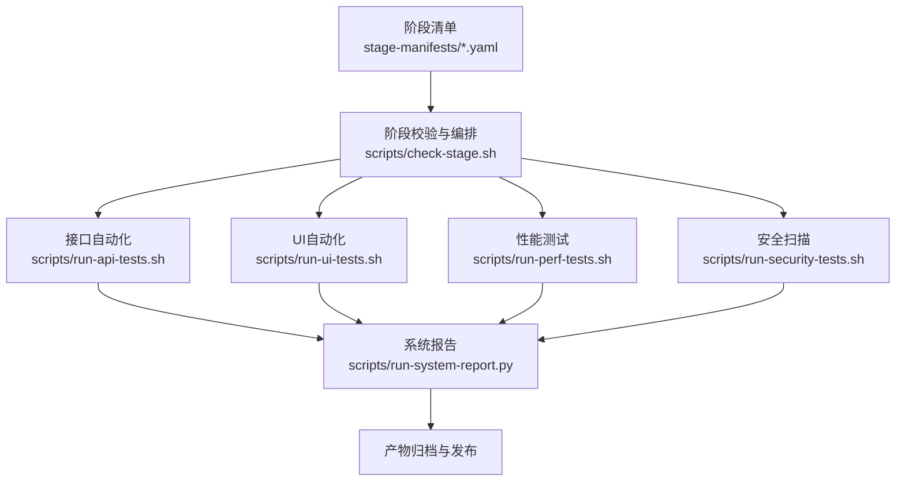
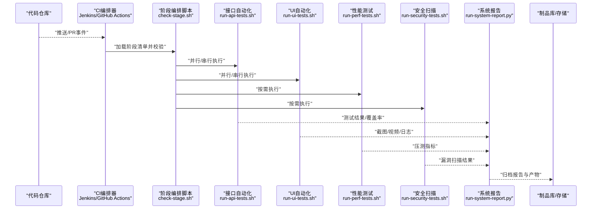
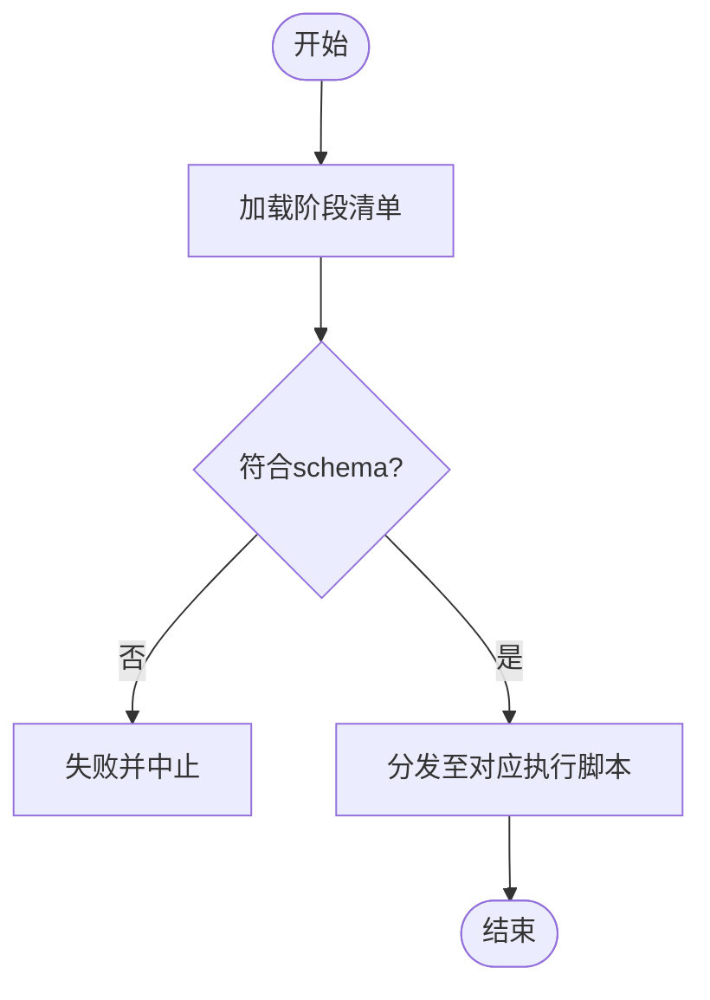
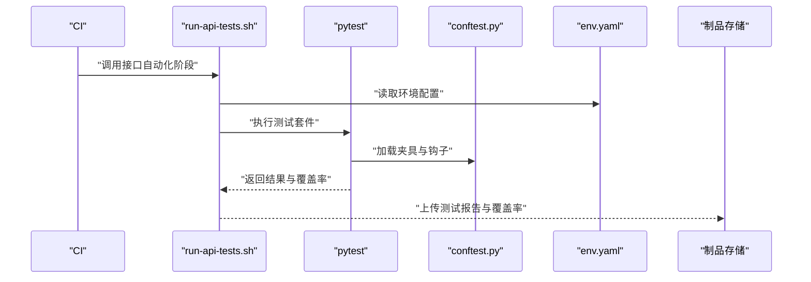
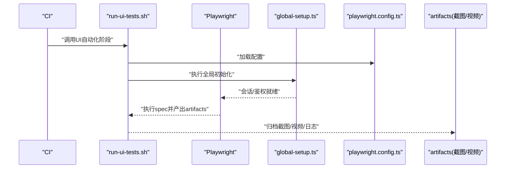
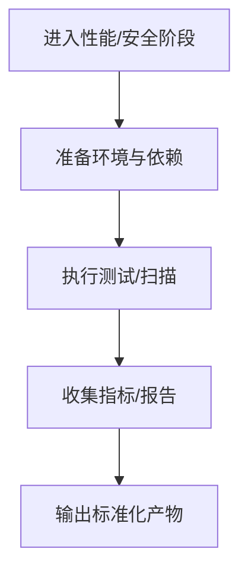
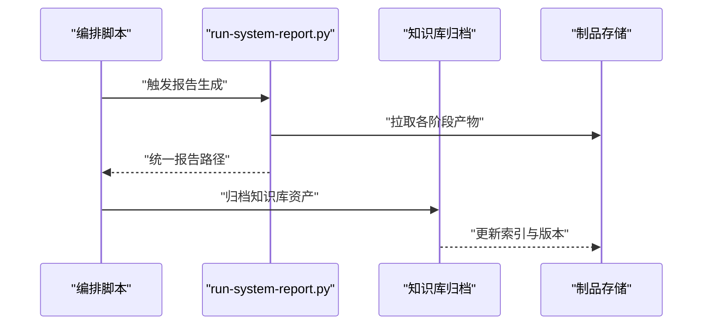
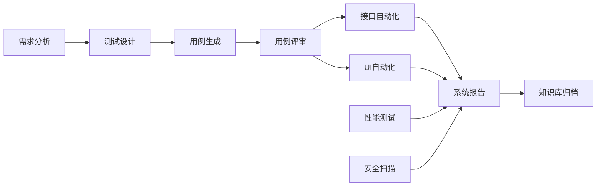

# 流水线配置

<cite>
**本文引用的文件**   
- [stage-manifests/01-req-analysis.yaml](file://stage-manifests/01-req-analysis.yaml)
- [stage-manifests/02-test-design.yaml](file://stage-manifests/02-test-design.yaml)
- [stage-manifests/03-case-generation.yaml](file://stage-manifests/03-case-generation.yaml)
- [stage-manifests/04-case-review.yaml](file://stage-manifests/04-case-review.yaml)
- [stage-manifests/05-api-automation.yaml](file://stage-manifests/05-api-automation.yaml)
- [stage-manifests/06-ui-automation.yaml](file://stage-manifests/06-ui-automation.yaml)
- [stage-manifests/07-performance.yaml](file://stage-manifests/07-performance.yaml)
- [stage-manifests/08-security.yaml](file://stage-manifests/08-security.yaml)
- [stage-manifests/09-system-test-report.yaml](file://stage-manifests/09-system-test-report.yaml)
- [stage-manifests/10-knowledge-base.yaml](file://stage-manifests/10-knowledge-base.yaml)
- [stage-manifests/schema.yaml](file://stage-manifests/schema.yaml)
- [scripts/check-stage.sh](file://scripts/check-stage.sh)
- [scripts/run-api-tests.sh](file://scripts/run-api-tests.sh)
- [scripts/run-ui-tests.sh](file://scripts/run-ui-tests.sh)
- [scripts/run-perf-tests.sh](file://scripts/run-perf-tests.sh)
- [scripts/run-security-tests.sh](file://scripts/run-security-tests.sh)
- [scripts/run-system-report.py](file://scripts/run-system-report.py)
- [tests/config/env.yaml](file://tests/config/env.yaml)
- [tests/api/conftest.py](file://tests/api/conftest.py)
- [tests/ui/global-setup.ts](file://tests/ui/global-setup.ts)
- [tests/ui/playwright.config.ts](file://tests/ui/playwright.config.ts)
- [tests/performance/locust/README.md](file://tests/performance/locust/README.md)
</cite>

## 目录
1. [简介](#简介)
2. [项目结构](#项目结构)
3. [核心组件](#核心组件)
4. [架构总览](#架构总览)
5. [详细组件分析](#详细组件分析)
6. [依赖分析](#依赖分析)
7. [性能考虑](#性能考虑)
8. [故障排查指南](#故障排查指南)
9. [结论](#结论)
10. [附录](#附录)

## 简介
本技术文档面向AutoTest Hub的CI/CD流水线配置，目标是在Jenkins、GitHub Actions等主流平台中实现端到端的自动化测试流水线。文档覆盖阶段化测试执行流程（需求分析、测试设计、用例生成、用例评审、接口自动化、UI自动化、性能测试、安全扫描、系统报告、知识库归档），并提供多环境构建策略、并行优化、触发器与分支策略、版本管理、环境变量管理、依赖缓存与构建优化的最佳实践，以及完整的配置文件示例和故障排查指南。

## 项目结构
仓库采用“阶段清单 + 脚本 + 测试代码”的分层组织方式：
- stage-manifests：以YAML描述各阶段的元数据与参数，便于在CI中动态解析与编排。
- scripts：提供跨平台的Shell/Python/PowerShell脚本，用于运行各类测试与报告生成。
- tests：按类型划分API、UI、性能、安全等测试资产与配置。
- docs：测试计划、用例、缺陷、知识等文档资产。

**图示来源**
- [stage-manifests/schema.yaml](file://stage-manifests/schema.yaml)
- [scripts/check-stage.sh](file://scripts/check-stage.sh)
- [scripts/run-api-tests.sh](file://scripts/run-api-tests.sh)
- [scripts/run-ui-tests.sh](file://scripts/run-ui-tests.sh)
- [scripts/run-perf-tests.sh](file://scripts/run-perf-tests.sh)
- [scripts/run-security-tests.sh](file://scripts/run-security-tests.sh)
- [scripts/run-system-report.py](file://scripts/run-system-report.py)

**章节来源**
- [stage-manifests/schema.yaml](file://stage-manifests/schema.yaml)
- [scripts/check-stage.sh](file://scripts/check-stage.sh)

## 核心组件
- 阶段清单（Stage Manifests）：每个阶段一个YAML，定义阶段名称、输入输出、参数、依赖、可选开关等，配合schema进行校验。
- 阶段编排脚本：统一入口，负责读取清单、校验、顺序/并行调度、结果汇总。
- 测试执行脚本：针对API/UI/性能/安全的专用执行脚本，封装环境准备、运行、收集产物。
- 系统报告脚本：聚合各阶段产物，生成统一报告并归档。
- 环境与配置：集中式env.yaml与框架级配置（如Playwright、pytest）。

**章节来源**
- [stage-manifests/01-req-analysis.yaml](file://stage-manifests/01-req-analysis.yaml)
- [stage-manifests/02-test-design.yaml](file://stage-manifests/02-test-design.yaml)
- [stage-manifests/03-case-generation.yaml](file://stage-manifests/03-case-generation.yaml)
- [stage-manifests/04-case-review.yaml](file://stage-manifests/04-case-review.yaml)
- [stage-manifests/05-api-automation.yaml](file://stage-manifests/05-api-automation.yaml)
- [stage-manifests/06-ui-automation.yaml](file://stage-manifests/06-ui-automation.yaml)
- [stage-manifests/07-performance.yaml](file://stage-manifests/07-performance.yaml)
- [stage-manifests/08-security.yaml](file://stage-manifests/08-security.yaml)
- [stage-manifests/09-system-test-report.yaml](file://stage-manifests/09-system-test-report.yaml)
- [stage-manifests/10-knowledge-base.yaml](file://stage-manifests/10-knowledge-base.yaml)
- [scripts/run-system-report.py](file://scripts/run-system-report.py)
- [tests/config/env.yaml](file://tests/config/env.yaml)

## 架构总览
下图展示从代码提交到报告产物的完整流水线调用链与产物流转。

**图示来源**
- [scripts/check-stage.sh](file://scripts/check-stage.sh)
- [scripts/run-api-tests.sh](file://scripts/run-api-tests.sh)
- [scripts/run-ui-tests.sh](file://scripts/run-ui-tests.sh)
- [scripts/run-perf-tests.sh](file://scripts/run-perf-tests.sh)
- [scripts/run-security-tests.sh](file://scripts/run-security-tests.sh)
- [scripts/run-system-report.py](file://scripts/run-system-report.py)

## 详细组件分析

### 阶段清单与Schema校验
- schema.yaml定义了阶段清单的结构约束，确保所有阶段具备必要字段（如阶段名、输入输出、依赖、参数等）。
- 各阶段YAML文件分别描述需求分析、测试设计、用例生成、用例评审、接口自动化、UI自动化、性能、安全、系统报告、知识库归档等阶段的行为与参数。

**图示来源**
- [stage-manifests/schema.yaml](file://stage-manifests/schema.yaml)
- [scripts/check-stage.sh](file://scripts/check-stage.sh)

**章节来源**
- [stage-manifests/schema.yaml](file://stage-manifests/schema.yaml)
- [stage-manifests/01-req-analysis.yaml](file://stage-manifests/01-req-analysis.yaml)
- [stage-manifests/02-test-design.yaml](file://stage-manifests/02-test-design.yaml)
- [stage-manifests/03-case-generation.yaml](file://stage-manifests/03-case-generation.yaml)
- [stage-manifests/04-case-review.yaml](file://stage-manifests/04-case-review.yaml)
- [stage-manifests/05-api-automation.yaml](file://stage-manifests/05-api-automation.yaml)
- [stage-manifests/06-ui-automation.yaml](file://stage-manifests/06-ui-automation.yaml)
- [stage-manifests/07-performance.yaml](file://stage-manifests/07-performance.yaml)
- [stage-manifests/08-security.yaml](file://stage-manifests/08-security.yaml)
- [stage-manifests/09-system-test-report.yaml](file://stage-manifests/09-system-test-report.yaml)
- [stage-manifests/10-knowledge-base.yaml](file://stage-manifests/10-knowledge-base.yaml)

### 接口自动化阶段
- 执行脚本封装了环境准备、依赖安装、测试运行与产物收集。
- pytest通过conftest.py进行全局夹具与配置注入，结合tests/config/env.yaml进行环境切换。

**图示来源**
- [scripts/run-api-tests.sh](file://scripts/run-api-tests.sh)
- [tests/api/conftest.py](file://tests/api/conftest.py)
- [tests/config/env.yaml](file://tests/config/env.yaml)

**章节来源**
- [scripts/run-api-tests.sh](file://scripts/run-api-tests.sh)
- [tests/api/conftest.py](file://tests/api/conftest.py)
- [tests/config/env.yaml](file://tests/config/env.yaml)

### UI自动化阶段
- Playwright通过global-setup.ts进行浏览器初始化与登录态准备，playwright.config.ts集中管理浏览器、超时、重试、截图/视频等选项。
- 执行脚本负责安装依赖、启动浏览器、运行spec、收集artifacts。

**图示来源**
- [scripts/run-ui-tests.sh](file://scripts/run-ui-tests.sh)
- [tests/ui/global-setup.ts](file://tests/ui/global-setup.ts)
- [tests/ui/playwright.config.ts](file://tests/ui/playwright.config.ts)

**章节来源**
- [scripts/run-ui-tests.sh](file://scripts/run-ui-tests.sh)
- [tests/ui/global-setup.ts](file://tests/ui/global-setup.ts)
- [tests/ui/playwright.config.ts](file://tests/ui/playwright.config.ts)

### 性能与安全阶段
- 性能测试脚本封装Locust相关执行流程；安全扫描脚本封装静态/动态扫描工具调用。
- 两者均遵循统一的产物输出规范，供系统报告阶段聚合。

**图示来源**
- [scripts/run-perf-tests.sh](file://scripts/run-perf-tests.sh)
- [scripts/run-security-tests.sh](file://scripts/run-security-tests.sh)
- [tests/performance/locust/README.md](file://tests/performance/locust/README.md)

**章节来源**
- [scripts/run-perf-tests.sh](file://scripts/run-perf-tests.sh)
- [scripts/run-security-tests.sh](file://scripts/run-security-tests.sh)
- [tests/performance/locust/README.md](file://tests/performance/locust/README.md)

### 系统报告与知识库归档
- 系统报告脚本聚合API/UI/性能/安全产物，生成统一报告并归档。
- 知识库归档阶段将关键资产索引、回归资产、问题库等纳入版本化管理。

**图示来源**
- [scripts/run-system-report.py](file://scripts/run-system-report.py)
- [stage-manifests/09-system-test-report.yaml](file://stage-manifests/09-system-test-report.yaml)
- [stage-manifests/10-knowledge-base.yaml](file://stage-manifests/10-knowledge-base.yaml)

**章节来源**
- [scripts/run-system-report.py](file://scripts/run-system-report.py)
- [stage-manifests/09-system-test-report.yaml](file://stage-manifests/09-system-test-report.yaml)
- [stage-manifests/10-knowledge-base.yaml](file://stage-manifests/10-knowledge-base.yaml)

## 依赖分析
- 阶段间依赖关系由阶段清单显式声明，编排脚本依据依赖图进行拓扑排序与并行调度。
- 测试框架依赖：pytest（API）、Playwright（UI）、Locust（性能）、安全扫描工具（安全）。
- 外部服务依赖：被测系统URL、数据库、对象存储（制品归档）等，通过env.yaml或CI变量注入。

**图示来源**
- [stage-manifests/01-req-analysis.yaml](file://stage-manifests/01-req-analysis.yaml)
- [stage-manifests/02-test-design.yaml](file://stage-manifests/02-test-design.yaml)
- [stage-manifests/03-case-generation.yaml](file://stage-manifests/03-case-generation.yaml)
- [stage-manifests/04-case-review.yaml](file://stage-manifests/04-case-review.yaml)
- [stage-manifests/05-api-automation.yaml](file://stage-manifests/05-api-automation.yaml)
- [stage-manifests/06-ui-automation.yaml](file://stage-manifests/06-ui-automation.yaml)
- [stage-manifests/07-performance.yaml](file://stage-manifests/07-performance.yaml)
- [stage-manifests/08-security.yaml](file://stage-manifests/08-security.yaml)
- [stage-manifests/09-system-test-report.yaml](file://stage-manifests/09-system-test-report.yaml)
- [stage-manifests/10-knowledge-base.yaml](file://stage-manifests/10-knowledge-base.yaml)

**章节来源**
- [stage-manifests/schema.yaml](file://stage-manifests/schema.yaml)
- [scripts/check-stage.sh](file://scripts/check-stage.sh)

## 性能考虑
- 并行执行：对无强依赖的阶段（如API、UI、性能、安全）可并行执行，缩短整体时长。
- 依赖缓存：缓存Python包、Node模块、浏览器二进制等，减少重复下载。
- 资源隔离：为UI与性能阶段分配更高CPU/内存，避免相互干扰。
- 产物压缩：对大体积产物（视频、trace）进行压缩后再归档。
- 增量执行：基于变更范围选择性地执行受影响测试集，降低执行时间。

[本节为通用指导，不直接分析具体文件]

## 故障排查指南
- 阶段清单校验失败：检查schema约束与阶段YAML字段完整性。
- 环境配置错误：核对env.yaml与CI变量映射，确认被测系统可达性。
- 浏览器/驱动问题：清理缓存、升级驱动、调整超时与重试策略。
- 网络不稳定：启用重试、增加超时、使用镜像源加速依赖下载。
- 产物缺失：检查各阶段输出路径与归档权限，确认报告脚本能正确聚合。

**章节来源**
- [stage-manifests/schema.yaml](file://stage-manifests/schema.yaml)
- [tests/config/env.yaml](file://tests/config/env.yaml)
- [tests/ui/playwright.config.ts](file://tests/ui/playwright.config.ts)
- [scripts/run-system-report.py](file://scripts/run-system-report.py)

## 结论
通过阶段清单驱动的编排与标准化脚本封装，AutoTest Hub实现了可复用、可扩展、可观测的CI/CD流水线。借助并行执行、依赖缓存与统一报告机制，可在保证质量的同时显著提升交付效率。建议持续完善阶段清单与脚本健壮性，并结合业务特性优化触发策略与资源分配。

[本节为总结性内容，不直接分析具体文件]

## 附录

### Jenkins流水线配置要点
- 触发器：支持SCM轮询、Webhook、定时任务。
- 分支策略：主分支全量流水线，开发分支快速验证，标签触发发布流水线。
- 多环境：通过环境变量区分dev/staging/prod，结合env.yaml切换。
- 并行：使用parallel块并行执行API/UI/性能/安全阶段。
- 缓存：利用Jenkins工作区缓存或外部缓存服务（如Nexus、S3）。
- 产物：使用内置或插件归档HTML报告、截图、视频、覆盖率。

[本节为通用指导，不直接分析具体文件]

### GitHub Actions流水线配置要点
- 触发器：push、pull_request、workflow_dispatch、schedule。
- 矩阵策略：使用matrix在不同OS/浏览器/节点上并行执行。
- 缓存：actions/cache缓存pip/npm/浏览器二进制。
- 并发控制：使用concurrency避免同一分支重复构建。
- 产物：使用actions/upload-artifact归档报告与附件。
- 环境：使用secrets与environment保护敏感信息。

[本节为通用指导，不直接分析具体文件]

### 环境变量管理与版本控制
- env.yaml集中管理测试环境参数，CI变量覆盖默认值。
- 版本管理：为每次构建生成唯一版本号，关联产物与报告。
- 密钥管理：使用CI平台提供的Secrets管理凭据，避免硬编码。

**章节来源**
- [tests/config/env.yaml](file://tests/config/env.yaml)

### 典型流水线阶段清单示例（路径引用）
- 需求分析：[stage-manifests/01-req-analysis.yaml](file://stage-manifests/01-req-analysis.yaml)
- 测试设计：[stage-manifests/02-test-design.yaml](file://stage-manifests/02-test-design.yaml)
- 用例生成：[stage-manifests/03-case-generation.yaml](file://stage-manifests/03-case-generation.yaml)
- 用例评审：[stage-manifests/04-case-review.yaml](file://stage-manifests/04-case-review.yaml)
- 接口自动化：[stage-manifests/05-api-automation.yaml](file://stage-manifests/05-api-automation.yaml)
- UI自动化：[stage-manifests/06-ui-automation.yaml](file://stage-manifests/06-ui-automation.yaml)
- 性能测试：[stage-manifests/07-performance.yaml](file://stage-manifests/07-performance.yaml)
- 安全扫描：[stage-manifests/08-security.yaml](file://stage-manifests/08-security.yaml)
- 系统报告：[stage-manifests/09-system-test-report.yaml](file://stage-manifests/09-system-test-report.yaml)
- 知识库归档：[stage-manifests/10-knowledge-base.yaml](file://stage-manifests/10-knowledge-base.yaml)