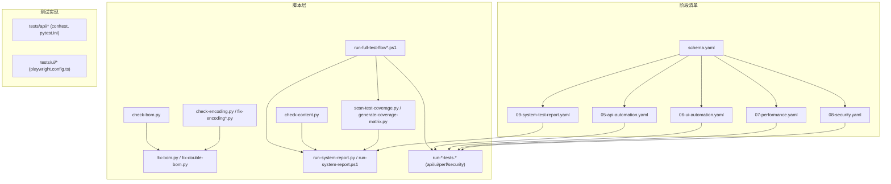
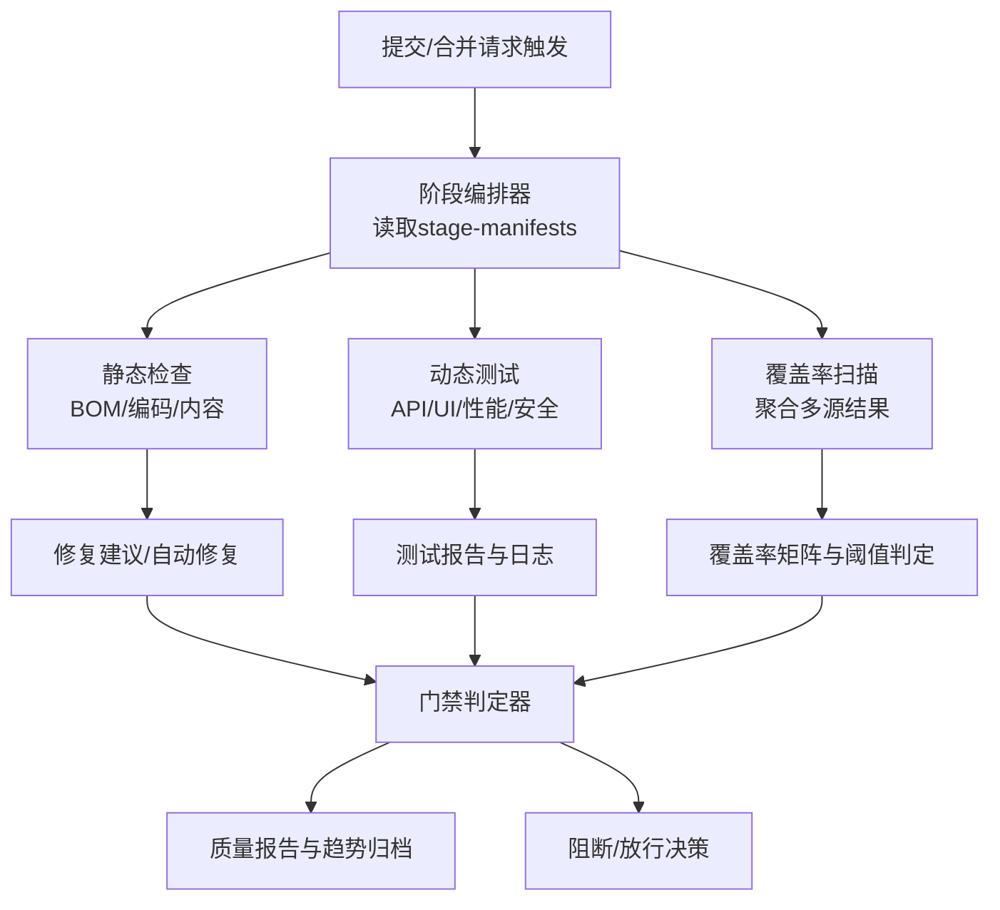
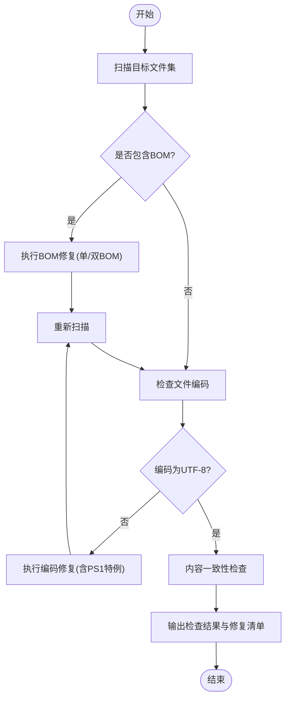
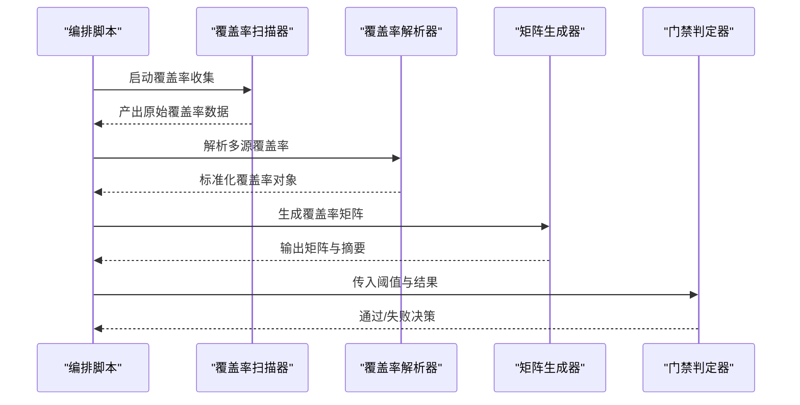
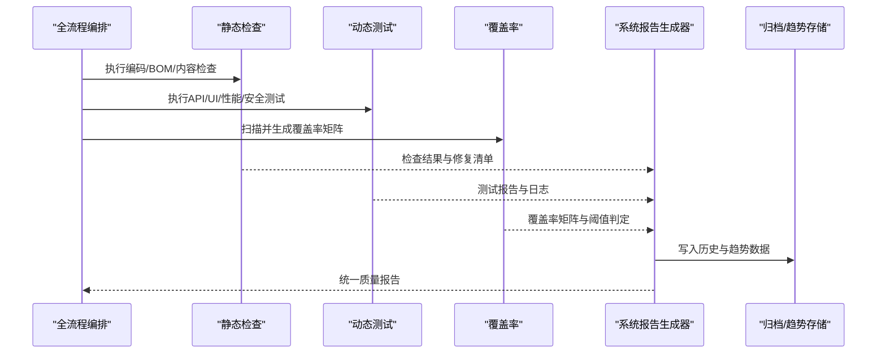
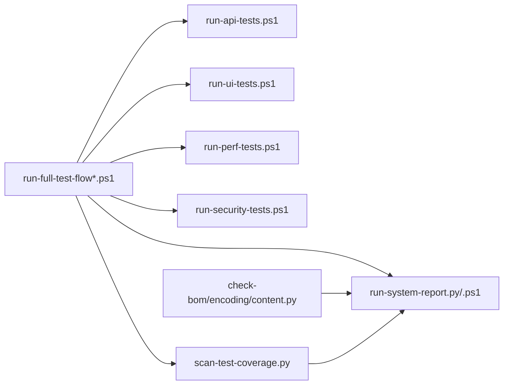

# 质量门禁

<cite>
**本文引用的文件**   
- [scripts/check-bom.py](file://scripts/check-bom.py)
- [scripts/fix-bom.py](file://scripts/fix-bom.py)
- [scripts/fix-double-bom.py](file://scripts/fix-double-bom.py)
- [scripts/check-encoding.py](file://scripts/check-encoding.py)
- [scripts/fix-encoding.py](file://scripts/fix-encoding.py)
- [scripts/fix-encoding-final.py](file://scripts/fix-encoding-final.py)
- [scripts/fix-ps1-encoding.py](file://scripts/fix-ps1-encoding.py)
- [scripts/check-content.py](file://scripts/check-content.py)
- [scripts/generate-coverage-matrix.py](file://scripts/generate-coverage-matrix.py)
- [scripts/scan-test-coverage.py](file://scripts/scan-test-coverage.py)
- [scripts/run-full-test-flow.ps1](file://scripts/run-full-test-flow.ps1)
- [scripts/run-full-test-flow-simple.ps1](file://scripts/run-full-test-flow-simple.ps1)
- [scripts/run-api-tests.ps1](file://scripts/run-api-tests.ps1)
- [scripts/run-ui-tests.ps1](file://scripts/run-ui-tests.ps1)
- [scripts/run-perf-tests.ps1](file://scripts/run-perf-tests.ps1)
- [scripts/run-security-tests.ps1](file://scripts/run-security-tests.ps1)
- [scripts/run-system-report.ps1](file://scripts/run-system-report.ps1)
- [scripts/run-system-report.py](file://scripts/run-system-report.py)
- [stage-manifests/schema.yaml](file://stage-manifests/schema.yaml)
- [stage-manifests/05-api-automation.yaml](file://stage-manifests/05-api-automation.yaml)
- [stage-manifests/06-ui-automation.yaml](file://stage-manifests/06-ui-automation.yaml)
- [stage-manifests/07-performance.yaml](file://stage-manifests/07-performance.yaml)
- [stage-manifests/08-security.yaml](file://stage-manifests/08-security.yaml)
- [stage-manifests/09-system-test-report.yaml](file://stage-manifests/09-system-test-report.yaml)
- [tests/api/conftest.py](file://tests/api/conftest.py)
- [tests/api/pytest.ini](file://tests/api/pytest.ini)
- [tests/ui/playwright.config.ts](file://tests/ui/playwright.config.ts)
</cite>

## 目录
1. [简介](#简介)
2. [项目结构](#项目结构)
3. [核心组件](#核心组件)
4. [架构总览](#架构总览)
5. [详细组件分析](#详细组件分析)
6. [依赖关系分析](#依赖关系分析)
7. [性能与稳定性考量](#性能与稳定性考量)
8. [故障排查指南](#故障排查指南)
9. [结论](#结论)
10. [附录](#附录)

## 简介
本技术文档面向AutoTest Hub的质量门禁系统，目标是系统化说明如何通过自动化检查确保代码质量与测试覆盖率。内容涵盖：
- 静态分析与规范检查：编码格式、BOM检测与修复、内容一致性校验等
- 测试覆盖率阈值与评估标准
- 与SonarQube、CodeClimate等平台的集成思路
- 失败处理机制、质量报告生成与趋势分析
- 质量门禁规则配置示例与自定义检查脚本开发指南

## 项目结构
仓库采用“脚本驱动 + 阶段清单”的组织方式：
- scripts：质量门禁相关脚本（编码/BOM检查与修复、覆盖率扫描、报告生成、端到端流程编排）
- stage-manifests：以YAML描述各阶段的执行策略与产物要求（含schema定义）
- tests：API/UI/性能/安全等测试实现与配置
- docs：测试用例、方案与知识资产

图表来源
- [scripts/check-bom.py](file://scripts/check-bom.py)
- [scripts/fix-bom.py](file://scripts/fix-bom.py)
- [scripts/fix-double-bom.py](file://scripts/fix-double-bom.py)
- [scripts/check-encoding.py](file://scripts/check-encoding.py)
- [scripts/fix-encoding.py](file://scripts/fix-encoding.py)
- [scripts/fix-encoding-final.py](file://scripts/fix-encoding-final.py)
- [scripts/fix-ps1-encoding.py](file://scripts/fix-ps1-encoding.py)
- [scripts/check-content.py](file://scripts/check-content.py)
- [scripts/scan-test-coverage.py](file://scripts/scan-test-coverage.py)
- [scripts/generate-coverage-matrix.py](file://scripts/generate-coverage-matrix.py)
- [scripts/run-system-report.py](file://scripts/run-system-report.py)
- [scripts/run-system-report.ps1](file://scripts/run-system-report.ps1)
- [scripts/run-full-test-flow.ps1](file://scripts/run-full-test-flow.ps1)
- [scripts/run-full-test-flow-simple.ps1](file://scripts/run-full-test-flow-simple.ps1)
- [scripts/run-api-tests.ps1](file://scripts/run-api-tests.ps1)
- [scripts/run-ui-tests.ps1](file://scripts/run-ui-tests.ps1)
- [scripts/run-perf-tests.ps1](file://scripts/run-perf-tests.ps1)
- [scripts/run-security-tests.ps1](file://scripts/run-security-tests.ps1)
- [stage-manifests/schema.yaml](file://stage-manifests/schema.yaml)
- [stage-manifests/05-api-automation.yaml](file://stage-manifests/05-api-automation.yaml)
- [stage-manifests/06-ui-automation.yaml](file://stage-manifests/06-ui-automation.yaml)
- [stage-manifests/07-performance.yaml](file://stage-manifests/07-performance.yaml)
- [stage-manifests/08-security.yaml](file://stage-manifests/08-security.yaml)
- [stage-manifests/09-system-test-report.yaml](file://stage-manifests/09-system-test-report.yaml)

章节来源
- [stage-manifests/schema.yaml](file://stage-manifests/schema.yaml)
- [stage-manifests/05-api-automation.yaml](file://stage-manifests/05-api-automation.yaml)
- [stage-manifests/06-ui-automation.yaml](file://stage-manifests/06-ui-automation.yaml)
- [stage-manifests/07-performance.yaml](file://stage-manifests/07-performance.yaml)
- [stage-manifests/08-security.yaml](file://stage-manifests/08-security.yaml)
- [stage-manifests/09-system-test-report.yaml](file://stage-manifests/09-system-test-report.yaml)

## 核心组件
- 编码与BOM治理
  - BOM检测与修复：支持单BOM与双BOM识别与修复
  - 编码一致性检查与修复：统一UTF-8，兼容PowerShell脚本特殊场景
  - 内容一致性检查：用于约束关键文件的变更范围或内容模式
- 覆盖率与质量报告
  - 覆盖率扫描与矩阵生成：汇总多类测试的覆盖率数据并输出矩阵
  - 系统级报告聚合：整合静态检查、测试结果、覆盖率与外部平台指标
- 阶段编排与门禁
  - 通过阶段清单定义准入条件、阈值与产物要求
  - 全链路流程编排脚本串联各阶段任务，形成门禁流水线

章节来源
- [scripts/check-bom.py](file://scripts/check-bom.py)
- [scripts/fix-bom.py](file://scripts/fix-bom.py)
- [scripts/fix-double-bom.py](file://scripts/fix-double-bom.py)
- [scripts/check-encoding.py](file://scripts/check-encoding.py)
- [scripts/fix-encoding.py](file://scripts/fix-encoding.py)
- [scripts/fix-encoding-final.py](file://scripts/fix-encoding-final.py)
- [scripts/fix-ps1-encoding.py](file://scripts/fix-ps1-encoding.py)
- [scripts/check-content.py](file://scripts/check-content.py)
- [scripts/scan-test-coverage.py](file://scripts/scan-test-coverage.py)
- [scripts/generate-coverage-matrix.py](file://scripts/generate-coverage-matrix.py)
- [scripts/run-system-report.py](file://scripts/run-system-report.py)
- [scripts/run-system-report.ps1](file://scripts/run-system-report.ps1)
- [scripts/run-full-test-flow.ps1](file://scripts/run-full-test-flow.ps1)
- [scripts/run-full-test-flow-simple.ps1](file://scripts/run-full-test-flow-simple.ps1)

## 架构总览
质量门禁由“静态检查 + 动态测试 + 覆盖率统计 + 报告聚合 + 门禁判定”五层构成，并通过阶段清单进行编排与约束。

图表来源
- [scripts/run-full-test-flow.ps1](file://scripts/run-full-test-flow.ps1)
- [scripts/run-full-test-flow-simple.ps1](file://scripts/run-full-test-flow-simple.ps1)
- [scripts/check-bom.py](file://scripts/check-bom.py)
- [scripts/check-encoding.py](file://scripts/check-encoding.py)
- [scripts/check-content.py](file://scripts/check-content.py)
- [scripts/scan-test-coverage.py](file://scripts/scan-test-coverage.py)
- [scripts/generate-coverage-matrix.py](file://scripts/generate-coverage-matrix.py)
- [scripts/run-system-report.py](file://scripts/run-system-report.py)
- [stage-manifests/schema.yaml](file://stage-manifests/schema.yaml)

## 详细组件分析

### 编码与BOM治理组件
- 功能要点
  - BOM检测：识别UTF-8/UTF-16等BOM头，支持双BOM异常检测
  - 编码修复：将非UTF-8文件转换为UTF-8；对PowerShell脚本进行专用修复
  - 内容检查：基于规则匹配关键文件或目录的内容差异，防止不合规变更
- 典型流程
  - 扫描 -> 分类（正常/需修复/异常）-> 修复（可选）-> 重新验证 -> 记录结果

图表来源
- [scripts/check-bom.py](file://scripts/check-bom.py)
- [scripts/fix-bom.py](file://scripts/fix-bom.py)
- [scripts/fix-double-bom.py](file://scripts/fix-double-bom.py)
- [scripts/check-encoding.py](file://scripts/check-encoding.py)
- [scripts/fix-encoding.py](file://scripts/fix-encoding.py)
- [scripts/fix-encoding-final.py](file://scripts/fix-encoding-final.py)
- [scripts/fix-ps1-encoding.py](file://scripts/fix-ps1-encoding.py)
- [scripts/check-content.py](file://scripts/check-content.py)

章节来源
- [scripts/check-bom.py](file://scripts/check-bom.py)
- [scripts/fix-bom.py](file://scripts/fix-bom.py)
- [scripts/fix-double-bom.py](file://scripts/fix-double-bom.py)
- [scripts/check-encoding.py](file://scripts/check-encoding.py)
- [scripts/fix-encoding.py](file://scripts/fix-encoding.py)
- [scripts/fix-encoding-final.py](file://scripts/fix-encoding-final.py)
- [scripts/fix-ps1-encoding.py](file://scripts/fix-ps1-encoding.py)
- [scripts/check-content.py](file://scripts/check-content.py)

### 覆盖率扫描与矩阵生成组件
- 功能要点
  - 扫描多类测试产物（如Python覆盖率、Playwright报告等），解析并归一化
  - 生成覆盖率矩阵：按模块/套件维度展示覆盖率分布
  - 阈值判定：根据阶段清单中的阈值配置进行通过/失败判定
- 数据流
  - 原始覆盖率数据 -> 解析与清洗 -> 聚合计算 -> 矩阵输出 -> 阈值比较 -> 门禁结果

图表来源
- [scripts/scan-test-coverage.py](file://scripts/scan-test-coverage.py)
- [scripts/generate-coverage-matrix.py](file://scripts/generate-coverage-matrix.py)
- [scripts/run-full-test-flow.ps1](file://scripts/run-full-test-flow.ps1)
- [scripts/run-full-test-flow-simple.ps1](file://scripts/run-full-test-flow-simple.ps1)

章节来源
- [scripts/scan-test-coverage.py](file://scripts/scan-test-coverage.py)
- [scripts/generate-coverage-matrix.py](file://scripts/generate-coverage-matrix.py)
- [scripts/run-full-test-flow.ps1](file://scripts/run-full-test-flow.ps1)
- [scripts/run-full-test-flow-simple.ps1](file://scripts/run-full-test-flow-simple.ps1)

### 系统报告与趋势归档组件
- 功能要点
  - 聚合静态检查、测试结果、覆盖率与外部平台指标，生成统一质量报告
  - 支持历史对比与趋势分析，便于持续改进
- 典型流程
  - 收集各阶段产物 -> 格式化与关联 -> 生成报告 -> 归档与发布

图表来源
- [scripts/run-system-report.py](file://scripts/run-system-report.py)
- [scripts/run-system-report.ps1](file://scripts/run-system-report.ps1)
- [scripts/run-full-test-flow.ps1](file://scripts/run-full-test-flow.ps1)
- [scripts/run-full-test-flow-simple.ps1](file://scripts/run-full-test-flow-simple.ps1)

章节来源
- [scripts/run-system-report.py](file://scripts/run-system-report.py)
- [scripts/run-system-report.ps1](file://scripts/run-system-report.ps1)
- [scripts/run-full-test-flow.ps1](file://scripts/run-full-test-flow.ps1)
- [scripts/run-full-test-flow-simple.ps1](file://scripts/run-full-test-flow-simple.ps1)

### 阶段清单与门禁规则
- 阶段清单作用
  - 定义每个阶段的输入、命令、产物与准入条件（如覆盖率阈值、报告路径）
  - schema提供统一的字段约束，保证各阶段配置的一致性
- 关键阶段
  - API自动化、UI自动化、性能、安全、系统测试报告等
- 门禁规则示例（概念性）
  - 覆盖率阈值：模块级不低于X%，整体不低于Y%
  - 静态检查：无未修复的BOM/编码问题，内容检查通过
  - 外部平台：SonarQube质量门通过、CodeClimate评分达标

章节来源
- [stage-manifests/schema.yaml](file://stage-manifests/schema.yaml)
- [stage-manifests/05-api-automation.yaml](file://stage-manifests/05-api-automation.yaml)
- [stage-manifests/06-ui-automation.yaml](file://stage-manifests/06-ui-automation.yaml)
- [stage-manifests/07-performance.yaml](file://stage-manifests/07-performance.yaml)
- [stage-manifests/08-security.yaml](file://stage-manifests/08-security.yaml)
- [stage-manifests/09-system-test-report.yaml](file://stage-manifests/09-system-test-report.yaml)

### 测试框架与配置
- API测试
  - conftest与pytest.ini用于参数化、夹具与运行选项
- UI测试
  - Playwright配置文件管理浏览器、截图、追踪与报告输出

章节来源
- [tests/api/conftest.py](file://tests/api/conftest.py)
- [tests/api/pytest.ini](file://tests/api/pytest.ini)
- [tests/ui/playwright.config.ts](file://tests/ui/playwright.config.ts)

## 依赖关系分析
- 脚本间依赖
  - 全流程编排脚本依赖各类检查与测试脚本，以及覆盖率与报告生成器
- 阶段清单与脚本耦合
  - 阶段清单通过命令与产物路径绑定具体脚本，形成松耦合的可插拔体系
- 外部平台集成点
  - 报告生成器可对接SonarQube、CodeClimate等平台的数据接口或CLI工具

图表来源
- [scripts/run-full-test-flow.ps1](file://scripts/run-full-test-flow.ps1)
- [scripts/run-full-test-flow-simple.ps1](file://scripts/run-full-test-flow-simple.ps1)
- [scripts/run-api-tests.ps1](file://scripts/run-api-tests.ps1)
- [scripts/run-ui-tests.ps1](file://scripts/run-ui-tests.ps1)
- [scripts/run-perf-tests.ps1](file://scripts/run-perf-tests.ps1)
- [scripts/run-security-tests.ps1](file://scripts/run-security-tests.ps1)
- [scripts/scan-test-coverage.py](file://scripts/scan-test-coverage.py)
- [scripts/run-system-report.py](file://scripts/run-system-report.py)
- [scripts/run-system-report.ps1](file://scripts/run-system-report.ps1)
- [scripts/check-bom.py](file://scripts/check-bom.py)
- [scripts/check-encoding.py](file://scripts/check-encoding.py)
- [scripts/check-content.py](file://scripts/check-content.py)

章节来源
- [scripts/run-full-test-flow.ps1](file://scripts/run-full-test-flow.ps1)
- [scripts/run-full-test-flow-simple.ps1](file://scripts/run-full-test-flow-simple.ps1)
- [scripts/run-api-tests.ps1](file://scripts/run-api-tests.ps1)
- [scripts/run-ui-tests.ps1](file://scripts/run-ui-tests.ps1)
- [scripts/run-perf-tests.ps1](file://scripts/run-perf-tests.ps1)
- [scripts/run-security-tests.ps1](file://scripts/run-security-tests.ps1)
- [scripts/scan-test-coverage.py](file://scripts/scan-test-coverage.py)
- [scripts/run-system-report.py](file://scripts/run-system-report.py)
- [scripts/run-system-report.ps1](file://scripts/run-system-report.ps1)
- [scripts/check-bom.py](file://scripts/check-bom.py)
- [scripts/check-encoding.py](file://scripts/check-encoding.py)
- [scripts/check-content.py](file://scripts/check-content.py)

## 性能与稳定性考量
- 并行与分片
  - 在大规模测试中，建议按套件或模块分片并行执行，缩短整体耗时
- 资源隔离
  - 使用独立虚拟环境与容器化环境，避免依赖冲突与环境污染
- 增量检查
  - 仅对变更文件执行静态检查与回归测试，提升流水线效率
- 缓存与复用
  - 缓存依赖包与构建产物，减少重复下载与编译时间
- 超时与重试
  - 为不稳定环节设置合理超时与重试策略，提高鲁棒性

[本节为通用指导，不涉及具体文件]

## 故障排查指南
- 常见问题定位
  - BOM/编码问题：查看修复清单与错误文件列表，确认修复后重新扫描
  - 覆盖率不足：检查覆盖率采集开关与产物路径，确认测试执行成功
  - 报告缺失：核对阶段清单中的产物路径与权限，确认报告生成步骤完成
- 日志与诊断
  - 启用详细日志输出，定位失败节点与原因
  - 保留中间产物（覆盖率原始数据、测试报告、静态检查结果）以便回溯
- 快速恢复
  - 优先修复阻塞项（如BOM/编码），再处理覆盖率与外部平台指标
  - 使用最小化流程脚本快速验证核心链路

章节来源
- [scripts/check-bom.py](file://scripts/check-bom.py)
- [scripts/check-encoding.py](file://scripts/check-encoding.py)
- [scripts/check-content.py](file://scripts/check-content.py)
- [scripts/scan-test-coverage.py](file://scripts/scan-test-coverage.py)
- [scripts/run-system-report.py](file://scripts/run-system-report.py)

## 结论
本质量门禁体系以脚本与阶段清单为核心，实现了从静态检查到动态测试、覆盖率统计与报告聚合的闭环。通过明确的阈值与门禁规则，结合趋势归档与外部平台集成，可有效保障代码质量与测试覆盖率的持续提升。

[本节为总结性内容，不涉及具体文件]

## 附录

### 质量门禁规则配置示例（概念性）
- 覆盖率阈值
  - 模块级最低覆盖率：≥ X%
  - 整体覆盖率：≥ Y%
  - 新增代码行覆盖率：≥ Z%
- 静态检查
  - 禁止存在BOM头
  - 强制UTF-8编码
  - 关键文件内容变更需满足白名单规则
- 外部平台
  - SonarQube质量门：无 blocker/critical 问题，技术债比率低于阈值
  - CodeClimate：综合评分不低于约定值

[本节为概念性示例，不涉及具体文件]

### 自定义检查脚本开发指南
- 设计原则
  - 单一职责：每个脚本聚焦一个检查或修复任务
  - 幂等性：多次执行结果一致，不影响其他任务
  - 可配置：通过命令行参数或环境变量控制行为
- 输入输出
  - 输入：文件路径、规则配置、阈值
  - 输出：结构化结果（JSON/YAML）、修复清单、退出码
- 集成方式
  - 在阶段清单中声明命令与产物路径
  - 在全流程编排脚本中按顺序调用
- 最佳实践
  - 提供详细的帮助信息与示例
  - 增加单元测试与边界用例
  - 记录版本变更与兼容性说明

[本节为通用指导，不涉及具体文件]