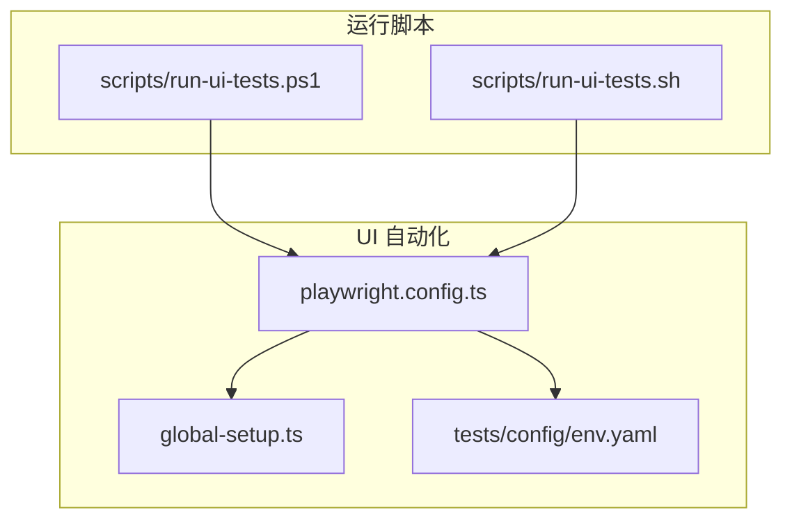
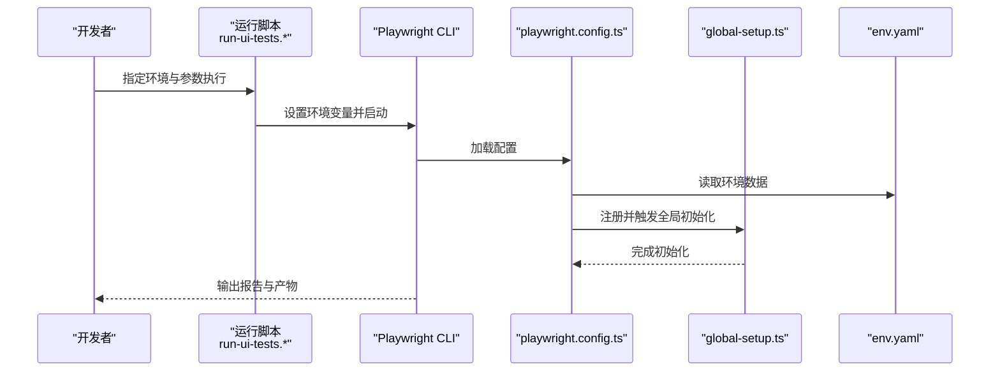
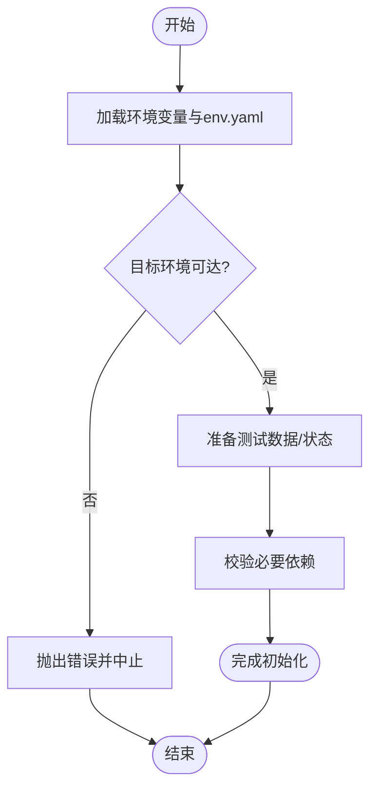
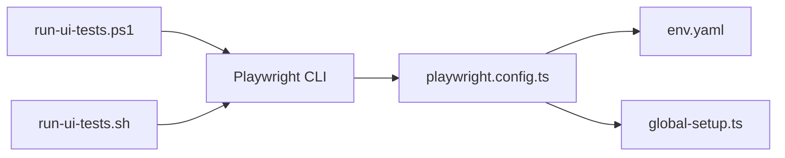
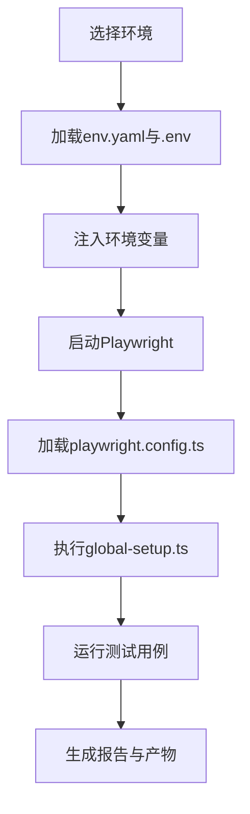

# Playwright配置管理

<cite>
**本文引用的文件**   
- [playwright.config.ts](file://tests/ui/playwright.config.ts)
- [global-setup.ts](file://tests/ui/global-setup.ts)
- [env.yaml](file://tests/config/env.yaml)
- [run-ui-tests.ps1](file://scripts/run-ui-tests.ps1)
- [run-ui-tests.sh](file://scripts/run-ui-tests.sh)
</cite>

## 目录
1. [简介](#简介)
2. [项目结构](#项目结构)
3. [核心组件](#核心组件)
4. [架构总览](#架构总览)
5. [详细组件分析](#详细组件分析)
6. [依赖关系分析](#依赖关系分析)
7. [性能与稳定性优化](#性能与稳定性优化)
8. [故障排查指南](#故障排查指南)
9. [结论](#结论)
10. [附录](#附录)

## 简介
本技术文档聚焦于 AutoTest Hub 中基于 Playwright 的 UI 自动化测试配置管理，围绕以下目标展开：
- 全面解读 playwright.config.ts 的配置项与参数设置（浏览器、环境、并行策略、报告等）
- 说明 global-setup.ts 全局初始化脚本的职责与执行流程
- 文档化多浏览器支持、视口设置、网络拦截、调试模式启用方法
- 环境变量配置、超时设置与资源清理策略
- 性能优化、重试机制与失败截图收集
- 面向开发/测试/生产等多环境的配置切换方案

## 项目结构
UI 自动化相关的关键位置如下：
- tests/ui/playwright.config.ts：Playwright 主配置文件
- tests/ui/global-setup.ts：全局初始化脚本
- tests/config/env.yaml：环境配置数据源
- scripts/run-ui-tests.ps1 / run-ui-tests.sh：跨平台运行脚本，负责注入环境变量与启动测试

图表来源
- [playwright.config.ts](file://tests/ui/playwright.config.ts)
- [global-setup.ts](file://tests/ui/global-setup.ts)
- [env.yaml](file://tests/config/env.yaml)
- [run-ui-tests.ps1](file://scripts/run-ui-tests.ps1)
- [run-ui-tests.sh](file://scripts/run-ui-tests.sh)

章节来源
- [playwright.config.ts](file://tests/ui/playwright.config.ts)
- [global-setup.ts](file://tests/ui/global-setup.ts)
- [env.yaml](file://tests/config/env.yaml)
- [run-ui-tests.ps1](file://scripts/run-ui-tests.ps1)
- [run-ui-tests.sh](file://scripts/run-ui-tests.sh)

## 核心组件
- playwright.config.ts
  - 定义浏览器类型与版本、并发度、超时、重试、截图/视频/追踪、报告输出、全局钩子、测试根目录与匹配规则等
  - 通过环境变量与环境配置文件实现多环境切换
- global-setup.ts
  - 在测试套件开始前执行一次的全局初始化逻辑（例如准备共享状态、预登录、生成临时数据等）
- env.yaml
  - 集中存放不同环境的基础 URL、账号、开关等配置，供运行时读取并注入到测试上下文
- 运行脚本
  - 根据当前环境加载对应变量，调用 Playwright CLI 或 Node 入口执行测试

章节来源
- [playwright.config.ts](file://tests/ui/playwright.config.ts)
- [global-setup.ts](file://tests/ui/global-setup.ts)
- [env.yaml](file://tests/config/env.yaml)
- [run-ui-tests.ps1](file://scripts/run-ui-tests.ps1)
- [run-ui-tests.sh](file://scripts/run-ui-tests.sh)

## 架构总览
下图展示了从运行脚本到 Playwright 配置与全局初始化的整体交互。

图表来源
- [run-ui-tests.ps1](file://scripts/run-ui-tests.ps1)
- [run-ui-tests.sh](file://scripts/run-ui-tests.sh)
- [playwright.config.ts](file://tests/ui/playwright.config.ts)
- [global-setup.ts](file://tests/ui/global-setup.ts)
- [env.yaml](file://tests/config/env.yaml)

## 详细组件分析

### playwright.config.ts 配置详解
该文件是 Playwright 的核心配置入口，通常包含但不限于以下维度：
- 浏览器与设备
  - 浏览器类型：Chromium/Firefox/Webkit 的选择与版本控制
  - 设备预设：如移动端设备模拟（iPhone、Pixel 等）
  - 视口设置：固定宽度/高度或响应式断点
- 执行策略
  - 并发度：workers 数量，结合 CI 与本地资源进行调优
  - 重试机制：针对失败用例的自动重试次数
  - 超时：全局超时、页面导航超时、操作等待超时等
- 产物与报告
  - 截图/视频/追踪：失败时自动采集，或按需开启
  - 报告：HTML/JUnit 等格式输出路径与过滤条件
- 全局钩子与初始化
  - 全局前置/后置：beforeAll/afterAll 等生命周期
  - 全局初始化：引用 global-setup.ts 完成一次性初始化
- 测试组织
  - 测试根目录与匹配规则：spec 文件定位
  - 标签/分组：按功能域或优先级筛选执行
- 网络与代理
  - 基础 URL、代理、请求拦截、路由重写等
- 调试模式
  - 交互式调试、慢动作、保留窗口、日志级别等

建议将易变参数（如 base URL、账号、超时阈值）通过环境变量注入，并在 config 中统一解析，以实现“同一份配置，多环境复用”。

章节来源
- [playwright.config.ts](file://tests/ui/playwright.config.ts)

### global-setup.ts 全局初始化脚本
职责与要点：
- 执行时机：在所有测试用例开始前仅执行一次
- 常见任务：
  - 准备共享状态（如登录态、Cookie/StorageState）
  - 初始化外部依赖（数据库、消息队列、Mock 服务）
  - 生成或清理测试数据
  - 校验目标环境可达性
- 错误处理：
  - 对关键步骤进行健壮的错误捕获与提示
  - 失败时应终止后续测试，避免污染结果
- 与配置的关系：
  - 由 playwright.config.ts 中的全局钩子引用并触发
  - 可读取环境变量与 env.yaml 中的数据

图表来源
- [global-setup.ts](file://tests/ui/global-setup.ts)
- [env.yaml](file://tests/config/env.yaml)

章节来源
- [global-setup.ts](file://tests/ui/global-setup.ts)
- [env.yaml](file://tests/config/env.yaml)

### 多浏览器支持与视口设置
- 多浏览器矩阵
  - 在配置中声明 Chromium/Firefox/Webkit 组合，便于跨引擎回归
  - 可按需为特定浏览器启用额外选项（如 headless、args、权限）
- 视口与设备
  - 使用设备预设或自定义视口，覆盖桌面与移动端场景
  - 针对特定用例可覆盖默认视口

章节来源
- [playwright.config.ts](file://tests/ui/playwright.config.ts)

### 网络拦截与代理
- 基础 URL 与域名映射
  - 通过环境变量或 env.yaml 注入 base URL
  - 可在配置层做域名重定向或 Mock 路由
- 请求拦截
  - 在测试前注册拦截器，替换第三方接口或注入固定响应
- 代理与鉴权
  - 配置系统代理、认证头、Cookie 等

章节来源
- [playwright.config.ts](file://tests/ui/playwright.config.ts)
- [env.yaml](file://tests/config/env.yaml)

### 调试模式与可视化
- 交互式调试
  - 启用调试模式后，可逐步执行、查看元素树、控制台与网络面板
- 慢动作与保留窗口
  - 适合本地复现问题；CI 中默认关闭以提升速度
- 日志与追踪
  - 调整日志级别，必要时开启追踪以深入分析

章节来源
- [playwright.config.ts](file://tests/ui/playwright.config.ts)

### 报告与产物
- 报告格式
  - HTML 报告用于可视化浏览；JUnit 用于与 CI 集成
- 产物目录
  - 截图、视频、追踪文件按用例/时间组织，便于定位失败原因
- 过滤与分片
  - 按标签/文件/标题筛选执行，配合分片提升并行效率

章节来源
- [playwright.config.ts](file://tests/ui/playwright.config.ts)

### 环境变量与多环境切换
- 环境变量
  - 通过运行脚本注入 APP_BASE_URL、BROWSER、WORKERS、RETRY_COUNT 等
- 环境配置文件
  - env.yaml 提供不同环境的基础地址、账号、特性开关等
- 切换方式
  - 本地：修改运行脚本参数或 .env 文件
  - CI：在流水线阶段注入不同环境变量集

章节来源
- [playwright.config.ts](file://tests/ui/playwright.config.ts)
- [env.yaml](file://tests/config/env.yaml)
- [run-ui-tests.ps1](file://scripts/run-ui-tests.ps1)
- [run-ui-tests.sh](file://scripts/run-ui-tests.sh)

### 超时与重试
- 全局超时
  - 设置导航、等待、断言等超时阈值，平衡稳定性与速度
- 重试策略
  - 针对不稳定用例设置重试次数，减少偶发失败影响
- 资源清理
  - 在 afterAll 或全局后置钩子中释放资源、清理临时文件

章节来源
- [playwright.config.ts](file://tests/ui/playwright.config.ts)

### 失败截图与取证
- 自动截图/视频
  - 失败时自动采集截图与视频，辅助定位
- 追踪文件
  - 开启追踪以便回放完整执行过程
- 产物归档
  - 将产物上传至制品库或随报告打包

章节来源
- [playwright.config.ts](file://tests/ui/playwright.config.ts)

## 依赖关系分析
- 运行脚本依赖 Playwright CLI 与 Node 环境
- 配置文件依赖环境变量与 env.yaml
- 全局初始化脚本依赖目标环境可用性与必要依赖

图表来源
- [run-ui-tests.ps1](file://scripts/run-ui-tests.ps1)
- [run-ui-tests.sh](file://scripts/run-ui-tests.sh)
- [playwright.config.ts](file://tests/ui/playwright.config.ts)
- [global-setup.ts](file://tests/ui/global-setup.ts)
- [env.yaml](file://tests/config/env.yaml)

章节来源
- [run-ui-tests.ps1](file://scripts/run-ui-tests.ps1)
- [run-ui-tests.sh](file://scripts/run-ui-tests.sh)
- [playwright.config.ts](file://tests/ui/playwright.config.ts)
- [global-setup.ts](file://tests/ui/global-setup.ts)
- [env.yaml](file://tests/config/env.yaml)

## 性能与稳定性优化
- 并发与分片
  - 合理设置 workers，结合 CI 节点数与 CPU 核数
  - 使用分片将大套件拆分为多个并行任务
- 浏览器优化
  - 本地调试关闭 headless，CI 开启 headless 并禁用 GPU 加速
  - 按需禁用扩展与不必要插件
- 网络优化
  - 使用缓存与本地镜像，减少外部依赖抖动
  - 对慢接口进行 Mock 或降级
- 产物精简
  - 仅在失败时开启视频/追踪，降低 IO 开销
- 重试与隔离
  - 对不稳定用例单独设置重试，避免扩散影响
  - 每个用例尽量独立，避免共享状态污染

[本节为通用指导，不直接分析具体文件]

## 故障排查指南
- 常见问题
  - 目标环境不可达：检查 base URL、DNS、防火墙与证书
  - 登录态失效：确认 global-setup.ts 是否成功生成 Cookie/StorageState
  - 并发导致竞争：降低 workers 或增加隔离
  - 超时频繁：增大超时或优化被测应用响应
- 快速定位
  - 打开 HTML 报告，查看失败截图/视频/追踪
  - 使用调试模式逐步执行，观察控制台与网络面板
  - 在 CI 中下载产物进行分析

章节来源
- [playwright.config.ts](file://tests/ui/playwright.config.ts)
- [global-setup.ts](file://tests/ui/global-setup.ts)

## 结论
通过将浏览器、环境、并行、报告、调试与取证等能力集中在 playwright.config.ts，并以 global-setup.ts 承载一次性初始化，AutoTest Hub 实现了高内聚、低耦合的 UI 自动化配置体系。借助环境变量与 env.yaml，可在不同环境中无缝切换，同时通过合理的超时、重试与产物策略保障稳定性与可观测性。

[本节为总结性内容，不直接分析具体文件]

## 附录

### 常用环境变量清单（示例）
- APP_BASE_URL：应用基础地址
- BROWSER：浏览器选择（chromium/firefox/webkit）
- WORKERS：并发工作进程数
- RETRY_COUNT：失败重试次数
- DEBUG：是否开启调试模式
- REPORT_DIR：报告输出目录
- ARTIFACTS_DIR：产物输出目录

章节来源
- [playwright.config.ts](file://tests/ui/playwright.config.ts)
- [env.yaml](file://tests/config/env.yaml)
- [run-ui-tests.ps1](file://scripts/run-ui-tests.ps1)
- [run-ui-tests.sh](file://scripts/run-ui-tests.sh)

### 典型执行流程（概念图）

[此图为概念流程示意，不对应具体代码结构]