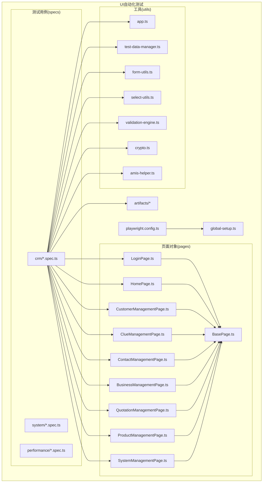
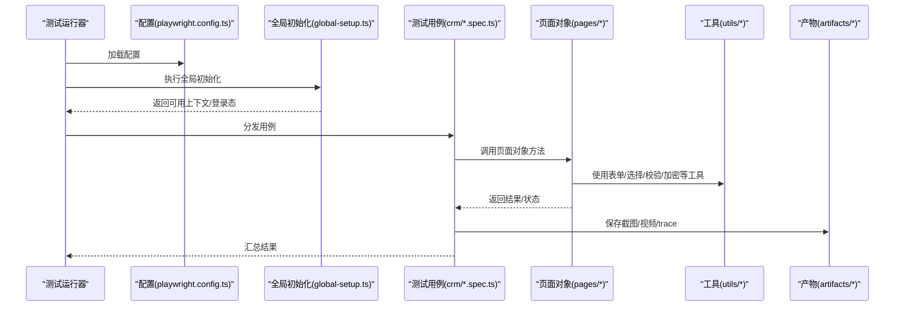
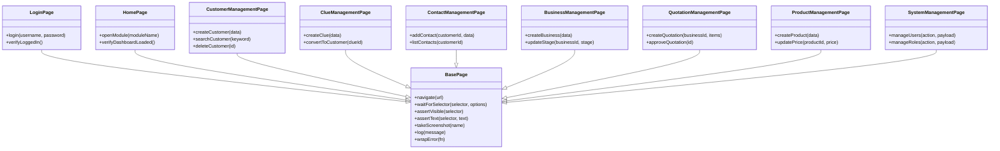
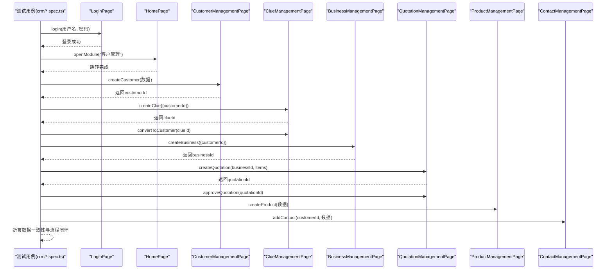
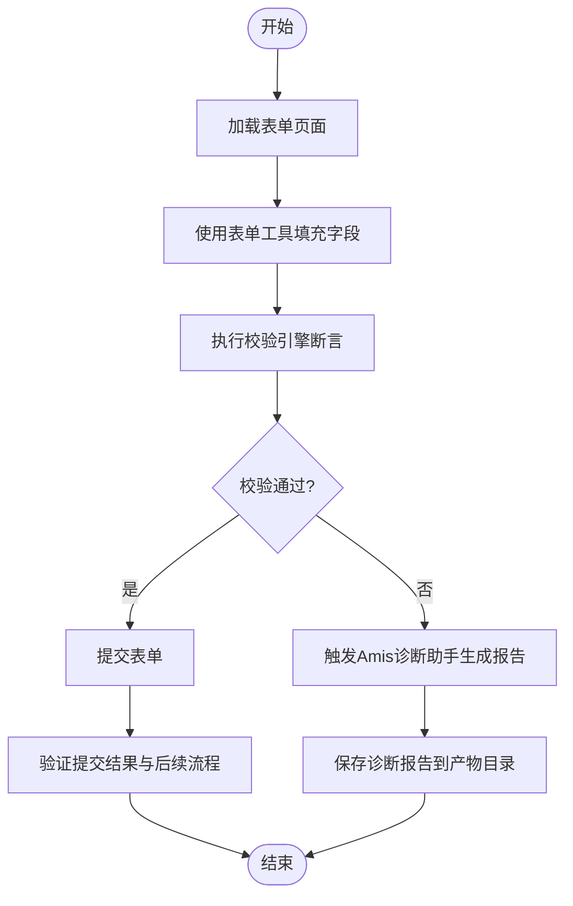
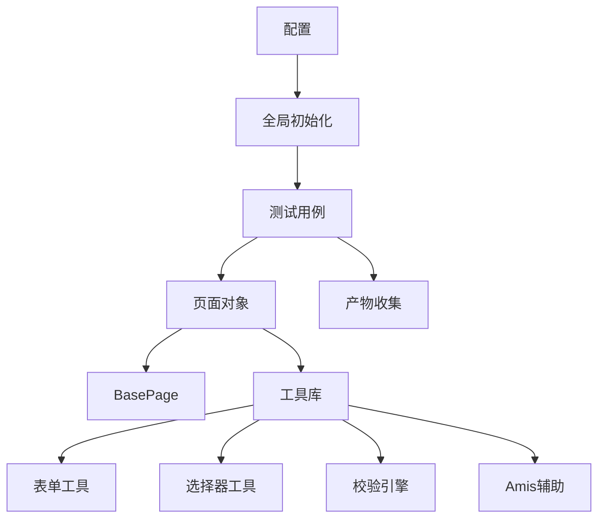

# UI自动化测试

<cite>
**本文引用的文件**   
- [playwright.config.ts](file://tests/ui/playwright.config.ts)
- [global-setup.ts](file://tests/ui/global-setup.ts)
- [BasePage.ts](file://tests/ui/pages/BasePage.ts)
- [LoginPage.ts](file://tests/ui/pages/LoginPage.ts)
- [HomePage.ts](file://tests/ui/pages/HomePage.ts)
- [CustomerManagementPage.ts](file://tests/ui/pages/CustomerManagementPage.ts)
- [ClueManagementPage.ts](file://tests/ui/pages/ClueManagementPage.ts)
- [ContactManagementPage.ts](file://tests/ui/pages/ContactManagementPage.ts)
- [BusinessManagementPage.ts](file://tests/ui/pages/BusinessManagementPage.ts)
- [QuotationManagementPage.ts](file://tests/ui/pages/QuotationManagementPage.ts)
- [ProductManagementPage.ts](file://tests/ui/pages/ProductManagementPage.ts)
- [SystemManagementPage.ts](file://tests/ui/pages/SystemManagementPage.ts)
- [crm.spec.ts](file://tests/ui/specs/crm/crm.spec.ts)
- [crm-crud.spec.ts](file://tests/ui/specs/crm/crm-crud.spec.ts)
- [crm-smoke.spec.ts](file://tests/ui/specs/crm/crm-smoke.spec.ts)
- [crm-structure.spec.ts](file://tests/ui/specs/crm/crm-structure.spec.ts)
- [business-flow.spec.ts](file://tests/ui/specs/crm/business-flow.spec.ts)
- [amis-form-diagnose.spec.ts](file://tests/ui/specs/crm/amis-form-diagnose.spec.ts)
- [app.ts](file://tests/ui/utils/app.ts)
- [test-data-manager.ts](file://tests/ui/utils/test-data-manager.ts)
- [form-utils.ts](file://tests/ui/utils/form-utils.ts)
- [select-utils.ts](file://tests/ui/utils/select-utils.ts)
- [validation-engine.ts](file://tests/ui/utils/validation-engine.ts)
- [crypto.ts](file://tests/ui/utils/crypto.ts)
- [amis-helper.ts](file://tests/ui/utils/amis-helper.ts)
</cite>

## 目录
1. [简介](#简介)
2. [项目结构](#项目结构)
3. [核心组件](#核心组件)
4. [架构总览](#架构总览)
5. [详细组件分析](#详细组件分析)
6. [依赖分析](#依赖分析)
7. [性能考虑](#性能考虑)
8. [故障排查指南](#故障排查指南)
9. [结论](#结论)
10. [附录](#附录)

## 简介
本技术文档面向AutoTest Hub的UI自动化测试，聚焦基于Playwright的前端自动化测试架构与实现。文档覆盖页面对象模式（POM）设计、测试规范与工具函数库、BasePage基类与业务页面类的继承关系、CRM功能模块端到端测试组织方式、截图与视频收集、网络拦截与调试技巧、元素定位策略、等待机制与异步操作处理、测试数据注入、多浏览器支持与跨平台兼容性，以及性能优化建议与最佳实践。

## 项目结构
UI自动化测试位于 tests/ui 目录下，采用分层与按特性组织的混合结构：
- pages：页面对象封装，遵循POM原则，提供稳定的元素定位与交互API
- specs：测试用例集，按模块划分（如 crm、system、performance 等）
- utils：通用工具与辅助方法（表单、选择器、校验、加密、Amis辅助等）
- fixtures：测试夹具与账户数据
- artifacts：运行产物（截图、视频、trace等）
- playwright.config.ts：Playwright全局配置
- global-setup.ts：全局初始化脚本（例如预登录态）

图表来源
- [playwright.config.ts](file://tests/ui/playwright.config.ts)
- [global-setup.ts](file://tests/ui/global-setup.ts)
- [BasePage.ts](file://tests/ui/pages/BasePage.ts)
- [LoginPage.ts](file://tests/ui/pages/LoginPage.ts)
- [HomePage.ts](file://tests/ui/pages/HomePage.ts)
- [CustomerManagementPage.ts](file://tests/ui/pages/CustomerManagementPage.ts)
- [ClueManagementPage.ts](file://tests/ui/pages/ClueManagementPage.ts)
- [ContactManagementPage.ts](file://tests/ui/pages/ContactManagementPage.ts)
- [BusinessManagementPage.ts](file://tests/ui/pages/BusinessManagementPage.ts)
- [QuotationManagementPage.ts](file://tests/ui/pages/QuotationManagementPage.ts)
- [ProductManagementPage.ts](file://tests/ui/pages/ProductManagementPage.ts)
- [SystemManagementPage.ts](file://tests/ui/pages/SystemManagementPage.ts)
- [crm.spec.ts](file://tests/ui/specs/crm/crm.spec.ts)
- [crm-crud.spec.ts](file://tests/ui/specs/crm/crm-crud.spec.ts)
- [crm-smoke.spec.ts](file://tests/ui/specs/crm/crm-smoke.spec.ts)
- [crm-structure.spec.ts](file://tests/ui/specs/crm/crm-structure.spec.ts)
- [business-flow.spec.ts](file://tests/ui/specs/crm/business-flow.spec.ts)
- [amis-form-diagnose.spec.ts](file://tests/ui/specs/crm/amis-form-diagnose.spec.ts)
- [app.ts](file://tests/ui/utils/app.ts)
- [test-data-manager.ts](file://tests/ui/utils/test-data-manager.ts)
- [form-utils.ts](file://tests/ui/utils/form-utils.ts)
- [select-utils.ts](file://tests/ui/utils/select-utils.ts)
- [validation-engine.ts](file://tests/ui/utils/validation-engine.ts)
- [crypto.ts](file://tests/ui/utils/crypto.ts)
- [amis-helper.ts](file://tests/ui/utils/amis-helper.ts)

章节来源
- [playwright.config.ts](file://tests/ui/playwright.config.ts)
- [global-setup.ts](file://tests/ui/global-setup.ts)

## 核心组件
- Playwright配置与全局初始化
  - 通过配置文件集中管理浏览器、超时、重试、并行度、报告与产物输出路径等；全局初始化脚本用于准备登录态或共享上下文。
- 页面对象层（POM）
  - BasePage提供通用的导航、等待、断言、截图、日志与错误包装能力；各业务页面继承BasePage并封装具体页面的元素定位与业务流程。
- 测试用例层
  - 以specs为边界组织用例，按模块（如crm、system、performance）拆分，命名体现场景与范围（smoke、crud、flow、structure等）。
- 工具与辅助库
  - 表单填充、下拉选择、校验引擎、加密工具、Amis表单诊断助手、应用启动与上下文管理等。

章节来源
- [playwright.config.ts](file://tests/ui/playwright.config.ts)
- [global-setup.ts](file://tests/ui/global-setup.ts)
- [BasePage.ts](file://tests/ui/pages/BasePage.ts)
- [LoginPage.ts](file://tests/ui/pages/LoginPage.ts)
- [HomePage.ts](file://tests/ui/pages/HomePage.ts)
- [CustomerManagementPage.ts](file://tests/ui/pages/CustomerManagementPage.ts)
- [ClueManagementPage.ts](file://tests/ui/pages/ClueManagementPage.ts)
- [ContactManagementPage.ts](file://tests/ui/pages/ContactManagementPage.ts)
- [BusinessManagementPage.ts](file://tests/ui/pages/BusinessManagementPage.ts)
- [QuotationManagementPage.ts](file://tests/ui/pages/QuotationManagementPage.ts)
- [ProductManagementPage.ts](file://tests/ui/pages/ProductManagementPage.ts)
- [SystemManagementPage.ts](file://tests/ui/pages/SystemManagementPage.ts)
- [app.ts](file://tests/ui/utils/app.ts)
- [test-data-manager.ts](file://tests/ui/utils/test-data-manager.ts)
- [form-utils.ts](file://tests/ui/utils/form-utils.ts)
- [select-utils.ts](file://tests/ui/utils/select-utils.ts)
- [validation-engine.ts](file://tests/ui/utils/validation-engine.ts)
- [crypto.ts](file://tests/ui/utils/crypto.ts)
- [amis-helper.ts](file://tests/ui/utils/amis-helper.ts)

## 架构总览
下图展示UI自动化测试的整体架构与关键交互：配置驱动浏览器实例化，全局初始化准备会话，测试用例调用页面对象执行端到端流程，工具库提供通用能力，产物统一归档。

图表来源
- [playwright.config.ts](file://tests/ui/playwright.config.ts)
- [global-setup.ts](file://tests/ui/global-setup.ts)
- [crm.spec.ts](file://tests/ui/specs/crm/crm.spec.ts)
- [BasePage.ts](file://tests/ui/pages/BasePage.ts)
- [app.ts](file://tests/ui/utils/app.ts)

## 详细组件分析

### BasePage基类与页面对象体系
BasePage作为所有业务页面的基类，提供：
- 统一的浏览器上下文访问与页面导航
- 可配置的等待策略（显式等待、条件等待）
- 通用断言与错误包装
- 截图、录制与trace收集入口
- 日志与调试信息输出

业务页面类（如登录、首页、客户、线索、商机、报价、产品、系统管理等）均继承BasePage，封装各自的路径、元素定位与业务流程方法，形成清晰的职责边界与复用层次。

图表来源
- [BasePage.ts](file://tests/ui/pages/BasePage.ts)
- [LoginPage.ts](file://tests/ui/pages/LoginPage.ts)
- [HomePage.ts](file://tests/ui/pages/HomePage.ts)
- [CustomerManagementPage.ts](file://tests/ui/pages/CustomerManagementPage.ts)
- [ClueManagementPage.ts](file://tests/ui/pages/ClueManagementPage.ts)
- [ContactManagementPage.ts](file://tests/ui/pages/ContactManagementPage.ts)
- [BusinessManagementPage.ts](file://tests/ui/pages/BusinessManagementPage.ts)
- [QuotationManagementPage.ts](file://tests/ui/pages/QuotationManagementPage.ts)
- [ProductManagementPage.ts](file://tests/ui/pages/ProductManagementPage.ts)
- [SystemManagementPage.ts](file://tests/ui/pages/SystemManagementPage.ts)

章节来源
- [BasePage.ts](file://tests/ui/pages/BasePage.ts)
- [LoginPage.ts](file://tests/ui/pages/LoginPage.ts)
- [HomePage.ts](file://tests/ui/pages/HomePage.ts)
- [CustomerManagementPage.ts](file://tests/ui/pages/CustomerManagementPage.ts)
- [ClueManagementPage.ts](file://tests/ui/pages/ClueManagementPage.ts)
- [ContactManagementPage.ts](file://tests/ui/pages/ContactManagementPage.ts)
- [BusinessManagementPage.ts](file://tests/ui/pages/BusinessManagementPage.ts)
- [QuotationManagementPage.ts](file://tests/ui/pages/QuotationManagementPage.ts)
- [ProductManagementPage.ts](file://tests/ui/pages/ProductManagementPage.ts)
- [SystemManagementPage.ts](file://tests/ui/pages/SystemManagementPage.ts)

### CRM端到端测试流程
以下序列图展示CRM典型端到端流程：登录→进入客户管理→创建客户→创建线索→转化为客户→创建商机→创建报价→审批→关联产品与联系人→验证数据一致性。

图表来源
- [crm.spec.ts](file://tests/ui/specs/crm/crm.spec.ts)
- [crm-crud.spec.ts](file://tests/ui/specs/crm/crm-crud.spec.ts)
- [crm-smoke.spec.ts](file://tests/ui/specs/crm/crm-smoke.spec.ts)
- [crm-structure.spec.ts](file://tests/ui/specs/crm/crm-structure.spec.ts)
- [business-flow.spec.ts](file://tests/ui/specs/crm/business-flow.spec.ts)
- [LoginPage.ts](file://tests/ui/pages/LoginPage.ts)
- [HomePage.ts](file://tests/ui/pages/HomePage.ts)
- [CustomerManagementPage.ts](file://tests/ui/pages/CustomerManagementPage.ts)
- [ClueManagementPage.ts](file://tests/ui/pages/ClueManagementPage.ts)
- [BusinessManagementPage.ts](file://tests/ui/pages/BusinessManagementPage.ts)
- [QuotationManagementPage.ts](file://tests/ui/pages/QuotationManagementPage.ts)
- [ProductManagementPage.ts](file://tests/ui/pages/ProductManagementPage.ts)
- [ContactManagementPage.ts](file://tests/ui/pages/ContactManagementPage.ts)

章节来源
- [crm.spec.ts](file://tests/ui/specs/crm/crm.spec.ts)
- [crm-crud.spec.ts](file://tests/ui/specs/crm/crm-crud.spec.ts)
- [crm-smoke.spec.ts](file://tests/ui/specs/crm/crm-smoke.spec.ts)
- [crm-structure.spec.ts](file://tests/ui/specs/crm/crm-structure.spec.ts)
- [business-flow.spec.ts](file://tests/ui/specs/crm/business-flow.spec.ts)

### 表单与Amis诊断流程
针对Amis驱动的复杂表单，测试通过工具库进行结构化填充与校验，并在失败时生成诊断报告。

图表来源
- [form-utils.ts](file://tests/ui/utils/form-utils.ts)
- [validation-engine.ts](file://tests/ui/utils/validation-engine.ts)
- [amis-helper.ts](file://tests/ui/utils/amis-helper.ts)
- [amis-form-diagnose.spec.ts](file://tests/ui/specs/crm/amis-form-diagnose.spec.ts)

章节来源
- [form-utils.ts](file://tests/ui/utils/form-utils.ts)
- [validation-engine.ts](file://tests/ui/utils/validation-engine.ts)
- [amis-helper.ts](file://tests/ui/utils/amis-helper.ts)
- [amis-form-diagnose.spec.ts](file://tests/ui/specs/crm/amis-form-diagnose.spec.ts)

### 概念性总览
以下为不绑定具体源码的概念流程图，帮助理解整体工作流与职责划分。

[此图为概念性说明，无需图表来源]

## 依赖分析
- 配置依赖
  - 全局配置决定浏览器类型、并发、超时、重试、产物路径、网络拦截开关等。
- 页面依赖
  - 业务页面依赖BasePage提供的通用能力；部分页面可能依赖工具库（表单、选择、校验、加密、Amis辅助）。
- 用例依赖
  - 用例依赖页面对象与工具库，并通过全局初始化获取可用上下文。
- 外部依赖
  - 目标Web应用、浏览器内核、操作系统差异带来的兼容性问题需通过配置与适配解决。

图表来源
- [playwright.config.ts](file://tests/ui/playwright.config.ts)
- [global-setup.ts](file://tests/ui/global-setup.ts)
- [BasePage.ts](file://tests/ui/pages/BasePage.ts)
- [form-utils.ts](file://tests/ui/utils/form-utils.ts)
- [select-utils.ts](file://tests/ui/utils/select-utils.ts)
- [validation-engine.ts](file://tests/ui/utils/validation-engine.ts)
- [amis-helper.ts](file://tests/ui/utils/amis-helper.ts)

章节来源
- [playwright.config.ts](file://tests/ui/playwright.config.ts)
- [global-setup.ts](file://tests/ui/global-setup.ts)
- [BasePage.ts](file://tests/ui/pages/BasePage.ts)
- [form-utils.ts](file://tests/ui/utils/form-utils.ts)
- [select-utils.ts](file://tests/ui/utils/select-utils.ts)
- [validation-engine.ts](file://tests/ui/utils/validation-engine.ts)
- [amis-helper.ts](file://tests/ui/utils/amis-helper.ts)

## 性能考虑
- 浏览器与上下文
  - 合理设置并发与超时，避免过度并行导致资源争用；复用上下文减少重复登录开销。
- 元素定位与等待
  - 优先使用稳定且语义化的选择器；使用显式等待替代固定sleep，降低不稳定与耗时。
- 网络与I/O
  - 启用必要的网络拦截以减少无关请求；限制截图与录制的触发频率，仅在失败或关键步骤采集。
- 产物管理
  - 控制产物体积与保留策略，避免磁盘压力影响CI稳定性。
- 数据与缓存
  - 使用测试数据管理器批量准备数据，减少数据库往返；对只读数据进行缓存复用。

[本节为通用指导，无需章节来源]

## 故障排查指南
- 常见问题定位
  - 元素不可见或点击失败：检查等待策略与可见性断言；必要时增加重试与滚动至可视区域。
  - 登录态失效：确认全局初始化是否成功；检查Cookie/Session持久化与过期时间。
  - 表单提交异常：使用表单工具与校验引擎逐步定位；在Amis场景下生成诊断报告。
- 调试技巧
  - 开启trace与视频录制，结合截图快速复现问题；在关键节点输出日志便于追踪。
  - 使用网络拦截观察请求响应，定位前后端不一致或接口异常。
- 产物与报告
  - 将截图、视频、trace与诊断报告统一归档，便于回溯与分析。

章节来源
- [BasePage.ts](file://tests/ui/pages/BasePage.ts)
- [amis-helper.ts](file://tests/ui/utils/amis-helper.ts)
- [form-utils.ts](file://tests/ui/utils/form-utils.ts)
- [validation-engine.ts](file://tests/ui/utils/validation-engine.ts)

## 结论
本项目采用Playwright与页面对象模式构建稳健的UI自动化测试体系。通过BasePage抽象与业务页面继承，实现了高内聚低耦合的测试代码结构；配合工具库与全局初始化，提升了用例的可维护性与执行效率。CRM端到端测试覆盖了从登录到业务闭环的关键路径，辅以截图、视频、trace与诊断报告，形成了完善的排障与回归保障。建议在持续集成中强化产物管理与性能监控，进一步优化并发与等待策略，提升整体稳定性与速度。

[本节为总结性内容，无需章节来源]

## 附录
- 元素定位策略
  - 优先使用data-testid、aria-label等稳定标识；避免脆弱的位置或文本匹配。
- 等待机制与异步处理
  - 使用显式等待与条件断言；对异步渲染与动态加载进行健壮化处理。
- 测试数据注入
  - 通过测试数据管理器集中管理数据，支持批量创建与清理。
- 多浏览器与跨平台
  - 在配置中声明多浏览器与平台矩阵，确保关键路径在各环境一致。
- 网络拦截
  - 按需拦截第三方或慢速接口，模拟异常与边界条件，增强用例覆盖面。
- 最佳实践
  - 用例命名清晰表达场景与预期；失败自动捕获产物；最小化用例间耦合；定期重构与回归。

[本节为通用指导，无需章节来源]