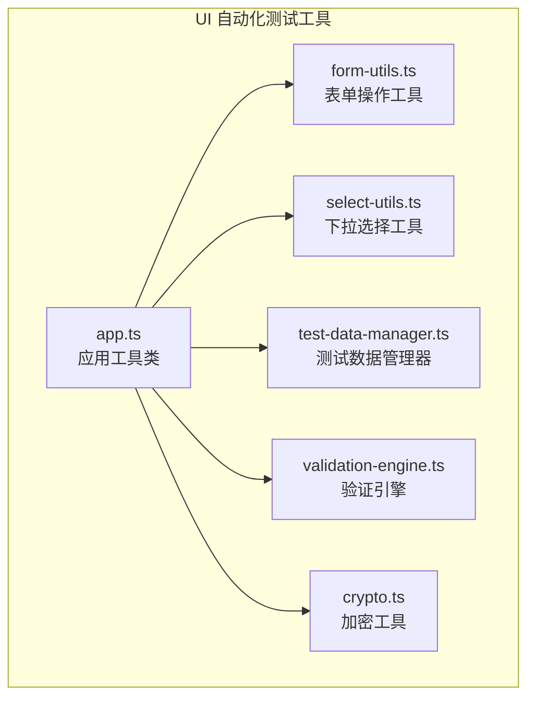
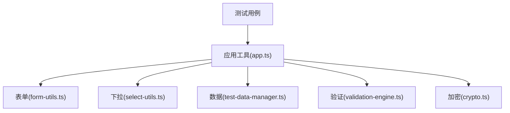
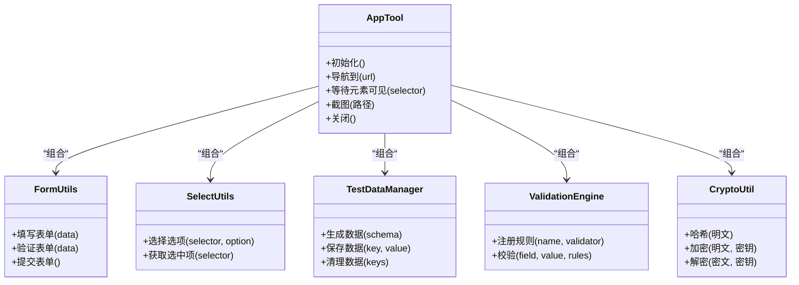
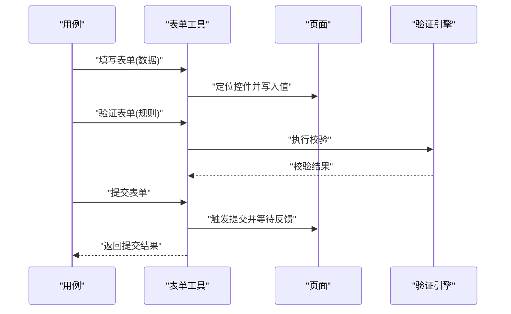
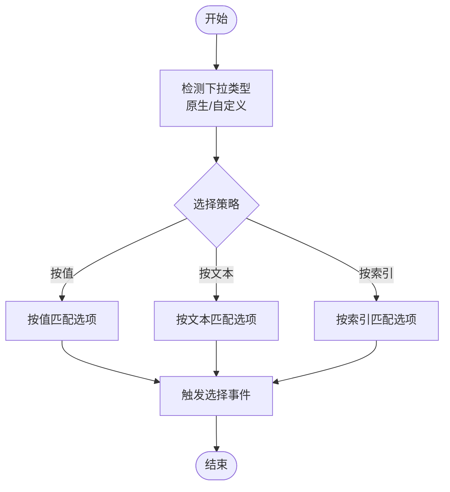
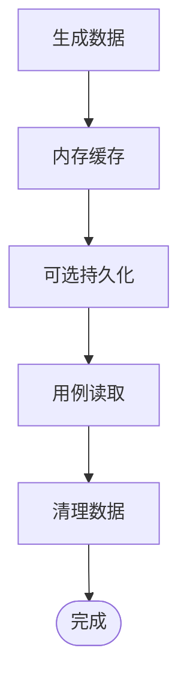
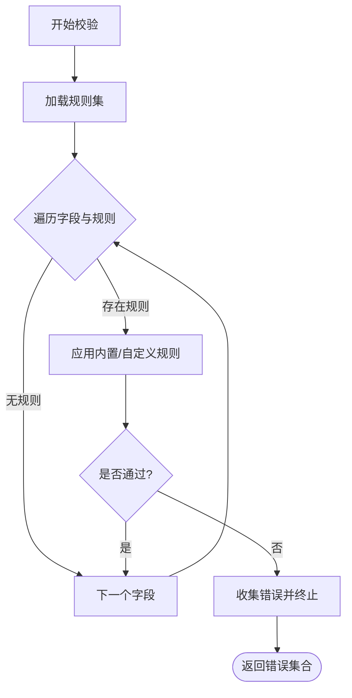
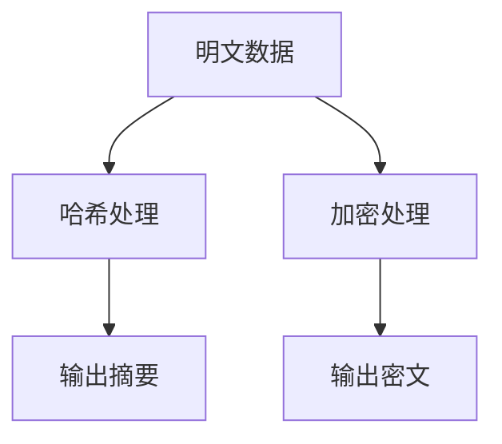
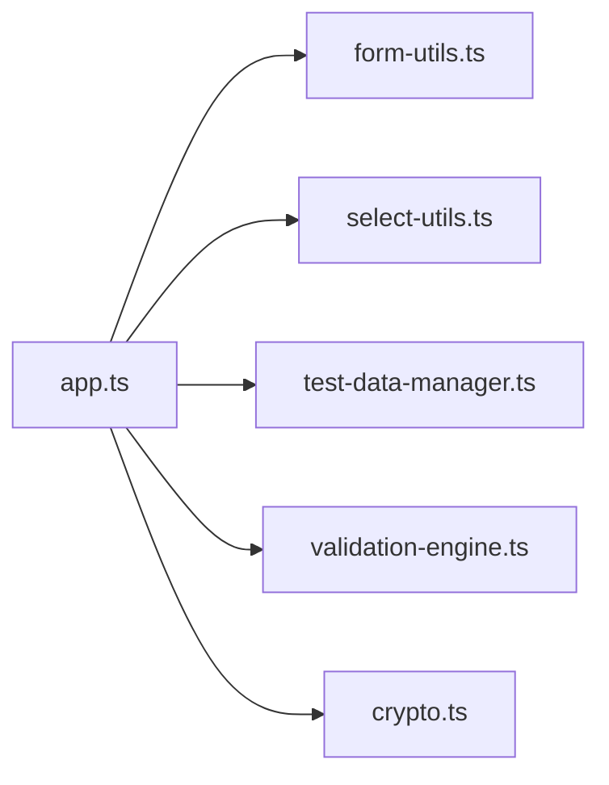

# 工具函数库

<cite>
**本文引用的文件**   
- [app.ts](file://tests/ui/utils/app.ts)
- [form-utils.ts](file://tests/ui/utils/form-utils.ts)
- [select-utils.ts](file://tests/ui/utils/select-utils.ts)
- [test-data-manager.ts](file://tests/ui/utils/test-data-manager.ts)
- [validation-engine.ts](file://tests/ui/utils/validation-engine.ts)
- [crypto.ts](file://tests/ui/utils/crypto.ts)
</cite>

## 目录
1. [简介](#简介)
2. [项目结构](#项目结构)
3. [核心组件](#核心组件)
4. [架构总览](#架构总览)
5. [详细组件分析](#详细组件分析)
6. [依赖分析](#依赖分析)
7. [性能考虑](#性能考虑)
8. [故障排查指南](#故障排查指南)
9. [结论](#结论)
10. [附录](#附录)

## 简介
本技术文档面向 AutoTest Hub 的 UI 自动化测试工具函数库，聚焦 tests/ui/utils 目录下的核心模块。文档将系统阐述以下目标：
- app.ts 应用工具类的核心功能与 API 接口
- form-utils.ts 表单操作工具的使用方法（填写、验证、提交）
- select-utils.ts 下拉选择工具的实现原理与使用场景
- test-data-manager.ts 测试数据管理器的数据生成、存储与清理能力
- validation-engine.ts 验证引擎的数据校验规则与自定义扩展方式
- crypto.ts 加密工具的安全数据处理能力
- utils 目录的组织结构与扩展新工具函数的最佳实践

## 项目结构
UI 自动化测试工具位于 tests/ui/utils 目录，采用“按职责划分”的文件组织方式，每个文件对应一个明确的能力域，便于复用与维护。

图表来源
- [app.ts:1-200](file://tests/ui/utils/app.ts#L1-L200)
- [form-utils.ts:1-200](file://tests/ui/utils/form-utils.ts#L1-L200)
- [select-utils.ts:1-200](file://tests/ui/utils/select-utils.ts#L1-L200)
- [test-data-manager.ts:1-200](file://tests/ui/utils/test-data-manager.ts#L1-L200)
- [validation-engine.ts:1-200](file://tests/ui/utils/validation-engine.ts#L1-L200)
- [crypto.ts:1-200](file://tests/ui/utils/crypto.ts#L1-L200)

章节来源
- [app.ts:1-200](file://tests/ui/utils/app.ts#L1-L200)
- [form-utils.ts:1-200](file://tests/ui/utils/form-utils.ts#L1-L200)
- [select-utils.ts:1-200](file://tests/ui/utils/select-utils.ts#L1-L200)
- [test-data-manager.ts:1-200](file://tests/ui/utils/test-data-manager.ts#L1-L200)
- [validation-engine.ts:1-200](file://tests/ui/utils/validation-engine.ts#L1-L200)
- [crypto.ts:1-200](file://tests/ui/utils/crypto.ts#L1-L200)

## 核心组件
本节概述各工具的职责边界与对外暴露的主要能力，帮助读者快速定位所需功能。

- 应用工具类（app.ts）
  - 提供浏览器上下文、页面导航、等待策略、截图/录屏等通用能力
  - 作为其他工具的统一入口，封装 Playwright 常用操作
- 表单操作工具（form-utils.ts）
  - 支持输入框、文本域、复选框、单选按钮、上传等常见控件的填写
  - 提供表单验证与一键提交能力
- 下拉选择工具（select-utils.ts）
  - 针对原生 select 与自定义下拉组件的选择逻辑
  - 支持按值、按文本、按索引进行匹配
- 测试数据管理器（test-data-manager.ts）
  - 集中管理测试数据的生成、缓存、持久化与清理
  - 支持批量创建与按需回收，避免用例间污染
- 验证引擎（validation-engine.ts）
  - 内置常用字段校验规则（非空、长度、格式等）
  - 支持注册自定义校验器，形成可插拔的规则体系
- 加密工具（crypto.ts）
  - 提供哈希、加解密等安全数据处理方法
  - 为敏感信息处理提供统一入口

章节来源
- [app.ts:1-200](file://tests/ui/utils/app.ts#L1-L200)
- [form-utils.ts:1-200](file://tests/ui/utils/form-utils.ts#L1-L200)
- [select-utils.ts:1-200](file://tests/ui/utils/select-utils.ts#L1-L200)
- [test-data-manager.ts:1-200](file://tests/ui/utils/test-data-manager.ts#L1-L200)
- [validation-engine.ts:1-200](file://tests/ui/utils/validation-engine.ts#L1-L200)
- [crypto.ts:1-200](file://tests/ui/utils/crypto.ts#L1-L200)

## 架构总览
下图展示工具间的调用关系与数据流向。应用工具类作为门面，聚合表单、下拉、数据、验证与加密等子能力，供上层用例直接调用。

图表来源
- [app.ts:1-200](file://tests/ui/utils/app.ts#L1-L200)
- [form-utils.ts:1-200](file://tests/ui/utils/form-utils.ts#L1-L200)
- [select-utils.ts:1-200](file://tests/ui/utils/select-utils.ts#L1-L200)
- [test-data-manager.ts:1-200](file://tests/ui/utils/test-data-manager.ts#L1-L200)
- [validation-engine.ts:1-200](file://tests/ui/utils/validation-engine.ts#L1-L200)
- [crypto.ts:1-200](file://tests/ui/utils/crypto.ts#L1-L200)

## 详细组件分析

### 应用工具类（app.ts）
- 核心职责
  - 统一管理浏览器实例、页面生命周期与通用交互
  - 封装等待策略、重试机制、截图与日志记录
- 典型能力
  - 页面导航与刷新
  - 元素可见性与可点击性等待
  - 全局异常捕获与失败截图
- 与其他模块的关系
  - 作为门面层，组合表单、下拉、数据、验证与加密能力
  - 为用例提供一致的 API 风格与错误语义

图表来源
- [app.ts:1-200](file://tests/ui/utils/app.ts#L1-L200)
- [form-utils.ts:1-200](file://tests/ui/utils/form-utils.ts#L1-L200)
- [select-utils.ts:1-200](file://tests/ui/utils/select-utils.ts#L1-L200)
- [test-data-manager.ts:1-200](file://tests/ui/utils/test-data-manager.ts#L1-L200)
- [validation-engine.ts:1-200](file://tests/ui/utils/validation-engine.ts#L1-L200)
- [crypto.ts:1-200](file://tests/ui/utils/crypto.ts#L1-L200)

章节来源
- [app.ts:1-200](file://tests/ui/utils/app.ts#L1-L200)

### 表单操作工具（form-utils.ts）
- 使用方法
  - 填写：支持文本、数字、日期、布尔、文件等类型字段的填充
  - 验证：基于内置或自定义规则对当前表单数据进行断言
  - 提交：触发提交并等待成功提示或跳转
- 关键流程
  - 定位表单控件 -> 写入值 -> 触发必要事件 -> 执行验证 -> 提交

图表来源
- [form-utils.ts:1-200](file://tests/ui/utils/form-utils.ts#L1-L200)
- [validation-engine.ts:1-200](file://tests/ui/utils/validation-engine.ts#L1-L200)

章节来源
- [form-utils.ts:1-200](file://tests/ui/utils/form-utils.ts#L1-L200)
- [validation-engine.ts:1-200](file://tests/ui/utils/validation-engine.ts#L1-L200)

### 下拉选择工具（select-utils.ts）
- 实现原理
  - 识别原生 select 与自定义下拉组件的差异
  - 通过值、文本或索引三种策略定位目标选项
- 使用场景
  - 国家/地区、状态枚举、分类筛选等常见下拉交互
- 注意事项
  - 对于动态加载的下拉，需确保选项已渲染后再选择

图表来源
- [select-utils.ts:1-200](file://tests/ui/utils/select-utils.ts#L1-L200)

章节来源
- [select-utils.ts:1-200](file://tests/ui/utils/select-utils.ts#L1-L200)

### 测试数据管理器（test-data-manager.ts）
- 功能概览
  - 数据生成：根据 schema 或模板批量生成测试数据
  - 数据存储：内存缓存与可选持久化（如 JSON/数据库）
  - 数据清理：按 key 或批次清理，保证用例隔离
- 设计要点
  - 幂等生成：相同输入产生稳定输出，便于回放
  - 命名空间：不同业务域数据互不干扰
  - 资源回收：用例结束后自动清理临时数据

图表来源
- [test-data-manager.ts:1-200](file://tests/ui/utils/test-data-manager.ts#L1-L200)

章节来源
- [test-data-manager.ts:1-200](file://tests/ui/utils/test-data-manager.ts#L1-L200)

### 验证引擎（validation-engine.ts）
- 内置规则
  - 非空、最小/最大长度、数值范围、正则表达式、邮箱/手机号等
- 自定义规则
  - 通过注册接口添加新的校验器，支持同步与异步校验
- 执行模型
  - 规则链式执行，短路失败时立即返回错误信息

图表来源
- [validation-engine.ts:1-200](file://tests/ui/utils/validation-engine.ts#L1-L200)

章节来源
- [validation-engine.ts:1-200](file://tests/ui/utils/validation-engine.ts#L1-L200)

### 加密工具（crypto.ts）
- 能力说明
  - 哈希：用于密码或敏感标识的单向摘要
  - 对称加解密：用于传输或落盘前的数据保护
- 使用建议
  - 密钥管理与轮换策略应与业务侧保持一致
  - 避免在日志中输出明文或中间态数据

图表来源
- [crypto.ts:1-200](file://tests/ui/utils/crypto.ts#L1-L200)

章节来源
- [crypto.ts:1-200](file://tests/ui/utils/crypto.ts#L1-L200)

## 依赖分析
- 内聚与耦合
  - app.ts 作为门面，聚合其余模块，降低用例层的复杂度
  - 各工具模块职责单一，内聚度高，耦合度低
- 外部依赖
  - 主要依赖 Playwright 进行 UI 交互
  - 验证与加密可能依赖标准库或第三方库
- 潜在风险
  - 若 app.ts 过度膨胀，应继续拆分至更细粒度的服务层
  - 自定义规则与加密算法需保持向后兼容

图表来源
- [app.ts:1-200](file://tests/ui/utils/app.ts#L1-L200)
- [form-utils.ts:1-200](file://tests/ui/utils/form-utils.ts#L1-L200)
- [select-utils.ts:1-200](file://tests/ui/utils/select-utils.ts#L1-L200)
- [test-data-manager.ts:1-200](file://tests/ui/utils/test-data-manager.ts#L1-L200)
- [validation-engine.ts:1-200](file://tests/ui/utils/validation-engine.ts#L1-L200)
- [crypto.ts:1-200](file://tests/ui/utils/crypto.ts#L1-L200)

章节来源
- [app.ts:1-200](file://tests/ui/utils/app.ts#L1-L200)
- [form-utils.ts:1-200](file://tests/ui/utils/form-utils.ts#L1-L200)
- [select-utils.ts:1-200](file://tests/ui/utils/select-utils.ts#L1-L200)
- [test-data-manager.ts:1-200](file://tests/ui/utils/test-data-manager.ts#L1-L200)
- [validation-engine.ts:1-200](file://tests/ui/utils/validation-engine.ts#L1-L200)
- [crypto.ts:1-200](file://tests/ui/utils/crypto.ts#L1-L200)

## 性能考虑
- 等待策略优化
  - 优先使用显式等待与条件就绪检查，减少固定 sleep
- 数据生成与缓存
  - 大数据量生成应结合惰性计算与分页读取，避免一次性占用过多内存
- 网络与 I/O
  - 批量提交前合并请求；I/O 操作尽量异步化
- 资源释放
  - 及时关闭浏览器实例与文件句柄，防止资源泄漏

[本节为通用指导，无需源码引用]

## 故障排查指南
- 常见问题
  - 元素未就绪：确认等待策略是否正确，必要时增加重试
  - 下拉选择失败：检查是否为动态加载，确保选项渲染完成
  - 表单提交无响应：核对网络请求与页面跳转逻辑
  - 数据污染：确认数据清理是否在用例后执行
  - 加密不一致：核对密钥与算法版本是否与业务一致
- 定位手段
  - 启用截图与录屏，记录失败现场
  - 打印关键步骤日志，缩小问题范围
  - 使用最小可复现用例隔离问题

章节来源
- [app.ts:1-200](file://tests/ui/utils/app.ts#L1-L200)
- [form-utils.ts:1-200](file://tests/ui/utils/form-utils.ts#L1-L200)
- [select-utils.ts:1-200](file://tests/ui/utils/select-utils.ts#L1-L200)
- [test-data-manager.ts:1-200](file://tests/ui/utils/test-data-manager.ts#L1-L200)
- [validation-engine.ts:1-200](file://tests/ui/utils/validation-engine.ts#L1-L200)
- [crypto.ts:1-200](file://tests/ui/utils/crypto.ts#L1-L200)

## 结论
本工具函数库以 app.ts 为统一门面，围绕表单、下拉、数据、验证与加密五大能力构建高内聚、低耦合的 UI 自动化支撑层。通过清晰的职责划分与可扩展的设计，既能满足现有用例的高效编写，也为后续新增能力提供了良好基础。

[本节为总结性内容，无需源码引用]

## 附录
- 扩展新工具函数的最佳实践
  - 单一职责：每个文件只承载一个清晰的能力域
  - 稳定接口：对外 API 保持稳定，内部实现可演进
  - 可配置化：将易变参数抽离为配置项
  - 可观测性：增加必要的日志与指标，便于排障
  - 可测试性：为关键逻辑编写单测与集成用例
  - 向后兼容：变更遵循语义化版本，提供迁移指引

[本节为通用指导，无需源码引用]