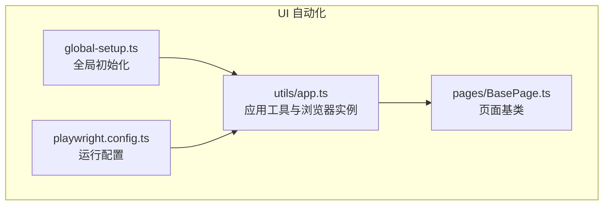
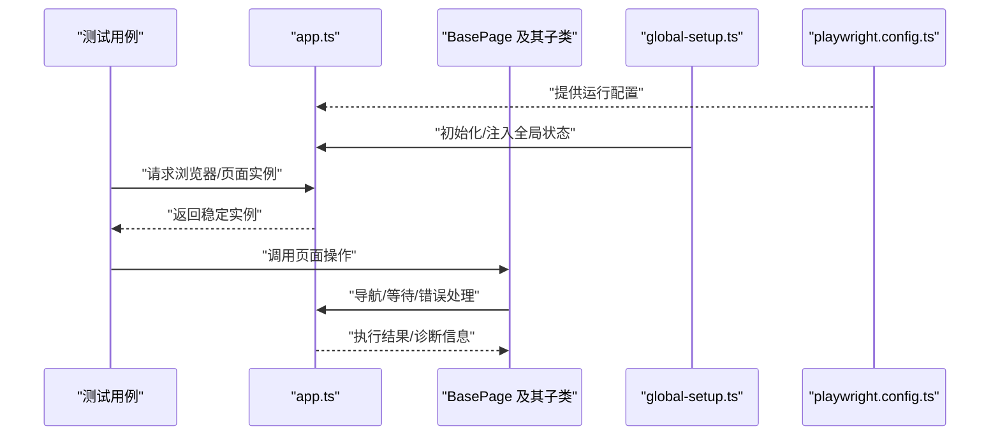
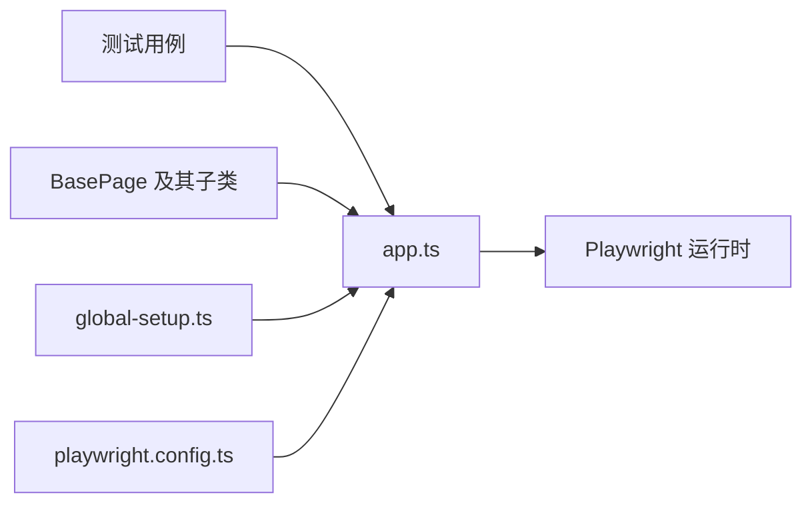

# 应用工具类 (app.ts)

<cite>
**本文引用的文件**   
- [tests/ui/utils/app.ts](file://tests/ui/utils/app.ts)
- [tests/ui/pages/BasePage.ts](file://tests/ui/pages/BasePage.ts)
- [tests/ui/global-setup.ts](file://tests/ui/global-setup.ts)
- [tests/ui/playwright.config.ts](file://tests/ui/playwright.config.ts)
</cite>

## 目录
1. [简介](#简介)
2. [项目结构](#项目结构)
3. [核心组件](#核心组件)
4. [架构总览](#架构总览)
5. [详细组件分析](#详细组件分析)
6. [依赖分析](#依赖分析)
7. [性能考虑](#性能考虑)
8. [故障排查指南](#故障排查指南)
9. [结论](#结论)
10. [附录](#附录)

## 简介
本文件面向 AutoTest Hub 的 UI 自动化测试，聚焦于 tests/ui/utils/app.ts 中封装的核心应用功能。该模块为浏览器实例管理、页面导航辅助方法、等待策略与错误处理机制提供统一入口，旨在降低测试用例对底层 Playwright API 的直接依赖，提升可维护性与稳定性。文档将系统化说明其公共 API、参数与返回值约定、在测试中的导入与使用方式、最佳实践与常见模式，并解释与其他工具模块（如 BasePage）的集成关系。

## 项目结构
UI 自动化相关代码主要位于 tests/ui 目录：
- utils/app.ts：应用级工具函数与浏览器实例管理
- pages/BasePage.ts：页面基类，封装通用交互能力
- global-setup.ts：全局初始化（例如登录态准备）
- playwright.config.ts：Playwright 配置（浏览器、超时、截图/视频等）

图表来源
- [tests/ui/utils/app.ts](file://tests/ui/utils/app.ts)
- [tests/ui/pages/BasePage.ts](file://tests/ui/pages/BasePage.ts)
- [tests/ui/global-setup.ts](file://tests/ui/global-setup.ts)
- [tests/ui/playwright.config.ts](file://tests/ui/playwright.config.ts)

章节来源
- [tests/ui/utils/app.ts](file://tests/ui/utils/app.ts)
- [tests/ui/pages/BasePage.ts](file://tests/ui/pages/BasePage.ts)
- [tests/ui/global-setup.ts](file://tests/ui/global-setup.ts)
- [tests/ui/playwright.config.ts](file://tests/ui/playwright.config.ts)

## 核心组件
本节概述 app.ts 提供的关键能力与职责边界：
- 浏览器实例管理：集中创建、复用与销毁浏览器上下文与页面对象，避免重复启动开销
- 页面导航辅助：封装常用跳转、刷新、后退、前进等操作，统一 URL 拼接与路径解析
- 等待策略：提供显式等待与条件判断工具，减少硬编码 sleep，提高稳定性
- 错误处理：统一异常捕获、诊断信息收集与失败截图/日志输出，便于定位问题
- 配置注入：从配置文件或环境变量读取基础地址、超时、重试等参数

章节来源
- [tests/ui/utils/app.ts](file://tests/ui/utils/app.ts)

## 架构总览
下图展示 app.ts 在整个 UI 自动化体系中的位置与交互关系：
- 测试用例通过 app.ts 获取稳定的浏览器/页面实例
- 页面对象（BasePage 及其子类）基于 app.ts 提供的导航与等待能力进行交互
- global-setup.ts 负责前置环境准备（如登录态），并将必要状态注入到 app.ts 或测试上下文
- playwright.config.ts 控制浏览器行为与产物输出，影响 app.ts 的运行策略

图表来源
- [tests/ui/utils/app.ts](file://tests/ui/utils/app.ts)
- [tests/ui/pages/BasePage.ts](file://tests/ui/pages/BasePage.ts)
- [tests/ui/global-setup.ts](file://tests/ui/global-setup.ts)
- [tests/ui/playwright.config.ts](file://tests/ui/playwright.config.ts)

## 详细组件分析

### 浏览器实例管理
- 职责
  - 单例化浏览器上下文与页面对象，避免重复启动
  - 支持按场景切换上下文（如多租户、不同权限）
  - 生命周期钩子：打开、关闭、清理资源
- 关键点
  - 线程/进程安全：确保并发用例不会共享不可变状态
  - 资源释放：finally 块或 teardown 中保证关闭
  - 可观测性：记录实例创建/销毁时间，便于性能分析
- 典型用法
  - 在测试前获取实例，在测试后释放
  - 在失败时自动截图/录制视频
- 参考实现位置
  - [tests/ui/utils/app.ts](file://tests/ui/utils/app.ts)

章节来源
- [tests/ui/utils/app.ts](file://tests/ui/utils/app.ts)

### 页面导航辅助方法
- 职责
  - 统一跳转逻辑：绝对/相对 URL 解析、查询参数拼接
  - 常用动作：刷新、后退、前进、等待加载完成
  - 安全校验：导航前后断言当前 URL 是否匹配预期
- 关键点
  - 容错：网络抖动时的重试与超时控制
  - 一致性：所有页面跳转均走同一入口，便于统一埋点与监控
- 典型用法
  - 在页面对象中封装业务路由，内部调用 app.ts 的导航方法
- 参考实现位置
  - [tests/ui/utils/app.ts](file://tests/ui/utils/app.ts)
  - [tests/ui/pages/BasePage.ts](file://tests/ui/pages/BasePage.ts)

章节来源
- [tests/ui/utils/app.ts](file://tests/ui/utils/app.ts)
- [tests/ui/pages/BasePage.ts](file://tests/ui/pages/BasePage.ts)

### 等待策略
- 职责
  - 提供显式等待：元素可见、可点击、文本出现、URL 变化等
  - 条件轮询：自定义谓词函数 + 最大等待时长 + 间隔
- 关键点
  - 避免硬编码 sleep，优先使用条件等待
  - 合理设置超时与重试，兼顾稳定性与速度
- 典型用法
  - 在表单提交后等待提示出现；在路由切换后等待新页面元素就绪
- 参考实现位置
  - [tests/ui/utils/app.ts](file://tests/ui/utils/app.ts)

章节来源
- [tests/ui/utils/app.ts](file://tests/ui/utils/app.ts)

### 错误处理机制
- 职责
  - 统一捕获异常，附加上下文（URL、步骤、堆栈）
  - 失败快照：截图、录制视频、导出控制台日志
  - 可恢复策略：针对特定错误类型进行重试或降级
- 关键点
  - 区分“可重试”与“不可重试”错误
  - 最小化副作用：错误处理不应改变被测系统状态
- 典型用法
  - 在导航或交互失败时触发诊断收集，并在报告中呈现
- 参考实现位置
  - [tests/ui/utils/app.ts](file://tests/ui/utils/app.ts)

章节来源
- [tests/ui/utils/app.ts](file://tests/ui/utils/app.ts)

### 公共 API 接口定义
以下为 app.ts 对外暴露的主要能力清单（以描述为主，不直接粘贴源码）：
- 获取/释放浏览器实例
  - 输入：无或可选上下文标识
  - 输出：稳定的浏览器/页面实例引用
  - 注意：需在 finally 或 teardown 中释放
- 导航到指定页面
  - 输入：目标路径或完整 URL、可选查询参数
  - 输出：导航成功后的页面对象
  - 注意：自动处理相对路径与基础地址拼接
- 显式等待
  - 输入：等待条件（元素/文本/URL）、超时、间隔
  - 输出：满足条件后的断言结果
  - 注意：超时抛出明确异常，附带诊断信息
- 错误处理与诊断
  - 输入：异常对象、上下文信息
  - 输出：标准化错误报告（含截图/日志链接）
  - 注意：支持按错误类型分类处理

章节来源
- [tests/ui/utils/app.ts](file://tests/ui/utils/app.ts)

### 在测试用例中的导入与使用
- 导入方式
  - 在测试文件中按需引入 app.ts 的导出函数
- 使用建议
  - 在测试前获取实例，在测试后释放
  - 将导航与等待封装在页面对象中，测试只关注业务断言
- 参考位置
  - [tests/ui/utils/app.ts](file://tests/ui/utils/app.ts)
  - [tests/ui/pages/BasePage.ts](file://tests/ui/pages/BasePage.ts)

章节来源
- [tests/ui/utils/app.ts](file://tests/ui/utils/app.ts)
- [tests/ui/pages/BasePage.ts](file://tests/ui/pages/BasePage.ts)

### 最佳实践与常见模式
- 单一职责
  - app.ts 专注基础设施能力，页面对象专注业务交互
- 幂等与可重入
  - 导航与等待应支持重复调用而不产生副作用
- 可观测性
  - 关键路径增加日志与指标，失败时自动产出诊断包
- 配置外置
  - 基础地址、超时、重试次数等通过配置或环境变量注入
- 参考位置
  - [tests/ui/utils/app.ts](file://tests/ui/utils/app.ts)
  - [tests/ui/playwright.config.ts](file://tests/ui/playwright.config.ts)

章节来源
- [tests/ui/utils/app.ts](file://tests/ui/utils/app.ts)
- [tests/ui/playwright.config.ts](file://tests/ui/playwright.config.ts)

### 与其他工具模块的集成与依赖关系
- 与 BasePage 的关系
  - BasePage 作为页面基类，内部调用 app.ts 的导航与等待能力，保持页面层简洁
- 与 global-setup 的关系
  - global-setup 负责登录态等前置准备，必要时将 token 或 cookie 注入到 app.ts 管理的上下文中
- 与 playwright.config 的关系
  - 浏览器启动参数、超时、截图/视频开关等由配置驱动，app.ts 读取并生效
- 参考位置
  - [tests/ui/pages/BasePage.ts](file://tests/ui/pages/BasePage.ts)
  - [tests/ui/global-setup.ts](file://tests/ui/global-setup.ts)
  - [tests/ui/playwright.config.ts](file://tests/ui/playwright.config.ts)

章节来源
- [tests/ui/pages/BasePage.ts](file://tests/ui/pages/BasePage.ts)
- [tests/ui/global-setup.ts](file://tests/ui/global-setup.ts)
- [tests/ui/playwright.config.ts](file://tests/ui/playwright.config.ts)

## 依赖分析
app.ts 的依赖方向清晰：向上被测试用例与页面对象使用，向下依赖 Playwright 运行时与配置。

图表来源
- [tests/ui/utils/app.ts](file://tests/ui/utils/app.ts)
- [tests/ui/pages/BasePage.ts](file://tests/ui/pages/BasePage.ts)
- [tests/ui/global-setup.ts](file://tests/ui/global-setup.ts)
- [tests/ui/playwright.config.ts](file://tests/ui/playwright.config.ts)

章节来源
- [tests/ui/utils/app.ts](file://tests/ui/utils/app.ts)
- [tests/ui/pages/BasePage.ts](file://tests/ui/pages/BasePage.ts)
- [tests/ui/global-setup.ts](file://tests/ui/global-setup.ts)
- [tests/ui/playwright.config.ts](file://tests/ui/playwright.config.ts)

## 性能考虑
- 复用浏览器实例：避免频繁启动/销毁带来的开销
- 合理等待：优先条件等待，减少无效轮询
- 并行执行：结合 Playwright 的 worker 模型，隔离上下文，避免共享状态
- 产物控制：仅在失败时生成截图/视频，降低 I/O 压力
- 参考位置
  - [tests/ui/utils/app.ts](file://tests/ui/utils/app.ts)
  - [tests/ui/playwright.config.ts](file://tests/ui/playwright.config.ts)

章节来源
- [tests/ui/utils/app.ts](file://tests/ui/utils/app.ts)
- [tests/ui/playwright.config.ts](file://tests/ui/playwright.config.ts)

## 故障排查指南
- 常见问题
  - 导航超时：检查基础地址、网络连通性与路由是否存在
  - 元素未就绪：确认等待条件是否正确，必要时增加显式等待
  - 并发冲突：确保每个 worker 拥有独立上下文，避免共享可变状态
- 诊断手段
  - 查看失败截图/视频与控制台日志
  - 打印当前 URL、页面标题与关键元素状态
  - 启用更详细的 Playwright 日志
- 参考位置
  - [tests/ui/utils/app.ts](file://tests/ui/utils/app.ts)
  - [tests/ui/playwright.config.ts](file://tests/ui/playwright.config.ts)

章节来源
- [tests/ui/utils/app.ts](file://tests/ui/utils/app.ts)
- [tests/ui/playwright.config.ts](file://tests/ui/playwright.config.ts)

## 结论
app.ts 作为 UI 自动化测试的基础设施层，提供了稳定的浏览器实例管理、统一的导航与等待策略以及完善的错误处理与诊断能力。通过与 BasePage、global-setup 和 playwright.config 的协同，显著提升了测试的可维护性、稳定性与可观测性。遵循本文的最佳实践与使用模式，可在复杂业务场景中构建高鲁棒性的 UI 自动化套件。

## 附录
- 术语
  - 浏览器实例：Playwright 的浏览器上下文与页面对象
  - 显式等待：基于条件的等待策略，优于固定延时
  - 诊断信息：失败时收集的截图、视频、日志与上下文数据
- 参考文件
  - [tests/ui/utils/app.ts](file://tests/ui/utils/app.ts)
  - [tests/ui/pages/BasePage.ts](file://tests/ui/pages/BasePage.ts)
  - [tests/ui/global-setup.ts](file://tests/ui/global-setup.ts)
  - [tests/ui/playwright.config.ts](file://tests/ui/playwright.config.ts)