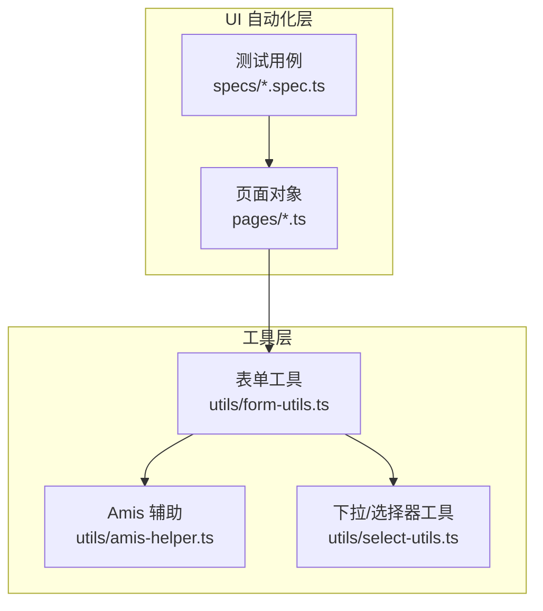
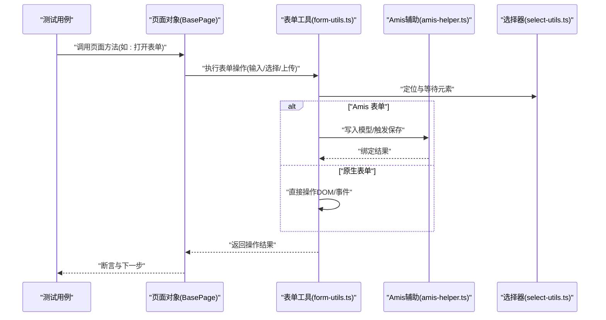
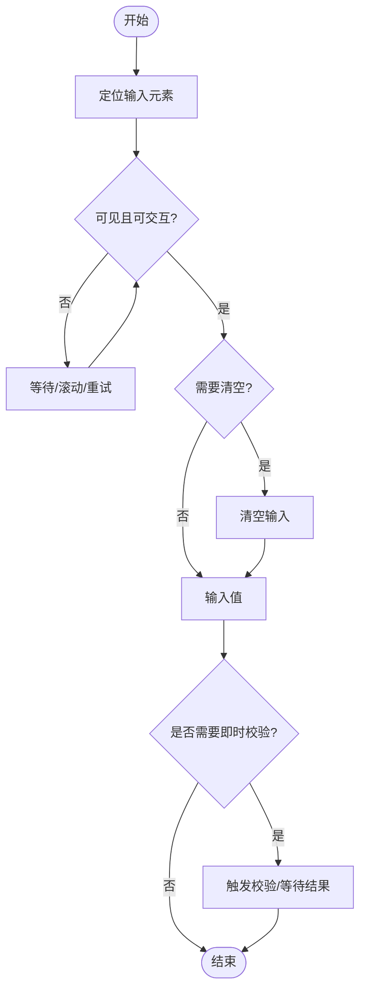
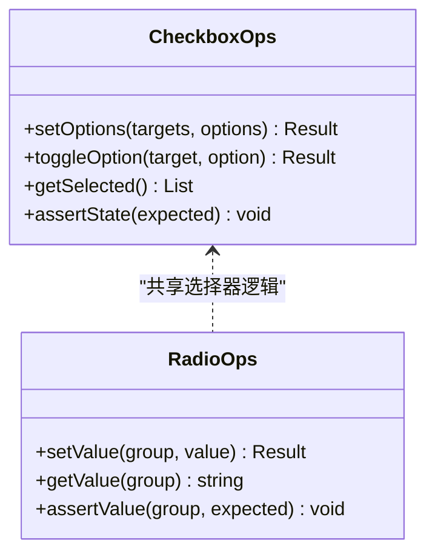
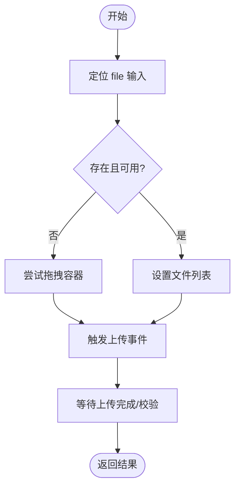
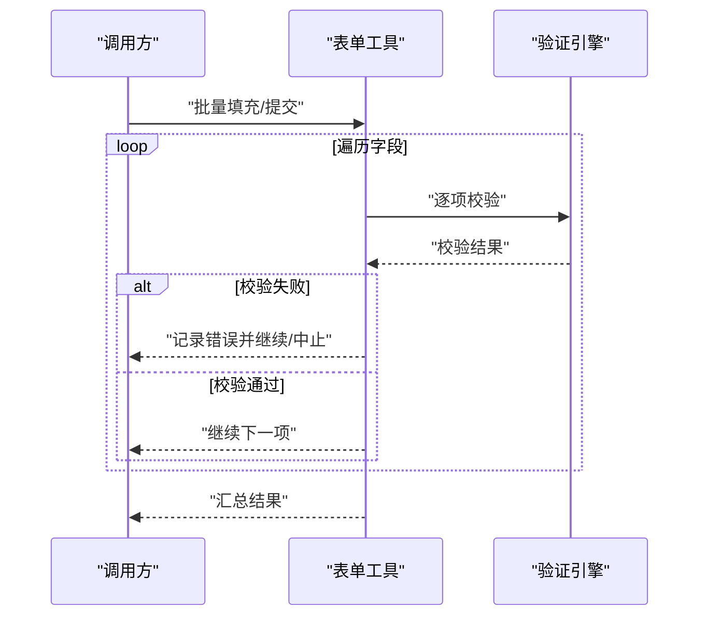
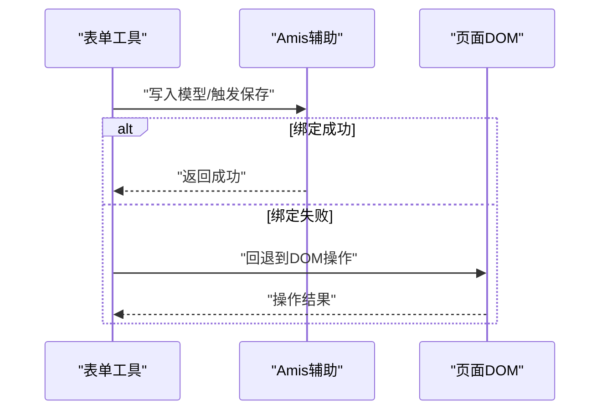
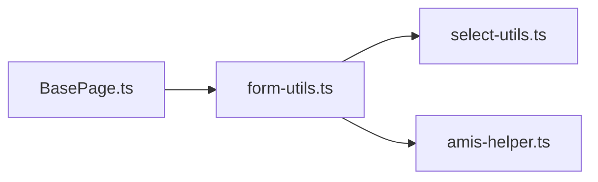

# 表单操作工具 (form-utils.ts)

<cite>
**本文引用的文件**   
- [form-utils.ts](file://tests/ui/utils/form-utils.ts)
- [amis-helper.ts](file://tests/ui/utils/amis-helper.ts)
- [select-utils.ts](file://tests/ui/utils/select-utils.ts)
- [BasePage.ts](file://tests/ui/pages/BasePage.ts)
- [amis-form-diagnose.spec.ts](file://tests/ui/specs/crm/amis-form-diagnose.spec.ts)
</cite>

## 目录
1. [简介](#简介)
2. [项目结构](#项目结构)
3. [核心组件](#核心组件)
4. [架构总览](#架构总览)
5. [详细组件分析](#详细组件分析)
6. [依赖关系分析](#依赖关系分析)
7. [性能考虑](#性能考虑)
8. [故障排查指南](#故障排查指南)
9. [结论](#结论)
10. [附录](#附录)

## 简介
本技术文档围绕 AutoTest Hub 的表单操作工具函数库，聚焦 tests/ui/utils/form-utils.ts 提供的表单操作方法。文档将系统阐述文本输入、复选框选择、单选按钮操作、文件上传等核心能力，并给出参数配置、返回值类型与异常处理机制说明；同时提供复杂场景（动态表单、条件表单、批量表单）的实践示例思路，解释与验证引擎和数据绑定的集成方式，并给出性能优化建议与调试技巧。

## 项目结构
该工具位于 UI 自动化测试的 utils 层，服务于基于 Playwright 的页面对象与用例脚本。其职责是封装常见表单交互，屏蔽底层元素定位与等待细节，向上层用例暴露稳定、可组合的 API。

图表来源
- [form-utils.ts](file://tests/ui/utils/form-utils.ts)
- [amis-helper.ts](file://tests/ui/utils/amis-helper.ts)
- [select-utils.ts](file://tests/ui/utils/select-utils.ts)
- [BasePage.ts](file://tests/ui/pages/BasePage.ts)

章节来源
- [form-utils.ts](file://tests/ui/utils/form-utils.ts)
- [BasePage.ts](file://tests/ui/pages/BasePage.ts)

## 核心组件
本节对 form-utils.ts 的核心能力进行分层说明：基础输入、选择类控件、文件上传、批量与条件化操作、以及错误与日志策略。为避免泄露实现细节，本节以“方法族 + 行为契约”的方式描述，具体签名与实现请参见对应源码路径。

- 文本输入
  - 功能要点：支持按名称/占位符/标签定位输入框；可选清空后输入；支持输入校验与重试；支持多行文本与富文本编辑器的适配。
  - 典型参数：目标标识（name/placeholder/label）、值、是否清空、超时时间、是否强制可见。
  - 返回：布尔或状态对象（成功/失败及原因）。
  - 异常：元素不可见/不存在、输入被拦截、校验失败等，抛出明确错误信息并附带上下文。

- 复选框选择
  - 功能要点：支持按标签/名称定位；支持多选集合；支持反选与全选；支持等待选项可用后再操作。
  - 典型参数：目标标识、期望选中项集合、是否反选、超时。
  - 返回：选中结果与差异报告（已选中/未选中）。
  - 异常：选项缺失、状态不一致、点击无效等。

- 单选按钮操作
  - 功能要点：按组名或标签定位；支持设置指定值；支持读取当前选中值；支持等待组渲染完成。
  - 典型参数：组标识、目标值、是否读取。
  - 返回：布尔或当前值。
  - 异常：组不存在、无匹配选项、状态未更新。

- 文件上传
  - 功能要点：通过 input[type=file] 注入本地文件路径；支持单文件与多文件；支持大文件分片提示与重试；兼容拖拽上传的降级方案。
  - 典型参数：文件路径数组、是否清空已有文件、超时。
  - 返回：上传结果（成功/失败与原因）。
  - 异常：路径无效、权限不足、浏览器限制、容器不可用。

- 批量与条件化操作
  - 批量：对一组表单字段执行统一动作（如填充、校验、提交），支持事务式回滚与部分失败聚合。
  - 条件：根据前置状态决定是否执行某段表单操作（如显示/隐藏字段、联动选择）。
  - 返回：汇总结果（成功数/失败数/错误列表）。

- 与验证引擎和数据绑定集成
  - 与 validation-engine.ts 协作：在提交前触发同步/异步校验，收集错误并中止流程。
  - 数据绑定：对于 Amis 等框架，优先使用 Amis 辅助方法写入模型，再触发保存，确保双向绑定生效。

章节来源
- [form-utils.ts](file://tests/ui/utils/form-utils.ts)
- [amis-helper.ts](file://tests/ui/utils/amis-helper.ts)
- [select-utils.ts](file://tests/ui/utils/select-utils.ts)

## 架构总览
下图展示从用例到工具层的调用链路与关键依赖。

图表来源
- [form-utils.ts](file://tests/ui/utils/form-utils.ts)
- [amis-helper.ts](file://tests/ui/utils/amis-helper.ts)
- [select-utils.ts](file://tests/ui/utils/select-utils.ts)
- [BasePage.ts](file://tests/ui/pages/BasePage.ts)

## 详细组件分析

### 文本输入方法族
- 设计要点
  - 定位策略：优先 name/placeholder/label，其次 data-testid 或语义化选择器。
  - 稳定性：自动等待可见/可交互，必要时滚动至可视区域。
  - 幂等性：支持先清空再输入，避免残留内容影响断言。
  - 兼容性：覆盖普通 input、textarea、富文本编辑器（如 contenteditable）。
- 参数与返回
  - 参数：字段标识、值、是否清空、超时、是否强制可见。
  - 返回：布尔或结构化结果（含错误码与消息）。
- 异常处理
  - 元素不可见/不存在：抛出“元素不可用”错误，附带定位信息。
  - 输入被拦截：尝试重新定位或切换焦点后重试。
  - 校验失败：捕获并返回校验错误详情，供上层断言。
- 复杂度与性能
  - 单次输入 O(1)，批量输入 O(n)。
  - 建议合并多次输入为一次提交，减少重排。

图表来源
- [form-utils.ts](file://tests/ui/utils/form-utils.ts)

章节来源
- [form-utils.ts](file://tests/ui/utils/form-utils.ts)

### 复选框与单选按钮
- 复选框
  - 能力：多选集合、反选、全选、状态一致性检查。
  - 定位：按标签/名称/值定位，支持分组容器内查找。
  - 返回：选中集合与差异对比。
  - 异常：选项缺失、状态不同步、点击无效。
- 单选按钮
  - 能力：按组定位、设置目标值、读取当前值。
  - 返回：布尔或当前值。
  - 异常：组不存在、无匹配项、未更新。

图表来源
- [form-utils.ts](file://tests/ui/utils/form-utils.ts)
- [select-utils.ts](file://tests/ui/utils/select-utils.ts)

章节来源
- [form-utils.ts](file://tests/ui/utils/form-utils.ts)
- [select-utils.ts](file://tests/ui/utils/select-utils.ts)

### 文件上传
- 能力
  - 通过 input[type=file] 注入本地文件路径，支持多文件。
  - 兼容拖拽上传的降级策略（构造 DragEvent 并触发）。
  - 大文件场景下提供重试与进度提示。
- 参数与返回
  - 参数：文件路径数组、是否清空已有文件、超时。
  - 返回：上传结果（成功/失败与原因）。
- 异常
  - 路径无效、权限不足、浏览器安全限制、容器不可用。
- 流程图

图表来源
- [form-utils.ts](file://tests/ui/utils/form-utils.ts)

章节来源
- [form-utils.ts](file://tests/ui/utils/form-utils.ts)

### 批量与条件化表单操作
- 批量
  - 对多个字段执行同一动作（填充/校验/提交），支持事务式回滚与部分失败聚合。
  - 返回：汇总统计（成功/失败/错误列表）。
- 条件化
  - 根据前置状态决定是否执行某段操作（如联动字段、显隐控制）。
  - 返回：执行分支与结果。
- 时序图

图表来源
- [form-utils.ts](file://tests/ui/utils/form-utils.ts)

章节来源
- [form-utils.ts](file://tests/ui/utils/form-utils.ts)

### 与 Amis 表单集成
- 适用场景：Amis 渲染的动态表单、条件渲染、联动选择。
- 集成方式：优先通过 amis-helper.ts 写入模型并触发保存，确保双向绑定生效；若无法命中，则回退到 DOM 级操作。
- 诊断参考：可结合 amis-form-diagnose.spec.ts 的诊断输出定位问题。

图表来源
- [form-utils.ts](file://tests/ui/utils/form-utils.ts)
- [amis-helper.ts](file://tests/ui/utils/amis-helper.ts)
- [amis-form-diagnose.spec.ts](file://tests/ui/specs/crm/amis-form-diagnose.spec.ts)

章节来源
- [form-utils.ts](file://tests/ui/utils/form-utils.ts)
- [amis-helper.ts](file://tests/ui/utils/amis-helper.ts)
- [amis-form-diagnose.spec.ts](file://tests/ui/specs/crm/amis-form-diagnose.spec.ts)

## 依赖关系分析
- 内部依赖
  - select-utils.ts：提供通用选择器与等待逻辑，降低耦合。
  - amis-helper.ts：针对 Amis 框架的数据绑定与事件触发。
  - BasePage.ts：页面对象作为入口，组织业务流并调用工具。
- 外部依赖
  - Playwright：浏览器自动化与事件模拟。
  - 验证引擎：在提交前进行同步/异步校验。

图表来源
- [form-utils.ts](file://tests/ui/utils/form-utils.ts)
- [select-utils.ts](file://tests/ui/utils/select-utils.ts)
- [amis-helper.ts](file://tests/ui/utils/amis-helper.ts)
- [BasePage.ts](file://tests/ui/pages/BasePage.ts)

章节来源
- [form-utils.ts](file://tests/ui/utils/form-utils.ts)
- [select-utils.ts](file://tests/ui/utils/select-utils.ts)
- [amis-helper.ts](file://tests/ui/utils/amis-helper.ts)
- [BasePage.ts](file://tests/ui/pages/BasePage.ts)

## 性能考虑
- 减少重排与回流
  - 批量输入时尽量合并为一次提交，避免频繁触发表单校验。
  - 对大型表单采用懒加载或分页填写。
- 等待策略
  - 使用显式等待而非固定 sleep，缩短不稳定等待时间。
  - 对高频操作的元素缓存选择器，避免重复查询。
- 并发与隔离
  - 每个用例独立数据与上下文，避免跨用例污染导致的额外清理成本。
- 资源管理
  - 文件上传前预检文件大小与路径有效性，尽早失败。
  - 对大文件上传增加重试与退避策略。

[本节为通用指导，不直接分析具体文件]

## 故障排查指南
- 常见问题
  - 元素不可见/不可交互：检查是否在视口内、是否被遮罩、是否处于禁用态。
  - 输入未生效：确认是否为受控组件（如 Amis），应通过模型写入而非直接 DOM 赋值。
  - 上传失败：检查浏览器安全限制、路径权限、容器类型（input[type=file] 或拖拽区）。
  - 校验阻塞：查看验证引擎返回的错误详情，定位字段与规则。
- 定位手段
  - 启用 Playwright 追踪与截图，结合诊断报告（如 amis-form-diagnose 输出）快速定位。
  - 在关键步骤打印上下文（字段名、选择器、当前状态）。
- 恢复策略
  - 对偶发性失败实施重试与回退（如 DOM 级操作替代模型写入）。
  - 对批量操作实现部分失败聚合与断点续填。

章节来源
- [amis-form-diagnose.spec.ts](file://tests/ui/specs/crm/amis-form-diagnose.spec.ts)
- [form-utils.ts](file://tests/ui/utils/form-utils.ts)

## 结论
form-utils.ts 提供了稳定、可组合的表单操作能力，覆盖文本、选择、文件上传等核心场景，并通过与选择器工具与 Amis 辅助模块的解耦设计，提升了跨框架与复杂页面的适配能力。配合验证引擎与诊断工具，可在保证稳定性的同时提升开发效率与可维护性。建议在复杂场景中优先使用批量与条件化接口，并结合性能与调试建议持续优化。

[本节为总结性内容，不直接分析具体文件]

## 附录
- 使用建议
  - 在页面对象中封装业务语义，复用 form-utils 的能力，保持用例可读性。
  - 对易变的选择器集中管理，便于统一维护。
  - 对关键路径添加断言与日志，便于回归与审计。
- 相关参考
  - 选择器与等待：select-utils.ts
  - Amis 表单绑定：amis-helper.ts
  - 诊断用例：amis-form-diagnose.spec.ts

[本节为补充信息，不直接分析具体文件]