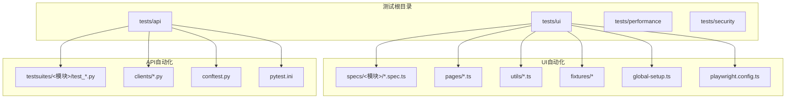
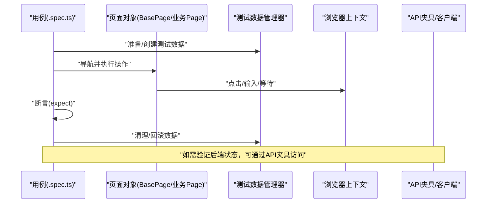
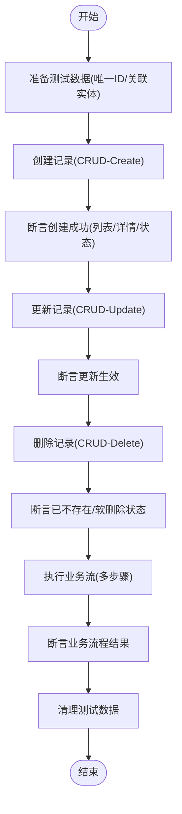
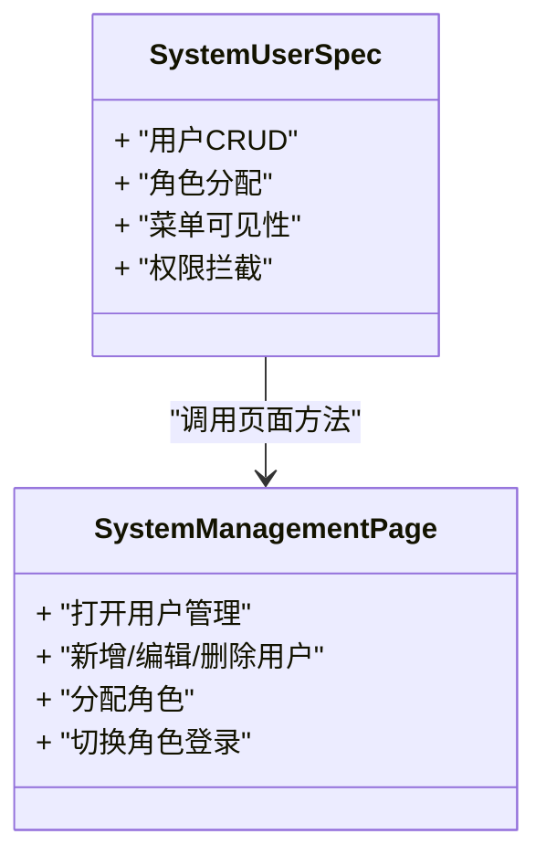
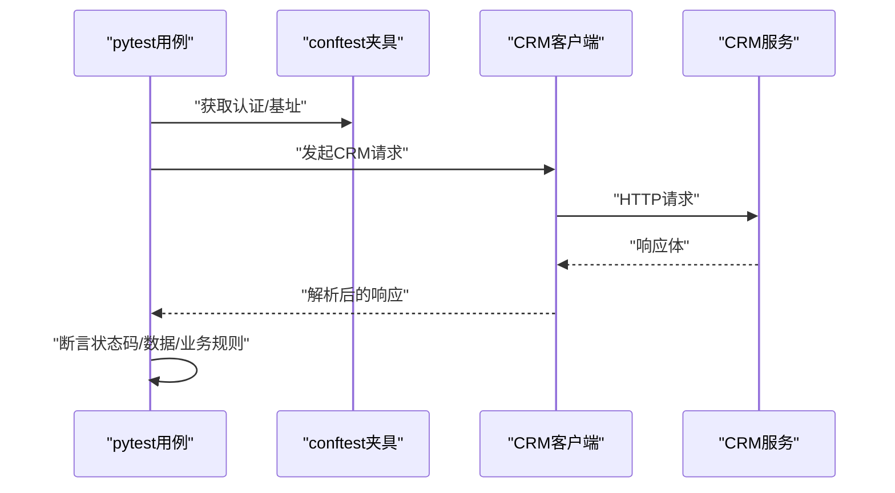
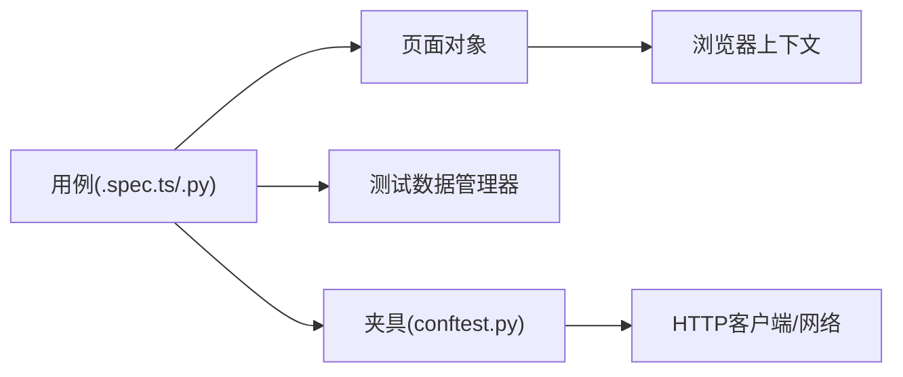

# 测试规范组织

<cite>
**本文引用的文件**   
- [tests/ui/specs/crm/business-crud.spec.ts](file://tests/ui/specs/crm/business-crud.spec.ts)
- [tests/ui/specs/crm/business-flow.spec.ts](file://tests/ui/specs/crm/business-flow.spec.ts)
- [tests/ui/specs/system/system-user.spec.ts](file://tests/ui/specs/system/system-user.spec.ts)
- [tests/ui/specs/prototype/prototype-analysis.spec.ts](file://tests/ui/specs/prototype/prototype-analysis.spec.ts)
- [tests/ui/pages/BasePage.ts](file://tests/ui/pages/BasePage.ts)
- [tests/ui/pages/SystemManagementPage.ts](file://tests/ui/pages/SystemManagementPage.ts)
- [tests/ui/utils/test-data-manager.ts](file://tests/ui/utils/test-data-manager.ts)
- [tests/ui/global-setup.ts](file://tests/ui/global-setup.ts)
- [tests/api/testsuites/crm/test_crm_crud.py](file://tests/api/testsuites/crm/test_crm_crud.py)
- [tests/api/testsuites/crm/test_crm_business.py](file://tests/api/testsuites/crm/test_crm_business.py)
- [tests/api/conftest.py](file://tests/api/conftest.py)
</cite>

## 目录
1. [简介](#简介)
2. [项目结构](#项目结构)
3. [核心组件](#核心组件)
4. [架构总览](#架构总览)
5. [详细组件分析](#详细组件分析)
6. [依赖分析](#依赖分析)
7. [性能考虑](#性能考虑)
8. [故障排查指南](#故障排查指南)
9. [结论](#结论)
10. [附录](#附录)

## 简介
本技术文档面向AutoTest Hub的测试规范组织，聚焦以下目标：
- 解释测试文件的目录结构与命名约定，特别是按功能模块划分的specs目录组织方式。
- 详细说明CRM模块端到端测试用例的实现（CRUD与业务流）。
- 文档化系统管理模块的用户权限测试用例。
- 展示原型分析测试的实现方法与断言策略。
- 提供测试用例编写规范（describe块组织、it描述、expect断言使用）。
- 解释测试数据准备、环境隔离与清理机制。
- 说明测试优先级标记、跳过条件与并行执行策略。

## 项目结构
测试代码主要位于tests目录下，UI自动化采用Playwright（TypeScript），API自动化采用pytest（Python）。specs目录按业务域进行划分，便于维护与定位。

图表来源
- [tests/ui/global-setup.ts](file://tests/ui/global-setup.ts)
- [tests/api/conftest.py](file://tests/api/conftest.py)

章节来源
- [tests/ui/global-setup.ts](file://tests/ui/global-setup.ts)
- [tests/api/conftest.py](file://tests/api/conftest.py)

## 核心组件
- 页面对象层（BasePage与各业务Page）：封装元素定位与交互动作，提升可维护性。
- 测试数据管理器：集中生成、注入与清理测试数据，保证用例独立性与可重复性。
- 全局初始化与配置：统一登录态、浏览器上下文、环境变量等。
- API客户端与夹具：为接口测试提供认证、请求封装与共享资源。

章节来源
- [tests/ui/pages/BasePage.ts](file://tests/ui/pages/BasePage.ts)
- [tests/ui/pages/SystemManagementPage.ts](file://tests/ui/pages/SystemManagementPage.ts)
- [tests/ui/utils/test-data-manager.ts](file://tests/ui/utils/test-data-manager.ts)
- [tests/api/conftest.py](file://tests/api/conftest.py)

## 架构总览
下图展示了UI端到端测试从用例到页面对象与数据管理的调用关系，以及API侧的夹具与客户端协作。

图表来源
- [tests/ui/pages/BasePage.ts](file://tests/ui/pages/BasePage.ts)
- [tests/ui/utils/test-data-manager.ts](file://tests/ui/utils/test-data-manager.ts)
- [tests/api/conftest.py](file://tests/api/conftest.py)

## 详细组件分析

### CRM模块端到端测试（CRUD与业务流）
- 目录与命名
  - specs/crm下包含多个以业务域命名的.spec.ts文件，如business-crud.spec.ts、business-flow.spec.ts等，遵循“模块+场景”的命名约定。
- CRUD实现要点
  - 通过页面对象完成新增、查询、编辑、删除等基础操作；每个用例聚焦单一职责，避免跨用例耦合。
  - 使用测试数据管理器生成唯一标识的数据，确保并发与重复执行不冲突。
- 业务流实现要点
  - 串联多步流程（例如线索→商机→报价→订单），在关键节点插入断言，保障状态一致性。
  - 失败路径与异常分支需覆盖，包括必填校验、权限不足、数据不一致等。

图表来源
- [tests/ui/specs/crm/business-crud.spec.ts](file://tests/ui/specs/crm/business-crud.spec.ts)
- [tests/ui/specs/crm/business-flow.spec.ts](file://tests/ui/specs/crm/business-flow.spec.ts)
- [tests/ui/utils/test-data-manager.ts](file://tests/ui/utils/test-data-manager.ts)

章节来源
- [tests/ui/specs/crm/business-crud.spec.ts](file://tests/ui/specs/crm/business-crud.spec.ts)
- [tests/ui/specs/crm/business-flow.spec.ts](file://tests/ui/specs/crm/business-flow.spec.ts)
- [tests/ui/utils/test-data-manager.ts](file://tests/ui/utils/test-data-manager.ts)

### 系统管理模块用户权限测试
- 用例范围
  - 用户增删改查、角色分配、菜单可见性控制、操作权限拦截等。
- 实现要点
  - 使用SystemManagementPage封装系统管理相关操作；结合不同角色的登录态进行对比断言。
  - 对敏感操作增加二次确认、提示文案与错误码断言。

图表来源
- [tests/ui/specs/system/system-user.spec.ts](file://tests/ui/specs/system/system-user.spec.ts)
- [tests/ui/pages/SystemManagementPage.ts](file://tests/ui/pages/SystemManagementPage.ts)

章节来源
- [tests/ui/specs/system/system-user.spec.ts](file://tests/ui/specs/system/system-user.spec.ts)
- [tests/ui/pages/SystemManagementPage.ts](file://tests/ui/pages/SystemManagementPage.ts)

### 原型分析测试（实现方法与断言策略）
- 目标
  - 验证原型页面的结构完整性、路由可达、表单渲染与交互可用性。
- 断言策略
  - 结构断言：检查关键容器、按钮、表格是否存在且可见。
  - 行为断言：触发交互后断言DOM变化、弹窗出现、字段禁用/启用状态。
  - 内容断言：校验占位文本、默认值、提示信息是否符合预期。

```mermaid
flowchart TD
A["加载原型页面"] --> B["断言页面标题/路由"]
B --> C["断言关键元素存在且可见"]
C --> D["模拟用户交互(点击/输入)"]
D --> E["断言交互结果(弹窗/表单/列表)"]
E --> F["断言提示信息/错误反馈"]
F --> G["清理临时状态(如有)"]
```

图表来源
- [tests/ui/specs/prototype/prototype-analysis.spec.ts](file://tests/ui/specs/prototype/prototype-analysis.spec.ts)

章节来源
- [tests/ui/specs/prototype/prototype-analysis.spec.ts](file://tests/ui/specs/prototype/prototype-analysis.spec.ts)

### API侧CRM测试（夹具与客户端）
- 夹具与客户端
  - conftest.py提供共享夹具（如认证令牌、会话、基地址等）。
  - testsuites/crm下的测试文件通过客户端发起请求，验证响应码、数据结构与业务规则。
- 典型流程
  - 登录获取凭证 → 调用CRM接口 → 断言返回体 → 清理数据或回滚事务。

图表来源
- [tests/api/conftest.py](file://tests/api/conftest.py)
- [tests/api/testsuites/crm/test_crm_crud.py](file://tests/api/testsuites/crm/test_crm_crud.py)
- [tests/api/testsuites/crm/test_crm_business.py](file://tests/api/testsuites/crm/test_crm_business.py)

章节来源
- [tests/api/conftest.py](file://tests/api/conftest.py)
- [tests/api/testsuites/crm/test_crm_crud.py](file://tests/api/testsuites/crm/test_crm_crud.py)
- [tests/api/testsuites/crm/test_crm_business.py](file://tests/api/testsuites/crm/test_crm_business.py)

## 依赖分析
- 低耦合高内聚
  - 用例仅依赖页面对象与数据管理器，避免直接操作DOM或硬编码选择器。
  - API用例通过夹具与客户端解耦网络细节。
- 外部依赖
  - Playwright浏览器上下文、网络代理、截图/视频录制等由配置文件统一管理。
  - pytest插件与缓存目录由pytest.ini与conftest.py协调。

图表来源
- [tests/ui/pages/BasePage.ts](file://tests/ui/pages/BasePage.ts)
- [tests/ui/utils/test-data-manager.ts](file://tests/ui/utils/test-data-manager.ts)
- [tests/api/conftest.py](file://tests/api/conftest.py)

章节来源
- [tests/ui/pages/BasePage.ts](file://tests/ui/pages/BasePage.ts)
- [tests/ui/utils/test-data-manager.ts](file://tests/ui/utils/test-data-manager.ts)
- [tests/api/conftest.py](file://tests/api/conftest.py)

## 性能考虑
- 减少不必要的重绘与等待：优先使用显式等待与稳定性断言，避免固定sleep。
- 数据批量准备：在setUp阶段一次性准备必要数据，降低用例间开销。
- 并行执行：合理拆分用例集，避免共享可变状态；必要时使用隔离的浏览器上下文或数据库事务。
- 资源回收：及时关闭页面、释放连接、清理临时文件与截图/视频。

[本节为通用指导，无需源码引用]

## 故障排查指南
- 常见问题
  - 元素不可见/超时：检查显式等待、滚动加载、动态渲染。
  - 权限问题：确认夹具提供的角色与权限是否匹配当前用例。
  - 数据污染：核对数据管理器是否生成唯一ID并在teardown中清理。
- 定位手段
  - 开启截图/视频录制，结合控制台日志定位失败点。
  - 缩小复现范围，将复杂用例拆分为最小可复现片段。
  - 在API侧追加断言，快速判断是前端还是后端问题。

章节来源
- [tests/ui/global-setup.ts](file://tests/ui/global-setup.ts)
- [tests/api/conftest.py](file://tests/api/conftest.py)

## 结论
通过将specs按模块划分、引入页面对象与数据管理器、统一夹具与配置，AutoTest Hub实现了高内聚、低耦合、可维护的测试体系。CRM端到端用例覆盖了CRUD与关键业务流，系统管理模块聚焦权限与可见性，原型分析测试保障了界面可用性与结构正确性。配合清晰的编写规范与环境治理策略，可有效提升回归效率与质量保障能力。

[本节为总结性内容，无需源码引用]

## 附录

### 测试用例编写规范
- describe块组织
  - 按模块/功能域分组，保持层级清晰；每个describe聚焦一个子功能。
- it描述
  - 使用“当…时，应…”句式，明确前置条件与期望结果。
- expect断言
  - 断言具体、原子化；优先断言可见状态与业务语义，而非内部实现细节。
- 页面对象
  - 所有交互通过页面对象暴露的方法完成，禁止在spec中直接操作DOM。
- 数据与清理
  - 使用测试数据管理器生成唯一数据；在teardown或finally中清理。

章节来源
- [tests/ui/pages/BasePage.ts](file://tests/ui/pages/BasePage.ts)
- [tests/ui/utils/test-data-manager.ts](file://tests/ui/utils/test-data-manager.ts)

### 测试数据准备、环境隔离与清理
- 数据准备
  - 集中生成唯一ID、关联实体与初始状态；支持批量导入与回滚。
- 环境隔离
  - 使用独立的浏览器上下文/会话；API侧使用事务或沙箱库。
- 清理机制
  - 统一在teardown中删除数据、重置状态、释放资源。

章节来源
- [tests/ui/utils/test-data-manager.ts](file://tests/ui/utils/test-data-manager.ts)
- [tests/api/conftest.py](file://tests/api/conftest.py)

### 测试优先级、跳过条件与并行执行
- 优先级标记
  - 通过标签或装饰器标记冒烟/回归/慢用例，便于选择性执行。
- 跳过条件
  - 根据环境、特性开关、依赖缺失等条件跳过用例，避免误报。
- 并行执行
  - 按模块拆分用例集，避免共享可变状态；必要时使用隔离上下文。

章节来源
- [tests/ui/global-setup.ts](file://tests/ui/global-setup.ts)
- [tests/api/conftest.py](file://tests/api/conftest.py)