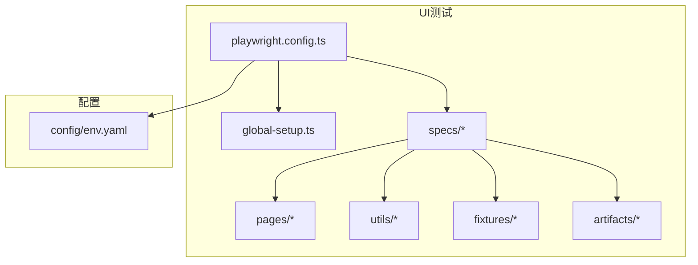
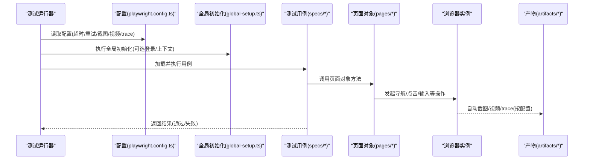
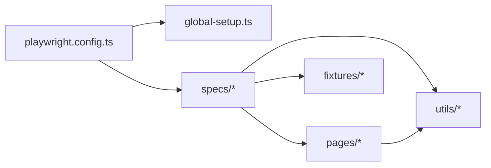

# 调试与故障排查

<cite>
**本文引用的文件**   
- [playwright.config.ts](file://tests/ui/playwright.config.ts)
- [global-setup.ts](file://tests/ui/global-setup.ts)
- [BasePage.ts](file://tests/ui/pages/BasePage.ts)
- [LoginPage.ts](file://tests/ui/pages/LoginPage.ts)
- [crm-smoke.spec.ts](file://tests/ui/specs/crm/crm-smoke.spec.ts)
- [amis-form-diagnose.spec.ts](file://tests/ui/specs/crm/amis-form-diagnose.spec.ts)
- [diagnose-page.spec.ts](file://tests/ui/specs/diagnose-page.spec.ts)
- [performance.spec.ts](file://tests/ui/specs/performance/performance.spec.ts)
- [amis-helper.ts](file://tests/ui/utils/amis-helper.ts)
- [form-utils.ts](file://tests/ui/utils/form-utils.ts)
- [test-data-manager.ts](file://tests/ui/utils/test-data-manager.ts)
- [validation-engine.ts](file://tests/ui/utils/validation-engine.ts)
- [app.ts](file://tests/ui/utils/app.ts)
- [crypto.ts](file://tests/ui/utils/crypto.ts)
- [select-utils.ts](file://tests/ui/utils/select-utils.ts)
- [accounts.ts](file://tests/ui/fixtures/accounts.ts)
- [ACCOUNTS.md](file://tests/ui/fixtures/ACCOUNTS.md)
- [env.yaml](file://tests/config/env.yaml)
</cite>

## 目录
1. [简介](#简介)
2. [项目结构](#项目结构)
3. [核心组件](#核心组件)
4. [架构总览](#架构总览)
5. [详细组件分析](#详细组件分析)
6. [依赖关系分析](#依赖关系分析)
7. [性能考虑](#性能考虑)
8. [故障排查指南](#故障排查指南)
9. [结论](#结论)
10. [附录](#附录)

## 简介
本文件面向AutoTest Hub的UI自动化测试，聚焦Playwright调试模式、截图收集、视频录制、trace交互式调试、诊断输出与框架检测报告解读，以及常见问题定位方法。文档同时覆盖日志级别配置、性能监控与内存泄漏检测建议，帮助读者快速定位并解决UI自动化中的不稳定与失败问题。

## 项目结构
本项目采用按功能域组织的方式：
- tests/ui：Playwright UI测试主目录，包含配置、页面对象、用例、工具与产物目录（截图、视频、trace等）
- tests/config：环境配置
- scripts：运行脚本（含UI测试执行脚本）
- docs：测试设计与报告文档

图表来源
- [playwright.config.ts](file://tests/ui/playwright.config.ts)
- [global-setup.ts](file://tests/ui/global-setup.ts)

章节来源
- [playwright.config.ts](file://tests/ui/playwright.config.ts)
- [global-setup.ts](file://tests/ui/global-setup.ts)

## 核心组件
- Playwright配置中心：集中管理浏览器启动参数、重试、超时、截图/视频/trace策略、并行度、报告与产物路径等
- 全局初始化：登录态或共享上下文准备，减少重复登录开销
- 页面对象层：封装常见交互与等待策略，统一错误处理与断言
- 工具库：表单、选择器、数据构造、加密、校验引擎等
- 诊断与报告：生成诊断输出与框架检测报告，辅助定位前端框架相关问题

章节来源
- [playwright.config.ts](file://tests/ui/playwright.config.ts)
- [global-setup.ts](file://tests/ui/global-setup.ts)
- [BasePage.ts](file://tests/ui/pages/BasePage.ts)
- [amis-helper.ts](file://tests/ui/utils/amis-helper.ts)
- [form-utils.ts](file://tests/ui/utils/form-utils.ts)
- [test-data-manager.ts](file://tests/ui/utils/test-data-manager.ts)
- [validation-engine.ts](file://tests/ui/utils/validation-engine.ts)
- [app.ts](file://tests/ui/utils/app.ts)
- [crypto.ts](file://tests/ui/utils/crypto.ts)
- [select-utils.ts](file://tests/ui/utils/select-utils.ts)

## 架构总览
下图展示从用例到浏览器、再到产物输出的关键流程，包括截图、视频与trace的触发点。

图表来源
- [playwright.config.ts](file://tests/ui/playwright.config.ts)
- [global-setup.ts](file://tests/ui/global-setup.ts)
- [BasePage.ts](file://tests/ui/pages/BasePage.ts)
- [crm-smoke.spec.ts](file://tests/ui/specs/crm/crm-smoke.spec.ts)

## 详细组件分析

### Playwright配置与调试模式
- headed模式：用于本地可视化调试，便于观察浏览器行为
- 单步调试与断点：结合IDE断点与Playwright调试器，逐步执行
- 截图策略：失败时自动截图；支持在关键步骤手动插入截图
- 视频录制：开启后记录浏览器会话，便于回放
- trace文件：生成可交互的trace，支持时间线回放、网络面板、控制台输出等
- 超时与重试：合理设置全局与操作级超时，提升稳定性
- 并行与隔离：控制并发度，避免资源竞争

章节来源
- [playwright.config.ts](file://tests/ui/playwright.config.ts)

### 全局初始化与登录态复用
- 目的：减少重复登录成本，稳定跨用例状态
- 方式：在setup阶段完成登录并保存认证上下文，供后续用例复用
- 注意：清理与隔离策略，避免污染

章节来源
- [global-setup.ts](file://tests/ui/global-setup.ts)

### 页面对象与通用交互
- BasePage提供统一的等待、断言、错误包装与截图插入能力
- LoginPage封装登录流程，配合全局初始化使用
- 建议在复杂交互中增加显式等待与重试逻辑，降低偶发失败

章节来源
- [BasePage.ts](file://tests/ui/pages/BasePage.ts)
- [LoginPage.ts](file://tests/ui/pages/LoginPage.ts)

### 典型用例与调试切入点
- crm-smoke.spec.ts：冒烟场景，适合快速验证端到端链路
- amis-form-diagnose.spec.ts：针对Amis表单的诊断用例，便于定位渲染与交互问题
- diagnose-page.spec.ts：通用诊断入口，辅助收集页面信息

章节来源
- [crm-smoke.spec.ts](file://tests/ui/specs/crm/crm-smoke.spec.ts)
- [amis-form-diagnose.spec.ts](file://tests/ui/specs/crm/amis-form-diagnose.spec.ts)
- [diagnose-page.spec.ts](file://tests/ui/specs/diagnose-page.spec.ts)

### 工具库与辅助能力
- amis-helper.ts：Amis相关交互与定位增强
- form-utils.ts：表单填充、提交与校验辅助
- test-data-manager.ts：测试数据构造与管理
- validation-engine.ts：断言与校验引擎
- app.ts：应用级辅助（如路由、跳转等）
- crypto.ts：加密/解密工具
- select-utils.ts：下拉选择器操作封装

章节来源
- [amis-helper.ts](file://tests/ui/utils/amis-helper.ts)
- [form-utils.ts](file://tests/ui/utils/form-utils.ts)
- [test-data-manager.ts](file://tests/ui/utils/test-data-manager.ts)
- [validation-engine.ts](file://tests/ui/utils/validation-engine.ts)
- [app.ts](file://tests/ui/utils/app.ts)
- [crypto.ts](file://tests/ui/utils/crypto.ts)
- [select-utils.ts](file://tests/ui/utils/select-utils.ts)

### 夹具与账号数据
- fixtures/accounts.ts：账号数据定义与注入
- fixtures/ACCOUNTS.md：账号说明与使用说明

章节来源
- [accounts.ts](file://tests/ui/fixtures/accounts.ts)
- [ACCOUNTS.md](file://tests/ui/fixtures/ACCOUNTS.md)

### 环境与配置
- config/env.yaml：环境变量与基础URL等配置，便于切换不同环境

章节来源
- [env.yaml](file://tests/config/env.yaml)

## 依赖关系分析
- 配置驱动：所有调试与产物开关由配置文件统一管理
- 用例依赖页面对象与工具库，页面对象依赖通用基类
- 全局初始化为用例提供前置条件（如登录态）

图表来源
- [playwright.config.ts](file://tests/ui/playwright.config.ts)
- [global-setup.ts](file://tests/ui/global-setup.ts)
- [BasePage.ts](file://tests/ui/pages/BasePage.ts)
- [crm-smoke.spec.ts](file://tests/ui/specs/crm/crm-smoke.spec.ts)

章节来源
- [playwright.config.ts](file://tests/ui/playwright.config.ts)
- [BasePage.ts](file://tests/ui/pages/BasePage.ts)
- [crm-smoke.spec.ts](file://tests/ui/specs/crm/crm-smoke.spec.ts)

## 性能考虑
- 合理设置超时与重试，避免过长等待导致整体耗时上升
- 控制并发度，避免目标系统过载
- 关闭不必要的截图/视频/trace以提升速度，仅在需要时开启
- 复用登录态与上下文，减少重复登录
- 使用显式等待替代固定sleep，提高鲁棒性

[本节为通用指导，不直接分析具体文件]

## 故障排查指南

### 启用headed模式进行可视化调试
- 在配置中启用headed模式，便于观察浏览器界面
- 结合IDE断点，逐步执行关键步骤，确认元素可见性与状态

章节来源
- [playwright.config.ts](file://tests/ui/playwright.config.ts)

### 单步调试与断点设置
- 在关键操作前设置断点，检查DOM状态与网络请求
- 使用Playwright调试器逐步执行，定位异常分支

章节来源
- [playwright.config.ts](file://tests/ui/playwright.config.ts)

### 截图收集机制
- 失败自动截图：在配置中开启失败截图，确保失败时保留现场
- 手动截图：在关键步骤插入截图，便于对比前后状态
- 截图路径：统一保存在artifacts/screenshots下

章节来源
- [playwright.config.ts](file://tests/ui/playwright.config.ts)
- [BasePage.ts](file://tests/ui/pages/BasePage.ts)

### 视频录制与回放
- 开启视频录制，记录完整浏览器会话
- 回放分析：查看用户操作、页面变化与报错时机
- 视频路径：统一保存在artifacts/videos下

章节来源
- [playwright.config.ts](file://tests/ui/playwright.config.ts)

### Trace文件与交互式调试
- 生成trace文件，打开后可查看时间线、网络面板、控制台输出与快照
- 结合断点与截图，快速定位问题根因
- trace路径：统一保存在artifacts/traces下

章节来源
- [playwright.config.ts](file://tests/ui/playwright.config.ts)

### 诊断输出与框架检测报告
- 诊断输出：收集页面结构与样式信息，辅助判断渲染问题
- 框架检测报告：识别前端框架特征，辅助定位特定框架的交互差异

章节来源
- [amis-form-diagnose.spec.ts](file://tests/ui/specs/crm/amis-form-diagnose.spec.ts)
- [diagnose-page.spec.ts](file://tests/ui/specs/diagnose-page.spec.ts)

### 常见问题定位方法
- 元素定位失败
  - 检查选择器是否唯一且稳定
  - 使用显式等待确保元素可见/可交互
  - 借助trace与截图确认实际DOM状态
- 超时问题
  - 调整全局与操作级超时
  - 优化网络与服务响应，避免长轮询
  - 减少不必要的全量截图/视频
- 网络请求异常
  - 在trace的网络面板中检查请求与响应
  - 模拟或拦截异常场景，验证容错逻辑
  - 关注鉴权与跨域问题

章节来源
- [BasePage.ts](file://tests/ui/pages/BasePage.ts)
- [crm-smoke.spec.ts](file://tests/ui/specs/crm/crm-smoke.spec.ts)

### 日志级别配置
- 根据问题严重性调整日志级别，平衡信息量与性能
- 在关键路径打印必要上下文，便于回溯

章节来源
- [playwright.config.ts](file://tests/ui/playwright.config.ts)

### 性能监控与内存泄漏检测
- 监控页面加载时间与关键操作耗时
- 在长时间运行的用例中定期释放上下文，避免内存增长
- 结合trace的时间线与快照，观察内存占用趋势

章节来源
- [performance.spec.ts](file://tests/ui/specs/performance/performance.spec.ts)

## 结论
通过合理的配置与调试技巧，结合截图、视频与trace等多维证据，可以高效定位UI自动化中的不稳定与失败问题。建议将headed模式、失败截图、trace作为默认调试手段，按需开启视频录制以平衡效率与可观测性。持续完善页面对象与工具库，统一错误处理与等待策略，是提升稳定性的关键。

[本节为总结性内容，不直接分析具体文件]

## 附录

### 常用调试命令与技巧
- 启用headed模式：在配置中开启headed
- 单步调试：在关键位置设置断点，逐步执行
- 失败截图：确保失败自动截图已开启
- 生成trace：在配置中启用trace，并在失败时保留
- 回放视频：在失败时查看对应视频文件

章节来源
- [playwright.config.ts](file://tests/ui/playwright.config.ts)

### 产物目录约定
- artifacts/screenshots：截图
- artifacts/videos：视频
- artifacts/traces：trace文件

章节来源
- [playwright.config.ts](file://tests/ui/playwright.config.ts)