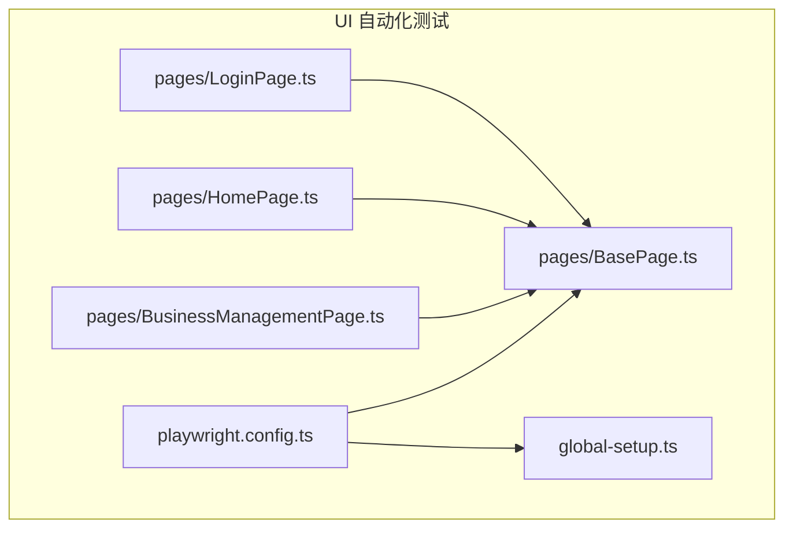
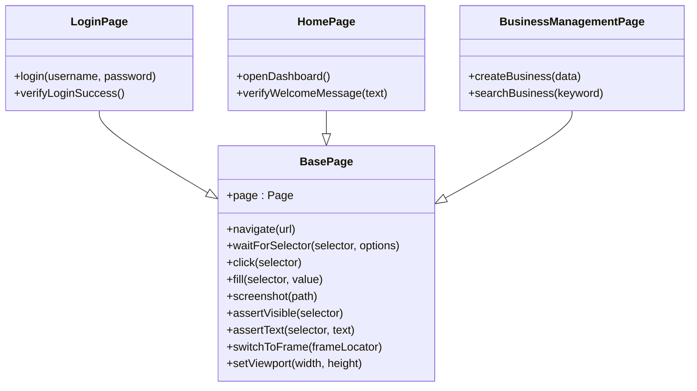
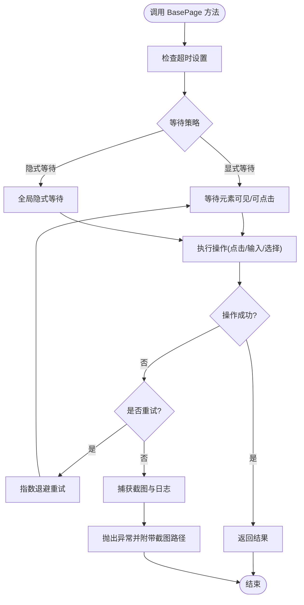
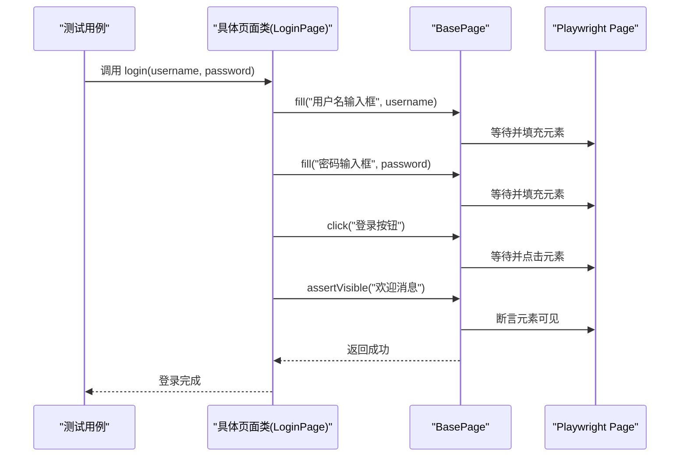
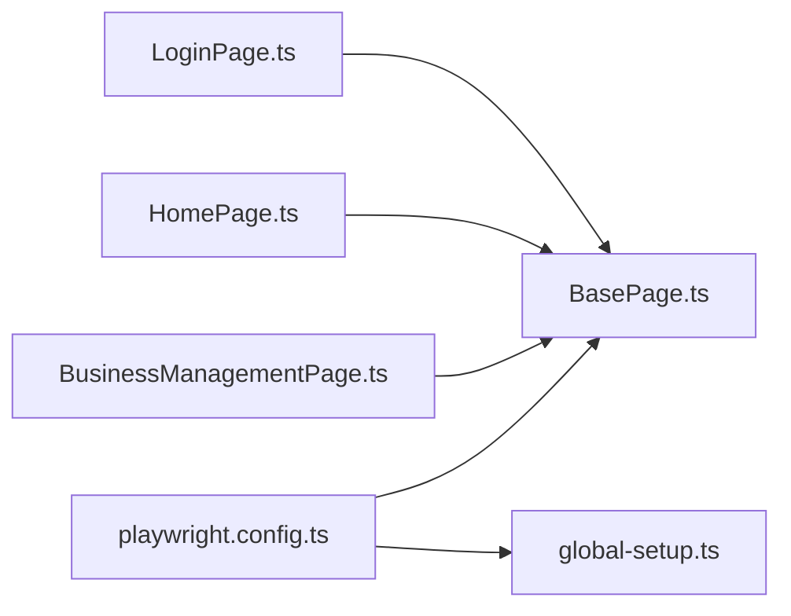

# BasePage基类设计

<cite>
**本文档引用的文件**   
- [BasePage.ts](file://tests/ui/pages/BasePage.ts)
- [LoginPage.ts](file://tests/ui/pages/LoginPage.ts)
- [HomePage.ts](file://tests/ui/pages/HomePage.ts)
- [BusinessManagementPage.ts](file://tests/ui/pages/BusinessManagementPage.ts)
- [playwright.config.ts](file://tests/ui/playwright.config.ts)
- [global-setup.ts](file://tests/ui/global-setup.ts)
</cite>

## 目录
1. [简介](#简介)
2. [项目结构](#项目结构)
3. [核心组件](#核心组件)
4. [架构总览](#架构总览)
5. [详细组件分析](#详细组件分析)
6. [依赖关系分析](#依赖关系分析)
7. [性能考虑](#性能考虑)
8. [故障排查指南](#故障排查指南)
9. [结论](#结论)
10. [附录](#附录)

## 简介
本技术文档围绕 AutoTest Hub 的 UI 自动化测试中的 BasePage 基类展开，系统阐述其在页面对象模式（Page Object Pattern）中的设计理念与核心作用。文档将覆盖：
- 通用页面操作方法：元素定位策略、等待机制、截图功能与错误处理
- Playwright 集成方法：page 对象管理、导航操作与断言封装
- 元素选择器最佳实践：CSS 选择器、XPath 表达式与数据属性定位
- 响应式设计与移动端适配方案
- 性能优化技巧与调试方法
- 如何继承 BasePage 创建新的页面对象类

## 项目结构
UI 自动化测试位于 tests/ui 目录下，其中 pages 目录存放各页面对象实现，BasePage.ts 为所有页面对象的公共基类；playwright.config.ts 与 global-setup.ts 负责浏览器上下文与全局初始化配置。

图表来源
- [BasePage.ts](file://tests/ui/pages/BasePage.ts)
- [LoginPage.ts](file://tests/ui/pages/LoginPage.ts)
- [HomePage.ts](file://tests/ui/pages/HomePage.ts)
- [BusinessManagementPage.ts](file://tests/ui/pages/BusinessManagementPage.ts)
- [playwright.config.ts](file://tests/ui/playwright.config.ts)
- [global-setup.ts](file://tests/ui/global-setup.ts)

章节来源
- [BasePage.ts](file://tests/ui/pages/BasePage.ts)
- [playwright.config.ts](file://tests/ui/playwright.config.ts)
- [global-setup.ts](file://tests/ui/global-setup.ts)

## 核心组件
BasePage 作为所有页面对象的基类，提供以下核心能力：
- page 对象管理与生命周期控制
- 统一的元素定位与交互封装
- 智能等待与重试机制
- 截图与失败诊断
- 可复用的导航与断言方法
- 面向响应式与移动端的适配方法

章节来源
- [BasePage.ts](file://tests/ui/pages/BasePage.ts)

## 架构总览
下图展示了 BasePage 在页面对象模式中的位置及其与具体页面的关系，以及其与 Playwright 配置的协作方式。

图表来源
- [BasePage.ts](file://tests/ui/pages/BasePage.ts)
- [LoginPage.ts](file://tests/ui/pages/LoginPage.ts)
- [HomePage.ts](file://tests/ui/pages/HomePage.ts)
- [BusinessManagementPage.ts](file://tests/ui/pages/BusinessManagementPage.ts)

## 详细组件分析

### BasePage 基类设计
- 设计理念
  - 单一职责：封装通用的页面操作与等待逻辑，避免在各页面重复实现
  - 高内聚低耦合：通过抽象方法暴露稳定接口，具体页面按需扩展
  - 可维护性：统一错误处理与截图策略，提升问题定位效率
- 关键方法与职责
  - 元素定位与交互：封装 click、fill、selectOption 等常用操作，内置等待与重试
  - 等待机制：支持显式等待、条件等待与超时控制，减少不稳定用例
  - 截图与诊断：失败时自动截图并输出路径，便于回溯
  - 导航与断言：统一 navigate、assertVisible、assertText 等方法
  - 响应式与移动端：提供 setViewport、switchToFrame 等方法适配不同设备与 iframe

图表来源
- [BasePage.ts](file://tests/ui/pages/BasePage.ts)

章节来源
- [BasePage.ts](file://tests/ui/pages/BasePage.ts)

### Playwright 集成方法
- page 对象管理
  - 通过构造函数或注入方式获取 page 实例，确保生命周期一致
  - 提供统一的 page 上下文访问，避免分散管理
- 导航操作
  - 封装 navigate 方法，支持 URL 跳转、等待加载完成与错误处理
- 断言封装
  - assertVisible/assertText 等方法结合 Playwright 的 expect API，提供一致的断言风格
- 截图与追踪
  - 失败时自动截图，必要时开启 trace 记录，辅助定位问题

章节来源
- [BasePage.ts](file://tests/ui/pages/BasePage.ts)
- [playwright.config.ts](file://tests/ui/playwright.config.ts)
- [global-setup.ts](file://tests/ui/global-setup.ts)

### 元素选择器最佳实践
- CSS 选择器
  - 优先使用语义化、稳定的 CSS 选择器，如 data-testid、id、class 组合
  - 避免过度依赖动态生成的 class 或层级过深的选择器
- XPath 表达式
  - 在复杂场景下使用 XPath，但需保持简洁与可读性
  - 尽量避免基于文本内容的 XPath，提高稳定性
- 数据属性定位
  - 推荐使用 data-testid 或自定义 data-* 属性进行定位，增强鲁棒性
  - 在 UI 变更频繁时，数据属性比 DOM 结构更稳定

章节来源
- [BasePage.ts](file://tests/ui/pages/BasePage.ts)

### 响应式设计与移动端适配
- 视口设置
  - 通过 setViewport 方法动态调整浏览器宽度与高度，模拟不同设备
- 框架与 iframe
  - 使用 switchToFrame 切换至目标 frame，确保元素可被定位与交互
- 触摸与滚动
  - 针对移动端特性，封装 touch 事件与滚动行为，保证兼容性

章节来源
- [BasePage.ts](file://tests/ui/pages/BasePage.ts)

### 错误处理与重试机制
- 统一异常捕获
  - 对常见错误（元素不可见、超时、网络错误）进行分类处理
- 重试策略
  - 支持指数退避与最大重试次数，降低偶发失败影响
- 截图与日志
  - 失败时自动截图并记录关键上下文，提升排错效率

章节来源
- [BasePage.ts](file://tests/ui/pages/BasePage.ts)

### 继承 BasePage 创建新页面
- 步骤概览
  - 新建页面类并继承 BasePage
  - 定义页面专属的元素选择器与方法
  - 复用 BasePage 的通用能力（导航、等待、截图、断言）
- 示例说明
  - LoginPage、HomePage、BusinessManagementPage 均遵循该模式

图表来源
- [LoginPage.ts](file://tests/ui/pages/LoginPage.ts)
- [BasePage.ts](file://tests/ui/pages/BasePage.ts)

章节来源
- [LoginPage.ts](file://tests/ui/pages/LoginPage.ts)
- [HomePage.ts](file://tests/ui/pages/HomePage.ts)
- [BusinessManagementPage.ts](file://tests/ui/pages/BusinessManagementPage.ts)
- [BasePage.ts](file://tests/ui/pages/BasePage.ts)

## 依赖关系分析
- 内部依赖
  - 各页面类依赖 BasePage 提供的通用方法
  - BasePage 依赖 Playwright 的 Page、Frame、Locator 等核心类型
- 外部依赖
  - playwright.config.ts 配置浏览器、超时、截图路径等
  - global-setup.ts 负责全局环境初始化（如认证状态）

图表来源
- [LoginPage.ts](file://tests/ui/pages/LoginPage.ts)
- [HomePage.ts](file://tests/ui/pages/HomePage.ts)
- [BusinessManagementPage.ts](file://tests/ui/pages/BusinessManagementPage.ts)
- [BasePage.ts](file://tests/ui/pages/BasePage.ts)
- [playwright.config.ts](file://tests/ui/playwright.config.ts)
- [global-setup.ts](file://tests/ui/global-setup.ts)

章节来源
- [BasePage.ts](file://tests/ui/pages/BasePage.ts)
- [playwright.config.ts](file://tests/ui/playwright.config.ts)
- [global-setup.ts](file://tests/ui/global-setup.ts)

## 性能考虑
- 减少不必要的等待
  - 使用精确的条件等待替代固定 sleep
- 合理设置超时
  - 根据网络与页面复杂度调整超时阈值
- 并行执行
  - 利用 Playwright 的并发能力，缩短整体执行时间
- 资源清理
  - 及时关闭浏览器上下文与释放资源，避免内存泄漏

[本节为通用指导，不直接分析具体文件]

## 故障排查指南
- 常见问题
  - 元素未找到：检查选择器是否正确、页面是否加载完成
  - 操作超时：增加等待时间或优化等待策略
  - 截图缺失：确认截图路径权限与目录存在
- 调试建议
  - 启用 trace 录制，回放定位问题
  - 打印关键上下文信息，辅助判断状态
  - 逐步缩小范围，隔离问题模块

章节来源
- [BasePage.ts](file://tests/ui/pages/BasePage.ts)

## 结论
BasePage 作为页面对象模式的基石，提供了稳定、可复用且易于扩展的通用能力。通过统一的元素定位、等待机制、截图与错误处理，显著提升了 UI 自动化测试的稳定性与维护性。配合 Playwright 的强大生态，可在复杂业务场景中快速构建健壮的自动化测试套件。

[本节为总结性内容，不直接分析具体文件]

## 附录
- 最佳实践清单
  - 优先使用 data-testid 进行元素定位
  - 封装通用操作，避免重复代码
  - 使用条件等待而非固定休眠
  - 失败时自动截图并记录上下文
  - 合理设置超时与重试策略
- 参考文件
  - BasePage.ts：基类实现
  - LoginPage.ts、HomePage.ts、BusinessManagementPage.ts：具体页面示例
  - playwright.config.ts、global-setup.ts：配置与初始化

[本节为补充信息，不直接分析具体文件]