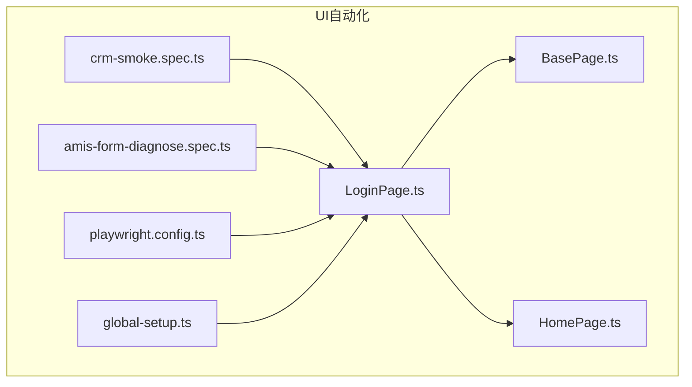
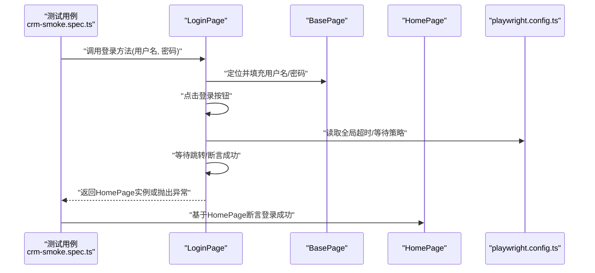
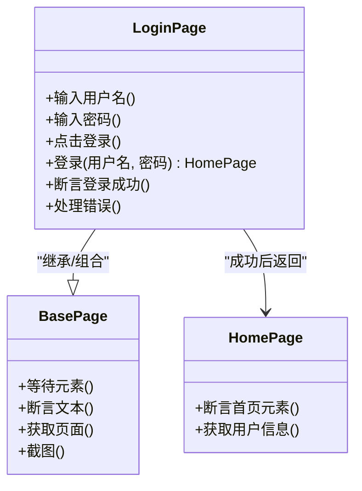
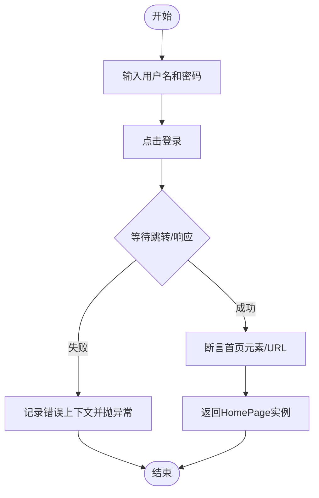
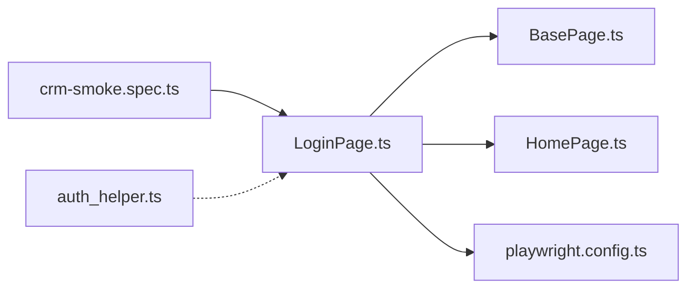

# LoginPage登录页面实现

<cite>
**本文引用的文件**   
- [LoginPage.ts](file://tests/ui/pages/LoginPage.ts)
- [BasePage.ts](file://tests/ui/pages/BasePage.ts)
- [HomePage.ts](file://tests/ui/pages/HomePage.ts)
- [playwright.config.ts](file://tests/ui/playwright.config.ts)
- [global-setup.ts](file://tests/ui/global-setup.ts)
- [crm-smoke.spec.ts](file://tests/ui/specs/crm/crm-smoke.spec.ts)
- [amis-form-diagnose.spec.ts](file://tests/ui/specs/crm/amis-form-diagnose.spec.ts)
- [auth_helper.ts](file://tests/performance/locust/utils/auth_helper.ts)
</cite>

## 目录
1. [简介](#简介)
2. [项目结构](#项目结构)
3. [核心组件](#核心组件)
4. [架构总览](#架构总览)
5. [详细组件分析](#详细组件分析)
6. [依赖关系分析](#依赖关系分析)
7. [性能考虑](#性能考虑)
8. [故障排查指南](#故障排查指南)
9. [结论](#结论)
10. [附录](#附录)

## 简介
本文件面向AutoTest Hub的UI自动化测试，聚焦于“登录页面（LoginPage）”的实现与使用。文档从业务逻辑封装、用户交互流程、元素定位与操作、表单验证、错误处理、成功跳转、会话管理与状态保持、失败重试与超时策略、安全考量以及测试用例调用方式等维度进行系统化说明，帮助读者快速理解并稳定复用登录能力。

## 项目结构
登录相关代码位于tests/ui目录下，采用Playwright + TypeScript组织：
- pages：页面对象模型（POM），包含LoginPage、BasePage、HomePage等
- specs：测试规格，演示如何调用登录方法
- playwright.config.ts：全局配置（含浏览器、超时、存储状态等）
- global-setup.ts：全局初始化（如预置认证状态）
- performance/locust/utils/auth_helper.ts：性能测试中的辅助认证工具（参考）

图表来源
- [LoginPage.ts](file://tests/ui/pages/LoginPage.ts)
- [BasePage.ts](file://tests/ui/pages/BasePage.ts)
- [HomePage.ts](file://tests/ui/pages/HomePage.ts)
- [playwright.config.ts](file://tests/ui/playwright.config.ts)
- [global-setup.ts](file://tests/ui/global-setup.ts)
- [crm-smoke.spec.ts](file://tests/ui/specs/crm/crm-smoke.spec.ts)
- [amis-form-diagnose.spec.ts](file://tests/ui/specs/crm/amis-form-diagnose.spec.ts)

章节来源
- [LoginPage.ts](file://tests/ui/pages/LoginPage.ts)
- [BasePage.ts](file://tests/ui/pages/BasePage.ts)
- [HomePage.ts](file://tests/ui/pages/HomePage.ts)
- [playwright.config.ts](file://tests/ui/playwright.config.ts)
- [global-setup.ts](file://tests/ui/global-setup.ts)
- [crm-smoke.spec.ts](file://tests/ui/specs/crm/crm-smoke.spec.ts)
- [amis-form-diagnose.spec.ts](file://tests/ui/specs/crm/amis-form-diagnose.spec.ts)

## 核心组件
- LoginPage：封装用户名、密码输入框的定位与操作；封装提交登录动作；封装登录结果判断与跳转；提供统一的登录入口方法供用例调用。
- BasePage：提供通用页面能力（等待、断言、导航等），LoginPage继承或组合其能力以保持一致性。
- HomePage：登录后目标页，用于断言登录成功后的页面元素或URL变化。
- playwright.config.ts：定义全局超时、浏览器选项、存储状态（cookies/localStorage）等，影响登录流程的稳定性与性能。
- global-setup.ts：在测试套件启动前执行一次的全局初始化，常用于预置认证状态以提升后续用例执行效率。

章节来源
- [LoginPage.ts](file://tests/ui/pages/LoginPage.ts)
- [BasePage.ts](file://tests/ui/pages/BasePage.ts)
- [HomePage.ts](file://tests/ui/pages/HomePage.ts)
- [playwright.config.ts](file://tests/ui/playwright.config.ts)
- [global-setup.ts](file://tests/ui/global-setup.ts)

## 架构总览
登录流程的整体时序如下：测试用例调用LoginPage的登录方法，LoginPage完成输入、提交、等待响应与跳转，最终返回到HomePage或抛出异常。

图表来源
- [LoginPage.ts](file://tests/ui/pages/LoginPage.ts)
- [BasePage.ts](file://tests/ui/pages/BasePage.ts)
- [HomePage.ts](file://tests/ui/pages/HomePage.ts)
- [playwright.config.ts](file://tests/ui/playwright.config.ts)
- [crm-smoke.spec.ts](file://tests/ui/specs/crm/crm-smoke.spec.ts)

## 详细组件分析

### LoginPage 类分析
- 职责边界
  - 负责登录页面的所有交互：输入用户名/密码、点击登录、等待跳转、断言结果。
  - 对外暴露统一的登录方法，屏蔽内部细节，便于用例直接调用。
- 关键方法与数据流
  - 输入用户名/密码：通过BasePage提供的通用定位与输入能力完成。
  - 提交登录：触发登录按钮点击，随后进入等待与断言阶段。
  - 结果判断：根据页面跳转或特定元素出现判定成功；否则收集错误信息并抛出异常。
  - 返回目标页：成功后返回HomePage实例，供后续用例继续操作。
- 错误处理
  - 网络/超时：结合全局超时配置，捕获并转换为可读异常。
  - 业务失败：当服务端返回认证失败时，记录错误上下文（如输入值、截图路径）。
  - 元素不可见/不存在：统一包装为可诊断异常，附带页面快照。
- 成功跳转机制
  - 依据URL变化或首页关键元素出现作为成功标志。
  - 可选：在跳转完成后刷新必要资源，确保后续断言稳定。
- 表单验证与实时反馈
  - 前端校验：对空值、格式等进行即时提示，LoginPage在提交前可选择性触发并断言提示文案。
  - 后端校验：若前端未拦截，则在提交后根据错误消息或状态码进行断言。
- 会话管理与状态保持
  - 利用Playwright的存储状态能力（cookies/localStorage）持久化登录态，避免重复登录。
  - 支持在global-setup中一次性登录并保存状态，提升整体执行效率。
- 失败重试与超时策略
  - 针对不稳定元素或网络抖动，可在LoginPage内封装带退避的重试逻辑。
  - 结合全局超时与局部等待策略，平衡稳定性与执行速度。
- 安全考虑
  - 敏感信息（密码）不在日志中输出。
  - 传输层依赖HTTPS；如需额外保护，可在测试环境启用加密中间件或代理。
  - 避免将凭据硬编码进源码，建议从环境变量或受控配置文件读取。

图表来源
- [LoginPage.ts](file://tests/ui/pages/LoginPage.ts)
- [BasePage.ts](file://tests/ui/pages/BasePage.ts)
- [HomePage.ts](file://tests/ui/pages/HomePage.ts)

章节来源
- [LoginPage.ts](file://tests/ui/pages/LoginPage.ts)
- [BasePage.ts](file://tests/ui/pages/BasePage.ts)
- [HomePage.ts](file://tests/ui/pages/HomePage.ts)

### 登录流程算法流程图

图表来源
- [LoginPage.ts](file://tests/ui/pages/LoginPage.ts)
- [playwright.config.ts](file://tests/ui/playwright.config.ts)

章节来源
- [LoginPage.ts](file://tests/ui/pages/LoginPage.ts)
- [playwright.config.ts](file://tests/ui/playwright.config.ts)

### 测试用例调用示例
- 基本调用
  - 在spec文件中创建LoginPage实例，调用登录方法传入用户名与密码，断言返回的HomePage可用。
- 使用全局状态
  - 通过global-setup预先登录并保存状态，后续用例无需再次登录，直接访问受保护页面。
- 失败场景
  - 传入错误凭据，断言抛出异常或显示错误提示。
- 参考用例
  - crm-smoke.spec.ts：展示标准登录与后续操作的串联。
  - amis-form-diagnose.spec.ts：展示在复杂表单场景下的登录与交互。

章节来源
- [crm-smoke.spec.ts](file://tests/ui/specs/crm/crm-smoke.spec.ts)
- [amis-form-diagnose.spec.ts](file://tests/ui/specs/crm/amis-form-diagnose.spec.ts)
- [LoginPage.ts](file://tests/ui/pages/LoginPage.ts)

### 性能测试中的登录辅助
- auth_helper.ts：提供在Locust性能测试中复用的认证辅助方法，可用于生成请求头或携带会话信息，保证压测链路完整。

章节来源
- [auth_helper.ts](file://tests/performance/locust/utils/auth_helper.ts)

## 依赖关系分析
- 模块耦合
  - LoginPage依赖BasePage提供的基础能力，降低重复代码。
  - LoginPage与HomePage存在强关联：登录成功后需返回HomePage以便后续断言。
  - LoginPage与playwright.config.ts存在弱耦合：通过全局配置控制超时、等待与状态持久化。
- 外部依赖
  - Playwright运行时：负责浏览器驱动、网络请求、DOM操作。
  - 目标应用服务：提供登录接口与页面渲染。

图表来源
- [LoginPage.ts](file://tests/ui/pages/LoginPage.ts)
- [BasePage.ts](file://tests/ui/pages/BasePage.ts)
- [HomePage.ts](file://tests/ui/pages/HomePage.ts)
- [playwright.config.ts](file://tests/ui/playwright.config.ts)
- [crm-smoke.spec.ts](file://tests/ui/specs/crm/crm-smoke.spec.ts)
- [auth_helper.ts](file://tests/performance/locust/utils/auth_helper.ts)

章节来源
- [LoginPage.ts](file://tests/ui/pages/LoginPage.ts)
- [BasePage.ts](file://tests/ui/pages/BasePage.ts)
- [HomePage.ts](file://tests/ui/pages/HomePage.ts)
- [playwright.config.ts](file://tests/ui/playwright.config.ts)
- [crm-smoke.spec.ts](file://tests/ui/specs/crm/crm-smoke.spec.ts)
- [auth_helper.ts](file://tests/performance/locust/utils/auth_helper.ts)

## 性能考虑
- 合理设置全局超时与等待策略，避免不必要的长等待。
- 使用存储状态（cookies/localStorage）减少重复登录开销。
- 在并发场景下，尽量复用已建立的会话，避免频繁鉴权。
- 对不稳定的网络或服务端响应，采用指数退避重试，提高鲁棒性。

## 故障排查指南
- 常见问题
  - 元素定位失败：检查选择器是否匹配当前DOM结构，必要时增加显式等待。
  - 登录超时：调整全局超时或局部等待时间，确认服务端响应是否正常。
  - 状态丢失：确认是否正确使用存储状态，或在global-setup中正确初始化。
  - 错误信息不足：在异常分支增加截图与页面快照，便于定位问题。
- 定位技巧
  - 优先使用稳定的属性（如data-testid）而非易变的文本或层级。
  - 对于动态加载内容，使用条件等待而非固定sleep。
  - 在失败时打印关键上下文（URL、标题、可见元素列表），但避免泄露敏感信息。

章节来源
- [LoginPage.ts](file://tests/ui/pages/LoginPage.ts)
- [playwright.config.ts](file://tests/ui/playwright.config.ts)
- [global-setup.ts](file://tests/ui/global-setup.ts)

## 结论
LoginPage通过清晰的职责划分与良好的封装，提供了稳定、可维护的登录能力。配合BasePage的通用能力、全局配置与状态持久化，能够在多种测试场景（功能、回归、性能）中高效复用。遵循本文的安全与稳定性建议，可进一步提升登录流程的健壮性与可观测性。

## 附录
- 最佳实践清单
  - 使用稳定的选择器与显式等待。
  - 将凭据置于环境变量或受控配置中，避免硬编码。
  - 在异常路径保留截图与上下文，但不输出敏感信息。
  - 通过global-setup与存储状态减少重复登录。
  - 为不稳定环节设计重试与退避策略。
- 参考文件
  - 登录页面实现：[LoginPage.ts](file://tests/ui/pages/LoginPage.ts)
  - 基础页面能力：[BasePage.ts](file://tests/ui/pages/BasePage.ts)
  - 登录后目标页：[HomePage.ts](file://tests/ui/pages/HomePage.ts)
  - 全局配置：[playwright.config.ts](file://tests/ui/playwright.config.ts)
  - 全局初始化：[global-setup.ts](file://tests/ui/global-setup.ts)
  - 用例参考：[crm-smoke.spec.ts](file://tests/ui/specs/crm/crm-smoke.spec.ts)、[amis-form-diagnose.spec.ts](file://tests/ui/specs/crm/amis-form-diagnose.spec.ts)
  - 性能辅助：[auth_helper.ts](file://tests/performance/locust/utils/auth_helper.ts)