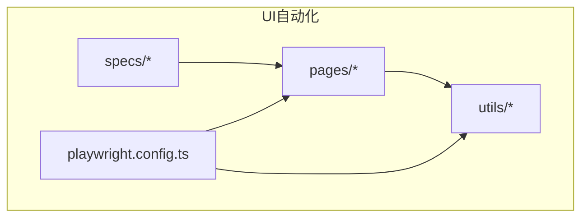
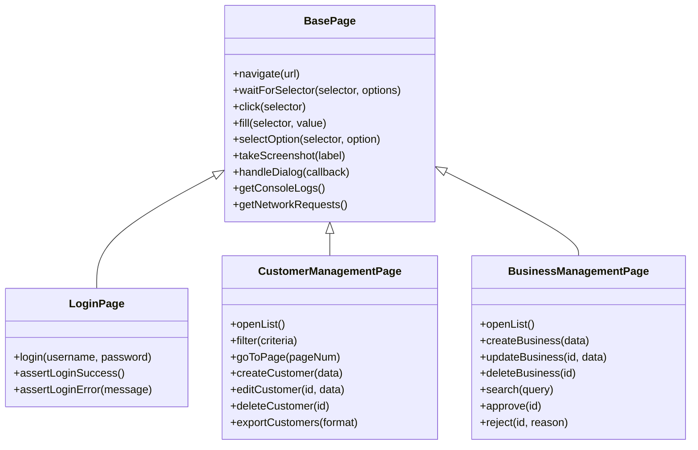
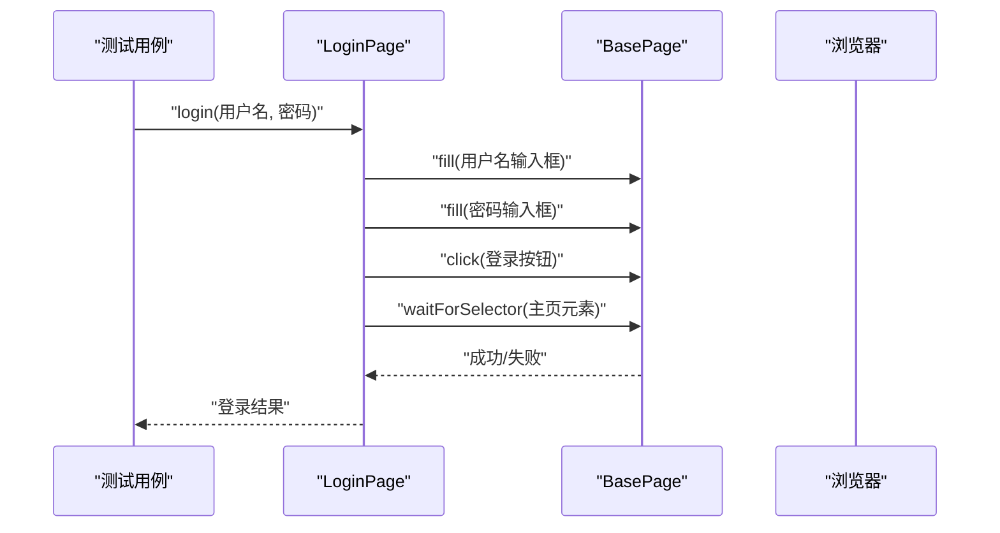
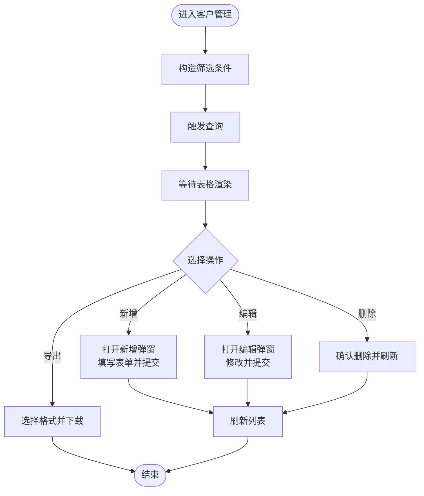
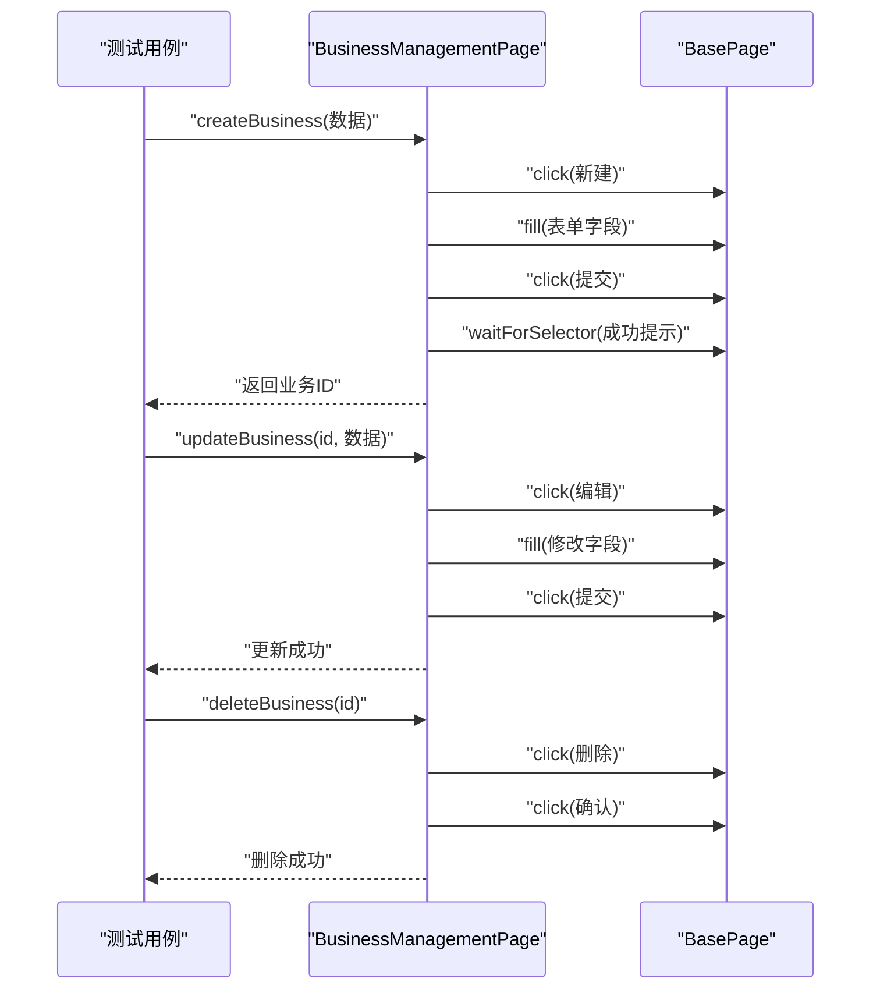
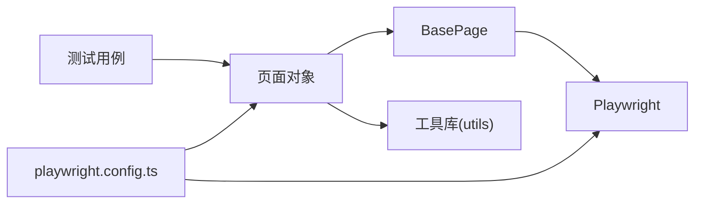

# 页面对象模式实现

<cite>
**本文引用的文件**   
- [BasePage.ts](file://tests/ui/pages/BasePage.ts)
- [LoginPage.ts](file://tests/ui/pages/LoginPage.ts)
- [CustomerManagementPage.ts](file://tests/ui/pages/CustomerManagementPage.ts)
- [BusinessManagementPage.ts](file://tests/ui/pages/BusinessManagementPage.ts)
- [HomePage.ts](file://tests/ui/pages/HomePage.ts)
- [ClueManagementPage.ts](file://tests/ui/pages/ClueManagementPage.ts)
- [ContactManagementPage.ts](file://tests/ui/pages/ContactManagementPage.ts)
- [ProductManagementPage.ts](file://tests/ui/pages/ProductManagementPage.ts)
- [QuotationManagementPage.ts](file://tests/ui/pages/QuotationManagementPage.ts)
- [SystemManagementPage.ts](file://tests/ui/pages/SystemManagementPage.ts)
- [playwright.config.ts](file://tests/ui/playwright.config.ts)
- [amis-helper.ts](file://tests/ui/utils/amis-helper.ts)
- [form-utils.ts](file://tests/ui/utils/form-utils.ts)
- [select-utils.ts](file://tests/ui/utils/select-utils.ts)
- [test-data-manager.ts](file://tests/ui/utils/test-data-manager.ts)
- [validation-engine.ts](file://tests/ui/utils/validation-engine.ts)
- [crm-crud.spec.ts](file://tests/ui/specs/crm/crm-crud.spec.ts)
- [business-crud.spec.ts](file://tests/ui/specs/crm/business-crud.spec.ts)
</cite>

## 目录
1. [简介](#简介)
2. [项目结构](#项目结构)
3. [核心组件](#核心组件)
4. [架构总览](#架构总览)
5. [详细组件分析](#详细组件分析)
6. [依赖关系分析](#依赖关系分析)
7. [性能考虑](#性能考虑)
8. [故障排查指南](#故障排查指南)
9. [结论](#结论)
10. [附录](#附录)

## 简介
本技术文档围绕 AutoTest Hub 的 UI 自动化测试中的“页面对象模式”实现，系统性阐述 BasePage 基类的设计理念与通用能力，并深入解析 LoginPage、CustomerManagementPage、BusinessManagementPage 等关键页面的封装方式。文档同时提供最佳实践、扩展指南以及响应式与移动端适配方案，帮助读者快速构建稳定、可维护的 UI 自动化测试资产。

## 项目结构
UI 自动化相关代码位于 tests/ui 目录下，采用“按功能域组织页面对象 + 工具库 + 用例集”的结构：
- pages：页面对象（BasePage 与各业务页面）
- utils：通用工具（表单、选择器、数据、校验等）
- specs：按模块组织的测试用例
- playwright.config.ts：Playwright 配置（浏览器、超时、截图、重试等）

图表来源
- [playwright.config.ts](file://tests/ui/playwright.config.ts)
- [BasePage.ts](file://tests/ui/pages/BasePage.ts)

章节来源
- [playwright.config.ts](file://tests/ui/playwright.config.ts)

## 核心组件
- BasePage 基类
  - 职责：统一封装浏览器上下文、等待策略、元素定位、截图、日志、导航与弹窗处理等通用能力，为所有具体页面提供一致的 API。
  - 设计要点：
    - 通过构造函数注入 Page/Frame 实例，避免全局状态耦合。
    - 提供显式等待与智能等待方法，屏蔽底层差异。
    - 封装常见交互（点击、输入、选择、滚动、拖拽、键盘操作）。
    - 统一错误处理与诊断信息收集（截图、控制台日志、网络请求）。
- 业务页面对象
  - LoginPage：登录流程封装，含凭据填充、提交、跳转与异常提示断言。
  - CustomerManagementPage：客户管理复杂交互（筛选、分页、批量操作、导出、弹窗表单）。
  - BusinessManagementPage：业务管理 CRUD（创建、读取、更新、删除）与列表操作封装。
  - 其他页面（Home、Clue、Contact、Product、Quotation、System）：各自领域的高阶操作封装。

章节来源
- [BasePage.ts](file://tests/ui/pages/BasePage.ts)
- [LoginPage.ts](file://tests/ui/pages/LoginPage.ts)
- [CustomerManagementPage.ts](file://tests/ui/pages/CustomerManagementPage.ts)
- [BusinessManagementPage.ts](file://tests/ui/pages/BusinessManagementPage.ts)

## 架构总览
页面对象层向上暴露稳定的业务 API，向下依赖 Playwright 的 Page/Frame 与工具库；用例层仅调用页面对象方法，不直接操作 DOM 或选择器。

图表来源
- [BasePage.ts](file://tests/ui/pages/BasePage.ts)
- [LoginPage.ts](file://tests/ui/pages/LoginPage.ts)
- [CustomerManagementPage.ts](file://tests/ui/pages/CustomerManagementPage.ts)
- [BusinessManagementPage.ts](file://tests/ui/pages/BusinessManagementPage.ts)

## 详细组件分析

### BasePage 基类
- 设计理念
  - 单一职责：只关注“跨页面通用能力”，不包含任何业务语义。
  - 显式等待优先：以稳定性为核心，减少偶发失败。
  - 可观测性：统一截图、日志、网络与控制台采集，便于排障。
- 核心能力
  - 导航与等待：navigate、waitForSelector、waitForURL、waitForLoadState。
  - 元素交互：click、fill、type、press、hover、scrollIntoView。
  - 选择与表单：selectOption、check、uncheck、radio。
  - 弹窗与对话框：handleDialog、acceptDialog、dismissDialog。
  - 截图与诊断：takeScreenshot、getConsoleLogs、getNetworkRequests。
  - 错误处理：包装常见异常，附加上下文（URL、时间戳、截图路径）。
- 复杂度与性能
  - 等待策略 O(1) 调用，内部使用自适应超时与轮询，避免忙等。
  - 截图与日志按需开启，默认关闭以减少 I/O 开销。
- 最佳实践
  - 在子类中仅定义业务级方法，选择器尽量集中管理。
  - 对异步结果进行断言前，先做存在性与可见性检查。

章节来源
- [BasePage.ts](file://tests/ui/pages/BasePage.ts)

### LoginPage 登录页面
- 职责边界
  - 封装登录表单填写、提交、跳转验证与错误提示断言。
  - 将认证状态与后续页面访问解耦，用例只需调用 login()。
- 关键流程
  - 输入用户名/密码 -> 点击登录 -> 等待主界面元素出现 -> 返回成功状态或抛出明确错误。
- 错误处理
  - 捕获网络错误、DOM 未就绪、验证码/二次验证等场景，给出可读性强的断言消息。
- 与用例集成
  - 用例通过 LoginPage.login() 完成前置准备，无需关心具体选择器。

图表来源
- [LoginPage.ts](file://tests/ui/pages/LoginPage.ts)
- [BasePage.ts](file://tests/ui/pages/BasePage.ts)

章节来源
- [LoginPage.ts](file://tests/ui/pages/LoginPage.ts)

### CustomerManagementPage 客户管理页面
- 职责边界
  - 封装客户列表的筛选、分页、新增、编辑、删除、导出等复杂交互。
  - 抽象出“条件构造器”与“批量操作”接口，提升复用性。
- 数据流
  - 输入筛选条件 -> 触发查询 -> 等待表格渲染 -> 获取行数据 -> 执行增删改查 -> 刷新列表。
- 复杂交互
  - 弹窗表单：打开/关闭、字段校验、提交、错误回显。
  - 多选与批量：全选、反选、批量删除、批量导出。
  - 分页与排序：页码切换、列头排序、每页条数调整。
- 错误与健壮性
  - 针对动态加载、懒渲染、虚拟列表等场景增加等待与重试。
  - 对空状态、无权限、网络异常进行差异化处理。

图表来源
- [CustomerManagementPage.ts](file://tests/ui/pages/CustomerManagementPage.ts)
- [BasePage.ts](file://tests/ui/pages/BasePage.ts)

章节来源
- [CustomerManagementPage.ts](file://tests/ui/pages/CustomerManagementPage.ts)

### BusinessManagementPage 业务管理页面
- 职责边界
  - 封装业务对象的 CRUD 与审批流转（如批准/拒绝），并提供搜索与过滤。
- 关键流程
  - 创建：打开新建弹窗 -> 填写必填项 -> 提交 -> 断言成功 -> 返回列表验证。
  - 更新：定位目标记录 -> 打开编辑 -> 修改字段 -> 提交 -> 断言变更生效。
  - 删除：定位目标记录 -> 删除确认 -> 断言消失。
  - 审批：根据状态执行批准/拒绝，附带原因与审计信息。
- 与用例集成
  - 用例通过 create/update/delete/search/approve/reject 等方法编排业务流程。

图表来源
- [BusinessManagementPage.ts](file://tests/ui/pages/BusinessManagementPage.ts)
- [BasePage.ts](file://tests/ui/pages/BasePage.ts)

章节来源
- [BusinessManagementPage.ts](file://tests/ui/pages/BusinessManagementPage.ts)

### 其他页面对象概览
- HomePage：首页导航入口、菜单展开、快捷入口点击。
- ClueManagementPage：线索管理（分配、转化、跟进记录）。
- ContactManagementPage：联系人管理（关联客户、联系方式维护）。
- ProductManagementPage：产品管理（分类、价格、上下架）。
- QuotationManagementPage：报价单管理（生成、审批、归档）。
- SystemManagementPage：系统管理（用户、角色、菜单、字典）。

章节来源
- [HomePage.ts](file://tests/ui/pages/HomePage.ts)
- [ClueManagementPage.ts](file://tests/ui/pages/ClueManagementPage.ts)
- [ContactManagementPage.ts](file://tests/ui/pages/ContactManagementPage.ts)
- [ProductManagementPage.ts](file://tests/ui/pages/ProductManagementPage.ts)
- [QuotationManagementPage.ts](file://tests/ui/pages/QuotationManagementPage.ts)
- [SystemManagementPage.ts](file://tests/ui/pages/SystemManagementPage.ts)

## 依赖关系分析
- 页面对象依赖
  - 所有业务页面继承 BasePage，复用通用能力。
  - 部分页面可能组合 utils 下的工具（如 amis-helper、form-utils、select-utils、test-data-manager、validation-engine）。
- 用例与页面对象
  - 用例仅依赖页面对象 API，不直接引用选择器或底层 API。
- 外部依赖
  - Playwright 作为浏览器控制与等待机制的基础。
  - 配置文件 playwright.config.ts 决定浏览器、超时、截图、重试等运行参数。

图表来源
- [playwright.config.ts](file://tests/ui/playwright.config.ts)
- [BasePage.ts](file://tests/ui/pages/BasePage.ts)
- [amis-helper.ts](file://tests/ui/utils/amis-helper.ts)
- [form-utils.ts](file://tests/ui/utils/form-utils.ts)
- [select-utils.ts](file://tests/ui/utils/select-utils.ts)
- [test-data-manager.ts](file://tests/ui/utils/test-data-manager.ts)
- [validation-engine.ts](file://tests/ui/utils/validation-engine.ts)

章节来源
- [playwright.config.ts](file://tests/ui/playwright.config.ts)

## 性能考虑
- 等待策略
  - 优先使用基于元素的显式等待，避免固定 sleep。
  - 对大数据量列表采用分页/增量加载策略，减少首屏渲染压力。
- 资源占用
  - 截图与日志仅在失败或需要时启用，降低 I/O 开销。
  - 合理设置并发与重试次数，避免浏览器资源争用。
- 选择器优化
  - 使用稳定且短的选择器，避免深层嵌套与正则匹配。
  - 对动态 ID 使用属性+文本的组合定位。

[本节为通用指导，不直接分析具体文件]

## 故障排查指南
- 常见问题
  - 元素不可见/未就绪：检查是否缺少显式等待或页面尚未渲染完成。
  - 选择器不稳定：优先使用 data-testid 或稳定的属性组合。
  - 弹窗未关闭：确保在下一步操作前显式关闭或断言弹窗已消失。
  - 网络请求失败：结合 getNetworkRequests 与控制台日志定位。
- 诊断手段
  - 失败自动截图与视频录制（由配置驱动）。
  - 打印当前 URL、窗口大小、控制台输出与网络请求摘要。
  - 使用 handleDialog 捕获并记录弹窗内容。

章节来源
- [BasePage.ts](file://tests/ui/pages/BasePage.ts)
- [playwright.config.ts](file://tests/ui/playwright.config.ts)

## 结论
通过 BasePage 的统一抽象与业务页面的高内聚封装，AutoTest Hub 的 UI 自动化实现了良好的可维护性与可扩展性。遵循本文的最佳实践与扩展指南，团队可以快速新增页面对象、稳定覆盖复杂交互，并在多端环境下保持一致的测试体验。

[本节为总结性内容，不直接分析具体文件]

## 附录

### 最佳实践清单
- 元素选择器管理
  - 优先使用 data-testid 或稳定的属性组合；避免纯文本与深层 CSS 路径。
  - 将选择器集中在页面类的常量区，便于统一维护。
- 方法命名约定
  - 动词开头，语义清晰：openXxx、createXxx、updateXxx、deleteXxx、searchXxx、approveXxx。
  - 返回值明确：布尔值表示成功/失败，或返回必要的数据对象。
- 错误处理策略
  - 对常见异常进行归类与包装，附带上下文（URL、时间戳、截图路径）。
  - 对可恢复错误进行有限次重试，对不可恢复错误立即失败并保留证据。
- 等待机制
  - 显式等待优先，必要时辅以最小化轮询；避免固定休眠。
  - 对动态内容（弹窗、通知、骨架屏）增加专用等待方法。
- 数据与表单
  - 使用 test-data-manager 生成与管理测试数据，保证幂等与隔离。
  - 借助 form-utils 与 validation-engine 统一表单填充与校验逻辑。
- 选择器与下拉
  - 使用 select-utils 封装复杂选择器（多级联动、搜索型下拉）。
  - 对 Amis 表单使用 amis-helper 提供的专用方法。

[本节为通用指导，不直接分析具体文件]

### 如何创建新的页面对象类
- 步骤
  - 新建页面类并继承 BasePage。
  - 在构造函数中注入 Page/Frame 实例。
  - 定义页面常量（选择器集合）。
  - 实现业务方法，复用 BasePage 的通用能力。
  - 在对应用例中引入并使用新页面类。
- 示例参考路径
  - 参考现有页面：[LoginPage.ts](file://tests/ui/pages/LoginPage.ts)、[BusinessManagementPage.ts](file://tests/ui/pages/BusinessManagementPage.ts)
  - 参考用例集成：[crm-crud.spec.ts](file://tests/ui/specs/crm/crm-crud.spec.ts)、[business-crud.spec.ts](file://tests/ui/specs/crm/business-crud.spec.ts)

章节来源
- [LoginPage.ts](file://tests/ui/pages/LoginPage.ts)
- [BusinessManagementPage.ts](file://tests/ui/pages/BusinessManagementPage.ts)
- [crm-crud.spec.ts](file://tests/ui/specs/crm/crm-crud.spec.ts)
- [business-crud.spec.ts](file://tests/ui/specs/crm/business-crud.spec.ts)

### 响应式设计与移动端适配
- 视口与设备
  - 通过配置设置不同视口尺寸与设备像素比，模拟移动端行为。
  - 对触摸事件与手势操作，使用 Playwright 的 touch 相关 API。
- 布局差异
  - 针对移动端隐藏/显示的元素，使用更稳健的定位策略（如按 role 或 aria-label）。
  - 对折叠菜单与抽屉面板，提供统一的 open/close 封装。
- 交互差异
  - 长按、滑动、缩放等操作需单独封装，并在用例中按需启用。
  - 对移动端特有的弹窗与遮罩，增加等待与断言。

章节来源
- [playwright.config.ts](file://tests/ui/playwright.config.ts)