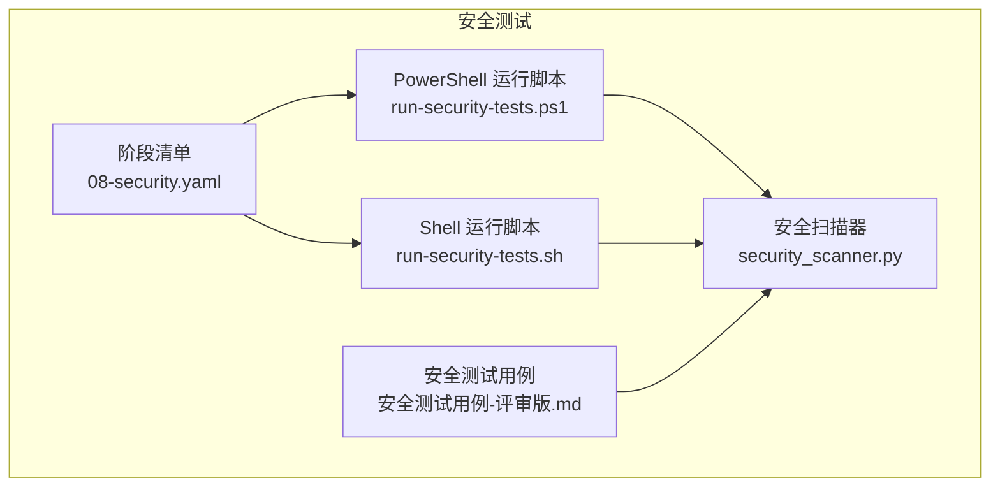
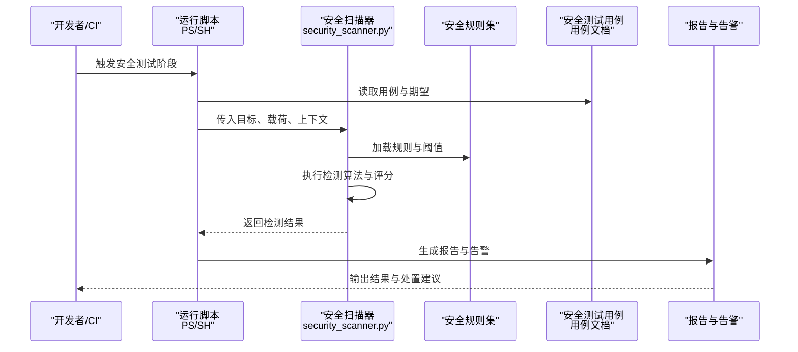
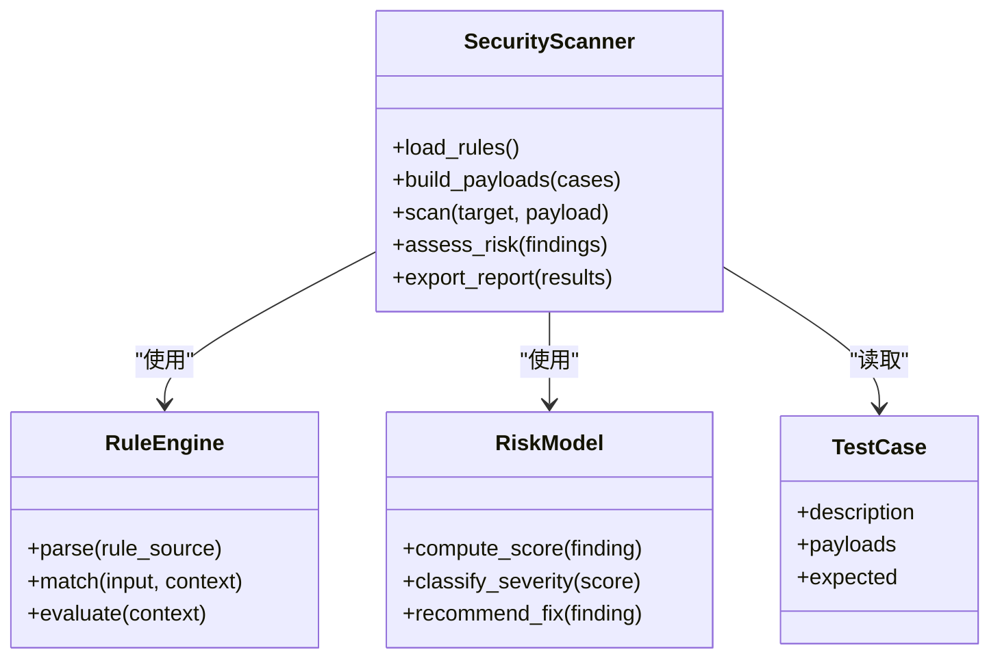
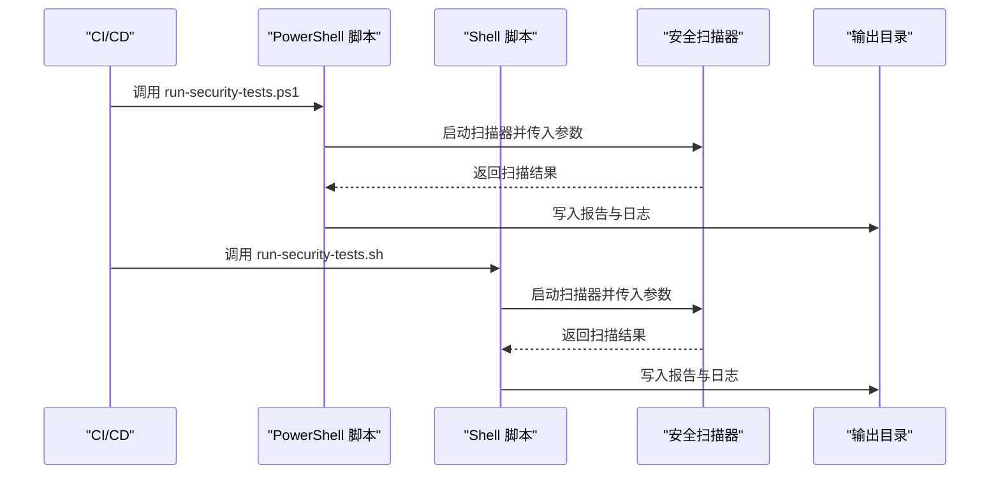
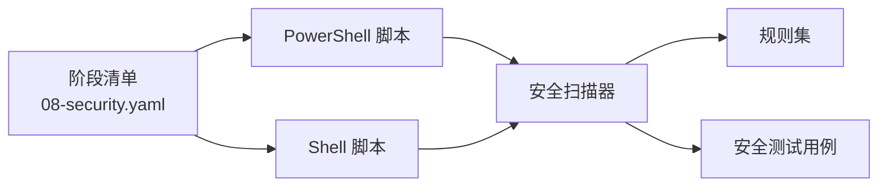

# 安全测试

<cite>
**本文引用的文件**   
- [security_scanner.py](file://tests/security/scanner/security_scanner.py)
- [run-security-tests.ps1](file://scripts/run-security-tests.ps1)
- [run-security-tests.sh](file://scripts/run-security-tests.sh)
- [08-security.yaml](file://stage-manifests/08-security.yaml)
- [安全测试用例-评审版.md](file://docs/cases/安全测试用例-评审版.md)
</cite>

## 目录
1. [简介](#简介)
2. [项目结构](#项目结构)
3. [核心组件](#核心组件)
4. [架构总览](#架构总览)
5. [详细组件分析](#详细组件分析)
6. [依赖关系分析](#依赖关系分析)
7. [性能考虑](#性能考虑)
8. [故障排查指南](#故障排查指南)
9. [结论](#结论)
10. [附录](#附录)

## 简介
本技术文档面向 AutoTest Hub 的安全测试模块，聚焦于自定义安全扫描器的实现原理与功能特性，涵盖漏洞检测算法、安全规则引擎与风险评估模型。文档同时覆盖常见安全测试场景（SQL 注入、XSS、权限绕过、数据泄露）的检测方法，安全测试用例的设计模式与执行流程，以及与自动化测试流水线的集成方式。此外，提供安全漏洞分类体系、严重级别评估与修复建议，并说明配置选项、报告格式与告警机制，最后给出最佳实践与持续安全监控策略。

## 项目结构
安全测试相关代码与脚本主要分布在以下位置：
- 扫描器实现：tests/security/scanner/security_scanner.py
- 运行脚本：scripts/run-security-tests.ps1、scripts/run-security-tests.sh
- 流水线编排：stage-manifests/08-security.yaml
- 用例设计：docs/cases/安全测试用例-评审版.md

图表来源
- [security_scanner.py](file://tests/security/scanner/security_scanner.py)
- [run-security-tests.ps1](file://scripts/run-security-tests.ps1)
- [run-security-tests.sh](file://scripts/run-security-tests.sh)
- [08-security.yaml](file://stage-manifests/08-security.yaml)
- [安全测试用例-评审版.md](file://docs/cases/安全测试用例-评审版.md)

章节来源
- [security_scanner.py](file://tests/security/scanner/security_scanner.py)
- [run-security-tests.ps1](file://scripts/run-security-tests.ps1)
- [run-security-tests.sh](file://scripts/run-security-tests.sh)
- [08-security.yaml](file://stage-manifests/08-security.yaml)
- [安全测试用例-评审版.md](file://docs/cases/安全测试用例-评审版.md)

## 核心组件
- 安全扫描器（Python）
  - 负责加载安全规则、对输入载荷进行匹配与解析、生成检测结果与风险评分。
  - 支持可扩展的规则定义与插件式扩展点，便于新增漏洞类型与检测逻辑。
- 运行脚本（PowerShell/Shell）
  - 封装环境准备、参数传递、扫描器调用、结果收集与归档。
  - 提供跨平台一致的执行体验，适配 CI/CD 环境。
- 阶段清单（YAML）
  - 描述安全测试在整体流水线中的阶段、触发条件、资源需求与产物输出。
- 安全测试用例（Markdown）
  - 定义测试目标、前置条件、步骤、预期结果与验收标准，指导扫描器与人工验证。

章节来源
- [security_scanner.py](file://tests/security/scanner/security_scanner.py)
- [run-security-tests.ps1](file://scripts/run-security-tests.ps1)
- [run-security-tests.sh](file://scripts/run-security-tests.sh)
- [08-security.yaml](file://stage-manifests/08-security.yaml)
- [安全测试用例-评审版.md](file://docs/cases/安全测试用例-评审版.md)

## 架构总览
安全测试的整体流程由“用例驱动 + 规则引擎 + 扫描器执行 + 结果聚合”构成。

图表来源
- [run-security-tests.ps1](file://scripts/run-security-tests.ps1)
- [run-security-tests.sh](file://scripts/run-security-tests.sh)
- [security_scanner.py](file://tests/security/scanner/security_scanner.py)
- [安全测试用例-评审版.md](file://docs/cases/安全测试用例-评审版.md)

## 详细组件分析

### 安全扫描器（security_scanner.py）
- 职责
  - 规则加载与解析：从规则源读取检测模式、上下文约束与阈值。
  - 载荷构造与注入：根据用例生成或组合输入载荷，模拟攻击面。
  - 检测与匹配：基于正则、语法树、语义特征等算法识别潜在漏洞。
  - 风险评估：结合影响范围、可利用性、暴露面计算风险分数。
  - 结果输出：结构化记录发现项、证据、定位信息与修复建议。
- 关键能力
  - 可扩展规则引擎：以声明式方式定义规则，支持优先级、作用域与条件分支。
  - 多模态检测：文本模式匹配、请求/响应特征分析、行为差异比对。
  - 可插拔适配器：对接不同协议与接口（HTTP、数据库、消息队列等）。
- 复杂度与性能
  - 规则匹配时间复杂度与规则数量及载荷规模线性相关；可通过规则分组与并行化优化。
  - 内存占用受规则集大小与缓存策略影响；建议按需加载与增量更新。
- 错误处理
  - 对不可用目标、网络异常、规则解析失败进行容错与重试。
  - 记录诊断日志与断点信息，便于问题定位。

章节来源
- [security_scanner.py](file://tests/security/scanner/security_scanner.py)

#### 类图（概念映射）

图表来源
- [security_scanner.py](file://tests/security/scanner/security_scanner.py)

### 运行脚本（PowerShell/Shell）
- 职责
  - 环境初始化：安装依赖、设置环境变量、准备目标与凭据。
  - 参数装配：将用例、规则路径、输出目录等参数传递给扫描器。
  - 执行编排：串行/并发执行多个扫描任务，汇总结果。
  - 产物管理：保存报告、截图、日志与指标，供后续阶段消费。
- 跨平台一致性
  - PowerShell 与 Shell 双实现，保证 Windows 与 Linux/macOS 环境均可运行。
- 与流水线集成
  - 通过阶段清单触发，支持失败阻断、产物上传与通知。

章节来源
- [run-security-tests.ps1](file://scripts/run-security-tests.ps1)
- [run-security-tests.sh](file://scripts/run-security-tests.sh)

#### 序列图（执行流程）

图表来源
- [run-security-tests.ps1](file://scripts/run-security-tests.ps1)
- [run-security-tests.sh](file://scripts/run-security-tests.sh)
- [security_scanner.py](file://tests/security/scanner/security_scanner.py)

### 阶段清单（08-security.yaml）
- 职责
  - 定义安全测试阶段的名称、触发条件、资源配额与超时。
  - 指定输入工件（用例、规则）、输出工件（报告、指标）与依赖阶段。
  - 提供质量门禁：如严重缺陷数阈值、覆盖率要求等。
- 可观测性
  - 记录阶段耗时、失败原因与产物链接，便于回溯与分析。

章节来源
- [08-security.yaml](file://stage-manifests/08-security.yaml)

### 安全测试用例（安全测试用例-评审版.md）
- 内容组织
  - 用例编号、标题、目标系统、前置条件、测试步骤、载荷说明、预期结果与验收标准。
- 覆盖范围
  - SQL 注入、XSS、越权访问、敏感信息泄露、命令注入、路径遍历、反序列化等。
- 复用与参数化
  - 通过变量与模板减少重复，支持批量执行与回归对比。

章节来源
- [安全测试用例-评审版.md](file://docs/cases/安全测试用例-评审版.md)

## 依赖关系分析
- 内部依赖
  - 运行脚本依赖扫描器与用例文档；阶段清单驱动运行脚本。
- 外部依赖
  - 目标应用接口、数据库、消息系统等作为被扫描对象。
  - 第三方库（如 HTTP 客户端、正则库、JSON/YAML 解析器）用于载荷构造与结果处理。
- 耦合与内聚
  - 扫描器与规则引擎解耦，通过接口契约降低耦合度；运行脚本仅关注编排与产物管理。
- 循环依赖
  - 当前结构无循环依赖；若引入新的中间件需确保单向依赖。

图表来源
- [08-security.yaml](file://stage-manifests/08-security.yaml)
- [run-security-tests.ps1](file://scripts/run-security-tests.ps1)
- [run-security-tests.sh](file://scripts/run-security-tests.sh)
- [security_scanner.py](file://tests/security/scanner/security_scanner.py)
- [安全测试用例-评审版.md](file://docs/cases/安全测试用例-评审版.md)

## 性能考虑
- 规则优化
  - 合并相似规则、启用短路匹配、按作用域过滤以减少无效检查。
- 并发与批处理
  - 对独立用例与目标进行并发扫描，注意限流与资源隔离。
- 缓存与增量
  - 缓存规则解析结果与热点载荷指纹，避免重复计算。
- 资源控制
  - 限制单次扫描的内存与 CPU 使用，防止 OOM 与抖动。

[本节为通用指导，不直接分析具体文件]

## 故障排查指南
- 常见问题
  - 规则加载失败：检查规则文件格式与路径权限。
  - 目标不可达：确认网络连通性与认证凭据。
  - 结果缺失：核对输出目录权限与磁盘空间。
- 诊断手段
  - 开启详细日志，捕获请求/响应快照与堆栈信息。
  - 使用最小用例复现，逐步缩小问题范围。
- 恢复策略
  - 重试与降级：对临时性错误自动重试，必要时回退到保守模式。
  - 隔离与熔断：对不稳定目标进行隔离，避免级联失败。

章节来源
- [security_scanner.py](file://tests/security/scanner/security_scanner.py)
- [run-security-tests.ps1](file://scripts/run-security-tests.ps1)
- [run-security-tests.sh](file://scripts/run-security-tests.sh)

## 结论
AutoTest Hub 的安全测试模块以“用例驱动 + 规则引擎 + 扫描器执行 + 结果聚合”为核心架构，具备可扩展、可观测与可集成的特点。通过规范化的用例设计与严格的门禁策略，可在持续集成中稳定发现并上报安全风险，配合修复建议与告警机制形成闭环治理。

[本节为总结性内容，不直接分析具体文件]

## 附录

### 常见安全测试场景与方法
- SQL 注入
  - 检测方法：参数注入、联合查询、布尔盲注、时间盲注、报错注入。
  - 验证要点：观察响应差异、错误信息、延迟与数据库交互痕迹。
- XSS 攻击
  - 检测方法：反射型、存储型、DOM 型；编码绕过与事件注入。
  - 验证要点：页面渲染、脚本执行、Cookie 窃取与跨站请求伪造联动。
- 权限绕过
  - 检测方法：水平越权、垂直越权、IDOR、会话劫持、角色伪装。
  - 验证要点：资源访问边界、鉴权链路完整性与审计日志。
- 数据泄露
  - 检测方法：敏感字段明文传输、调试信息暴露、备份文件下载、错误堆栈泄露。
  - 验证要点：传输加密、脱敏策略、最小披露原则与日志清理。

[本节为通用知识，不直接分析具体文件]

### 漏洞分类体系与严重级别评估
- 分类维度
  - 类型：注入、跨站脚本、身份认证与会话管理、授权、安全配置、数据保护、业务逻辑。
  - 影响面：单用户、多用户、全系统；数据敏感性；合规影响。
- 严重级别
  - 致命：可直接导致系统接管或大规模数据泄露。
  - 高危：可造成重要数据泄露或关键功能破坏。
  - 中危：可影响部分功能或有限范围的数据安全。
  - 低危：影响较小，通常需特定条件利用。
- 修复建议
  - 输入校验与白名单、参数化查询、输出编码与 CSP、最小权限与强认证、加密与脱敏、安全基线与补丁管理。

[本节为通用知识，不直接分析具体文件]

### 安全测试配置选项
- 目标与范围
  - 目标地址、端口、协议、路径白名单/黑名单、并发度、超时与重试次数。
- 规则与阈值
  - 规则集路径、启用/禁用规则、严重级别阈值、误报容忍度。
- 输出与告警
  - 报告格式（JSON/HTML/CSV）、输出目录、告警通道（邮件/IM/工单）、告警阈值与去重策略。
- 环境与凭据
  - 测试账号、令牌、证书、代理与域名解析。

[本节为通用知识，不直接分析具体文件]

### 报告格式与告警机制
- 报告字段
  - 漏洞标题、类型、严重级别、受影响资产、证据（请求/响应/截图）、定位信息、修复建议、状态与责任人。
- 告警策略
  - 实时告警（高危/致命）、定时汇总（每日/每周）、升级策略（未修复超时升级）。
- 可视化与追踪
  - 趋势图、分布图、回归对比、与缺陷系统联动跟踪。

[本节为通用知识，不直接分析具体文件]

### 用例设计模式与执行流程
- 设计模式
  - 参数化用例、模板化载荷、正负样本对照、边界与异常用例、回归基线。
- 执行流程
  - 准备环境 → 加载用例与规则 → 构造载荷 → 执行扫描 → 判定结果 → 生成报告 → 触发告警。
- 流水线集成
  - 阶段触发、产物归档、质量门禁、失败阻断与回滚策略。

章节来源
- [安全测试用例-评审版.md](file://docs/cases/安全测试用例-评审版.md)
- [08-security.yaml](file://stage-manifests/08-security.yaml)

### 最佳实践与持续安全监控
- 最佳实践
  - 左移安全：在设计与开发阶段引入规则与门禁。
  - 最小权限与默认拒绝：严格鉴权与访问控制。
  - 安全基线：统一配置与版本管理，定期巡检。
  - 演练与复盘：定期红蓝对抗与事故复盘。
- 持续监控
  - 运行时防护：WAF、RASP、SIEM 与审计日志。
  - 指标与看板：漏洞密度、修复时长、复发率、覆盖率。
  - 自动化反馈：缺陷自动创建、指派与提醒。

[本节为通用知识，不直接分析具体文件]