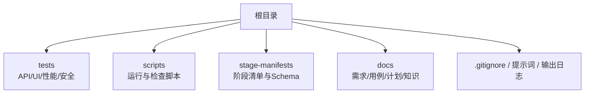
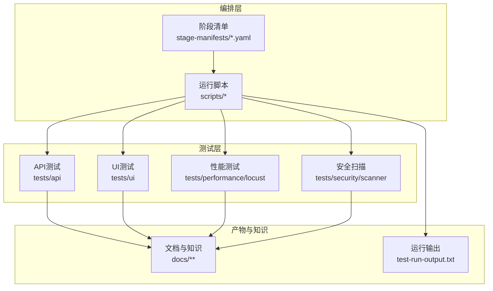
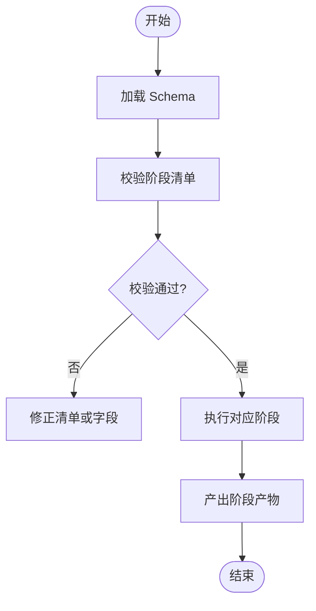
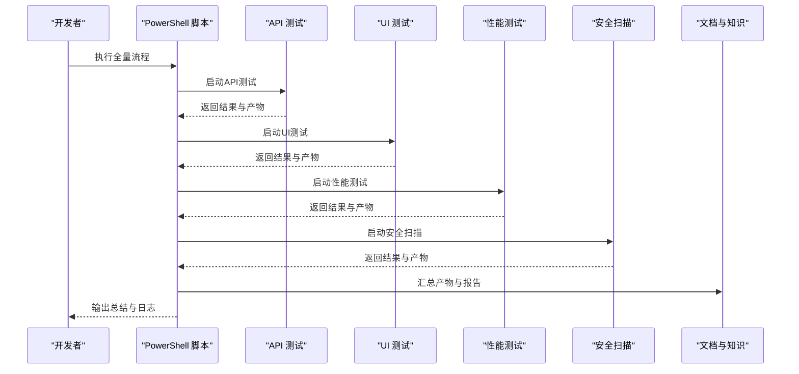
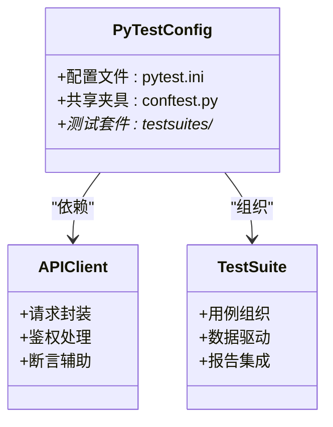
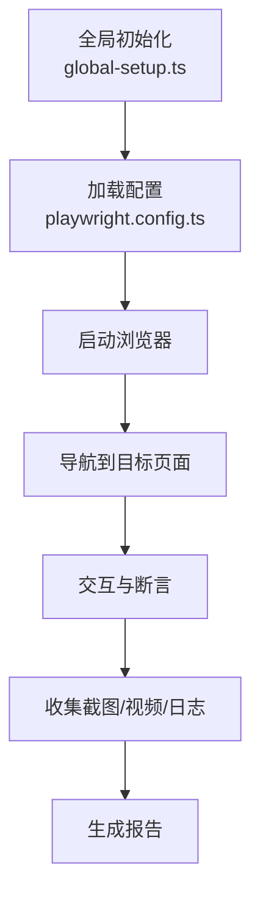
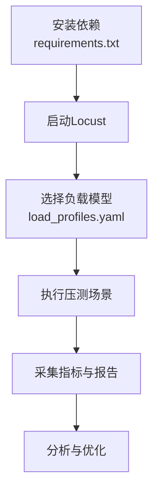
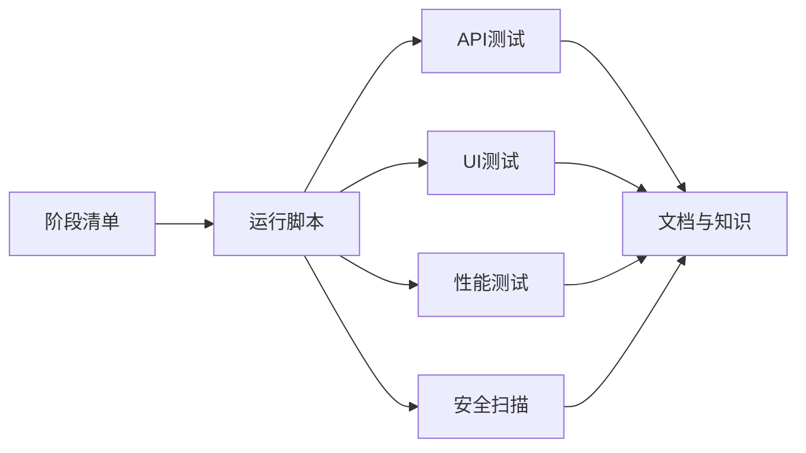

# 开发指南

<cite>
**本文引用的文件**   
- [提示词.md](file://提示词.md)
- [test-run-output.txt](file://test-run-output.txt)
- [.gitignore](file://.gitignore)
- [stage-manifests/schema.yaml](file://stage-manifests/schema.yaml)
- [stage-manifests/01-req-analysis.yaml](file://stage-manifests/01-req-analysis.yaml)
- [stage-manifests/02-test-design.yaml](file://stage-manifests/02-test-design.yaml)
- [stage-manifests/03-case-generation.yaml](file://stage-manifests/03-case-generation.yaml)
- [stage-manifests/04-case-review.yaml](file://stage-manifests/04-case-review.yaml)
- [stage-manifests/05-api-automation.yaml](file://stage-manifests/05-api-automation.yaml)
- [stage-manifests/06-ui-automation.yaml](file://stage-manifests/06-ui-automation.yaml)
- [stage-manifests/07-performance.yaml](file://stage-manifests/07-performance.yaml)
- [stage-manifests/08-security.yaml](file://stage-manifests/08-security.yaml)
- [stage-manifests/09-system-test-report.yaml](file://stage-manifests/09-system-test-report.yaml)
- [stage-manifests/10-knowledge-base.yaml](file://stage-manifests/10-knowledge-base.yaml)
- [scripts/run-full-test-flow.ps1](file://scripts/run-full-test-flow.ps1)
- [scripts/run-full-test-flow-simple.ps1](file://scripts/run-full-test-flow-simple.ps1)
- [scripts/run-api-tests.ps1](file://scripts/run-api-tests.ps1)
- [scripts/run-ui-tests.ps1](file://scripts/run-ui-tests.ps1)
- [scripts/run-perf-tests.ps1](file://scripts/run-perf-tests.ps1)
- [scripts/run-security-tests.ps1](file://scripts/run-security-tests.ps1)
- [scripts/check-stage.sh](file://scripts/check-stage.sh)
- [scripts/check-stage.ps1](file://scripts/check-stage.ps1)
- [scripts/lib/stage-common.ps1](file://scripts/lib/stage-common.ps1)
- [tests/api/conftest.py](file://tests/api/conftest.py)
- [tests/api/pytest.ini](file://tests/api/pytest.ini)
- [tests/config/env.yaml](file://tests/config/env.yaml)
- [tests/ui/playwright.config.ts](file://tests/ui/playwright.config.ts)
- [tests/ui/global-setup.ts](file://tests/ui/global-setup.ts)
- [tests/performance/locust/README.md](file://tests/performance/locust/README.md)
- [tests/performance/locust/requirements.txt](file://tests/performance/locust/requirements.txt)
- [tests/security/scanner/security_scanner.py](file://tests/security/scanner/security_scanner.py)
- [docs/knowledge/README.md](file://docs/knowledge/README.md)
- [docs/knowledge/回归测试资产索引.md](file://docs/knowledge/回归测试资产索引.md)
- [docs/knowledge/环境与工具问题库.md](file://docs/knowledge/环境与工具问题库.md)
- [docs/knowledge/自动化资产维护清单.md](file://docs/knowledge/自动化资产维护清单.md)
</cite>

## 目录
1. [简介](#简介)
2. [项目结构](#项目结构)
3. [核心组件](#核心组件)
4. [架构总览](#架构总览)
5. [详细组件分析](#详细组件分析)
6. [依赖分析](#依赖分析)
7. [性能考虑](#性能考虑)
8. [故障排查指南](#故障排查指南)
9. [结论](#结论)
10. [附录](#附录)

## 简介
本指南面向AutoTest Hub框架的开发者与测试工程师，提供从环境搭建、代码规范、贡献流程到测试编写、调试排障、知识资产管理以及版本发布的全链路说明。文档以仓库现有脚本、配置与阶段化清单为依据，帮助团队在统一标准下高效协作与持续交付。

## 项目结构
仓库采用“多语言混合 + 阶段化编排”的组织方式：
- 测试用例与驱动：Python（API）、TypeScript（UI）、Locust（性能）、安全扫描脚本等
- 阶段化清单：YAML 描述各阶段产物与依赖，便于流水线编排与审计
- 运行脚本：PowerShell/Shell 封装常用执行路径，统一入口
- 文档与知识：需求、用例、缺陷、协议、原型、测试计划与知识资产

图表来源
- [stage-manifests/schema.yaml](file://stage-manifests/schema.yaml)
- [scripts/run-full-test-flow.ps1](file://scripts/run-full-test-flow.ps1)

章节来源
- [提示词.md](file://提示词.md)
- [test-run-output.txt](file://test-run-output.txt)
- [.gitignore](file://.gitignore)

## 核心组件
- 阶段化清单（stage-manifests）：定义需求分析、用例设计、用例生成、评审、API/UI自动化、性能、安全、系统报告、知识库等阶段的输入/输出与约束，配合 schema.yaml 校验。
- 运行脚本（scripts）：封装端到端流程与分域执行入口，屏蔽平台差异，提供一键式执行能力。
- API 测试（tests/api）：基于 pytest 组织，conftest.py 提供共享夹具，pytest.ini 管理运行参数。
- UI 测试（tests/ui）：基于 Playwright，playwright.config.ts 与 global-setup.ts 管理浏览器与全局初始化。
- 性能测试（tests/performance/locust）：使用 Locust 进行接口与UI冒烟压测，README 与 requirements.txt 明确依赖与用法。
- 安全扫描（tests/security/scanner）：提供基础安全扫描脚本入口。
- 知识资产（docs/knowledge）：集中维护回归资产索引、环境问题库与自动化资产维护清单。

章节来源
- [stage-manifests/schema.yaml](file://stage-manifests/schema.yaml)
- [stage-manifests/01-req-analysis.yaml](file://stage-manifests/01-req-analysis.yaml)
- [stage-manifests/02-test-design.yaml](file://stage-manifests/02-test-design.yaml)
- [stage-manifests/03-case-generation.yaml](file://stage-manifests/03-case-generation.yaml)
- [stage-manifests/04-case-review.yaml](file://stage-manifests/04-case-review.yaml)
- [stage-manifests/05-api-automation.yaml](file://stage-manifests/05-api-automation.yaml)
- [stage-manifests/06-ui-automation.yaml](file://stage-manifests/06-ui-automation.yaml)
- [stage-manifests/07-performance.yaml](file://stage-manifests/07-performance.yaml)
- [stage-manifests/08-security.yaml](file://stage-manifests/08-security.yaml)
- [stage-manifests/09-system-test-report.yaml](file://stage-manifests/09-system-test-report.yaml)
- [stage-manifests/10-knowledge-base.yaml](file://stage-manifests/10-knowledge-base.yaml)
- [scripts/run-full-test-flow.ps1](file://scripts/run-full-test-flow.ps1)
- [scripts/run-full-test-flow-simple.ps1](file://scripts/run-full-test-flow-simple.ps1)
- [tests/api/conftest.py](file://tests/api/conftest.py)
- [tests/api/pytest.ini](file://tests/api/pytest.ini)
- [tests/ui/playwright.config.ts](file://tests/ui/playwright.config.ts)
- [tests/ui/global-setup.ts](file://tests/ui/global-setup.ts)
- [tests/performance/locust/README.md](file://tests/performance/locust/README.md)
- [tests/performance/locust/requirements.txt](file://tests/performance/locust/requirements.txt)
- [tests/security/scanner/security_scanner.py](file://tests/security/scanner/security_scanner.py)
- [docs/knowledge/README.md](file://docs/knowledge/README.md)
- [docs/knowledge/回归测试资产索引.md](file://docs/knowledge/回归测试资产索引.md)
- [docs/knowledge/环境与工具问题库.md](file://docs/knowledge/环境与工具问题库.md)
- [docs/knowledge/自动化资产维护清单.md](file://docs/knowledge/自动化资产维护清单.md)

## 架构总览
整体架构围绕“阶段化清单 + 运行脚本 + 多技术栈测试套件”展开。阶段清单作为契约，驱动脚本按序执行；脚本负责环境准备、任务分发与结果聚合；测试套件产出可追溯的产物并沉淀至 docs 与 stage-manifests 指定的位置。

图表来源
- [stage-manifests/schema.yaml](file://stage-manifests/schema.yaml)
- [scripts/run-full-test-flow.ps1](file://scripts/run-full-test-flow.ps1)
- [test-run-output.txt](file://test-run-output.txt)

## 详细组件分析

### 阶段化清单与Schema
- schema.yaml 定义阶段清单的结构与字段约束，确保各阶段 YAML 的一致性。
- 01~10 号清单分别覆盖需求分析、用例设计、用例生成、评审、API/UI自动化、性能、安全、系统报告、知识库等阶段，形成端到端质量保障闭环。

图表来源
- [stage-manifests/schema.yaml](file://stage-manifests/schema.yaml)
- [stage-manifests/01-req-analysis.yaml](file://stage-manifests/01-req-analysis.yaml)
- [stage-manifests/02-test-design.yaml](file://stage-manifests/02-test-design.yaml)
- [stage-manifests/03-case-generation.yaml](file://stage-manifests/03-case-generation.yaml)
- [stage-manifests/04-case-review.yaml](file://stage-manifests/04-case-review.yaml)
- [stage-manifests/05-api-automation.yaml](file://stage-manifests/05-api-automation.yaml)
- [stage-manifests/06-ui-automation.yaml](file://stage-manifests/06-ui-automation.yaml)
- [stage-manifests/07-performance.yaml](file://stage-manifests/07-performance.yaml)
- [stage-manifests/08-security.yaml](file://stage-manifests/08-security.yaml)
- [stage-manifests/09-system-test-report.yaml](file://stage-manifests/09-system-test-report.yaml)
- [stage-manifests/10-knowledge-base.yaml](file://stage-manifests/10-knowledge-base.yaml)

章节来源
- [stage-manifests/schema.yaml](file://stage-manifests/schema.yaml)
- [stage-manifests/01-req-analysis.yaml](file://stage-manifests/01-req-analysis.yaml)
- [stage-manifests/02-test-design.yaml](file://stage-manifests/02-test-design.yaml)
- [stage-manifests/03-case-generation.yaml](file://stage-manifests/03-case-generation.yaml)
- [stage-manifests/04-case-review.yaml](file://stage-manifests/04-case-review.yaml)
- [stage-manifests/05-api-automation.yaml](file://stage-manifests/05-api-automation.yaml)
- [stage-manifests/06-ui-automation.yaml](file://stage-manifests/06-ui-automation.yaml)
- [stage-manifests/07-performance.yaml](file://stage-manifests/07-performance.yaml)
- [stage-manifests/08-security.yaml](file://stage-manifests/08-security.yaml)
- [stage-manifests/09-system-test-report.yaml](file://stage-manifests/09-system-test-report.yaml)
- [stage-manifests/10-knowledge-base.yaml](file://stage-manifests/10-knowledge-base.yaml)

### 运行脚本与端到端流程
- run-full-test-flow.ps1 与 run-full-test-flow-simple.ps1 提供全量与简化版端到端执行入口。
- 分域脚本：run-api-tests.ps1、run-ui-tests.ps1、run-perf-tests.ps1、run-security-tests.ps1 用于快速定位问题。
- check-stage.sh/.ps1 与 lib/stage-common.ps1 提供阶段检查与公共逻辑复用。

图表来源
- [scripts/run-full-test-flow.ps1](file://scripts/run-full-test-flow.ps1)
- [scripts/run-full-test-flow-simple.ps1](file://scripts/run-full-test-flow-simple.ps1)
- [scripts/run-api-tests.ps1](file://scripts/run-api-tests.ps1)
- [scripts/run-ui-tests.ps1](file://scripts/run-ui-tests.ps1)
- [scripts/run-perf-tests.ps1](file://scripts/run-perf-tests.ps1)
- [scripts/run-security-tests.ps1](file://scripts/run-security-tests.ps1)
- [scripts/check-stage.sh](file://scripts/check-stage.sh)
- [scripts/check-stage.ps1](file://scripts/check-stage.ps1)
- [scripts/lib/stage-common.ps1](file://scripts/lib/stage-common.ps1)

章节来源
- [scripts/run-full-test-flow.ps1](file://scripts/run-full-test-flow.ps1)
- [scripts/run-full-test-flow-simple.ps1](file://scripts/run-full-test-flow-simple.ps1)
- [scripts/run-api-tests.ps1](file://scripts/run-api-tests.ps1)
- [scripts/run-ui-tests.ps1](file://scripts/run-ui-tests.ps1)
- [scripts/run-perf-tests.ps1](file://scripts/run-perf-tests.ps1)
- [scripts/run-security-tests.ps1](file://scripts/run-security-tests.ps1)
- [scripts/check-stage.sh](file://scripts/check-stage.sh)
- [scripts/check-stage.ps1](file://scripts/check-stage.ps1)
- [scripts/lib/stage-common.ps1](file://scripts/lib/stage-common.ps1)

### API 测试组件（pytest）
- conftest.py 提供共享夹具与生命周期钩子，减少重复代码。
- pytest.ini 管理运行参数、标记与缓存策略。
- testsuites 下按业务域组织测试套件，便于分层与并行执行。

图表来源
- [tests/api/conftest.py](file://tests/api/conftest.py)
- [tests/api/pytest.ini](file://tests/api/pytest.ini)

章节来源
- [tests/api/conftest.py](file://tests/api/conftest.py)
- [tests/api/pytest.ini](file://tests/api/pytest.ini)

### UI 测试组件（Playwright）
- playwright.config.ts 管理浏览器、超时、截图、视频与并行度等关键配置。
- global-setup.ts 提供全局初始化（如登录态、环境准备）。
- pages/specs/utils 分层清晰，便于维护与扩展。

图表来源
- [tests/ui/playwright.config.ts](file://tests/ui/playwright.config.ts)
- [tests/ui/global-setup.ts](file://tests/ui/global-setup.ts)

章节来源
- [tests/ui/playwright.config.ts](file://tests/ui/playwright.config.ts)
- [tests/ui/global-setup.ts](file://tests/ui/global-setup.ts)

### 性能测试组件（Locust）
- README.md 提供使用说明与最佳实践。
- requirements.txt 锁定依赖版本，保证环境一致性。
- locustfile_* 与 utils 实现场景建模与数据加载。

图表来源
- [tests/performance/locust/README.md](file://tests/performance/locust/README.md)
- [tests/performance/locust/requirements.txt](file://tests/performance/locust/requirements.txt)

章节来源
- [tests/performance/locust/README.md](file://tests/performance/locust/README.md)
- [tests/performance/locust/requirements.txt](file://tests/performance/locust/requirements.txt)

### 安全扫描组件
- security_scanner.py 提供安全扫描入口，可与 CI 集成，输出风险清单与建议。

章节来源
- [tests/security/scanner/security_scanner.py](file://tests/security/scanner/security_scanner.py)

### 知识资产与维护
- docs/knowledge 下的 README、回归测试资产索引、环境与工具问题库、自动化资产维护清单构成知识基座，支撑持续改进与团队协作。

章节来源
- [docs/knowledge/README.md](file://docs/knowledge/README.md)
- [docs/knowledge/回归测试资产索引.md](file://docs/knowledge/回归测试资产索引.md)
- [docs/knowledge/环境与工具问题库.md](file://docs/knowledge/环境与工具问题库.md)
- [docs/knowledge/自动化资产维护清单.md](file://docs/knowledge/自动化资产维护清单.md)

## 依赖分析
- 阶段清单与脚本耦合：脚本读取阶段清单并驱动相应测试套件，清单变更需同步更新脚本与CI。
- 测试套件内聚：API/UI/性能/安全各自独立，通过脚本聚合，降低模块间耦合。
- 外部依赖：Python（pytest、requests等）、Node/TypeScript（Playwright）、Locust 及其插件。

图表来源
- [stage-manifests/schema.yaml](file://stage-manifests/schema.yaml)
- [scripts/run-full-test-flow.ps1](file://scripts/run-full-test-flow.ps1)

章节来源
- [stage-manifests/schema.yaml](file://stage-manifests/schema.yaml)
- [scripts/run-full-test-flow.ps1](file://scripts/run-full-test-flow.ps1)

## 性能考虑
- 并行执行：合理设置并发度，避免资源争用导致不稳定。
- 数据隔离：为每个用例准备独立数据，避免相互污染。
- 资源回收：及时释放浏览器实例、连接池与临时文件。
- 监控与采样：在关键路径埋点，记录耗时与错误率，结合报告定位瓶颈。
- 渐进压测：从小规模逐步放大，观察系统拐点与容量边界。

[本节为通用指导，不直接分析具体文件]

## 故障排查指南
- 运行失败优先查看 test-run-output.txt 与对应分域脚本输出，定位失败阶段与用例。
- 环境不一致：核对 .gitignore 与 requirements.txt，确保本地与CI一致。
- 阶段清单错误：使用 check-stage.* 校验清单结构与必填字段。
- UI 不稳定：检查 playwright.config.ts 的超时与重试策略，确认 global-setup.ts 的登录态与环境变量。
- 性能波动：关注网络抖动与服务端限流，调整并发与思考时间。
- 安全问题：根据安全扫描报告逐项修复并回归验证。

章节来源
- [test-run-output.txt](file://test-run-output.txt)
- [scripts/check-stage.sh](file://scripts/check-stage.sh)
- [scripts/check-stage.ps1](file://scripts/check-stage.ps1)
- [tests/ui/playwright.config.ts](file://tests/ui/playwright.config.ts)
- [tests/ui/global-setup.ts](file://tests/ui/global-setup.ts)
- [tests/performance/locust/README.md](file://tests/performance/locust/README.md)
- [tests/security/scanner/security_scanner.py](file://tests/security/scanner/security_scanner.py)

## 结论
AutoTest Hub 通过阶段化清单与统一脚本将多技术栈测试整合为可复用的工程体系。遵循本指南的环境、规范与流程，可在保证质量的同时提升交付效率。建议持续完善知识资产与自动化清单，推动团队协同与持续改进。

[本节为总结性内容，不直接分析具体文件]

## 附录

### 开发环境搭建要求
- IDE 与语言运行时
  - Python 3.x：用于 API 与安全扫描脚本
  - Node.js 与 TypeScript：用于 UI 测试（Playwright）
  - PowerShell/Shell：用于运行与检查脚本
- 依赖管理
  - Python：pip 与虚拟环境（参考 .venv）
  - Node：npm/yarn 与 package.json（如有）
  - Locust：requirements.txt 锁定依赖
- 环境变量
  - 参考 tests/config/env.yaml 配置目标环境、账号与开关项
- 调试工具
  - Python：pytest 断言与日志
  - UI：Playwright 截图/视频/追踪
  - 性能：Locust Web UI 与导出报告

章节来源
- [tests/config/env.yaml](file://tests/config/env.yaml)
- [tests/performance/locust/requirements.txt](file://tests/performance/locust/requirements.txt)
- [tests/ui/playwright.config.ts](file://tests/ui/playwright.config.ts)

### 代码规范与贡献流程
- 编码标准
  - Python：PEP8 风格，函数/类命名清晰，注释简洁准确
  - TypeScript：遵循 ESLint/Prettier 规则（若启用），类型声明完整
  - 脚本：幂等、健壮、错误信息明确
- 提交规范
  - 提交信息包含阶段与范围，如“阶段: 用例生成, 模块: API”
  - 小步提交，关联需求或问题编号
- 代码审查
  - 至少一名同行评审，关注可读性、稳定性与可维护性
  - 变更需通过阶段检查与分域测试

[本节为通用指导，不直接分析具体文件]

### 测试用例编写规范与质量标准
- 用例设计
  - 覆盖正向、异常与边界场景
  - 数据驱动与参数化，避免硬编码
- 用例组织
  - API：按业务域划分 testsuites
  - UI：按页面与流程拆分 specs/pages/utils
  - 性能：按场景建模，区分冒烟与深度压测
- 质量标准
  - 稳定可靠：弱网与抖动容忍
  - 可观测：断言明确、日志充分、产物齐全
  - 可回归：纳入回归资产索引

章节来源
- [docs/knowledge/回归测试资产索引.md](file://docs/knowledge/回归测试资产索引.md)

### 添加新测试模块与扩展功能
- 新增 API 模块
  - 在 tests/api/testsuites 下新建业务目录与用例文件
  - 在 conftest.py 中注册必要夹具
  - 通过 run-api-tests.ps1 验证
- 新增 UI 模块
  - 在 tests/ui/pages 与 specs 下新增页面与场景
  - 如需全局初始化，更新 global-setup.ts
  - 通过 run-ui-tests.ps1 验证
- 新增性能场景
  - 在 tests/performance/locust 下新增 locustfile 与数据加载器
  - 通过 run-perf-tests.ps1 验证
- 新增安全扫描项
  - 在 tests/security/scanner 中扩展扫描规则
  - 通过 run-security-tests.ps1 验证

章节来源
- [scripts/run-api-tests.ps1](file://scripts/run-api-tests.ps1)
- [scripts/run-ui-tests.ps1](file://scripts/run-ui-tests.ps1)
- [scripts/run-perf-tests.ps1](file://scripts/run-perf-tests.ps1)
- [scripts/run-security-tests.ps1](file://scripts/run-security-tests.ps1)
- [tests/api/conftest.py](file://tests/api/conftest.py)
- [tests/ui/global-setup.ts](file://tests/ui/global-setup.ts)

### 调试技巧与常见问题
- 快速定位
  - 使用分域脚本缩小范围
  - 查看 test-run-output.txt 与阶段产物
- 常见错误
  - 环境未就绪：检查 env.yaml 与凭据
  - 浏览器不稳定：调整超时与重试
  - 性能抖动：降低并发或增加思考时间
- 日志与产物
  - 开启详细日志与截图/视频
  - 保留原始响应与中间状态

章节来源
- [test-run-output.txt](file://test-run-output.txt)
- [tests/ui/playwright.config.ts](file://tests/ui/playwright.config.ts)
- [tests/performance/locust/README.md](file://tests/performance/locust/README.md)

### 知识资产的维护与更新机制
- 维护清单
  - 定期更新自动化资产维护清单，标注版本与责任人
- 问题库
  - 将典型问题与解决方案沉淀至环境与工具问题库
- 回归索引
  - 新增用例后同步更新回归测试资产索引，确保可检索与可回归

章节来源
- [docs/knowledge/自动化资产维护清单.md](file://docs/knowledge/自动化资产维护清单.md)
- [docs/knowledge/环境与工具问题库.md](file://docs/knowledge/环境与工具问题库.md)
- [docs/knowledge/回归测试资产索引.md](file://docs/knowledge/回归测试资产索引.md)

### 版本管理、分支策略与发布流程
- 版本管理
  - 使用语义化版本号，标签对应阶段产物与报告
- 分支策略
  - main：稳定分支，仅合并已通过的阶段产物
  - feature/*：新功能与用例开发
  - hotfix/*：紧急修复
- 发布流程
  - 完成阶段清单校验与分域测试
  - 生成系统测试报告并归档
  - 更新知识资产与回归索引
  - 打标签并发布制品

章节来源
- [stage-manifests/schema.yaml](file://stage-manifests/schema.yaml)
- [stage-manifests/09-system-test-report.yaml](file://stage-manifests/09-system-test-report.yaml)
- [stage-manifests/10-knowledge-base.yaml](file://stage-manifests/10-knowledge-base.yaml)