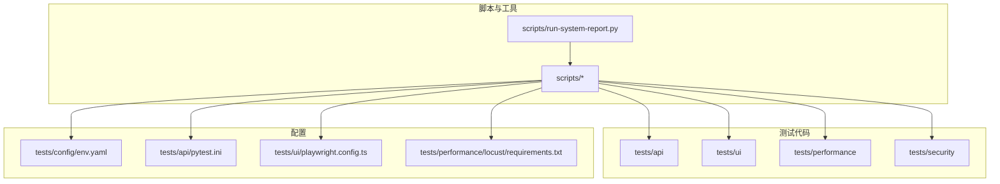
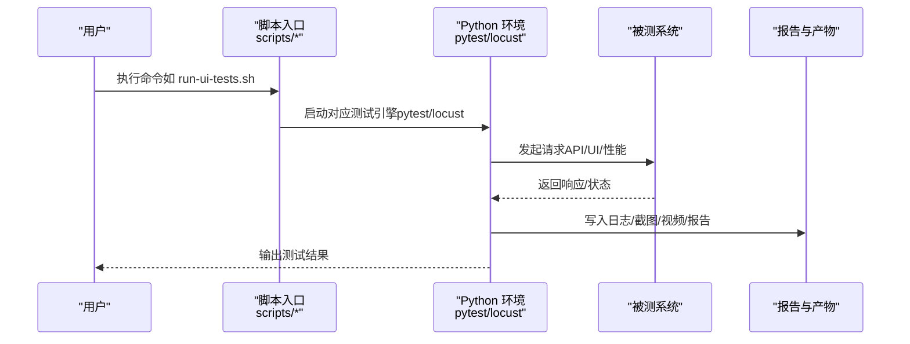
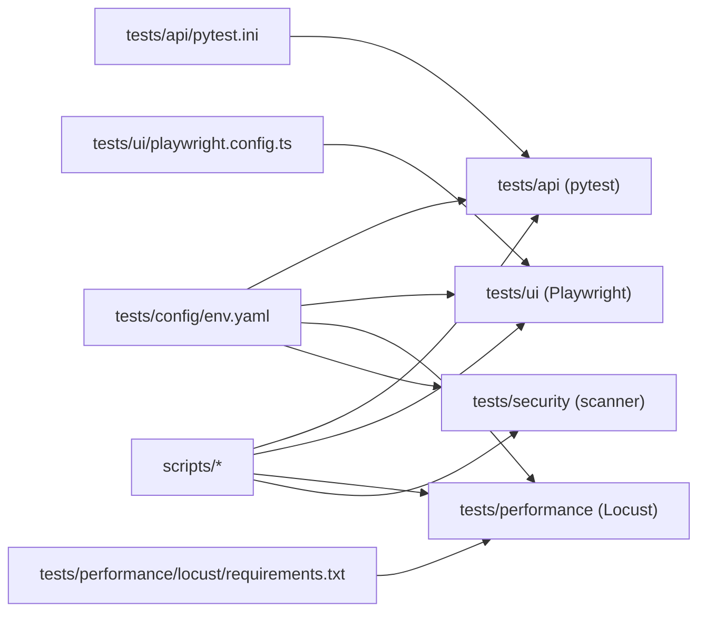

# 快速开始

<cite>
**本文引用的文件**   
- [tests/config/env.yaml](file://tests/config/env.yaml)
- [scripts/set-test-env.ps1](file://scripts/set-test-env.ps1)
- [scripts/run-ui-tests.sh](file://scripts/run-ui-tests.sh)
- [scripts/run-api-tests.sh](file://scripts/run-api-tests.sh)
- [scripts/run-perf-tests.sh](file://scripts/run-perf-tests.sh)
- [scripts/run-security-tests.sh](file://scripts/run-security-tests.sh)
- [scripts/run-full-test-flow.ps1](file://scripts/run-full-test-flow.ps1)
- [scripts/run-system-report.py](file://scripts/run-system-report.py)
- [tests/ui/playwright.config.ts](file://tests/ui/playwright.config.ts)
- [tests/api/pytest.ini](file://tests/api/pytest.ini)
- [tests/performance/locust/requirements.txt](file://tests/performance/locust/requirements.txt)
- [tests/performance/locust/README.md](file://tests/performance/locust/README.md)
- [tests/security/scanner/security_scanner.py](file://tests/security/scanner/security_scanner.py)
</cite>

## 目录
1. [简介](#简介)
2. [项目结构](#项目结构)
3. [核心组件](#核心组件)
4. [架构总览](#架构总览)
5. [详细组件分析](#详细组件分析)
6. [依赖关系分析](#依赖关系分析)
7. [性能考虑](#性能考虑)
8. [故障排查指南](#故障排查指南)
9. [结论](#结论)
10. [附录](#附录)

## 简介
本指南面向首次接触 AutoTest Hub 框架的测试工程师与开发者，目标是帮助你在最短时间内完成环境搭建、参数配置与端到端测试执行。你将学会：
- 安装并配置 Python、Node.js、Playwright 等关键依赖
- 配置测试环境参数（env.yaml）与系统变量
- 运行单模块测试与完整测试套件
- 定位常见问题并完成故障排查

## 项目结构
AutoTest Hub 采用分层组织方式：
- tests：按测试类型划分（api、ui、performance、security），包含用例、配置与工具
- scripts：跨平台脚本与一键流程入口
- stage-manifests：阶段化清单（可选）
- docs：文档与用例设计说明

图表来源
- [tests/config/env.yaml](file://tests/config/env.yaml)
- [tests/api/pytest.ini](file://tests/api/pytest.ini)
- [tests/ui/playwright.config.ts](file://tests/ui/playwright.config.ts)
- [tests/performance/locust/requirements.txt](file://tests/performance/locust/requirements.txt)
- [scripts/run-system-report.py](file://scripts/run-system-report.py)

章节来源
- [tests/config/env.yaml](file://tests/config/env.yaml)
- [tests/api/pytest.ini](file://tests/api/pytest.ini)
- [tests/ui/playwright.config.ts](file://tests/ui/playwright.config.ts)
- [tests/performance/locust/requirements.txt](file://tests/performance/locust/requirements.txt)
- [scripts/run-system-report.py](file://scripts/run-system-report.py)

## 核心组件
- 环境配置中心：tests/config/env.yaml，集中管理目标地址、认证凭据、浏览器与报告路径等
- 接口自动化：基于 pytest，使用 conftest 与 clients 封装 HTTP 客户端
- UI 自动化：基于 Playwright（TypeScript），通过 playwright.config.ts 管理浏览器与截图/视频输出
- 性能测试：基于 Locust，位于 tests/performance/locust，提供 locustfile 与结果生成工具
- 安全扫描：tests/security/scanner 下提供基础扫描器入口
- 统一脚本：scripts 下提供跨平台执行脚本与一键流程

章节来源
- [tests/config/env.yaml](file://tests/config/env.yaml)
- [tests/api/conftest.py](file://tests/api/conftest.py)
- [tests/api/clients/base_client.py](file://tests/api/clients/base_client.py)
- [tests/ui/playwright.config.ts](file://tests/ui/playwright.config.ts)
- [tests/performance/locust/README.md](file://tests/performance/locust/README.md)
- [tests/security/scanner/security_scanner.py](file://tests/security/scanner/security_scanner.py)

## 架构总览
下图展示了从“用户执行脚本”到“各层测试执行”的整体调用链与数据流向。

图表来源
- [scripts/run-ui-tests.sh](file://scripts/run-ui-tests.sh)
- [scripts/run-api-tests.sh](file://scripts/run-api-tests.sh)
- [scripts/run-perf-tests.sh](file://scripts/run-perf-tests.sh)
- [scripts/run-security-tests.sh](file://scripts/run-security-tests.sh)
- [tests/ui/playwright.config.ts](file://tests/ui/playwright.config.ts)
- [tests/api/pytest.ini](file://tests/api/pytest.ini)
- [tests/performance/locust/README.md](file://tests/performance/locust/README.md)

## 详细组件分析

### 环境与依赖准备
- Python
  - 建议版本：3.10+
  - 创建虚拟环境并激活
  - 安装 pytest 及相关依赖（参考 tests/api/pytest.ini 中的插件声明）
- Node.js
  - 建议版本：18+
  - 安装 Playwright 及其浏览器内核
  - 在 tests/ui 目录下初始化并安装依赖
- 性能与安全
  - 性能：Locust 依赖见 tests/performance/locust/requirements.txt
  - 安全：按需安装 security_scanner.py 所需依赖

章节来源
- [tests/api/pytest.ini](file://tests/api/pytest.ini)
- [tests/ui/playwright.config.ts](file://tests/ui/playwright.config.ts)
- [tests/performance/locust/requirements.txt](file://tests/performance/locust/requirements.txt)

### 配置测试环境参数（env.yaml）
- 位置：tests/config/env.yaml
- 用途：集中管理目标 URL、账号密码、浏览器选项、报告路径等
- 建议步骤：
  - 复制模板或新建 env.yaml
  - 填写被测系统地址、登录凭据、浏览器驱动路径（如需）
  - 保存后，确保后续脚本能读取该文件路径

章节来源
- [tests/config/env.yaml](file://tests/config/env.yaml)

### 设置系统变量与路径
- Windows PowerShell
  - 使用 scripts/set-test-env.ps1 设置必要的环境变量（如 PYTHONPATH、PLAYWRIGHT_BROWSERS_PATH、报告输出目录等）
- Linux/macOS
  - 在 shell 中导出相同变量，或在 CI 中注入环境变量
- 验证
  - 打印关键变量确认生效

章节来源
- [scripts/set-test-env.ps1](file://scripts/set-test-env.ps1)

### 运行接口测试（API）
- 前置条件
  - 已安装 Python 与 pytest
  - 已在 env.yaml 中配置被测接口地址与鉴权信息
- 执行步骤
  - 进入 tests/api 目录
  - 运行 pytest 指定测试集或单个文件
  - 查看生成的报告与日志
- 常用命令示例
  - 运行全部接口用例
  - 运行某个业务域的用例集
  - 仅运行冒烟用例

章节来源
- [tests/api/pytest.ini](file://tests/api/pytest.ini)
- [tests/api/conftest.py](file://tests/api/conftest.py)
- [tests/api/clients/base_client.py](file://tests/api/clients/base_client.py)

### 运行 UI 测试（Playwright）
- 前置条件
  - 已安装 Node.js 与 Playwright
  - 在 tests/ui 下执行依赖安装与浏览器下载
  - 在 env.yaml 中配置前端地址与浏览器选项
- 执行步骤
  - 进入 tests/ui 目录
  - 运行 Playwright 测试
  - 查看截图、视频与 trace 产物
- 常用命令示例
  - 运行全部 UI 用例
  - 运行 CRM 子集
  - 以调试模式运行

章节来源
- [tests/ui/playwright.config.ts](file://tests/ui/playwright.config.ts)
- [scripts/run-ui-tests.sh](file://scripts/run-ui-tests.sh)

### 运行性能测试（Locust）
- 前置条件
  - 安装 Python 与 Locust（参考 requirements.txt）
  - 在 env.yaml 中配置并发、持续时间与目标地址
- 执行步骤
  - 进入 tests/performance/locust
  - 启动 Locust Web 界面或直接压测
  - 查看结果与报告
- 常用命令示例
  - 启动 Web 控制台
  - 无头模式运行并生成报告

章节来源
- [tests/performance/locust/requirements.txt](file://tests/performance/locust/requirements.txt)
- [tests/performance/locust/README.md](file://tests/performance/locust/README.md)
- [scripts/run-perf-tests.sh](file://scripts/run-perf-tests.sh)

### 运行安全扫描
- 前置条件
  - 根据 security_scanner.py 的依赖提示安装相关库
  - 在 env.yaml 中配置扫描目标与策略
- 执行步骤
  - 直接运行扫描器脚本
  - 查看扫描结果与修复建议

章节来源
- [tests/security/scanner/security_scanner.py](file://tests/security/scanner/security_scanner.py)
- [scripts/run-security-tests.sh](file://scripts/run-security-tests.sh)

### 一键执行完整测试流程
- 使用 scripts/run-full-test-flow.ps1（Windows）或等效 Shell 脚本（Linux/macOS）
- 流程通常包括：
  - 环境检查与变量设置
  - 依次执行 API/UI/性能/安全测试
  - 汇总报告与产物归档
- 注意
  - 若某层失败，可单独回退到对应脚本进行复现
  - 建议在 CI 中分阶段执行，便于定位问题

章节来源
- [scripts/run-full-test-flow.ps1](file://scripts/run-full-test-flow.ps1)
- [scripts/run-system-report.py](file://scripts/run-system-report.py)

## 依赖关系分析

图表来源
- [tests/config/env.yaml](file://tests/config/env.yaml)
- [tests/api/pytest.ini](file://tests/api/pytest.ini)
- [tests/ui/playwright.config.ts](file://tests/ui/playwright.config.ts)
- [tests/performance/locust/requirements.txt](file://tests/performance/locust/requirements.txt)
- [scripts/run-ui-tests.sh](file://scripts/run-ui-tests.sh)
- [scripts/run-api-tests.sh](file://scripts/run-api-tests.sh)
- [scripts/run-perf-tests.sh](file://scripts/run-perf-tests.sh)
- [scripts/run-security-tests.sh](file://scripts/run-security-tests.sh)

## 性能考虑
- 并行执行
  - pytest 可使用 -n 参数并行；Playwright 支持多 worker；Locust 支持分布式
- 资源隔离
  - 为不同环境（dev/staging/prod）准备独立 env.yaml 与浏览器缓存目录
- 产物管理
  - 定期清理截图、视频与 trace，避免磁盘占用过高
- 超时与重试
  - 合理设置网络与页面等待超时，减少不稳定导致的重跑

[本节为通用指导，不直接分析具体文件]

## 故障排查指南
- 无法找到 env.yaml
  - 确认当前工作目录与脚本期望的路径一致
  - 检查 set-test-env.ps1 是否成功设置了相关路径变量
- Playwright 浏览器未安装或版本不匹配
  - 在 tests/ui 下重新安装依赖并下载浏览器内核
  - 检查 PLAYWRIGHT_BROWSERS_PATH 是否正确
- pytest 找不到插件或包
  - 检查 tests/api/pytest.ini 中声明的插件是否已安装
  - 确认虚拟环境已激活且 pip 指向正确
- Locust 启动失败
  - 核对 requirements.txt 版本与 Python 版本兼容性
  - 检查 env.yaml 中并发与目标地址配置
- 安全扫描器报错
  - 根据错误提示安装缺失依赖
  - 校验 env.yaml 中扫描策略与目标地址

章节来源
- [scripts/set-test-env.ps1](file://scripts/set-test-env.ps1)
- [tests/ui/playwright.config.ts](file://tests/ui/playwright.config.ts)
- [tests/api/pytest.ini](file://tests/api/pytest.ini)
- [tests/performance/locust/requirements.txt](file://tests/performance/locust/requirements.txt)
- [tests/security/scanner/security_scanner.py](file://tests/security/scanner/security_scanner.py)

## 结论
通过本指南，你已完成 AutoTest Hub 的基础环境搭建、参数配置与端到端测试执行。建议将常用命令沉淀为本地别名或 CI 流水线，并结合 env.yaml 实现多环境切换与稳定回归。

[本节为总结性内容，不直接分析具体文件]

## 附录
- 常用命令速查
  - 设置环境变量（PowerShell）
    - 执行 scripts/set-test-env.ps1
  - 运行接口测试
    - 进入 tests/api 后执行 pytest
  - 运行 UI 测试
    - 进入 tests/ui 后执行 Playwright 测试
  - 运行性能测试
    - 进入 tests/performance/locust 后启动 Locust
  - 运行安全扫描
    - 执行 security_scanner.py
  - 一键全流程
    - 执行 scripts/run-full-test-flow.ps1

章节来源
- [scripts/set-test-env.ps1](file://scripts/set-test-env.ps1)
- [scripts/run-ui-tests.sh](file://scripts/run-ui-tests.sh)
- [scripts/run-api-tests.sh](file://scripts/run-api-tests.sh)
- [scripts/run-perf-tests.sh](file://scripts/run-perf-tests.sh)
- [scripts/run-security-tests.sh](file://scripts/run-security-tests.sh)
- [scripts/run-full-test-flow.ps1](file://scripts/run-full-test-flow.ps1)
- [scripts/run-system-report.py](file://scripts/run-system-report.py)