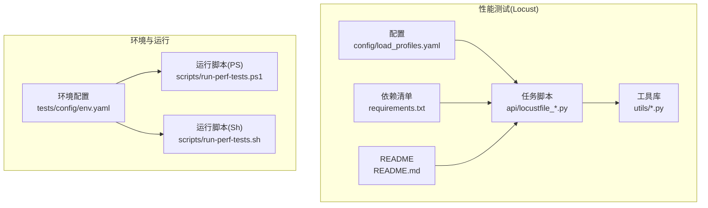
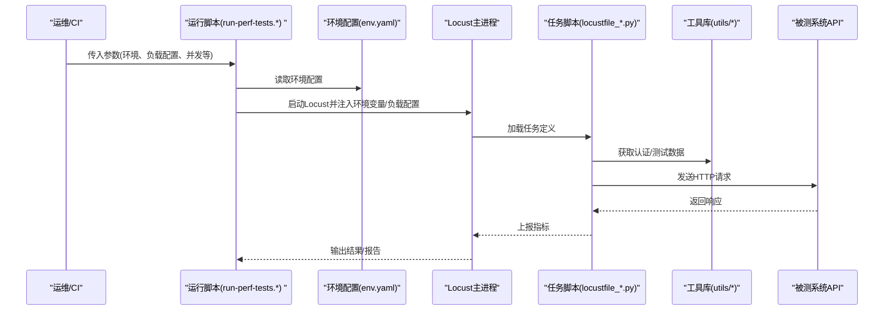
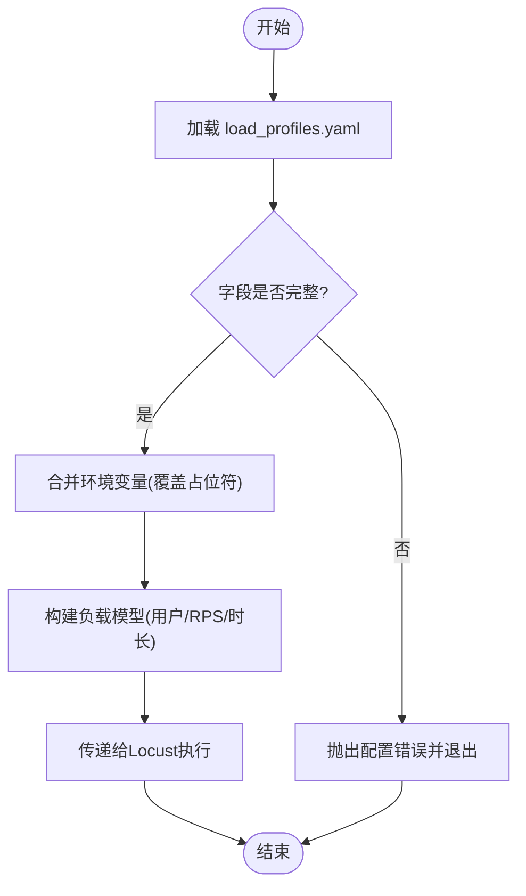
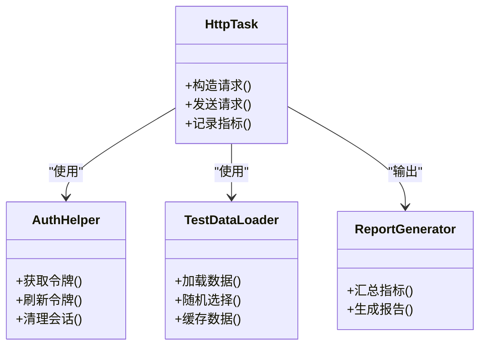
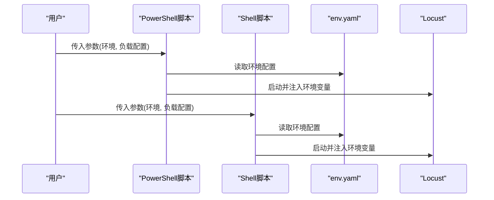
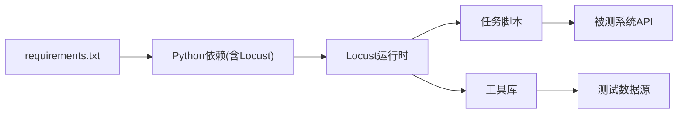

# Locust框架配置

<cite>
**本文引用的文件**   
- [load_profiles.yaml](file://tests/performance/locust/config/load_profiles.yaml)
- [requirements.txt](file://tests/performance/locust/requirements.txt)
- [README.md](file://tests/performance/locust/README.md)
- [locustfile_crm_api.py](file://tests/performance/locust/api/locustfile_crm_api.py)
- [locustfile_smoke.py](file://tests/performance/locust/api/locustfile_smoke.py)
- [auth_helper.py](file://tests/performance/locust/utils/auth_helper.py)
- [test_data_loader.py](file://tests/performance/locust/utils/test_data_loader.py)
- [report_generator.py](file://tests/performance/locust/utils/report_generator.py)
- [env.yaml](file://tests/config/env.yaml)
- [run-perf-tests.ps1](file://scripts/run-perf-tests.ps1)
- [run-perf-tests.sh](file://scripts/run-perf-tests.sh)
</cite>

## 目录
1. [简介](#简介)
2. [项目结构](#项目结构)
3. [核心组件](#核心组件)
4. [架构总览](#架构总览)
5. [详细组件分析](#详细组件分析)
6. [依赖关系分析](#依赖关系分析)
7. [性能考虑](#性能考虑)
8. [故障排查指南](#故障排查指南)
9. [结论](#结论)
10. [附录](#附录)

## 简介
本文件面向使用Locust进行性能测试的团队，聚焦于以下目标：
- 深入解释负载配置文件 load_profiles.yaml 的结构与参数设置（用户数量、请求频率、持续时间等）
- 说明环境变量在API端点、认证信息、测试数据源等方面的配置与管理方式
- 文档化Python包版本控制与兼容性要求
- 提供多环境（开发、测试、生产）差异化配置的最佳实践
- 给出配置验证与错误处理机制的实现细节与落地建议

## 项目结构
本项目将Locust性能测试相关代码集中在 tests/performance/locust 目录下，包含：
- 负载配置文件：config/load_profiles.yaml
- 任务脚本：api/*、ui/*
- 工具库：utils/*（认证、测试数据加载、报告生成等）
- 依赖清单：requirements.txt
- 运行脚本：scripts/run-perf-tests.*（PowerShell/Shell）
- 环境配置：tests/config/env.yaml

图表来源
- [load_profiles.yaml](file://tests/performance/locust/config/load_profiles.yaml)
- [locustfile_crm_api.py](file://tests/performance/locust/api/locustfile_crm_api.py)
- [locustfile_smoke.py](file://tests/performance/locust/api/locustfile_smoke.py)
- [auth_helper.py](file://tests/performance/locust/utils/auth_helper.py)
- [test_data_loader.py](file://tests/performance/locust/utils/test_data_loader.py)
- [report_generator.py](file://tests/performance/locust/utils/report_generator.py)
- [requirements.txt](file://tests/performance/locust/requirements.txt)
- [README.md](file://tests/performance/locust/README.md)
- [env.yaml](file://tests/config/env.yaml)
- [run-perf-tests.ps1](file://scripts/run-perf-tests.ps1)
- [run-perf-tests.sh](file://scripts/run-perf-tests.sh)

章节来源
- [README.md](file://tests/performance/locust/README.md)
- [requirements.txt](file://tests/performance/locust/requirements.txt)

## 核心组件
- 负载配置文件 load_profiles.yaml
  - 用于定义不同场景的负载模型，包括并发用户数、RPS（每秒请求数）、持续时间、预热时间、阶梯增长策略等。
  - 典型字段（示例含义，具体以实际文件为准）：
    - profiles: 列表，每个元素为一个负载场景
      - name: 场景名称
      - users: 并发用户数
      - spawn_rate: 用户生成速率（每秒新增用户数）
      - duration: 持续时间（秒）
      - rps_limit: 可选的全局RPS上限
      - ramp_up: 可选的爬坡阶段配置（如逐步增加用户或RPS）
      - headers: 可选的请求头模板（如鉴权令牌占位符）
      - endpoints: 可选的接口集合，指定要压测的URL模式
- 任务脚本 locustfile_*.py
  - 实现具体的HTTP请求逻辑，读取配置与环境变量，构造请求并上报指标。
  - 常见职责：
    - 从环境变量或配置文件加载API基地址、路径、方法、头部、载荷
    - 调用认证工具获取令牌
    - 使用Locust TaskSet/HttpUser发起请求
    - 统计成功/失败、延迟分布、吞吐等
- 工具库 utils/*
  - auth_helper.py：封装认证流程（如登录、刷新令牌），支持从环境变量读取凭据
  - test_data_loader.py：加载CSV/JSON/YAML等测试数据，供压测用例复用
  - report_generator.py：汇总结果，输出HTML/JSON报告
- 运行脚本 run-perf-tests.*
  - 统一入口，负责解析命令行参数、加载环境配置、启动Locust进程、传递负载配置与环境变量
- 环境配置 env.yaml
  - 集中管理不同环境的API地址、认证信息、数据源路径等，便于切换

章节来源
- [load_profiles.yaml](file://tests/performance/locust/config/load_profiles.yaml)
- [locustfile_crm_api.py](file://tests/performance/locust/api/locustfile_crm_api.py)
- [locustfile_smoke.py](file://tests/performance/locust/api/locustfile_smoke.py)
- [auth_helper.py](file://tests/performance/locust/utils/auth_helper.py)
- [test_data_loader.py](file://tests/performance/locust/utils/test_data_loader.py)
- [report_generator.py](file://tests/performance/locust/utils/report_generator.py)
- [run-perf-tests.ps1](file://scripts/run-perf-tests.ps1)
- [run-perf-tests.sh](file://scripts/run-perf-tests.sh)
- [env.yaml](file://tests/config/env.yaml)

## 架构总览
下图展示了从“运行脚本”到“Locust任务执行”的关键交互路径，以及配置与数据的流向。

图表来源
- [run-perf-tests.ps1](file://scripts/run-perf-tests.ps1)
- [run-perf-tests.sh](file://scripts/run-perf-tests.sh)
- [env.yaml](file://tests/config/env.yaml)
- [locustfile_crm_api.py](file://tests/performance/locust/api/locustfile_crm_api.py)
- [locustfile_smoke.py](file://tests/performance/locust/api/locustfile_smoke.py)
- [auth_helper.py](file://tests/performance/locust/utils/auth_helper.py)
- [test_data_loader.py](file://tests/performance/locust/utils/test_data_loader.py)

## 详细组件分析

### 负载配置 load_profiles.yaml
- 设计目标
  - 将“场景-参数”解耦，使同一套任务脚本可复用多种负载模型
  - 支持快速切换不同环境下的负载策略（如冒烟、基准、容量、稳定性）
- 关键参数说明（结合常见用法）
  - profiles[].name：场景标识，便于日志与报告区分
  - profiles[].users：目标并发用户数
  - profiles[].spawn_rate：用户生成速率，控制爬坡速度
  - profiles[].duration：压测持续时间（秒）
  - profiles[].rps_limit：全局RPS上限（若启用限流）
  - profiles[].ramp_up：可选爬坡阶段，如分步提升用户数或RPS
  - profiles[].headers：请求头模板，支持占位符替换（如令牌）
  - profiles[].endpoints：接口集合，指定URL模式与方法
- 推荐组织方式
  - 按环境+场景命名，例如 dev-smoke、staging-baseline、prod-capacity
  - 将敏感信息（令牌、密钥）放入环境变量，不在YAML中硬编码
- 校验与默认值
  - 建议在启动前对必填字段进行校验（如name、users、duration）
  - 为可选字段提供合理默认值（如spawn_rate=1、rps_limit=None）

图表来源
- [load_profiles.yaml](file://tests/performance/locust/config/load_profiles.yaml)

章节来源
- [load_profiles.yaml](file://tests/performance/locust/config/load_profiles.yaml)

### 任务脚本与工具库
- 任务脚本（api/locustfile_*.py）
  - 职责：定义HTTP请求、组装头部与载荷、统计指标
  - 数据来源：优先从环境变量读取；回退至配置文件；必要时从测试数据加载器获取
  - 认证集成：通过工具库获取令牌并注入请求头
- 工具库（utils/*）
  - auth_helper.py：封装登录、令牌刷新、缓存策略
  - test_data_loader.py：加载外部数据（CSV/JSON/YAML），支持随机采样与去重
  - report_generator.py：聚合指标，生成可视化报告

图表来源
- [locustfile_crm_api.py](file://tests/performance/locust/api/locustfile_crm_api.py)
- [locustfile_smoke.py](file://tests/performance/locust/api/locustfile_smoke.py)
- [auth_helper.py](file://tests/performance/locust/utils/auth_helper.py)
- [test_data_loader.py](file://tests/performance/locust/utils/test_data_loader.py)
- [report_generator.py](file://tests/performance/locust/utils/report_generator.py)

章节来源
- [locustfile_crm_api.py](file://tests/performance/locust/api/locustfile_crm_api.py)
- [locustfile_smoke.py](file://tests/performance/locust/api/locustfile_smoke.py)
- [auth_helper.py](file://tests/performance/locust/utils/auth_helper.py)
- [test_data_loader.py](file://tests/performance/locust/utils/test_data_loader.py)
- [report_generator.py](file://tests/performance/locust/utils/report_generator.py)

### 运行脚本与环境切换
- 运行脚本（run-perf-tests.ps1 / run-perf-tests.sh）
  - 作用：统一入口，解析参数（环境、负载配置、并发、超时等），设置环境变量，启动Locust
  - 建议能力：
    - 自动加载对应环境的env.yaml片段
    - 将负载配置文件路径作为参数传入
    - 支持只读模式（dry-run）验证配置
- 环境配置（tests/config/env.yaml）
  - 内容建议：
    - api.base_url：各环境API基地址
    - auth.*：客户端ID/密钥、用户名/密码等（避免明文，建议使用占位符+环境变量注入）
    - data.*：测试数据源路径或连接串
    - features.*：功能开关（如是否开启限流、是否采集慢查询）

图表来源
- [run-perf-tests.ps1](file://scripts/run-perf-tests.ps1)
- [run-perf-tests.sh](file://scripts/run-perf-tests.sh)
- [env.yaml](file://tests/config/env.yaml)

章节来源
- [run-perf-tests.ps1](file://scripts/run-perf-tests.ps1)
- [run-perf-tests.sh](file://scripts/run-perf-tests.sh)
- [env.yaml](file://tests/config/env.yaml)

## 依赖关系分析
- Python依赖
  - requirements.txt 列出Locust及相关库的版本约束，确保跨平台一致性与可重现性
  - 建议锁定主要依赖版本范围，避免上游破坏性更新影响压测稳定性
- 运行时依赖
  - 操作系统：Windows/Unix（通过两套运行脚本适配）
  - 网络：需访问被测系统API与可能的数据源
  - 存储：结果与报告输出目录权限

图表来源
- [requirements.txt](file://tests/performance/locust/requirements.txt)
- [locustfile_crm_api.py](file://tests/performance/locust/api/locustfile_crm_api.py)
- [locustfile_smoke.py](file://tests/performance/locust/api/locustfile_smoke.py)
- [auth_helper.py](file://tests/performance/locust/utils/auth_helper.py)
- [test_data_loader.py](file://tests/performance/locust/utils/test_data_loader.py)

章节来源
- [requirements.txt](file://tests/performance/locust/requirements.txt)

## 性能考虑
- 负载模型设计
  - 明确目标指标：TPS、P95/P99延迟、错误率、资源占用
  - 采用渐进式加压：先小流量验证链路，再逐步提升到目标并发
- 网络与I/O
  - 压测机与被测系统同地域部署，降低网络抖动
  - 避免本地磁盘瓶颈，结果输出到独立盘或远程存储
- 数据准备
  - 预取必要数据，减少压测过程中的IO等待
  - 使用数据池与去重策略，避免热点键导致服务端压力不均
- 监控与告警
  - 结合系统监控（CPU/内存/磁盘/网络）与业务指标（队列长度、慢查询）
  - 设定阈值，异常时自动中断并保留现场

[本节为通用指导，不直接分析具体文件]

## 故障排查指南
- 常见问题定位
  - 配置缺失或格式错误：检查 load_profiles.yaml 必填字段与YAML语法
  - 环境变量未注入：确认运行脚本是否正确加载 env.yaml 并导出变量
  - 认证失败：检查认证流程与令牌有效期，必要时启用重试与刷新
  - 数据加载失败：核对数据源路径与权限，确保文件可读
- 建议的错误处理机制
  - 启动前校验：对负载配置与环境变量进行完整性与类型校验
  - 优雅降级：当部分数据不可用时，跳过相关用例并记录原因
  - 结构化日志：记录关键步骤与错误堆栈，便于回溯
  - 健康检查：在压测开始前对被测API进行连通性探测

章节来源
- [load_profiles.yaml](file://tests/performance/locust/config/load_profiles.yaml)
- [env.yaml](file://tests/config/env.yaml)
- [auth_helper.py](file://tests/performance/locust/utils/auth_helper.py)
- [test_data_loader.py](file://tests/performance/locust/utils/test_data_loader.py)
- [run-perf-tests.ps1](file://scripts/run-perf-tests.ps1)
- [run-perf-tests.sh](file://scripts/run-perf-tests.sh)

## 结论
通过将负载模型、任务脚本、工具库与环境配置解耦，配合统一的运行脚本与严格的配置校验，可以在多环境下稳定地执行Locust压测。建议持续完善配置验证、错误处理与监控告警，以提升压测的可维护性与可观测性。

[本节为总结性内容，不直接分析具体文件]

## 附录
- 最佳实践清单
  - 将敏感信息放入环境变量，不在YAML中硬编码
  - 为每个环境维护独立的env.yaml片段，并通过运行脚本选择
  - 在CI中固化压测流程，确保每次变更都可重复执行
  - 定期审查requirements.txt，锁定兼容版本，避免上游破坏性更新
  - 建立压测基线，对比历史结果，识别回归问题

[本节为通用指导，不直接分析具体文件]