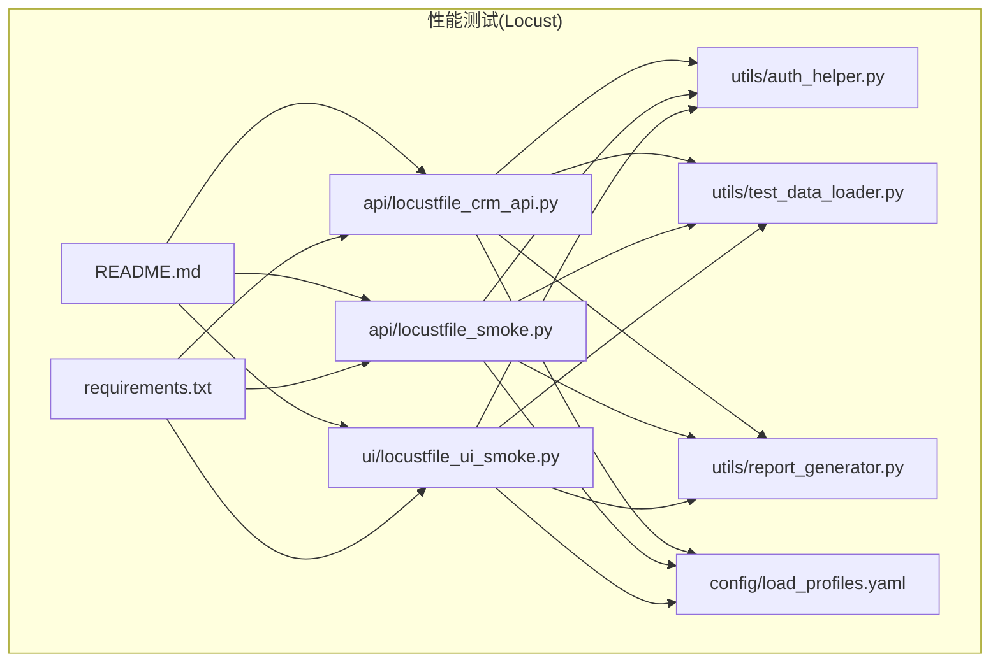
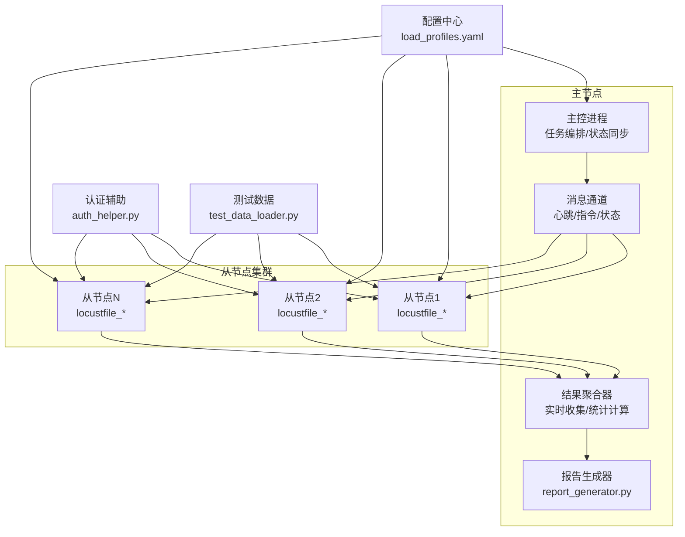
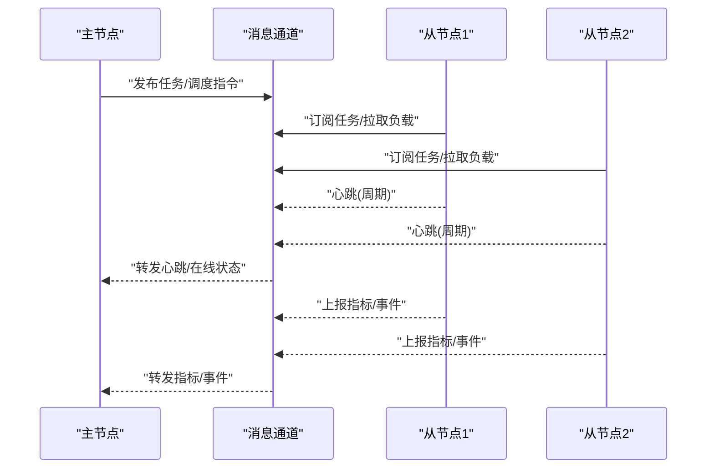
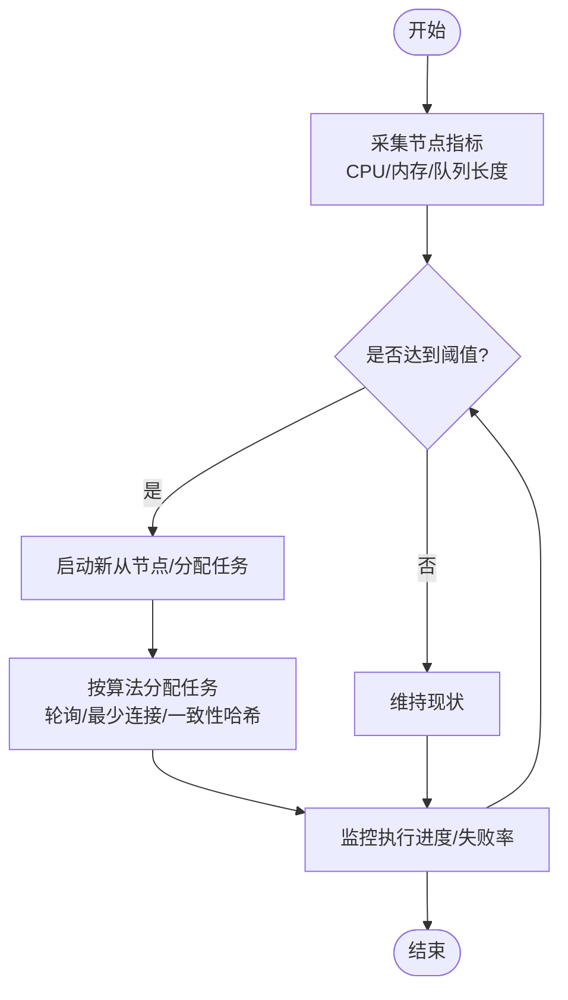
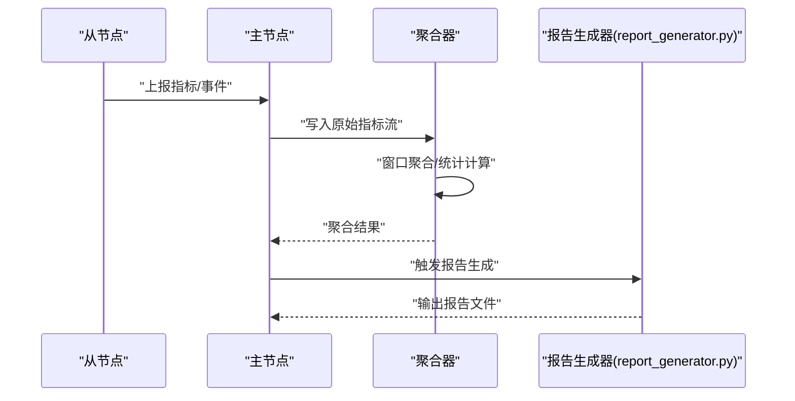
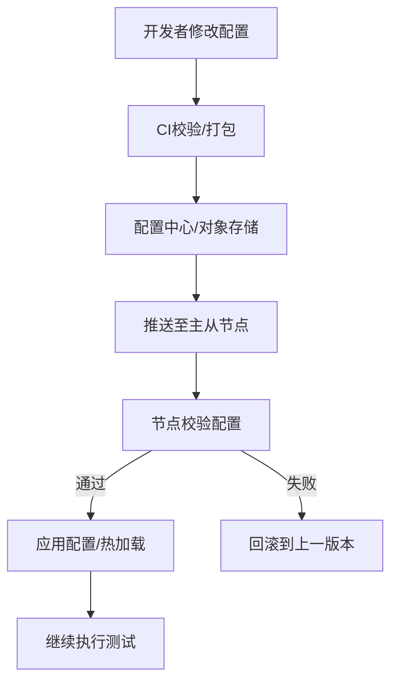
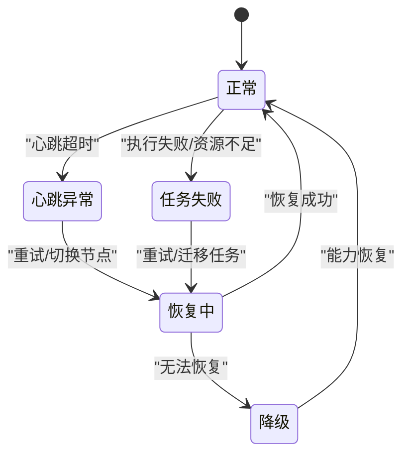
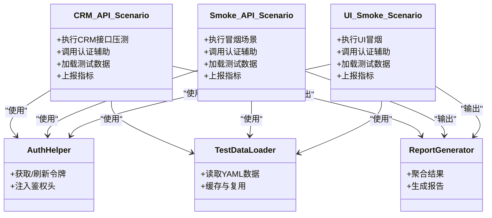
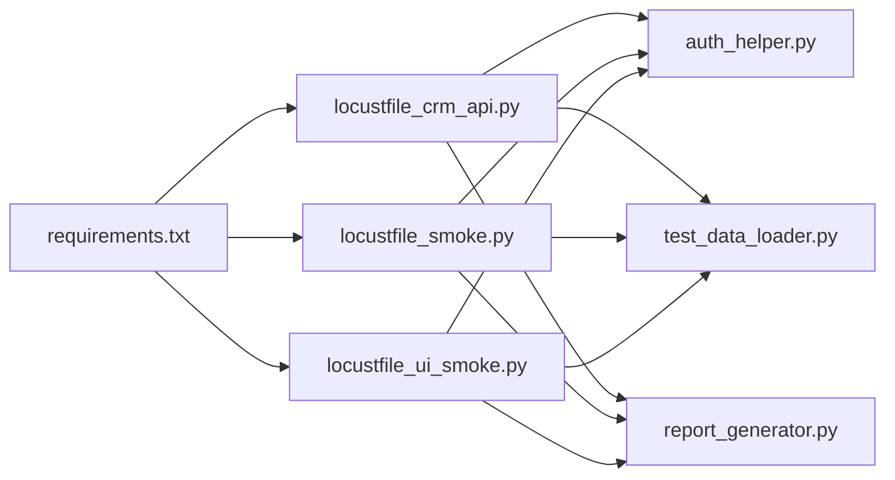

# Locust分布式架构设计

<cite>
**本文引用的文件**   
- [performance/locust/README.md](file://tests/performance/locust/README.md)
- [performance/locust/requirements.txt](file://tests/performance/locust/requirements.txt)
- [performance/locust/config/load_profiles.yaml](file://tests/performance/locust/config/load_profiles.yaml)
- [performance/locust/api/locustfile_crm_api.py](file://tests/performance/locust/api/locustfile_crm_api.py)
- [performance/locust/api/locustfile_smoke.py](file://tests/performance/locust/api/locustfile_smoke.py)
- [performance/locust/ui/locustfile_ui_smoke.py](file://tests/performance/locust/ui/locustfile_ui_smoke.py)
- [performance/locust/utils/report_generator.py](file://tests/performance/locust/utils/report_generator.py)
- [performance/locust/utils/auth_helper.py](file://tests/performance/locust/utils/auth_helper.py)
- [performance/locust/utils/test_data_loader.py](file://tests/performance/locust/utils/test_data_loader.py)
</cite>

## 目录
1. [简介](#简介)
2. [项目结构](#项目结构)
3. [核心组件](#核心组件)
4. [架构总览](#架构总览)
5. [详细组件分析](#详细组件分析)
6. [依赖关系分析](#依赖关系分析)
7. [性能考量](#性能考量)
8. [故障排查指南](#故障排查指南)
9. [结论](#结论)
10. [附录](#附录)

## 简介
本技术文档围绕Locust分布式测试架构，结合仓库中性能测试相关实现与配置，系统性阐述主从节点通信机制、任务分发策略、结果聚合系统、分布式环境下的配置管理以及故障检测与自动恢复。文档面向不同技术背景的读者，提供从高层架构到代码级实现的渐进式说明，并辅以可视化图示帮助理解。

## 项目结构
仓库中与Locust相关的代码与配置集中在 tests/performance/locust 目录下，包含：
- 用例脚本：API与UI的负载场景定义
- 配置文件：负载模型与参数化数据
- 工具模块：认证辅助、测试数据加载、报告生成
- 运行说明与依赖清单

图表来源
- [performance/locust/api/locustfile_crm_api.py](file://tests/performance/locust/api/locustfile_crm_api.py)
- [performance/locust/api/locustfile_smoke.py](file://tests/performance/locust/api/locustfile_smoke.py)
- [performance/locust/ui/locustfile_ui_smoke.py](file://tests/performance/locust/ui/locustfile_ui_smoke.py)
- [performance/locust/config/load_profiles.yaml](file://tests/performance/locust/config/load_profiles.yaml)
- [performance/locust/utils/report_generator.py](file://tests/performance/locust/utils/report_generator.py)
- [performance/locust/utils/auth_helper.py](file://tests/performance/locust/utils/auth_helper.py)
- [performance/locust/utils/test_data_loader.py](file://tests/performance/locust/utils/test_data_loader.py)
- [performance/locust/README.md](file://tests/performance/locust/README.md)
- [performance/locust/requirements.txt](file://tests/performance/locust/requirements.txt)

章节来源
- [performance/locust/README.md](file://tests/performance/locust/README.md)
- [performance/locust/requirements.txt](file://tests/performance/locust/requirements.txt)

## 核心组件
- 负载场景脚本
  - API场景：CRM接口压测与冒烟场景
  - UI场景：浏览器端冒烟场景
- 配置与数据
  - 负载模型：按用户数、RPS、持续时间等维度定义
  - 测试数据：外部YAML驱动的数据集
- 工具链
  - 认证辅助：统一鉴权流程封装
  - 数据加载：集中读取与缓存
  - 报告生成：汇总统计与可视化输出
- 运行说明与依赖
  - README：运行方式与环境要求
  - requirements：第三方库版本约束

章节来源
- [performance/locust/api/locustfile_crm_api.py](file://tests/performance/locust/api/locustfile_crm_api.py)
- [performance/locust/api/locustfile_smoke.py](file://tests/performance/locust/api/locustfile_smoke.py)
- [performance/locust/ui/locustfile_ui_smoke.py](file://tests/performance/locust/ui/locustfile_ui_smoke.py)
- [performance/locust/config/load_profiles.yaml](file://tests/performance/locust/config/load_profiles.yaml)
- [performance/locust/utils/report_generator.py](file://tests/performance/locust/utils/report_generator.py)
- [performance/locust/utils/auth_helper.py](file://tests/performance/locust/utils/auth_helper.py)
- [performance/locust/utils/test_data_loader.py](file://tests/performance/locust/utils/test_data_loader.py)
- [performance/locust/README.md](file://tests/performance/locust/README.md)
- [performance/locust/requirements.txt](file://tests/performance/locust/requirements.txt)

## 架构总览
下图展示基于仓库现有实现的Locust分布式测试总体视图。主节点负责编排与聚合，从节点执行具体负载；通过消息通道进行心跳与状态同步；结果在本地或共享存储汇聚后由报告工具生成。

图表来源
- [performance/locust/utils/report_generator.py](file://tests/performance/locust/utils/report_generator.py)
- [performance/locust/config/load_profiles.yaml](file://tests/performance/locust/config/load_profiles.yaml)
- [performance/locust/utils/auth_helper.py](file://tests/performance/locust/utils/auth_helper.py)
- [performance/locust/utils/test_data_loader.py](file://tests/performance/locust/utils/test_data_loader.py)
- [performance/locust/api/locustfile_crm_api.py](file://tests/performance/locust/api/locustfile_crm_api.py)
- [performance/locust/api/locustfile_smoke.py](file://tests/performance/locust/api/locustfile_smoke.py)
- [performance/locust/ui/locustfile_ui_smoke.py](file://tests/performance/locust/ui/locustfile_ui_smoke.py)

## 详细组件分析

### 主从节点通信机制（消息队列、心跳检测、状态同步）
- 消息通道
  - 用于主从间的心跳上报、任务下发、状态回传与错误通知
  - 建议采用可靠传输（如持久化队列），保证断线重连与幂等处理
- 心跳检测
  - 从节点周期性发送心跳；主节点维护存活表，超时判定为离线
  - 支持指数退避重试与告警阈值
- 状态同步
  - 从节点定期上报运行指标（并发用户数、请求成功率、延迟分位等）
  - 主节点将多源指标归一化并写入聚合器

图表来源
- [performance/locust/README.md](file://tests/performance/locust/README.md)

章节来源
- [performance/locust/README.md](file://tests/performance/locust/README.md)

### 任务分发策略（负载分配算法、动态扩缩容）
- 负载分配算法
  - 常见策略包括轮询、最少连接、加权分配与一致性哈希
  - 针对API与UI混合场景，可按协议类型或业务域划分队列，避免热点瓶颈
- 动态扩缩容
  - 基于CPU/内存/网络I/O与队列积压触发扩容
  - 缩容时优先迁移低优先级任务，确保零丢失
- 任务粒度与幂等
  - 以“可独立执行的场景片段”为最小单元，便于重放与重试
  - 所有任务需具备幂等性，防止重复执行导致副作用

[本节为概念性流程图，不直接映射具体源码文件]

### 结果聚合系统（实时数据收集、统计计算、报告生成）
- 实时数据收集
  - 从节点上报请求计数、成功/失败、响应时间、错误码分布等
  - 主节点侧做去抖、窗口聚合与异常值过滤
- 统计计算
  - 计算P50/P90/P99、吞吐、错误率、资源利用率等关键指标
  - 支持滑动窗口与滚动统计，降低峰值抖动影响
- 报告生成
  - 使用 report_generator.py 将聚合结果导出为结构化报告
  - 支持多种格式（JSON/CSV/HTML）以便后续分析与归档

图表来源
- [performance/locust/utils/report_generator.py](file://tests/performance/locust/utils/report_generator.py)

章节来源
- [performance/locust/utils/report_generator.py](file://tests/performance/locust/utils/report_generator.py)

### 分布式环境下的配置管理（环境变量传递、配置文件同步）
- 环境变量传递
  - 通过容器/编排平台注入环境变量，供各节点统一读取
  - 敏感信息（密钥、令牌）应走安全变量管理
- 配置文件同步
  - 使用集中配置（如 load_profiles.yaml）作为单一事实源
  - 变更通过配置中心或CI流水线推送，节点热加载或重启生效
- 版本与回滚
  - 配置带版本号，支持灰度与快速回滚
  - 校验配置合法性后再下发，避免脏配置污染

[本节为概念性流程图，不直接映射具体源码文件]

章节来源
- [performance/locust/config/load_profiles.yaml](file://tests/performance/locust/config/load_profiles.yaml)

### 故障检测与自动恢复机制
- 故障检测
  - 心跳超时、任务执行失败、资源耗尽等多维信号
  - 主节点维护健康检查表，设置多级告警阈值
- 自动恢复
  - 任务重试与幂等保障
  - 节点故障时迁移任务到新节点，保持整体吞吐稳定
- 降级策略
  - 当部分能力不可用时，切换到轻量模式（减少并发/关闭非关键指标）

[本节为概念性状态图，不直接映射具体源码文件]

### 用例脚本与工具链集成
- 用例脚本
  - API场景：locustfile_crm_api.py、locustfile_smoke.py
  - UI场景：locustfile_ui_smoke.py
- 工具链
  - 认证辅助：auth_helper.py
  - 测试数据：test_data_loader.py
  - 报告生成：report_generator.py

图表来源
- [performance/locust/api/locustfile_crm_api.py](file://tests/performance/locust/api/locustfile_crm_api.py)
- [performance/locust/api/locustfile_smoke.py](file://tests/performance/locust/api/locustfile_smoke.py)
- [performance/locust/ui/locustfile_ui_smoke.py](file://tests/performance/locust/ui/locustfile_ui_smoke.py)
- [performance/locust/utils/auth_helper.py](file://tests/performance/locust/utils/auth_helper.py)
- [performance/locust/utils/test_data_loader.py](file://tests/performance/locust/utils/test_data_loader.py)
- [performance/locust/utils/report_generator.py](file://tests/performance/locust/utils/report_generator.py)

章节来源
- [performance/locust/api/locustfile_crm_api.py](file://tests/performance/locust/api/locustfile_crm_api.py)
- [performance/locust/api/locustfile_smoke.py](file://tests/performance/locust/api/locustfile_smoke.py)
- [performance/locust/ui/locustfile_ui_smoke.py](file://tests/performance/locust/ui/locustfile_ui_smoke.py)
- [performance/locust/utils/auth_helper.py](file://tests/performance/locust/utils/auth_helper.py)
- [performance/locust/utils/test_data_loader.py](file://tests/performance/locust/utils/test_data_loader.py)
- [performance/locust/utils/report_generator.py](file://tests/performance/locust/utils/report_generator.py)

## 依赖关系分析
- 内部依赖
  - 用例脚本依赖认证与数据加载工具
  - 报告生成器依赖聚合结果
- 外部依赖
  - requirements.txt 指定了运行所需的第三方库版本
  - README 提供了运行环境与命令参考

图表来源
- [performance/locust/requirements.txt](file://tests/performance/locust/requirements.txt)
- [performance/locust/api/locustfile_crm_api.py](file://tests/performance/locust/api/locustfile_crm_api.py)
- [performance/locust/api/locustfile_smoke.py](file://tests/performance/locust/api/locustfile_smoke.py)
- [performance/locust/ui/locustfile_ui_smoke.py](file://tests/performance/locust/ui/locustfile_ui_smoke.py)
- [performance/locust/utils/auth_helper.py](file://tests/performance/locust/utils/auth_helper.py)
- [performance/locust/utils/test_data_loader.py](file://tests/performance/locust/utils/test_data_loader.py)
- [performance/locust/utils/report_generator.py](file://tests/performance/locust/utils/report_generator.py)

章节来源
- [performance/locust/requirements.txt](file://tests/performance/locust/requirements.txt)

## 性能考量
- 网络与序列化
  - 控制上报频率与批大小，避免拥塞
  - 选择高效序列化格式（如Protobuf/MessagePack）
- 统计精度与开销
  - 使用近似算法（如t-digest）降低内存占用
  - 分层统计（全局/场景/接口）平衡精度与成本
- 资源隔离
  - 主从节点资源配额与限流，避免相互干扰
- 弹性伸缩
  - 基于指标驱动的自动扩缩容，缩短冷启动时间

[本节为通用指导，不直接分析具体文件]

## 故障排查指南
- 常见问题定位
  - 心跳丢失：检查网络连通性与消息通道健康
  - 任务堆积：观察队列长度与消费者消费速率
  - 指标缺失：确认上报链路完整性与聚合窗口
- 日志与追踪
  - 统一日志格式与TraceID，跨节点关联
  - 关键路径埋点，便于定位瓶颈
- 恢复策略
  - 任务幂等与重试
  - 节点故障迁移与优雅下线

章节来源
- [performance/locust/README.md](file://tests/performance/locust/README.md)

## 结论
本文基于仓库中的Locust性能测试实现，梳理了分布式架构的关键要素：主从通信、任务分发、结果聚合、配置管理与故障恢复。通过模块化设计与清晰的职责边界，系统具备良好的可扩展性与可观测性。建议在工程实践中引入更完善的配置中心与消息中间件，进一步提升稳定性与弹性。

## 附录
- 运行说明与依赖
  - README：运行方式与环境要求
  - requirements.txt：第三方库版本约束
- 配置示例
  - load_profiles.yaml：负载模型与参数化数据

章节来源
- [performance/locust/README.md](file://tests/performance/locust/README.md)
- [performance/locust/requirements.txt](file://tests/performance/locust/requirements.txt)
- [performance/locust/config/load_profiles.yaml](file://tests/performance/locust/config/load_profiles.yaml)