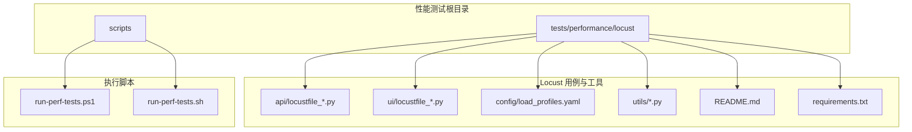
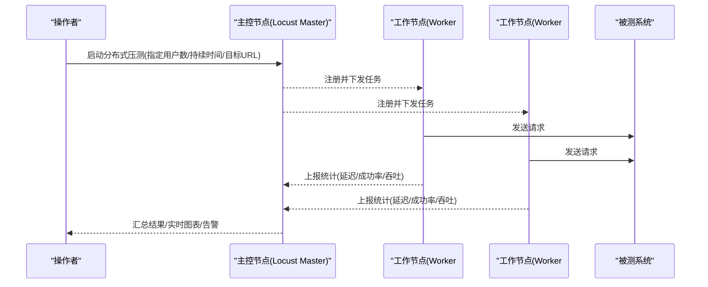
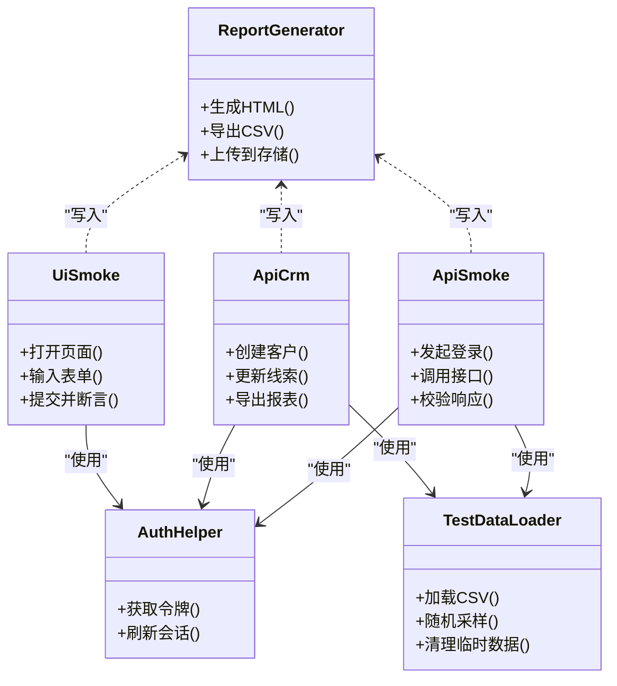
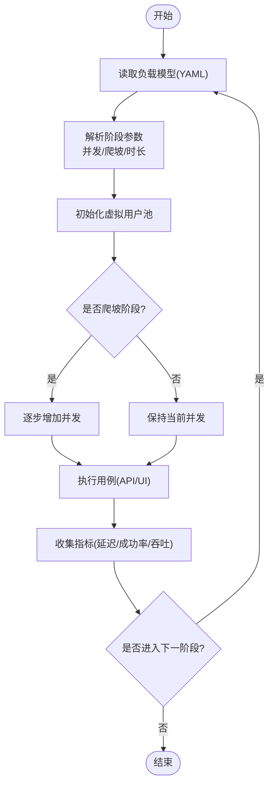
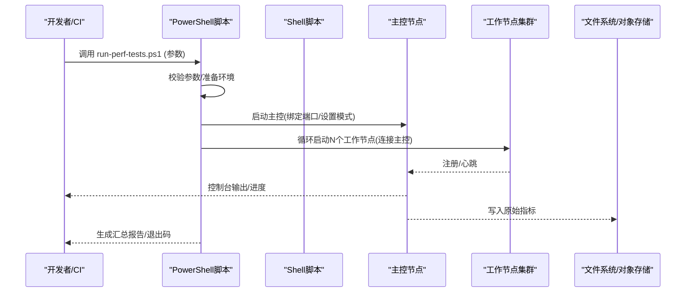
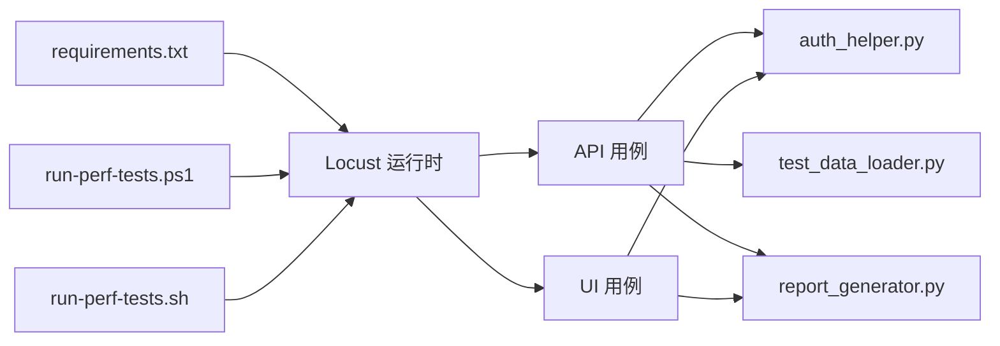

# 分布式测试部署

<cite>
**本文引用的文件**   
- [scripts/run-perf-tests.ps1](file://scripts/run-perf-tests.ps1)
- [scripts/run-perf-tests.sh](file://scripts/run-perf-tests.sh)
- [tests/performance/locust/README.md](file://tests/performance/locust/README.md)
- [tests/performance/locust/requirements.txt](file://tests/performance/locust/requirements.txt)
- [tests/performance/locust/config/load_profiles.yaml](file://tests/performance/locust/config/load_profiles.yaml)
- [tests/performance/locust/api/locustfile_crm_api.py](file://tests/performance/locust/api/locustfile_crm_api.py)
- [tests/performance/locust/api/locustfile_smoke.py](file://tests/performance/locust/api/locustfile_smoke.py)
- [tests/performance/locust/ui/locustfile_ui_smoke.py](file://tests/performance/locust/ui/locustfile_ui_smoke.py)
- [tests/performance/locust/utils/auth_helper.py](file://tests/performance/locust/utils/auth_helper.py)
- [tests/performance/locust/utils/report_generator.py](file://tests/performance/locust/utils/report_generator.py)
- [tests/performance/locust/utils/test_data_loader.py](file://tests/performance/locust/utils/test_data_loader.py)
</cite>

## 目录
1. [简介](#简介)
2. [项目结构](#项目结构)
3. [核心组件](#核心组件)
4. [架构总览](#架构总览)
5. [详细组件分析](#详细组件分析)
6. [依赖关系分析](#依赖关系分析)
7. [性能考虑](#性能考虑)
8. [故障排查指南](#故障排查指南)
9. [结论](#结论)
10. [附录](#附录)

## 简介
本技术文档面向分布式性能测试的部署与执行，围绕 Locust 主从架构展开，系统阐述节点通信、任务分发与结果聚合机制。文档同时覆盖多节点容器化部署策略（含负载均衡与故障转移）、PowerShell/Shell 脚本的参数配置与执行流程，以及大规模并发下的资源分配、网络调优与内存管理优化。最后提供监控与调试工具建议，支持实时状态跟踪与问题定位。

## 项目结构
本项目将性能测试相关代码集中在 tests/performance/locust 目录下，包含用例脚本、配置文件与工具模块；自动化执行入口位于 scripts 目录，分别提供 PowerShell 与 Shell 脚本以统一触发本地或分布式执行。

**图示来源** 
- [tests/performance/locust/README.md](file://tests/performance/locust/README.md)
- [tests/performance/locust/requirements.txt](file://tests/performance/locust/requirements.txt)
- [tests/performance/locust/config/load_profiles.yaml](file://tests/performance/locust/config/load_profiles.yaml)
- [tests/performance/locust/api/locustfile_crm_api.py](file://tests/performance/locust/api/locustfile_crm_api.py)
- [tests/performance/locust/api/locustfile_smoke.py](file://tests/performance/locust/api/locustfile_smoke.py)
- [tests/performance/locust/ui/locustfile_ui_smoke.py](file://tests/performance/locust/ui/locustfile_ui_smoke.py)
- [tests/performance/locust/utils/auth_helper.py](file://tests/performance/locust/utils/auth_helper.py)
- [tests/performance/locust/utils/report_generator.py](file://tests/performance/locust/utils/report_generator.py)
- [tests/performance/locust/utils/test_data_loader.py](file://tests/performance/locust/utils/test_data_loader.py)
- [scripts/run-perf-tests.ps1](file://scripts/run-perf-tests.ps1)
- [scripts/run-perf-tests.sh](file://scripts/run-perf-tests.sh)

**章节来源**
- [tests/performance/locust/README.md](file://tests/performance/locust/README.md)
- [tests/performance/locust/requirements.txt](file://tests/performance/locust/requirements.txt)
- [scripts/run-perf-tests.ps1](file://scripts/run-perf-tests.ps1)
- [scripts/run-perf-tests.sh](file://scripts/run-perf-tests.sh)

## 核心组件
- 用例脚本：按业务域划分 API 与 UI 场景，便于独立编排与组合执行。
- 配置中心：统一的负载模型与参数化配置，支撑不同压力场景。
- 工具库：认证、数据加载与报告生成等通用能力。
- 执行脚本：封装启动参数与环境准备，屏蔽平台差异。

**章节来源**
- [tests/performance/locust/api/locustfile_crm_api.py](file://tests/performance/locust/api/locustfile_crm_api.py)
- [tests/performance/locust/api/locustfile_smoke.py](file://tests/performance/locust/api/locustfile_smoke.py)
- [tests/performance/locust/ui/locustfile_ui_smoke.py](file://tests/performance/locust/ui/locustfile_ui_smoke.py)
- [tests/performance/locust/config/load_profiles.yaml](file://tests/performance/locust/config/load_profiles.yaml)
- [tests/performance/locust/utils/auth_helper.py](file://tests/performance/locust/utils/auth_helper.py)
- [tests/performance/locust/utils/test_data_loader.py](file://tests/performance/locust/utils/test_data_loader.py)
- [tests/performance/locust/utils/report_generator.py](file://tests/performance/locust/utils/report_generator.py)

## 架构总览
下图展示 Locust 主从模式在分布式环境中的典型交互：主控节点负责调度与汇总，工作节点执行压测并上报指标。

说明：
- 主控与工作节点通过内部协议通信，实现心跳检测、任务分发与指标聚合。
- 工作节点可水平扩展，提升整体并发能力。
- 主控节点集中汇聚结果，便于统一分析与可视化。

**图示来源** 
- [tests/performance/locust/README.md](file://tests/performance/locust/README.md)
- [tests/performance/locust/requirements.txt](file://tests/performance/locust/requirements.txt)

## 详细组件分析

### 用例脚本组织与职责
- API 用例：针对 CRM 与冒烟场景，定义 HTTP 请求、断言与错误处理。
- UI 用例：基于浏览器自动化框架模拟用户行为，验证端到端流程。
- 工具模块：封装鉴权、数据准备与报告输出，减少重复逻辑。

**图示来源** 
- [tests/performance/locust/api/locustfile_smoke.py](file://tests/performance/locust/api/locustfile_smoke.py)
- [tests/performance/locust/api/locustfile_crm_api.py](file://tests/performance/locust/api/locustfile_crm_api.py)
- [tests/performance/locust/ui/locustfile_ui_smoke.py](file://tests/performance/locust/ui/locustfile_ui_smoke.py)
- [tests/performance/locust/utils/auth_helper.py](file://tests/performance/locust/utils/auth_helper.py)
- [tests/performance/locust/utils/test_data_loader.py](file://tests/performance/locust/utils/test_data_loader.py)
- [tests/performance/locust/utils/report_generator.py](file://tests/performance/locust/utils/report_generator.py)

**章节来源**
- [tests/performance/locust/api/locustfile_smoke.py](file://tests/performance/locust/api/locustfile_smoke.py)
- [tests/performance/locust/api/locustfile_crm_api.py](file://tests/performance/locust/api/locustfile_crm_api.py)
- [tests/performance/locust/ui/locustfile_ui_smoke.py](file://tests/performance/locust/ui/locustfile_ui_smoke.py)
- [tests/performance/locust/utils/auth_helper.py](file://tests/performance/locust/utils/auth_helper.py)
- [tests/performance/locust/utils/test_data_loader.py](file://tests/performance/locust/utils/test_data_loader.py)
- [tests/performance/locust/utils/report_generator.py](file://tests/performance/locust/utils/report_generator.py)

### 负载模型与参数化
- 负载模型：通过 YAML 文件定义不同阶段的并发用户数、爬坡速率与持续时间，便于复现实验。
- 参数化：结合数据加载器，为每个虚拟用户注入差异化输入，避免缓存命中导致的偏差。

**图示来源** 
- [tests/performance/locust/config/load_profiles.yaml](file://tests/performance/locust/config/load_profiles.yaml)
- [tests/performance/locust/utils/test_data_loader.py](file://tests/performance/locust/utils/test_data_loader.py)

**章节来源**
- [tests/performance/locust/config/load_profiles.yaml](file://tests/performance/locust/config/load_profiles.yaml)
- [tests/performance/locust/utils/test_data_loader.py](file://tests/performance/locust/utils/test_data_loader.py)

### 执行脚本与运行流程
- PowerShell/Shell 脚本：封装环境变量、依赖安装、主控/工作节点启动命令与结果收集。
- 参数化：支持传入目标地址、并发规模、持续时间、日志级别等关键参数。
- 执行流程：检查环境→安装依赖→启动主控→启动工作节点→等待完成→汇总报告。

**图示来源** 
- [scripts/run-perf-tests.ps1](file://scripts/run-perf-tests.ps1)
- [scripts/run-perf-tests.sh](file://scripts/run-perf-tests.sh)

**章节来源**
- [scripts/run-perf-tests.ps1](file://scripts/run-perf-tests.ps1)
- [scripts/run-perf-tests.sh](file://scripts/run-perf-tests.sh)

## 依赖关系分析
- Python 依赖：由 requirements.txt 统一管理，确保各节点环境一致。
- 用例与工具：用例脚本依赖工具模块进行鉴权、数据加载与报告生成。
- 执行脚本：对操作系统命令与进程管理有直接依赖，需保证跨平台兼容性。

**图示来源** 
- [tests/performance/locust/requirements.txt](file://tests/performance/locust/requirements.txt)
- [tests/performance/locust/api/locustfile_crm_api.py](file://tests/performance/locust/api/locustfile_crm_api.py)
- [tests/performance/locust/api/locustfile_smoke.py](file://tests/performance/locust/api/locustfile_smoke.py)
- [tests/performance/locust/ui/locustfile_ui_smoke.py](file://tests/performance/locust/ui/locustfile_ui_smoke.py)
- [tests/performance/locust/utils/auth_helper.py](file://tests/performance/locust/utils/auth_helper.py)
- [tests/performance/locust/utils/test_data_loader.py](file://tests/performance/locust/utils/test_data_loader.py)
- [tests/performance/locust/utils/report_generator.py](file://tests/performance/locust/utils/report_generator.py)
- [scripts/run-perf-tests.ps1](file://scripts/run-perf-tests.ps1)
- [scripts/run-perf-tests.sh](file://scripts/run-perf-tests.sh)

**章节来源**
- [tests/performance/locust/requirements.txt](file://tests/performance/locust/requirements.txt)
- [scripts/run-perf-tests.ps1](file://scripts/run-perf-tests.ps1)
- [scripts/run-perf-tests.sh](file://scripts/run-perf-tests.sh)

## 性能考虑
- 资源分配
  - CPU：根据用例 I/O 与计算占比合理分配 vCPU，避免上下文切换开销过大。
  - 内存：为每个工作节点预留足够堆空间，防止 GC 抖动影响延迟分布。
  - 磁盘：I/O 密集型场景建议使用 SSD，并分离日志与数据目录。
- 网络调优
  - 内核参数：调整 TCP 缓冲区、最大文件句柄与端口复用，提升高并发吞吐。
  - DNS/代理：关闭不必要的解析与代理链，降低额外 RTT。
  - 带宽：确保主控与工作节点之间链路无拥塞，必要时隔离压测网段。
- 内存管理
  - 控制每用户对象生命周期，及时释放大对象引用。
  - 限制单次请求体大小，避免 OOM。
  - 启用分页/流式读取，减少峰值内存占用。
- 并发与调度
  - 分阶段爬坡，观察系统拐点后再拉满。
  - 合理设置超时与重试，避免雪崩效应。
  - 使用幂等接口与去重策略，保障结果稳定性。

[本节为通用指导，不直接分析具体文件]

## 故障排查指南
- 常见问题
  - 工作节点无法连接主控：检查端口、防火墙与主机名解析。
  - 指标异常波动：确认时间同步、网络抖动与下游限流。
  - 内存泄漏迹象：定位未释放对象与循环引用，缩短对象生命周期。
- 诊断手段
  - 日志采集：集中化收集主控与工作节点日志，关联请求 ID。
  - 指标观测：关注 QPS、P95/P99 延迟、错误率与资源利用率。
  - 抓包分析：对热点接口进行抓包，定位握手与传输瓶颈。
- 恢复策略
  - 自动重启：工作节点健康检查失败时快速重建。
  - 降级开关：关键路径失败时回退至只读或简化流程。
  - 熔断限流：保护上游服务，避免级联故障。

[本节为通用指导，不直接分析具体文件]

## 结论
本方案以 Locust 主从架构为核心，结合统一的负载模型与工具库，实现了可扩展、可复用的分布式性能测试体系。通过标准化的执行脚本与完善的监控诊断手段，能够在大规模并发下稳定产出高质量的性能指标，并为容量规划与性能优化提供可靠依据。

[本节为总结性内容，不直接分析具体文件]

## 附录
- 术语表
  - 主控节点：负责任务调度与结果聚合的节点。
  - 工作节点：实际发起请求并上报指标的节点。
  - 负载模型：描述并发、爬坡与持续时间的配置集合。
- 参考文件
  - 用例与工具：见 tests/performance/locust 子目录。
  - 执行脚本：见 scripts 目录下的 PowerShell/Shell 脚本。

[本节为补充信息，不直接分析具体文件]