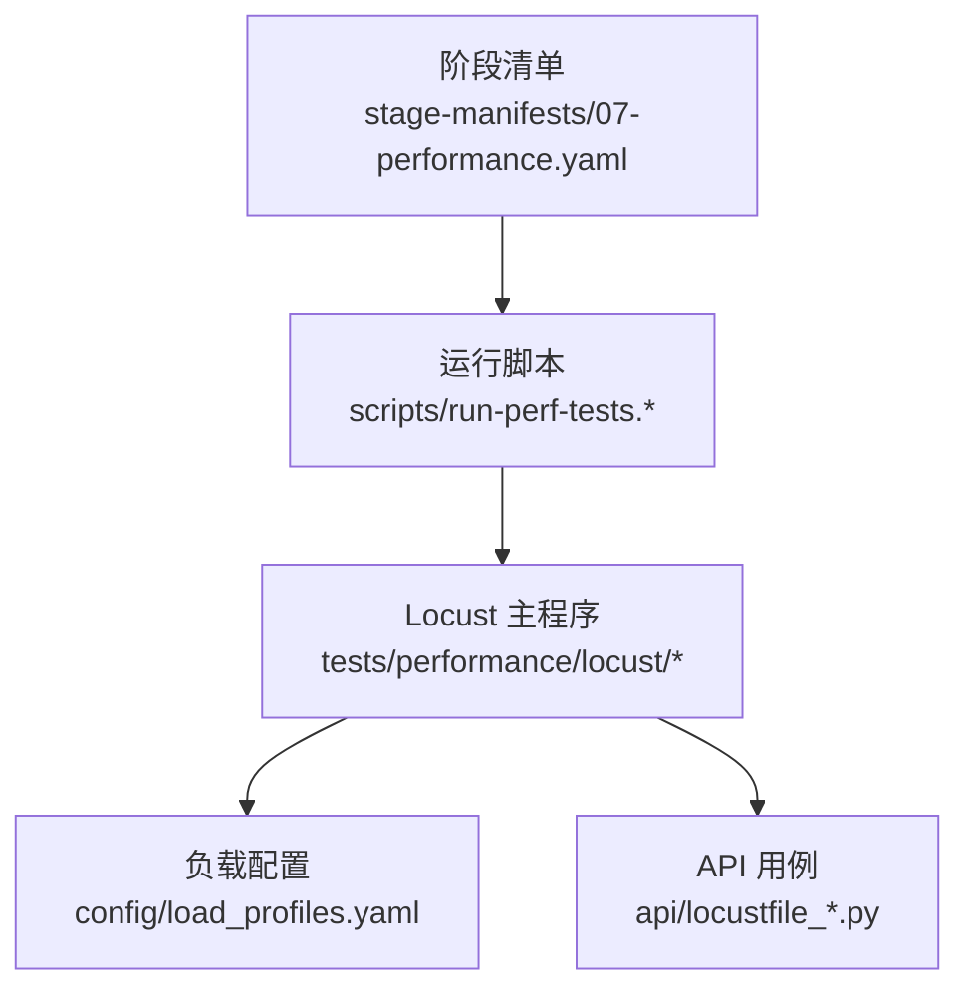
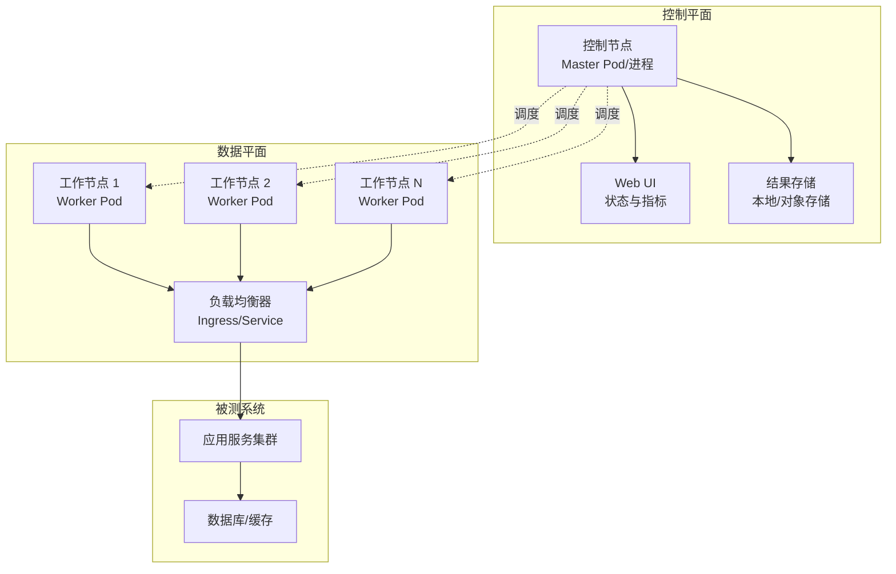
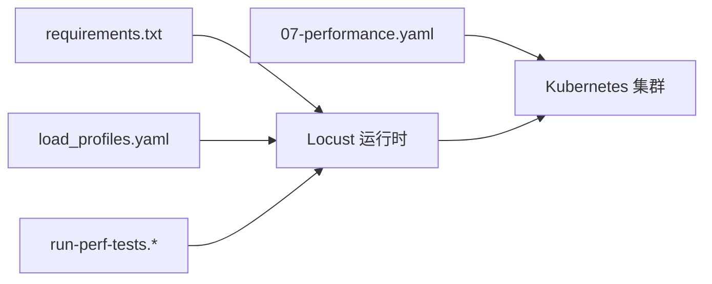

# 多节点部署策略

<cite>
**本文引用的文件**   
- [scripts/run-perf-tests.sh](file://scripts/run-perf-tests.sh)
- [scripts/run-perf-tests.ps1](file://scripts/run-perf-tests.ps1)
- [tests/performance/locust/README.md](file://tests/performance/locust/README.md)
- [tests/performance/locust/requirements.txt](file://tests/performance/locust/requirements.txt)
- [tests/performance/locust/config/load_profiles.yaml](file://tests/performance/locust/config/load_profiles.yaml)
- [tests/performance/locust/api/locustfile_crm_api.py](file://tests/performance/locust/api/locustfile_crm_api.py)
- [tests/performance/locust/api/locustfile_smoke.py](file://tests/performance/locust/api/locustfile_smoke.py)
- [stage-manifests/07-performance.yaml](file://stage-manifests/07-performance.yaml)
</cite>

## 目录
1. [简介](#简介)
2. [项目结构](#项目结构)
3. [核心组件](#核心组件)
4. [架构总览](#架构总览)
5. [详细组件分析](#详细组件分析)
6. [依赖关系分析](#依赖关系分析)
7. [性能考量](#性能考量)
8. [故障排查指南](#故障排查指南)
9. [结论](#结论)
10. [附录](#附录)

## 简介
本指南面向分布式性能测试的多节点部署，围绕容器化构建、Kubernetes编排与服务发现、负载均衡与健康检查、故障转移与数据一致性、以及主流云平台（AWS、Azure）的部署最佳实践展开。文档基于仓库中已有的性能测试脚本、Locust 负载定义与阶段清单进行说明，确保读者可据此落地生产可用的多节点压测方案。

## 项目结构
仓库中与分布式性能测试相关的核心位置如下：
- 运行脚本：scripts 目录下提供跨平台执行入口，便于在本地或 CI 中触发压测任务
- 负载定义：tests/performance/locust 下包含 Locust 用例、配置文件与依赖声明
- 阶段编排：stage-manifests 中的 07-performance.yaml 用于将性能测试纳入整体流水线

图表来源
- [scripts/run-perf-tests.sh](file://scripts/run-perf-tests.sh)
- [scripts/run-perf-tests.ps1](file://scripts/run-perf-tests.ps1)
- [tests/performance/locust/config/load_profiles.yaml](file://tests/performance/locust/config/load_profiles.yaml)
- [tests/performance/locust/api/locustfile_crm_api.py](file://tests/performance/locust/api/locustfile_crm_api.py)
- [tests/performance/locust/api/locustfile_smoke.py](file://tests/performance/locust/api/locustfile_smoke.py)
- [stage-manifests/07-performance.yaml](file://stage-manifests/07-performance.yaml)

章节来源
- [scripts/run-perf-tests.sh](file://scripts/run-perf-tests.sh)
- [scripts/run-perf-tests.ps1](file://scripts/run-perf-tests.ps1)
- [tests/performance/locust/README.md](file://tests/performance/locust/README.md)
- [tests/performance/locust/requirements.txt](file://tests/performance/locust/requirements.txt)
- [tests/performance/locust/config/load_profiles.yaml](file://tests/performance/locust/config/load_profiles.yaml)
- [tests/performance/locust/api/locustfile_crm_api.py](file://tests/performance/locust/api/locustfile_crm_api.py)
- [tests/performance/locust/api/locustfile_smoke.py](file://tests/performance/locust/api/locustfile_smoke.py)
- [stage-manifests/07-performance.yaml](file://stage-manifests/07-performance.yaml)

## 核心组件
- 运行脚本
  - 作用：封装压测启动参数、环境变量与结果收集路径，屏蔽平台差异
  - 关键点：支持指定目标服务地址、并发规模、持续时间等；输出报告到约定目录
- Locust 负载定义
  - 作用：描述被测接口、用户行为模型与场景组合
  - 关键点：按模块拆分 locustfile，便于多场景并行与复用
- 负载配置
  - 作用：集中管理不同压力等级与流量模型
  - 关键点：通过 profiles 切换不同 RPS、持续时间、用户分布
- 阶段清单
  - 作用：将性能测试嵌入端到端流水线，统一产物与上报
  - 关键点：与其他阶段解耦，支持按需启用

章节来源
- [scripts/run-perf-tests.sh](file://scripts/run-perf-tests.sh)
- [scripts/run-perf-tests.ps1](file://scripts/run-perf-tests.ps1)
- [tests/performance/locust/README.md](file://tests/performance/locust/README.md)
- [tests/performance/locust/config/load_profiles.yaml](file://tests/performance/locust/config/load_profiles.yaml)
- [stage-manifests/07-performance.yaml](file://stage-manifests/07-performance.yaml)

## 架构总览
下图展示多节点分布式压测的整体架构：控制节点负责调度与汇总，工作节点执行负载生成，外部负载均衡器将流量分发至被测系统，并配合健康检查与故障转移机制保障稳定性。

图表来源
- [scripts/run-perf-tests.sh](file://scripts/run-perf-tests.sh)
- [scripts/run-perf-tests.ps1](file://scripts/run-perf-tests.ps1)
- [tests/performance/locust/api/locustfile_crm_api.py](file://tests/performance/locust/api/locustfile_crm_api.py)
- [tests/performance/locust/api/locustfile_smoke.py](file://tests/performance/locust/api/locustfile_smoke.py)

## 详细组件分析

### 容器镜像构建
- 基础镜像选择
  - 使用轻量 Python 镜像作为基础，减少体积与安全面
- 依赖安装
  - 通过 requirements.txt 锁定版本，确保可重复构建
- 应用复制与入口
  - 复制 Locust 工程与配置，设置默认命令指向主控模式
- 多阶段构建（可选）
  - 构建期仅安装依赖，运行期仅保留必要文件，进一步缩小镜像

建议步骤
- 准备 Dockerfile，参考以下要点组织内容
  - 从官方 Python 镜像开始
  - 安装 requirements.txt 中的依赖
  - 复制 tests/performance/locust 目录
  - 设置工作目录与默认命令
- 构建镜像并推送至镜像仓库
  - 为不同环境打标签（dev/staging/prod）
  - 开启镜像签名与漏洞扫描

章节来源
- [tests/performance/locust/requirements.txt](file://tests/performance/locust/requirements.txt)
- [tests/performance/locust/README.md](file://tests/performance/locust/README.md)

### Kubernetes 编排与服务发现
- 控制器与工作节点
  - 使用 Deployment 管理多个工作节点副本，结合 HPA 实现弹性伸缩
  - 单独部署一个 Master Pod 作为控制节点，暴露 Web UI 供观察
- 服务发现与访问
  - 通过 Service 暴露 Master 的 Web UI
  - 通过 Ingress 对外暴露，配置域名与 TLS
- 配置挂载
  - 使用 ConfigMap 注入负载配置与用例
  - 使用 Secret 管理敏感信息（如鉴权凭据）
- 资源限制与探针
  - 为每个 Pod 设置 requests/limits，避免资源争用
  - 配置 liveness/readiness 探针，提升可用性

关键对象
- Deployment（工作节点）
- Deployment（控制节点）
- Service（Web UI）
- Ingress（外部访问）
- ConfigMap/Secret（配置与密钥）
- HPA（自动扩缩容）

章节来源
- [stage-manifests/07-performance.yaml](file://stage-manifests/07-performance.yaml)
- [tests/performance/locust/config/load_profiles.yaml](file://tests/performance/locust/config/load_profiles.yaml)

### 负载均衡策略与健康检查
- 流量分发算法
  - 推荐默认采用轮询或最少连接数策略，保证各工作节点均匀承载
  - 对长连接或会话绑定场景，可按源 IP 哈希保持亲和性
- 健康检查机制
  - 在 Ingress/Service 层配置就绪探针，剔除不健康后端
  - 在工作节点侧暴露轻量 HTTP 端点，返回当前队列长度与错误率
- 限流与熔断
  - 在网关层配置速率限制，防止过载
  - 对被测系统接入熔断降级，保护上游

章节来源
- [tests/performance/locust/api/locustfile_crm_api.py](file://tests/performance/locust/api/locustfile_crm_api.py)
- [tests/performance/locust/api/locustfile_smoke.py](file://tests/performance/locust/api/locustfile_smoke.py)

### 故障转移与数据一致性
- 节点故障检测
  - 利用 K8s 探针与事件告警，快速识别异常 Pod
  - 在控制节点侧维护工作节点心跳，超时即标记不可用
- 自动重启与自愈
  - 配置 RestartPolicy 与 BackoffLimit，避免频繁抖动
  - 结合 PodDisruptionBudget 保障最小可用副本
- 数据一致性保证
  - 控制节点持久化中间结果，失败恢复后可继续聚合
  - 工作节点幂等写入结果，避免重复统计
  - 对共享存储使用原子写入与版本号校验

章节来源
- [stage-manifests/07-performance.yaml](file://stage-manifests/07-performance.yaml)

### 云平台部署最佳实践
- AWS
  - 使用 EKS 托管集群，配合 Cluster Autoscaler 动态扩容
  - 通过 ALB Ingress 暴露 UI，启用 WAF 与速率限制
  - 使用 ECR 存储镜像，IAM Roles for Service Accounts 授权访问
- Azure
  - 使用 AKS 托管集群，启用 Horizontal Pod Autoscaler
  - 通过 Application Gateway Ingress Controller 暴露 UI，集成 WAF
  - 使用 ACR 存储镜像，Managed Identity 授予权限
- 通用建议
  - 多可用区部署，跨 AZ 调度工作节点
  - 使用云监控与日志服务采集指标与审计
  - 建立灰度发布流程，先小流量验证再全量

章节来源
- [stage-manifests/07-performance.yaml](file://stage-manifests/07-performance.yaml)

### 运行脚本与流水线集成
- 本地与 CI 执行
  - 通过 run-perf-tests.* 脚本统一入口，传入目标地址、并发与时长
  - 在 CI 中根据分支与环境选择不同 profile 与镜像标签
- 产物归档
  - 将测试结果与报告上传至对象存储或制品库
  - 在流水线中生成质量门禁（如 P95 延迟阈值）

章节来源
- [scripts/run-perf-tests.sh](file://scripts/run-perf-tests.sh)
- [scripts/run-perf-tests.ps1](file://scripts/run-perf-tests.ps1)
- [stage-manifests/07-performance.yaml](file://stage-manifests/07-performance.yaml)

## 依赖关系分析
- 运行时依赖
  - Python 生态与 Locust 相关包由 requirements.txt 声明
- 配置依赖
  - load_profiles.yaml 决定压力模型与场景组合
- 编排依赖
  - 07-performance.yaml 驱动在 K8s 上的部署与生命周期管理

图表来源
- [tests/performance/locust/requirements.txt](file://tests/performance/locust/requirements.txt)
- [tests/performance/locust/config/load_profiles.yaml](file://tests/performance/locust/config/load_profiles.yaml)
- [stage-manifests/07-performance.yaml](file://stage-manifests/07-performance.yaml)
- [scripts/run-perf-tests.sh](file://scripts/run-perf-tests.sh)
- [scripts/run-perf-tests.ps1](file://scripts/run-perf-tests.ps1)

章节来源
- [tests/performance/locust/requirements.txt](file://tests/performance/locust/requirements.txt)
- [tests/performance/locust/config/load_profiles.yaml](file://tests/performance/locust/config/load_profiles.yaml)
- [stage-manifests/07-performance.yaml](file://stage-manifests/07-performance.yaml)
- [scripts/run-perf-tests.sh](file://scripts/run-perf-tests.sh)
- [scripts/run-perf-tests.ps1](file://scripts/run-perf-tests.ps1)

## 性能考量
- 资源规划
  - 为工作节点预留足够 CPU/内存，避免 GC 与上下文切换成为瓶颈
  - 控制节点与结果存储分离，避免 IO 阻塞影响调度
- 网络优化
  - 工作节点与被测系统同区域部署，降低时延
  - 合理设置 TCP 参数与连接池大小
- 观测与调优
  - 采集 QPS、P95/P99、错误率、CPU/内存、磁盘 IO、网络吞吐
  - 基于指标逐步调整并发、超时与重试策略

[本节为通用指导，无需特定文件引用]

## 故障排查指南
- 常见问题定位
  - 无法连接被测系统：检查 Service/Ingress 与网络策略
  - 工作节点未加入集群：确认控制节点地址与令牌
  - 结果缺失：检查持久化卷挂载与权限
- 日志与指标
  - 查看 Pod 标准输出与事件
  - 抓取控制节点 UI 的实时统计与历史报告
- 回滚与恢复
  - 使用 Helm/Manifest 版本管理，一键回滚
  - 从对象存储恢复上次成功运行的结果

章节来源
- [stage-manifests/07-performance.yaml](file://stage-manifests/07-performance.yaml)

## 结论
通过容器化与 K8s 编排，本项目可实现高可用、可扩展的分布式性能测试。结合合理的负载均衡与健康检查、完善的故障转移与数据一致性策略，以及云平台的最佳实践，能够在多种环境中稳定高效地执行大规模压测任务。

[本节为总结性内容，无需特定文件引用]

## 附录
- 术语
  - 控制节点：负责调度与汇总的主控进程
  - 工作节点：实际产生流量的负载进程
  - 负载均衡器：将请求分发至后端的网关或服务
- 参考清单
  - 镜像构建清单、K8s 对象清单、CI 流水线片段可在对应文件中找到模板与示例

[本节为补充信息，无需特定文件引用]