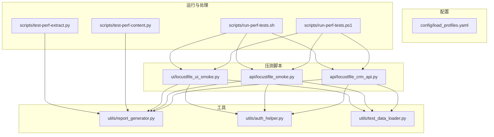
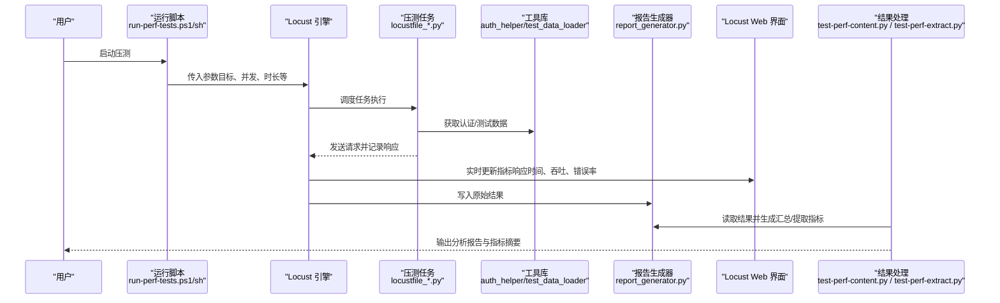
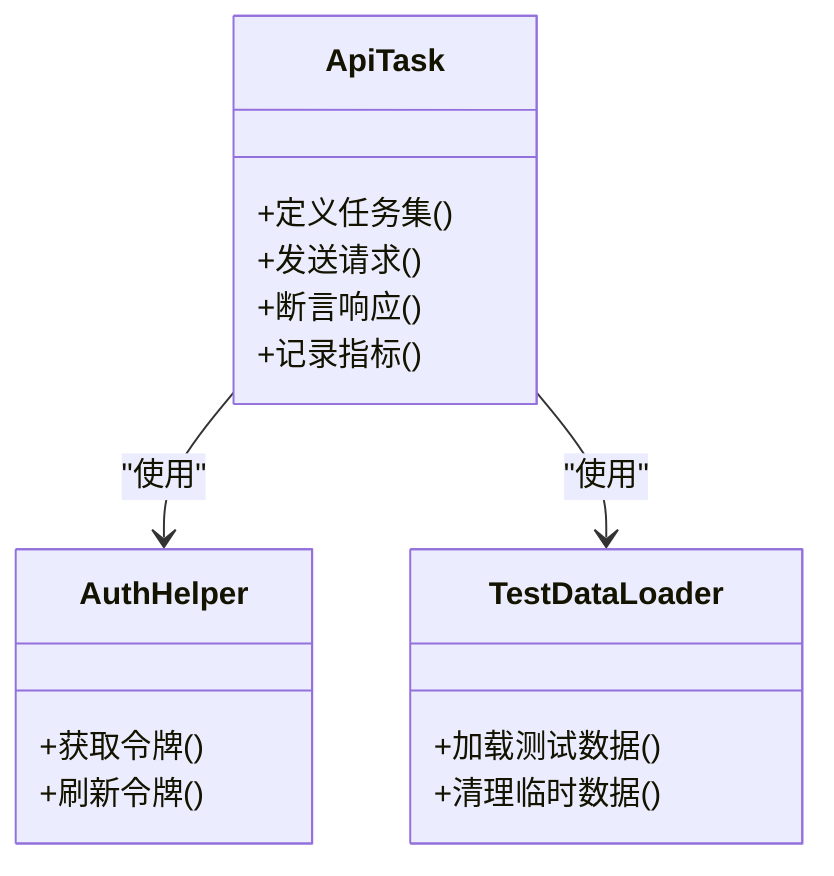
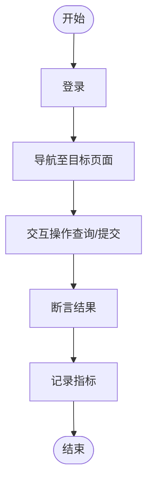
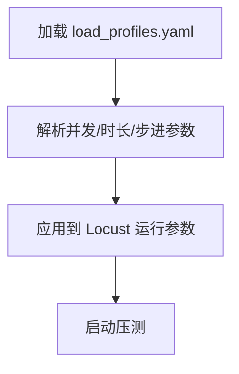
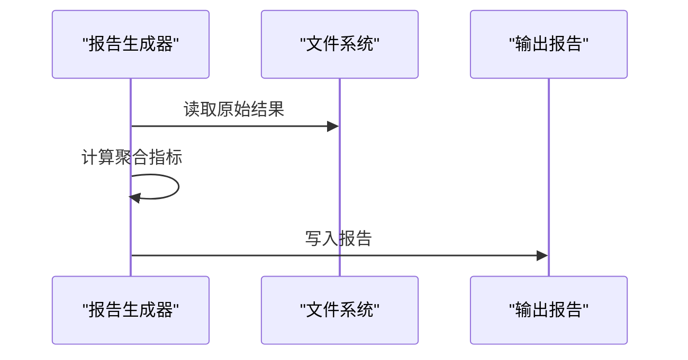
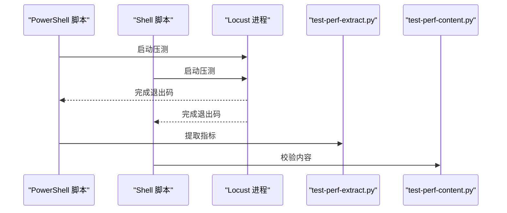
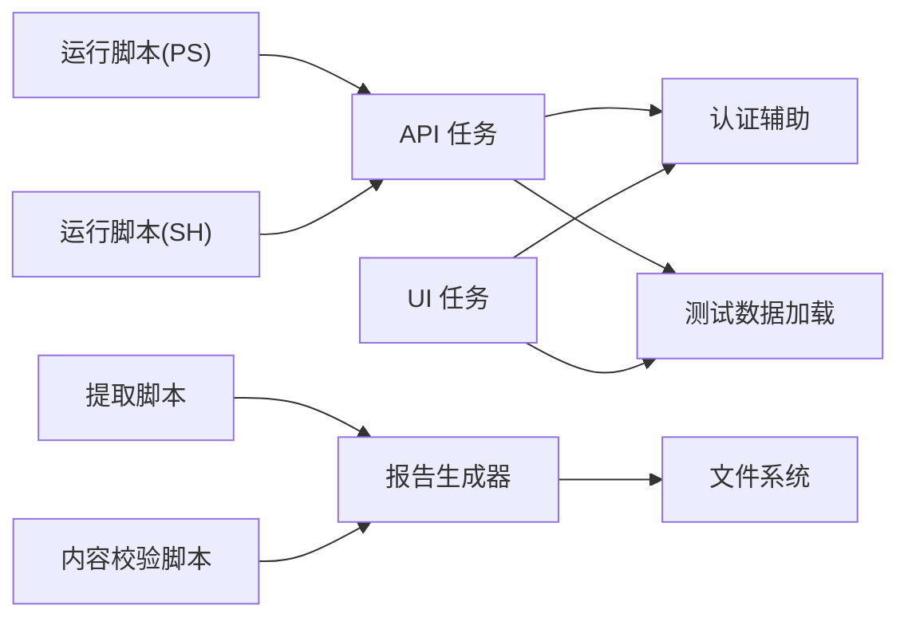

# 性能指标收集

<cite>
**本文引用的文件**   
- [tests/performance/locust/api/locustfile_crm_api.py](file://tests/performance/locust/api/locustfile_crm_api.py)
- [tests/performance/locust/api/locustfile_smoke.py](file://tests/performance/locust/api/locustfile_smoke.py)
- [tests/performance/locust/ui/locustfile_ui_smoke.py](file://tests/performance/locust/ui/locustfile_ui_smoke.py)
- [tests/performance/locust/config/load_profiles.yaml](file://tests/performance/locust/config/load_profiles.yaml)
- [tests/performance/locust/utils/report_generator.py](file://tests/performance/locust/utils/report_generator.py)
- [tests/performance/locust/utils/auth_helper.py](file://tests/performance/locust/utils/auth_helper.py)
- [tests/performance/locust/utils/test_data_loader.py](file://tests/performance/locust/utils/test_data_loader.py)
- [scripts/run-perf-tests.ps1](file://scripts/run-perf-tests.ps1)
- [scripts/run-perf-tests.sh](file://scripts/run-perf-tests.sh)
- [scripts/test-perf-content.py](file://scripts/test-perf-content.py)
- [scripts/test-perf-extract.py](file://scripts/test-perf-extract.py)
</cite>

## 目录
1. [简介](#简介)
2. [项目结构](#项目结构)
3. [核心组件](#核心组件)
4. [架构总览](#架构总览)
5. [详细组件分析](#详细组件分析)
6. [依赖关系分析](#依赖关系分析)
7. [性能考量](#性能考量)
8. [故障排查指南](#故障排查指南)
9. [结论](#结论)
10. [附录](#附录)

## 简介
本技术文档围绕性能指标收集与监控，聚焦于基于 Locust 的压测脚本与配套工具链。内容涵盖：
- Locust 内置指标采集机制（响应时间、吞吐量、错误率等）
- 自定义业务指标的添加与统计方法
- 实时性能数据的可视化展示（Web 界面与仪表盘定制）
- 性能基准的建立与维护策略（历史对比与趋势分析）
- 性能告警与阈值设置方案（自动化回归检测）

## 项目结构
本项目在 tests/performance/locust 下组织压测脚本与工具，scripts 提供运行与结果处理脚本。关键路径如下：
- 压测脚本：api、ui 子目录下的 locustfile_* 文件
- 配置：config/load_profiles.yaml（负载场景配置）
- 工具：utils 下的报告生成、认证辅助、测试数据加载
- 运行脚本：scripts 下的 Windows PowerShell 与 Linux/macOS Shell 脚本
- 结果处理：scripts 下的性能内容与提取脚本

图表来源
- [tests/performance/locust/api/locustfile_crm_api.py](file://tests/performance/locust/api/locustfile_crm_api.py)
- [tests/performance/locust/api/locustfile_smoke.py](file://tests/performance/locust/api/locustfile_smoke.py)
- [tests/performance/locust/ui/locustfile_ui_smoke.py](file://tests/performance/locust/ui/locustfile_ui_smoke.py)
- [tests/performance/locust/config/load_profiles.yaml](file://tests/performance/locust/config/load_profiles.yaml)
- [tests/performance/locust/utils/report_generator.py](file://tests/performance/locust/utils/report_generator.py)
- [tests/performance/locust/utils/auth_helper.py](file://tests/performance/locust/utils/auth_helper.py)
- [tests/performance/locust/utils/test_data_loader.py](file://tests/performance/locust/utils/test_data_loader.py)
- [scripts/run-perf-tests.ps1](file://scripts/run-perf-tests.ps1)
- [scripts/run-perf-tests.sh](file://scripts/run-perf-tests.sh)
- [scripts/test-perf-content.py](file://scripts/test-perf-content.py)
- [scripts/test-perf-extract.py](file://scripts/test-perf-extract.py)

章节来源
- [tests/performance/locust/api/locustfile_crm_api.py](file://tests/performance/locust/api/locustfile_crm_api.py)
- [tests/performance/locust/api/locustfile_smoke.py](file://tests/performance/locust/api/locustfile_smoke.py)
- [tests/performance/locust/ui/locustfile_ui_smoke.py](file://tests/performance/locust/ui/locustfile_ui_smoke.py)
- [tests/performance/locust/config/load_profiles.yaml](file://tests/performance/locust/config/load_profiles.yaml)
- [tests/performance/locust/utils/report_generator.py](file://tests/performance/locust/utils/report_generator.py)
- [tests/performance/locust/utils/auth_helper.py](file://tests/performance/locust/utils/auth_helper.py)
- [tests/performance/locust/utils/test_data_loader.py](file://tests/performance/locust/utils/test_data_loader.py)
- [scripts/run-perf-tests.ps1](file://scripts/run-perf-tests.ps1)
- [scripts/run-perf-tests.sh](file://scripts/run-perf-tests.sh)
- [scripts/test-perf-content.py](file://scripts/test-perf-content.py)
- [scripts/test-perf-extract.py](file://scripts/test-perf-extract.py)

## 核心组件
- 压测任务定义（Locust Tasks）
  - API 场景：CRM 接口与冒烟用例
  - UI 场景：UI 冒烟流程
- 配置管理
  - 负载模型与并发参数（load_profiles.yaml）
- 工具库
  - 报告生成器（report_generator.py）
  - 认证辅助（auth_helper.py）
  - 测试数据加载（test_data_loader.py）
- 运行与结果处理
  - 跨平台运行脚本（PowerShell/Shell）
  - 性能内容与提取脚本（test-perf-content.py、test-perf-extract.py）

章节来源
- [tests/performance/locust/api/locustfile_crm_api.py](file://tests/performance/locust/api/locustfile_crm_api.py)
- [tests/performance/locust/api/locustfile_smoke.py](file://tests/performance/locust/api/locustfile_smoke.py)
- [tests/performance/locust/ui/locustfile_ui_smoke.py](file://tests/performance/locust/ui/locustfile_ui_smoke.py)
- [tests/performance/locust/config/load_profiles.yaml](file://tests/performance/locust/config/load_profiles.yaml)
- [tests/performance/locust/utils/report_generator.py](file://tests/performance/locust/utils/report_generator.py)
- [tests/performance/locust/utils/auth_helper.py](file://tests/performance/locust/utils/auth_helper.py)
- [tests/performance/locust/utils/test_data_loader.py](file://tests/performance/locust/utils/test_data_loader.py)
- [scripts/run-perf-tests.ps1](file://scripts/run-perf-tests.ps1)
- [scripts/run-perf-tests.sh](file://scripts/run-perf-tests.sh)
- [scripts/test-perf-content.py](file://scripts/test-perf-content.py)
- [scripts/test-perf-extract.py](file://scripts/test-perf-extract.py)

## 架构总览
下图展示了从压测执行到指标采集、可视化与结果处理的端到端流程。

图表来源
- [scripts/run-perf-tests.ps1](file://scripts/run-perf-tests.ps1)
- [scripts/run-perf-tests.sh](file://scripts/run-perf-tests.sh)
- [tests/performance/locust/api/locustfile_crm_api.py](file://tests/performance/locust/api/locustfile_crm_api.py)
- [tests/performance/locust/api/locustfile_smoke.py](file://tests/performance/locust/api/locustfile_smoke.py)
- [tests/performance/locust/ui/locustfile_ui_smoke.py](file://tests/performance/locust/ui/locustfile_ui_smoke.py)
- [tests/performance/locust/utils/auth_helper.py](file://tests/performance/locust/utils/auth_helper.py)
- [tests/performance/locust/utils/test_data_loader.py](file://tests/performance/locust/utils/test_data_loader.py)
- [tests/performance/locust/utils/report_generator.py](file://tests/performance/locust/utils/report_generator.py)
- [scripts/test-perf-content.py](file://scripts/test-perf-content.py)
- [scripts/test-perf-extract.py](file://scripts/test-perf-extract.py)

## 详细组件分析

### 组件A：API 压测任务（CRM 与冒烟）
- 职责
  - 定义 API 场景的任务集（如 CRM 接口调用、冒烟流程）
  - 通过 Locust 事件钩子或内置统计自动采集响应时间、成功率、错误率、QPS 等
  - 可选：使用自定义事件上报业务指标（例如订单创建耗时、审批通过率）
- 关键点
  - 请求封装与断言：确保错误分类准确（HTTP 状态码、业务返回码）
  - 指标维度：按接口名称、方法、状态码分组统计
  - 可观测性：结合 Web 界面查看实时曲线与聚合统计

图表来源
- [tests/performance/locust/api/locustfile_crm_api.py](file://tests/performance/locust/api/locustfile_crm_api.py)
- [tests/performance/locust/api/locustfile_smoke.py](file://tests/performance/locust/api/locustfile_smoke.py)
- [tests/performance/locust/utils/auth_helper.py](file://tests/performance/locust/utils/auth_helper.py)
- [tests/performance/locust/utils/test_data_loader.py](file://tests/performance/locust/utils/test_data_loader.py)

章节来源
- [tests/performance/locust/api/locustfile_crm_api.py](file://tests/performance/locust/api/locustfile_crm_api.py)
- [tests/performance/locust/api/locustfile_smoke.py](file://tests/performance/locust/api/locustfile_smoke.py)
- [tests/performance/locust/utils/auth_helper.py](file://tests/performance/locust/utils/auth_helper.py)
- [tests/performance/locust/utils/test_data_loader.py](file://tests/performance/locust/utils/test_data_loader.py)

### 组件B：UI 压测任务（冒烟）
- 职责
  - 模拟用户操作序列（登录、导航、提交表单等）
  - 采集页面交互耗时与关键步骤成功率
- 关键点
  - 将 UI 动作映射为可度量的“虚拟请求”，便于与 API 指标对齐
  - 关注首屏渲染、关键按钮点击、表单提交的耗时分布

图表来源
- [tests/performance/locust/ui/locustfile_ui_smoke.py](file://tests/performance/locust/ui/locustfile_ui_smoke.py)

章节来源
- [tests/performance/locust/ui/locustfile_ui_smoke.py](file://tests/performance/locust/ui/locustfile_ui_smoke.py)

### 组件C：负载配置（load_profiles.yaml）
- 职责
  - 定义不同负载场景（低/中/高并发、阶梯加压、持续时间等）
  - 作为运行脚本的参数输入，驱动 Locust 的并发与节奏控制
- 关键点
  - 场景命名与版本化，便于历史对比
  - 参数化环境变量，支持多环境切换

图表来源
- [tests/performance/locust/config/load_profiles.yaml](file://tests/performance/locust/config/load_profiles.yaml)

章节来源
- [tests/performance/locust/config/load_profiles.yaml](file://tests/performance/locust/config/load_profiles.yaml)

### 组件D：报告生成器（report_generator.py）
- 职责
  - 读取 Locust 原始结果，生成结构化报告（JSON/CSV/HTML）
  - 计算聚合指标（P95/P99、吞吐、错误率、成功率）
- 关键点
  - 指标口径统一，避免歧义
  - 支持按接口/场景维度拆分

图表来源
- [tests/performance/locust/utils/report_generator.py](file://tests/performance/locust/utils/report_generator.py)

章节来源
- [tests/performance/locust/utils/report_generator.py](file://tests/performance/locust/utils/report_generator.py)

### 组件E：运行与结果处理脚本
- 运行脚本（PowerShell/Shell）
  - 负责参数组装、环境准备、启动 Locust、等待完成、归档结果
- 结果处理脚本
  - test-perf-content.py：校验报告内容与完整性
  - test-perf-extract.py：提取关键指标用于后续对比与告警

图表来源
- [scripts/run-perf-tests.ps1](file://scripts/run-perf-tests.ps1)
- [scripts/run-perf-tests.sh](file://scripts/run-perf-tests.sh)
- [scripts/test-perf-content.py](file://scripts/test-perf-content.py)
- [scripts/test-perf-extract.py](file://scripts/test-perf-extract.py)

章节来源
- [scripts/run-perf-tests.ps1](file://scripts/run-perf-tests.ps1)
- [scripts/run-perf-tests.sh](file://scripts/run-perf-tests.sh)
- [scripts/test-perf-content.py](file://scripts/test-perf-content.py)
- [scripts/test-perf-extract.py](file://scripts/test-perf-extract.py)

## 依赖关系分析
- 模块内聚与耦合
  - 压测任务强依赖工具库（认证、数据），弱依赖报告生成器（仅写结果）
  - 运行脚本与结果处理脚本解耦，通过文件系统交换数据
- 外部依赖
  - Locust 运行时与 Web 界面
  - 操作系统脚本环境（PowerShell/Shell）
- 潜在循环依赖
  - 当前结构未见循环导入；建议保持工具库无副作用、只读结果文件

图表来源
- [tests/performance/locust/api/locustfile_crm_api.py](file://tests/performance/locust/api/locustfile_crm_api.py)
- [tests/performance/locust/api/locustfile_smoke.py](file://tests/performance/locust/api/locustfile_smoke.py)
- [tests/performance/locust/ui/locustfile_ui_smoke.py](file://tests/performance/locust/ui/locustfile_ui_smoke.py)
- [tests/performance/locust/utils/auth_helper.py](file://tests/performance/locust/utils/auth_helper.py)
- [tests/performance/locust/utils/test_data_loader.py](file://tests/performance/locust/utils/test_data_loader.py)
- [tests/performance/locust/utils/report_generator.py](file://tests/performance/locust/utils/report_generator.py)
- [scripts/run-perf-tests.ps1](file://scripts/run-perf-tests.ps1)
- [scripts/run-perf-tests.sh](file://scripts/run-perf-tests.sh)
- [scripts/test-perf-content.py](file://scripts/test-perf-content.py)
- [scripts/test-perf-extract.py](file://scripts/test-perf-extract.py)

章节来源
- [tests/performance/locust/api/locustfile_crm_api.py](file://tests/performance/locust/api/locustfile_crm_api.py)
- [tests/performance/locust/api/locustfile_smoke.py](file://tests/performance/locust/api/locustfile_smoke.py)
- [tests/performance/locust/ui/locustfile_ui_smoke.py](file://tests/performance/locust/ui/locustfile_ui_smoke.py)
- [tests/performance/locust/utils/auth_helper.py](file://tests/performance/locust/utils/auth_helper.py)
- [tests/performance/locust/utils/test_data_loader.py](file://tests/performance/locust/utils/test_data_loader.py)
- [tests/performance/locust/utils/report_generator.py](file://tests/performance/locust/utils/report_generator.py)
- [scripts/run-perf-tests.ps1](file://scripts/run-perf-tests.ps1)
- [scripts/run-perf-tests.sh](file://scripts/run-perf-tests.sh)
- [scripts/test-perf-content.py](file://scripts/test-perf-content.py)
- [scripts/test-perf-extract.py](file://scripts/test-perf-extract.py)

## 性能考量
- 指标口径
  - 响应时间：建议使用分位数（P50/P90/P95/P99）描述尾部延迟
  - 吞吐量：以每秒请求数（RPS/QPS）衡量系统能力
  - 错误率：按 HTTP 状态码与业务错误码分别统计
- 采样与窗口
  - 合理设置滑动窗口与聚合粒度，避免瞬时抖动影响判断
- 资源开销
  - 控制压测机资源占用，避免成为瓶颈
- 稳定性
  - 预热阶段剔除冷启动数据
  - 多次重复实验取稳定区间

[本节为通用指导，不直接分析具体文件]

## 故障排查指南
- 常见问题定位
  - 指标缺失：检查任务是否正确记录响应与错误分类
  - 指标异常：确认网络、认证、数据准备是否稳定
  - 报告不完整：验证报告生成器读写权限与路径
- 快速验证
  - 使用最小负载场景复现问题
  - 通过 Web 界面观察实时曲线变化
- 日志与断点
  - 在关键步骤增加日志输出
  - 对认证与数据加载进行独立验证

章节来源
- [tests/performance/locust/utils/report_generator.py](file://tests/performance/locust/utils/report_generator.py)
- [scripts/test-perf-content.py](file://scripts/test-perf-content.py)
- [scripts/test-perf-extract.py](file://scripts/test-perf-extract.py)

## 结论
本项目通过 Locust 压测脚本与配套工具链，实现了从指标采集、实时可视化到结果处理的全链路能力。建议在以下方面持续完善：
- 标准化指标口径与报告模板
- 引入历史基线与趋势分析
- 建立告警与阈值规则，实现自动化回归检测

[本节为总结，不直接分析具体文件]

## 附录

### 内置指标采集要点
- 响应时间
  - 由 Locust 自动统计，可按接口维度查看分位数分布
- 吞吐量
  - 全局与接口维度的 RPS/QPS 曲线
- 错误率
  - 按状态码与业务错误码分类统计
- 自定义指标
  - 可通过事件钩子或自定义统计上报业务 KPI（如订单创建耗时、审批通过率）

章节来源
- [tests/performance/locust/api/locustfile_crm_api.py](file://tests/performance/locust/api/locustfile_crm_api.py)
- [tests/performance/locust/api/locustfile_smoke.py](file://tests/performance/locust/api/locustfile_smoke.py)
- [tests/performance/locust/ui/locustfile_ui_smoke.py](file://tests/performance/locust/ui/locustfile_ui_smoke.py)

### 实时可视化与仪表盘定制
- Web 界面
  - 启动后访问本地端口，查看实时指标与聚合统计
- 仪表盘定制
  - 通过扩展前端或导出指标到外部 BI 系统进行二次展示

章节来源
- [scripts/run-perf-tests.ps1](file://scripts/run-perf-tests.ps1)
- [scripts/run-perf-tests.sh](file://scripts/run-perf-tests.sh)

### 基准建立与维护策略
- 基线定义
  - 选择稳定版本与典型负载，记录 P95/P99、吞吐、错误率
- 历史对比
  - 使用报告生成器输出结构化数据，纳入版本化管理
- 趋势分析
  - 定期拉取指标，绘制趋势图，识别退化

章节来源
- [tests/performance/locust/utils/report_generator.py](file://tests/performance/locust/utils/report_generator.py)
- [scripts/test-perf-extract.py](file://scripts/test-perf-extract.py)

### 告警与阈值设置（自动化回归检测）
- 阈值建议
  - 响应时间：P95/P99 相对基线增长超过 X%
  - 错误率：绝对阈值（如 > Y%）
  - 吞吐：低于基线的 Z%
- 自动化流程
  - 压测完成后，由提取脚本输出指标，交由 CI/CD 判定是否触发告警

章节来源
- [scripts/test-perf-extract.py](file://scripts/test-perf-extract.py)
- [scripts/test-perf-content.py](file://scripts/test-perf-content.py)