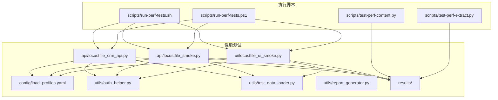
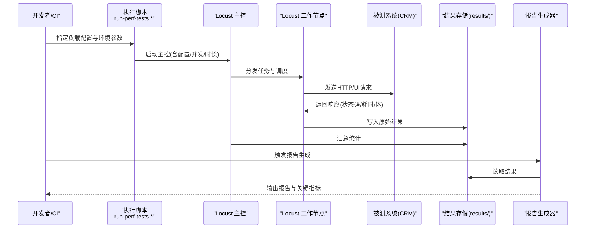
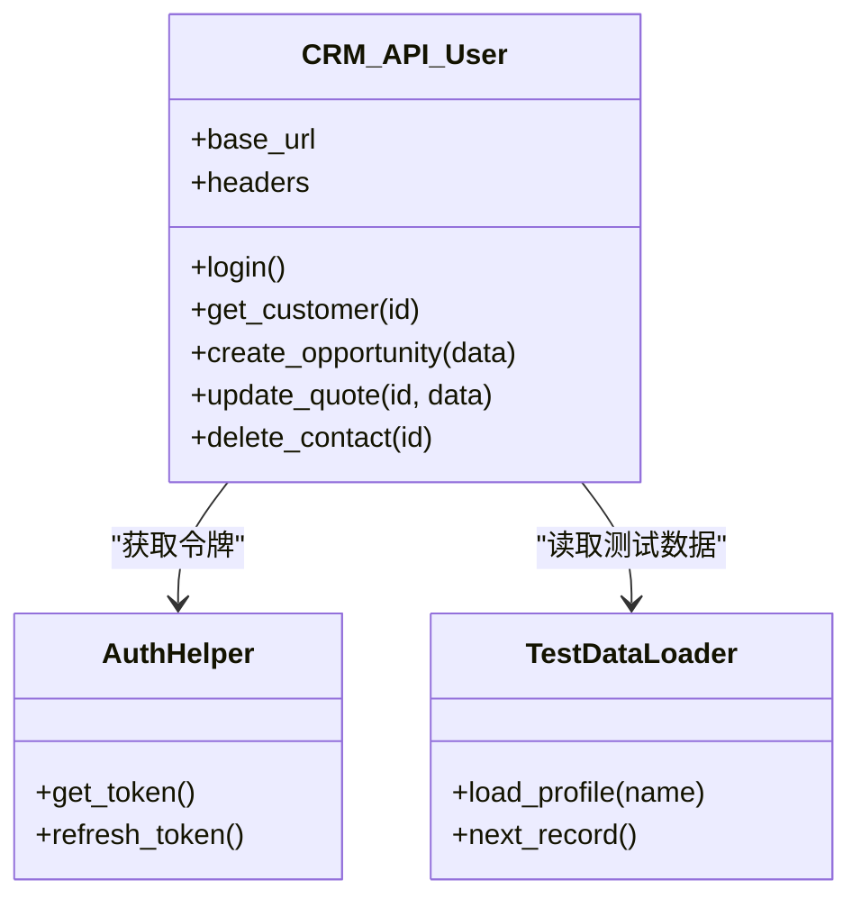
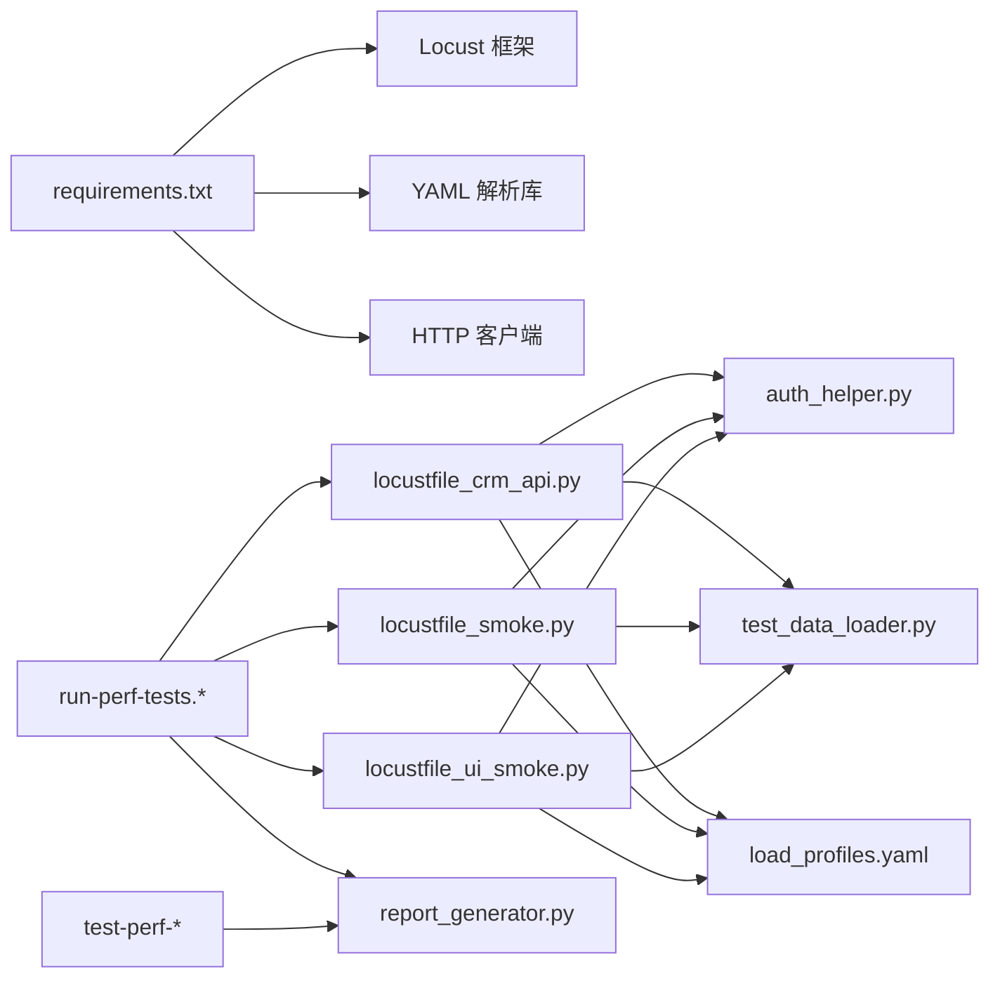

# 性能测试

<cite>
**本文引用的文件**   
- [performance/README.md](file://tests/performance/README.md)
- [performance/requirements.txt](file://tests/performance/requirements.txt)
- [performance/config/load_profiles.yaml](file://tests/performance/config/load_profiles.yaml)
- [performance/api/locustfile_crm_api.py](file://tests/performance/api/locustfile_crm_api.py)
- [performance/api/locustfile_smoke.py](file://tests/performance/api/locustfile_smoke.py)
- [performance/ui/locustfile_ui_smoke.py](file://tests/performance/ui/locustfile_ui_smoke.py)
- [performance/utils/auth_helper.py](file://tests/performance/utils/auth_helper.py)
- [performance/utils/report_generator.py](file://tests/performance/utils/report_generator.py)
- [performance/utils/test_data_loader.py](file://tests/performance/utils/test_data_loader.py)
- [scripts/run-perf-tests.sh](file://scripts/run-perf-tests.sh)
- [scripts/run-perf-tests.ps1](file://scripts/run-perf-tests.ps1)
- [scripts/test-perf-content.py](file://scripts/test-perf-content.py)
- [scripts/test-perf-extract.py](file://scripts/test-perf-extract.py)
</cite>

## 目录
1. [简介](#简介)
2. [项目结构](#项目结构)
3. [核心组件](#核心组件)
4. [架构总览](#架构总览)
5. [详细组件分析](#详细组件分析)
6. [依赖关系分析](#依赖关系分析)
7. [性能考量](#性能考量)
8. [故障排查指南](#故障排查指南)
9. [结论](#结论)
10. [附录](#附录)

## 简介
本技术文档面向 AutoTest Hub 的性能测试模块，聚焦基于 Locust 的负载测试实现与 CRM API 场景。内容涵盖：
- 负载配置文件设计（多环境、多阶段）
- 用户行为建模（登录、CRM 业务接口调用、UI 冒烟）
- 并发控制与请求频率控制
- 指标采集与结果聚合
- 报告生成与关键指标解读
- 回归检测、基准测试与持续监控策略
- 分布式部署与结果聚合方案
- 最佳实践：场景设计、资源监控与瓶颈分析

## 项目结构
性能测试相关代码位于 tests/performance 目录下，配套脚本位于 scripts 目录。整体组织遵循“按特性分层 + 工具复用”的策略：
- api：API 压测脚本（Locust），包含 CRM API 与冒烟场景
- ui：UI 冒烟压测脚本（Locust）
- config：负载配置（如 load_profiles.yaml）
- utils：通用工具（认证、数据加载、报告生成）
- results：运行结果输出目录（由运行时生成）
- README.md：使用说明与快速开始
- requirements.txt：Python 依赖清单

图表来源
- [performance/api/locustfile_crm_api.py](file://tests/performance/api/locustfile_crm_api.py)
- [performance/api/locustfile_smoke.py](file://tests/performance/api/locustfile_smoke.py)
- [performance/ui/locustfile_ui_smoke.py](file://tests/performance/ui/locustfile_ui_smoke.py)
- [performance/config/load_profiles.yaml](file://tests/performance/config/load_profiles.yaml)
- [performance/utils/auth_helper.py](file://tests/performance/utils/auth_helper.py)
- [performance/utils/test_data_loader.py](file://tests/performance/utils/test_data_loader.py)
- [performance/utils/report_generator.py](file://tests/performance/utils/report_generator.py)
- [scripts/run-perf-tests.sh](file://scripts/run-perf-tests.sh)
- [scripts/run-perf-tests.ps1](file://scripts/run-perf-tests.ps1)
- [scripts/test-perf-content.py](file://scripts/test-perf-content.py)
- [scripts/test-perf-extract.py](file://scripts/test-perf-extract.py)

章节来源
- [performance/README.md](file://tests/performance/README.md)
- [performance/requirements.txt](file://tests/performance/requirements.txt)

## 核心组件
- 负载配置中心：通过 YAML 集中管理不同环境的负载参数（如目标主机、并发数、持续时间、Ramp-up 等），供各 Locust 任务读取。
- 用户行为模型：在 API 与 UI 的 Locust 文件中定义 TaskSet/HttpUser，模拟真实用户路径（登录、查询、创建、更新、删除等）。
- 认证与数据准备：封装鉴权流程与测试数据加载，确保压测过程具备稳定输入与可复现性。
- 指标收集与报告：利用 Locust 内置统计与自定义事件上报，结合报告生成器产出结构化报告。
- 执行编排：Shell/PowerShell 脚本统一入口，支持本地与 CI 环境一键执行，并触发结果提取与内容校验。

章节来源
- [performance/config/load_profiles.yaml](file://tests/performance/config/load_profiles.yaml)
- [performance/api/locustfile_crm_api.py](file://tests/performance/api/locustfile_crm_api.py)
- [performance/api/locustfile_smoke.py](file://tests/performance/api/locustfile_smoke.py)
- [performance/ui/locustfile_ui_smoke.py](file://tests/performance/ui/locustfile_ui_smoke.py)
- [performance/utils/auth_helper.py](file://tests/performance/utils/auth_helper.py)
- [performance/utils/test_data_loader.py](file://tests/performance/utils/test_data_loader.py)
- [performance/utils/report_generator.py](file://tests/performance/utils/report_generator.py)

## 架构总览
下图展示了从执行入口到 Locust 工作进程、再到结果与报告的端到端流程。

图表来源
- [scripts/run-perf-tests.sh](file://scripts/run-perf-tests.sh)
- [scripts/run-perf-tests.ps1](file://scripts/run-perf-tests.ps1)
- [performance/api/locustfile_crm_api.py](file://tests/performance/api/locustfile_crm_api.py)
- [performance/api/locustfile_smoke.py](file://tests/performance/api/locustfile_smoke.py)
- [performance/ui/locustfile_ui_smoke.py](file://tests/performance/ui/locustfile_ui_smoke.py)
- [performance/utils/report_generator.py](file://tests/performance/utils/report_generator.py)

## 详细组件分析

### 负载配置文件（load_profiles.yaml）
- 作用：集中定义不同压力等级与环境的负载参数，便于在多环境间切换与扩展。
- 典型字段建议：
  - 目标信息：host、base_path、timeout
  - 并发与节奏：users、spawn_rate、ramp_up_seconds、duration
  - 场景权重：各 TaskSet 的访问概率或权重
  - 开关与阈值：是否启用断言、错误率阈值、P95/P99 阈值
- 使用方式：在 Locust 任务中按需加载对应 profile，驱动用户数量与速率。

章节来源
- [performance/config/load_profiles.yaml](file://tests/performance/config/load_profiles.yaml)

### CRM API 压测场景（locustfile_crm_api.py）
- 用户模型：继承 HttpUser，设置 base_url、默认头、会话保持等。
- 任务集：围绕 CRM 核心能力（如客户、商机、报价等）构建 TaskSet，覆盖 CRUD 与复合流程。
- 并发与频率：
  - 通过配置控制 users/spawn_rate/duration
  - 可在任务内使用 wait_time 控制请求间隔
- 指标采集：
  - 自动记录每个接口的请求次数、失败次数、平均/百分位响应时间
  - 可通过自定义事件上报业务级指标（如订单创建成功率）
- 断言与错误处理：
  - 对状态码、关键字段进行断言
  - 捕获异常并记录上下文，避免单点失败影响整体压测

图表来源
- [performance/api/locustfile_crm_api.py](file://tests/performance/api/locustfile_crm_api.py)
- [performance/utils/auth_helper.py](file://tests/performance/utils/auth_helper.py)
- [performance/utils/test_data_loader.py](file://tests/performance/utils/test_data_loader.py)

章节来源
- [performance/api/locustfile_crm_api.py](file://tests/performance/api/locustfile_crm_api.py)
- [performance/utils/auth_helper.py](file://tests/performance/utils/auth_helper.py)
- [performance/utils/test_data_loader.py](file://tests/performance/utils/test_data_loader.py)

### API 冒烟场景（locustfile_smoke.py）
- 目的：快速验证核心链路可用性与基础性能。
- 特点：轻量任务集、较短 duration、低并发，适合日常回归。

章节来源
- [performance/api/locustfile_smoke.py](file://tests/performance/api/locustfile_smoke.py)

### UI 冒烟场景（locustfile_ui_smoke.py）
- 目的：对前端页面进行轻量并发访问，观察首屏渲染与交互延迟。
- 说明：若采用浏览器自动化，需关注资源占用与稳定性；也可仅做 HTTP 层面的页面访问压测。

章节来源
- [performance/ui/locustfile_ui_smoke.py](file://tests/performance/ui/locustfile_ui_smoke.py)

### 认证与数据准备（auth_helper.py / test_data_loader.py）
- 认证：封装登录、令牌刷新、鉴权头注入，保证后续请求无需重复登录。
- 数据：提供批量数据源与游标式读取，避免数据冲突与幂等问题。

章节来源
- [performance/utils/auth_helper.py](file://tests/performance/utils/auth_helper.py)
- [performance/utils/test_data_loader.py](file://tests/performance/utils/test_data_loader.py)

### 报告生成（report_generator.py）
- 输入：Locust 生成的结果文件（JSON/CSV 等）
- 输出：结构化报告（HTML/Markdown/JSON），包含：
  - 总体吞吐、错误率、P50/P95/P99 响应时间
  - 分接口明细与趋势图
  - 阈值告警与回归判定
- 集成：在执行脚本中自动触发，或在 CI 中作为独立步骤运行。

章节来源
- [performance/utils/report_generator.py](file://tests/performance/utils/report_generator.py)

### 执行编排（run-perf-tests.sh / run-perf-tests.ps1）
- 功能：
  - 解析入参（profile、并发、时长、是否分布式等）
  - 启动 Locust 主控与工作节点
  - 等待完成并导出结果
  - 可选：触发报告生成与内容校验
- 跨平台：提供 Shell 与 PowerShell 两套入口。

章节来源
- [scripts/run-perf-tests.sh](file://scripts/run-perf-tests.sh)
- [scripts/run-perf-tests.ps1](file://scripts/run-perf-tests.ps1)

### 结果校验与提取（test-perf-content.py / test-perf-extract.py）
- 提取：从结果中抽取关键指标（吞吐、错误率、分位耗时）
- 校验：对比阈值或基线，输出 PASS/FAIL 与差异摘要
- 用途：用于回归门禁与发布前质量把关

章节来源
- [scripts/test-perf-content.py](file://scripts/test-perf-content.py)
- [scripts/test-perf-extract.py](file://scripts/test-perf-extract.py)

## 依赖关系分析
- Python 依赖：由 requirements.txt 统一管理，通常包含 locust、requests、yaml 等。
- 外部依赖：被测 CRM 系统、可能的认证服务、数据存储（本地文件或对象存储）。
- 组件耦合：
  - Locust 任务依赖认证与数据加载工具
  - 执行脚本依赖配置与报告生成器
  - 结果校验脚本依赖报告/结果文件

图表来源
- [performance/requirements.txt](file://tests/performance/requirements.txt)
- [performance/api/locustfile_crm_api.py](file://tests/performance/api/locustfile_crm_api.py)
- [performance/api/locustfile_smoke.py](file://tests/performance/api/locustfile_smoke.py)
- [performance/ui/locustfile_ui_smoke.py](file://tests/performance/ui/locustfile_ui_smoke.py)
- [performance/config/load_profiles.yaml](file://tests/performance/config/load_profiles.yaml)
- [performance/utils/auth_helper.py](file://tests/performance/utils/auth_helper.py)
- [performance/utils/test_data_loader.py](file://tests/performance/utils/test_data_loader.py)
- [performance/utils/report_generator.py](file://tests/performance/utils/report_generator.py)
- [scripts/run-perf-tests.sh](file://scripts/run-perf-tests.sh)
- [scripts/run-perf-tests.ps1](file://scripts/run-perf-tests.ps1)
- [scripts/test-perf-content.py](file://scripts/test-perf-content.py)
- [scripts/test-perf-extract.py](file://scripts/test-perf-extract.py)

章节来源
- [performance/requirements.txt](file://tests/performance/requirements.txt)

## 性能考量
- 并发与速率
  - 合理设置 users 与 spawn_rate，避免瞬间峰值导致被测系统抖动
  - 使用 ramp_up_seconds 平滑加压，观察系统拐点
- 请求间隔
  - 在任务中使用 wait_time 模拟真实用户思考时间，避免纯机器极限压测失真
- 连接复用
  - 复用会话与连接池，减少握手开销
- 数据隔离
  - 使用唯一标识与幂等设计，避免数据竞争导致的假失败
- 指标选择
  - 关注 P95/P99 而非仅平均值，更能反映长尾问题
- 资源监控
  - 配合系统监控（CPU、内存、磁盘 I/O、网络）定位瓶颈
- 回归与基线
  - 建立基线指标，定期对比，发现退化及时告警

[本节为通用指导，不直接分析具体文件]

## 故障排查指南
- 常见问题
  - 认证失败：检查令牌有效期与刷新逻辑
  - 数据冲突：确认数据加载器是否提供唯一键与回滚机制
  - 端口/网络：确认 host/base_path 与防火墙策略
  - 结果缺失：检查 results 目录权限与报告生成器路径
- 定位方法
  - 查看 Locust Web UI 实时统计
  - 使用 test-perf-extract.py 抽取关键指标
  - 使用 test-perf-content.py 进行阈值比对与差异定位
- 恢复策略
  - 降低并发重试
  - 清理脏数据后重跑
  - 调整超时与重试策略

章节来源
- [scripts/test-perf-content.py](file://scripts/test-perf-content.py)
- [scripts/test-perf-extract.py](file://scripts/test-perf-extract.py)
- [performance/utils/report_generator.py](file://tests/performance/utils/report_generator.py)

## 结论
AutoTest Hub 的性能测试模块以 Locust 为核心，结合统一的负载配置、可复用的认证与数据工具、以及完善的执行与报告体系，形成了从场景设计、执行、采集到分析与回归的闭环。通过合理的并发控制、指标监控与回归检测，可有效保障 CRM 系统的性能质量与稳定性。

[本节为总结性内容，不直接分析具体文件]

## 附录

### 关键指标解读
- 吞吐量（TPS/QPS）：单位时间内成功处理的请求数
- 错误率：失败请求占比，需区分服务端错误与客户端断言失败
- 响应时间：P50/P95/P99，越靠近尾部越能体现用户体验
- 资源利用率：CPU/内存/IO/网络，结合应用日志定位热点

[本节为通用指导，不直接分析具体文件]

### 分布式测试与结果聚合
- 部署模式
  - 单机：适用于小规模压测与开发调试
  - 分布式：主控+多工作节点，横向扩展并发能力
- 结果聚合
  - 主控汇总各节点统计，统一输出结果
  - 将结果持久化至共享存储，便于报告生成与历史对比
- 注意事项
  - 时钟同步与网络带宽
  - 节点均匀分配与负载均衡
  - 结果文件命名与版本化管理

[本节为通用指导，不直接分析具体文件]

### 持续性能监控与回归检测
- 基线维护：在稳定版本上建立基线指标
- 周期回归：每次变更触发轻量回归用例
- 阈值告警：超过阈值即阻断或告警
- 可视化：将报告纳入看板，跟踪趋势

[本节为通用指导，不直接分析具体文件]