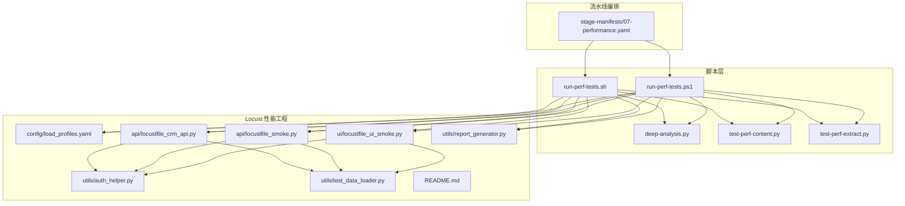
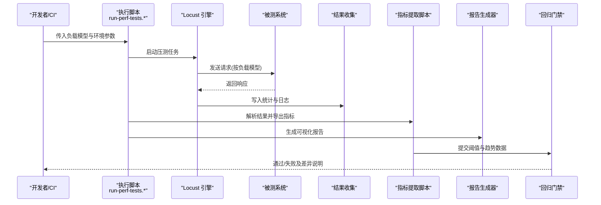
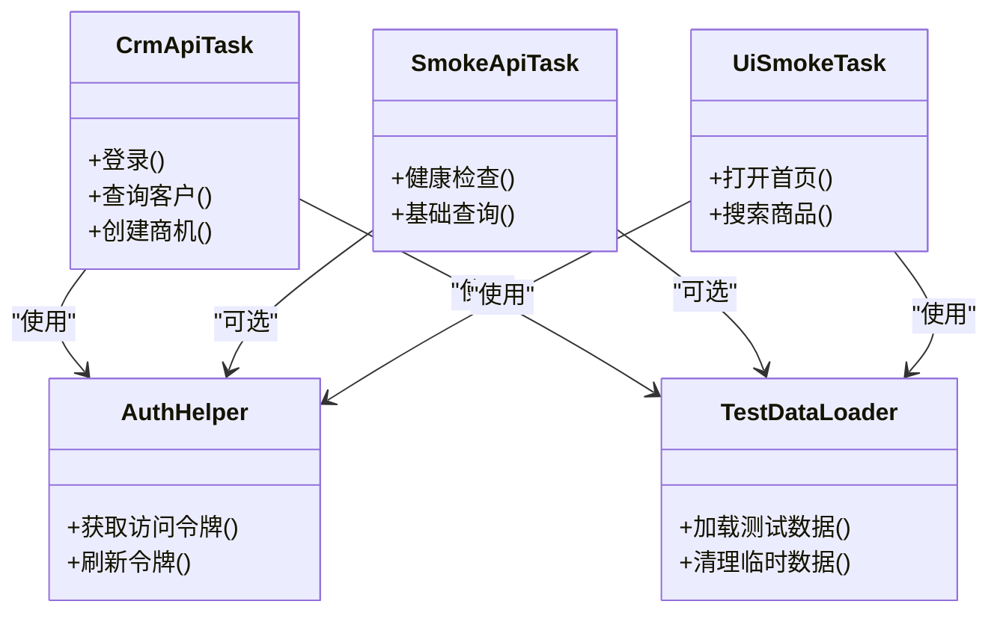
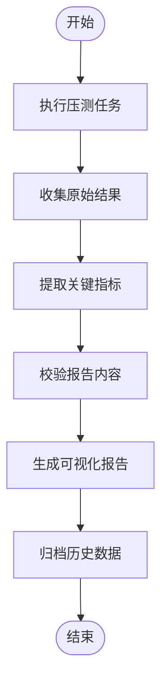
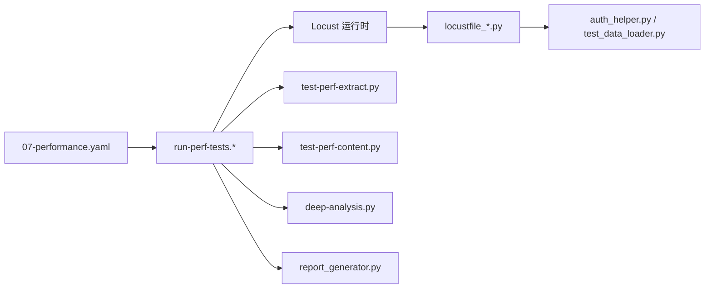

# 性能指标分析

<cite>
**本文引用的文件**   
- [scripts/run-perf-tests.sh](file://scripts/run-perf-tests.sh)
- [scripts/run-perf-tests.ps1](file://scripts/run-perf-tests.ps1)
- [tests/performance/locust/README.md](file://tests/performance/locust/README.md)
- [tests/performance/locust/config/load_profiles.yaml](file://tests/performance/locust/config/load_profiles.yaml)
- [tests/performance/locust/utils/report_generator.py](file://tests/performance/locust/utils/report_generator.py)
- [tests/performance/locust/api/locustfile_crm_api.py](file://tests/performance/locust/api/locustfile_crm_api.py)
- [tests/performance/locust/api/locustfile_smoke.py](file://tests/performance/locust/api/locustfile_smoke.py)
- [tests/performance/locust/ui/locustfile_ui_smoke.py](file://tests/performance/locust/ui/locustfile_ui_smoke.py)
- [tests/performance/locust/utils/auth_helper.py](file://tests/performance/locust/utils/auth_helper.py)
- [tests/performance/locust/utils/test_data_loader.py](file://tests/performance/locust/utils/test_data_loader.py)
- [scripts/deep-analysis.py](file://scripts/deep-analysis.py)
- [scripts/test-perf-content.py](file://scripts/test-perf-content.py)
- [scripts/test-perf-extract.py](file://scripts/test-perf-extract.py)
- [stage-manifests/07-performance.yaml](file://stage-manifests/07-performance.yaml)
</cite>

## 目录
1. [简介](#简介)
2. [项目结构](#项目结构)
3. [核心组件](#核心组件)
4. [架构总览](#架构总览)
5. [详细组件分析](#详细组件分析)
6. [依赖关系分析](#依赖关系分析)
7. [性能考量](#性能考量)
8. [故障排查指南](#故障排查指南)
9. [结论](#结论)
10. [附录](#附录)

## 简介
本技术文档面向“性能测试指标分析系统”，聚焦于关键性能指标的采集与计算方法（P95/P99响应时间、吞吐量、错误率、资源利用率），负载配置文件结构与参数调优策略，性能基准的建立与维护方法（历史数据对比与趋势分析），以及性能瓶颈诊断工具与分析技巧（慢请求识别、内存泄漏检测、CPU使用率分析）。同时提供自动化性能回归检测的实现方案，帮助团队在持续集成中稳定地执行性能测试并自动判定回归。

## 项目结构
仓库中与性能相关的代码主要分布在以下位置：
- 脚本层：用于启动性能测试、提取结果与深度分析的命令行脚本
- Locust 性能用例与配置：API/UI 的压测场景定义、负载模型与报告生成工具
- 阶段清单：CI/CD 流水线中的性能阶段编排

图表来源
- [scripts/run-perf-tests.sh](file://scripts/run-perf-tests.sh)
- [scripts/run-perf-tests.ps1](file://scripts/run-perf-tests.ps1)
- [tests/performance/locust/config/load_profiles.yaml](file://tests/performance/locust/config/load_profiles.yaml)
- [tests/performance/locust/api/locustfile_crm_api.py](file://tests/performance/locust/api/locustfile_crm_api.py)
- [tests/performance/locust/api/locustfile_smoke.py](file://tests/performance/locust/api/locustfile_smoke.py)
- [tests/performance/locust/ui/locustfile_ui_smoke.py](file://tests/performance/locust/ui/locustfile_ui_smoke.py)
- [tests/performance/locust/utils/auth_helper.py](file://tests/performance/locust/utils/auth_helper.py)
- [tests/performance/locust/utils/test_data_loader.py](file://tests/performance/locust/utils/test_data_loader.py)
- [tests/performance/locust/utils/report_generator.py](file://tests/performance/locust/utils/report_generator.py)
- [tests/performance/locust/README.md](file://tests/performance/locust/README.md)
- [stage-manifests/07-performance.yaml](file://stage-manifests/07-performance.yaml)

章节来源
- [scripts/run-perf-tests.sh](file://scripts/run-perf-tests.sh)
- [scripts/run-perf-tests.ps1](file://scripts/run-perf-tests.ps1)
- [tests/performance/locust/README.md](file://tests/performance/locust/README.md)
- [tests/performance/locust/config/load_profiles.yaml](file://tests/performance/locust/config/load_profiles.yaml)
- [tests/performance/locust/utils/report_generator.py](file://tests/performance/locust/utils/report_generator.py)
- [tests/performance/locust/api/locustfile_crm_api.py](file://tests/performance/locust/api/locustfile_crm_api.py)
- [tests/performance/locust/api/locustfile_smoke.py](file://tests/performance/locust/api/locustfile_smoke.py)
- [tests/performance/locust/ui/locustfile_ui_smoke.py](file://tests/performance/locust/ui/locustfile_ui_smoke.py)
- [tests/performance/locust/utils/auth_helper.py](file://tests/performance/locust/utils/auth_helper.py)
- [tests/performance/locust/utils/test_data_loader.py](file://tests/performance/locust/utils/test_data_loader.py)
- [stage-manifests/07-performance.yaml](file://stage-manifests/07-performance.yaml)

## 核心组件
- 压测执行入口
  - Shell/PowerShell 脚本负责调用 Locust 执行器，传入目标环境、并发模型与持续时间等参数，并在完成后触发报告生成与指标提取。
- 负载模型与用例
  - API 与 UI 的 Locust 文件定义了业务接口与页面流程的压测任务；认证与测试数据通过工具模块注入。
- 负载配置文件
  - YAML 文件集中管理不同负载场景的参数（如并发用户数、RPS、持续时间、爬坡策略等），便于在不同环境复用与切换。
- 报告与指标提取
  - 报告生成器汇总运行结果；专用脚本从原始输出中提取关键指标，供后续分析与回归判定使用。
- 深度分析
  - 针对异常或退化场景，提供深度分析脚本以辅助定位瓶颈。

章节来源
- [scripts/run-perf-tests.sh](file://scripts/run-perf-tests.sh)
- [scripts/run-perf-tests.ps1](file://scripts/run-perf-tests.ps1)
- [tests/performance/locust/config/load_profiles.yaml](file://tests/performance/locust/config/load_profiles.yaml)
- [tests/performance/locust/utils/report_generator.py](file://tests/performance/locust/utils/report_generator.py)
- [tests/performance/locust/api/locustfile_crm_api.py](file://tests/performance/locust/api/locustfile_crm_api.py)
- [tests/performance/locust/api/locustfile_smoke.py](file://tests/performance/locust/api/locustfile_smoke.py)
- [tests/performance/locust/ui/locustfile_ui_smoke.py](file://tests/performance/locust/ui/locustfile_ui_smoke.py)
- [tests/performance/locust/utils/auth_helper.py](file://tests/performance/locust/utils/auth_helper.py)
- [tests/performance/locust/utils/test_data_loader.py](file://tests/performance/locust/utils/test_data_loader.py)

## 架构总览
整体流程由“执行入口 → 压测引擎 → 被测系统 → 结果收集 → 指标提取与报告 → 回归判定”构成。

图表来源
- [scripts/run-perf-tests.sh](file://scripts/run-perf-tests.sh)
- [scripts/run-perf-tests.ps1](file://scripts/run-perf-tests.ps1)
- [tests/performance/locust/utils/report_generator.py](file://tests/performance/locust/utils/report_generator.py)
- [scripts/test-perf-extract.py](file://scripts/test-perf-extract.py)
- [scripts/test-perf-content.py](file://scripts/test-perf-content.py)
- [scripts/deep-analysis.py](file://scripts/deep-analysis.py)

## 详细组件分析

### 指标定义与计算方法
- P95/P99 响应时间
  - 计算方式：对某接口或全局所有请求的响应时间排序，取第95%与第99%分位点作为延迟上限参考。
  - 适用场景：评估长尾延迟与用户体验稳定性。
- 吞吐量（TPS/QPS）
  - 计算方式：单位时间内成功处理的请求总数。可按接口维度聚合，区分成功/失败。
  - 适用场景：衡量系统承载能力与扩容效果。
- 错误率
  - 计算方式：失败请求数占全部请求数的比例。失败通常由状态码或自定义断言判定。
  - 适用场景：快速发现功能退化或下游依赖异常。
- 资源利用率
  - 指标范围：CPU、内存、磁盘I/O、网络带宽等。
  - 采集建议：在压测期间同步采集宿主或容器指标，并与请求时序对齐，以便关联分析。

章节来源
- [tests/performance/locust/README.md](file://tests/performance/locust/README.md)
- [tests/performance/locust/utils/report_generator.py](file://tests/performance/locust/utils/report_generator.py)
- [scripts/test-perf-extract.py](file://scripts/test-perf-extract.py)
- [scripts/test-perf-content.py](file://scripts/test-perf-content.py)

### 负载配置文件结构与参数调优
- 文件组织
  - 统一存放于配置目录，按场景划分（如冒烟、全量、峰值、稳定性）。
- 关键参数
  - 并发用户数：控制同时发起请求的用户代理数量。
  - 请求间隔/速率：控制单用户行为节奏或全局RPS。
  - 持续时间：单次压测任务的时长，支持短跑与长跑。
  - 爬坡/稳态：预热阶段逐步提升并发，随后进入稳态观测。
- 调优策略
  - 先小并发验证链路正确性与资源基线，再逐步放大至目标容量。
  - 关注P95/P99与错误率的拐点，避免仅追求高吞吐而牺牲稳定性。
  - 结合资源利用率判断是否达到硬件或中间件瓶颈。

章节来源
- [tests/performance/locust/config/load_profiles.yaml](file://tests/performance/locust/config/load_profiles.yaml)
- [tests/performance/locust/README.md](file://tests/performance/locust/README.md)

### 压测用例与数据准备
- API 用例
  - 覆盖核心业务接口，包含登录鉴权、主流程与边界条件。
- UI 用例
  - 模拟真实用户操作路径，评估端到端体验。
- 认证与数据
  - 通过工具模块获取令牌与构造测试数据，确保用例可重复与隔离。

图表来源
- [tests/performance/locust/api/locustfile_crm_api.py](file://tests/performance/locust/api/locustfile_crm_api.py)
- [tests/performance/locust/api/locustfile_smoke.py](file://tests/performance/locust/api/locustfile_smoke.py)
- [tests/performance/locust/ui/locustfile_ui_smoke.py](file://tests/performance/locust/ui/locustfile_ui_smoke.py)
- [tests/performance/locust/utils/auth_helper.py](file://tests/performance/locust/utils/auth_helper.py)
- [tests/performance/locust/utils/test_data_loader.py](file://tests/performance/locust/utils/test_data_loader.py)

章节来源
- [tests/performance/locust/api/locustfile_crm_api.py](file://tests/performance/locust/api/locustfile_crm_api.py)
- [tests/performance/locust/api/locustfile_smoke.py](file://tests/performance/locust/api/locustfile_smoke.py)
- [tests/performance/locust/ui/locustfile_ui_smoke.py](file://tests/performance/locust/ui/locustfile_ui_smoke.py)
- [tests/performance/locust/utils/auth_helper.py](file://tests/performance/locust/utils/auth_helper.py)
- [tests/performance/locust/utils/test_data_loader.py](file://tests/performance/locust/utils/test_data_loader.py)

### 报告生成与指标提取
- 报告生成器
  - 汇总各接口的延迟分布、吞吐与错误信息，输出结构化报告。
- 指标提取脚本
  - 从原始输出中抽取关键指标，形成机器可读的数据集，供趋势与回归分析使用。
- 内容校验脚本
  - 对报告内容的完整性与一致性进行校验，防止缺失或异常字段影响后续分析。

图表来源
- [tests/performance/locust/utils/report_generator.py](file://tests/performance/locust/utils/report_generator.py)
- [scripts/test-perf-extract.py](file://scripts/test-perf-extract.py)
- [scripts/test-perf-content.py](file://scripts/test-perf-content.py)

章节来源
- [tests/performance/locust/utils/report_generator.py](file://tests/performance/locust/utils/report_generator.py)
- [scripts/test-perf-extract.py](file://scripts/test-perf-extract.py)
- [scripts/test-perf-content.py](file://scripts/test-perf-content.py)

### 深度分析与问题定位
- 慢请求识别
  - 基于P95/P99与接口维度统计，筛选尾部延迟显著增长的请求。
- 资源瓶颈分析
  - 将CPU、内存、IO与网络指标与请求时序对齐，定位热点路径与资源争用。
- 回归检测
  - 将本次指标与历史基线对比，超过阈值则触发告警与阻断。

章节来源
- [scripts/deep-analysis.py](file://scripts/deep-analysis.py)
- [scripts/test-perf-extract.py](file://scripts/test-perf-extract.py)
- [scripts/test-perf-content.py](file://scripts/test-perf-content.py)

## 依赖关系分析
- 执行脚本依赖
  - 压测执行脚本依赖 Locust 运行时与相关 Python 包；报告生成与指标提取脚本依赖标准库与必要的第三方库。
- 用例与工具依赖
  - 用例模块依赖认证与数据加载工具；UI 用例可能依赖浏览器驱动与截图/录屏工具。
- 流水线编排
  - 阶段清单定义性能阶段的触发时机、输入输出与产物归档。

图表来源
- [scripts/run-perf-tests.sh](file://scripts/run-perf-tests.sh)
- [scripts/run-perf-tests.ps1](file://scripts/run-perf-tests.ps1)
- [scripts/test-perf-extract.py](file://scripts/test-perf-extract.py)
- [scripts/test-perf-content.py](file://scripts/test-perf-content.py)
- [scripts/deep-analysis.py](file://scripts/deep-analysis.py)
- [tests/performance/locust/utils/report_generator.py](file://tests/performance/locust/utils/report_generator.py)
- [tests/performance/locust/api/locustfile_crm_api.py](file://tests/performance/locust/api/locustfile_crm_api.py)
- [tests/performance/locust/api/locustfile_smoke.py](file://tests/performance/locust/api/locustfile_smoke.py)
- [tests/performance/locust/ui/locustfile_ui_smoke.py](file://tests/performance/locust/ui/locustfile_ui_smoke.py)
- [tests/performance/locust/utils/auth_helper.py](file://tests/performance/locust/utils/auth_helper.py)
- [tests/performance/locust/utils/test_data_loader.py](file://tests/performance/locust/utils/test_data_loader.py)
- [stage-manifests/07-performance.yaml](file://stage-manifests/07-performance.yaml)

章节来源
- [stage-manifests/07-performance.yaml](file://stage-manifests/07-performance.yaml)
- [scripts/run-perf-tests.sh](file://scripts/run-perf-tests.sh)
- [scripts/run-perf-tests.ps1](file://scripts/run-perf-tests.ps1)

## 性能考量
- 指标口径一致性
  - 明确P95/P99、吞吐与错误率的计算口径，避免跨版本或跨环境不可比。
- 采样与窗口
  - 合理设置统计窗口与采样粒度，兼顾精度与开销。
- 资源采集开销
  - 在高并发下，资源监控应轻量且异步，避免引入额外抖动。
- 数据归档与版本化
  - 每次运行产出唯一标识，便于追溯与对比。

[本节为通用指导，不直接分析具体文件]

## 故障排查指南
- 慢请求定位
  - 优先查看P95/P99增长显著的接口，结合服务端日志与链路追踪定位热点SQL/外部依赖。
- 内存泄漏检测
  - 观察长时间运行的进程内存曲线，结合GC日志与堆快照定位对象持有与连接未释放。
- CPU使用率分析
  - 结合线程栈与热点函数，识别锁竞争、序列化/反序列化与算法复杂度问题。
- 回归判定
  - 当关键指标超出阈值或与基线偏差过大时，自动阻断发布并生成差异报告。

章节来源
- [scripts/deep-analysis.py](file://scripts/deep-analysis.py)
- [scripts/test-perf-extract.py](file://scripts/test-perf-extract.py)
- [scripts/test-perf-content.py](file://scripts/test-perf-content.py)

## 结论
通过将负载模型、用例、报告与指标提取解耦，并以脚本与阶段清单串联，系统在可重复执行、可观测与可回归方面具备良好基础。建议在持续集成中固化基线与阈值，配合深度分析脚本实现“发现问题—定位根因—回归验证”的闭环。

[本节为总结性内容，不直接分析具体文件]

## 附录

### 关键指标采集与计算要点
- P95/P99
  - 按接口维度与全局维度分别统计，记录样本量与时间窗口。
- 吞吐量
  - 区分成功/失败，标注单位时间窗口，避免瞬时尖峰误导。
- 错误率
  - 明确失败判定规则（HTTP状态码、业务断言、超时等）。
- 资源利用率
  - 与请求时序对齐，关注峰值与均值差异，识别抖动与饱和点。

章节来源
- [tests/performance/locust/README.md](file://tests/performance/locust/README.md)
- [tests/performance/locust/utils/report_generator.py](file://tests/performance/locust/utils/report_generator.py)
- [scripts/test-perf-extract.py](file://scripts/test-perf-extract.py)

### 负载参数调优建议
- 并发用户数
  - 从小规模起步，逐步增加直至出现错误率上升或延迟陡增。
- 请求间隔/RPS
  - 控制单用户节奏与全局压力，避免瞬间冲击导致雪崩。
- 持续时间
  - 短跑用于快速回归，长跑用于稳定性与资源泄漏检测。
- 爬坡策略
  - 预热阶段平滑提升并发，减少冷启动干扰。

章节来源
- [tests/performance/locust/config/load_profiles.yaml](file://tests/performance/locust/config/load_profiles.yaml)
- [tests/performance/locust/README.md](file://tests/performance/locust/README.md)

### 性能基准建立与维护
- 基线选择
  - 选取稳定版本的典型负载作为基线，固定环境与数据。
- 历史对比
  - 保存每次运行的关键指标与报告，支持按分支/版本/环境检索。
- 趋势分析
  - 绘制P95/P99、吞吐与错误率的时间序列，识别缓慢退化。

章节来源
- [scripts/test-perf-extract.py](file://scripts/test-perf-extract.py)
- [scripts/test-perf-content.py](file://scripts/test-perf-content.py)
- [tests/performance/locust/utils/report_generator.py](file://tests/performance/locust/utils/report_generator.py)

### 自动化性能回归检测实现方案
- 阈值门控
  - 设定P95/P99、吞吐、错误率的上限/下限阈值，超阈即失败。
- 基线比对
  - 与最近一次稳定版本或指定基线进行差异比较，允许一定容差。
- 报告与通知
  - 自动生成差异摘要，推送至协作平台并附带报告链接。
- 流水线集成
  - 在阶段清单中定义触发条件、产物归档与失败处理策略。

章节来源
- [stage-manifests/07-performance.yaml](file://stage-manifests/07-performance.yaml)
- [scripts/run-perf-tests.sh](file://scripts/run-perf-tests.sh)
- [scripts/run-perf-tests.ps1](file://scripts/run-perf-tests.ps1)
- [scripts/test-perf-extract.py](file://scripts/test-perf-extract.py)
- [scripts/test-perf-content.py](file://scripts/test-perf-content.py)