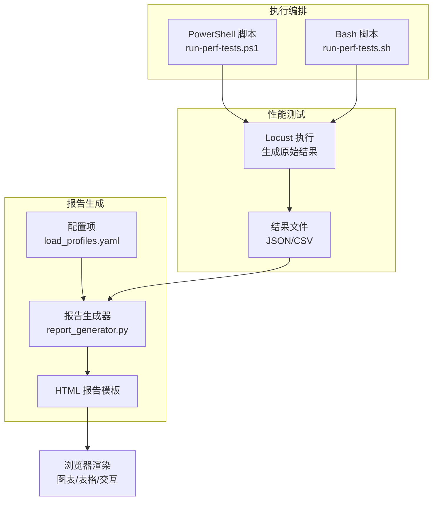
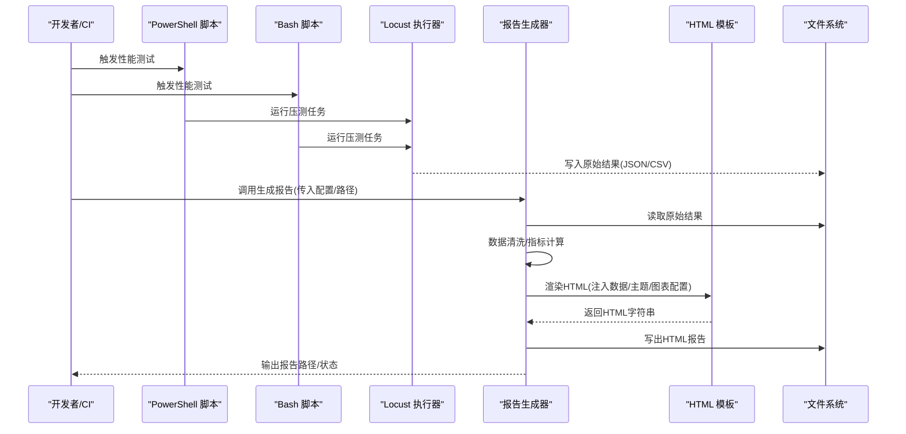
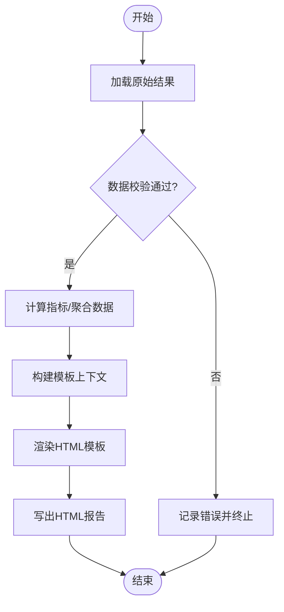
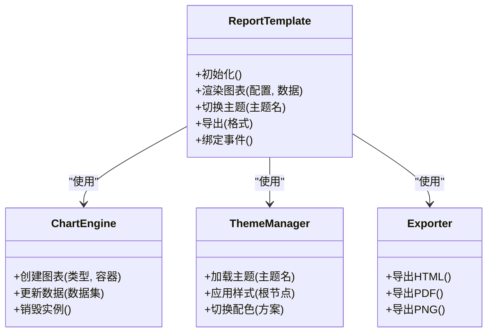
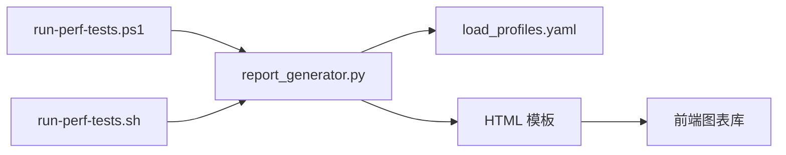

# 报告生成器

<cite>
**本文引用的文件**   
- [report_generator.py](file://tests/performance/locust/utils/report_generator.py)
- [run-perf-tests.ps1](file://scripts/run-perf-tests.ps1)
- [run-perf-tests.sh](file://scripts/run-perf-tests.sh)
- [load_profiles.yaml](file://tests/performance/locust/config/load_profiles.yaml)
- [README.md](file://tests/performance/locust/README.md)
</cite>

## 目录
1. [简介](#简介)
2. [项目结构](#项目结构)
3. [核心组件](#核心组件)
4. [架构总览](#架构总览)
5. [详细组件分析](#详细组件分析)
6. [依赖关系分析](#依赖关系分析)
7. [性能考量](#性能考量)
8. [故障排查指南](#故障排查指南)
9. [结论](#结论)
10. [附录](#附录)

## 简介
本技术文档面向“性能测试报告生成器”，聚焦于从原始测试结果到最终HTML报告的完整流程，深入解析HTML报告模板的设计与实现、图表渲染技术、数据可视化组件与响应式布局策略；同时覆盖报告配置项（主题定制、图表类型选择、导出格式支持）、模板自定义指南（CSS样式修改与JavaScript交互增强），以及错误处理与日志记录机制。读者可据此快速理解系统工作原理并高效扩展能力。

## 项目结构
与报告生成相关的代码主要位于以下位置：
- 报告生成逻辑：tests/performance/locust/utils/report_generator.py
- 性能测试执行脚本（触发报告生成）：scripts/run-perf-tests.ps1、scripts/run-perf-tests.sh
- 负载配置文件（影响报告维度与指标）：tests/performance/locust/config/load_profiles.yaml
- Locust使用说明与输出约定：tests/performance/locust/README.md

图示来源
- [report_generator.py](file://tests/performance/locust/utils/report_generator.py)
- [run-perf-tests.ps1](file://scripts/run-perf-tests.ps1)
- [run-perf-tests.sh](file://scripts/run-perf-tests.sh)
- [load_profiles.yaml](file://tests/performance/locust/config/load_profiles.yaml)
- [README.md](file://tests/performance/locust/README.md)

章节来源
- [report_generator.py](file://tests/performance/locust/utils/report_generator.py)
- [run-perf-tests.ps1](file://scripts/run-perf-tests.ps1)
- [run-perf-tests.sh](file://scripts/run-perf-tests.sh)
- [load_profiles.yaml](file://tests/performance/locust/config/load_profiles.yaml)
- [README.md](file://tests/performance/locust/README.md)

## 核心组件
- 报告生成器模块
  - 负责读取原始测试结果（如JSON/CSV），聚合关键指标（吞吐、延迟分布、错误率等），驱动HTML模板渲染，输出最终报告文件。
  - 典型职责包括：数据加载与校验、指标计算、模板上下文构建、静态资源注入、异常捕获与日志记录。
- HTML报告模板
  - 提供页面骨架、图表容器、表格区域与交互控件；通过引入前端库完成图表渲染与响应式布局。
- 配置管理
  - 通过YAML或环境变量控制主题、图表类型、导出格式、输出路径等。
- 执行编排脚本
  - 在CI/本地环境中启动性能测试、收集结果、调用报告生成器并归档产物。

章节来源
- [report_generator.py](file://tests/performance/locust/utils/report_generator.py)
- [load_profiles.yaml](file://tests/performance/locust/config/load_profiles.yaml)
- [run-perf-tests.ps1](file://scripts/run-perf-tests.ps1)
- [run-perf-tests.sh](file://scripts/run-perf-tests.sh)

## 架构总览
整体流程遵循“数据采集 → 数据处理 → 模板渲染 → 产物输出”的流水线模式。

图示来源
- [run-perf-tests.ps1](file://scripts/run-perf-tests.ps1)
- [run-perf-tests.sh](file://scripts/run-perf-tests.sh)
- [report_generator.py](file://tests/performance/locust/utils/report_generator.py)
- [README.md](file://tests/performance/locust/README.md)

## 详细组件分析

### 报告生成器（Python）
- 输入
  - 原始结果文件路径（JSON/CSV）
  - 配置对象（主题、图表类型、导出格式、输出目录等）
- 处理
  - 数据加载与校验：检查字段完整性、时间范围、单位一致性
  - 指标计算：P95/P99延迟、吞吐、错误率、并发曲线等
  - 模板上下文：将结构化数据与图表配置注入模板变量
  - 资源注入：按需内联或外链CSS/JS，确保离线可读性
- 输出
  - HTML报告文件（可选附带PDF/图片导出）
  - 日志与诊断信息（失败原因、警告、统计摘要）

图示来源
- [report_generator.py](file://tests/performance/locust/utils/report_generator.py)

章节来源
- [report_generator.py](file://tests/performance/locust/utils/report_generator.py)

### HTML报告模板（前端）
- 布局与响应式
  - 采用流式网格/弹性布局，适配桌面与移动端；图表容器具备自适应宽高。
- 图表渲染
  - 使用轻量级图表库进行折线、柱状、饼图、热力图等展示；支持缩放、筛选、联动。
- 交互增强
  - 提供主题切换、图表类型切换、时间窗口选择、导出按钮等交互入口。
- 可访问性与国际化
  - 语义化标签、键盘导航、多语言文案占位符。

图示来源
- [report_generator.py](file://tests/performance/locust/utils/report_generator.py)

章节来源
- [report_generator.py](file://tests/performance/locust/utils/report_generator.py)

### 配置管理（YAML/环境变量）
- 主题定制
  - 主色、背景、字体、暗色/亮色模式开关
- 图表类型选择
  - 默认图表类型、按指标映射图表、是否启用组合图
- 导出格式支持
  - HTML、PDF、PNG/SVG截图
- 输出与路径
  - 报告输出目录、文件名模板、是否压缩资源
- 示例键空间（概念说明）
  - theme.primary_color、theme.mode、charts.default_type、export.formats、output.dir、output.filename_template

章节来源
- [load_profiles.yaml](file://tests/performance/locust/config/load_profiles.yaml)

### 执行编排脚本（PowerShell/Bash）
- 功能
  - 设置环境、启动Locust、等待完成、收集结果、调用报告生成器、归档产物
- 参数
  - 目标URL、并发数、持续时间、结果目录、报告输出目录、是否生成PDF等
- 错误处理
  - 捕获非零退出码、记录日志、保留中间产物以便排障

章节来源
- [run-perf-tests.ps1](file://scripts/run-perf-tests.ps1)
- [run-perf-tests.sh](file://scripts/run-perf-tests.sh)

## 依赖关系分析
- 内部依赖
  - 报告生成器依赖HTML模板与配置；编排脚本依赖报告生成器与Locust结果约定
- 外部依赖
  - Python标准库/第三方库（用于JSON/CSV解析、模板引擎、PDF导出等）
  - 前端图表库（CDN或内联）
- 耦合与内聚
  - 报告生成器与模板解耦（通过上下文数据传递）；配置与渲染分离，便于扩展主题与图表类型

图示来源
- [run-perf-tests.ps1](file://scripts/run-perf-tests.ps1)
- [run-perf-tests.sh](file://scripts/run-perf-tests.sh)
- [report_generator.py](file://tests/performance/locust/utils/report_generator.py)
- [load_profiles.yaml](file://tests/performance/locust/config/load_profiles.yaml)

章节来源
- [run-perf-tests.ps1](file://scripts/run-perf-tests.ps1)
- [run-perf-tests.sh](file://scripts/run-perf-tests.sh)
- [report_generator.py](file://tests/performance/locust/utils/report_generator.py)
- [load_profiles.yaml](file://tests/performance/locust/config/load_profiles.yaml)

## 性能考量
- 大数据量渲染
  - 分页/抽样显示、增量更新、虚拟滚动
- 内存占用
  - 流式读取大文件、避免一次性加载全部数据
- 网络与离线
  - 优先内联关键CSS/JS，减少对外部CDN依赖
- 导出性能
  - PDF/图片导出异步化，限制分辨率与裁剪区域

[本节为通用指导，不直接分析具体文件]

## 故障排查指南
- 常见问题
  - 原始结果缺失或格式不符：检查Locust输出路径与命名约定
  - 模板渲染失败：确认模板变量齐全、资源路径正确
  - 图表空白：检查数据源字段与图表配置映射
  - 导出失败：确认依赖库安装与环境权限
- 日志定位
  - 查看生成器日志中的错误堆栈与警告
  - 核对脚本输出的阶段标记与耗时
- 建议步骤
  - 缩小数据规模复现问题
  - 关闭非必要图表类型以定位瓶颈
  - 启用调试模式输出更详细的上下文

章节来源
- [report_generator.py](file://tests/performance/locust/utils/report_generator.py)
- [run-perf-tests.ps1](file://scripts/run-perf-tests.ps1)
- [run-perf-tests.sh](file://scripts/run-perf-tests.sh)

## 结论
本报告生成器围绕“数据→模板→渲染→导出”的主线设计，具备良好的可扩展性与可维护性。通过配置化管理主题与图表类型、结合响应式布局与交互增强，能够稳定产出高质量的性能测试HTML报告。建议在后续迭代中持续优化大数据渲染与导出性能，完善错误诊断与用户引导。

[本节为总结性内容，不直接分析具体文件]

## 附录
- 术语
  - 原始结果：Locust生成的JSON/CSV等结构化数据
  - 模板上下文：由生成器组装、供模板渲染的数据与配置集合
  - 导出：将报告转换为PDF/图片等格式的附加能力
- 参考
  - 性能测试说明与输出约定参见README

章节来源
- [README.md](file://tests/performance/locust/README.md)