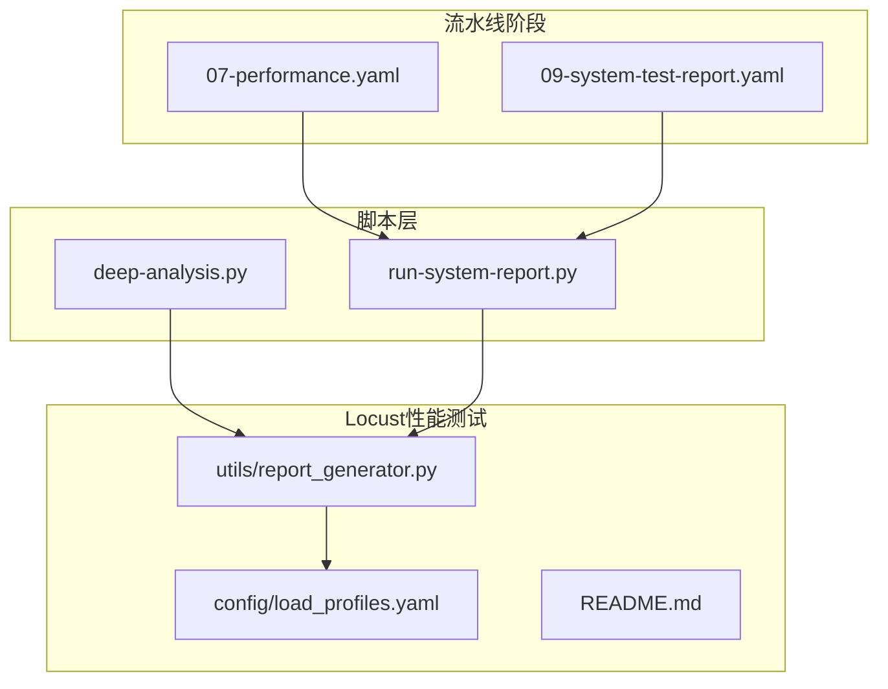
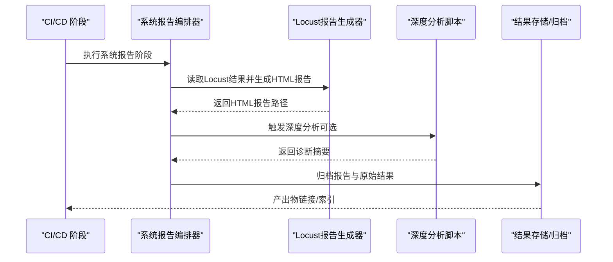
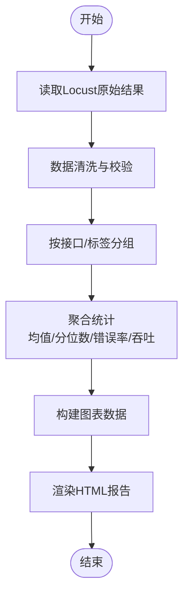
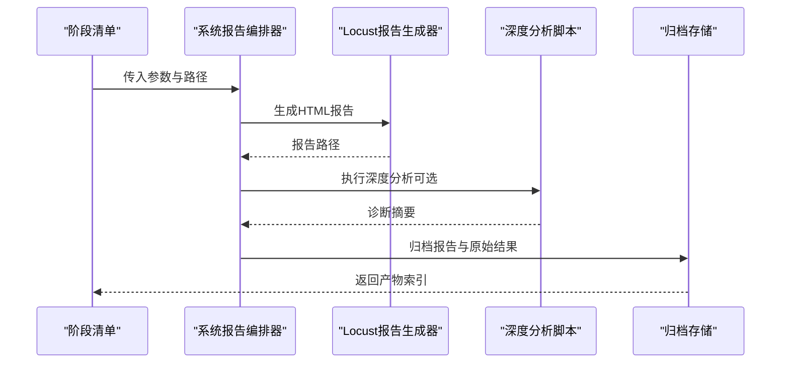
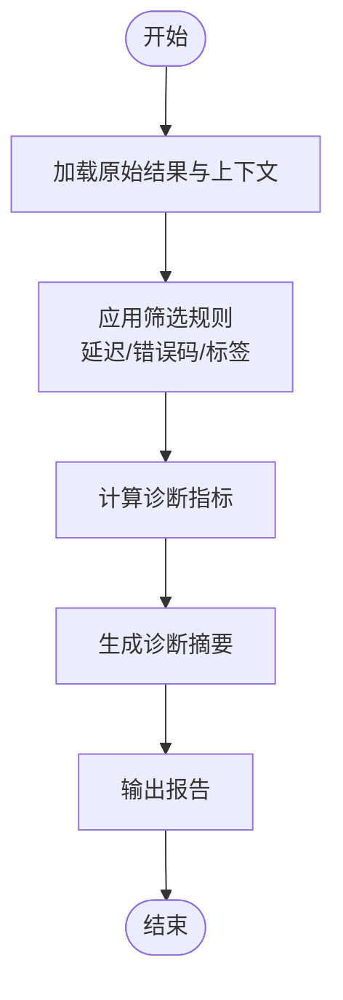
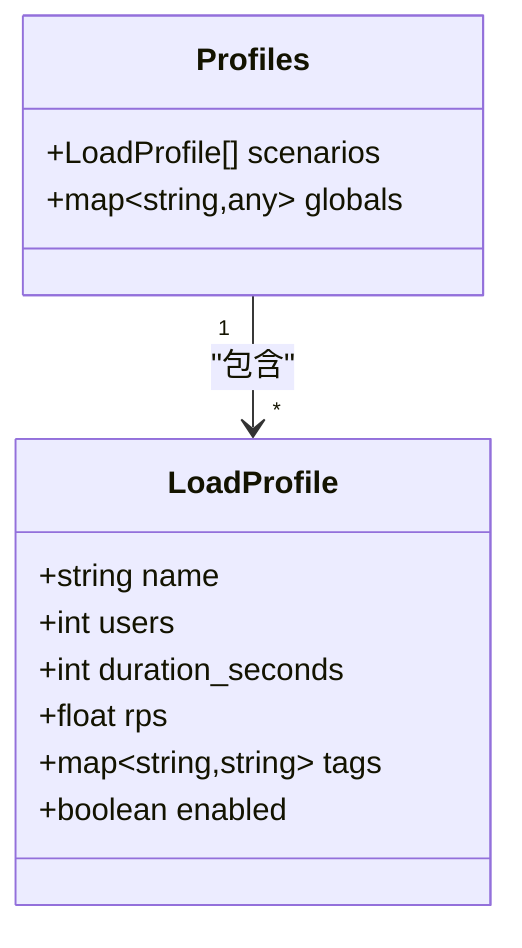
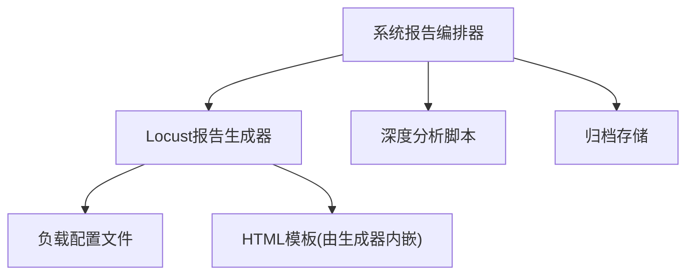

# 测试报告与分析

<cite>
**本文引用的文件**   
- [scripts/deep-analysis.py](file://scripts/deep-analysis.py)
- [scripts/run-system-report.py](file://scripts/run-system-report.py)
- [tests/performance/locust/utils/report_generator.py](file://tests/performance/locust/utils/report_generator.py)
- [tests/performance/locust/config/load_profiles.yaml](file://tests/performance/locust/config/load_profiles.yaml)
- [tests/performance/locust/README.md](file://tests/performance/locust/README.md)
- [stage-manifests/07-performance.yaml](file://stage-manifests/07-performance.yaml)
- [stage-manifests/09-system-test-report.yaml](file://stage-manifests/09-system-test-report.yaml)
</cite>

## 目录
1. [简介](#简介)
2. [项目结构](#项目结构)
3. [核心组件](#核心组件)
4. [架构总览](#架构总览)
5. [详细组件分析](#详细组件分析)
6. [依赖关系分析](#依赖关系分析)
7. [性能考量](#性能考量)
8. [故障排查指南](#故障排查指南)
9. [结论](#结论)
10. [附录](#附录)

## 简介
本技术文档面向“性能测试结果报告和深度分析系统”，聚焦以下目标：
- 解释报告生成器的实现原理，包括HTML报告模板、数据聚合算法与图表渲染技术。
- 说明关键性能指标的解读方法，如P95/P99响应时间、吞吐量瓶颈与资源利用率分析。
- 文档化测试结果的数据存储与管理策略，包括历史数据归档与版本对比。
- 提供性能瓶颈的诊断与分析工具，涵盖慢请求识别、内存泄漏检测与CPU使用率分析。
- 给出自动化报告分发与集成到CI/CD流水线的方案。

## 项目结构
与“测试报告与分析”直接相关的代码与配置主要分布在如下位置：
- 脚本层：用于执行系统级报告与深度分析的Python脚本。
- Locust性能测试子工程：包含负载模型、结果输出与报告生成工具。
- 阶段清单：定义性能测试与系统报告产出的流水线阶段。

图示来源
- [scripts/deep-analysis.py](file://scripts/deep-analysis.py)
- [scripts/run-system-report.py](file://scripts/run-system-report.py)
- [tests/performance/locust/utils/report_generator.py](file://tests/performance/locust/utils/report_generator.py)
- [tests/performance/locust/config/load_profiles.yaml](file://tests/performance/locust/config/load_profiles.yaml)
- [tests/performance/locust/README.md](file://tests/performance/locust/README.md)
- [stage-manifests/07-performance.yaml](file://stage-manifests/07-performance.yaml)
- [stage-manifests/09-system-test-report.yaml](file://stage-manifests/09-system-test-report.yaml)

章节来源
- [scripts/deep-analysis.py](file://scripts/deep-analysis.py)
- [scripts/run-system-report.py](file://scripts/run-system-report.py)
- [tests/performance/locust/utils/report_generator.py](file://tests/performance/locust/utils/report_generator.py)
- [tests/performance/locust/config/load_profiles.yaml](file://tests/performance/locust/config/load_profiles.yaml)
- [tests/performance/locust/README.md](file://tests/performance/locust/README.md)
- [stage-manifests/07-performance.yaml](file://stage-manifests/07-performance.yaml)
- [stage-manifests/09-system-test-report.yaml](file://stage-manifests/09-system-test-report.yaml)

## 核心组件
- 报告生成器（Locust）：负责从Locust运行结果中抽取指标、聚合统计并渲染为HTML报告。
- 系统报告编排器：统一调度性能测试与报告产出，协调输入输出路径与产物归档。
- 深度分析脚本：对原始结果进行二次加工，输出更细粒度的诊断信息（如慢请求、热点接口等）。
- 负载配置文件：描述不同场景的并发、持续时间与RPS等参数，驱动多轮性能测试。
- 流水线阶段清单：将性能测试与报告生成纳入可重复执行的阶段任务。

章节来源
- [tests/performance/locust/utils/report_generator.py](file://tests/performance/locust/utils/report_generator.py)
- [scripts/run-system-report.py](file://scripts/run-system-report.py)
- [scripts/deep-analysis.py](file://scripts/deep-analysis.py)
- [tests/performance/locust/config/load_profiles.yaml](file://tests/performance/locust/config/load_profiles.yaml)
- [stage-manifests/07-performance.yaml](file://stage-manifests/07-performance.yaml)
- [stage-manifests/09-system-test-report.yaml](file://stage-manifests/09-system-test-report.yaml)

## 架构总览
整体流程由“阶段清单”触发，调用“系统报告编排器”，后者驱动“Locust报告生成器”完成指标聚合与HTML渲染；同时“深度分析脚本”可对原始结果进行再处理，形成诊断报告。

图示来源
- [scripts/run-system-report.py](file://scripts/run-system-report.py)
- [tests/performance/locust/utils/report_generator.py](file://tests/performance/locust/utils/report_generator.py)
- [scripts/deep-analysis.py](file://scripts/deep-analysis.py)
- [stage-manifests/09-system-test-report.yaml](file://stage-manifests/09-system-test-report.yaml)

## 详细组件分析

### 报告生成器（Locust HTML报告）
- 职责
  - 解析Locust运行产生的原始结果（如CSV/JSON），按接口维度聚合指标。
  - 计算关键统计量（平均、分位数、错误率、吞吐等），生成可视化图表。
  - 基于HTML模板渲染最终报告，便于在浏览器中查看与分享。
- 关键流程
  - 输入：Locust结果文件路径、输出目录、过滤条件（如按接口名或标签）。
  - 处理：数据清洗→分组聚合→分位数计算→图表数据准备。
  - 输出：HTML报告文件、图表数据源（供前端渲染）。
- 图表渲染技术
  - 通常采用轻量级前端库（如Chart.js/ECharts）在HTML中嵌入图表数据，避免后端重绘开销。
- 扩展点
  - 自定义模板：替换样式与布局。
  - 自定义指标：增加业务相关KPI（如成功率阈值告警、预算消耗等）。

图示来源
- [tests/performance/locust/utils/report_generator.py](file://tests/performance/locust/utils/report_generator.py)

章节来源
- [tests/performance/locust/utils/report_generator.py](file://tests/performance/locust/utils/report_generator.py)
- [tests/performance/locust/README.md](file://tests/performance/locust/README.md)

### 系统报告编排器
- 职责
  - 统一入口：接收阶段任务参数，定位输入结果与输出目录。
  - 协调：调用报告生成器与深度分析脚本，管理产物生命周期。
  - 归档：将HTML报告与原始结果打包归档，记录元数据以便追溯。
- 典型步骤
  - 解析阶段清单中的参数与环境变量。
  - 校验输入结果存在性与完整性。
  - 执行报告生成与深度分析。
  - 生成索引文件（含报告链接、时间戳、版本信息等）。
  - 归档至指定存储（本地目录或对象存储）。

图示来源
- [scripts/run-system-report.py](file://scripts/run-system-report.py)
- [stage-manifests/09-system-test-report.yaml](file://stage-manifests/09-system-test-report.yaml)

章节来源
- [scripts/run-system-report.py](file://scripts/run-system-report.py)
- [stage-manifests/09-system-test-report.yaml](file://stage-manifests/09-system-test-report.yaml)

### 深度分析脚本
- 职责
  - 对原始结果进行二次加工，输出更细粒度的诊断信息。
  - 常见能力：慢请求识别、热点接口排序、错误分布、趋势对比。
- 典型流程
  - 加载原始结果与必要的上下文（如负载配置、环境信息）。
  - 应用筛选规则（如延迟阈值、错误码范围）。
  - 计算诊断指标并生成结构化摘要。
  - 输出文本/JSON报告，便于后续展示或入库。

图示来源
- [scripts/deep-analysis.py](file://scripts/deep-analysis.py)

章节来源
- [scripts/deep-analysis.py](file://scripts/deep-analysis.py)

### 负载配置文件
- 作用
  - 定义不同性能场景的参数集（如并发用户数、持续时间、RPS、预热时长等）。
  - 支持多场景切换与批量执行，便于回归与基线对比。
- 建议结构
  - 场景列表：每个场景包含名称、参数、期望阈值与备注。
  - 全局设置：默认超时、重试策略、日志级别等。

图示来源
- [tests/performance/locust/config/load_profiles.yaml](file://tests/performance/locust/config/load_profiles.yaml)

章节来源
- [tests/performance/locust/config/load_profiles.yaml](file://tests/performance/locust/config/load_profiles.yaml)

### 流水线阶段清单
- 性能阶段
  - 定义性能测试的执行方式、输入参数与产物路径。
- 系统报告阶段
  - 定义报告生成与归档流程，确保每次运行都可重现与追溯。

图示来源
- [stage-manifests/07-performance.yaml](file://stage-manifests/07-performance.yaml)
- [stage-manifests/09-system-test-report.yaml](file://stage-manifests/09-system-test-report.yaml)

章节来源
- [stage-manifests/07-performance.yaml](file://stage-manifests/07-performance.yaml)
- [stage-manifests/09-system-test-report.yaml](file://stage-manifests/09-system-test-report.yaml)

## 依赖关系分析
- 组件耦合
  - 系统报告编排器依赖报告生成器与深度分析脚本，二者通过约定好的输入输出路径交互。
  - 报告生成器依赖负载配置文件以理解场景语义与过滤条件。
- 外部依赖
  - 报告渲染可能依赖前端图表库（由HTML模板引入）。
  - 归档可能依赖文件系统或对象存储SDK。
- 潜在循环依赖
  - 当前设计为单向调用链，未见循环依赖迹象。

图示来源
- [scripts/run-system-report.py](file://scripts/run-system-report.py)
- [tests/performance/locust/utils/report_generator.py](file://tests/performance/locust/utils/report_generator.py)
- [scripts/deep-analysis.py](file://scripts/deep-analysis.py)
- [tests/performance/locust/config/load_profiles.yaml](file://tests/performance/locust/config/load_profiles.yaml)

章节来源
- [scripts/run-system-report.py](file://scripts/run-system-report.py)
- [tests/performance/locust/utils/report_generator.py](file://tests/performance/locust/utils/report_generator.py)
- [scripts/deep-analysis.py](file://scripts/deep-analysis.py)
- [tests/performance/locust/config/load_profiles.yaml](file://tests/performance/locust/config/load_profiles.yaml)

## 性能考量
- 指标解读
  - P95/P99响应时间：反映长尾延迟，适合评估用户体验稳定性。
  - 吞吐量瓶颈：关注QPS/RPS峰值与平台限制（CPU/IO/网络）的关系。
  - 资源利用率：结合CPU、内存、磁盘I/O与网络带宽，定位系统上限。
- 优化建议
  - 针对慢请求：优先优化数据库查询、缓存命中率与外部依赖超时策略。
  - 针对吞吐瓶颈：水平扩容、连接池调优、批处理与异步化。
  - 针对资源瓶颈：容量规划、GC调优、限流与降级策略。

[本节为通用指导，不直接分析具体文件]

## 故障排查指南
- 常见问题
  - 报告缺失：检查原始结果路径与权限，确认报告生成器是否成功执行。
  - 指标异常：核对负载配置与实际运行参数一致性，验证数据清洗逻辑。
  - 归档失败：检查归档路径可用性与存储空间。
- 诊断手段
  - 慢请求识别：通过深度分析脚本输出Top-N慢请求与错误分布。
  - 内存泄漏检测：结合运行时监控（如进程RSS/GC日志）与长期趋势对比。
  - CPU使用率分析：关联高延迟接口的CPU热点与线程栈信息。

章节来源
- [scripts/deep-analysis.py](file://scripts/deep-analysis.py)
- [scripts/run-system-report.py](file://scripts/run-system-report.py)

## 结论
本系统围绕“报告生成—深度分析—归档索引”的主线，形成了可复用的性能测试报告与分析闭环。通过清晰的组件边界与约定式输入输出，既保证了可维护性，也为后续扩展（如更多图表类型、更多诊断维度）预留了空间。建议在CI/CD中固化阶段任务，持续沉淀性能基线与趋势，驱动质量改进。

[本节为总结性内容，不直接分析具体文件]

## 附录
- 快速上手
  - 准备负载配置文件，定义待测场景。
  - 执行系统报告编排器，自动生成HTML报告与归档。
  - 按需运行深度分析脚本，获取诊断摘要。
- 最佳实践
  - 为每次运行保留唯一标识（时间戳+版本号），便于回溯与对比。
  - 将关键阈值写入配置，配合告警机制提升问题发现效率。
  - 定期清理历史结果，仅保留必要版本的归档以控制存储成本。

[本节为补充说明，不直接分析具体文件]