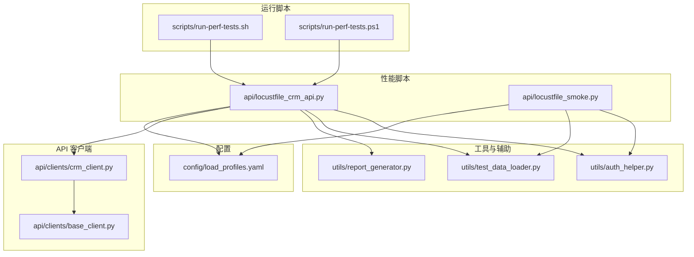
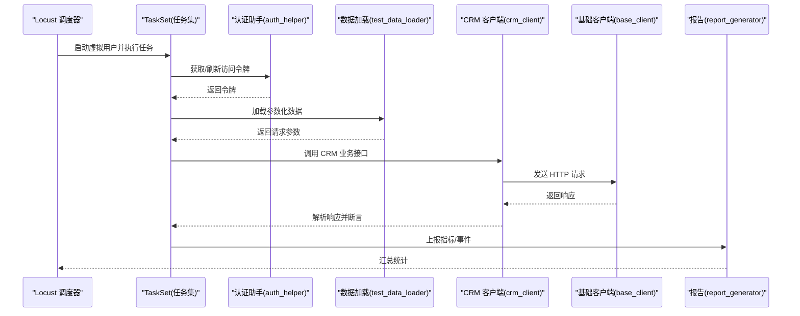
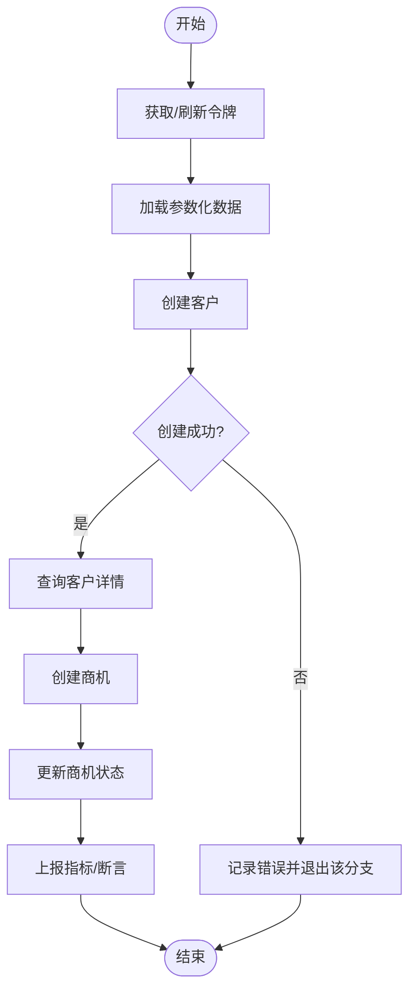
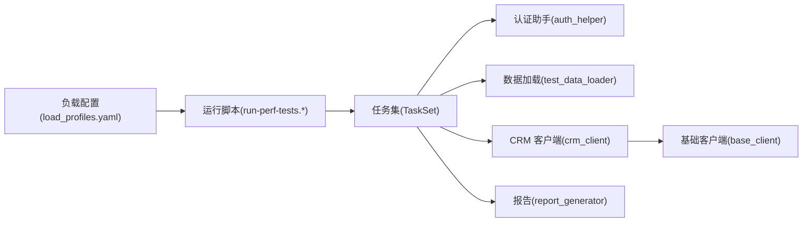

# 任务定义与场景设计

<cite>
**本文引用的文件**   
- [locustfile_crm_api.py](file://tests/performance/locust/api/locustfile_crm_api.py)
- [locustfile_smoke.py](file://tests/performance/locust/api/locustfile_smoke.py)
- [auth_helper.py](file://tests/performance/locust/utils/auth_helper.py)
- [test_data_loader.py](file://tests/performance/locust/utils/test_data_loader.py)
- [report_generator.py](file://tests/performance/locust/utils/report_generator.py)
- [load_profiles.yaml](file://tests/performance/locust/config/load_profiles.yaml)
- [crm_client.py](file://tests/api/clients/crm_client.py)
- [base_client.py](file://tests/api/clients/base_client.py)
- [run-perf-tests.sh](file://scripts/run-perf-tests.sh)
- [run-perf-tests.ps1](file://scripts/run-perf-tests.ps1)
</cite>

## 目录
1. [简介](#简介)
2. [项目结构](#项目结构)
3. [核心组件](#核心组件)
4. [架构总览](#架构总览)
5. [详细组件分析](#详细组件分析)
6. [依赖关系分析](#依赖关系分析)
7. [性能考量](#性能考量)
8. [故障排查指南](#故障排查指南)
9. [结论](#结论)
10. [附录](#附录)

## 简介
本章节聚焦于在 Locust 中为 CRM API 构建性能测试的任务定义与场景设计。内容涵盖：
- TaskSet 的继承与重写、@task 装饰器与权重配置
- 业务场景建模：用户操作流程抽象、请求序列组织、业务逻辑模拟策略
- 复杂业务流程实现：多步骤编排、条件分支、异常模拟
- 客户管理、商机跟踪等核心业务的性能测试场景示例（以路径引用代替代码片段）
- 任务参数化、数据驱动与动态行为生成的最佳实践

## 项目结构
与性能测试相关的核心目录与文件如下：
- 性能脚本入口与场景定义位于 tests/performance/locust/api
- 工具与辅助模块位于 tests/performance/locust/utils
- 压测负载配置文件位于 tests/performance/locust/config
- 运行脚本位于 scripts 目录，提供跨平台执行能力
- API 客户端封装位于 tests/api/clients，供性能脚本复用

图表来源
- [locustfile_crm_api.py](file://tests/performance/locust/api/locustfile_crm_api.py)
- [locustfile_smoke.py](file://tests/performance/locust/api/locustfile_smoke.py)
- [auth_helper.py](file://tests/performance/locust/utils/auth_helper.py)
- [test_data_loader.py](file://tests/performance/locust/utils/test_data_loader.py)
- [report_generator.py](file://tests/performance/locust/utils/report_generator.py)
- [load_profiles.yaml](file://tests/performance/locust/config/load_profiles.yaml)
- [crm_client.py](file://tests/api/clients/crm_client.py)
- [base_client.py](file://tests/api/clients/base_client.py)
- [run-perf-tests.sh](file://scripts/run-perf-tests.sh)
- [run-perf-tests.ps1](file://scripts/run-perf-tests.ps1)

章节来源
- [locustfile_crm_api.py](file://tests/performance/locust/api/locustfile_crm_api.py)
- [locustfile_smoke.py](file://tests/performance/locust/api/locustfile_smoke.py)
- [auth_helper.py](file://tests/performance/locust/utils/auth_helper.py)
- [test_data_loader.py](file://tests/performance/locust/utils/test_data_loader.py)
- [report_generator.py](file://tests/performance/locust/utils/report_generator.py)
- [load_profiles.yaml](file://tests/performance/locust/config/load_profiles.yaml)
- [crm_client.py](file://tests/api/clients/crm_client.py)
- [base_client.py](file://tests/api/clients/base_client.py)
- [run-perf-tests.sh](file://scripts/run-perf-tests.sh)
- [run-perf-tests.ps1](file://scripts/run-perf-tests.ps1)

## 核心组件
- 任务集与任务定义
  - 通过继承 TaskSet 定义可复用的任务集，并在其中使用 @task 装饰器声明具体任务方法，支持权重配置以控制任务被调度的概率。
  - 典型用法包括：初始化上下文、构造请求、断言响应、清理资源、记录指标等。
- 认证与鉴权
  - 通过 auth_helper 统一获取并刷新访问令牌，避免在每个任务中重复实现登录流程。
- 数据加载与参数化
  - 通过 test_data_loader 从 YAML/CSV/JSON 等外部数据源读取用例数据，结合随机或顺序策略生成动态请求体。
- 报告与结果处理
  - report_generator 负责汇总统计、生成可视化报表或导出关键指标，便于回归对比与容量评估。
- API 客户端封装
  - base_client 提供通用 HTTP 客户端能力；crm_client 基于 base_client 封装 CRM 领域接口，提升可读性与复用性。

章节来源
- [locustfile_crm_api.py](file://tests/performance/locust/api/locustfile_crm_api.py)
- [locustfile_smoke.py](file://tests/performance/locust/api/locustfile_smoke.py)
- [auth_helper.py](file://tests/performance/locust/utils/auth_helper.py)
- [test_data_loader.py](file://tests/performance/locust/utils/test_data_loader.py)
- [report_generator.py](file://tests/performance/locust/utils/report_generator.py)
- [crm_client.py](file://tests/api/clients/crm_client.py)
- [base_client.py](file://tests/api/clients/base_client.py)

## 架构总览
下图展示了 CRM API 性能测试的整体调用链与职责划分：Locust 调度任务集，任务集调用认证与数据加载工具，再通过 CRM 客户端发起 HTTP 请求，最终由报告组件聚合结果。

图表来源
- [locustfile_crm_api.py](file://tests/performance/locust/api/locustfile_crm_api.py)
- [auth_helper.py](file://tests/performance/locust/utils/auth_helper.py)
- [test_data_loader.py](file://tests/performance/locust/utils/test_data_loader.py)
- [crm_client.py](file://tests/api/clients/crm_client.py)
- [base_client.py](file://tests/api/clients/base_client.py)
- [report_generator.py](file://tests/performance/locust/utils/report_generator.py)

## 详细组件分析

### 任务集与任务定义（TaskSet 与 @task）
- 继承与重写
  - 自定义任务集类继承自 TaskSet，用于封装一组相关操作（如登录、创建客户、查询商机等）。
  - 可在任务集中定义 setup/teardown 生命周期钩子，完成环境准备与资源释放。
- @task 装饰器与权重
  - 使用 @task(weight=N) 指定任务被调度的相对权重，N 越大被选中的概率越高。
  - 可通过组合多个 @task 实现不同业务路径的概率分布，例如“浏览”与“下单”的比例。
- 任务内逻辑
  - 建议将请求构造、断言、指标上报拆分为独立方法，保持单一职责。
  - 对耗时操作进行埋点，便于定位瓶颈。

章节来源
- [locustfile_crm_api.py](file://tests/performance/locust/api/locustfile_crm_api.py)
- [locustfile_smoke.py](file://tests/performance/locust/api/locustfile_smoke.py)

### 认证与鉴权（auth_helper）
- 职责
  - 统一处理登录、令牌获取、过期刷新与重试。
- 集成方式
  - 在任务集的 setup 阶段获取令牌并缓存到上下文，后续请求自动携带。
- 错误处理
  - 捕获网络异常与认证失败，触发重试或降级策略。

章节来源
- [auth_helper.py](file://tests/performance/locust/utils/auth_helper.py)

### 数据加载与参数化（test_data_loader）
- 数据源
  - 支持从 YAML/CSV/JSON 等文件加载测试数据，也可从环境变量注入。
- 参数化策略
  - 顺序读取、随机抽取、轮询、去重等策略可选。
- 动态生成
  - 结合时间戳、随机数、哈希等生成唯一标识，避免幂等冲突。
- 校验与容错
  - 对缺失字段、类型不匹配进行校验与告警，保证稳定性。

章节来源
- [test_data_loader.py](file://tests/performance/locust/utils/test_data_loader.py)

### CRM 客户端封装（crm_client 与 base_client）
- base_client
  - 提供统一的 HTTP 客户端封装，包含连接池、超时、重试、日志与指标上报。
- crm_client
  - 基于 base_client 封装 CRM 领域接口（如客户管理、商机跟踪），对外暴露语义化方法。
- 优势
  - 降低性能脚本与底层实现的耦合，提高可读性与复用性。

章节来源
- [crm_client.py](file://tests/api/clients/crm_client.py)
- [base_client.py](file://tests/api/clients/base_client.py)

### 报告与结果处理（report_generator）
- 功能
  - 汇总成功/失败次数、延迟分位、吞吐、错误码分布等指标。
  - 输出结构化报表，便于 CI/CD 集成与趋势分析。
- 扩展
  - 可对接外部监控系统或导出 CSV/HTML 报告。

章节来源
- [report_generator.py](file://tests/performance/locust/utils/report_generator.py)

### 负载配置（load_profiles.yaml）
- 用途
  - 定义不同阶段的并发用户数、爬坡曲线、持续时间等负载模型。
- 使用方式
  - 在运行脚本中传入 profile 名称或路径，按需切换压测策略。

章节来源
- [load_profiles.yaml](file://tests/performance/locust/config/load_profiles.yaml)

### 运行脚本（run-perf-tests.sh / run-perf-tests.ps1）
- 作用
  - 封装 Locust 启动命令，统一环境变量、profile 选择、结果输出路径等。
- 跨平台
  - 提供 Shell 与 PowerShell 版本，适配 Linux/macOS 与 Windows。

章节来源
- [run-perf-tests.sh](file://scripts/run-perf-tests.sh)
- [run-perf-tests.ps1](file://scripts/run-perf-tests.ps1)

### 场景建模与复杂流程编排

#### 用户操作流程抽象
- 分层建模
  - 原子操作：单个 API 调用（如创建客户、更新商机）。
  - 业务流程：由若干原子操作组成的端到端流程（如线索转商机）。
  - 场景：多个业务流程按权重组合，模拟真实用户行为分布。
- 状态管理
  - 在任务集上下文中维护会话状态（如当前客户 ID、商机 ID），确保后续请求可用。

#### 请求序列的组织方式
- 顺序编排
  - 使用串行调用保证前置依赖满足后再发起后续请求。
- 并行编排
  - 对无依赖的请求采用并发执行，缩短整体时延。
- 循环与节流
  - 对高频读操作进行限流与退避，避免雪崩。

#### 业务逻辑的模拟策略
- 正常路径
  - 覆盖主流程与常见分支，验证系统在高负载下的正确性。
- 异常路径
  - 模拟网络抖动、服务端错误、参数非法等，观察系统恢复能力。
- 条件分支
  - 根据上游响应或数据状态决定下一步动作，贴近真实业务。

#### 复杂业务流程实现要点
- 多步骤编排
  - 将长流程拆分为小步骤，每步具备独立断言与错误处理。
- 条件分支处理
  - 基于响应码、关键字段或阈值判断走不同分支。
- 异常情况模拟
  - 注入超时、丢包、脏数据，验证系统的健壮性与降级策略。

图表来源
- [locustfile_crm_api.py](file://tests/performance/locust/api/locustfile_crm_api.py)
- [auth_helper.py](file://tests/performance/locust/utils/auth_helper.py)
- [test_data_loader.py](file://tests/performance/locust/utils/test_data_loader.py)
- [crm_client.py](file://tests/api/clients/crm_client.py)

### 核心业务场景示例（路径引用）
- 客户管理
  - 参考路径：[locustfile_crm_api.py](file://tests/performance/locust/api/locustfile_crm_api.py)
  - 说明：包含创建、查询、更新、删除客户的任务集与权重配置，以及数据参数化与断言。
- 商机跟踪
  - 参考路径：[locustfile_crm_api.py](file://tests/performance/locust/api/locustfile_crm_api.py)
  - 说明：围绕线索到商机的转化、状态流转、关联客户与联系人等流程编排。
- 冒烟场景
  - 参考路径：[locustfile_smoke.py](file://tests/performance/locust/api/locustfile_smoke.py)
  - 说明：轻量级快速验证，覆盖关键路径的最小集合。

章节来源
- [locustfile_crm_api.py](file://tests/performance/locust/api/locustfile_crm_api.py)
- [locustfile_smoke.py](file://tests/performance/locust/api/locustfile_smoke.py)

### 任务参数化、数据驱动与动态行为生成最佳实践
- 参数化
  - 使用 test_data_loader 统一加载数据，避免硬编码；为每个任务提供最小必要字段。
- 数据驱动
  - 将用例数据与执行逻辑解耦，便于回归与扩展；支持多数据集并行执行。
- 动态行为生成
  - 引入随机与时间戳生成唯一值；对敏感信息脱敏；对边界值与异常值进行覆盖。
- 幂等与去重
  - 对写操作增加幂等键，避免重复提交导致的数据污染。
- 指标与可观测性
  - 在关键路径上报自定义指标，结合报告组件形成闭环。

章节来源
- [test_data_loader.py](file://tests/performance/locust/utils/test_data_loader.py)
- [report_generator.py](file://tests/performance/locust/utils/report_generator.py)

## 依赖关系分析
- 组件耦合
  - 任务集依赖认证与数据加载工具，并通过 CRM 客户端访问后端服务。
  - CRM 客户端依赖基础客户端，屏蔽底层细节。
- 外部依赖
  - 配置文件 load_profiles.yaml 影响负载模型；运行脚本统一入口。
- 潜在风险
  - 避免在任务中直接耦合网络实现；尽量通过客户端抽象层访问。
  - 谨慎使用全局状态，优先使用任务集上下文传递数据。

图表来源
- [locustfile_crm_api.py](file://tests/performance/locust/api/locustfile_crm_api.py)
- [auth_helper.py](file://tests/performance/locust/utils/auth_helper.py)
- [test_data_loader.py](file://tests/performance/locust/utils/test_data_loader.py)
- [crm_client.py](file://tests/api/clients/crm_client.py)
- [base_client.py](file://tests/api/clients/base_client.py)
- [report_generator.py](file://tests/performance/locust/utils/report_generator.py)
- [load_profiles.yaml](file://tests/performance/locust/config/load_profiles.yaml)
- [run-perf-tests.sh](file://scripts/run-perf-tests.sh)
- [run-perf-tests.ps1](file://scripts/run-perf-tests.ps1)

章节来源
- [locustfile_crm_api.py](file://tests/performance/locust/api/locustfile_crm_api.py)
- [auth_helper.py](file://tests/performance/locust/utils/auth_helper.py)
- [test_data_loader.py](file://tests/performance/locust/utils/test_data_loader.py)
- [crm_client.py](file://tests/api/clients/crm_client.py)
- [base_client.py](file://tests/api/clients/base_client.py)
- [report_generator.py](file://tests/performance/locust/utils/report_generator.py)
- [load_profiles.yaml](file://tests/performance/locust/config/load_profiles.yaml)
- [run-perf-tests.sh](file://scripts/run-perf-tests.sh)
- [run-perf-tests.ps1](file://scripts/run-perf-tests.ps1)

## 性能考量
- 连接与线程
  - 合理设置连接池大小与超时，避免连接耗尽与阻塞。
- 任务权重与混合场景
  - 通过 @task 权重模拟真实流量比例，关注热点接口。
- 数据预热与缓存
  - 对静态数据预加载，减少运行时开销。
- 指标采集
  - 细化到接口维度，关注 P95/P99 延迟与错误率。
- 资源隔离
  - 压测环境与生产环境隔离，避免相互干扰。

## 故障排查指南
- 常见问题
  - 认证失败：检查令牌有效期与刷新逻辑。
  - 数据不一致：确认数据加载策略与幂等键。
  - 指标缺失：检查指标上报链路是否完整。
- 定位手段
  - 启用更详细的日志；结合报告组件查看错误分布。
  - 缩小范围至单任务或单接口，逐步定位问题。
- 恢复策略
  - 对瞬时错误实施重试与退避；对不可恢复错误快速失败并记录上下文。

章节来源
- [auth_helper.py](file://tests/performance/locust/utils/auth_helper.py)
- [test_data_loader.py](file://tests/performance/locust/utils/test_data_loader.py)
- [report_generator.py](file://tests/performance/locust/utils/report_generator.py)

## 结论
通过将 CRM API 的业务流程抽象为可复用的任务集与客户端封装，并结合参数化数据与权重配置，能够高效构建贴近真实场景的性能测试。配合完善的指标上报与报告机制，可实现持续的性能回归与容量评估。建议在团队内沉淀标准模板与最佳实践，持续提升质量与效率。

## 附录
- 术语
  - 任务集：一组相关操作的集合，继承自 TaskSet。
  - 权重：@task 装饰器的权重参数，控制任务被调度的概率。
  - 参数化：将可变数据与执行逻辑分离，提升复用性。
- 参考路径
  - 客户管理场景：[locustfile_crm_api.py](file://tests/performance/locust/api/locustfile_crm_api.py)
  - 商机跟踪场景：[locustfile_crm_api.py](file://tests/performance/locust/api/locustfile_crm_api.py)
  - 冒烟场景：[locustfile_smoke.py](file://tests/performance/locust/api/locustfile_smoke.py)
  - 认证工具：[auth_helper.py](file://tests/performance/locust/utils/auth_helper.py)
  - 数据加载：[test_data_loader.py](file://tests/performance/locust/utils/test_data_loader.py)
  - 报告工具：[report_generator.py](file://tests/performance/locust/utils/report_generator.py)
  - CRM 客户端：[crm_client.py](file://tests/api/clients/crm_client.py)
  - 基础客户端：[base_client.py](file://tests/api/clients/base_client.py)
  - 负载配置：[load_profiles.yaml](file://tests/performance/locust/config/load_profiles.yaml)
  - 运行脚本：[run-perf-tests.sh](file://scripts/run-perf-tests.sh)、[run-perf-tests.ps1](file://scripts/run-perf-tests.ps1)