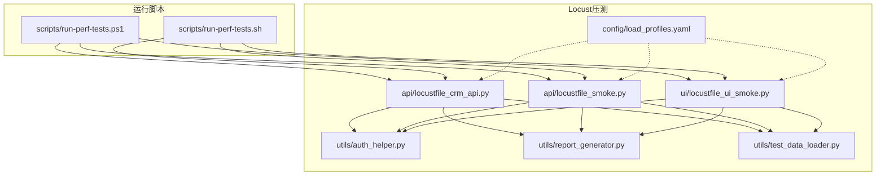
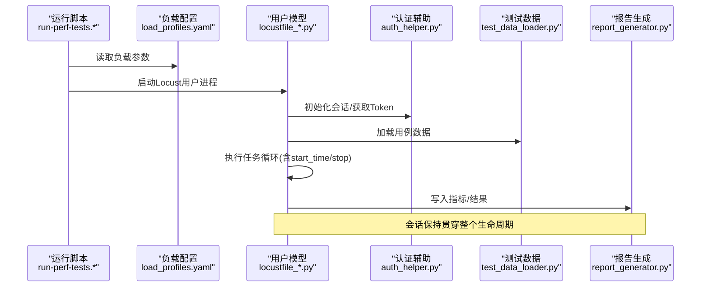
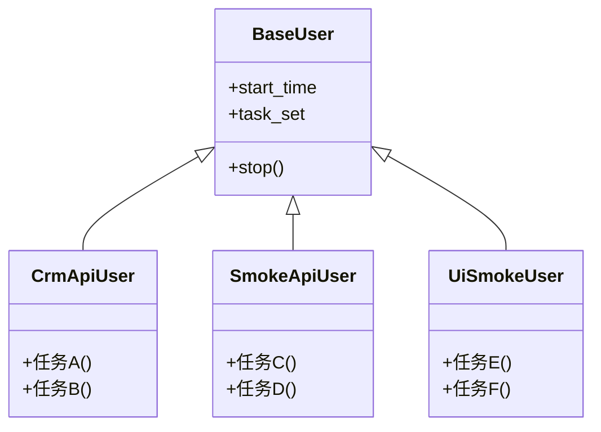
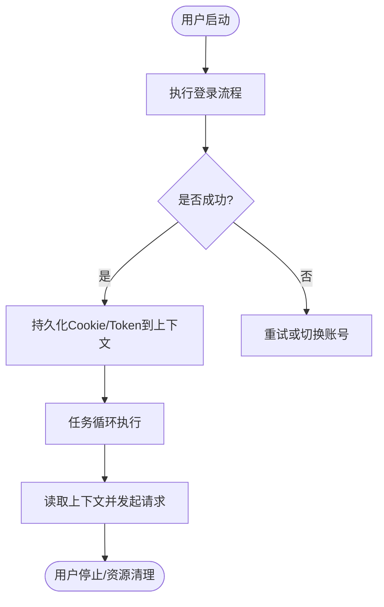
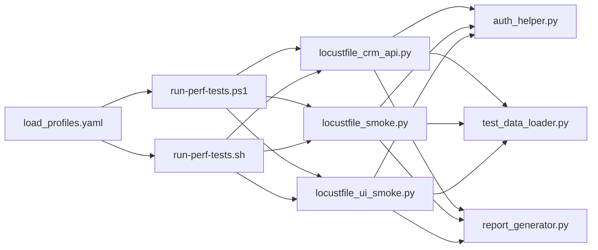

# 并发控制与用户管理

<cite>
**本文引用的文件**   
- [tests/performance/locust/api/locustfile_crm_api.py](file://tests/performance/locust/api/locustfile_crm_api.py)
- [tests/performance/locust/api/locustfile_smoke.py](file://tests/performance/locust/api/locustfile_smoke.py)
- [tests/performance/locust/ui/locustfile_ui_smoke.py](file://tests/performance/locust/ui/locustfile_ui_smoke.py)
- [tests/performance/locust/config/load_profiles.yaml](file://tests/performance/locust/config/load_profiles.yaml)
- [tests/performance/locust/utils/auth_helper.py](file://tests/performance/locust/utils/auth_helper.py)
- [tests/performance/locust/utils/report_generator.py](file://tests/performance/locust/utils/report_generator.py)
- [tests/performance/locust/utils/test_data_loader.py](file://tests/performance/locust/utils/test_data_loader.py)
- [tests/performance/locust/README.md](file://tests/performance/locust/README.md)
- [scripts/run-perf-tests.ps1](file://scripts/run-perf-tests.ps1)
- [scripts/run-perf-tests.sh](file://scripts/run-perf-tests.sh)
</cite>

## 目录
1. [简介](#简介)
2. [项目结构](#项目结构)
3. [核心组件](#核心组件)
4. [架构总览](#架构总览)
5. [详细组件分析](#详细组件分析)
6. [依赖关系分析](#依赖关系分析)
7. [性能考虑](#性能考虑)
8. [故障排查指南](#故障排查指南)
9. [结论](#结论)
10. [附录](#附录)

## 简介
本技术文档聚焦于Locust并发控制与用户管理机制，围绕以下目标展开：
- 并发用户的创建与管理策略：User类继承、start_time与stop方法的自定义实现。
- 用户权重分配机制：不同角色用户的比例设置与行为差异模拟。
- 会话管理与状态保持：Cookie处理、Token传递与用户上下文维护。
- 负载配置文件使用指南：load_profiles.yaml参数调优、用户增长策略与持续时间控制。
- 并发性能优化技巧：连接池管理、请求批处理与资源清理策略。

## 项目结构
本项目在tests/performance/locust目录下组织Locust压测脚本与工具：
- api子目录包含API场景的Locust任务定义。
- ui子目录包含UI场景的Locust任务定义。
- config子目录集中存放负载配置文件（如load_profiles.yaml）。
- utils子目录提供认证辅助、报告生成与测试数据加载等通用能力。
- scripts下提供跨平台的运行脚本以驱动Locust执行。

图表来源
- [tests/performance/locust/api/locustfile_crm_api.py](file://tests/performance/locust/api/locustfile_crm_api.py)
- [tests/performance/locust/api/locustfile_smoke.py](file://tests/performance/locust/api/locustfile_smoke.py)
- [tests/performance/locust/ui/locustfile_ui_smoke.py](file://tests/performance/locust/ui/locustfile_ui_smoke.py)
- [tests/performance/locust/config/load_profiles.yaml](file://tests/performance/locust/config/load_profiles.yaml)
- [tests/performance/locust/utils/auth_helper.py](file://tests/performance/locust/utils/auth_helper.py)
- [tests/performance/locust/utils/report_generator.py](file://tests/performance/locust/utils/report_generator.py)
- [tests/performance/locust/utils/test_data_loader.py](file://tests/performance/locust/utils/test_data_loader.py)
- [scripts/run-perf-tests.ps1](file://scripts/run-perf-tests.ps1)
- [scripts/run-perf-tests.sh](file://scripts/run-perf-tests.sh)

章节来源
- [tests/performance/locust/README.md](file://tests/performance/locust/README.md)

## 核心组件
- 用户模型与任务定义：通过继承Locust的User基类，定义业务任务集与访问模式；支持自定义生命周期方法以控制启动与结束逻辑。
- 认证与会话：封装登录流程、Token获取与注入、Cookie维持，确保后续请求具备有效身份上下文。
- 负载配置：基于YAML描述多阶段负载曲线（用户数、持续时间、增长率），由运行脚本或入口加载并驱动Locust调度。
- 测试数据与报告：从外部数据源加载用例数据，并在压测结束后生成汇总报告。

章节来源
- [tests/performance/locust/api/locustfile_crm_api.py](file://tests/performance/locust/api/locustfile_crm_api.py)
- [tests/performance/locust/api/locustfile_smoke.py](file://tests/performance/locust/api/locustfile_smoke.py)
- [tests/performance/locust/ui/locustfile_ui_smoke.py](file://tests/performance/locust/ui/locustfile_ui_smoke.py)
- [tests/performance/locust/utils/auth_helper.py](file://tests/performance/locust/utils/auth_helper.py)
- [tests/performance/locust/utils/test_data_loader.py](file://tests/performance/locust/utils/test_data_loader.py)
- [tests/performance/locust/utils/report_generator.py](file://tests/performance/locust/utils/report_generator.py)
- [tests/performance/locust/config/load_profiles.yaml](file://tests/performance/locust/config/load_profiles.yaml)

## 架构总览
下图展示了从运行脚本到Locust用户任务的调用链路与关键交互点。

图表来源
- [scripts/run-perf-tests.ps1](file://scripts/run-perf-tests.ps1)
- [scripts/run-perf-tests.sh](file://scripts/run-perf-tests.sh)
- [tests/performance/locust/config/load_profiles.yaml](file://tests/performance/locust/config/load_profiles.yaml)
- [tests/performance/locust/api/locustfile_crm_api.py](file://tests/performance/locust/api/locustfile_crm_api.py)
- [tests/performance/locust/api/locustfile_smoke.py](file://tests/performance/locust/api/locustfile_smoke.py)
- [tests/performance/locust/ui/locustfile_ui_smoke.py](file://tests/performance/locust/ui/locustfile_ui_smoke.py)
- [tests/performance/locust/utils/auth_helper.py](file://tests/performance/locust/utils/auth_helper.py)
- [tests/performance/locust/utils/test_data_loader.py](file://tests/performance/locust/utils/test_data_loader.py)
- [tests/performance/locust/utils/report_generator.py](file://tests/performance/locust/utils/report_generator.py)

## 详细组件分析

### 用户模型与生命周期
- 继承策略：各场景的locustfile通过继承User基类定义任务集合，按业务域划分CRM API、冒烟API与UI场景。
- 生命周期定制：
  - start_time：用于记录用户首次发起请求的时间戳，便于计算首包延迟、冷启动耗时等指标。
  - stop：用于释放资源（关闭连接、清理缓存、上报统计）与收尾工作。
- 权重与比例：通过为不同User子类设置权重，模拟真实流量中不同角色的访问比例（例如管理员、普通用户、只读访客）。

图表来源
- [tests/performance/locust/api/locustfile_crm_api.py](file://tests/performance/locust/api/locustfile_crm_api.py)
- [tests/performance/locust/api/locustfile_smoke.py](file://tests/performance/locust/api/locustfile_smoke.py)
- [tests/performance/locust/ui/locustfile_ui_smoke.py](file://tests/performance/locust/ui/locustfile_ui_smoke.py)

章节来源
- [tests/performance/locust/api/locustfile_crm_api.py](file://tests/performance/locust/api/locustfile_crm_api.py)
- [tests/performance/locust/api/locustfile_smoke.py](file://tests/performance/locust/api/locustfile_smoke.py)
- [tests/performance/locust/ui/locustfile_ui_smoke.py](file://tests/performance/locust/ui/locustfile_ui_smoke.py)

### 用户权重与角色行为差异
- 权重分配：为不同User子类配置权重，使高权重用户在单位时间内被调度更频繁，从而模拟真实业务中的角色分布。
- 行为差异：不同角色可拥有不同的任务集与访问频率，例如管理员更多进行写操作，普通用户以读为主，访客仅浏览。
- 组合策略：结合负载配置的多阶段曲线，可在不同时间段动态调整整体用户规模与角色比例。

章节来源
- [tests/performance/locust/api/locustfile_crm_api.py](file://tests/performance/locust/api/locustfile_crm_api.py)
- [tests/performance/locust/api/locustfile_smoke.py](file://tests/performance/locust/api/locustfile_smoke.py)
- [tests/performance/locust/ui/locustfile_ui_smoke.py](file://tests/performance/locust/ui/locustfile_ui_smoke.py)
- [tests/performance/locust/config/load_profiles.yaml](file://tests/performance/locust/config/load_profiles.yaml)

### 会话管理与状态保持
- Cookie处理：在登录成功后保存服务端返回的Cookie，后续请求自动携带，保证会话连续性。
- Token传递：将鉴权Token注入请求头或查询参数，避免重复登录开销。
- 用户上下文：在User实例级别维护会话信息（如用户ID、租户、权限标签），供任务方法按需读取。

图表来源
- [tests/performance/locust/utils/auth_helper.py](file://tests/performance/locust/utils/auth_helper.py)
- [tests/performance/locust/api/locustfile_crm_api.py](file://tests/performance/locust/api/locustfile_crm_api.py)
- [tests/performance/locust/api/locustfile_smoke.py](file://tests/performance/locust/api/locustfile_smoke.py)
- [tests/performance/locust/ui/locustfile_ui_smoke.py](file://tests/performance/locust/ui/locustfile_ui_smoke.py)

章节来源
- [tests/performance/locust/utils/auth_helper.py](file://tests/performance/locust/utils/auth_helper.py)

### 负载配置文件使用指南
- 参数说明：load_profiles.yaml用于描述多阶段负载曲线，包括每阶段的持续时长、目标并发用户数、增长速率等。
- 用户增长策略：
  - 线性增长：逐步增加并发用户，观察系统响应变化。
  - 阶梯增长：分阶段跃升用户数，模拟突发流量。
  - 混合策略：结合不同阶段的增长方式，贴近真实业务峰值与低谷。
- 持续时间控制：通过配置每阶段持续时间，精确控制压测节奏与总时长。
- 角色比例：在配置中指定不同User类型的权重，驱动不同角色用户的相对数量。

章节来源
- [tests/performance/locust/config/load_profiles.yaml](file://tests/performance/locust/config/load_profiles.yaml)

### 并发性能优化技巧
- 连接池管理：复用HTTP连接，减少握手开销；合理设置最大连接数与空闲超时，避免资源泄露。
- 请求批处理：对可聚合的请求进行批量发送，降低网络往返次数，提高吞吐。
- 资源清理策略：在stop中统一释放连接、关闭文件句柄、清空内存缓存，防止长时压测导致内存泄漏。
- 异步与I/O优化：优先使用非阻塞客户端，避免CPU等待I/O；必要时限制并发度以避免目标端过载。

章节来源
- [tests/performance/locust/api/locustfile_crm_api.py](file://tests/performance/locust/api/locustfile_crm_api.py)
- [tests/performance/locust/api/locustfile_smoke.py](file://tests/performance/locust/api/locustfile_smoke.py)
- [tests/performance/locust/ui/locustfile_ui_smoke.py](file://tests/performance/locust/ui/locustfile_ui_smoke.py)
- [tests/performance/locust/utils/auth_helper.py](file://tests/performance/locust/utils/auth_helper.py)

## 依赖关系分析
- 模块耦合：
  - locustfile_*依赖auth_helper进行认证与会话管理。
  - locustfile_*依赖test_data_loader加载用例数据。
  - locustfile_*依赖report_generator输出结果。
- 外部依赖：
  - load_profiles.yaml作为输入配置，影响用户规模与增长策略。
  - 运行脚本负责解析配置并启动Locust进程。

图表来源
- [tests/performance/locust/config/load_profiles.yaml](file://tests/performance/locust/config/load_profiles.yaml)
- [scripts/run-perf-tests.ps1](file://scripts/run-perf-tests.ps1)
- [scripts/run-perf-tests.sh](file://scripts/run-perf-tests.sh)
- [tests/performance/locust/api/locustfile_crm_api.py](file://tests/performance/locust/api/locustfile_crm_api.py)
- [tests/performance/locust/api/locustfile_smoke.py](file://tests/performance/locust/api/locustfile_smoke.py)
- [tests/performance/locust/ui/locustfile_ui_smoke.py](file://tests/performance/locust/ui/locustfile_ui_smoke.py)
- [tests/performance/locust/utils/auth_helper.py](file://tests/performance/locust/utils/auth_helper.py)
- [tests/performance/locust/utils/test_data_loader.py](file://tests/performance/locust/utils/test_data_loader.py)
- [tests/performance/locust/utils/report_generator.py](file://tests/performance/locust/utils/report_generator.py)

章节来源
- [tests/performance/locust/config/load_profiles.yaml](file://tests/performance/locust/config/load_profiles.yaml)
- [scripts/run-perf-tests.ps1](file://scripts/run-perf-tests.ps1)
- [scripts/run-perf-tests.sh](file://scripts/run-perf-tests.sh)
- [tests/performance/locust/api/locustfile_crm_api.py](file://tests/performance/locust/api/locustfile_crm_api.py)
- [tests/performance/locust/api/locustfile_smoke.py](file://tests/performance/locust/api/locustfile_smoke.py)
- [tests/performance/locust/ui/locustfile_ui_smoke.py](file://tests/performance/locust/ui/locustfile_ui_smoke.py)
- [tests/performance/locust/utils/auth_helper.py](file://tests/performance/locust/utils/auth_helper.py)
- [tests/performance/locust/utils/test_data_loader.py](file://tests/performance/locust/utils/test_data_loader.py)
- [tests/performance/locust/utils/report_generator.py](file://tests/performance/locust/utils/report_generator.py)

## 性能考虑
- 连接复用与池化：减少TCP握手与TLS协商成本，提升吞吐。
- 请求合并与批处理：将多个小请求合并，降低网络开销。
- 资源回收：在stop中确保所有资源释放，避免长时运行导致的内存与句柄泄漏。
- 限流与退避：对下游服务进行保护性限流与重试退避，避免雪崩。
- 监控与观测：采集关键指标（QPS、P95/P99延迟、错误率），定位瓶颈。

[本节为通用指导，不直接分析具体文件]

## 故障排查指南
- 认证失败：检查登录接口返回值与Token格式，确认Cookie/Token是否正确注入到后续请求。
- 会话过期：在任务循环中检测401/403并触发重新登录，刷新上下文。
- 资源泄漏：在stop中打印并验证连接关闭、文件句柄释放情况。
- 数据不一致：核对test_data_loader加载的数据是否与预期一致，避免脏数据影响结果。
- 报告缺失：确认report_generator的输出路径与权限，检查日志定位异常。

章节来源
- [tests/performance/locust/utils/auth_helper.py](file://tests/performance/locust/utils/auth_helper.py)
- [tests/performance/locust/utils/test_data_loader.py](file://tests/performance/locust/utils/test_data_loader.py)
- [tests/performance/locust/utils/report_generator.py](file://tests/performance/locust/utils/report_generator.py)

## 结论
通过合理的User继承与生命周期定制、明确的权重与角色行为设计、健壮的会话与上下文管理、精细化的负载配置以及系统的性能优化策略，可以在Locust中构建稳定、可观测且贴近真实的并发压测方案。建议在生产级压测前进行小规模验证与回归，确保配置与代码变更的可控性与可追溯性。

## 附录
- 运行入口参考：
  - Windows PowerShell脚本：[scripts/run-perf-tests.ps1](file://scripts/run-perf-tests.ps1)
  - Linux/macOS Shell脚本：[scripts/run-perf-tests.sh](file://scripts/run-perf-tests.sh)
- 场景入口参考：
  - CRM API场景：[tests/performance/locust/api/locustfile_crm_api.py](file://tests/performance/locust/api/locustfile_crm_api.py)
  - 冒烟API场景：[tests/performance/locust/api/locustfile_smoke.py](file://tests/performance/locust/api/locustfile_smoke.py)
  - UI冒烟场景：[tests/performance/locust/ui/locustfile_ui_smoke.py](file://tests/performance/locust/ui/locustfile_ui_smoke.py)
- 配置与工具：
  - 负载配置：[tests/performance/locust/config/load_profiles.yaml](file://tests/performance/locust/config/load_profiles.yaml)
  - 认证辅助：[tests/performance/locust/utils/auth_helper.py](file://tests/performance/locust/utils/auth_helper.py)
  - 测试数据加载：[tests/performance/locust/utils/test_data_loader.py](file://tests/performance/locust/utils/test_data_loader.py)
  - 报告生成：[tests/performance/locust/utils/report_generator.py](file://tests/performance/locust/utils/report_generator.py)
  - 使用说明：[tests/performance/locust/README.md](file://tests/performance/locust/README.md)