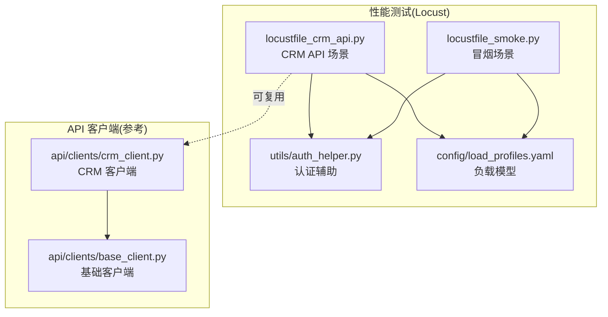
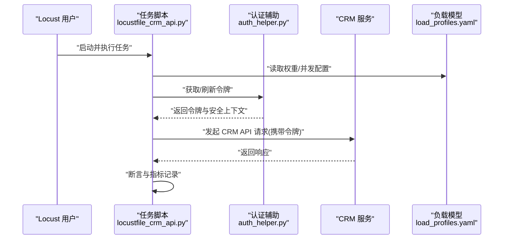
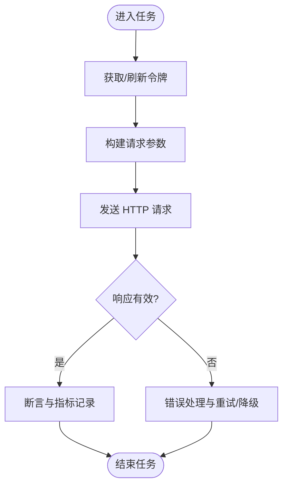
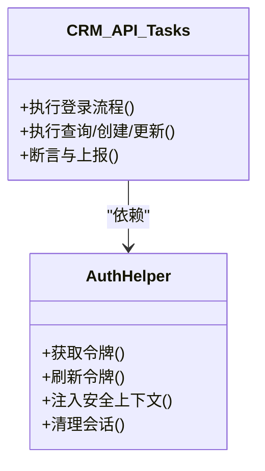
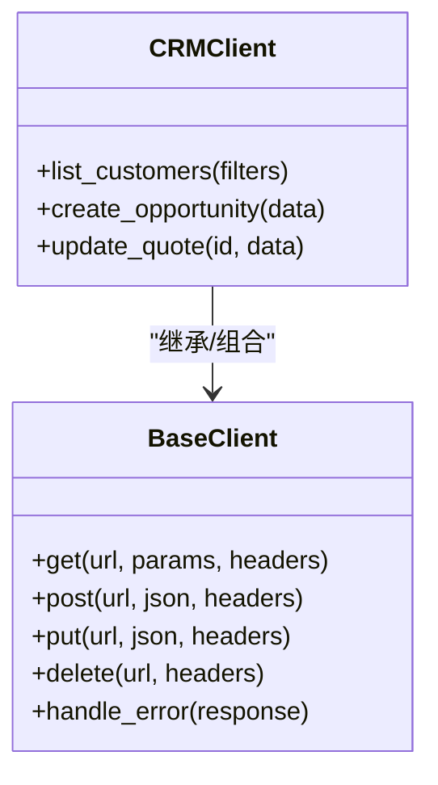
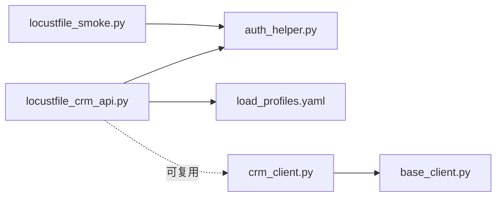

# 用户行为模拟

<cite>
**本文引用的文件**   
- [performance/locust/api/locustfile_crm_api.py](file://tests/performance/locust/api/locustfile_crm_api.py)
- [performance/locust/api/locustfile_smoke.py](file://tests/performance/locust/api/locustfile_smoke.py)
- [performance/locust/utils/auth_helper.py](file://tests/performance/locust/utils/auth_helper.py)
- [performance/locust/config/load_profiles.yaml](file://tests/performance/locust/config/load_profiles.yaml)
- [performance/locust/README.md](file://tests/performance/locust/README.md)
- [api/clients/crm_client.py](file://tests/api/clients/crm_client.py)
- [api/clients/base_client.py](file://tests/api/clients/base_client.py)
</cite>

## 目录
1. [简介](#简介)
2. [项目结构](#项目结构)
3. [核心组件](#核心组件)
4. [架构总览](#架构总览)
5. [详细组件分析](#详细组件分析)
6. [依赖关系分析](#依赖关系分析)
7. [性能考量](#性能考量)
8. [故障排查指南](#故障排查指南)
9. [结论](#结论)
10. [附录](#附录)

## 简介
本技术文档面向基于 Locust 的用户行为模拟系统，聚焦 CRM API 的性能测试场景。文档深入解释以下方面：
- 用户任务定义、请求序列编排与业务逻辑模拟
- 并发用户管理机制（权重分配、会话管理、状态保持）
- 认证辅助工具使用（令牌获取、刷新机制、安全上下文传递）
- 复杂业务流程的模拟实现（多步骤操作、条件分支、异常处理）
- 用户行为的随机化与多样化策略，确保测试真实性和全面性

## 项目结构
与性能测试相关的核心目录与文件如下：
- performance/locust/api：Locust 任务脚本（CRM API 与冒烟场景）
- performance/locust/utils：认证与报告等通用工具
- performance/locust/config：负载模型配置
- api/clients：API 客户端封装（供参考复用）

图表来源
- [performance/locust/api/locustfile_crm_api.py](file://tests/performance/locust/api/locustfile_crm_api.py)
- [performance/locust/api/locustfile_smoke.py](file://tests/performance/locust/api/locustfile_smoke.py)
- [performance/locust/utils/auth_helper.py](file://tests/performance/locust/utils/auth_helper.py)
- [performance/locust/config/load_profiles.yaml](file://tests/performance/locust/config/load_profiles.yaml)
- [api/clients/crm_client.py](file://tests/api/clients/crm_client.py)
- [api/clients/base_client.py](file://tests/api/clients/base_client.py)

章节来源
- [performance/locust/README.md](file://tests/performance/locust/README.md)

## 核心组件
- CRM API 场景脚本：定义用户任务、请求序列、断言与指标上报
- 冒烟场景脚本：轻量级健康检查与快速验证
- 认证辅助工具：统一令牌获取、刷新与安全上下文注入
- 负载模型配置：按角色/模块划分并发比例与权重
- API 客户端封装（参考）：HTTP 请求封装、错误处理与重试策略

章节来源
- [performance/locust/api/locustfile_crm_api.py](file://tests/performance/locust/api/locustfile_crm_api.py)
- [performance/locust/api/locustfile_smoke.py](file://tests/performance/locust/api/locustfile_smoke.py)
- [performance/locust/utils/auth_helper.py](file://tests/performance/locust/utils/auth_helper.py)
- [performance/locust/config/load_profiles.yaml](file://tests/performance/locust/config/load_profiles.yaml)
- [api/clients/crm_client.py](file://tests/api/clients/crm_client.py)
- [api/clients/base_client.py](file://tests/api/clients/base_client.py)

## 架构总览
下图展示从 Locust 用户到后端服务的端到端调用链，以及认证与负载模型的参与点。

图表来源
- [performance/locust/api/locustfile_crm_api.py](file://tests/performance/locust/api/locustfile_crm_api.py)
- [performance/locust/utils/auth_helper.py](file://tests/performance/locust/utils/auth_helper.py)
- [performance/locust/config/load_profiles.yaml](file://tests/performance/locust/config/load_profiles.yaml)

## 详细组件分析

### CRM API 场景（locustfile_crm_api.py）
- 任务定义
  - 将典型 CRM 操作抽象为用户任务，如登录、查询客户、创建商机、更新报价等
  - 通过 TaskSet/TaskSequence 组织请求顺序，保证业务链路完整性
- 请求编排
  - 使用 HTTP 客户端发送 GET/POST/PUT/DELETE 请求
  - 在请求前后插入鉴权、日志与指标上报
- 业务逻辑模拟
  - 构造合理的请求参数（如分页、筛选、排序），覆盖常见边界值
  - 对关键响应进行断言（状态码、关键字段、耗时阈值）
- 指标与结果
  - 记录成功/失败次数、平均响应时间、P95/P99 分位
  - 输出结构化结果以便后续报表生成

图表来源
- [performance/locust/api/locustfile_crm_api.py](file://tests/performance/locust/api/locustfile_crm_api.py)
- [performance/locust/utils/auth_helper.py](file://tests/performance/locust/utils/auth_helper.py)

章节来源
- [performance/locust/api/locustfile_crm_api.py](file://tests/performance/locust/api/locustfile_crm_api.py)

### 冒烟场景（locustfile_smoke.py）
- 目标：快速验证系统可用性（登录、首页、关键接口）
- 特点：低并发、短路径、强断言，适合 CI 流水线
- 与 CRM 场景的关系：作为前置门禁，失败则阻断重负载测试

章节来源
- [performance/locust/api/locustfile_smoke.py](file://tests/performance/locust/api/locustfile_smoke.py)

### 认证辅助工具（auth_helper.py）
- 功能职责
  - 统一令牌获取：根据账号凭据换取访问令牌
  - 令牌刷新：过期前自动刷新，避免中断长任务
  - 安全上下文：维护会话 Cookie/Token，注入到后续请求头
- 使用方式
  - 在任务初始化阶段获取令牌并缓存
  - 在每次请求前校验有效期，必要时触发刷新
  - 提供统一的请求拦截器或包装函数，自动附加认证信息

图表来源
- [performance/locust/utils/auth_helper.py](file://tests/performance/locust/utils/auth_helper.py)
- [performance/locust/api/locustfile_crm_api.py](file://tests/performance/locust/api/locustfile_crm_api.py)

章节来源
- [performance/locust/utils/auth_helper.py](file://tests/performance/locust/utils/auth_helper.py)

### 负载模型配置（load_profiles.yaml）
- 作用：定义不同角色/模块的并发比例与权重，驱动多租户或多业务线混合压测
- 关键维度
  - 用户角色：销售、客服、管理员等
  - 业务模块：客户、商机、报价、合同等
  - 权重与并发：各角色的相对权重与目标并发数
- 使用建议
  - 结合运行参数动态加载
  - 支持灰度发布时的差异化权重调整

章节来源
- [performance/locust/config/load_profiles.yaml](file://tests/performance/locust/config/load_profiles.yaml)

### API 客户端封装（参考）
- base_client.py
  - 统一 HTTP 客户端初始化、超时、重试、错误分类
  - 提供通用方法：get/post/put/delete、JSON 序列化、异常转换
- crm_client.py
  - 基于基础客户端封装 CRM 领域方法（如 list_customers、create_opportunity）
  - 内置参数校验与默认值填充，减少重复代码

图表来源
- [api/clients/base_client.py](file://tests/api/clients/base_client.py)
- [api/clients/crm_client.py](file://tests/api/clients/crm_client.py)

章节来源
- [api/clients/base_client.py](file://tests/api/clients/base_client.py)
- [api/clients/crm_client.py](file://tests/api/clients/crm_client.py)

## 依赖关系分析
- 任务脚本依赖认证辅助与负载模型配置
- 认证辅助独立于业务任务，便于复用与维护
- API 客户端封装为可选复用层，提升一致性

图表来源
- [performance/locust/api/locustfile_crm_api.py](file://tests/performance/locust/api/locustfile_crm_api.py)
- [performance/locust/api/locustfile_smoke.py](file://tests/performance/locust/api/locustfile_smoke.py)
- [performance/locust/utils/auth_helper.py](file://tests/performance/locust/utils/auth_helper.py)
- [performance/locust/config/load_profiles.yaml](file://tests/performance/locust/config/load_profiles.yaml)
- [api/clients/crm_client.py](file://tests/api/clients/crm_client.py)
- [api/clients/base_client.py](file://tests/api/clients/base_client.py)

## 性能考量
- 并发控制
  - 通过负载模型配置调节各角色并发比例，避免热点资源争用
  - 合理设置 ramp-up 时间与持续时间，观察稳态指标
- 连接与超时
  - 调整连接池大小与超时阈值，匹配后端容量
  - 对慢接口启用指数退避重试，降低抖动影响
- 数据准备
  - 预置数据与幂等写入，避免压测期间数据膨胀
  - 使用只读副本或隔离环境，减少干扰
- 指标采集
  - 关注成功率、TPS、P95/P99、错误分布与资源占用
  - 结合分布式节点与集中式监控平台进行汇总分析

## 故障排查指南
- 认证失败
  - 检查令牌获取流程与有效期刷新逻辑
  - 确认安全上下文是否正确注入到请求头
- 请求超时/失败
  - 查看网络连通性与后端健康状态
  - 检查重试策略与熔断/降级开关
- 指标异常
  - 核对断言规则与阈值配置
  - 定位热点接口与瓶颈资源（CPU/内存/IO）
- 复现与定位
  - 开启详细日志与采样请求体/响应体
  - 缩小范围至单用户/单任务逐步验证

章节来源
- [performance/locust/utils/auth_helper.py](file://tests/performance/locust/utils/auth_helper.py)
- [performance/locust/api/locustfile_crm_api.py](file://tests/performance/locust/api/locustfile_crm_api.py)

## 结论
本方案以 Locust 为核心，围绕 CRM API 构建了高保真用户行为模拟体系。通过任务编排、认证辅助、负载模型与客户端封装，实现了可配置、可扩展、可观测的性能测试能力。建议在持续集成中常态化运行冒烟与轻负载场景，并在发布前执行全量负载模型，保障质量与稳定性。

## 附录
- 运行说明与最佳实践请参考：
  - [performance/locust/README.md](file://tests/performance/locust/README.md)