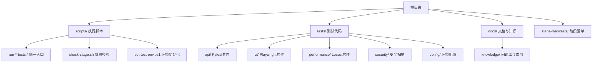
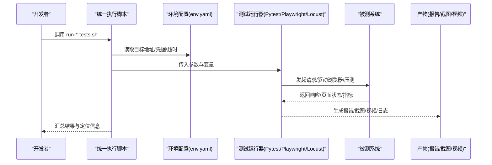
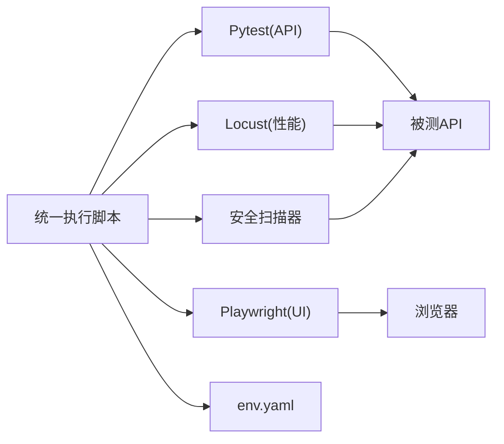
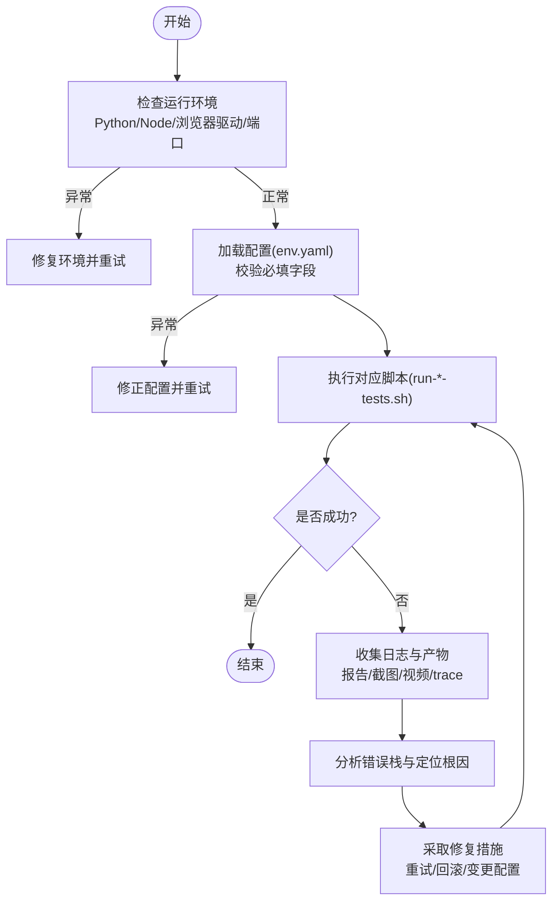

# 故障排查与FAQ

<cite>
**本文引用的文件**   
- [scripts/run-ui-tests.sh](file://scripts/run-ui-tests.sh)
- [scripts/run-api-tests.sh](file://scripts/run-api-tests.sh)
- [scripts/run-perf-tests.sh](file://scripts/run-perf-tests.sh)
- [scripts/run-security-tests.sh](file://scripts/run-security-tests.sh)
- [scripts/check-stage.sh](file://scripts/check-stage.sh)
- [scripts/set-test-env.ps1](file://scripts/set-test-env.ps1)
- [tests/ui/playwright.config.ts](file://tests/ui/playwright.config.ts)
- [tests/api/pytest.ini](file://tests/api/pytest.ini)
- [tests/config/env.yaml](file://tests/config/env.yaml)
- [tests/performance/locust/README.md](file://tests/performance/locust/README.md)
- [tests/performance/locust/requirements.txt](file://tests/performance/locust/requirements.txt)
- [tests/security/scanner/security_scanner.py](file://tests/security/scanner/security_scanner.py)
- [docs/knowledge/环境与工具问题库.md](file://docs/knowledge/环境与工具问题库.md)
</cite>

## 目录
1. [简介](#简介)
2. [项目结构](#项目结构)
3. [核心组件](#核心组件)
4. [架构总览](#架构总览)
5. [详细组件分析](#详细组件分析)
6. [依赖关系分析](#依赖关系分析)
7. [性能注意事项](#性能注意事项)
8. [故障排查指南](#故障排查指南)
9. [结论](#结论)
10. [附录](#附录)

## 简介
本文件面向AutoTest Hub框架的使用者与开发者，系统化整理在环境配置、依赖冲突、测试执行失败等常见问题的诊断与修复方法；提供错误日志分析方法、调试技巧、系统性诊断流程；并覆盖性能问题（内存泄漏、CPU占用、网络延迟）的识别与优化建议、跨平台兼容性处理要点，以及社区支持与反馈渠道说明。文档同时给出预防性措施与最佳实践，帮助团队稳定高效地运行API、UI、性能与安全测试。

## 项目结构
本项目采用分层组织：脚本层负责统一入口与环境准备；测试用例按类型分置（api、ui、performance、security）；配置集中于tests/config；知识库位于docs/knowledge。关键脚本与配置文件如下：
- 统一执行脚本：run-ui-tests.sh、run-api-tests.sh、run-perf-tests.sh、run-security-tests.sh
- 阶段检查脚本：check-stage.sh
- 环境设置脚本：set-test-env.ps1
- UI配置：tests/ui/playwright.config.ts
- API配置：tests/api/pytest.ini
- 全局配置：tests/config/env.yaml
- 性能测试说明与依赖：tests/performance/locust/README.md、requirements.txt
- 安全扫描器：tests/security/scanner/security_scanner.py
- 知识与问题库：docs/knowledge/环境与工具问题库.md

图表来源
- [scripts/run-ui-tests.sh](file://scripts/run-ui-tests.sh)
- [scripts/run-api-tests.sh](file://scripts/run-api-tests.sh)
- [scripts/run-perf-tests.sh](file://scripts/run-perf-tests.sh)
- [scripts/run-security-tests.sh](file://scripts/run-security-tests.sh)
- [scripts/check-stage.sh](file://scripts/check-stage.sh)
- [scripts/set-test-env.ps1](file://scripts/set-test-env.ps1)
- [tests/ui/playwright.config.ts](file://tests/ui/playwright.config.ts)
- [tests/api/pytest.ini](file://tests/api/pytest.ini)
- [tests/config/env.yaml](file://tests/config/env.yaml)
- [tests/performance/locust/README.md](file://tests/performance/locust/README.md)
- [tests/performance/locust/requirements.txt](file://tests/performance/locust/requirements.txt)
- [tests/security/scanner/security_scanner.py](file://tests/security/scanner/security_scanner.py)
- [docs/knowledge/环境与工具问题库.md](file://docs/knowledge/环境与工具问题库.md)

章节来源
- [scripts/run-ui-tests.sh](file://scripts/run-ui-tests.sh)
- [scripts/run-api-tests.sh](file://scripts/run-api-tests.sh)
- [scripts/run-perf-tests.sh](file://scripts/run-perf-tests.sh)
- [scripts/run-security-tests.sh](file://scripts/run-security-tests.sh)
- [scripts/check-stage.sh](file://scripts/check-stage.sh)
- [scripts/set-test-env.ps1](file://scripts/set-test-env.ps1)
- [tests/ui/playwright.config.ts](file://tests/ui/playwright.config.ts)
- [tests/api/pytest.ini](file://tests/api/pytest.ini)
- [tests/config/env.yaml](file://tests/config/env.yaml)
- [tests/performance/locust/README.md](file://tests/performance/locust/README.md)
- [tests/performance/locust/requirements.txt](file://tests/performance/locust/requirements.txt)
- [tests/security/scanner/security_scanner.py](file://tests/security/scanner/security_scanner.py)
- [docs/knowledge/环境与工具问题库.md](file://docs/knowledge/环境与工具问题库.md)

## 核心组件
- 统一执行脚本：封装各类型测试的启动参数、环境变量与产物输出路径，屏蔽平台差异。
- 配置中心：env.yaml集中管理目标地址、认证凭据、超时与重试策略等。
- 测试框架集成：Pytest（API）、Playwright（UI）、Locust（性能）、自定义安全扫描器。
- 阶段检查：check-stage.sh用于前置条件校验（如依赖、端口、浏览器驱动）。
- 知识库：环境与工具问题库沉淀常见问题与解决方案，便于检索与复用。

章节来源
- [scripts/run-ui-tests.sh](file://scripts/run-ui-tests.sh)
- [scripts/run-api-tests.sh](file://scripts/run-api-tests.sh)
- [scripts/run-perf-tests.sh](file://scripts/run-perf-tests.sh)
- [scripts/run-security-tests.sh](file://scripts/run-security-tests.sh)
- [tests/config/env.yaml](file://tests/config/env.yaml)
- [tests/api/pytest.ini](file://tests/api/pytest.ini)
- [tests/ui/playwright.config.ts](file://tests/ui/playwright.config.ts)
- [tests/performance/locust/README.md](file://tests/performance/locust/README.md)
- [tests/security/scanner/security_scanner.py](file://tests/security/scanner/security_scanner.py)
- [scripts/check-stage.sh](file://scripts/check-stage.sh)
- [docs/knowledge/环境与工具问题库.md](file://docs/knowledge/环境与工具问题库.md)

## 架构总览
下图展示从统一入口到具体测试框架的执行链路，以及配置与产物落盘位置。

图表来源
- [scripts/run-ui-tests.sh](file://scripts/run-ui-tests.sh)
- [scripts/run-api-tests.sh](file://scripts/run-api-tests.sh)
- [scripts/run-perf-tests.sh](file://scripts/run-perf-tests.sh)
- [scripts/run-security-tests.sh](file://scripts/run-security-tests.sh)
- [tests/config/env.yaml](file://tests/config/env.yaml)

## 详细组件分析

### 统一执行脚本（Shell）
职责与要点
- 标准化启动：统一参数解析、环境变量注入、工作目录切换、退出码传递。
- 产物管理：将报告、截图、视频、日志写入固定目录，便于CI归档与人工回溯。
- 容错与重试：对关键步骤进行存在性检查与重试提示，降低偶发失败影响。
- 平台兼容：通过shell特性适配Linux/macOS；Windows使用PowerShell脚本对应实现。

典型问题与定位
- 权限不足或路径不存在：检查脚本可执行权限与产物目录创建逻辑。
- 环境变量未生效：确认脚本加载顺序与导出方式。
- 命令不可用：验证Python/Node/浏览器驱动是否安装且PATH正确。

章节来源
- [scripts/run-ui-tests.sh](file://scripts/run-ui-tests.sh)
- [scripts/run-api-tests.sh](file://scripts/run-api-tests.sh)
- [scripts/run-perf-tests.sh](file://scripts/run-perf-tests.sh)
- [scripts/run-security-tests.sh](file://scripts/run-security-tests.sh)

### 阶段检查脚本（check-stage.sh）
职责与要点
- 前置校验：检测必要依赖、端口可达性、浏览器驱动版本匹配。
- 快速失败：任一检查失败即中止，避免后续无效执行。
- 诊断输出：打印缺失项与建议修复步骤。

章节来源
- [scripts/check-stage.sh](file://scripts/check-stage.sh)

### 环境初始化脚本（set-test-env.ps1）
职责与要点
- Windows环境准备：虚拟环境激活、依赖安装、环境变量设置。
- 浏览器驱动下载与缓存：减少重复下载耗时。
- 编码与BOM处理：确保脚本与配置文件编码一致。

章节来源
- [scripts/set-test-env.ps1](file://scripts/set-test-env.ps1)

### UI自动化（Playwright）
配置要点
- 浏览器选择与版本：chromium/firefox/webkit及本地二进制路径。
- 视口与设备模拟：移动端/桌面端适配。
- 超时与重试：针对弱网与动态渲染场景调整。
- 产物输出：截图、视频、trace文件路径与保留策略。

常见问题
- 浏览器驱动不匹配：升级或锁定Playwright与浏览器版本。
- 元素定位不稳定：增加显式等待与重试策略，必要时启用trace回放。
- 资源加载慢：合理设置全局超时与路由拦截。

章节来源
- [tests/ui/playwright.config.ts](file://tests/ui/playwright.config.ts)

### API自动化（Pytest）
配置要点
- 插件与钩子：fixtures、标记、并行执行开关。
- 日志与报告：JunitXML、HTML报告、控制台输出级别。
- 并发与隔离：线程/进程隔离、数据清理策略。

常见问题
- 并发导致的数据竞争：串行化写操作或引入事务回滚。
- 鉴权失败：检查token刷新与过期时间。
- 网络抖动：增加重试与退避策略。

章节来源
- [tests/api/pytest.ini](file://tests/api/pytest.ini)

### 性能测试（Locust）
配置要点
- 用户模型与任务权重：贴近真实流量分布。
- 指标采集：QPS、RT、错误率、资源利用率。
- 结果导出：CSV/HTML报告与可视化。

常见问题
- 压测机瓶颈：监控CPU/IO/网络，横向扩展压测节点。
- 目标系统限流：调整并发与速率限制，观察降级行为。
- 数据准备不足：预置足够的数据集与登录态。

章节来源
- [tests/performance/locust/README.md](file://tests/performance/locust/README.md)
- [tests/performance/locust/requirements.txt](file://tests/performance/locust/requirements.txt)

### 安全扫描（自定义扫描器）
职责与要点
- 漏洞探测：基于规则与工具的扫描流水线。
- 报告生成：结构化输出漏洞等级、复现步骤与修复建议。
- 集成CI：阻断高危漏洞合并。

常见问题
- 误报率高：调优规则阈值与白名单。
- 扫描耗时过长：分批扫描与增量扫描。

章节来源
- [tests/security/scanner/security_scanner.py](file://tests/security/scanner/security_scanner.py)

### 全局配置（env.yaml）
职责与要点
- 多环境切换：dev/staging/prod目标地址与凭据。
- 通用参数：超时、重试次数、代理、日志级别。
- 敏感信息保护：结合密钥管理或CI Secret。

常见问题
- 配置未生效：确认加载优先级与覆盖规则。
- 凭据泄露风险：禁止硬编码，使用环境变量或密钥服务。

章节来源
- [tests/config/env.yaml](file://tests/config/env.yaml)

## 依赖关系分析
- 运行时依赖
  - Python：Pytest生态、requests/httpx、安全扫描相关包
  - Node.js：Playwright、Locust客户端（如需）
  - 浏览器：Chromium/Firefox/WebKit及其驱动
- 构建与脚本依赖
  - Shell/PowerShell：执行与编排
  - YAML解析：env.yaml读取
- 外部系统
  - 被测API/UI服务
  - 第三方安全扫描引擎（可选）

图表来源
- [scripts/run-ui-tests.sh](file://scripts/run-ui-tests.sh)
- [scripts/run-api-tests.sh](file://scripts/run-api-tests.sh)
- [scripts/run-perf-tests.sh](file://scripts/run-perf-tests.sh)
- [scripts/run-security-tests.sh](file://scripts/run-security-tests.sh)
- [tests/config/env.yaml](file://tests/config/env.yaml)

章节来源
- [tests/performance/locust/requirements.txt](file://tests/performance/locust/requirements.txt)
- [tests/ui/playwright.config.ts](file://tests/ui/playwright.config.ts)
- [tests/api/pytest.ini](file://tests/api/pytest.ini)
- [tests/config/env.yaml](file://tests/config/env.yaml)

## 性能注意事项
- 识别瓶颈
  - CPU：关注压测机与被测服务CPU峰值与上下文切换
  - 内存：监控堆增长与GC频率，排查泄漏点
  - I/O：磁盘读写与网络带宽占用
  - 数据库：连接池耗尽、慢查询、锁竞争
- 优化建议
  - 压测机：独立部署、资源隔离、开启内核参数优化
  - 被测系统：水平扩容、缓存命中、异步化、连接池调优
  - 测试侧：预热、数据预置、合理并发与阶梯加压
- 观测手段
  - 指标：QPS、P95/P99 RT、错误率、饱和度
  - 追踪：分布式链路追踪、浏览器Trace回放
  - 日志：结构化日志、采样策略、告警阈值

[本节为通用指导，无需特定文件引用]

## 故障排查指南

### 系统性诊断流程

图表来源
- [scripts/run-ui-tests.sh](file://scripts/run-ui-tests.sh)
- [scripts/run-api-tests.sh](file://scripts/run-api-tests.sh)
- [scripts/run-perf-tests.sh](file://scripts/run-perf-tests.sh)
- [scripts/run-security-tests.sh](file://scripts/run-security-tests.sh)
- [tests/config/env.yaml](file://tests/config/env.yaml)

### 环境配置问题
- Python/Node版本不一致
  - 现象：导入失败、语法报错、模块缺失
  - 处理：锁定版本、使用虚拟环境、重新安装依赖
- 浏览器驱动不匹配
  - 现象：启动失败、元素定位异常
  - 处理：升级/降级至兼容版本，或使用内置驱动管理
- 端口被占用或服务未启动
  - 现象：连接拒绝、超时
  - 处理：释放端口、启动服务、检查防火墙与代理

章节来源
- [scripts/check-stage.sh](file://scripts/check-stage.sh)
- [scripts/set-test-env.ps1](file://scripts/set-test-env.ps1)
- [tests/config/env.yaml](file://tests/config/env.yaml)

### 依赖冲突
- 包版本冲突
  - 现象：ImportError、AttributeError、运行时崩溃
  - 处理：查看requirements/lock文件、隔离环境、逐步缩小范围定位
- 平台差异
  - 现象：Windows下路径分隔符、编码问题
  - 处理：统一使用跨平台库、设置UTF-8编码、避免硬编码路径

章节来源
- [tests/performance/locust/requirements.txt](file://tests/performance/locust/requirements.txt)
- [scripts/set-test-env.ps1](file://scripts/set-test-env.ps1)

### 测试执行失败
- API测试
  - 现象：鉴权失败、断言失败、并发脏数据
  - 处理：检查token有效期、幂等设计、数据隔离与清理
- UI测试
  - 现象：元素不可见、弹窗未关闭、截图缺失
  - 处理：显式等待、重试、启用trace回放、检查视口与缩放
- 性能测试
  - 现象：QPS上不去、错误率飙升
  - 处理：检查压测机资源、目标系统限流、网络丢包与DNS解析

章节来源
- [tests/api/pytest.ini](file://tests/api/pytest.ini)
- [tests/ui/playwright.config.ts](file://tests/ui/playwright.config.ts)
- [tests/performance/locust/README.md](file://tests/performance/locust/README.md)

### 错误日志分析方法
- 定位关键信息
  - 错误类型、触发位置、请求ID/会话ID、时间戳
- 关联产物
  - 报告、截图、视频、trace、服务端日志
- 复现场景
  - 最小化用例、固定数据、禁用无关功能
- 回归验证
  - 修复后全量/抽样回归，确认无副作用

章节来源
- [scripts/run-ui-tests.sh](file://scripts/run-ui-tests.sh)
- [scripts/run-api-tests.sh](file://scripts/run-api-tests.sh)
- [scripts/run-perf-tests.sh](file://scripts/run-perf-tests.sh)
- [scripts/run-security-tests.sh](file://scripts/run-security-tests.sh)

### 调试技巧
- 断点与单步：在关键函数处插入断点，逐步推进
- 日志分级：DEBUG/INFO/WARN/ERROR分级输出，按需开启
- 抓包与追踪：HTTP抓包、浏览器Network面板、Playwright Trace
- 容器化与快照：固定环境镜像、保存前后快照对比

章节来源
- [tests/ui/playwright.config.ts](file://tests/ui/playwright.config.ts)
- [tests/api/pytest.ini](file://tests/api/pytest.ini)

### 性能问题排查
- 内存泄漏
  - 现象：进程内存持续增长、频繁GC
  - 处理：定位大对象、关闭未释放句柄、限制缓存大小
- CPU占用过高
  - 现象：热点函数CPU占比高、锁竞争
  - 处理：算法优化、并行化、减少同步阻塞
- 网络延迟
  - 现象：RT升高、丢包、DNS解析慢
  - 处理：CDN/就近接入、连接复用、DNS缓存、超时与重试

章节来源
- [tests/performance/locust/README.md](file://tests/performance/locust/README.md)

### 跨平台兼容性
- Windows
  - 使用PowerShell脚本初始化环境，注意编码与路径
- Linux/macOS
  - 使用Shell脚本，注意权限与符号链接
- 浏览器差异
  - 针对不同引擎调整等待与定位策略，必要时禁用GPU加速

章节来源
- [scripts/set-test-env.ps1](file://scripts/set-test-env.ps1)
- [scripts/check-stage.sh](file://scripts/check-stage.sh)
- [tests/ui/playwright.config.ts](file://tests/ui/playwright.config.ts)

### 社区支持与问题反馈
- 内部渠道
  - 知识库：环境与工具问题库，持续沉淀与检索
  - 工单与看板：记录问题、跟踪进度、复盘改进
- 外部渠道
  - 官方文档与Issue：Pytest/Playwright/Locust官方仓库
  - 技术社区：StackOverflow、GitHub Discussions

章节来源
- [docs/knowledge/环境与工具问题库.md](file://docs/knowledge/环境与工具问题库.md)

### 预防性措施与最佳实践
- 环境治理
  - 锁定版本、使用虚拟环境、CI中固化依赖
- 配置管理
  - 集中配置、敏感信息加密、多环境切换
- 测试质量
  - 幂等设计、数据隔离、失败自动重试与降级
- 可观测性
  - 结构化日志、指标上报、告警阈值
- 文档与演练
  - 故障手册、演练计划、定期复盘

章节来源
- [tests/config/env.yaml](file://tests/config/env.yaml)
- [docs/knowledge/环境与工具问题库.md](file://docs/knowledge/环境与工具问题库.md)

## 结论
通过统一的执行入口、集中的配置管理与完善的知识库，AutoTest Hub框架能够显著提升测试稳定性与可维护性。配合系统化的故障排查流程、性能优化方法与跨平台兼容性策略，团队可在复杂环境下快速定位与解决问题，保障交付质量与效率。

## 附录
- 常用命令速查
  - 执行UI测试：参考run-ui-tests.sh
  - 执行API测试：参考run-api-tests.sh
  - 执行性能测试：参考run-perf-tests.sh
  - 执行安全扫描：参考run-security-tests.sh
  - 前置检查：参考check-stage.sh
  - Windows环境初始化：参考set-test-env.ps1

章节来源
- [scripts/run-ui-tests.sh](file://scripts/run-ui-tests.sh)
- [scripts/run-api-tests.sh](file://scripts/run-api-tests.sh)
- [scripts/run-perf-tests.sh](file://scripts/run-perf-tests.sh)
- [scripts/run-security-tests.sh](file://scripts/run-security-tests.sh)
- [scripts/check-stage.sh](file://scripts/check-stage.sh)
- [scripts/set-test-env.ps1](file://scripts/set-test-env.ps1)