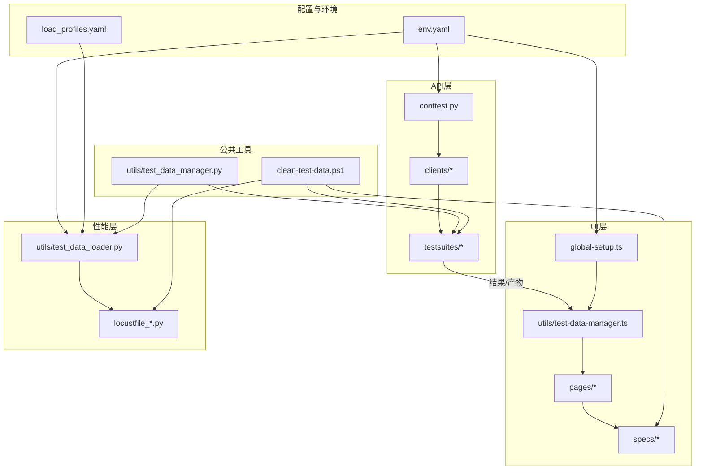
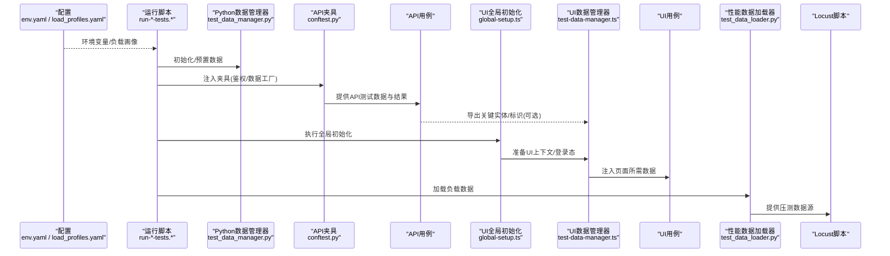
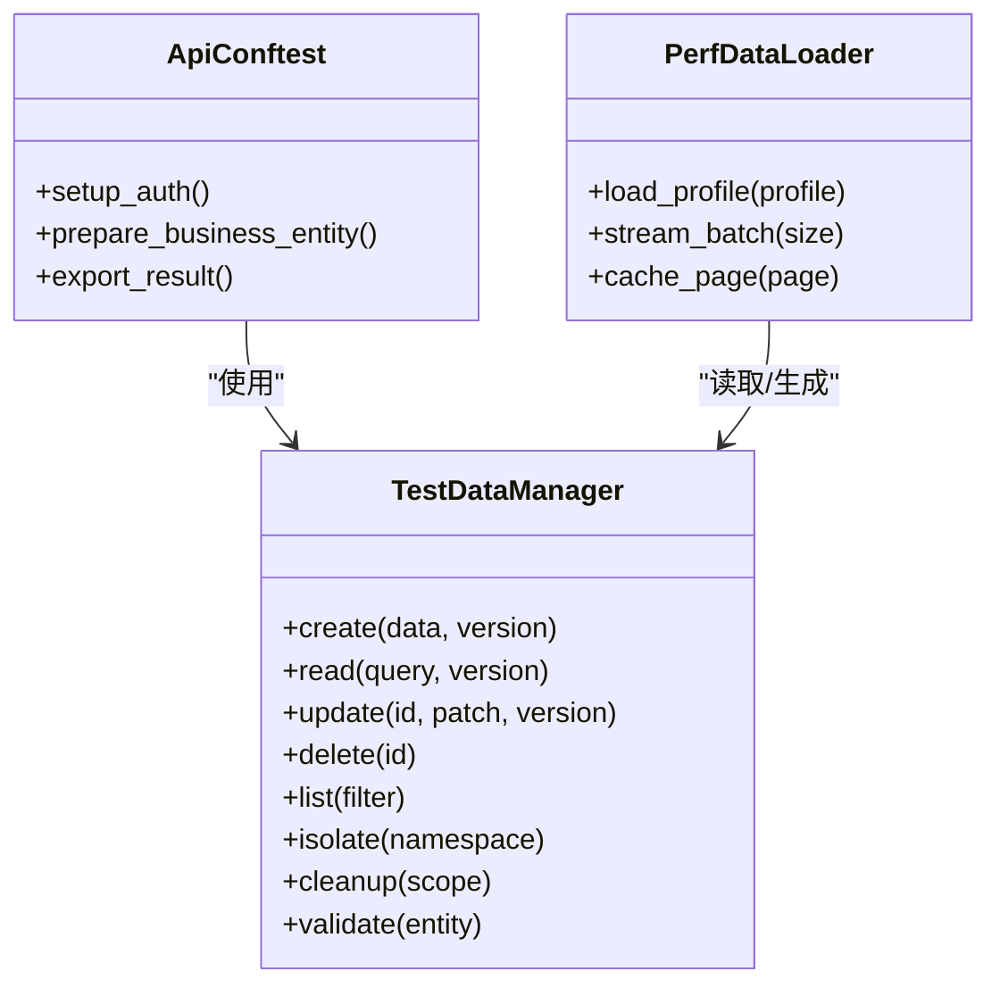
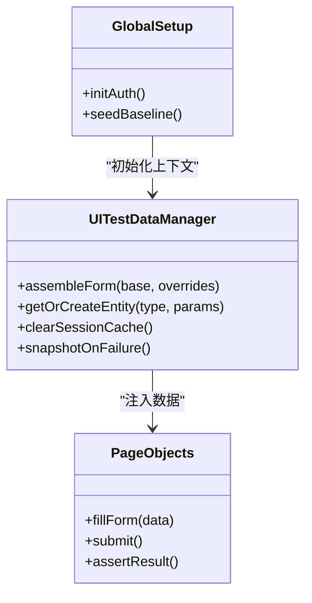
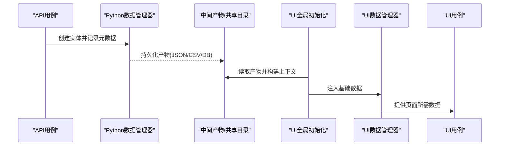
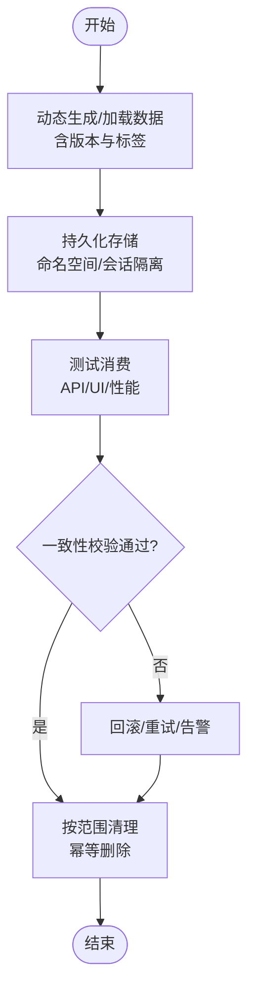
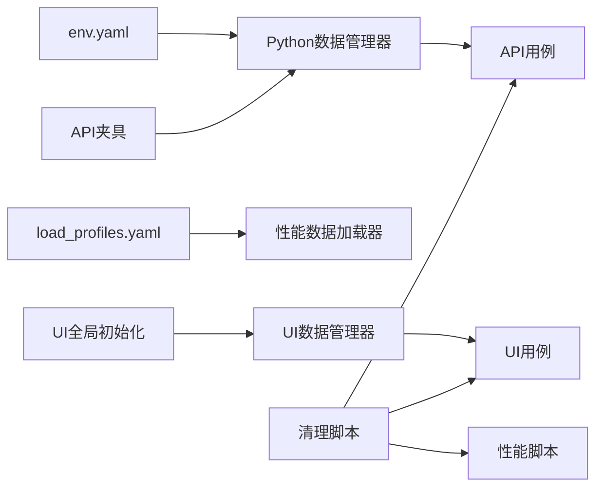

# 数据流设计

<cite>
**本文引用的文件**   
- [tests/utils/test_data_manager.py](file://tests/utils/test_data_manager.py)
- [tests/ui/utils/test-data-manager.ts](file://tests/ui/utils/test-data-manager.ts)
- [tests/api/conftest.py](file://tests/api/conftest.py)
- [tests/ui/global-setup.ts](file://tests/ui/global-setup.ts)
- [scripts/clean-test-data.ps1](file://scripts/clean-test-data.ps1)
- [scripts/run-api-tests.sh](file://scripts/run-api-tests.sh)
- [scripts/run-ui-tests.sh](file://scripts/run-ui-tests.sh)
- [scripts/run-perf-tests.sh](file://scripts/run-perf-tests.sh)
- [tests/performance/locust/utils/test_data_loader.py](file://tests/performance/locust/utils/test_data_loader.py)
- [tests/performance/locust/config/load_profiles.yaml](file://tests/performance/locust/config/load_profiles.yaml)
- [tests/performance/locust/README.md](file://tests/performance/locust/README.md)
- [tests/config/env.yaml](file://tests/config/env.yaml)
</cite>

## 目录
1. [引言](#引言)
2. [项目结构](#项目结构)
3. [核心组件](#核心组件)
4. [架构总览](#架构总览)
5. [详细组件分析](#详细组件分析)
6. [依赖关系分析](#依赖关系分析)
7. [性能考虑](#性能考虑)
8. [故障排查指南](#故障排查指南)
9. [结论](#结论)
10. [附录](#附录)

## 引言
本文件面向AutoTest Hub框架的数据流设计与实现，聚焦测试数据的生命周期管理（生成、存储、隔离、清理），跨层数据传递机制（API结果驱动UI数据准备），以及数据管理器在动态生成、版本控制与一致性保证方面的工作原理。同时给出性能测试中的数据加载策略与内存管理建议，并通过数据流图展示从配置到执行的完整路径，帮助开发者理解数据在各组件间的流转过程。

## 项目结构
围绕数据流的关键位置如下：
- API层：pytest夹具与客户端用于创建/读取/校验数据，并产出结构化结果供上层消费
- UI层：Playwright用例通过页面对象与工具类消费数据，必要时调用API完成前置数据准备
- 性能层：Locust脚本通过专用数据加载器按负载模型拉取或生成数据
- 公共能力：Python与TypeScript两套“测试数据管理器”提供统一的数据访问、缓存与清理接口
- 运行脚本：按层启动测试，负责环境初始化、数据准备与清理的编排
- 配置与环境：集中式环境变量与负载画像定义数据源与行为参数

图表来源
- [tests/config/env.yaml](file://tests/config/env.yaml)
- [tests/performance/locust/config/load_profiles.yaml](file://tests/performance/locust/config/load_profiles.yaml)
- [tests/api/conftest.py](file://tests/api/conftest.py)
- [tests/ui/global-setup.ts](file://tests/ui/global-setup.ts)
- [tests/ui/utils/test-data-manager.ts](file://tests/ui/utils/test-data-manager.ts)
- [tests/performance/locust/utils/test_data_loader.py](file://tests/performance/locust/utils/test_data_loader.py)
- [tests/utils/test_data_manager.py](file://tests/utils/test_data_manager.py)
- [scripts/clean-test-data.ps1](file://scripts/clean-test-data.ps1)

章节来源
- [tests/config/env.yaml](file://tests/config/env.yaml)
- [tests/performance/locust/config/load_profiles.yaml](file://tests/performance/locust/config/load_profiles.yaml)
- [tests/api/conftest.py](file://tests/api/conftest.py)
- [tests/ui/global-setup.ts](file://tests/ui/global-setup.ts)
- [tests/ui/utils/test-data-manager.ts](file://tests/ui/utils/test-data-manager.ts)
- [tests/performance/locust/utils/test_data_loader.py](file://tests/performance/locust/utils/test_data_loader.py)
- [tests/utils/test_data_manager.py](file://tests/utils/test_data_manager.py)
- [scripts/clean-test-data.ps1](file://scripts/clean-test-data.ps1)

## 核心组件
- Python测试数据管理器（tests/utils/test_data_manager.py）
  - 职责：为API与性能测试提供统一的增删改查、缓存、版本标记与清理入口；对外暴露稳定的方法契约，屏蔽底层数据源差异
  - 关键特性：
    - 动态数据生成：基于模板/种子与随机化策略构造唯一且可复现的数据集
    - 版本控制：以版本号/时间戳/哈希等维度对数据集进行标注，便于回溯与对比
    - 一致性保证：在写入后执行校验钩子，确保关键字段存在、约束满足、关联关系正确
    - 隔离策略：按用例ID/会话ID划分命名空间，避免并发干扰
    - 清理策略：支持按标签/范围/全量清理，配合幂等删除与重试
- TypeScript测试数据管理器（tests/ui/utils/test-data-manager.ts）
  - 职责：为UI测试提供数据准备、状态同步与断言辅助；可与API层协作，将API产出的实体映射为UI所需表单/页面上下文
  - 关键特性：
    - 数据装配：聚合多源数据（静态JSON、API返回、运行时计算）组装为页面输入
    - 状态缓存：在浏览器会话内缓存已创建资源，减少重复IO
    - 失败回滚：在断言失败时保留必要快照以便诊断
- 运行脚本与夹具
  - scripts/run-api-tests.sh、scripts/run-ui-tests.sh、scripts/run-perf-tests.sh：分别编排对应层的测试执行、数据准备与清理
  - tests/api/conftest.py：提供共享夹具，封装数据创建、鉴权、结果收集等通用流程
  - tests/ui/global-setup.ts：全局初始化，如登录态建立、基线数据准备、临时目录创建等

章节来源
- [tests/utils/test_data_manager.py](file://tests/utils/test_data_manager.py)
- [tests/ui/utils/test-data-manager.ts](file://tests/ui/utils/test-data-manager.ts)
- [tests/api/conftest.py](file://tests/api/conftest.py)
- [tests/ui/global-setup.ts](file://tests/ui/global-setup.ts)
- [scripts/run-api-tests.sh](file://scripts/run-api-tests.sh)
- [scripts/run-ui-tests.sh](file://scripts/run-ui-tests.sh)
- [scripts/run-perf-tests.sh](file://scripts/run-perf-tests.sh)

## 架构总览
下图展示了从配置到测试执行的端到端数据路径，涵盖API→UI的联动与性能测试的数据加载策略。

图表来源
- [tests/config/env.yaml](file://tests/config/env.yaml)
- [tests/performance/locust/config/load_profiles.yaml](file://tests/performance/locust/config/load_profiles.yaml)
- [scripts/run-api-tests.sh](file://scripts/run-api-tests.sh)
- [scripts/run-ui-tests.sh](file://scripts/run-ui-tests.sh)
- [scripts/run-perf-tests.sh](file://scripts/run-perf-tests.sh)
- [tests/utils/test_data_manager.py](file://tests/utils/test_data_manager.py)
- [tests/api/conftest.py](file://tests/api/conftest.py)
- [tests/ui/global-setup.ts](file://tests/ui/global-setup.ts)
- [tests/ui/utils/test-data-manager.ts](file://tests/ui/utils/test-data-manager.ts)
- [tests/performance/locust/utils/test_data_loader.py](file://tests/performance/locust/utils/test_data_loader.py)

## 详细组件分析

### Python测试数据管理器（API/性能侧）
- 设计要点
  - 统一抽象：对外暴露create/read/update/delete/list/isolate/cleanup等方法，内部适配不同数据源
  - 动态生成：结合种子与模板，支持批量生成与增量更新
  - 版本控制：每次变更附带版本信息，支持按版本查询与回滚
  - 一致性校验：写后校验键约束、外键关系、枚举值域等
  - 隔离策略：按会话/任务ID划分命名空间，避免并发冲突
  - 清理策略：支持按标签/范围清理，幂等删除与重试
- 典型用法
  - API夹具通过该管理器创建业务实体，并在用例中复用
  - 性能数据加载器按需拉取或生成大批量数据，避免一次性加载导致内存峰值过高

图表来源
- [tests/utils/test_data_manager.py](file://tests/utils/test_data_manager.py)
- [tests/api/conftest.py](file://tests/api/conftest.py)
- [tests/performance/locust/utils/test_data_loader.py](file://tests/performance/locust/utils/test_data_loader.py)

章节来源
- [tests/utils/test_data_manager.py](file://tests/utils/test_data_manager.py)
- [tests/api/conftest.py](file://tests/api/conftest.py)
- [tests/performance/locust/utils/test_data_loader.py](file://tests/performance/locust/utils/test_data_loader.py)

### TypeScript测试数据管理器（UI侧）
- 设计要点
  - 数据装配：聚合静态数据、API返回与运行时计算，形成页面输入模型
  - 会话缓存：在浏览器会话内缓存已创建资源，减少重复网络请求
  - 失败回滚：在断言失败时保留必要快照，便于定位问题
  - 与全局初始化协同：由global-setup建立登录态与基础数据，再由各用例按需扩展
- 典型用法
  - 用例通过UI数据管理器获取页面所需的表单数据、下拉选项、分页游标等
  - 当需要跨层联动时，优先复用API层已创建的实体ID，避免重复创建

图表来源
- [tests/ui/utils/test-data-manager.ts](file://tests/ui/utils/test-data-manager.ts)
- [tests/ui/global-setup.ts](file://tests/ui/global-setup.ts)

章节来源
- [tests/ui/utils/test-data-manager.ts](file://tests/ui/utils/test-data-manager.ts)
- [tests/ui/global-setup.ts](file://tests/ui/global-setup.ts)

### 跨层数据传递机制（API→UI）
- 目标：确保UI测试能稳定复用API层创建的实体，减少耦合与不确定性
- 推荐路径
  - API层输出标准化产物（如实体ID、名称、状态码、时间戳等）
  - 通过中间文件或轻量消息通道传递给UI层（例如JSON清单、环境变量、共享目录）
  - UI层在global-setup阶段读取并缓存，供后续用例直接消费
- 时序示意

图表来源
- [tests/api/conftest.py](file://tests/api/conftest.py)
- [tests/ui/global-setup.ts](file://tests/ui/global-setup.ts)
- [tests/ui/utils/test-data-manager.ts](file://tests/ui/utils/test-data-manager.ts)

章节来源
- [tests/api/conftest.py](file://tests/api/conftest.py)
- [tests/ui/global-setup.ts](file://tests/ui/global-setup.ts)
- [tests/ui/utils/test-data-manager.ts](file://tests/ui/utils/test-data-manager.ts)

### 数据生命周期流程图（生成→存储→隔离→清理）

图表来源
- [tests/utils/test_data_manager.py](file://tests/utils/test_data_manager.py)
- [scripts/clean-test-data.ps1](file://scripts/clean-test-data.ps1)

章节来源
- [tests/utils/test_data_manager.py](file://tests/utils/test_data_manager.py)
- [scripts/clean-test-data.ps1](file://scripts/clean-test-data.ps1)

## 依赖关系分析
- 组件耦合
  - API夹具与Python数据管理器强耦合，负责数据创建与校验
  - UI数据管理器与全局初始化协作，负责UI上下文装配
  - 性能数据加载器与负载画像配置协作，负责批量化数据供给
- 外部依赖
  - 配置文件：env.yaml提供运行时环境参数；load_profiles.yaml提供负载模型
  - 运行脚本：按层编排数据准备、执行与清理
- 潜在循环依赖
  - 应避免UI层反向依赖API实现细节，仅消费标准化产物
  - 数据管理器应保持稳定契约，避免随用例变化频繁调整接口

图表来源
- [tests/config/env.yaml](file://tests/config/env.yaml)
- [tests/performance/locust/config/load_profiles.yaml](file://tests/performance/locust/config/load_profiles.yaml)
- [tests/api/conftest.py](file://tests/api/conftest.py)
- [tests/ui/global-setup.ts](file://tests/ui/global-setup.ts)
- [tests/ui/utils/test-data-manager.ts](file://tests/ui/utils/test-data-manager.ts)
- [tests/performance/locust/utils/test_data_loader.py](file://tests/performance/locust/utils/test_data_loader.py)
- [scripts/clean-test-data.ps1](file://scripts/clean-test-data.ps1)

章节来源
- [tests/config/env.yaml](file://tests/config/env.yaml)
- [tests/performance/locust/config/load_profiles.yaml](file://tests/performance/locust/config/load_profiles.yaml)
- [tests/api/conftest.py](file://tests/api/conftest.py)
- [tests/ui/global-setup.ts](file://tests/ui/global-setup.ts)
- [tests/ui/utils/test-data-manager.ts](file://tests/ui/utils/test-data-manager.ts)
- [tests/performance/locust/utils/test_data_loader.py](file://tests/performance/locust/utils/test_data_loader.py)
- [scripts/clean-test-data.ps1](file://scripts/clean-test-data.ps1)

## 性能考虑
- 数据加载策略
  - 分批流式加载：按页/批次拉取，降低瞬时内存占用
  - 惰性加载：仅在需要时加载数据，避免预热开销
  - 缓存命中：对热点数据做本地缓存，减少重复IO
- 内存管理
  - 及时释放：用例结束后立即释放大对象引用
  - 对象池：对频繁创建销毁的对象采用池化复用
  - 监控与限流：对数据加载速率与内存峰值设置阈值，触发告警或降级
- 参考实现位置
  - 性能数据加载器与负载画像定义见以下文件，可按需优化批大小、并发度与缓存策略

章节来源
- [tests/performance/locust/utils/test_data_loader.py](file://tests/performance/locust/utils/test_data_loader.py)
- [tests/performance/locust/config/load_profiles.yaml](file://tests/performance/locust/config/load_profiles.yaml)
- [tests/performance/locust/README.md](file://tests/performance/locust/README.md)

## 故障排查指南
- 常见问题
  - 数据未隔离：并发用例互相污染，检查命名空间与会话ID是否生效
  - 版本不一致：历史数据与新用例不兼容，确认版本标签与迁移策略
  - 清理不彻底：残留数据影响后续执行，检查清理脚本覆盖范围与幂等性
  - 跨层传递失败：API产物未被UI层读取，检查中间产物路径与权限
- 定位手段
  - 启用更详细的日志与产物快照
  - 在关键节点插入一致性校验钩子
  - 使用清理脚本进行最小化复现

章节来源
- [scripts/clean-test-data.ps1](file://scripts/clean-test-data.ps1)
- [tests/utils/test_data_manager.py](file://tests/utils/test_data_manager.py)
- [tests/ui/utils/test-data-manager.ts](file://tests/ui/utils/test-data-manager.ts)

## 结论
通过统一的测试数据管理器与清晰的跨层数据传递约定，AutoTest Hub实现了从配置到执行的端到端数据流闭环。API层负责高质量数据生产与校验，UI层专注数据装配与交互验证，性能层通过流式加载与缓存策略保障稳定性与可扩展性。配合严格的隔离与清理策略，系统具备高可维护性与可观测性，适合持续集成与大规模回归。

## 附录
- 运行入口参考
  - API层：[scripts/run-api-tests.sh](file://scripts/run-api-tests.sh)
  - UI层：[scripts/run-ui-tests.sh](file://scripts/run-ui-tests.sh)
  - 性能层：[scripts/run-perf-tests.sh](file://scripts/run-perf-tests.sh)
- 配置与环境
  - 运行环境：[tests/config/env.yaml](file://tests/config/env.yaml)
  - 负载画像：[tests/performance/locust/config/load_profiles.yaml](file://tests/performance/locust/config/load_profiles.yaml)