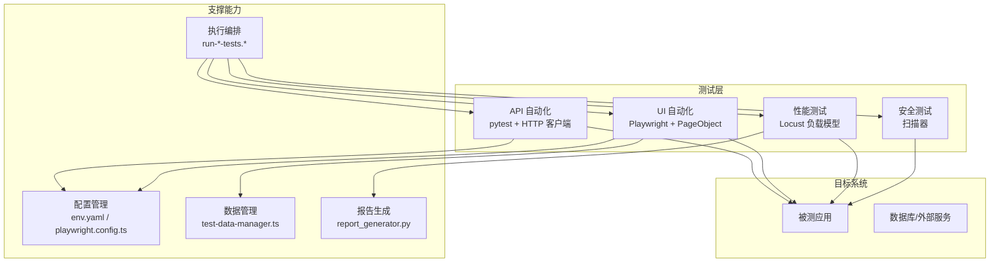
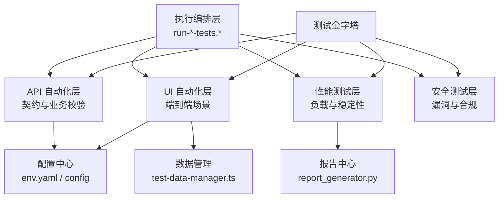
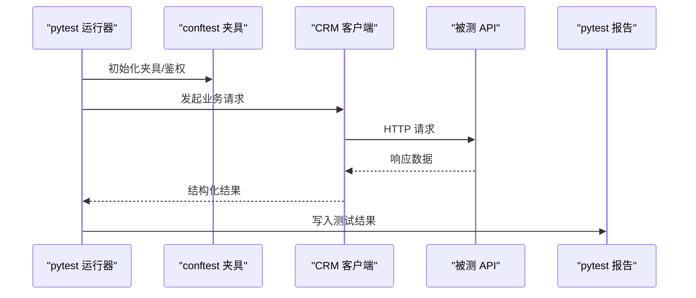
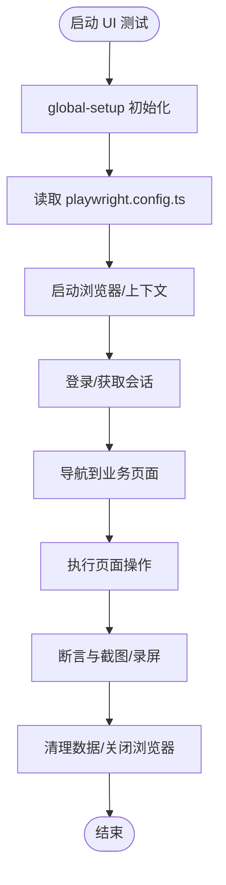
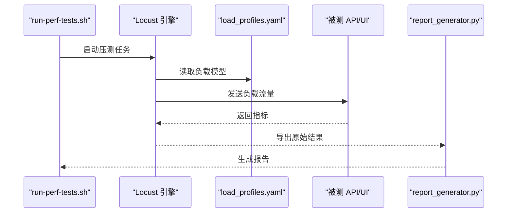
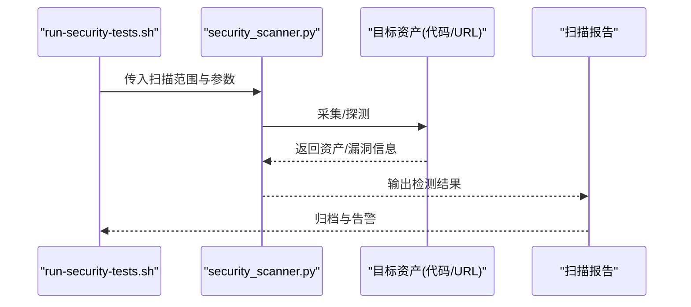
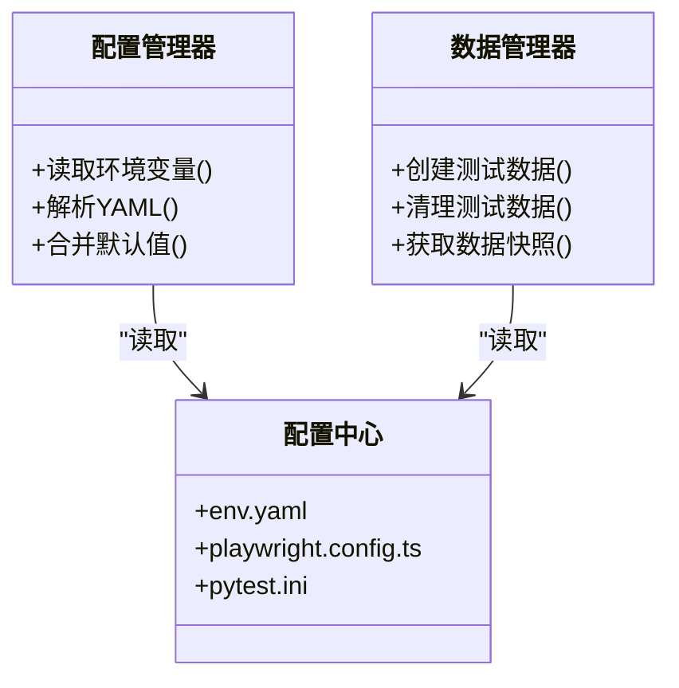
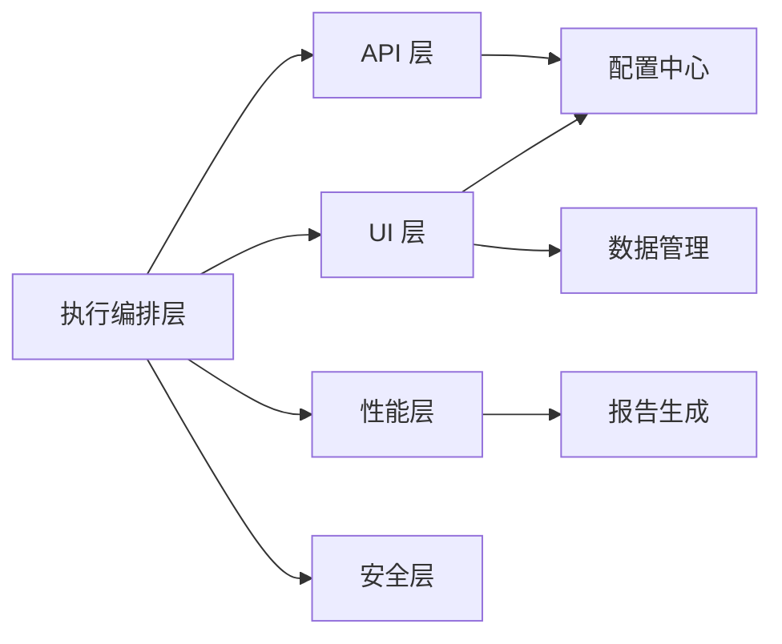

# 整体架构概览

<cite>
**本文引用的文件**   
- [tests/api/conftest.py](file://tests/api/conftest.py)
- [tests/api/pytest.ini](file://tests/api/pytest.ini)
- [tests/api/clients/base_client.py](file://tests/api/clients/base_client.py)
- [tests/api/clients/crm_client.py](file://tests/api/clients/crm_client.py)
- [tests/config/env.yaml](file://tests/config/env.yaml)
- [tests/ui/playwright.config.ts](file://tests/ui/playwright.config.ts)
- [tests/ui/global-setup.ts](file://tests/ui/global-setup.ts)
- [tests/ui/pages/BasePage.ts](file://tests/ui/pages/BasePage.ts)
- [tests/ui/utils/test-data-manager.ts](file://tests/ui/utils/test-data-manager.ts)
- [tests/performance/locust/README.md](file://tests/performance/locust/README.md)
- [tests/performance/locust/config/load_profiles.yaml](file://tests/performance/locust/config/load_profiles.yaml)
- [tests/performance/locust/utils/report_generator.py](file://tests/performance/locust/utils/report_generator.py)
- [tests/security/scanner/security_scanner.py](file://tests/security/scanner/security_scanner.py)
- [scripts/run-api-tests.sh](file://scripts/run-api-tests.sh)
- [scripts/run-ui-tests.sh](file://scripts/run-ui-tests.sh)
- [scripts/run-perf-tests.sh](file://scripts/run-perf-tests.sh)
- [scripts/run-security-tests.sh](file://scripts/run-security-tests.sh)
- [stage-manifests/schema.yaml](file://stage-manifests/schema.yaml)
</cite>

## 目录
1. [简介](#简介)
2. [项目结构](#项目结构)
3. [核心组件](#核心组件)
4. [架构总览](#架构总览)
5. [详细组件分析](#详细组件分析)
6. [依赖关系分析](#依赖关系分析)
7. [性能考量](#性能考量)
8. [故障排查指南](#故障排查指南)
9. [结论](#结论)
10. [附录](#附录)

## 简介
本文件为 AutoTest Hub 框架的整体架构概览，聚焦于分层架构与测试金字塔的实现方式，明确 API 测试层、UI 自动化层、性能测试层与安全测试层的职责边界与交互关系。文档同时定义系统边界、技术栈选择与关键架构决策，并通过高层架构图展示模块间的依赖和数据流向，帮助开发者快速理解系统结构与扩展点。

## 项目结构
仓库采用按“测试类型 + 工具链”的目录组织方式：
- tests/api：基于 pytest 的接口自动化，包含客户端封装、用例套件与配置
- tests/ui：基于 Playwright 的前端 UI 自动化，包含 Page Object、全局初始化与数据管理
- tests/performance：基于 Locust 的性能压测，包含负载模型、报告生成与结果输出
- tests/security：安全扫描入口与基础扫描器
- scripts：跨平台执行脚本（API/UI/性能/安全）
- stage-manifests：阶段化编排清单与 schema，用于流水线集成

图表来源
- [tests/api/conftest.py](file://tests/api/conftest.py)
- [tests/ui/playwright.config.ts](file://tests/ui/playwright.config.ts)
- [tests/ui/utils/test-data-manager.ts](file://tests/ui/utils/test-data-manager.ts)
- [tests/performance/locust/utils/report_generator.py](file://tests/performance/locust/utils/report_generator.py)
- [scripts/run-api-tests.sh](file://scripts/run-api-tests.sh)
- [scripts/run-ui-tests.sh](file://scripts/run-ui-tests.sh)
- [scripts/run-perf-tests.sh](file://scripts/run-perf-tests.sh)
- [scripts/run-security-tests.sh](file://scripts/run-security-tests.sh)

章节来源
- [tests/api/conftest.py](file://tests/api/conftest.py)
- [tests/api/pytest.ini](file://tests/api/pytest.ini)
- [tests/ui/playwright.config.ts](file://tests/ui/playwright.config.ts)
- [tests/ui/global-setup.ts](file://tests/ui/global-setup.ts)
- [tests/performance/locust/README.md](file://tests/performance/locust/README.md)
- [scripts/run-api-tests.sh](file://scripts/run-api-tests.sh)
- [scripts/run-ui-tests.sh](file://scripts/run-ui-tests.sh)
- [scripts/run-perf-tests.sh](file://scripts/run-perf-tests.sh)
- [scripts/run-security-tests.sh](file://scripts/run-security-tests.sh)

## 核心组件
- 测试执行器（编排层）
  - 通过 run-*-tests.* 脚本统一触发各层测试，屏蔽底层差异，提供一致的参数与产物路径约定。
- 配置管理器
  - API 层使用 pytest 插件与 conftest 进行环境加载；UI 层通过 playwright.config.ts 集中管理浏览器、超时、截图等；共享环境参数由 env.yaml 提供。
- 数据管理器
  - UI 层通过 test-data-manager.ts 提供测试数据的构造、清理与复用；API 层在 conftest 中可注入数据准备钩子。
- 报告生成器
  - 性能层通过 report_generator.py 聚合 Locust 结果并生成可视化报告；其他层遵循各自工具的默认报告机制。
- 客户端封装
  - API 层 base_client.py 抽象通用请求能力，crm_client.py 实现领域特定接口封装，提升用例可读性与复用性。
- 页面对象
  - UI 层 BasePage.ts 作为所有页面的基类，封装等待、断言、日志与错误捕获等横切关注点。

章节来源
- [tests/api/conftest.py](file://tests/api/conftest.py)
- [tests/api/clients/base_client.py](file://tests/api/clients/base_client.py)
- [tests/api/clients/crm_client.py](file://tests/api/clients/crm_client.py)
- [tests/ui/playwright.config.ts](file://tests/ui/playwright.config.ts)
- [tests/ui/global-setup.ts](file://tests/ui/global-setup.ts)
- [tests/ui/pages/BasePage.ts](file://tests/ui/pages/BasePage.ts)
- [tests/ui/utils/test-data-manager.ts](file://tests/ui/utils/test-data-manager.ts)
- [tests/performance/locust/utils/report_generator.py](file://tests/performance/locust/utils/report_generator.py)
- [tests/config/env.yaml](file://tests/config/env.yaml)

## 架构总览
下图展示了分层架构与测试金字塔的实现方式：API 层位于中间层，覆盖大多数业务逻辑验证；UI 层位于顶层，聚焦端到端关键路径；性能与安全测试横向贯穿，分别评估吞吐与风险面。

图表来源
- [scripts/run-api-tests.sh](file://scripts/run-api-tests.sh)
- [scripts/run-ui-tests.sh](file://scripts/run-ui-tests.sh)
- [scripts/run-perf-tests.sh](file://scripts/run-perf-tests.sh)
- [scripts/run-security-tests.sh](file://scripts/run-security-tests.sh)
- [tests/config/env.yaml](file://tests/config/env.yaml)
- [tests/ui/utils/test-data-manager.ts](file://tests/ui/utils/test-data-manager.ts)
- [tests/performance/locust/utils/report_generator.py](file://tests/performance/locust/utils/report_generator.py)

## 详细组件分析

### API 自动化层（pytest + HTTP 客户端）
- 设计要点
  - 通过 conftest.py 完成夹具与生命周期管理，如会话、鉴权、数据准备与清理。
  - base_client.py 抽象公共请求方法（重试、鉴权头、错误码处理），crm_client.py 面向 CRM 域做语义化封装。
  - pytest.ini 定义运行参数、标记与插件行为，便于 CI 集成。
- 数据流
  - 用例 -> 夹具（conftest）-> 客户端封装（base/crm）-> 被测 API -> 断言与报告。
- 典型调用序列

图表来源
- [tests/api/conftest.py](file://tests/api/conftest.py)
- [tests/api/clients/base_client.py](file://tests/api/clients/base_client.py)
- [tests/api/clients/crm_client.py](file://tests/api/clients/crm_client.py)
- [tests/api/pytest.ini](file://tests/api/pytest.ini)

章节来源
- [tests/api/conftest.py](file://tests/api/conftest.py)
- [tests/api/pytest.ini](file://tests/api/pytest.ini)
- [tests/api/clients/base_client.py](file://tests/api/clients/base_client.py)
- [tests/api/clients/crm_client.py](file://tests/api/clients/crm_client.py)

### UI 自动化层（Playwright + PageObject）
- 设计要点
  - playwright.config.ts 集中管理浏览器、网络拦截、截图/视频、并行度等。
  - global-setup.ts 负责全局前置（如登录态持久化、环境初始化）。
  - BasePage.ts 提供通用交互、等待策略、异常捕获与诊断信息收集。
  - test-data-manager.ts 提供测试数据工厂、清理与隔离。
- 典型流程

图表来源
- [tests/ui/global-setup.ts](file://tests/ui/global-setup.ts)
- [tests/ui/playwright.config.ts](file://tests/ui/playwright.config.ts)
- [tests/ui/pages/BasePage.ts](file://tests/ui/pages/BasePage.ts)
- [tests/ui/utils/test-data-manager.ts](file://tests/ui/utils/test-data-manager.ts)

章节来源
- [tests/ui/playwright.config.ts](file://tests/ui/playwright.config.ts)
- [tests/ui/global-setup.ts](file://tests/ui/global-setup.ts)
- [tests/ui/pages/BasePage.ts](file://tests/ui/pages/BasePage.ts)
- [tests/ui/utils/test-data-manager.ts](file://tests/ui/utils/test-data-manager.ts)

### 性能测试层（Locust）
- 设计要点
  - README.md 说明运行方式与产物位置。
  - load_profiles.yaml 定义不同负载模型（并发、持续时间、RPS 等）。
  - report_generator.py 聚合结果并生成报告。
- 执行序列

图表来源
- [tests/performance/locust/README.md](file://tests/performance/locust/README.md)
- [tests/performance/locust/config/load_profiles.yaml](file://tests/performance/locust/config/load_profiles.yaml)
- [tests/performance/locust/utils/report_generator.py](file://tests/performance/locust/utils/report_generator.py)
- [scripts/run-perf-tests.sh](file://scripts/run-perf-tests.sh)

章节来源
- [tests/performance/locust/README.md](file://tests/performance/locust/README.md)
- [tests/performance/locust/config/load_profiles.yaml](file://tests/performance/locust/config/load_profiles.yaml)
- [tests/performance/locust/utils/report_generator.py](file://tests/performance/locust/utils/report_generator.py)
- [scripts/run-perf-tests.sh](file://scripts/run-perf-tests.sh)

### 安全测试层（扫描器）
- 设计要点
  - security_scanner.py 提供统一的扫描入口与规则集，支持对 API 与前端资源进行静态/动态检查。
  - run-security-tests.sh 将扫描纳入统一执行管线。
- 执行序列

图表来源
- [tests/security/scanner/security_scanner.py](file://tests/security/scanner/security_scanner.py)
- [scripts/run-security-tests.sh](file://scripts/run-security-tests.sh)

章节来源
- [tests/security/scanner/security_scanner.py](file://tests/security/scanner/security_scanner.py)
- [scripts/run-security-tests.sh](file://scripts/run-security-tests.sh)

### 配置管理与数据管理
- 配置管理
  - env.yaml 提供跨层共享的环境变量（如 URL、账号、开关）。
  - playwright.config.ts 管理 UI 层运行时配置。
  - pytest.ini 管理 API 层运行参数。
- 数据管理
  - test-data-manager.ts 提供数据工厂、幂等创建与清理策略，避免用例间污染。

图表来源
- [tests/config/env.yaml](file://tests/config/env.yaml)
- [tests/ui/playwright.config.ts](file://tests/ui/playwright.config.ts)
- [tests/api/pytest.ini](file://tests/api/pytest.ini)
- [tests/ui/utils/test-data-manager.ts](file://tests/ui/utils/test-data-manager.ts)

章节来源
- [tests/config/env.yaml](file://tests/config/env.yaml)
- [tests/ui/playwright.config.ts](file://tests/ui/playwright.config.ts)
- [tests/api/pytest.ini](file://tests/api/pytest.ini)
- [tests/ui/utils/test-data-manager.ts](file://tests/ui/utils/test-data-manager.ts)

## 依赖关系分析
- 执行编排层对测试层存在强依赖，但测试层之间解耦，通过配置与数据管理进行松耦合协作。
- 配置中心被多测试层共用，确保一致的运行环境。
- 报告生成器仅被性能层直接依赖，其他层沿用各自工具的报告机制。

图表来源
- [scripts/run-api-tests.sh](file://scripts/run-api-tests.sh)
- [scripts/run-ui-tests.sh](file://scripts/run-ui-tests.sh)
- [scripts/run-perf-tests.sh](file://scripts/run-perf-tests.sh)
- [scripts/run-security-tests.sh](file://scripts/run-security-tests.sh)
- [tests/config/env.yaml](file://tests/config/env.yaml)
- [tests/ui/utils/test-data-manager.ts](file://tests/ui/utils/test-data-manager.ts)
- [tests/performance/locust/utils/report_generator.py](file://tests/performance/locust/utils/report_generator.py)

章节来源
- [scripts/run-api-tests.sh](file://scripts/run-api-tests.sh)
- [scripts/run-ui-tests.sh](file://scripts/run-ui-tests.sh)
- [scripts/run-perf-tests.sh](file://scripts/run-perf-tests.sh)
- [scripts/run-security-tests.sh](file://scripts/run-security-tests.sh)
- [tests/config/env.yaml](file://tests/config/env.yaml)
- [tests/ui/utils/test-data-manager.ts](file://tests/ui/utils/test-data-manager.ts)
- [tests/performance/locust/utils/report_generator.py](file://tests/performance/locust/utils/report_generator.py)

## 性能考量
- 并行执行
  - UI 层可通过 playwright.config.ts 调整并行度；API 层借助 pytest-xdist 提升吞吐。
- 资源隔离
  - 数据管理器保证用例间数据隔离，避免脏读与竞争条件。
- 缓存与复用
  - 登录态与会话在 global-setup 中复用，减少重复开销。
- 报告与监控
  - 性能层报告生成需考虑大结果集的 I/O 优化，建议异步落盘与增量汇总。

[本节为通用指导，不直接分析具体文件]

## 故障排查指南
- 执行失败
  - 检查 run-*-tests.sh 的参数与环境变量是否正确传递。
  - 确认 playwright.config.ts 与 env.yaml 中的地址、端口、凭据与实际环境一致。
- UI 不稳定
  - 优先查看 BasePage.ts 的等待策略与重试逻辑；必要时增加显式等待或降低并行度。
  - 利用 global-setup.ts 的初始化日志定位登录态问题。
- 性能报告缺失
  - 确认 report_generator.py 的输出路径与权限；检查 locust 原始结果是否完整。
- 安全扫描无结果
  - 核对 security_scanner.py 的目标范围与规则集；确认网络可达与鉴权。

章节来源
- [scripts/run-api-tests.sh](file://scripts/run-api-tests.sh)
- [scripts/run-ui-tests.sh](file://scripts/run-ui-tests.sh)
- [scripts/run-perf-tests.sh](file://scripts/run-perf-tests.sh)
- [scripts/run-security-tests.sh](file://scripts/run-security-tests.sh)
- [tests/ui/playwright.config.ts](file://tests/ui/playwright.config.ts)
- [tests/ui/global-setup.ts](file://tests/ui/global-setup.ts)
- [tests/ui/pages/BasePage.ts](file://tests/ui/pages/BasePage.ts)
- [tests/performance/locust/utils/report_generator.py](file://tests/performance/locust/utils/report_generator.py)
- [tests/security/scanner/security_scanner.py](file://tests/security/scanner/security_scanner.py)

## 结论
AutoTest Hub 以清晰的层次划分与稳定的执行编排为核心，结合配置与数据管理能力，实现了 API、UI、性能与安全四类测试的统一接入与协同。该架构具备良好的可扩展性与可维护性，适合在持续集成环境中稳定运行，并为后续引入更多质量保障能力（如契约测试、混沌工程）预留了空间。

## 附录
- 阶段化编排
  - stage-manifests/schema.yaml 定义了阶段清单的结构约束，可用于流水线编排与版本化管理。

章节来源
- [stage-manifests/schema.yaml](file://stage-manifests/schema.yaml)